# Changelog

This page documents the major changes and improvements for each version of the Incremental Everything (Plus) plugin.

## v1.0.45 - August 14th, 2026

### ✨ New - all the settings are in one window now

The last five settings that stayed in RemNote's own plugin panel — **Enable Flashcard Prioritisation**, **Performance Mode**, the two **Always Use Light Mode** switches and **Enable Hide-in-Queue Powerups and Commands** — have moved into the plugin's settings popup with everything else, and are editable there. The plugin's section of **Settings → Plugins → Incremental Everything** is now empty.

They were kept back on the theory that RemNote's own panel is where you would look first if the plugin ever felt heavy. There was no heaviness to chase, so the split bought nothing and cost a second place to look.

Your values carry over on the first load, and anything you had already changed in the popup is left alone. The five settings appear in RemNote's panel for that one session, with a note saying so, and are gone after the next reload.

#### Technical explanation

`SEED_VERSION` goes to 6 and the `native` tier is deleted outright — one `SettingTier`-shaped branch each in `readRawSetting`, `setIESetting`, the registration filter and four places in the popup. The bump no longer re-reads everything: up to v5 a version bump forced a full re-read from RemNote's panel, which was safe only while the panel was younger than the blob. Now that the popup is where people edit, and a value equal to its default is stored as an *absent* key, a blanket re-read would resurrect pre-migration panel values and silently undo later edits. `ADOPTED_AT_VERSION` names the ids each version takes over, and only those are read across. Registration follows the same list, so a knowledge base moving from v5 to v6 sees five entries in RemNote's panel for one session rather than all thirty-four a second time.

📖 [Where the settings are](Plugin-Settings-Reference.md#where-the-settings-are)

### 🐛 Fixed - a renamed setting could lose its value during the migration

The migration drops blob keys that are no longer settings, and it did that *before* running the renames — so a setting whose id had changed had its old key deleted a step before the rename needed to read it, and the value fell back to the default. Only *Skip Mastery Drill* → *Enable Mastery Drill* was ever affected. The renames now run first.

📖 [Where the settings are](Plugin-Settings-Reference.md#where-the-settings-are)

## v1.0.44 - August 14th, 2026

### ✨ New - the CardPriority cleanup no longer has to be all-or-nothing

**Remove All CardPriority Tags** is now **Remove CardPriority Tags…** and asks which tags to remove:

- **Inherited & default only (recommended)** — the tags the plugin wrote by itself. Manual priorities, the `incremental` anchors left by dismissed Incremental Rems, tags with an unreadable source, and your shield history are all kept. **Reversible:** *Update all inherited Card Priorities* rebuilds them exactly.
- **Everything** — the old behaviour, now behind a chain of warnings that state how many manual priorities are about to be destroyed, and offer the reversible scope one dialog before the last.

Both scopes count what they found before touching anything, and name the knowledge base they are about to modify.

#### Technical explanation

One scan classifies every tag by its `prioritySource` into derived (`inherited`/`default`), intentional (`manual`/`incremental`) and unknown. The derived scope removes only the first bucket — an unrecognised source could be a manual priority whose source slot was lost, so a non-destructive pass will not gamble on it. KB scoping is explicit in two layers: the powerup comes from `getPowerupByCode`, so foreign CardPriority powerups left by cross-KB imports are never enumerated, and every tagged id is re-resolved through `rem.findOne` before it is written to. The partial scope also prunes only the removed rows from the session cache and the persisted copy, instead of emptying both — an empty cache would read as "this KB has no priorities" and hide the manual ones it just preserved.

📖 [Remove CardPriority Tags…](Plugin-Commands-Reference.md#remove-cardpriority-tags)

### ✨ New - turning flashcard prioritisation off now offers to clean up after itself

Switching **Enable Flashcard Prioritisation** off stops the machinery, but the tags it already wrote stayed on your Rems with no hint of how to get rid of them. On the next reload the plugin now counts them and offers the reversible cleanup, in one dialog; declining explains how to run it later. Offered **once per switch-off**, and never on Light Mode devices — the cleanup is a KB-wide write, so it waits for a Full Mode session.

#### Technical explanation

Native-tier settings have no change event, so the gate's value is recorded per knowledge base in synced storage and compared on activation. The new value is written *before* the dialog opens, so declining or crashing cannot turn the offer into a nag, and a first sighting only establishes the baseline (an opt-out is indistinguishable from a fresh install otherwise). The check is fired from `onActivate` without being awaited.

📖 [Switching it back off](Priorities-for-Flashcards.md#switching-it-off)

## v1.0.43 - August 14th, 2026

### ✨ New - filter a document down to just the Rems that hold an image

RemNote's search indexes text, so images are invisible to it. The new **Tag Rems With Images** command (`quick: img`) tags every Rem holding an image with **`HasImage`** — then `Cmd/Ctrl+Shift+F` → `HasImage` collapses the document to its figures, and a **Search Portal** on the same tag collects them across documents.

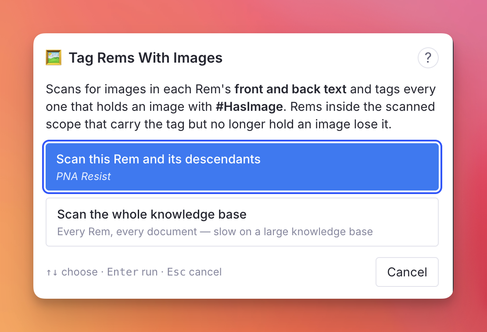{ width="700" }

- **Two scopes:** the focused Rem (or open document), named on the button, or the whole knowledge base.
- **Front *and* back text**, so an image on the back of a flashcard counts.
- **Self-correcting:** a re-run clears the tag from Rems whose image is gone.
- **Keyboard-driven:** `↑`/`↓` choose, `Enter` runs, `Esc` cancels. The `HasImage` chip is hidden from the editor tag bar.

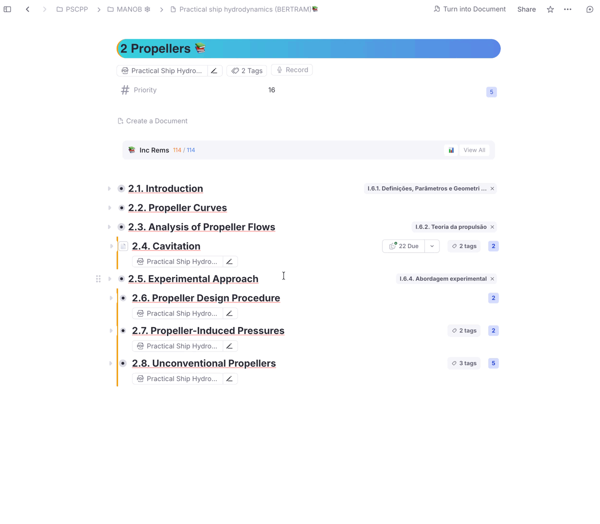

#### Technical explanation

An image is a rich-text element with `i: 'i'`, so detection is a plain scan of `text` and `backText`. Tag membership is read **once** via the powerup's `taggedRem()` rather than a `hasPowerup` per Rem — that shape is a bridge round trip for every Rem in the document — and only Rems whose state changes are written to. The walk yields every 200 Rems so the progress line repaints.

`HasImage` is a slotless powerup, not a plain tag Rem: RemNote's Filter lists powerups alongside tags, and an applied-powerup pill carries a stable `data-test`, which is what lets its chip be hidden without also hiding the user's own tags on the same Rem.

📖 [Filter a Document by Images](Utilities.md#filter-a-document-by-images)

### ✨ New - a pin that leads to an image is ringed

A **pin whose target holds an image** gets a blue ring after the scan mentioned above, so you can tell which links lead to a figure without following them. It follows the tag, so it needs the scan to have run — and clears itself when a re-scan finds the image gone.

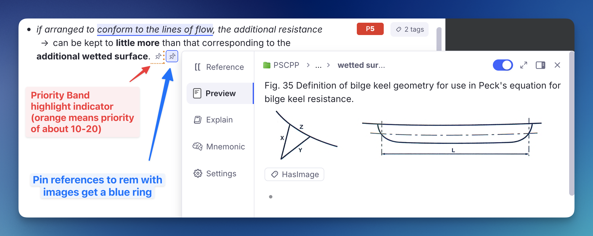{ width="800" }

#### Technical explanation

`data-rem-tags` on a reference container describes the **referenced** Rem, not the host — so `[data-rem-reference-pin="true"][data-rem-tags~="hasimage"]` reads as "this pin points at a Rem holding an image". The pin attribute alone would ring every pin in the knowledge base and therefore say nothing.

Colours come from RemNote's `--rn-clr-border-accent` / `--rn-clr-border-selected` tokens, so the ring follows light and dark mode without a `.dark` branch.

📖 [Pins that lead to an image are ringed](Utilities.md#pins-that-lead-to-an-image-are-ringed)

### 📚 Docs - the Utilities page is grouped, and its table of contents is complete again

[Utilities](Utilities.md) now sorts its commands into five groups — **Text & Lists**, **Outline & Headings**, **Finding & Navigating**, **Queue Display Utilities** and **Under the Hood** — and the sidebar lists all of them. It had been showing only the first section's subsections, hiding two thirds of the page. Two stale changelog links were repaired in the same pass.

📖 [Utilities](Utilities.md)

## v1.0.42 - August 13th, 2026

### ✨ New - the card info bar now shows the next stability, and tells the truth about intervals if you don't review at 90% retention

The FSRS strip under each flashcard reads `D: 4.04 · S: 2.5y (1.3y passed) → 4.2y · R: 93.7%`: the arrow is the **stability a Good rating would leave the card with**, previously buried in the SInc tooltip. You can now see where the card is heading without hovering anything.

The second half matters if you have moved your scheduler off the FSRS default. Stability *is* the interval only at **90% requested retention**; at 95% RemNote schedules a card at roughly 0.40× its stability, at 85% roughly 1.91×. The plugin had no way of knowing, so its U-Factor — the ratio of your next interval to the interval you just cleared — was quietly reporting the 90% figure to everyone.

A new **Requested Retention** setting (**IE Settings → FSRS**, default `90`%) fixes that. Set it to whatever RemNote uses and:

- The interval that next stability really converts to is printed next to it: `S: 2.5y (1.3y passed) → 4.2y (int. 1.7y)`.
- The **U-Factor** divides by that real interval. Off the default it prints both: `U-Factor: 3.11× (3.30×)` — yours first, the 90% textbook figure in parentheses.
- Hovering **D · S · R** spells out the conversion for the current card, and the U-Factor tooltip carries both figures for Hard / Good / Easy.
- **D, S and R are untouched.** They describe your memory, not your scheduling target.

#### Technical explanation

Inverting the forgetting curve for the time at which R equals the requested retention gives `t = S / FACTOR × (R^(1/DECAY) − 1)`, so the interval-to-stability ratio depends only on the retention — `intervalFactorForRetention` in `lib/fsrs.ts` returns it, and is exactly `1` at 0.9 by construction (that identity is what "interval ≡ stability" means). `computeFSRSState` takes the retention as a third, defaulted argument and now returns `nextS`, `nextInterval`, `intervalFactor` and both U-Factors, so callers that do not care about scheduling (the queue-session recorder, the repetition history popup) keep the old behaviour untouched. The retention is stored as a percentage because that is how the setting reads, and divided down at the single point of use.

📖 [Requested Retention](Reviewing-Items-in-the-Queue.md#requested-retention)

## v1.0.41 - August 13th, 2026

### ✨ New - Weighted Shield popup: how much more likely is one priority to be drawn than another?

The **Weighted Shield Breakdown** tab ends with a new **🎲 Queue Selection Odds** panel. Set two items — say one at the 15th percentile and one at the 35th — and it tells you, in one number, how much more often the queue draws the first: `1.58× · Item A is more likely to be drawn`, plus the head-to-head split (`61.2% / 38.8%`) if only those two competed for a slot.

Either side can be entered as a **relative percentile** or as an **absolute priority**, and the panel always shows both — type `35` as an absolute priority and it reports the percentile that priority actually reaches in the chosen universe, converted through the very same sorted population the bucket tables above are built from. The universe dropdown covers every combination the popup has data for: Incremental Rems or Cards, Knowledge Base or Document Scope — and your selection is remembered on your device, so the panel reopens where you left it.

Under each side sits a **real sample item** at that priority — the capped text of an actual Rem — so the comparison isn't two abstract numbers. A front/back Rem shows both sides as `front → back`, the same arrow format the priority popups use, and clozed spans are marked `{{ }}` — in either universe, since a Rem can be an Incremental Rem and a flashcard at the same time. Click a sample to open the Rem, or press 🎲 to draw another one at the same priority.

The odds are not a new metric: an item's lottery tickets are the Weighted-Shield weight `W = e^(−k × p/100)`, so the ratio is `e^(k × Δp/100)` and depends only on the *gap* between the two percentiles. The panel reads your synced `weightSelectionK` and your randomness setting for the selected item type and prints both in the header, so the figures reflect your configuration rather than the defaults.

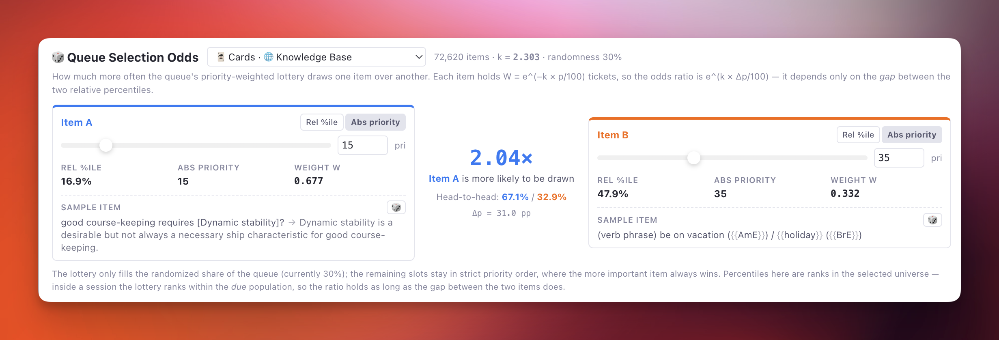{ width="900" }

#### Technical explanation

The percentile ⇄ absolute-priority conversion reuses `breakdown.sortedItems` — the priority-ascending snapshot already shipped to the popup for the threshold slider — so no extra data crosses the plugin bridge and the two panels can never disagree about a percentile. Sample items are the only thing that needs Rem ids: those are read lazily from the session caches (`all-incremental-rem-slim`, `all-card-priority-info-key`) the first time a universe is selected, indexed by priority once, and re-sampled locally on every 🎲. Document-scoped pools intersect with the queue's cached scope ids; when the popup was opened from the editor and no cached scope exists, sampling falls back to the KB pool and the sample carries a hover caveat saying so.

📖 [Queue Selection Odds](Prioritization-&-Sorting.md#queue-selection-odds)

### ✨ New - `Ctrl+Shift+J` in the queue now works on the Rem you have open in the previewer

Reading an item in the queue and spotting another Incremental Rem you want to work on — in the previewer (`P`), in the sidebar, anywhere — used to be awkward: `Ctrl+Shift+J` ignored what you had selected and acted on the queue item instead, silently. It now targets your **selection**, the same way `Ctrl+D` already did, and opens the [Execute Repetition popup](Reviewing-Items-in-the-Editor.md#opened-from-the-queue-previewer) for it. The previewer *is* an editor surface, so it gets the editor flow: you set the review time and interval, and nothing is written until you confirm.

The interesting part is the clock. While an Incremental Rem turn is running in the queue, the plugin is timing it — so minutes you spend on a Rem in the previewer were, until now, silently credited to the item on screen:

- **Confirm Review** records the review on the previewed Rem and **deducts those minutes** from the running turn. You stay in the queue, and whatever ends that turn later (Next, Dismiss, Reschedule) records only the remainder. Do it for three Rems in a row and all three deductions apply.
- **⏱️ Start Timer** navigates away, abandoning the turn — so it now asks first, naming the item you are leaving and how long it has been on screen. The repetition is recorded either way (that reading was real); you choose whether the item is **rescheduled** or **left due today**, the latter being the default and behaving exactly like dragging **Next** down. A **Carry to this Rem** field moves any minutes you actually spent in the previewer out of that recording and **back-dates the new timer** by the same amount, so they land on the Rem they belong to.

With nothing selected — and for the **Review in Editor** button — the command still acts on the queue item exactly as before.

#### Technical explanation

Both queue commands now resolve their target through one helper (`lib/queue_target.ts`), so selection-wins-over-queue-item is decided in a single place rather than twice with different rules. It also reports whether the queue is genuinely on the target's Incremental turn: no card from the SDK (Plugin queue items have none) **and** `currentIncRemKey` pointing at that rem.

Time accounting rides on the existing `incremReviewStartTimeKey` baseline instead of a parallel timer: a deduction moves the baseline **forward** by the recorded span (clamped to what has actually elapsed), so every consumer of the turn's duration sees the corrected figure without knowing about any of this. Leaving the turn goes through `finishQueueIncRemTurn`, which records the repetition — via the normal scheduler for *Reschedule*, or with a today timestamp for *Leave it due* — and then clears the baseline, so the rem you jump to can never inherit it. The confirmation renders as an overlay inside the Execute Repetition popup, like the Scheduling Conflict dialog: a nested popup would close its parent.

📖 [Opened from the queue previewer](Reviewing-Items-in-the-Editor.md#opened-from-the-queue-previewer) · [Review in Editor](Reviewing-Items-in-the-Queue.md#review-in-editor)

### ✨ Improved - lifecycle markers in the Repetition History now show the time of day

The history rows for repetitions have always shown the wall-clock time under the date. The **event banners** — ▶ Made Incremental, ⏸ Dismissed, 📅 Rescheduled in Editor, ✏️ Manual Date Reset — showed only the date, even though the exact timestamp was already stored.

That made a day with several lifecycle events unreadable: made incremental → dismissed → made incremental again → dismissed, all stacked as "Aug 13, 2026" with no way to tell the order apart from their position. Each banner now carries its time next to the date, after a separator dot: `⏸ Dismissed — Aug 13, 2026 · 09:44`.

📖 [Event Markers](Getting-Started.md#event-markers)

### 📚 Docs - the Keyboard Shortcuts page now also lists every binding by key

The [Keyboard Shortcuts](Keyboard-Shortcuts.md) page listed shortcuts only **by function** — fine when you know the task you want, useless when you half-remember a key or want to know which combinations are still free before assigning your own. It now carries a second index, **[Shortcuts by Key](Keyboard-Shortcuts.md#shortcuts-by-key)**, grouped the way a keyboard map is: single keys, function keys, `Shift+`, `Ctrl+`, `Opt+`, `Ctrl+Shift+`, `Opt+Shift+`, `Ctrl+Opt+`, `Cmd/Ctrl+`. A closing table lists the commands that ship deliberately **unbound**, with their quick codes.

Four shortcuts were missing from the page altogether and are now documented under a new **Sources & Reading** group: **`Opt+O`** (Open Hovered Source in Popup), **`Opt+Shift+O`** (Open Hovered Source in Floating Window), **`Ctrl+Shift+F1`** (Copy Rem Sources) and **`Opt+Shift+V`** (Paste Rem Sources).

A new **Keys Inside Plugin Popups** section covers the keys that only exist while a widget is open, and had never been written down in one place: `Enter` / `Esc` / `Tab` in the priority and reschedule popups, the four `Enter` variants of the Find Rem picker (reference, pin, text + pin, open in pane), and `Esc` to close the floating source window without closing the queue.

#### Corrections

Three bindings were documented wrongly elsewhere and have been fixed: Change Priority is **`Opt+P`**, not `Ctrl+P` ([Reviewing Items in the Queue](Reviewing-Items-in-the-Queue.md#change-priority)); the Quick Priority shortcuts are **`Ctrl+Opt+↑/↓`**, not `Ctrl+Shift+↑/↓` ([Prioritization & Sorting](Prioritization-&-Sorting.md#quick-priority-shortcuts)); and the [Priority Step Size](Plugin-Settings-Reference.md#priority) they move by defaults to **5**, not 10.

📖 [Keyboard Shortcuts → Shortcuts by Key](Keyboard-Shortcuts.md#shortcuts-by-key)

### 🐛 Fixed - `Ctrl+D` on a Rem you were not reviewing recorded a repetition that never happened

Dismissing an Incremental Rem with `Ctrl+D` **while the queue was showing something else** — a Rem opened in the previewer (`P`) during a flashcard turn, or any Rem you had selected — wrote a **`rep` entry** into its history before dismissing it, complete with a review duration. Nothing had been reviewed. Worse, the duration was borrowed: it was the time elapsed since the *last Incremental Rem the queue had injected*, so a Rem you made incremental and dismissed within a minute could be credited with half an hour of reading.

Those minutes then counted as real everywhere history is read — total time on the item, the [Aggregated History](Plugin-Widgets-Reference.md#212-increm-repetition-history-aggregated-view) totals of every ancestor, and the [Study Dashboard](Study-Dashboard.md).

`Ctrl+D` now records a repetition **only when the queue was actually on that Rem's Incremental turn** — exactly the case the **Dismiss** button covers. Used on any other Rem it is a pure lifecycle change: history is transferred to the Dismissed state and the power-up removed, like `Ctrl+D` in the editor. Since nothing on screen moves in that case, a toast now names the Rem that was dismissed.

For the same reason, `Ctrl+D` no longer removes the **current card** from the queue when that card is a flashcard: the card was still due and being reviewed, and dropping it silently ate a scheduled repetition.

`Ctrl+Shift+J` could borrow the same clock, and worse: pressed during a flashcard turn whose Rem happened to be incremental, it executed a repetition on that Rem with the stale duration *and* advanced its interval, leaving a corrupted chain in an item that stays in rotation. That path is gone — see the previewer targeting above; when no Incremental review is in progress, the reading clock is cleared before anything is recorded.

Phantom entries already written can be removed with the 🗑 button on the row — see [Recording and correcting records](Plugin-Widgets-Reference.md#recording-and-correcting-records).

#### Technical explanation

The queue branch of the command built its `rep` entry unconditionally, reading `incremReviewStartTimeKey` for the duration. That session key is stamped when `GetNextCard` injects an Incremental Rem and is **never cleared afterwards**, so on a flashcard turn it still holds the previous IncRem's start time. The command's existing `isTargetingQueueContext` flag was not a guard against this — it is only true when the target *is* the current queue item, and it is also true when the current item is a flashcard whose Rem happens to be incremental, or when there is no selection at all.

The command now derives an explicit `isActiveIncRemTurn`: the SDK reports no current card (Plugin queue items have none) **and** `currentIncRemKey` equals the Rem being dismissed. Both halves are required — on a flashcard turn `currentIncRemKey` still points at the previously injected IncRem, so it can never be trusted on its own. That flag gates both the `rep` entry and the `removeCurrentCardFromQueue` advance.

📖 [Dismiss](Reviewing-Items-in-the-Queue.md#dismiss)

## v1.0.40 - August 12th, 2026

### 🐛 Fixed - Dismissing a Rem with no flashcards yet threw its priority away

Dismissing an Incremental Rem is supposed to leave its priority behind on the Rem, so that flashcards made from that material later inherit it. It only did so if the Rem — or a descendant within three levels — already owned a flashcard at that moment. Everything else was dismissed silently untagged, and its priority went with the `Incremental` powerup.

That hit precisely the wrong Rems. A PDF section you read, extracted from, and dismissed typically has no cards *of its own* — only extracted Incremental Rem children. Set it to 16, dismiss it, and it kept nothing; the cards you cloze out of those extracts afterwards inherited from whatever distant ancestor happened to carry a priority, often a much lower one.

The flashcard search is gone. Dismiss now always writes the priority onto the Rem's `cardPriority` tag, in Light Mode and Full Mode alike. A priority you set **manually** on that Rem is still never overwritten.

This applies to Dismiss wherever it appears: the queue's answer buttons, the [Editor Review Timer](Reviewing-Items-in-the-Editor.md#the-workflow)'s **✓ Dismiss**, and the *Dismiss Incremental Rem* command.

#### Technical explanation

`handleCardPriorityInheritance` ran a two-tier check in Full Mode: `getCards()` on the Rem, then a batched `getCards()` sweep over `getDescendantsToDepth(rem, 3)`. Light Mode already skipped all of it and tagged directly, so the two modes disagreed about what a dismissal means — and the "thorough" branch was the one losing data. Both tiers are removed; the function is now a `manual`-source guard plus a single `setCardPriority(..., 'incremental')`, which also drops a subtree walk from every Dismiss.

The depth-3 limit made this worse than it looks: cards deeper than great-grandchildren were invisible to the check, so even Rems that *did* have flashcards below them could go untagged.

Nothing changes for the inheritance **cascade** over descendants, which still tags only nodes that actually own flashcards — that restriction exists to prevent [rogue CardPriority tags](Troubleshooting.md#rogue-cardpriority-tags-sanitization) on tag slots and property values, and is unrelated to anchoring the dismissed Rem itself.

📖 [Priority Sources](Priorities-for-Flashcards.md#priority-sources) · [Dismiss is the same in both modes](Full-Mode-x-Light-Mode.md#counter-example-dismiss-is-the-same-in-both-modes)

### 🎨 Changed - Queue Dashboard: the Sessions Summary Speed column can now be read in seconds per card

The **Speed** column of the Sessions Summary table was fixed to cards per minute, while the History Log below it showed both readings. Its header now carries a small unit button — click it to switch the whole column between **cpm** and **s/card**.

The chosen unit is remembered on your device and survives restarts, so the table always opens the way you last left it. It is not synced: each device keeps its own preference.

The column is now colour-coded on the same red → green gradient the live session card and the History Log already used. The colour follows the underlying pace, not the printed number, so a given pace looks the same in either unit — 1.5 cpm and 40 s/card are both fully red, 4 cpm and 15 s/card both fully green.

The table's large figures also read more easily: card counts, Incremental Rem counts and hour totals now carry thousands separators — `269,461` rather than `269461`, `15,024h 49m` rather than `15024h 49m`.

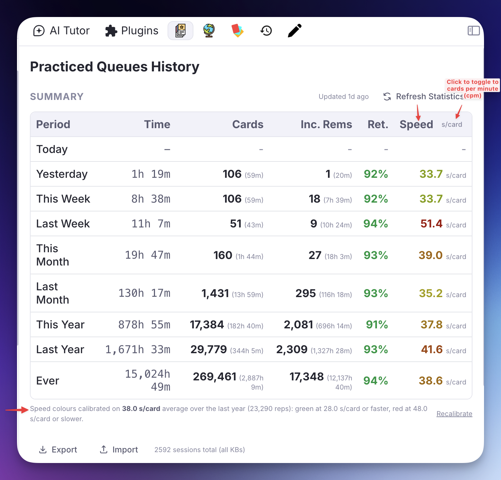{ width="800" }

📖 [Speed units in the Sessions Summary](History-Queue-Dashboard-and-Mastery-Drill.md#speed-units-in-the-sessions-summary) · [Speed colour coding](History-Queue-Dashboard-and-Mastery-Drill.md#speed-colour-coding)

### ✨ New - Queue Dashboard: speed colours calibrated from your own history

Until now, "red" meant 1.5 cards per minute and "green" 4, for everyone. Those numbers say little if your cards are long extracts or one-word clozes. A new **Queue Dashboard** section in the IE Settings popup places both ends of the gradient, in either of two ways.

**Calibrated from your card history** is the new default. The plugin measures your average seconds-per-card over a window you choose — *Ever*, *last year*, *last month* or *last week* — and puts the gradient around it: your average sits mid-gradient, a margin of *N* seconds faster is fully green, the same margin slower is fully red. With a 24 s/card average and the default 10 s margin, that is green at 14 s/card and red at 34. The colours then tell you how this session compares with how you normally work, rather than with a universal figure.

**Fixed limits** is the alternative, and keeps the old behaviour with the two cards-per-minute values now editable. Their defaults are exactly what the dashboard used before, so choosing this mode and leaving the numbers alone restores precisely what you had.

While calibrated mode is selected, the settings section itself shows the average it is working from — in both **cpm** and **s/card**, with the number of repetitions behind it and the green and red points your margin produces — and a **Recalibrate** button beside it.

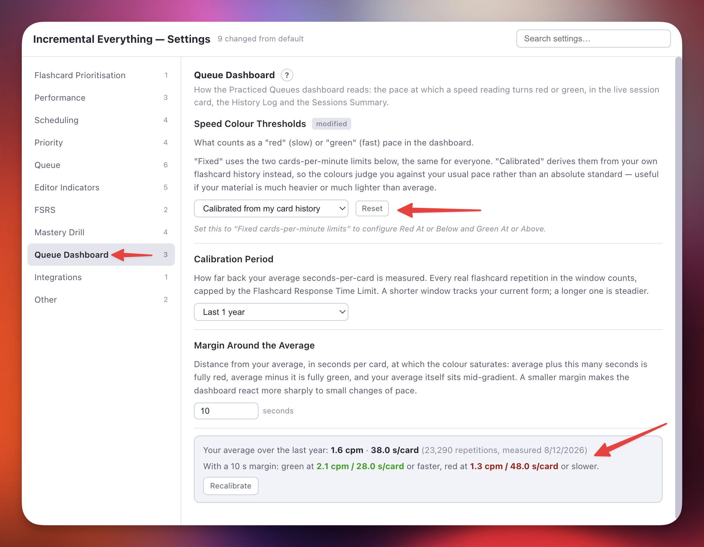{ width="900" }

Only real repetitions count — *Again*, *Hard*, *Good*, *Easy* — each capped by the **Flashcard Response Time Limit**, so a card left on screen while you stepped away cannot skew the average.

In calibrated mode the Sessions Summary gains a caption stating the scale actually in force — the measured average, how many repetitions it came from, and the resulting green and red points — with a **Recalibrate** link for an immediate re-measurement.

#### Technical explanation

Measuring the average means reading the repetition history of every card in the knowledge base — far too heavy to do on each render. The result is cached **on your device** (never synced: it is derived data any device can rebuild, and the window is a personal reading preference) and re-measured only when the cache is missing, came from another knowledge base, was measured for a different period, or is more than **seven days** old. A module-level guard means two dashboards opening at once still walk the cards only once.

Nothing waits on it. The dashboard paints immediately with whatever is available — the fixed limits, or a still-valid cached calibration — and repaints if a background measurement produces something better. A window with no reviews in it says so and stays on the fixed limits, rather than colouring everything from an average of zero. Since the mode is on by default, that amounts to one history walk the first time the dashboard (or the Queue Dashboard settings section) is opened, then none for a week.

📖 [Choosing your own limits](History-Queue-Dashboard-and-Mastery-Drill.md#choosing-your-own-limits) · [Queue Dashboard settings](Plugin-Settings-Reference.md#queue-dashboard)

## v1.0.39 - August 12th, 2026

### ⚡ Improved: Incremental Rems no longer go missing from the queue in large knowledge bases

On large knowledge bases, Incremental Rems sometimes failed to appear at their turn — a flashcard showed up instead, and the item you should have seen was skipped for the rest of the session. The plugin now decides the next item ahead of time, while you read the current one, so it is always ready the instant RemNote asks. Background work is lighter too.

Nothing changes about *which* item you get: the same priority order, the same due filter, the same randomness. Only the timing of the decision changed.

Two smaller fixes ride along:

- An Incremental Rem that was prepared but never actually shown is no longer counted as reviewed — it comes back on the next turn instead of disappearing for the session.
- [Priority Review Documents](Priority-Review-Document.md) scoped to the whole knowledge base could record a wrong **Shield** history point when the queue was opened during the plugin's startup. Those points are now correct.

#### Technical explanation

RemNote gives a plugin about **one second** to answer its "what is the next item?" request. Past that it stops waiting and loads a flashcard of its own, discarding the plugin's answer with no error and no event — which is why nothing ever reported a problem.

Measurements on a 5,525-Incremental-Rem knowledge base found answers landing at 623ms, 863ms, 969ms and 993ms, with one dropped at 1088ms. The plugin was never slow at *computing* the answer: sorting and filtering all 5,525 items took 0–3ms every time. The entire cost was round-trips to RemNote, and those are unpredictable — two trivial reads of a single stored value measured anywhere from 13ms to 631ms depending only on how busy the connection was at that instant. Small knowledge bases never hit the limit, which is why the problem looked size-dependent.

So the answer is no longer computed on demand. The blocking checks, the interval setting and a small buffer of already-validated candidates are kept in memory and refreshed in the background while you read the current item; the request itself is now answered without a single round-trip, in **0–1ms**. Validation of the next candidate — the most expensive step, at 114–231ms — moved into that same background window.

Marking an item as seen was also moved to *after* it is confirmed on screen. RemNote reports enough in each request to tell exactly what happened to the previous one, so a discarded item is now returned to the front of the buffer and retried rather than burned.

📖 [How the plugin prioritizes due items](Prioritization-&-Sorting.md#prepared-in-advance)

## v1.0.38 - August 11th, 2026

### ⚡ Improved: the flashcard priority cache now starts from a saved copy

Everything that reads flashcard priorities — the Card Shield, the relative percentiles, the priority badges, [Priority Review Documents](Priority-Review-Document.md) — works from one index built when the plugin starts. Building it means reading three stored values for every prioritised rem, which on a 45,000-rem knowledge base is about **135,000 reads and 100 seconds**. It never blocked anything, but for that first minute and a half the shield had nothing to show.

The plugin now keeps a copy of that index on your device and starts from it, re-reading only the rems that changed since it was saved.

**Measured on a 45,085-rem knowledge base: 108 seconds to build from scratch, 14 seconds from the saved copy.** Most of the remaining time is loading the flashcards, which happens every start regardless — whether a card is due changes with the clock, so those counts are never reused.

The copy is written **once**, straight after the index is built. Nothing rewrites it while you work: it is read at exactly one moment, the next time the plugin starts, so keeping it current during a session would be several megabytes of writing that nothing reads. Instead the plugin notes only the *identifiers* of flashcards whose priority changed — a few bytes each — and the next start re-reads just those.

None of this affects what you see. Priorities, percentiles and the Card Shield still update the instant you change a priority; those come from a separate in-memory index that is written immediately, every time.

The copy is never synced. It is derived data each device can rebuild for itself, and syncing several megabytes of it would be wasteful — so it is stored as a single item, unconstrained by the 900 KB cap that applies to synced storage.

It is also used only where it can be trusted. The plugin rebuilds from scratch when there is no copy yet, when it came from another knowledge base or an older version, when **more than seven days have passed since the last full rebuild**, or when a spot-check of a couple of hundred priorities disagrees with what is actually stored. Starting quickly from the copy does not reset that seven-day clock — otherwise the rebuild could be postponed forever.

That limit exists for one specific gap. Editing a **Priority** property row by hand is noticed and recorded while the plugin is running — but doing it on **another device**, or with the plugin disabled, leaves nothing to detect, because that edit changes a hidden child of the rem rather than the rem itself. Rebuilding weekly bounds how long such an edit can stay stale.

The command **Refresh Card Priority Cache** deliberately ignores the saved copy: it re-reads every priority from the database and rebuilds the copy from what it finds. It is what you run when you suspect a priority is wrong, and answering that with a copy derived from the same suspect state would make it useless in the one case anyone runs it.

📖 [Startup: how the priority cache is built](Priorities-for-Flashcards.md#startup-cache)

### 🎨 Changed: the Priority property row no longer clutters new knowledge bases

The **CardPriority** powerup's Priority slot is now registered to show only in the document view rather than under every tagged rem in the outline. This affects **newly created knowledge bases only** — RemNote fixes a slot's display position when the slot is first created, so existing knowledge bases keep theirs. You can change it yourself from RemNote's own property settings.

### 🔧 Debug: snapshot, restore and cache tooling

Four additions to the debug widget, all under **Raw Slot Diagnostics**:

- **CardPriority Snapshot / Restore** — captures every rem's priority, source and last-updated values to a downloaded JSON file (and to local storage), verifies the current state against a capture, and restores from it. Worth running before any bulk re-prioritisation, repair pass or import. On a 45,085-rem knowledge base the capture is about 4.7 MB.
- **Warm-Start Store** — shows the saved copy described above, and clears it to force a rebuild from scratch.
- **Local storage per-key ceiling** — measures how large a single stored item may be. RemNote's documented 900 KB cap applies to *synced* storage; this found no limit up to 128 MB for unsynced local storage, which is what allowed the saved copy to be one item rather than 23 pieces.
- **Cache freshness readout** — the Card Priority Powerup section now shows the cached priority next to the stored one, so a stale cache is visible rather than inferred.

## v1.0.37 - August 11th, 2026

### 🐛 Fixed: the Flashcard History sidebar had stopped recording

Everything you practised was still being scheduled and counted correctly, but the **Flashcard History** sidebar had quietly stopped adding new cards. Nothing on screen said so — the list simply stayed as it was.

The list is stored as a single item in the plugin's synced storage, which RemNote caps at **900 KB**. It held every knowledge base's cards in one array, up to 1000 of them, each with a text preview of up to 1000 characters. That array had reached the ceiling, so every attempt to add a card to it was refused — including the ones written from the [Mastery Drill](History-Queue-Dashboard-and-Mastery-Drill.md#mastery-drill) popup and from card clusters, which record through the same list.

A detail worth recording, because it also affects how full other keys really are: the ceiling is counted in **UTF-16 bytes**, which is *twice* the size the plugin's own diagnostics reported. A list measuring 512 KB was in fact 1009 KB against the limit.

The fix has four parts:

- **Each knowledge base now has its own list.** Both sidebars already showed only the KB you were in, so all the other KBs' entries were being stored and synced just to be discarded on screen.
- **The preview text is capped at 400 characters**, applied to the whole preview rather than to the front and the back separately — previously an entry could hold 1000 characters, since 500 was allowed on each side.
- **A byte budget** trims a list further whenever its entries are unusually long, so a write can no longer be rejected — a count limit alone could never guarantee that.
- **Two fields are no longer stored:** a random row id, now derived from the card itself, and a leftover expand/collapse flag that nothing has read since row state moved into the sidebar.

Your existing history is split across your knowledge bases automatically, without losing entries, the first time each list is read or written.

### ♻️ Changed: Visited Rem History is also per knowledge base

The same treatment, for the same reason: its list was at 27% of the ceiling and growing with every knowledge base you visit. It keeps the 500 most recent visits per KB, with the same 400-character preview — twice what it stored before, since its old limit was 200 characters per side but is now 400 for the whole preview.

### ♻️ Changed: study statistics are stored per knowledge base

The **Refresh Statistics** recompute writes your daily study totals — every day you have ever practised — into the plugin's storage. All knowledge bases shared one item, so each Refresh rewrote and re-synced the lot. Measured on one knowledge base, **half of every write belonged to KBs that had not been studied in for months.**

Each knowledge base now owns its totals. A Refresh writes only what it computed, dormant knowledge bases are never touched again, and the item that was at 67% of RemNote's ceiling drops to 33% — roughly doubling the years of daily records it can hold.

**No history is dropped.** These records go back to 2016 for imported study logs, and the Summary's **Ever** row depends on every one of them. Splitting the storage is what keeps all of it affordable; the alternative would have been discarding old days. The split happens automatically on first load, without a recompute, and an installation still holding the oldest storage format is converted and split in the same pass.

### 🔧 Debug: the synced-storage audit now measures against the real ceiling

The **Synced Storage Key Audit** in the debug widget reported sizes in UTF-8 bytes, which understated every key by half against a limit counted in UTF-16. It now shows each key in all three plausible units with a **% worst** column, and two new tools sit beside it:

- **Calibrate size ceiling** — writes a scratch key up to the point RemNote refuses it, using three different alphabets, and reads off which unit the limit is actually counted in. This is what identified UTF-16.
- **Key anatomy** — breaks one key down into where its bytes go. For a list: entry count, cost per field, the fattest entries, and what capping entries or preview text would save. For a partitioned store such as the study statistics: one row per knowledge base with its size, share and date span, plus what sharding it or applying a retention window would actually save — measured rather than estimated.

📖 See [How the history lists are stored](History-Queue-Dashboard-and-Mastery-Drill.md#how-the-history-lists-are-stored) for the limits that now apply, and [Refresh Statistics](History-Queue-Dashboard-and-Mastery-Drill.md#refresh-statistics-authoritative-summary-recompute) for where study totals are kept.

## v1.0.36 - August 10th, 2026

### 🐛 Fixed: chapters indented under the wrong chapter in the PDF Control Panel

The **All Rems Using This PDF** tree could show a sub-section nested under a chapter whose pages don't contain it — *2.4 Cavitation* (p.59–62) sitting under *6 Ship Maneuvering* (p.242–299), for instance.

The nesting itself was right; the **order** was not. The list is drawn flat and indented by depth, so a row reads as a child of whatever precedes it — and dismissed chapters were sorted to the bottom of the list, away from the parent they belonged to. They landed one indent below the last chapter on the list and appeared to belong to it. The list is now emitted so that **every chapter is followed immediately by its own sub-sections**.

This surfaced with [v1.0.34](#v1034-august-5th-2026): once page ranges moved onto the Rem, dismissed chapters kept theirs and so gained a place in the tree. Before that they had no range and simply sat flush-left at the bottom, where nothing looked out of place.

Two related fixes came with it:

- **A chapter and its first sub-section usually start on the same page** (Chapter 4 opens on p.30, and so does 4.1). That tie was previously broken arbitrarily, and when the sub-section came out first the chapter was never recognised as its container — so it did not nest at all. The wider range now always comes first.
- **A dismissed chapter can now be the parent of a live one.** Sorting dismissed rems to the bottom had also hidden them from the containment search, so an Incremental sub-section under a dismissed chapter was flattened to the top level.

The current rem is no longer pulled to the top of the list — that was what displaced it from its own position in the book. It is marked by its highlighted border and **Current** chip, and the panel scrolls it into view when it opens.

### ✨ New: page range and history are editable on dismissed chapters

A dismissed chapter keeps its page range and reading history, but the panel offered it only **Make Incremental** — the same as a rem that had never been Incremental, and the two were indistinguishable on screen.

Dismissed chapters now carry a **Dismissed** chip, and expanding one gives **📄 Range**, **📖 History** and **⚡ Restore**. So you can correct a chapter's page range while tidying up a book without having to bring it back into your queue first. **★ Priority** stays hidden, since a dismissed rem has no schedule for a priority to act on.

Rems that are neither Incremental nor dismissed are unchanged: they still offer only **Make Incremental**, because they have nowhere to store a page range yet.

📖 See [Hierarchical Tree View](PDF-Incremental-Reading-Workflow.md#hierarchical-tree-view) for how the containment tree is built, and [Dismissed Chapters in the Panel](PDF-Incremental-Reading-Workflow.md#dismissed-chapters-in-the-panel) for what each row offers.

## v1.0.35 - August 7th, 2026

### 🐛 Fixed: priorities showing the wrong number after a RemNote update

RemNote's storage/sync overhaul re-pointed some powerup properties at the wrong slot definition — unnamed ones, the *other* priority powerup's, or ones that had since been deleted. **No value was ever lost**: it stayed on the Rem, in a property the plugin could no longer reach. What you saw instead was the fallback. Because both priority powerups use a slot displayed as "Priority", they got crossed with each other.

RemNote fixed the bulk of it in **1.27.24**. This release deals with what survived that fix, and with the reporting that hid it:

- **Incremental priorities are recovered from the Rem's own history** when the slot cannot be read, instead of silently substituting a default. The displayed number now also says where it came from, so a recovered or placeholder value can never pass for a stored one.
- **A repair for Card Priority**, which has no history to fall back on and so was the only case genuinely showing wrong values. It reads the value off the unreachable property and rewrites it through the normal path, keeping the original source and timestamp.
- **Diagnostics to check your own knowledge base** — a raw dump for one Rem and a whole-KB scan — plus a guarded cleanup for the stray `Unnamed — 42` rows the repair leaves behind.

> [!NOTE]
> **If your priorities look wrong after a RemNote update, please get in touch.** The tools above will tell you whether your knowledge base is affected and by how much, and they write nothing. Reports are especially valuable if the damage appears on a RemNote version **after 1.27.24**, or looks different in shape from what is documented — that would point at a path not yet seen. Open an issue on the [plugin's issue tracker](https://github.com/bjsi/incremental-everything/issues) with the scan output.

One related fault is still outstanding on RemNote's side: some **Next Rep Date** properties reference a Daily Document that no longer exists, so RemNote's date row shows `Loading` indefinitely. Scheduling is unaffected — the plugin keeps its own copy of the next-repetition date and reads that — but the date chip cannot be edited by hand until it is rebuilt.

📖 See [Priorities Wrong or Empty After a RemNote Update](Troubleshooting.md#priorities-wrong-or-empty-after-a-remnote-update) for how to check your own knowledge base and what the repair does.

## v1.0.34 - August 5th, 2026

### 🐛 Fixed: a PDF could open the wrong chapter

When a chapter Incremental Rem had its PDF source removed, it could linger in the plugin's index of "rems that use this PDF". Opening that PDF then resolved the *detached* chapter as the one to read — and it did so in preference to a correctly-linked chapter sitting further down the same list, because the lookup took the first entry it found without checking the PDF was still one of that rem's sources. It now checks.

### ♻️ Changed: reading state is stored on the Rem itself

Your **current page, page range, page history, active PDF and read points** used to live in the plugin's own storage, filed under keys built from the Rem's id. They now live on the Rem, in a hidden property.

Nothing changes in how you use any of it, and nothing needs migrating by hand — each item moves itself the first time it is opened. What changes is what happens to it afterwards:

- **Reading history now survives dismissal.** Dismissing a chapter and later making it Incremental again (`Alt+X`) used to leave its reading position behind; the state now travels with the Rem in both directions. This applies to read points on outline-style Rems too, which were similarly lost before.
- **Reading history now survives losing the PDF source.** If you detach a chapter from its PDF — a common step once a section is processed, since the source pulls every one of the book's highlights into that chapter's scoped queue — the reading history stays on the chapter rather than becoming unreachable.
- **Deleting a chapter now deletes its reading data.** Previously the plugin had no way to remove those entries, so every deleted chapter left its page position and history behind permanently.

The same move applies to the distribution graph inside a **Priority Review Document**: its data now lives on the graph Rem, so deleting the document takes the graph data with it instead of stranding it.

> [!NOTE]
> This is the second instalment of a broader cleanup, prompted by the storage limits RemNote introduced in 1.27.16 (see [v1.0.29](#v1029-august-1st-2026)). Around 480 of the plugin's storage entries move onto the Rems they describe. Existing data is read and migrated as you go — there is no upgrade step and nothing to click.

📖 See [PDF Incremental Reading Workflow](PDF-Incremental-Reading-Workflow.md#multiple-pdf-sources-active-pdf-switcher-and-preferthispdf) for how the active PDF is resolved, and [Read Points](Reviewing-Items-in-the-Editor.md#read-points-for-rem-type-incremental-rems) for outline reading positions.

## v1.0.33 - August 5th, 2026

### ✨ New: a settings popup of the plugin's own

RemNote's plugin settings panel is one flat list, and this plugin had grown to more than thirty entries in it. **`Incremental Everything: Settings`** (quick code `ies`) opens a proper settings window instead: grouped by area, searchable, with a **?** beside entries that links straight to the section of this manual explaining them, and a *Reset* on anything you have changed from its default.

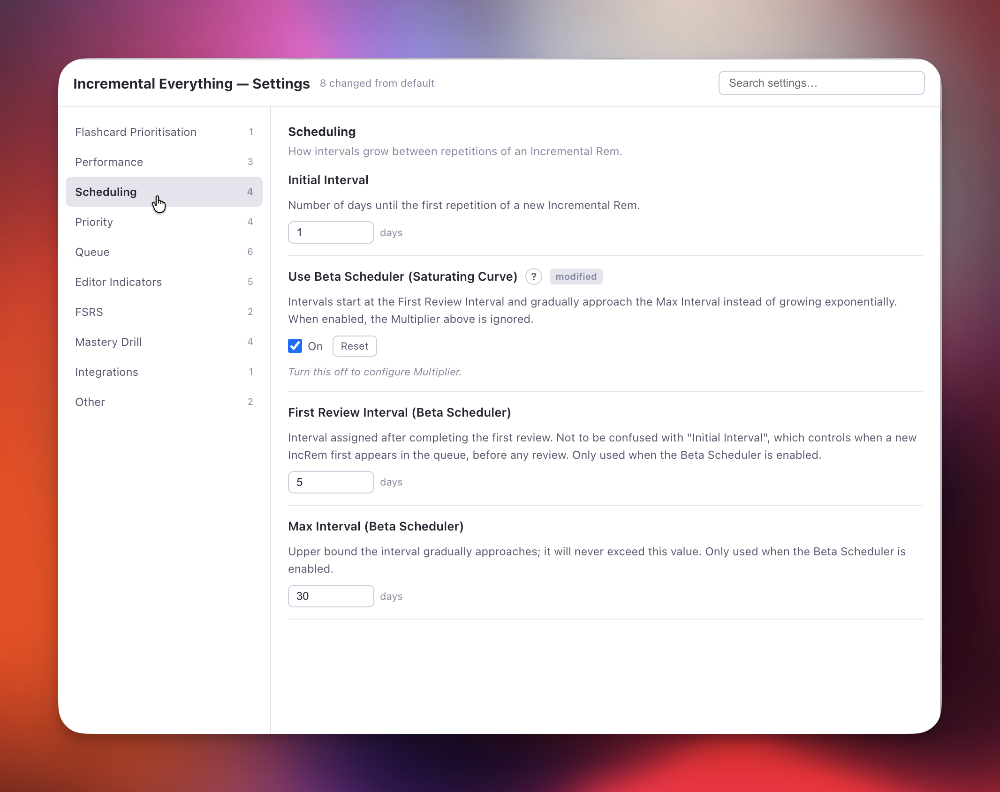{ width="900" }

It also hides what does not apply. The Beta Scheduler's *First Review Interval* and *Max Interval* appear only once that scheduler is on; the *Multiplier* disappears when it is, since the saturating curve ignores it; the Mastery Drill's parameters appear only when the drill is enabled. Each switch says which settings it reveals, so nothing vanishes without explanation.

Your existing settings are carried over on first load — nothing to re-enter — and the ones that moved disappear from RemNote's panel afterwards.

**Five settings deliberately stay in RemNote's panel**: *Enable Flashcard Prioritisation*, *Performance Mode*, the two *Always Use Light Mode* switches and *Enable Hide-in-Queue Powerups and Commands*. Those govern how much work the plugin is allowed to do, and RemNote's own panel is where you would go looking if it ever felt heavy — quite possibly before you knew this popup existed. They are shown in the popup too, read-only, pointing at where to change them.

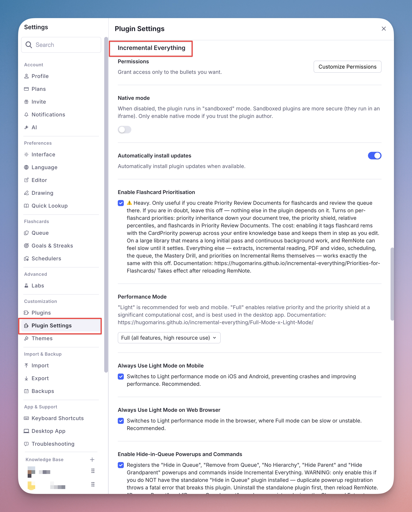{ width="550" }

📖 [Plugin Settings Reference → Where the settings are](Plugin-Settings-Reference.md#where-the-settings-are)

### ♻️ Changed: flashcard prioritisation is now opt-in, and off by default

Per-flashcard priorities are the one part of this plugin that works across your **entire** knowledge base rather than on the Rems you are handling: it tags every flashcard-bearing Rem with the `cardPriority` powerup and keeps those tags in step as you edit. On a large library that is a long initial pass and continuous background work — and most people never needed it, because it exists to serve one feature: flashcards inside [Priority Review Documents](Priority-Review-Document.md).

It now waits to be asked. **Settings → Plugins → Incremental Everything → Enable Flashcard Prioritisation**, off by default.

With it off, **nothing else changes**. Extracts, incremental reading, PDF and video, the scheduler, the queue, the Mastery Drill and priorities on Incremental Rems themselves are untouched. A flashcard's inherited priority is still resolved and still displayed everywhere — the plugin walks up the ancestry on each read instead of storing the answer. Priorities you set yourself are still saved: `Alt+P` records `manual`, and dismissing an Incremental Rem still stamps `incremental` on the flashcards beneath it, because both are deliberate acts on identified Rems.

What waits is the bulk index — the KB-wide tagging pass, the inheritance cascade over descendants, the priority cache, and what is built on them: the Priority Shield, relative percentiles, and flashcards in Priority Review Documents.

📖 [Priorities for Flashcards → Switching it on](Priorities-for-Flashcards.md#the-opt-in)

### ♻️ Changed: the Mastery Drill is opt-in too, and "Skip Mastery Drill" is now "Enable Mastery Drill"

While the drill is active the plugin watches every flashcard rating and maintains the list of cards to drill, and registers the drill popup, its command and the sidebar notification. That is a reasonable cost if you use the workflow and pure overhead if you do not, so it now waits to be switched on: **Enable Mastery Drill**, in the settings popup under *Mastery Drill*.

The old switch was a double negative that shipped on. If you had turned *Skip Mastery Drill* on, the drill stays off — the value is inverted and carried over for you. **If you use the Mastery Drill and never touched that setting, switch the new one on after upgrading.**

📖 [History, Queue Dashboard & Mastery Drill → Mastery Drill](History-Queue-Dashboard-and-Mastery-Drill.md#mastery-drill)

### ⚡ Improved: far fewer full card-database reads, as RemNote asked

Following RemNote's request that plugins stop loading unbounded numbers of Rems, four operations that used `card.getAll()` now read the priority cache already built for them, or ask only about the Rems involved — leaving no whole-database read on any path you touch while editing or reviewing. A welcome side effect: priority inheritance now propagates on **mobile and in the web browser**, where it used to be skipped because the database load made it too expensive.

📖 [Full Mode × Light Mode](Full-Mode-x-Light-Mode.md)

## v1.0.32 - August 5th, 2026

### ✨ New: record study done outside RemNote, and correct the records you already have

The **Repetition History** popup was a read-only log. Two things it could not express: study that happened away from RemNote (a paper read on a train, a chapter in the physical book), and a record that came out wrong — a session whose timer ran on after you stopped reading, or one you forgot to start.

**➕ Session** *(header button)* records a study session after the fact: a **date**, the **end time** of the session, the **total time** spent, and an optional note. The entry is logged with a **📖** indicator as an *external session* and counts towards the Rem's reps, its total time, the Study Dashboard and the scheduler's repetition count — exactly as an in-app editor review (⌨️) does.

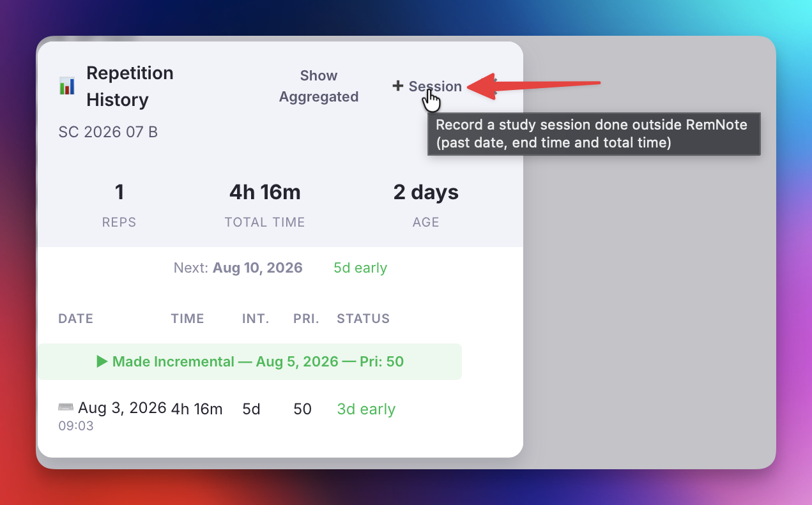{ width="400" }

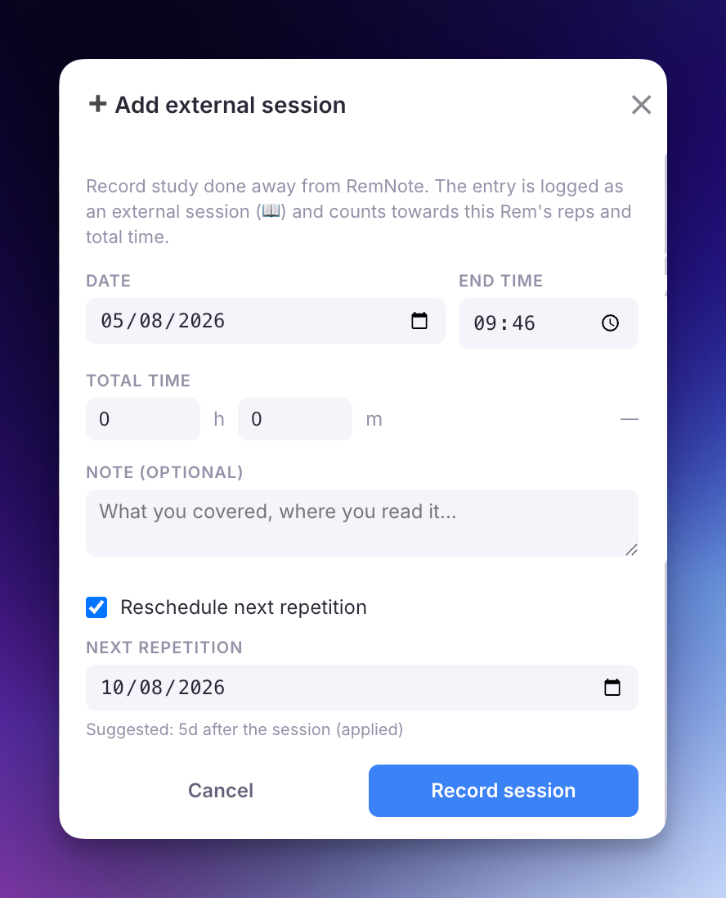{ width="400" }

Whether it also moves the schedule depends on where it lands in the log:

- **Newest record** (or the Rem's first) — the dialog offers **Reschedule next repetition**, prefilled with the interval the scheduler would give the Rem right now, counted from the session's date. This mirrors `Ctrl+Shift+J`: you studied it, so it gets scheduled forward. Untick to record the time only.
- **Backdated** — the schedule is left untouched, and the dialog says so. Bookkeeping must not overwrite a due date that later reviews have already set.

Its **early/late status** is measured against what was genuinely due at that moment — read from the next-repetition date stamped on the last record preceding it — not against today's due date.

**✏️ Edit** and **🗑 Delete** appear at the right edge of any record when you hover it, on event banners as well as review rows. Editing changes a record's date, end time, total time and note — early/late status is recomputed and the log is re-sorted chronologically, but the schedule is never touched. Deleting confirms first, reports the study time about to leave the Rem's totals, and warns when the record is a lifecycle marker, since removing a *Made Incremental* or *Dismissed* marker changes how the scheduler counts repetitions. Both work on dismissed Rems too.

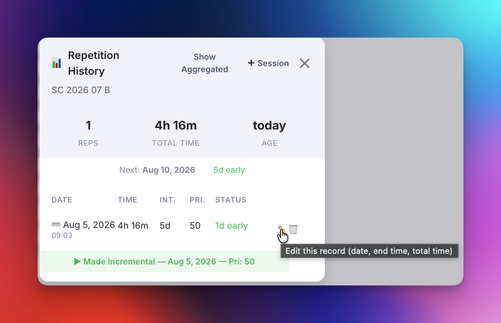{ width="400" }

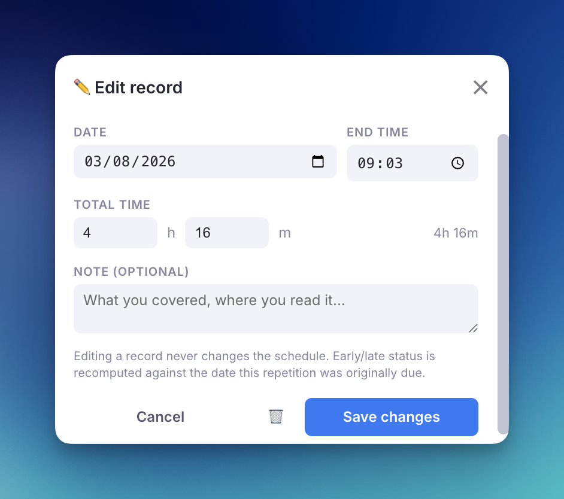{ width="400" }

The popup itself is now **440px wide** (was 380px), so the header carries *Show Aggregated*, *➕ Session* and the close button on one line while the history grid keeps its column widths beside the new per-row actions.

📖 See [Widgets → IncRem Repetition History: recording and correcting records](Plugin-Widgets-Reference.md#recording-and-correcting-records).

## v1.0.31 - August 5th, 2026

### ✨ Improved: orphan card removal now shows what you'd be deleting

The confirmation dialogs of **Update all inherited Card Priorities** used to identify orphan cards by Rem id and count alone — leaving you to approve a deletion with no idea whether those cards carried years of reviews or none at all.

Every dialog in the flow now reports the **length of the review history and the total time spent**:

- the **overview** states the reviews and study time about to be deleted (and, when you chose to keep the reviewed cards, what is being preserved);
- the **detail pages** show it per missing Rem, and per card when one Rem has several;
- the **preserve-history prompt** and the *delete ALL* warning quantify what the reviewed cards actually hold;
- the **final summary** reports the reviews and time genuinely removed — counted from the cards that actually got deleted, so a partial failure can't overstate the loss.

Cards with nothing recorded read `no review history`. Time is summed from each rep's `responseTime`, capped at your **Flashcard Response Time Limit** setting so a single walked-away review can't inflate the figure — the same convention the Study Dashboard uses. Detail pages now show **12 Rems per page** instead of 25, since each entry carries an extra line.

📖 See [Commands → Update all inherited Card Priorities](Plugin-Commands-Reference.md#system-maintenance-commands) for the full cleanup flow.

## v1.0.30 - August 3rd, 2026

Housekeeping release, prompted by the storage limits described in v1.0.29. Everything here reduces what the plugin keeps in — and writes to — RemNote's plugin storage. Two of these were genuine defects that the new limits merely exposed.

### 🐛 Fixed: the Study Dashboard's lifetime statistics had silently stopped updating

The store holding your day-by-day review totals had grown to **1.21MB** — roughly 7,250 daily buckets covering your entire review history — which is past RemNote's new 900KB ceiling for a single plugin value. Writes over that ceiling are *rejected rather than truncated*, and the rejection was being swallowed, so every recomputation was quietly discarded and the dashboard's lifetime figures froze at whatever had last been saved.

The store is now written compactly: your knowledge base's id is recorded once instead of once per day, and each day is a plain row of numbers rather than a block of repeated field names. Same data, **about a third of the size** — no day of history is lost. The conversion runs by itself the next time the plugin starts and needs none of the APIs RemNote removed in 1.27.16, so it works even on the broken build.

One limitation while 1.27.16 stands: this restores the plugin's *ability* to save these statistics, but recomputing fresh ones still walks every flashcard, which needs the removed `card.getAll` back.

### ⚡ Improved: expanding a history row no longer rewrites the whole list

**Flashcard History**, **Visited Rem History** and **IncRem Repetition History** each stored the expanded/collapsed state of every row *in synced storage*. Clicking a chevron therefore rewrote the entire list — in the case of Flashcard History, more than half a megabyte pushed through the sync layer, for a triangle rotating.

That state now lives in the panel itself, and those writes are gone entirely. The visible trade-off: expanded rows no longer stay expanded after you close and reopen a panel.

### ⚡ Improved: leaner history entries

**Flashcard History** now keeps up to 500 characters of a card's front and back (previously 1000), which is ample for the searchable preview these lists exist to provide.

**Visited Rem History** was applying *no limit at all* when recording a visit — the full text of every Rem you navigated to went into storage — while the same panel truncated to 200 characters whenever it filled in missing entries. Both paths now share one limit, so they can no longer disagree.

Existing entries keep their current text and shrink naturally as they are rewritten; nothing is discarded up front.

### 🛠️ New: Synced Storage Key Audit (Debug Widget)

A diagnostic behind the `Debug Incremental Everything` command. It reconstructs every storage key the plugin is capable of writing — from your Incremental Rems, PDFs, documents and videos — probes each one, and reports how many exist, how much space each family occupies, which individual keys are approaching RemNote's 900KB per-key and 10MB total ceilings, and how many orphaned keys are left behind by deleted Rems.

This is what produced the numbers behind the three fixes above, and it is how the storage picture will be verified once RemNote provides deletion and enumeration APIs.

📖 See [Study Dashboard](Study-Dashboard.md) for the statistics affected by the first fix, and [Troubleshooting](Troubleshooting.md) for the Debug Widget tools.

## v1.0.29 - August 1st, 2026

### ⚠️ Service notice: the plugin is temporarily out of operation on RemNote 1.27.16

RemNote 1.27.16 — now on the **stable** channel as well as beta — introduced *"safeguards that prevent plugins from saving oversized data or creating too many relationships"*. Three of them break Incremental Everything, and none can be worked around from the plugin's side:

- **You can no longer create new Incremental Rems.** A plugin's powerup may now be applied to at most **5000 Rems**. Applying the `Incremental` tag to Rem number 5001 is rejected outright. A powerup *is* its set of tagged Rems, so there is no way to mark something as incremental without that relationship — and no redesign brings a knowledge base of 5000+ incremental items back under the ceiling. The `Card Priority` tag is far past it too.
- **Nothing new can be saved to plugin storage.** Plugins are capped at **1000 synced-storage keys**, there is no API to delete a key, and writing `null` to one does not release it — as confirmed by direct experiment. The plugin's storage is therefore permanently full: new Priority Review Documents, reading positions for newly added PDFs, and video positions can no longer be stored.
- **The Card Priority index cannot be built.** `plugin.card.getAll()` and `plugin.rem.getAll()` were removed in favour of `findMany`, which requires IDs you must already have — so there is no way to discover cards at all. Card-priority sorting, the Priority Shield, flashcard badges, the distribution graph, Card Analytics, the Study Dashboard, FSRS calibration and every batch tool consequently behave as if no flashcard has a priority.

**No data has been lost.** Priorities, schedules and repetition histories all live on your Rems and are untouched — the plugin simply cannot read or extend them properly while these limits stand. If you are still on a build older than 1.27.16, holding off on updating may keep things working.

All three have been reported to the RemNote team with the supporting evidence, along with a request to revert them and to give plugin authors notice and documentation before anything like them returns. This page will be updated the moment the plugin is operational again.

### 📚 New: the User's Manual has moved to a dedicated documentation site

The documentation has left the GitHub Wiki and now lives at **[hugomarins.github.io/incremental-everything](https://hugomarins.github.io/incremental-everything/)**.

The Wiki had outgrown itself: 28 pages with no real search, a flat sidebar that gave no sense of where you were, and an appearance fixed by GitHub. The new site is built with **MkDocs Material** and fixes exactly those things:

- **Real search.** Full-text search across every page, with live suggestions and highlighted matches — instead of hunting through the sidebar or relying on the browser's find-in-page one page at a time.
- **Structure you can see.** The manual is now ordered as a course — Getting Started, the Core Loop, Prioritization, Advanced Workflows, References, FAQ — with a table of contents for the page you're reading always visible, so long pages such as *Utilities* stop being a scroll of undifferentiated text.
- **Readable anywhere.** Proper mobile layout, light and dark themes that follow your system, and copy buttons on code blocks.
- **Better onboarding.** A newcomer landing on the manual can now find the answer to a specific question in seconds, which the Wiki never really allowed.

The old Wiki now carries a redirect notice and is no longer updated. Every link in the README and in the plugin's store listing points to the new site.

📖 See [Contributing to the Wiki](Contributing-to-the-Wiki.md) for how to suggest documentation changes now that the docs live in the plugin's own repository.

## v1.0.28 - July 31st, 2026

### ✨ New: Priority badges on PDF highlights

Priorities were invisible in the one place you most need them — the **source document**. A highlight's importance lived only on the Incremental Rem or the flashcards made from it, so re-reading a PDF told you nothing about what you had already judged worth studying.

Highlights now carry a **priority badge** in the Highlights side panel, and their **marker in the PDF itself takes the band colour**, so importance reads at a glance while skimming.

**Colour means priority; line style means provenance.** An **extracted** highlight (one you made an Incremental Rem from) keeps a dashed underline with a **solid** side bar; a highlight that is merely **linked** — referenced by flashcards or other prioritised Rems, never extracted — gets a **dotted** underline and bar. Both in the band's colour. The marker respects the existing "peek" toggle, so switching PDF highlight borders off leaves just the side-panel badge.

**A highlight inherits from everything that links to it**, by any route: an Incremental Rem extracted from it, flashcards or any prioritised Rem referencing it — *including links made by hand long before this feature existed* — or a Rem whose direct child holds the reference, which is what keeps the badge working when you retitle an extract as a concept and break its prose into children.

Where several Rems link to one highlight, the badge shows their **plain average**. **Dismissed** Rems contribute their last recorded priority, but only when no live Rem links the highlight: dismissal means the material was processed and its cards made, not that it was unimportant.

Setting a priority on an extract updates its highlight immediately. **Refresh Priority Badges (Tables)** reconciles everything else, now in two clearly-labelled phases — table badges first, then highlight badges — each reporting its own progress and totals in the developer console.

> [!TIP]
> Highlights linked only to hand-made flashcards are reached through those links rather than through any tag the plugin applies, so a PDF you annotated years ago picks up its badges on the first *Refresh*, with nothing to migrate.

📖 See [Prioritization & Sorting → Priorities on PDF Highlights](Prioritization-&-Sorting.md#priorities-on-pdf-highlights).

### ✨ Improved: Badge colours now match the Priority Editor

A table badge showing `P20` was drawn mid-scale while the Priority Editor drew the same Rem near the top. The editor colours by **relative** priority — where a value ranks among its peers — and in a knowledge base whose priorities cluster low, `P20` can be the 9th percentile. The badges were colouring by the absolute number.

Badges now use the same relative reading, and rank each Rem against **its own population**: Incremental Rems against Incremental Rems, flashcards against flashcards, exactly as the popup does. A table mixing both colours each row on its own scale, chosen automatically from the tags the Rem already carries. The mapping is recalculated at startup and after each *Refresh*.

### ⚡ Improved: Faster refresh, and honest counters

Two problems with **Refresh Priority Badges (Tables)**, both visible in its own output:

- **It always reported `0 updated`,** even while writing hundreds of badges. The counter only ever saw a Rem's own table badge, so every badge written onto a highlight was invisible. The summary now breaks the run down into table badges and highlight badges, and distinguishes *already correct* from *resolved to no priority* — so `0 updated` finally means what it says.
- **Each phase was doing the other's work.** The first phase pushed bands onto highlights that the second phase then recomputed from scratch, at the cost of a reference lookup for every Incremental Rem in the knowledge base. The phases are now cleanly split — tables first, highlights second — which cut a 50,000-Rem sweep from roughly 390 seconds to 100.

## v1.0.27 - July 30th, 2026

### ⚡ Improved: Bulk priority changes no longer trigger a storm of background cascades

Applying a priority to a large selection — every Rem carrying a tag, say — left the console scrolling with hundreds of `Background inheritance cascade started` lines, each taking one to two seconds. A 625-Rem batch spent roughly **17 minutes** cascading in the background after the popup had already closed. The plugin stayed usable throughout, but everything it did was slower while the storm lasted.

The cascades themselves were correct and necessary: a bulk change asks for a cascade rooted at every Rem it modified, because tagged Rems are scattered across the knowledge base rather than sitting under the tag, and a cascade rooted at the tag would leave their descendants holding stale inherited priorities. The waste was in *how* they ran. Every pass rebuilt an index of which Rems own flashcards, and building that index reads the entire card database — so a 625-Rem batch paid that multi-second read 625 times over, discarding it each time.

All requested roots are now cascaded in a **single pass**. The card index is read once, and the roots' subtrees are merged and deduplicated before the walk, so a subtree shared by several changed Rems is visited once instead of once per Rem. The same 625-Rem batch now finishes in seconds. Nothing about *which* Rems get updated has changed — only the number of times the work is repeated.

Also in this release:

- **Suppression now holds for the whole cascade.** The internal flag that quiets the plugin's own change-listeners during a bulk write was being lowered and re-raised between every Rem, briefly exposing hundreds of internal writes to listeners meant to ignore them. It now stays up from the first root to the last.
- **A cascade requested while one is running can no longer start a second in parallel.** There was a narrow window at the boundary between Rems where a newly-requested cascade could begin alongside the one still finishing.
- **Rems with empty titles no longer vanish from the Batch Card Priority list.** A Rem whose own text — or any ancestor's text in its breadcrumb — was empty threw `richText.toString: Invalid input` and was dropped from the list with a console error, so it could not be selected. Empty and malformed titles now fall back to *Untitled*, and Rem references in a breadcrumb resolve to their names instead of rendering blank.

### 🐛 Fixed: Table badges went stale after a batch priority change

The [priority badge shown inside table cells](Prioritization-&-Sorting.md#priorities-in-tables) kept showing the old band after **Batch Priority Change**, **Batch Card Priority**, the **Priority & Interval** batch save, reschedules, editor reviews and priority edits made from the IncRem List, Main View and Page Range widgets. The priority itself was always written correctly — only the badge mirroring it was left behind, and running **Refresh Priority Badges (Tables)** repaired it.

The cause was structural rather than a single oversight. Card priority has always had one write path, `setCardPriority`, which updates the badge as part of the write. Incremental priority had no equivalent, so each of its eleven call sites was individually responsible for remembering — and eight did not. Incremental priority now has the same single write path, and every caller goes through it, so a badge can no longer be forgotten. Batch Card Priority likewise now writes through `setCardPriority` instead of setting the underlying fields itself.

That last change also fixes a quieter bug: Batch Card Priority stored each Rem's *last updated* stamp in a format the reader could not parse, recording every bulk-assigned priority as last touched in **1970**.

> [!NOTE]
> Badges only exist for Rems that can appear as a table row, so most knowledge bases will see no visible difference. If yours has stale badges from before this release, one run of **Refresh Priority Badges (Tables)** clears the backlog.

📖 See [Priorities for Flashcards → Bulk operations and cascade cost](Priorities-for-Flashcards.md#bulk-operations-and-cascade-cost).

### 🔍 Investigated: Card priorities lost when importing between knowledge bases

Flashcard priorities carried across knowledge bases arrive at the **default**, while Incremental Rem priorities and histories come through untouched — and the *same* export file can import perfectly into one knowledge base and lose everything in another.

This turned out to be a **defect in RemNote's importer**, reproducible with the plugin completely disabled. The importer attaches a transient CardPriority powerup that resolves to nothing, then corrects itself about 250 milliseconds later and discards the priority values in the swap. Incremental Rems are matched correctly on the first pass, which is exactly why they survive the same import.

Nothing in the plugin causes it and no plugin change can prevent it. The 50s and 10s you see afterwards are fallbacks displayed when no value can be read, not values written over your data — the originals are destroyed by the import itself, with nothing left to recover.

Two read-only diagnostics came out of the investigation:

- **`scripts/analyze_rem_export.js`** reads a `.rem` export directly and reports the Incremental and CardPriority values it carries. It touches neither RemNote nor the plugin, so it can settle "did the data survive?" without anything being able to alter it first. Running it on exports from both knowledge bases localises a loss to the export, the import, or afterwards.
- **Diagnose Read Path**, in the debug widget's Card Priority section, compares the powerup the plugin resolves by code against the tags a Rem actually carries and probes every slot of both powerups.

Also fixed along the way, on its own merits: the startup cache build's background pass was recomputing priorities **without** being told what each Rem already had, which left its protection for manual and incremental values unreachable. Any Rem missing from the powerup's tagged list could have its manual priority recomputed away. It now reads the current value first, and skips the write entirely when nothing changed — safer and faster.

📖 See [Troubleshooting → Priorities Lost When Importing Between Knowledge Bases](Troubleshooting.md#priorities-lost-when-importing-between-knowledge-bases).

## v1.0.26 - July 29th, 2026

### 🐛 Fixed: Study Dashboard date filter reported the wrong day west of Greenwich

Typing or picking an explicit **Start / End** date in the **Study Dashboard** reported the activity of the **previous day**. Filtering to `27/07/2026` in Brazil (UTC−3) returned Sunday the 26th's reps — so a heavy Monday looked light and a quiet Sunday looked busy, and the numbers disagreed with both RemNote's own Flashcards → Stats heatmap and the plugin's [Practiced Queues History](History-Queue-Dashboard-and-Mastery-Drill.md#practiced-queues-history-live-dashboard) widget.

The cause was date **parsing**, not counting. A date-only string like `2026-07-27` is defined by JavaScript to mean *UTC* midnight, which in any timezone behind Greenwich is still the previous local afternoon (`26/07 21:00`); snapping that back to a local day landed a full day early. Dates are now built from local year/month/day components, so a filter boundary is always **your** midnight. The exclusive end of a range is likewise computed as the next local midnight rather than "+24 hours", so ranges stay aligned across a daylight-saving transition.

Worth knowing:

- **Presets were never affected.** *Today*, *Yesterday*, *This Week* and the rest were already derived from the local clock — only explicitly typed/picked dates and **Since…** were shifted. This is also why the discrepancy was easy to miss: clicking *Yesterday* fills the date boxes with the correct date, but editing anything afterwards made that same visible date mean a different day.
- **Timezones ahead of Greenwich were correct by luck**, which is why the bug survived so long.
- The same date resolver backs the **Card Priority × Memory Analytics** tab and the **FSRS Calibration** view, so their custom ranges are fixed too.
- **No stored data was ever wrong** — only the window used to query it. Existing histories are untouched, and re-running a past filter now simply returns the right day.

📖 See [Study Dashboard → Period](Study-Dashboard.md#period).

## v1.0.25 - July 28th, 2026

### ✨ New: Priority badges inside tables

Tables were the one place the **Priority Editor** could not follow you. RemNote renders **no plugin widget at all** inside a table cell, so a table of flashcards showed you no priorities — and with several rows selected, `Opt+P` answered `No Rem found to set priority`. Both are fixed.

**Seeing priorities.** Each row now shows a small coloured pill at the **top-right of its first cell**, reading the band the Rem falls in — `50s` for a priority of 50–59 — coloured on the same scale as every other priority badge in the plugin, so a more important `10s` reads warm and a less important `50s` reads green. Scanning that column now tells you the shape of a whole table at a glance.

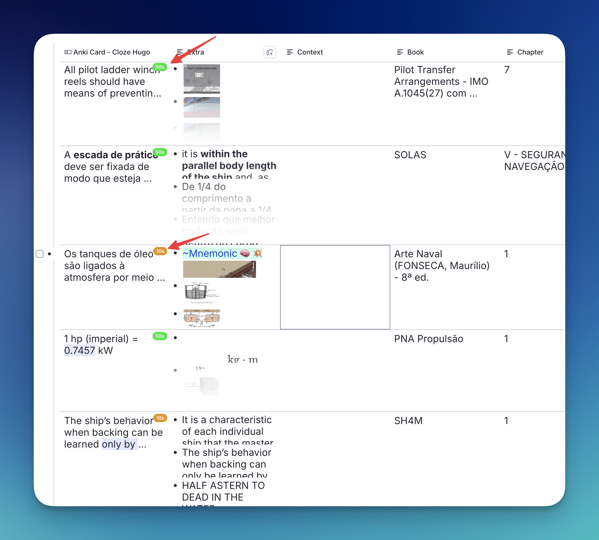{ width="700" }

Because the only channel that reaches inside a table cell is a **tag**, and a tag is a yes/no rather than a value, the badge shows a band of ten rather than the exact number. Outside tables the Priority Editor still shows the precise value and remains the better badge.

**Only Rems that can actually appear in a table are tagged** — those carrying at least one non-powerup tag that defines slots (the tag whose slots become the table's columns). Without that filter every card and extract in a large knowledge base would be tagged, which is tens of thousands of synced writes for Rems no table will ever show. A table built from a *document or portal* view rather than from a tag has no tag to key on, so its rows show no badges.

The badges follow your priorities automatically, including inherited ones flowing down a cascade. Two commands cover the rest: **Refresh Priority Badges (Tables)** (run once after updating, to fill in existing Rems) and **Remove All Priority Band Tags**, which destroys nothing — the bands mirror priorities that still live in their own slots, so a refresh rebuilds them exactly. Both report progress and a completion summary as toasts and in the console. The feature can be switched off with the **Show Priority Badges in Table Cells** setting; the band tags stay hidden from the tag bar either way.

📖 See [Prioritization & Sorting → Priorities in Tables](Prioritization-&-Sorting.md#priorities-in-tables).

### ✨ New: Set priority for a whole selection at once

`Opt+P` and `Ctrl+Opt+P` now work on **multi-selections** — table rows picked with the row checkboxes, or bullets dragged across in the editor — applying your choice to every selected Rem. Previously both commands read only the *focused* Rem, and a table selection has none, so they simply reported that no Rem was found. This brings them in line with `Opt+X` / `Opt+Shift+X`, which already understood multi-Rem selections.

The popup states its scope in the header (`Priority Settings — 6 rems`) along with what the selection contains, e.g. `2 IncRems, 4 with cards`.

Each Rem is routed by **what it already is**: IncRems receive the Incremental priority, Rems with flashcards receive the card priority, Rems that are both receive both, and Rems that are neither are skipped and counted. So an IncRem with no cards is never tagged `CardPriority` just for sharing a selection with flashcards, and a bulk edit never turns a bare Rem into an inheritance anchor — that stays a deliberate single-Rem action.

Both sliders reflect the **whole selection** rather than the first Rem, so selecting a flashcard first and an IncRem second still offers both, each labelled with how many Rems it will touch. Sliders open on the **class average**, and when the targets disagree the header reports the spread — `IncRem mixed 27–74 (avg 50)` — so an average is never mistaken for everyone's current value.

> [!IMPORTANT]
> **Only the sliders you actually move are applied.** Otherwise, opening the popup over six rows and touching only the card slider would push the first Rem's Incremental value onto every IncRem in the selection.

📖 See [Prioritization & Sorting → Bulk Priority for a Multi-Selection](Prioritization-&-Sorting.md#bulk-priority-for-a-multi-selection).

## v1.0.24 - July 27th, 2026

### ✨ Improved: Parent Selector now sees through portals

The **Parent Selector** (the tree that opens when you extract a highlight into a new Incremental Rem) previously had a blind spot: **portals**. A portal shows a Rem that lives elsewhere inside the branch you're reading, and you can see and edit it from both places — but the selector skipped it entirely, so a whole section of your outline was unavailable as a filing destination even though it's plainly visible in the editor.

**What you see now.** Expanding a branch lists the Rems mirrored in by a portal **at the portal's position**, marked with a **`⧉ portal`** badge. Hovering the badge shows the **full breadcrumb** of where the Rem really lives (`Chapter › Section › Subsection`). Expand them, add children to them, or press `Enter` to file there — the new Rem is created in that **real home**, and so also appears inside the portal, which is the round trip you'd expect.

**Mirrored Rems keep their own hierarchy.** A portal records *every* Rem it displays as included, so a branch and all its descendants come back as one flat set — which would list a Rem and its own children as siblings. Only the **outermost** Rems are now shown at the portal's position; their descendants appear where they belong, under that Rem, once you expand it.

Details worth knowing:

- The **portal rem itself is never offered** as a destination — it isn't a real parent. Only its targets are.
- **Portal rows are kept by "Filter only headers"** even when the mirrored Rem isn't a heading: placing a portal in a branch is as deliberate a structural signal as a heading.
- A Rem that is both a real child and a portal target of the same parent is listed **once**, and a portal pointing back at its own container can't offer it as its own child.
- **Embedded queues, scaffolds and search portals are ignored** — their contents are widgets or live query results, not somewhere you filed anything.
- The **remembered destination** is now re-found even when the only route from a candidate to it goes through a portal; the branch re-expands to reach it.
- The **"Filter only headers"** probe follows portals too, so a heading reachable only through one keeps its branch visible.

Detection is free for ordinary rows — a Rem's type arrives with the Rem itself — so only actual portals cost an extra lookup.

📖 See [Create Incremental Rem from PDF Highlights → Portals in the Tree](Create-Incremental-Rem-from-PDF-Highlights.md#portals-in-the-tree).

### ✨ Improved: Breadcrumb tooltips no longer show `[Quote]` for references

The shared ancestor-breadcrumb builder — used by the row tooltips in the **[IncRem List and Main View](IncRem-List-and-Main-View.md)**, and now by the Parent Selector's portal badge — resolves Rem references properly instead of printing a literal `[Quote]` placeholder. An ancestor whose title *is* a reference now reads as the referenced Rem's text, and a **reference pin** collapses to **📌** rather than dumping the entire referenced Rem into the tooltip. Segments are joined with `›`, matching the breadcrumbs in the Reader, Extract Viewer and Isolated Card Viewer.

## v1.0.23 - July 24th, 2026

### ✨ Improved: Find Rem treats "Figure", "Fig" and "Fig." as the same word

The **[Find Rem — Reference or Open](Utilities.md#find-rem-reference-or-open)** picker now matches figure abbreviations interchangeably. Typing **`fig 4.3`** lists a Rem named **`Figure 4.3`** — and typing **`figure 4.3`** finds one named **`Fig. 4.3`** or **`Fig 4.3`**. Any capitalisation works, and a trailing dot is optional.

This rides on the same folded-text matching that already made the picker accent-insensitive: a standalone `fig`/`fig.` word is canonicalised to `figure` in both your query and each Rem's name (and alias) before they're compared, so the two spellings score identically — an exact match still floats to the top with its `EXACT` badge. The backend search is also seeded with the alternate spelling, so the Rem is retrieved regardless of which form is stored versus typed. Only the whole word is affected — `figs`, `configure`, and the like are left alone.

📖 See [Utilities → Find Rem — Reference or Open](Utilities.md#accent-insensitive-selection-aware).

## v1.0.20 - July 22nd, 2026

### 🪦 New: "Preserve history & remove" — delete stale content without losing your study time

Deleting a flashcard, Incremental Rem, or Dismissed Rem normally throws away its **repetition history** — every review and every second of study time — so tools like the **Study Dashboard** quietly lose that record (your total time spent drops). The new **Preserve history & remove** command (`quick: phr`) lets you clear out stale/incorrect content **without** that loss.

Run it from the **editor** (on the focused rem) or from the **queue** (on the rem/card under review) and it will:
- **Consolidate all repetition history in the rem's subtree** — flashcards, Incremental powerups, and Dismissed powerups — onto the rem itself, stored on its **Dismissed** powerup so the Study Dashboard keeps counting the time.
- **Convert flashcard reviews** into history entries (tagged as imported), preserving the review time (capped like the Dashboard's flashcard cap) and the grade. Reviews with no response time are skipped. For **cloze** cards, the preserved name wraps the clozed span in `{{…}}` (e.g. `flashcard {{inside}} that rem`) so multiple clozes from the same rem stay distinguishable.
- **Delete the descendants and remove the flashcards**, then **scrub the rem's own content** to a neutral `🪦 Preserved history — content removed` tombstone and hide it from the editor and queue — so the stale text no longer pollutes your documents or search.
- **Tidy the tombstone's tags** — its **Incremental** and **CardPriority** powerups are removed (no cards left, no inheritance role), leaving just **Dismissed** + **Preserved History**.
- If there's **no history to preserve**, it simply deletes the rem and its subtree outright (like `Cmd+Opt+Shift+Backspace`).

A confirmation first tells you exactly what will happen — **led by the name of the rem** so you can be sure of the target (important in the queue, where a previewer or sidebar can hold a different rem): how many descendants will be deleted, how many flashcards removed, how much study time (and how many reviews) will be preserved, and **how many references from elsewhere will break**. In the queue, the current card is advanced past before deletion so the queue never crashes trying to render a removed rem.

Imported reviews **count toward your Study Dashboard time and rep totals**, but are deliberately **ignored by the scheduler** — they never affect the rem's next-interval calculations, even if you later re-incrementalize it. In the repetition-history views they appear with a 🃏 marker showing the source card's name and grade.

📖 See [Commands → Preserve history & remove](Plugin-Commands-Reference.md#system-maintenance-commands).

## v1.0.19 - July 22nd, 2026

### ✨ Improved: Orphan-card cleanup can now preserve your review history

The orphan-card cleanup offered by **Update all inherited Card Priorities** — which removes flashcards whose parent Rem has been deleted — no longer forces an all-or-nothing deletion.

When it finds orphan cards, it now **splits them by whether they carry a review history** (`repetitionHistory`: past reviews, intervals, and time-spent records that still surface in some RemNote statistics even after the Rem is gone) and lets you choose:

- **Delete only cards without history** — keep the reviewed cards so their stats stay retrievable, cleaning up just the never-reviewed clutter, or
- **Delete all** — remove everything, with a second confirmation warning that the reviewed cards' review/time-spent records will be permanently lost.

If none of the orphans have any history, the prompt is skipped and they're all removed as before. The confirmation pages, the live re-check against transient errors, and the batched removal all now operate on the set you chose, and the final summary reports how many cards were **removed** vs. **preserved**.

### 🩺 Better startup diagnostics for orphan cards

When the Card Priority cache finishes its background pass, orphan Rems (cards that exist but whose Rem can't be found) are now **collected and logged once as a group** instead of emitting a noisy per-card warning with a stack trace for each one. If any are found, a toast points you to **Update all inherited Card Priorities** to review and clean them up. **Nothing is deleted automatically at startup** — a Rem can transiently appear missing before sync finishes hydrating, so irreversible removal stays behind the confirmed, on-demand cleanup.

📖 See [Commands → Update all inherited Card Priorities](Plugin-Commands-Reference.md#system-maintenance-commands) and [Troubleshooting → "Rem not found" Errors](Troubleshooting.md#1-rem-not-found-errors).

## v1.0.18 - July 22nd, 2026

### 📈 New: U-Factor (Used-Interval Increase) in the card info bar

The FSRS stats strip under each flashcard now shows the **U-Factor** right after **SInc** — the factor by which the interval you *actually used* would grow if you graded the card **Good** now.

Where **SInc** compares the new stability to the *current* stability (`S_new / S_old`), the **U-Factor** compares the interval that grade would schedule to the interval you just lived through — the real time since your last review (`S_new / usedInterval`). It answers a more grounded question: *"how much bigger is my next gap than the gap I just cleared?"* This mirrors the **U-Factor** metric from the companion **Flashcard Repetition History** plugin, computed the same way (`nextInterval / usedInterval`).

- **Inline value:** e.g. `U-Factor: 4.00×` — the multiplier for pressing **Good**.
- **Hover tooltip:** shows the U-Factor for all three recall grades (Hard / Good / Easy) with the resulting interval each would schedule, plus the elapsed time since your last review that forms the baseline.
- **Shown only when meaningful:** hidden when there's no usable elapsed interval (e.g. a card reviewed moments ago), matching the history plugin's behavior.

Since FSRS defines stability as the interval at 90% retention, the resulting interval (`→ Xy`) is identical between the SInc and U-Factor tooltips — only the baseline of the ratio differs.

📖 See [Widgets → Card Info Bar](Plugin-Widgets-Reference.md#11-card-info-bar).

## v1.0.17 - July 20th, 2026

### ✨ Improved: Parent Selector — headings-aware navigation, and a selection that stops slipping away

The **Parent Selector** (the tree that opens when you extract a PDF highlight into a new Incremental Rem) now treats **headings** as the structure they are, and no longer loses the destination it suggested to you.

**Headings first, and heading badges.** When you expand a branch, its **heading children (H1–H6) are listed before** the rest, shallowest level first (`H2` above `H4`), with non-headings following in their normal editor order. Every heading row carries an **`H1`–`H6` badge** on the right, using the same color scale as the Heading Levels previews. Since headings are effectively a chapter's table of contents, this puts the filing destinations you actually want at the top instead of buried among the branch's extracts.

**Filter only headers.** A checkbox hides everything that isn't a heading inside expanded branches — but **not** blindly: a plain rem that is the only path to headings below it is **kept**, so a wrapper rem can never make its headings unreachable, and the rem you last filed under (or the one the popup is suggesting) is **always shown** even when it isn't a heading. The initial IncRem candidate list is never filtered — the option only reshapes a rem's own tree.

Both **Filter only headers** and **List headings first** (on by default) are checkboxes at the top of the popup, **remembered per device**.

**The suggestion stops getting knocked off.** Opening the popup scrolls the suggested/remembered parent into view — which used to drag rows *underneath a stationary cursor*, firing a hover that silently replaced the selection before you touched anything. Hover now only takes over once the pointer has **genuinely moved**, and arrow-key navigation disarms it again, so a resting mouse can't undo your keyboard selection. Row clicks are also ignored for a moment after the popup opens, so a quick second click can't create the rem under whatever row happened to land beneath the cursor.

**Restore the destination.** If the selection does drift, press **`L`** — or click the **↩ Last destination** / **↩ Suggested** button in the popup header — to jump straight back to where the popup opened, re-expanding the path if you collapsed it since.

📖 See [Create Incremental Rem from PDF Highlights → Parent Selector Features](Create-Incremental-Rem-from-PDF-Highlights.md#parent-selector-features).

## v1.0.15 - July 16th, 2026

### ✨ New: Import Incremental Rems with History — migrate an external study log into native IncRem histories

A new **Import Incremental Rems with History** command bulk-creates Incremental Rems from a JSON payload, each carrying a **complete pre-computed repetition history** — dates, review times, intervals, and per-entry notes — stored in the standard History slot, indistinguishable from natively-recorded reps.

- **Made for study-log migration:** if you tracked study sessions outside RemNote (a spreadsheet, a time tracker), you can now convert that log into IncRems whose histories reflect years of real sessions. The **version-1 JSON contract is documented in [Commands → Import JSON format](Plugin-Commands-Reference.md#import-json-format-version-1)** — produce it with any tool. The repository ships **`scripts/convert_study_log.py`** as a *sample* converter (tailored to one specific Excel activity log, with source-specific adjustments like date cutoffs and time-discount factors): one document per book, one child IncRem per chapter, each session becoming a `rep` entry with `reviewTimeSeconds` (feeding total-time-spent stats), interval to the next session, and notes assembled from the log's cycle/pages/observations columns.
- **Faithful slots:** priority, next-repetition date and Created date are set exactly like `initIncrementalRem` does. A `madeIncremental` marker (stamped with `nextRepMs`) is appended **after** the imported reps, so the scheduler restarts interval counting from the import — with the classic exponential scheduler, counting hundreds of historical reps would explode the next interval. The imported reps still feed the Repetition History views and total-time-spent stats in full.
- **Safe by design:** the popup validates the payload (zod schema) and shows a **preview** — books/rems/entries counts and a warning list of histories over 50 KB (verify those sync after importing) — before anything is created. The import is **resume-safe**: already-imported rems are detected and skipped, so an interrupted run can simply be repeated with the same file. The session cache is updated in one bulk write at the end.

📖 See [Commands → Import Incremental Rems with History](Plugin-Commands-Reference.md#system-maintenance-commands).

## v1.0.14 - July 16th, 2026

### ✨ New: Review Notes — per-repetition observations, with automatic reading-context snapshots

Every repetition event of an Incremental Rem can now carry a **📝 note** — a short observation attached to that specific entry in its history: *why* you postponed, *where* you stopped, what to check next time, why you dismissed it. Notes can be typed from every review surface:

- **Queue**: a compact **📝 icon** in the answer-buttons bar (next to *Open Editor*) toggles an inline input. The note is parked as you type and saved with whichever action ends the review — **Next**, **Reschedule**, or **Dismiss** (a note saved on Dismiss becomes the *dismissal reason*, stored on the dismissed marker).
- **Reschedule popup** (`Ctrl+J`, queue or editor): an optional **Note** field — "why postponed" lives on the reschedule entry itself.
- **Execute Repetition popup** (editor review): a **Note** section between *Review time* and *Priority*. Choosing **Timer** instead of Confirm hands the note to the timer.
- **Editor Review Timer**: a **📝 toggle** next to Pause. Prefills with a note typed earlier (in the queue or the review popup) so you can extend it; saved on **End Review / Next / Dismiss**. For queue→editor handoffs, the note is appended to the same entry the handoff already wrote.

Alongside the user note, each entry now also records an **automatic context snapshot** for PDF/HTML readers: the **current page**, the active **page range**, the **PDF name**, and the text of the **last bookmark** of the session. Two reasons this matters:

- **Trajectory, not just state**: the live reading-progress footer only shows where you are *now*; snapshots show where you were **at each rep** (`p.42 → p.57 → p.71`), so your reading pace per session becomes visible.
- **Durability**: reading positions/ranges/bookmarks live in the plugin's synced storage, which RemNote's storage overhaul has been known to wipe; the snapshots live **inside the Rem's History property**, which survives. Dismissal snapshots also record *how far you got* before dropping an item.

Where notes and context show up:

- **Repetition History popup** (`Ctrl+Shift+H` / 📊): each row or event banner gains a sub-line with the 📝 note and a compact context line (`p.57 of 40–80 · Book.pdf · 🔖 "bookmark…"`).
- **Aggregated History**: tree nodes with notes show a **📝 indicator** (with a count); hover to read them, dated, newest first.
- **Study Dashboard**: hierarchy rows show the same **📝 indicator** after the rem name; hovering lists that rem's notes (capped at 8, with an overflow hint pointing to the Repetition History popup).

Notes are capped at 500 characters and context strings truncated, so history entries stay lean for sync. Dismissed rems keep their notes — the full annotated history travels through dismissal and re-incrementalization untouched.

📖 See [Reviewing in the Queue → Answer Buttons](Reviewing-Items-in-the-Queue.md#the-answer-buttons), [Widgets → IncRem Repetition History](Plugin-Widgets-Reference.md#212-increm-repetition-history-aggregated-view) and [Study Dashboard → Hierarchy](Study-Dashboard.md#hierarchy-section).

## v1.0.13 - July 16th, 2026

### 🐛 Fixed: "Break Inline List Into Children" silently erased trailing images and non-highlight pins

An IncRem extracted from a PDF highlight often ends with a soft line break followed by the **figure image** and one or more **pin references**. Running **`Break Inline List Into Children`** on such a rem erased the image and any pin that was *not* a PDF-highlight pin (e.g. a pin to a regular rem). The cause: the split works on plain-character offsets, and **zero-width nodes** (images, references) sitting exactly on a line boundary — at the very end of the text, or right before a line break — fell into the crack *between* two adjacent line segments and were claimed by neither; a second filter then discarded any line whose plain text was empty, killing image-only lines too. The PDF-highlight pin survived only because it's lifted onto the caput before the split ever runs.

Now nothing is lost:

- A **trailing image** becomes its own **child rem, appended as the last item** — so the figure that illustrated the list stays in the outline.
- **Trailing non-highlight pins** (and any other trailing references) are **moved onto the caput**, joining the PDF-highlight pin next to the title.
- A **mid-text image** right before a line break now stays attached to the item it ends, and an image-only line survives as its own item instead of being filtered away.

If a break already ate an image or pin: **`Restore List Rem`** recovers it — the pre-break snapshot always stored the complete original text, so nothing already broken is truly lost.

📖 See [Utilities → Break Inline List Into Children](Utilities.md#break-inline-list-into-children-brl).

## v1.0.12 - July 15th, 2026

### 🐛 Fixed: "Repair PDF" couldn't find the Highlights container after RemNote's storage overhaul

**Repair PDF** (in the `/debug` widget) refused to run on PDFs with misplaced highlights, reporting *"there is no canonical Highlights container"* even when one plainly existed. The tool identified RemNote's managed `Highlights` container by a `PDF Highlight Section` tag — but RemNote's storage/sync overhaul stripped that tag (along with every other tag, property, and slot marker) from the container, so the genuine container was misfiled as "broken" and the repair aborted. Probing **all** built-in powerups confirmed the container now carries only `Automatically Sort` — the very same powerup the PDF root has — so no unique marker is left to key off.

Detection now identifies the container the only way that survives the overhaul: a child named `Highlights` sitting directly under the PDF. The repair also **merges** page nodes by page number instead of blindly re-parenting them — a `Page 05` moved in from the root now folds into the existing `Page 05` rather than creating a duplicate — deletes the emptied leftovers, and no longer strips `Automatically Sort` from the PDF root (which is RemNote's normal state now). **Debug PDF** was also extended to probe every built-in powerup, so future PDF-structure diagnosis starts from complete data.

📖 See [Troubleshooting → PDF Highlight Repair Tool](Troubleshooting.md#pdf-highlight-repair-tool).

## v1.0.11 - July 14th, 2026

### 🐛 Fixed: "Timer" didn't auto-scroll to your last bookmark when the source was already open

Starting an editor review with the **Timer** button is meant to open the PDF/HTML source and jump to your last reading bookmark. When the source was **already open** (the common case), the jump silently failed and you had to press **🔖 Scroll** manually. Two issues were at play: the scroll was being fired from the review popup that closes itself an instant later — so its scheduled scroll died with the popup and focus bounced off the reader — and the bookmark hand-off was being written *after* the timer widget had already looked for it (a race). The scroll is now performed by the persistent timer widget, and the bookmark is handed to it *before* the widget starts, so **Timer** reliably lands on your last position whether the source was already open or not.

## v1.0.10 - July 13th, 2026

### ⚡ Faster "Create IncRem" from PDF/HTML highlights

Picking a parent in the **Create IncRem** flow now opens the priority popup in roughly **1.5 s instead of ~5 s**. The popup only waits for the essentials — creating the rem, tagging it Incremental, and inheriting its priority. Everything else (the `pdfextract` tag, the reading-position bookmark, cache updates, and cleaning up the original highlight) is handed to a background job that runs *after* the popup is already on screen, so it no longer makes you wait. The priority-inheritance lookup was also made lighter — it now reads just each ancestor's priority instead of rebuilding the ancestor's full record.

### 🐛 Fixed: saving priority hung for ~30 s in Light Mode

Saving the priority/interval popup fired a full priority-inheritance cascade even in **Light Mode**, where the card-priority system is disabled — a pure no-op that still loaded the entire card database and could freeze for ~30 s on large libraries. It's now skipped in Light Mode (matching the other priority-save paths), and even in full mode it exits immediately for a freshly-created leaf rem instead of scanning every card.

### ✨ New: detect & break flattened PDF-highlight lists into an outline

A PDF highlight often captures a whole enumerated list as **one rem**, flattened onto a single line with the numbers left inline and the line breaks dropped (`… evitá-las: 1 Aumentar… 2 Deixar… 3 O Oficial…`). [Bulletize Inline Selected Text](Utilities.md#bulletize-inline-selected-text) can only re-bullet lines that *already* exist — here there are none. Three new commands rebuild the structure in a reviewable, undoable flow:

- **`Inlinize Detected List`** (`quick: inl`) — detects the list and inserts a line break + `• ` before each item, so it becomes soft-wrapped bulleted lines in the **same rem**. **Enumerated** items keep their number (`1 Aumentar` → `• 1 Aumentar`); **already-bulleted** lists (`•`, `-`, `*` run together on one line) have their marker normalized to `• `. This is your review checkpoint — eyeball the split and `Ctrl+Z` if the heuristic got it wrong before anything destructive happens.
- **`Break Inline List Into Children`** (`quick: brl`) — turns each `• ` line into a **child rem**, with the caput/title staying on the parent. If the rem carries a **pin back to a PDF highlight** (from the Create IncRem toolbar *or* from pasting the highlight straight into notes), the pin is **moved onto the caput** instead of clinging to the last item, so the source link rides the title and every child stays clean. It **snapshots** the original text + created child IDs first, so the split is fully reversible. Refuses rems that have **back text** (flashcards) to avoid scrambling a card.
- **`Restore List Rem (undo break)`** (`quick: rlr`) — deletes exactly the children the break created and rewrites the original front text from the snapshot.

**How detection avoids false positives:** for enumerated lists it follows an **ascending chain**, accepting only the next expected value (`prev + 1`) at a word boundary and preferring markers that sit after sentence punctuation — so a stray `2` inside *"reduzir de 3 para 2 nós"* isn't mistaken for a marker, and plain prose with scattered numbers detects nothing. Supports **decimal** (`1`, `1.`, `1-`, `1)`), **lettered** (`a)`, `b.`) and **roman** (`i.`, `ii.`) enumerators (letters/romans require a delimiter), **depth/compound markers** (`1.1`, `1.2`… and mixed `1.a`, `1.b`…), plus **bullet/dash lists** (`•`, `-`, `*`): a marker must stand alone (space + letter after it, so `bem-vindo` and `*bold*` are ignored), and dash **and** compound lists additionally require a clause boundary (`:`, `;`, `.`) before the first item so parenthetical dashes and inline version numbers/ratios (`para 2.1 e 2.2`) aren't mistaken for a list. Compound items become flat siblings (no nested outline).

Unlike Bulletize (which works on a text selection), all three commands act on the **focused rem** — no selection needed. Known v1 limits: the chain must start at `1`/`a`/`i`, and a gap in the numbering stops the chain (safe over clever). No default shortcut is bound (quick codes only) to avoid conflicts.

📖 See [Utilities → Inlinize & Break Lists](Utilities.md#inlinize-break-lists-from-pdf-highlights).

### 🐛 Fixed: red priority badge on inheritance-only card rems

A rem tagged for card-priority inheritance but with no cards of its own (its priority only feeds descendants) showed a misleading dark-red badge, even for mid/low priorities — the priority popup showed the correct color. Such rems had no place in the per-card ranking, so their percentile defaulted to 0. They now get a percentile based on where their priority sits in the card population, so the badge color matches the popup.

## v1.0.9 - July 11th, 2026

### 🐛 Fixed: "Text with Pin" now works on rems containing images

Find Rem's **`Opt/Alt+Enter`** (Text with Pin) failed on rems with images — `insertRichText` rejected the image node (out-of-range `percent`). The source text is now sanitized before insertion, so figures and other images insert correctly.

## v1.0.8 - July 11th, 2026

### 🐛 Fixed: images preserved when extracting PDF highlights

Copying a highlight that contains an image into an IncRem now keeps the image's crop/aspect ratio and drops invalid `percent` values that RemNote's `setText` validator rejected.

## v1.0.7 - July 11th, 2026

### ✨ New: estimated total time in Repetition History

The IncRem Repetition History popup now shows an estimated total review time.

## v1.0.3 - July 10th, 2026

### ✨ New: PDF reading-progress footer in the IncRem Repetition History popup

When a Rem reads from a **PDF with a page range** set, the **[IncRem Repetition History](Plugin-Widgets-Reference.md#212-increm-repetition-history-aggregated-view)** popup now shows a footer with the PDF name, the **page range**, your **current page**, and the **degree of processing** (`% read`, with a progress bar). It also adds an **estimated remaining time**, extrapolated from the total time spent so far and the progress achieved. The footer works for **dismissed Rems** too, and the percentage/estimate are omitted for open-ended ranges (`start–∞`).

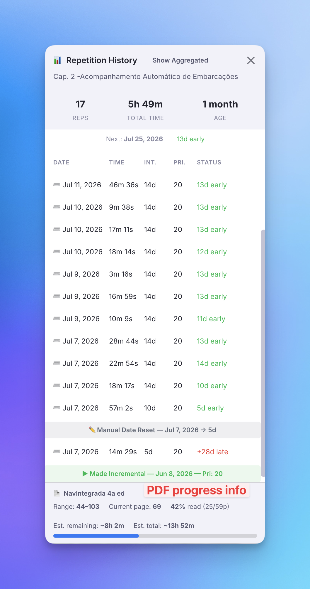{ width="400" }

---

## v1.0.1 - July 9th, 2026

### ✨ New: "Text with Pin" insertion in the Find Rem picker (`Opt/Alt+Enter`)

The **[Find Rem](Utilities.md#find-rem-reference-or-open)** picker gains a third insertion mode alongside *reference* (`Enter`) and *pin* (`Ctrl/Cmd+Enter`): press **`Opt+Enter` / `Alt+Enter`** (or **`Opt/Alt+click`** a result) to insert the Rem's **text followed by a pin** — the same result as RemNote's paste dialog option **"Text with Pin"**, but in one keystroke and without copying first.

It brings across the source's **full rich text**, not a plain label:

- **Formatting and images are preserved** — bold, italic, colours, LaTeX, embedded images, etc.
- **Front/back cards bring the back too**, joined by a **practice-direction arrow** (`⇒` / `⇐` / `⇔`) instead of RemNote's card delimiter.
- **The source's clozes are marked, not re-clozed** — they're inserted as **highlighted text (yellow background + reference-coloured font)**, the same mark the `Opt+Z` cloze command leaves, so they still read as clozes without becoming functional ones in your target.

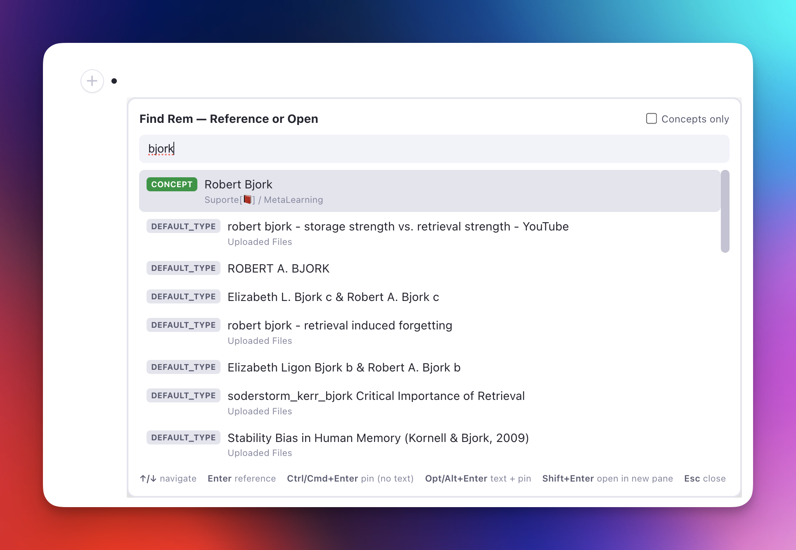

### 🎯 Improved: Find Rem picker stays on-screen near the window edges

The picker still opens at your cursor, but it no longer gets **clipped by the window edge**:

- **Near the right edge** it flips to open to the **left** of the cursor.
- **Past the vertical midpoint** it flips to open **above** the cursor (like RemNote's selection search), with the results list capped to the space available on the chosen side so a long list **scrolls** instead of spilling off-screen.

The correction happens before the box is shown, so there's no visible jump. (RemNote doesn't expose the window size to plugins and blocks cross-origin reads, so the picker measures the viewport itself via the one host-coordinate API available.)


### ♻️ Changed: "Bulletize Inline Selected Text" default shortcut rebound to `Shift+F8`

The default binding for **[Bulletize Inline Selected Text](Utilities.md#bulletize-inline-selected-text)** changed from `Ctrl+Opt+Shift+8` to **`Shift+F8`** — a recent RemNote build uses `Ctrl+Opt+Shift+8` to apply the **blue highlight** to inline text, so the old binding collided with it. `Shift+F8` sidesteps every conflict (`Opt+8` types `•`, `Opt+Shift+8` types `°`, `Ctrl+Opt+Shift+8` is RemNote's blue highlight) and is identical across macOS/Windows/Linux. If you rebound the command manually, your custom binding is unaffected.

---

## v0.2.299 - July 9th, 2026

### 🐛 Fixed: Duplicate 🔍 badge and stray badges on other powerups after RemNote's tag-bar change

A RemNote update changed how applied powerups are rendered in the editor: every applied powerup now shows up as an **"Applied Powerup Pill"** *in addition to* the tag pill that already existed inside the Rem's Tag Bar — and both carry the same CSS class the plugin used to turn the **Incremental** tag into a 🔍 badge. The result was two visible glitches:

- The 🔍 badge appeared **twice** on incremental Rems (once on the new pill, once on the Tag Bar duplicate).
- On Rems with **multiple powerups** (e.g. `Incremental` + `CardPriority`), the badge **leaked onto the other powerups' pills**, replacing their names with a 🔍 too.

The badge rule is now pinned to the **Incremental** pill specifically (matched by its stable identifier), and the redundant powerup duplicate RemNote adds inside the Tag Bar is hidden — so each incremental Rem shows **exactly one** 🔍, and other powerups keep their own labels. The `#pdfextract` ✂️ badge was unaffected (it's a plain tag, not a powerup, so it never gained a duplicate).

---

## v0.2.296 - July 8th, 2026

### 🐛 Fixed: Restored compatibility after RemNote's storage/sync update (`getPowerupSlotByCode`, `isPowerupProperty`)

A recent RemNote desktop update **deprecated several internal plugin-API methods at runtime** — calls now throw `Internal API Error: … is deprecated`, even though the methods are still listed in the plugin SDK. Two of these were used throughout the plugin:

- **`getPowerupSlotByCode`** — broke priority/scheduling internals and stopped the Debug widget from opening.
- **`isPowerupProperty`** — surfaced next (once the first was fixed) and still blocked the Debug widget on any Rem with card-priority property children.

Both now go through **compatibility shims**: each tries the native call first and, when it fails, falls back to a safe equivalent (resolving powerup slots by walking the powerup's own slots; detecting property children by their slot-definition tag). Everything works again, and the shims **self-heal** automatically if RemNote restores the methods.

### 🛠️ New: Edit and safely restore Incremental history from the Debug widget

The Debug popup's **History** section is now **editable** — press **Edit** to correct a `reviewTimeSeconds`, add or delete entries, and **Save** (the JSON is validated against the history schema before it is written; the Next Rep date is left untouched). A **restore point** is captured before each edit, and if the stored history ever becomes invalid the widget flags it and offers **Restore original** to roll back.

---

## v0.2.295 - July 2nd, 2026

### 🎨 Improved PDF Highlighting Visual Recognition and Experience

Following the [clearer editor highlight colors](#v02294-july-1st-2026), the **PDF viewer** now lets you recognize which highlights you've already processed **without changing the highlight's original color**. Each processed highlight carries a subtle marker drawn *on top* of it, in the tag's colour:

- **Dashed underline + a thin colored right bar**, so a glance tells you the state:
  - 🔵 **Blue** — `#pdfextract`: already **extracted** into a standalone Incremental Rem (recommended workflow).
  - 🟢 **Green** — `#incremental`: **toggled incremental** in-place (tracked in your queue, not extracted yet).
- The highlight keeps its **original background** — the markers sit over it, so recognition never fights with RemNote's own highlight colors. The right bar (in the free right margin) is the reliable block marker; the dashed underline reinforces it at block edges.

{ width="800" }

#### 👁️ Peek toggle — hide the markers to read cleanly

If the markers ever get in the way, you can hide them all at once (and bring them back) with a single action:

- A new **👁️ / 🙈 button in the PDF highlight toolbar** (appears whenever you select a highlight) toggles the markers for both `#pdfextract` and `#incremental` highlights. It turns amber while "peeking" (markers hidden).
- Or run the **Toggle PDF Highlight Marker Borders** command (quick code `tb`) — assign it a keyboard shortcut for an instant peek if you forget the button.
- Your choice is remembered **per device** (default: markers **on**).

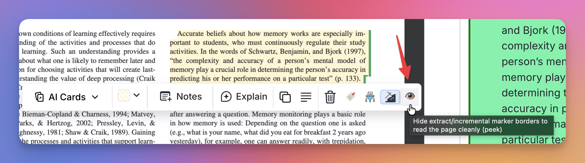{ width="800" }

*(Why markers instead of a background tint in the PDF viewer? The PDF-viewer highlight is a translucent overlay blended over the page, so recolouring its background muddies the text — especially in dark mode. Keeping the original background and adding a marker on top reads cleanly in both themes.)*

---

## v0.2.294 - July 1st, 2026

### 🐛 Fixed: "Create Cloze Deletion" now works on selections containing Rem references

The **[Create Cloze Deletion](Plugin-Commands-Reference.md#core-incremental-commands)** commands (`Opt+Z` / `Alt+Z`, and the `Opt+Shift+Z` priority variant) previously only clozed **plain text** — if your selection was a **Rem reference** (`[...](....md)`), the reference was silently dropped: the cloze child was created with the right priority but **without** the reference clozed, and the source Rem got **no** highlight on the selected span. This is now fixed for every selection shape:

- **A reference on its own.** Selecting just a reference and pressing `Opt+Z` now clozes it. RemNote clozes a reference by tagging the `{ i: 'q' }` node itself (not surrounding text), which the old text-position matching couldn't reach — references are zero-width in plain-text space, so there was nothing to "select."
- **A reference at the edge of a mixed selection.** Selecting *text + a reference* (e.g. `a [Z-tech tug](Z-tech-tug.md)`) now clozes **both** — previously a reference sitting exactly on the start/end boundary of the selection fell through the range check and was left out of the cloze and the styling.
- **Front or back of the card.** Reference clozing works whether the reference is on the front or the **back** of a two-sided card, reusing the same section-resolution logic the text path already used.

In all cases the source Rem's selected span is now marked (yellow highlight + red font, matching text clozes), so you can see what became a cloze extract.

### ♻️ Changed: Clearer PDF/HTML highlight colors and readable text selection

The editor styling for **PDF/HTML highlight** Rems was reworked so the two highlight kinds read apart at a glance and text stays legible while selecting inside them:

- **Distinct hues.** `#pdfextract` highlights use a cornflower-blue and `#incremental` highlights a green, so they're told apart **by hue alone** — no inline borders needed.
- **High-contrast text selection.** Selecting text *inside* a highlight now uses a dark navy/green selection with white text (instead of the default selection colour washing out against the highlight), so you can actually see what you're selecting to extract or cloze.
- **Dark-mode aware.** In the editor's dark mode the highlight backgrounds are darkened (and the selection lightened) so light text stays readable. The **PDF viewer** deliberately keeps the light-mode backgrounds, since there the highlight is a translucent overlay blended over the (still-light) page.

### ✨ New: Cloze-extract and #ignore badges in the read-only outline (ExtractViewer)

The read-only outline view (**[ExtractViewer](PDF-Incremental-Reading-Workflow.md#extractviewer-mode)** / in-queue Rem-type card body) now flags two more kinds of child Rem, since the `RemViewer` overlay renders outside this view's CSS and can't show their normal styling:

- **⬆️ Cloze extract** — children tagged `#cloze-extract` (created via *Create Cloze Deletion*) get a violet badge, mirroring the queue's cloze identifier.
- **🚫 Ignored** — children tagged `#ignore` get a deliberately understated treatment (a thin *dashed* grey rule and faint tint, italic label) so they read as muted/archived without the emphasis the incremental/dismissed boxes carry.

### 🐛 Fixed: "Find Rem" no longer suggests the Rem you're editing

The **[Find Rem](Utilities.md#find-rem-reference-or-open)** picker now excludes the **source Rem** it was triggered from — a Rem can't reference itself, so it's no longer offered as a result.

---

## v0.2.291 - June 26th, 2026

### ✨ New: "Find Rem — Reference or Open" now matches Rems by their aliases

The **[Find Rem](Utilities.md#find-rem-reference-or-open)** picker (`Opt+Shift+F` / `Alt+Shift+F`, quick code `fir`) now finds Rems by their **aliases** — the alternate names you add via *Edit or Add Alias* (RemNote's built-in **Aliases** powerup) — just like RemNote's native `[[` search does. Previously the picker only matched a Rem's *primary* name, so a Rem named **Via navegável** with an alias **vias navegáveis** wouldn't appear when you typed the alias.

As a reminder, the picker's core purpose is to surface Rems that RemNote's own `[[` reference search can't find (names made entirely of high-frequency words get out-ranked off the candidate list):


- **Alias-aware matching.** When a result's primary name doesn't contain every word you typed, the picker now consults that Rem's aliases (via `getAliases()`) and matches against them too. The extra lookup only runs for the non-matching results, so per-keystroke responsiveness is unchanged.
- **Clear in the list.** An alias match shows the **alias text** as the row title, an **`ALIAS`** badge, and the Rem's real name underneath (`↳ Via navegável`) so you can see which Concept it links to.
- **Inserts a true alias reference.** Picking an alias match inserts a reference to the **owning Rem** that **renders the alias text** — the same shape RemNote uses for its own alias references (the reference's `aliasId` points at the matched alias). It works with every insertion mode: normal reference, **pin**, and **cloze-aware** insertion.

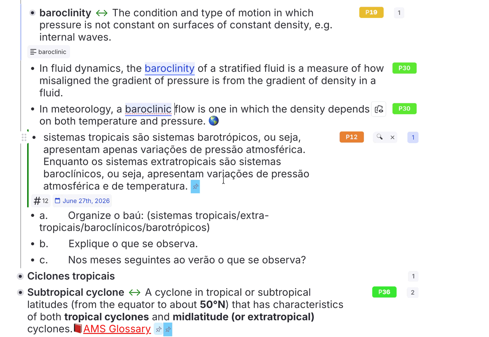

The picker's existing **cloze-aware** insertion (a reference dropped inside a cloze stays *inside* it instead of breaking it):

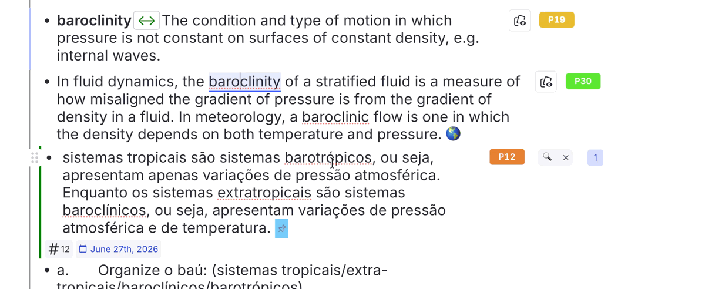

📖 See **[Find by alias](Utilities.md#find-by-alias)** and **[Cloze-aware insertion](Utilities.md#cloze-aware-insertion)** in Utilities.

---

## v0.2.288 - June 25th, 2026

### ✨ New: Read points on "hybrid" IncRems (a PDF/HTML source *and* their own outline)

An Incremental Rem can be **both** a reading source (PDF/HTML) **and** an outline with its own descendant content. Previously the **🔖 Go to Read Point** button never appeared for such an IncRem, because the read-point check bailed out as soon as a PDF/HTML source was detected. Read points and the document's highlight bookmark are actually stored independently, so a hybrid IncRem can carry **both** — they point at different places (a node in the outline vs. a spot in the document) and jump differently.

- **Editor Review Timer — both buttons, with a "latest" marker.** A hybrid IncRem now shows **🔖 Scroll** (to the PDF/HTML highlight) *and* **🔖 Go to Read Point** (to the descendant). Whichever was saved most recently gets a small green **`latest`** badge so you know which reflects your last reading action.
- **Queue — a 🔖 Read point button.** When a PDF/HTML card also has a read point, the answer bar shows a **🔖 Read point** button (with the same `• latest` marking). Since the in-queue reader can't jump into the outline without leaving the queue, clicking it pops a **confirmation dialog** (showing the read point's rem name); on confirm it reuses the **[Review in Editor](Reviewing-Items-in-the-Queue.md#review-in-editor)** flow — recording a review for the current IncRem and starting its timer — but opens the **read-point descendant** in the editor so you can resume reading there. Pure Rem-type cards are unaffected (their read point is already shown in the read-only card body).
- **Queue — 📑 View outline / 📄 Read document toggle.** The same hybrid cards now also get a **top-right toggle** that flips the queue card **in place** between the PDF/HTML reader and a **read-only outline view** of the IncRem (the ExtractViewer, where the read point is emphasized and auto-scrolled into view) — so you can read the document and consult your outline/notes in one session, without leaving the queue or re-tagging. The **`#extractviewer`** tag remains the way to make the outline the *permanent* default for a chapter.

📖 See **[Read Points → Hybrid IncRems](Reviewing-Items-in-the-Editor.md#hybrid-increms-a-pdfhtml-source-and-their-own-descendant-content)**, the queue **[🔖 Read point button + outline toggle](Reviewing-Items-in-the-Queue.md#the-answer-buttons)**, and **[PDF Workflow → ExtractViewer Mode](PDF-Incremental-Reading-Workflow.md#extractviewer-mode)**.

---

## v0.2.287 - June 19th, 2026

### ♻️ Changed: Default queue randomness raised from 10% to 20%

The default **[Incremental Rem Randomness](Prioritization-&-Sorting.md#1-incremental-rem-randomness)** is now **20%** (was 10%). Since randomness became a **[priority-weighted lottery](Prioritization-&-Sorting.md#how-randomness-works-the-priority-weighted-lottery)** — the slice it shuffles is refilled in proportion to each item's priority weight, not uniformly — a slightly larger default is safe: it surfaces more lower-priority "golden nuggets" each session while your high-priority items still come first. Existing knowledge bases that already set a randomness value are unaffected; this only changes the default for KBs that never touched the slider.

### ♻️ Changed: "Toggle Ignore Tag" now accepts a multi-rem selection

The **[Toggle Ignore Tag](Plugin-Commands-Reference.md#other-utilities)** command (`Ctrl+Shift+I`, `ign`) now applies to a **multi-rem outline selection**, not just the single focused rem — select several rems and run it from the Omnibar. If **every** selected rem is already tagged, `#ignore` is **removed** from all; otherwise it is **added** to those that lack it, so a mixed selection becomes uniformly tagged. Single-rem behavior is unchanged. (Selection is resolved through the Omnibar-resilient selection cache, matching commands like Text Case Converter.)


### ♻️ Changed: "Bulletize Inline Selected Text" default shortcut rebound (macOS degree-symbol conflict)

The default binding for **[Bulletize Inline Selected Text](Utilities.md#bulletize-inline-selected-text)** changed from `Opt+Shift+8` to **`Ctrl+Opt+Shift+8`** (`Ctrl+Alt+Shift+8` on Windows/Linux). On macOS `Opt+Shift+8` types the degree symbol (`°`), so the old binding conflicted with typing it. If you rebound the command manually, your custom binding is unaffected.

---

## v0.2.286 - June 19th, 2026

### ✨ New: Read Points (reading-position bookmarks) for Rem-type Incremental Rems

PDF and HTML Incremental Rems already remember your reading position with highlight bookmarks. **Rem-type** Incremental Rems — outline *headers* whose reading content lives in their **descendants** — now get the equivalent: a **read point** marks one descendant rem as the IncRem's current reading position, so you can jump back to where you stopped instead of re-scanning a long note from the top.

- **Set Read Point (Bookmark)** command (`Ctrl+F7`, `srp`): marks the **focused descendant** as the current reading position. The owning IncRem is resolved from the active review session (Editor Review Timer or queue) when its outline contains the focused rem, otherwise from the **nearest ancestor** tagged Incremental. Stored in the same reading-history infrastructure as PDF/HTML bookmarks, so each save is kept in a read-point history.
- **View Read Points (History)** command (`Ctrl+Shift+F7`, `vrp`): opens the **Read Points popup** with the full read-point history (most recent = current position); click any entry to jump to that descendant.
- **🔖 Go to Read Point** on the Editor Review Timer: when reviewing a Rem-type IncRem with a read point, a button appears (parallel to the PDF/HTML 🔖 Scroll button) that navigates to the bookmarked descendant.
- **In-queue emphasis.** The read-only card of a Rem-type IncRem now highlights nodes with colored **emphasis boxes**: a strong green **🎯 Target Incremental Rem** box on the root, a blue **🔖 Read point** box on the bookmarked descendant (the card **auto-scrolls to center it**, with a top banner + **Scroll to it** button), green boxes on incremental descendants, and amber on dismissed ones — mirroring the editor's incremental/dismissed left borders.

📖 See **[Read Points for Rem-type Incremental Rems](Reviewing-Items-in-the-Editor.md#read-points-for-rem-type-incremental-rems)**, the in-queue **[status emphasis](Reviewing-Items-in-the-Queue.md#read-point-and-status-emphasis-in-rem-type-cards)**, the **[Read Points popup](Plugin-Widgets-Reference.md#68-read-points-popup)**, and the new entries in the **[command reference](Plugin-Commands-Reference.md)**.

### ♻️ Changed: Bookmark popups now show the owning Incremental Rem's name

The Bookmark popup (PDF/HTML) and the new Read Points popup now display the **name of the Incremental Rem** the bookmarks belong to, just under the title. Names are resolved with the **pin-aware breadcrumb resolver**, so a reference *pin* in the title collapses to a 📌 marker instead of expanding into the full referenced rem's text. The same pin-aware resolver was also applied to the **Reschedule**, **Priority**, and **Light Priority** popups' rem-name displays (and the Reschedule popup now shows the IncRem name under its title).

---

## v0.2.284 - June 16th, 2026

### ✨ New: "Apply Heading Levels by Hierarchy (Table of Contents)" + Promote/Demote

A new command — **Apply Heading Levels by Hierarchy (Table of Contents)** (quick code `htoc`) — turns a ready-made outline into a properly-leveled table of contents in one shot: select the rems and it assigns heading levels (H1–H6) **by each rem's depth in the hierarchy**, to a level range you choose (e.g. H1–H3 or H2–H4). It **never moves rems** — only their heading level changes — and reuses the same full-range H1–H6 detection/application as [Restructure Outline by Headings](Utilities.md#restructure-outline-by-headings) and [Set Next Heading Level](Utilities.md#set-next-heading-level).

- **Selection → forest → depth.** The selection is reduced to its topmost rems (forest roots = the top level); everything beneath is leveled by depth. Selecting a parent *and* its descendants together is fine — descendants aren't double-counted.
- **Choose the range.** A **Top level** and **Deepest level** picker in the preview controls the mapping; rems nested deeper than the range **keep their current level** (left unchanged, never force-stripped).
- **Before | After preview.** A side-by-side popup (shared shell with the restructure preview) shows current vs. proposed levels with `old → new` badges and live re-derivation as you change the dropdowns.
- **Undoable.** After Apply, a **Heading Levels Applied** banner appears in the sidebar with an **Undo Heading Changes** button (restoring prior levels, including back to plain paragraphs). Also available as the `Revert Last Heading Level Change` command (`rlh`). It uses its own snapshot slot, separate from the restructure undo banner.
- **Promote / Demote.** Two companion commands — **Demote Heading Level** (`hdmt`, `H2 → H3`) and **Promote Heading Level** (`hpmt`, `H2 → H1`) — shift every heading in the **selected subtree** by one level (clamped H1–H6; non-heading rems untouched), through the same preview + undo. They walk the whole selected subtree, since RemNote's outline selection reports only its top-level rems.

📖 See **[Apply Heading Levels by Hierarchy](Utilities.md#apply-heading-levels-by-hierarchy-table-of-contents)** in Utilities and the **[command reference](Plugin-Commands-Reference.md)**.

---

## v0.2.283 - June 16th, 2026

### ✨ New: "Set Next Heading Level" command

A new command — **Set Next Heading Level** (quick code `hn`) — styles the selected rem(s) as **one heading level deeper than their parent**, so adding content under an existing heading keeps the outline hierarchy consistent without manually picking H1…H6. Under an `H3` parent the selected rem becomes `H4`; under `H4` it becomes `H5`, clamped at `H6`.

- **Full H1–H6 support.** It reuses the same heading detection/application as [Restructure Outline by Headings](Utilities.md#restructure-outline-by-headings), so it handles H4/H5/H6 too (which RemNote stores in the Header powerup's `Size` slot rather than the H1–H3 font-size API).
- **Grandparent fallback.** If the immediate parent isn't a heading but the **grandparent** is `Hn`, a confirmation dialog offers to set the **parent** to `H(n+1)` and the **selected rem** to `H(n+2)` (e.g. grandparent `H2` → parent `H3`, rem `H4`) — Cancel leaves both unchanged.
- **Multi-rem.** Select several rems and each is styled relative to its own parent; all grandparent-fallback cases are covered by a **single** confirmation, and a parent shared by several selected siblings is promoted only once. Rems with no ancestor heading are skipped, reported in a summary toast.
- Omnibar-friendly (`Cmd+/` → `hn`), preserving the multi-rem selection.

📖 See **[Set Next Heading Level](Utilities.md#set-next-heading-level)** in Utilities and the **[command reference](Plugin-Commands-Reference.md)**.

---

## v0.2.282 - June 16th, 2026

### ♻️ Changed: Breadcrumbs no longer expand reference pins into full text

Breadcrumbs (and ancestor/scope labels) now collapse a **reference pin** in an ancestor's title to a small 📌 marker instead of dumping the whole referenced Rem's text into the path. This stops a single pinned ancestor from producing an unhelpfully long breadcrumb. Applies to the in-queue extract view, the isolated card viewer, the PDF/HTML reader, and the priority scope labels.

---

## v0.2.281 - June 15th, 2026

### ♻️ Changed: Rem-type Incremental Rems are now reviewed read-only in the queue, and edited in the sidebar

Reviewing a plain **Incremental Rem** (a *Rem-type* extract — text/notes, as opposed to a PDF, HTML or video source) in the queue now shows a **read-only preview** of the Rem and its descendant subtree, in a card frame with a prominent **"✎ Edit in sidebar →"** button. Editing happens in the **Document Notes sidebar**, which now opens automatically when the item loads.

- **Why the change.** The queue card previously embedded RemNote's *editable* editor for the Rem directly. Inside the queue (Flashcard) pane that embedded editor could not reliably hold keyboard focus — the plugin runs in a sandboxed frame while the editor lives in the main window, and the queue kept reclaiming the keyboard. In practice the text-selection toolbar flickered shut, typed characters were dropped, and stray keys (arrows, space, digits) could fall through to the queue and **rate or advance the card by accident**. A separate pane (the Right Sidebar) does not have this conflict, so all rem editing is routed there.
- **Read-only, focus-safe preview.** The in-queue card renders the Rem plus its **descendant subtree read-only** (it never captures the keyboard — no collapsed selections, no accidental ratings), and updates **reactively** as you edit those descendants in the sidebar. Descendants are indented under guide lines; the breadcrumb path **wraps onto multiple lines** when long.
- **Auto-opened notes sidebar.** When a Rem-type IncRem loads, the **Document Notes** sidebar opens automatically on that Rem so you can edit immediately — selecting text, formatting, and typing all work normally there. (This sidebar previously appeared only for PDF/HTML IncRems.)

### ✨ New: Return to the Queue Dashboard after leaving an Incremental Rem

When you press **Next** or **Dismiss** on any Incremental Rem (any type), the **Practiced Queues** dashboard is restored in the Right Sidebar — so after the sidebar was taken over for editing (or RemNote auto-focused its own Summary pane for a PDF/HTML), you land back on your live session metrics for the next item.

- **Reliable across the queue transition.** Next/Dismiss tears down the card's widget the moment it advances, so the refocus can't be issued from there (an earlier attempt hung for ~40s). Instead the Next/Dismiss action drops a short-lived flag *before* advancing, and a persistent listener restores the dashboard once the next card has loaded.
- Gated by the existing **Auto focus Queue Dashboard** setting (off by default); only the Incremental Next/Dismiss paths trigger it, so plain flashcard ratings never change your sidebar tab.

📖 See **[Reviewing Items in the Queue](Reviewing-Items-in-the-Queue.md)** and the **[Auto focus Queue Dashboard setting](Plugin-Settings-Reference.md)**.

---

## v0.2.277 - June 12th, 2026

### ✨ New: "Open Source in Popup / Floating Window" — Queue-safe PDF/HTML viewer

Two new commands open the **PDF or web article behind a reference pin without leaving the queue** — one as a centered **modal popup** (**Open Hovered Source in Popup**, `Opt+O` / `Alt+O`), one as a non-blocking **floating window** beside the card (**Open Hovered Source in Floating Window**, `Opt+Shift+O` / `Alt+Shift+O`). In review, clicking a pin directly navigates away and **tears down the queue** — you lose your position and the ability to rate the card. These show the source on top of (or beside) the live queue instead, so you can glance at the surrounding context without interrupting the session.

- **Hover, then shortcut.** Hover the reference pin and press the shortcut. RemNote exposes a *hover* event for references but **no right-click/context-menu event**, and the navigating left-click can't be intercepted — so the queue-safe path is hover-to-identify plus a shortcut you own. The plugin tracks only the last-hovered reference and resolves it when you press the key.
- **Source-only, always safe.** Acts on **PDF/HTML highlights** (auto-scrolls to the highlight), **PDF source documents**, and **HTML article sources**. Hovering a plain Rem and pressing the key does nothing but show a toast — default behavior is left untouched.
- **Auto-scroll + manual button.** For highlights, the embedded reader scrolls to the highlighted passage once it mounts (retried while the PDF engine initializes); a **🔖 Scroll to Highlight** button in the header re-centers on it after you scroll around.
- **Two variants for two flows.** The **modal** (`Opt+O`) is ideal for a single focused "open → read → close → rate" glance. The **floating** window (`Opt+Shift+O`) opens on the right (~48% width) and **stays beside the card** so you can peek back and forth: it doesn't close when you click into the PDF (you can highlight/select there), **auto-closes when you advance the card**, and **Esc closes it without closing the queue** (it "steals" the Esc key while open).

📖 See **[Open Source in Popup](Utilities.md#open-source-in-popup)** in Utilities, the Source Popup widgets ([modal](Plugin-Widgets-Reference.md#65-source-popup-modal-queue-safe-pdfhtml-viewer) · [floating](Plugin-Widgets-Reference.md#66-source-popup-floating-non-blocking)), and the **[command reference](Plugin-Commands-Reference.md)**.

---

## v0.2.276 - June 12th, 2026

### ✨ New: "Find Rem — Reference or Open" Picker

A new command — **Find Rem (insert reference / open in pane)** (`Opt+Shift+F` / `Alt+Shift+F`, quick code `fir`) — opens a floating picker that finds Rems **RemNote's own reference search can't surface**, then inserts a reference at your cursor or opens the Rem in a new pane.

- **The problem it solves.** RemNote's `[[` reference search builds candidates per token with a cap. When *every* word in a Rem's name is high-frequency (e.g. `Navegação Interior`, `mar territorial`), the exact-name Concept never makes any token's cut — so typing its name returns a flood of partial matches but not the Rem itself. This is a ranking property, not a corrupted Rem, so "Reload Search Cache", retyping, or changing the Rem's type don't fix it.
- **How the picker fixes it.** It searches each word of your query separately, unions the results, keeps Rems whose name contains all words, and floats exact-name matches to the top — so a distinctive word surfaces the Rem and ranking puts the exact match first.
- **Insert, pin, or open.** Enter / click inserts a reference; **Ctrl/Cmd+Enter** (or Ctrl/Cmd+click) inserts it as a **pin** (the link chip without text — one keystroke instead of RemNote's `[[` → right-click → Edit Alias → clear-text dance); **Shift+Enter / Shift+click** opens the Rem in a new pane (the practical way to reach these "invisible" Rems).
- **Cloze-aware.** Inserting a reference while your cursor/selection is inside a cloze keeps the reference **inside** the cloze instead of breaking it.
- **Accent-insensitive & selection-aware.** `navegacao interior` matches `Navegação Interior`; selected text seeds the box and is **replaced** by the reference on insert (like native `[[`).
- Each result shows a type badge, the Rem's back text, and a short `root / … / parent` breadcrumb to disambiguate.


📖 See **[Find Rem — Reference or Open](Utilities.md#find-rem-reference-or-open)** in Utilities.

### ✨ New: "Search / Linkage Diagnostics" (Debug Widget)

The [Debug Widget](Plugin-Widgets-Reference.md) gains a **Search / Linkage Diagnostics** section (and now opens on **any** focused Rem, not just IncRem/CardPriority/Dismissed ones). Its **Probe Searchability** button reproduces the editor's search via `plugin.search.search()` and reports why a Rem may be invisible: own literal text, Unicode normalization (NFC/NFD), hidden/zero-width characters, type/flags, aliases, duplicates, ancestor chain (flagging search-excluding powerups), and the Rem's rank in its own-text search (top 50 and top 1000), alias search, and prefix search. Use it to confirm the common-token saturation behaviour described above.

📖 See **[Search / Linkage Diagnostics](Troubleshooting.md#search-linkage-diagnostics-debug-widget)** in Troubleshooting.

---

## v0.2.274 - June 10th, 2026

### ✨ New: "Bulletize Inline Selected Text" Utility

A new command — **Bulletize Inline Selected Text** (`Opt+Shift+8` / `Alt+Shift+8`, quick code `bul`) — toggles a `• ` prefix at the start of each line **within a single rem**. It's built for the frequent case where a **PDF highlight flattens a real bullet list into soft-wrapped text**: RemNote keeps the lines inside one rem (joined by `Shift+Enter` soft line breaks) but drops the bullets, and re-typing `• ` on every line before turning the highlight into an [IncRem](Create-Incremental-Rem-from-PDF-Highlights.md) is tedious.

- **Toggle:** if every non-empty selected line already starts with `• `, all are stripped; otherwise the prefix is added only to the lines that lack it (no double bullets).
- **Selection modes:** a multi-line text selection acts on every line it touches (partial selections expand back to each line's start so whole lines bulletize); a collapsed cursor bulletizes the rem's entire front text in one shot.
- **Formatting-safe:** rebuilds the rich text by character offset, preserving highlights, colors, references and other inline nodes. Empty lines are skipped. The bullet is inserted as a plain node (so it doesn't inherit a highlight's color).

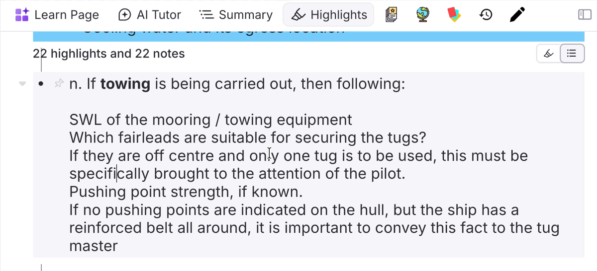

📖 See **[Bulletize Inline Selected Text](Utilities.md#bulletize-inline-selected-text)** in Utilities.

---

## v0.2.272 - June 9th, 2026

### 🐛 Fix: Rogue CardPriority Tags — Root-Cause Prevention + Rebuilt Sanitizer

Fixed the source of "rogue" `CardPriority` powerups — tags that appeared on rems that are **not** flashcards (tag slots, property values, reading-log entries, chapter headers, list items), cluttering the knowledge base and inflating processed-rem counts. See the rewritten **[Rogue CardPriority Tags Sanitization](Troubleshooting.md#rogue-cardpriority-tags-sanitization)** guide.

**Root cause (now fixed).** The inheritance cascade (`recalculateTreeInheritance`) walked **every** descendant of a rem whose priority changed and stamped `CardPriority` on all of them — slots and list items included — because the priority lookup never returns "no priority" (it synthesizes an `inherited`/`default` value). It now **only touches descendants that genuinely own flashcards**, using the authoritative global card index (`plugin.card.getAll()`) as the source of truth. Tagless descendants still inherit dynamically, so nothing is lost; non-flashcard nodes are simply never tagged again.

**Authoritative detection.** Both the global command and the per-rem Debug button now share one card-index + source-based classifier (the previous heuristic matched internal slot-definition references and missed almost everything). A `CardPriority` tag on a rem with **no cards** is classified by its **source**:
- `inherited` / `default` / empty → **rogue** (a cascade artifact) — offered for bulk removal.
- `manual` / `incremental` → **legitimate inheritance anchor** — **preserved and never offered for deletion**. (`incremental` anchors are left behind when a dismissed IncRem hands its priority to descendants; they rank second only to `manual`.) To remove one deliberately, use the per-rem **Clear Card Priority** control.

The card check correctly counts cards on **paused** and **disabled** rems too (it uses `plugin.card.getAll()`, which `rem.getCards()` under-reports), so a real flashcard inside a paused deck is never mistaken for rogue.

**Per-rem "Sanitize Rogue Tags" button now works.** The Debug Widget button previously used the old reference-based heuristic and couldn't cure these rems; it now runs the same authoritative scan over the rem and its descendants.

### ✨ New: "Dump Slot Structure" Diagnostic (Debug Widget)

The [Debug Widget](Plugin-Widgets-Reference.md) gains a **Dump Slot Structure** button under the Card Priority section. It walks the focused rem and all descendants and prints a `console.table` of every node carrying `CardPriority` and/or cards — showing card counts (both APIs), source, structural flags, and a classification (`ok-card` / `inheritance-anchor` / `rogue-no-card`) — so you can confirm exactly which nodes are rogue before cleaning.

### ✨ Improvement: Reference Text Resolved in Rem Labels

`safeRemTextToString` (used across sanitize dialogs, the structure dump, PDF source names, tag lists, and more) now resolves **rem references** to the referenced rem's text. Previously a value whose text was just a reference (e.g. a `Decks In — [Vocabulary]` slot) displayed as "Untitled"; it now shows the referenced text. Only reference-bearing text pays the lookup cost — plain text keeps the fast path, and corrupt rich text still falls back to the robust extraction path.

---

## v0.2.270 - June 3rd, 2026

### ✨ Improvement: Deeper Heading Levels for Inline Child Rems

When you [create a child Rem inline](Create-Incremental-Rem-from-PDF-Highlights.md#creating-children-inline) in the Parent Selector, its heading level now follows the parent's full hierarchy down to `H6`. Previously only `H1`→`H2` was handled (everything else fell back to `H3`); now `H3`→`H4`, `H4`→`H5`, and `H5`→`H6` nest correctly, with non-heading parents defaulting to `H4`. Because the SDK's `setFontSize` only accepts `H1`–`H3`, levels `H4`–`H6` are applied via the Header powerup's `Size` slot, and a styling failure can no longer abort child creation.

---

## v0.2.269 - June 1st, 2026

### ✨ Improvement: Priority-Weighted Randomness (the "Sorting Criteria" lottery)

The **[Incremental Rem Randomness](Prioritization-&-Sorting.md#1-incremental-rem-randomness)** and **[Flashcard Randomness](Prioritization-&-Sorting.md#2-flashcard-randomness)** sliders now distribute their randomness by **priority weight** instead of uniformly. See the new section: **[How Randomness Works: The Priority-Weighted Lottery](Prioritization-&-Sorting.md#how-randomness-works-the-priority-weighted-lottery)**.

**The problem it fixes.** Previously, randomness was applied as blind uniform swaps: `randomness × N` swaps that each picked *both* endpoints uniformly at random. A side effect was that the randomized "tail" was **flat** — an item one rank below your priority cutoff and an item in the *last* quartile were pulled forward with **equal** probability. So once you turned randomness up, you spent roughly the same effort on near-cutoff items as on the lowest-priority items in your collection — the opposite of what prioritization is supposed to guarantee.

**What's new.** The same number of items is still randomized (so your slider values and saved presets behave identically, and `0%` is still strict priority order), but the items competing for the *earlier* of those randomized slots are now drawn with probability proportional to the **Weighted-Shield weight** `W = e^(−2.3026 × p/100)` — the very same curve shown in the [Weighted Shield Breakdown](Prioritization-&-Sorting.md#weighted-shield), where a top-priority item weighs ~**10×** a bottom-priority one. The result is a **smooth gradient** instead of a flat tail:

- A **2nd-quartile** item is now ~**3×** more likely to surface than a **last-quartile** item (they used to be equally likely).
- Each 10-percentile step down in priority is ~**1.26×** less likely to appear.
- Yet **every** item keeps a real, non-zero chance — a priority-80 card is rarer, but never permanently invisible.

**Where it applies.** Both the **live queue's Incremental Rem injection** *and* the **[Priority Review Document](Priority-Review-Document.md)** (IncRems and flashcards). `in-order` review mode is left untouched (it follows document order, not priority). Priority Review Documents pick up the new behavior on **newly generated** documents.

**Advanced.** The decay steepness `k` (default `2.3026 = ln 10`, i.e. the 10× curve) is configurable via synced storage (`weightSelectionK`): larger `k` favors high priority more steeply (low-priority items appear more rarely); smaller `k` flattens toward uniform.

### ✨ Improvement: Randomness Default Raised to 10% + Gentler Slider Curve

Now that randomness is priority-safe (above), the [Sorting Criteria](Prioritization-&-Sorting.md#sorting-criteria) sliders were retuned to encourage healthy exploration:

- **Default Incremental Rem Randomness raised from 0% → 10%.** A small slice of every session now surfaces lower-priority "golden nuggets" out of the box, while the queue stays strongly biased toward high-priority items. (Flashcard Randomness was already 10%.) This only affects users who have never set a value; saved [presets](Prioritization-&-Sorting.md#saved-presets) and any value you've chosen are untouched.
- **Slider curve softened from cubic to quadratic.** The randomness sliders are still non-linear (fine control over small values near the left), but the middle of the slider now reaches a meaningful **~25%** instead of a timid ~12.5%, making moderate randomness easier to dial in. The displayed percentage remains the *actual* fraction randomized. No data migration — only the slider's rendered position changes, so existing values keep working.
- **Labels updated.** The old "*% of Items Swapped*" caption (there are no swaps anymore) now reads "*% randomized (priority-weighted)*", with a hint that higher values stay priority-safe.

---

## v0.2.267 - May 29th, 2026

### ✨ New: Threshold Slider Opens at the Monthly Higher Shield + Catch-Up Hint

The interactive **Absolute Priority threshold slider** in the [Weighted Shield Breakdown popup](Prioritization-&-Sorting.md#weighted-shield) (under each KB and Document section) no longer opens at the bottom of the priority axis. It now opens at the **highest absolute-priority shield value reached in the last 30 days** for that scope and item type — the historical-high cutoff recorded on the [Priority Shield Graph](Plugin-Widgets-Reference.md#44-priority-shield-graph).

A small caption appears directly under the slider summarizing the catch-up gap:

> 📈 **Monthly higher shield:** priority ≤ **N** → **X** due to catch up

…or, when you're already past the historical high:

> ✓ **At monthly higher priority shield (≤ N)**

The catch-up count is fixed to the historical cutoff (not the slider's current position), so it remains meaningful while you drag the slider to explore other thresholds. Lookups are per scope and per item type — KB-IncRem, KB-Card, Doc-IncRem, Doc-Card — each reading from its matching shield-history storage key with the same KB-partition fallbacks the shield graph uses.

### ✨ New: Monthly Higher Shield Panel in the Live Session Dashboard

The [Practiced Queues live dashboard](History-Queue-Dashboard-and-Mastery-Drill.md#practiced-queues-history-live-dashboard) (right sidebar) now shows a compact **📈 Monthly Higher Shield** block at the bottom of the active session card, listing up to four rows — KB-IncRem, KB-Card, Doc-IncRem, Doc-Card — each with the same `priority ≤ N → X due to catch up` / `✓ at monthly higher priority shield` message used in the Weighted Shield popup.

The due counts are computed from the same in-memory session caches (`allIncrementalRemKey`, `allCardPriorityInfoKey`, the scope set, and the seen-in-session lists) used by the in-queue tooltip, so the numbers **drain live** as you review items in the current session.

### ✨ Improvement: Practiced Queues Dashboard Auto-Focus — Handshake Retry

The `Auto focus Queue Dashboard` setting opens the Practiced Queues tab in the right sidebar automatically when you enter a queue. Previously, when the sidebar wasn't already open, RemNote's own AI Tutor tab would steal focus during the same `QueueEnter` event and the Practiced Queues tab wouldn't surface without a manual click. A single 600 ms retry helped only some of the time.

The opener now uses a **handshake**: the widget writes a session-storage flag on mount, and the QueueEnter focus call polls for that flag, re-issuing `openWidgetInRightSidebar('practiced_queues')` until the widget acknowledges or a 3-second deadline is hit. In practice the second attempt wins reliably.

---

## v0.2.260 - May 27th, 2026

### ✨ New: Card Priority × Memory Analytics Tab in the Weighted Shield Popup

The [Weighted Shield Breakdown popup](Prioritization-&-Sorting.md#weighted-shield) (`wsh` command) now exposes a second tab — **Card Priority × Memory Analytics** — that replays FSRS over every card in your knowledge base and aggregates per priority-percentile bucket. Each bucket holds an equal number of cards (deciles by inherited Rem priority), plus a consolidated **All KB** row.

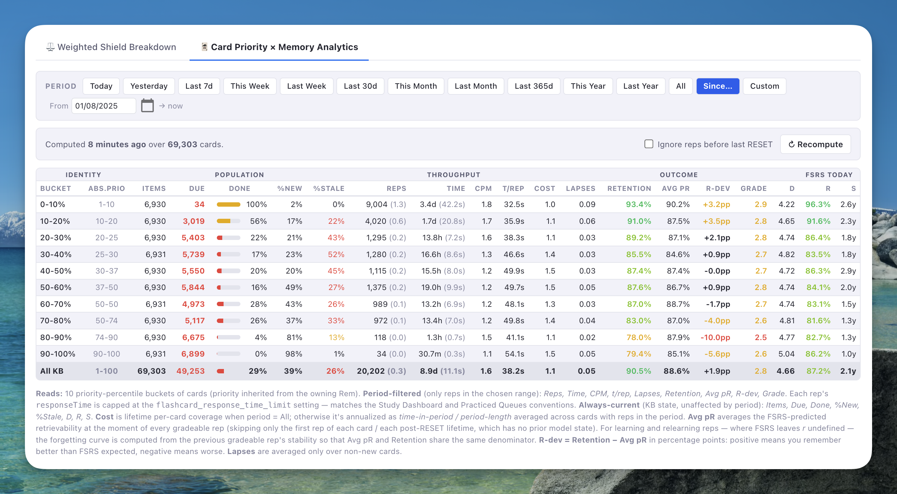{ width="1000" }

20 columns across four groups, with hover tooltips on every header:

- **Identity** — bucket, raw priority range.
- **Population** *(always-current)* — `Items`, `Due`, `Done`, `%New`, `%Stale`.
- **Throughput** *(period-filtered, responseTime capped like the Study Dashboard)* — total / avg `Reps`, total / avg `Time`, `CPM`, `t/rep`, per-card `Cost` (annualized for finite periods, lifetime-coverage for "All").
- **Outcome** *(period-filtered)* — `Lapses` (per non-new card), `Retention`, `Avg pR`, `R-dev` (Retention − Avg pR in pp), average `Grade`.
- **FSRS today** *(always-current)* — average `D`, `R`, `S` across reviewed cards.

`Avg pR` is computed for every gradeable rep in the period except the first rep of each card / each post-RESET lifetime: for learning and relearning reps where FSRS leaves *r* undefined, the forgetting curve is computed locally from the previous gradeable rep's stability — so `Avg pR` and `Retention` share the same denominator.

**Time-period filter:** Today, Yesterday, Last 7d / 30d / 365d, This/Last Week, Month, Year, All, **Since…** (from a picked date onwards), and a Custom date range. The selected period persists in device-local storage and is restored on next open.

**Ignore reps before last RESET toggle:** also added to the Study Dashboard for parity. Useful after importing documents whose foreign repetition history would otherwise pollute the metrics. The aggregate caps each rep's `responseTime` at the `flashcard_response_time_limit` setting, iterates the full history filtered to gradeable scores, and bucketed cards inherit their owning Rem's priority — matching the Study Dashboard / Practiced Queues conventions exactly.

### ✨ Improvement: Study Dashboard — "Since…" Period + Persisted Selection

The [Study Dashboard](Study-Dashboard.md) period picker gained a **Since…** preset that filters from a chosen day through today. The last-selected period (preset + custom dates) is now persisted in device-local storage and restored on next open instead of always defaulting to "This Year".

### ✨ Improvement: Weighted Shield of Cards — Per-Card Bucketing

The [Weighted Shield of Cards](Prioritization-&-Sorting.md#weighted-shield) (the ⚖️ value in the queue toolbar, in the in-queue popup, and in the `wsh` popup's main tab) is now bucketed **per card** instead of per "Rem with Cards". Each card is one item, inherits its owning Rem's priority, and its own `nextRepetitionTime` decides whether it counts as due. This aligns the shield with how RemNote actually schedules and reviews — and with the per-card buckets used by the new Card Priority × Memory Analytics tab. The headline ⚖️ % will shift for users with multi-card rems (e.g. cloze cards, concept/descriptor pairs); row counts now reflect the actual flashcard population. The IncRem shield is unchanged.

### ✨ Improvement: Card Percentile — Unified Per-Card Universe

The relative percentile shown for cards (the "X% of KB" badge next to a card's priority, the standard Priority Shield's `% Done`, the document-scope percentile, the priority distribution graphs, and the Priority Review Document's per-portal percentile) is now computed over the same **per-card universe** as the Weighted Shield. A rem's percentile is the mean rank of its cards within the sorted card population — so a rem with 5 cards spans 5 adjacent ranks and lands at their midpoint. Effect: all card-related percentile values are now derived from a single ranking, eliminating the drift between the shield, the percentile badge, and the PRD that previously came from a per-rem-with-cards ranking. The Priority Review Document still produces **one portal per due rem** (deduplicated); only the percentile metadata it attaches changes. IncRem percentile is unchanged.

> ⚠️ **Expected step on the [Priority Shield Graph](Plugin-Widgets-Reference.md#44-priority-shield-graph) on 2026-05-27.**
> Card-shield history points recorded from today onward use the new per-card universe (for both **Weighted Shield**, **Relative Priority %**, and the **Universe Size** line on the Card shield charts), while points before this date used the per-rem-with-cards universe. Expect a visible discontinuity on this date in the **Document Card Shield** and **Knowledge Base Card Shield** charts — typically a step in the Universe Size line (from the rem count to the larger card count) and small adjustments to the Relative Priority % and Weighted Shield lines. The IncRem charts are unaffected. The discontinuity is a one-time effect of the universe change; the trend resumes normally from this date forward.

---

## v0.2.259 - May 26th, 2026

### ✨ New: Modernized Execute Repetition Popup & Safety Guards

The **Execute Repetition** popup (`Ctrl+Shift+J` in the editor) has been completely redesigned and upgraded with two new safety guards to prevent accidental scheduling mistakes:

- **Aesthetic Overhaul**: Designed to match the priority and page-range widgets. Features a clean card-based layout with a header bar showing the document name and a footer bar displaying keyboard shortcut tips. It integrates the shared priority slider and ancestor badges.
- **Ahead-of-Schedule Info Banner**: If you review an Incremental Rem before its scheduled due date, an amber warning banner appears at the top of the popup informing you how many days early you are.
- **Scheduling Conflict Warning**: Shows a dialog if confirming would schedule a date earlier than currently planned (regression warning), with options to Keep Current Date (record review and time in history but preserve the existing scheduled date), Use New Date, or Custom Interval. Supports quick keyboard navigation (arrows, numbers, Enter, Esc).

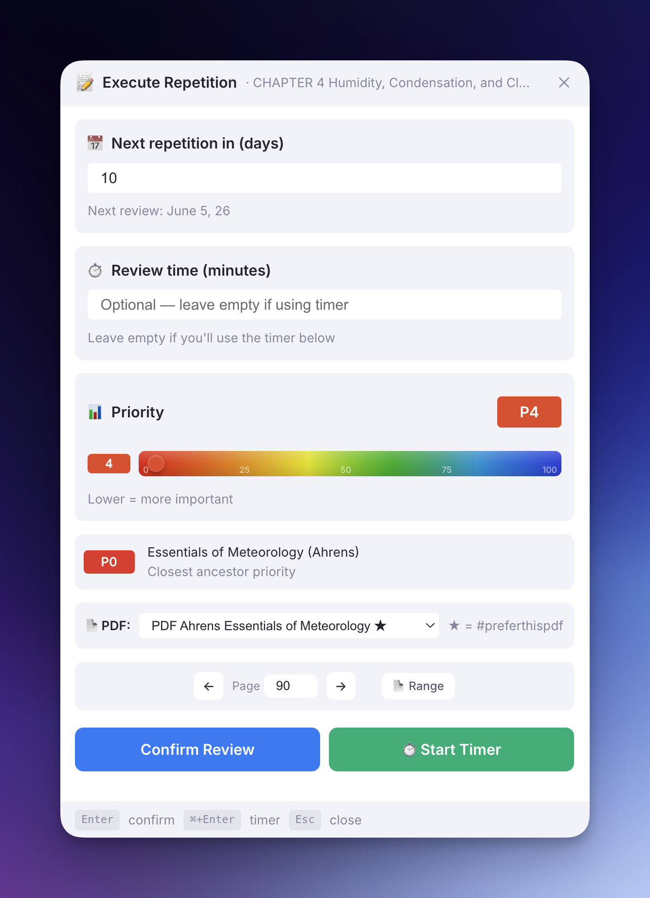{ width="600" }

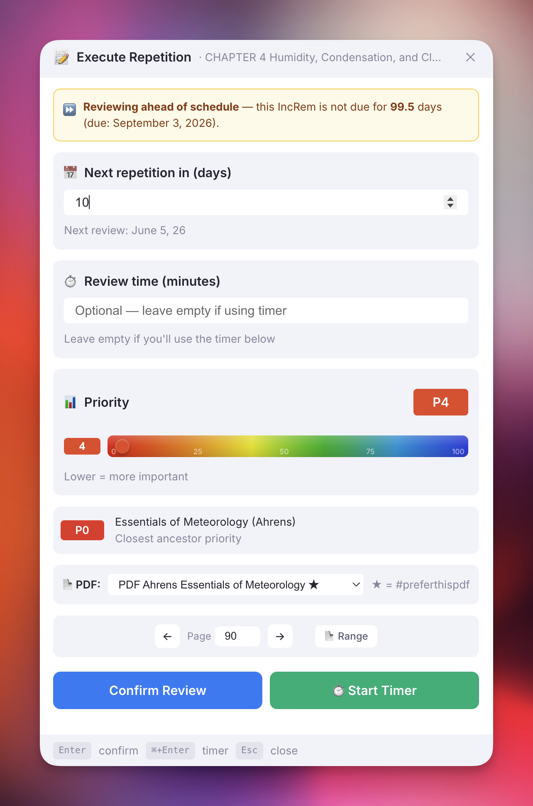{ width="600" }

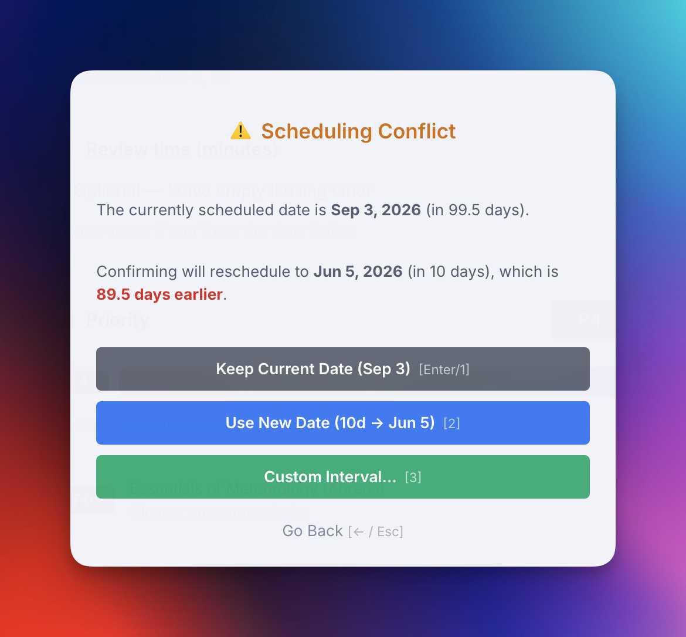{ width="600" }

---

## v0.2.258 - May 26th, 2026

### 🐛 Fix: PDF Control Reading-Time Inflation from Bookmark/Highlight Events

The "Total Time" stat shown on the [PDF Control panel](PDF-Incremental-Reading-Workflow.md) for an Incremental Rem could be massively inflated relative to the authoritative review time shown in [Repetition History](IncRem-List-and-Main-View.md) — in some cases by more than 5× (e.g. **9h 58m** in PDF Control vs **1h 47m** in Repetition History for the same rem on the same PDF).

**Root cause:** `addPageToHistory` had an auto-compute path that, whenever no explicit `sessionDurationOverride` was passed, read `incremReviewStartTimeKey` from session storage and recorded `Date.now() − startTime` as the entry's `sessionDuration`. This anchor was set when the queue picked an IncRem and only cleared on manual reschedule — it was never advanced. Any bookmark / highlight / "Make Incremental from Highlight" event firing during the same review session would re-read the same anchor and write an increasingly large duration, so a chapter with N intermediate highlights ended up with N inflated cumulative durations stacked on top of the legitimate end-session duration.

**Fix:**
- `addPageToHistory` no longer auto-computes a duration. It records `sessionDuration` **only** when an explicit override is passed by a session-boundary caller.
- The queue **Next** button (`answer_buttons.tsx`) now computes `reviewTimeSeconds` at the call site from `incremReviewStartTimeKey` and passes it as the override — mirroring how the [Editor Review Timer](Reviewing-Items-in-the-Editor.md) already worked.
- All other callers (highlight-toolbar "Toggle Incremental", "Save Bookmark" in the bookmark popup, "Make Incremental from Highlight", manual PDF Control page saves, Priority Editor page saves) no longer accidentally write a duration.

Repetition History was already authoritative and unaffected; this fix only stops the PDF-Control duplicate record from drifting away from it.

### 🛠 New: Page History Diagnostic & Cleanup Tools (Debug Widget)

Three new sections were added to the [Debug Widget](Troubleshooting.md#page-history-diagnostic-cleanup-debug-widget) to investigate and remediate the inflation described above:

- **Page History Dump** — for the focused IncRem (or dismissed rem), dumps every page-history entry stored under `incremental_page_history_<remId>_<pdfRemId>` to the console and the UI, with per-entry summary (count of durations, sum vs `getReadingStatistics` total, min/max, entries hitting the 4h cap).
- **Clean Inflated Page-History Durations** — per-rem Preview / Apply. Strips `sessionDuration` from entries that don't match a rep in the IncRem/Dismissed history slot. Cutoff is **2026-02-04 UTC** (the date the Dismissed powerup started preserving `reviewTimeSeconds`); entries before that are always preserved.
- **Clean Inflated Page-History — Global Scan** — enumerates every IncRem and Dismissed rem in the KB and applies the same logic across all PDFs. Shows aggregated stats and a per-rem collapsible breakdown before Apply.

All three tools are non-destructive in preview mode and only mutate storage on explicit confirmation.

---

## v0.2.257 - May 25th, 2026

### ✨ New: Open Weighted Shield Popup Command (`wsh`)

A new [**Open Weighted Shield Popup**](Plugin-Commands-Reference.md#special-operations) command (`quick: wsh`) opens the [Weighted Shield breakdown popup](Prioritization-&-Sorting.md#weighted-shield) directly from the command palette, mirroring the existing [**Open Priority Shield Graph**](Prioritization-&-Sorting.md#priority-shield) command (`shi`). Context is resolved the same way: when invoked from the queue, the popup uses the current sub-queue; when invoked from the editor, it falls back to the focused rem.

---

## v0.2.255 - May 25th, 2026

### ✨ New: Restructure Outline by Headings (`roh`)

A new [**Restructure Outline by Headings**](Utilities.md#restructure-outline-by-headings) command (`quick: roh`) re-nests a flat or mis-pasted document so paragraphs and lower-level headings sit under their preceding higher-level heading. Built for the common case of pasting structured web content into RemNote — which often arrives as a flat list of siblings, or with `H2`s mis-indented under paragraphs instead of their parent `H1`.

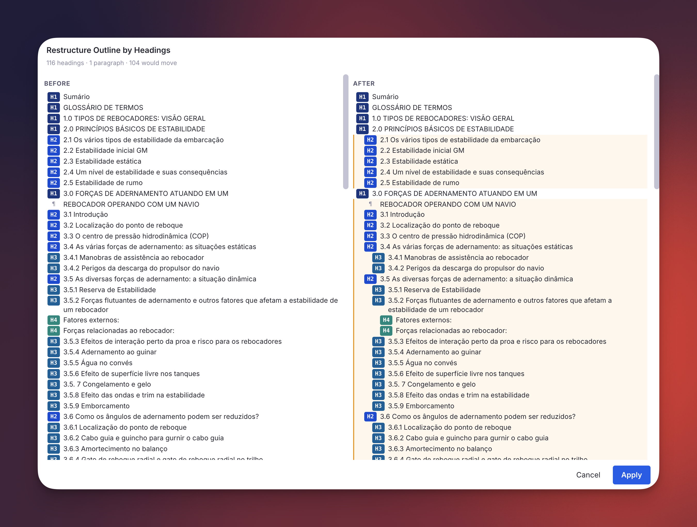

- **Scope-aware:** single rem selected → operates on its descendants; multi-rem → on those rems plus descendants, slotting the restructured subtree back into the selection's original position so unselected siblings keep their relative order around it.
- **Before | After preview popup:** every row that would move is highlighted; non-heading rems with children get an inline **⏷ Preserve / ⏵ Flatten** toggle so you can opt in/out of pulling each subtree into the candidate flow. Toggle re-runs the algorithm live.
- **All six heading levels supported:** H1–H6, including heading-level skips (e.g. `H1 → H3` with no `H2` nests the `H3` directly under the `H1`).
- **Undoable:** after applying, an **Outline Restructured** banner appears in the sidebar with an **Undo Restructure** button; also available as the `Revert Last Outline Restructure` command (`quick: rolr`). Restores every moved rem to its exact prior parent and position.

### ✨ Improvement: Text Case Converter Now Works on Multi-Rem Selections

[**Text Case Converter**](Utilities.md#text-case-converter) (`Shift+F3`) previously only cycled the text **within a single rem**. It now also detects when one or more **whole rems** are selected in the outline and applies the next case (Title → UPPER → lower) to every selected rem's text — including the **back text** of concept/descriptor rems. The cycle stage is detected from the combined text of the batch so all rems advance together, while Title Case is still computed per rem so each one's first/last-word rule is respected.

### ✨ Improvement: Multi-Rem Commands Now Work via `Cmd+/` Omnibar

RemNote blurs the editor when the `Cmd+/` Omnibar opens, which caused plugin commands invoked via palette-search to lose access to whatever multi-rem selection the user had — they would silently no-op or fall back to the focused rem only. A new internal selection cache (subscribed to `EditorSelectionChanged`) restores this behavior for every multi-rem-aware command in the plugin:

- **Make Incremental (Extract)** / **Extract with Priority**
- **Dismiss Incremental Rem**
- **Paste Rem Sources**
- **Text Case Converter**
- **Restructure Outline by Headings**

See [Utilities → Omnibar Selection Recovery](Utilities.md#omnibar-selection-recovery) for the technical details.

---

## v0.2.254 - May 24th, 2026

### ✨ New: Toggle Ignore Tag (`Ctrl+Shift+I`)

Adds/removes an `#ignore` tag on the focused editor Rem. Ignored rems are visually shrunk and dimmed so they read as archived snippets, and the `#ignore` chip is hidden from the editor tag bar to declutter. Use it during Incremental Reading on snippets you've already read but didn't find important enough to make Incremental — they remain in place for archive or future consultation, and the de-emphasized styling signals that they need not be re-processed.

---

## v0.2.252 - May 22nd, 2026

### ✨ Improvement: Isolated Card View Setting Expanded to Cover Highlights

The previous **Show regular Rems in isolated view (Queue)** boolean has been replaced by a dropdown — [**Use Isolated Card View in Queue for**](Plugin-Settings-Reference.md#queue) — letting you pick which item types open in the [Isolated Card Viewer](Plugin-Widgets-Reference.md) by default in the queue:

- **Highlights (PDF/HTML)** *(default)* — only highlights open in the card view; regular Rems open in their full document context.
- **Regular Rems** — only regular Rems open in the card view; highlights open in the PDF/HTML reader.
- **Both** — highlights and regular Rems both open in the card view.
- **None** — neither type opens in the card view by default; highlights go to the PDF/HTML reader and regular Rems to the full document context.

The toggle button in the queue is now **always** available regardless of the setting — the setting only determines the *initial* view for each item, and you can flip back and forth at any time.

### 🐛 Fix: "Create Incremental Rem" From Isolated Card Viewer No Longer Breaks the Queue

When using the **Create Rem** / **Create Incremental Rem** buttons in the Isolated Card Viewer on a highlight that *is* the current queue item, the queue would advance to a blank page. Removing the *Incremental* powerup from the current queue item tears down the queue widget's sandbox before its own tracker can react and advance the queue. The fix mirrors the existing Dismiss button pattern: when the highlight is the current queue item, the powerup removal and the queue advance are now fired simultaneously so both IPC messages reach RemNote before the widget is destroyed.

---

## v0.2.248 - May 22nd, 2026

### ✨ New: Dismissals Tracked in the Incremental Rem History Widget

Dismissing an Incremental Rem now appears in the [Incremental Rem History](Plugin-Widgets-Reference.md#221-incremental-rem-history) sidebar:

- Dismissing during a review (queue **Dismiss** button, editor timer **✓ Dismiss** button, or `Ctrl+D` in the queue) adds a 🔴 **Dismissed** badge next to the existing 🟣 **Reviewed** badge on that entry.
- Dismissing in the editor with `Ctrl+D` (no prior review) creates a new entry showing only the 🔴 **Dismissed** badge.

### ✨ Improvement: Editor Review Timer — Dismiss Button Always Available

The **✓ Dismiss** button in the [Editor Review Timer](Reviewing-Items-in-the-Editor.md#the-workflow) is now shown for every flow that starts a timer — including `Ctrl+Shift+J` (Review in Editor) + **Start Timer** — not only Sequential Review from the IncRem List / Main View. When no further items are queued, Dismiss finalizes the current item and ends the timer in place. The button has also been moved to sit right before the cancel (✕) button.

---

## v0.2.245 - May 20th, 2026

### ✨ New: Study Dashboard

A new popup, opened via the **`Open Study Dashboard`** command (quick code `sdb`), combines period filters and context selectors with a full hierarchy view of your *Incremental*, *Dismissed*, and *Flashcard* activity.

- **Context:** *Global* (whole KB) or *Document* (rem-rooted, with *Descendants Only* and *Comprehensive* sub-scopes — the latter follows the plugin's standard comprehensive expansion of descendants + portals + folder queue + recursive sources + referencing rems + PDF extracts).
- **Period:** Today / Yesterday / Week / This Week / Last Week / Month / This Month / Last Month / Year / This Year / Last Year / All, plus explicit Start/End date inputs for custom ranges. Picking a preset auto-fills the date inputs.
- **Summary table:** three rows (Incremental / Dismissed / Flashcards) plus a bold Total row, with columns for Items, Items-with-reps-in-period, Reps, Time, and (for Flashcards) average Retention and Speed in cards-per-minute.
- **Hierarchy table:** lists every top-level rem with activity in the period, sorted by total time descending, expandable into the full ancestor tree. Each row shows Total Time, Cards (reps + time), Inc. Rems (reps + time, summed across Incremental and Dismissed histories), Retention, and Speed. Structural-only ancestor nodes (italic) keep the tree connected when Comprehensive expansion pulls rems from outside the document.

**Performance design:**
- Bulk-fetches `taggedRem()` for *Incremental*, *Dismissed*, and *cardPriority*, plus a single `card.getAll()`. Because *cardPriority* covers ~all card-bearing rems in a healthy KB, ancestor chain walks need almost no per-rem `findOne` calls.
- The loaded data is cached per session: changing the **period** re-aggregates in memory only (instant) — only changing the **context** or **scope** triggers a reload.
- In Global mode, every top-level rem's subtree is pre-built at load time, so expanding any top-level row is instant.

📖 **Full documentation:** [Study Dashboard](Study-Dashboard.md).

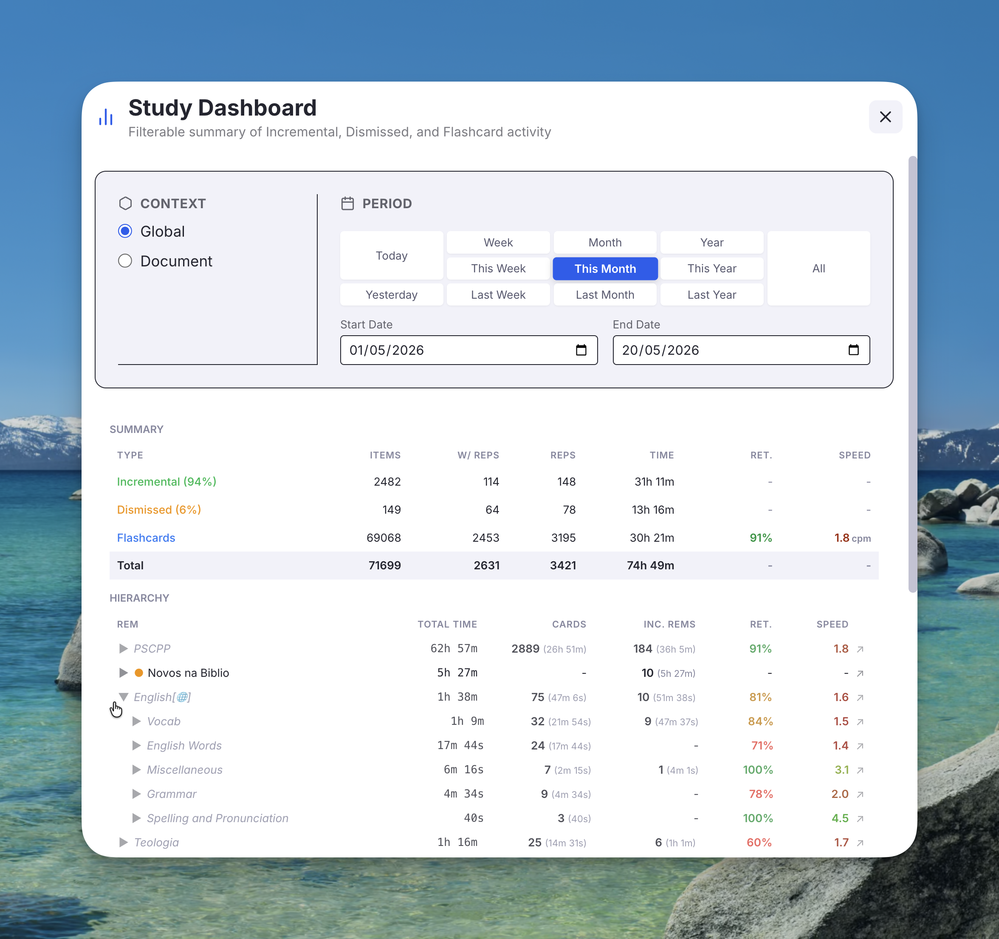{ width="900" }

---

## v0.2.240 - May 20th, 2026

### ✨ Improvement: Tag Labels Replaced by Emoji Badges in the Editor

The `Incremental` and `pdfextract` tag labels in the editor tag bar are now replaced by compact emoji badges — **🔍** for `Incremental` and **✂️** for `pdfextract`. This reduces horizontal clutter while keeping item types identifiable at a glance.

---

## v0.2.239 - May 19th, 2026

### 🐛 Fix: Pin References No Longer Show Raw Text in Lists and Trees

Rem references marked as **pins** (📌) were previously rendered as their full text content, cluttering the IncRem list rows, the Parent Selector tree, and the History sidebars. They now render as a **📌 icon** — hover to see the referenced content as a browser tooltip — keeping each row clean and scannable.

The same fix applies to normal (non-pin) rem references, which previously showed as `[Quote]` in IncRemRow. They now resolve and display their actual text, enclosed in `[brackets]`.

**Affected widgets:** IncRem List / Main View rows, Parent Selector tree nodes, Incremental Rem History sidebar.

### 🐛 Fix: Scroll Position No Longer Resets on Background Refresh

Hovering a pin reference triggers a background data refresh. Previously this reset the scroll position in the IncRem List and Main View widgets (the list briefly replaced itself with a loading placeholder, causing the browser to scroll back to the top). The loading placeholder is now shown **only on the very first load**; background refreshes update data silently without disturbing scroll position.

### ✨ Improvement: IncRem Rows Wrap to 2 Lines

Item titles in the IncRem List, Main View, and Incremental Rem History sidebar now **wrap up to two lines** instead of being hard-truncated at one. This makes longer titles readable at a glance without needing to hover for the tooltip.

### ✨ Improvement: Shield Values Use Subtle Colored Numbers

In the card toolbar (card priority display and answer buttons), the **KB/Doc shield** values previously rendered as full colored badge pills, competing visually with the item's own priority badge. They now render as a **bold number colored by percentile** — same color coding, no background pill — giving the item's priority badge the visual prominence it deserves.

---

## v0.2.238 - May 18th, 2026

### ✨ New: Inline Priority Editing in the History Sidebars

The **Flashcard History** and **Incremental Rem History** sidebars now show a **priority badge** on every entry, right-aligned in the badge row next to the existing Rating / Created-Reviewed badge.

- **Flashcard History** displays each card's *card priority*; **Incremental Rem History** displays each rem's *IncRem priority* (colored by its KB-wide percentile).
- Click a priority badge to open an **inline slider editor** directly in the row — number input plus a drag slider. No popup is opened, so it never conflicts with the queue's target-rem selection.
- The priority value is pre-selected when the editor opens, so you can just type a new number to replace it.
- Writes are delegated to the persistent background tracker (the same mechanism the priority popup uses), so the change is saved reliably even if the sidebar is torn down, and the inheritance cascade still runs.

---

## v0.2.231 - May 13th, 2026

### ✨ New: Sorting Criteria Presets

The Sorting Criteria popup now has a **Presets** panel at the top. Type a name and press Enter (or click 💾 Save) to store your current randomness and flashcard-ratio settings; select a saved preset from the dropdown to restore all three values at once. Presets are KB-scoped.

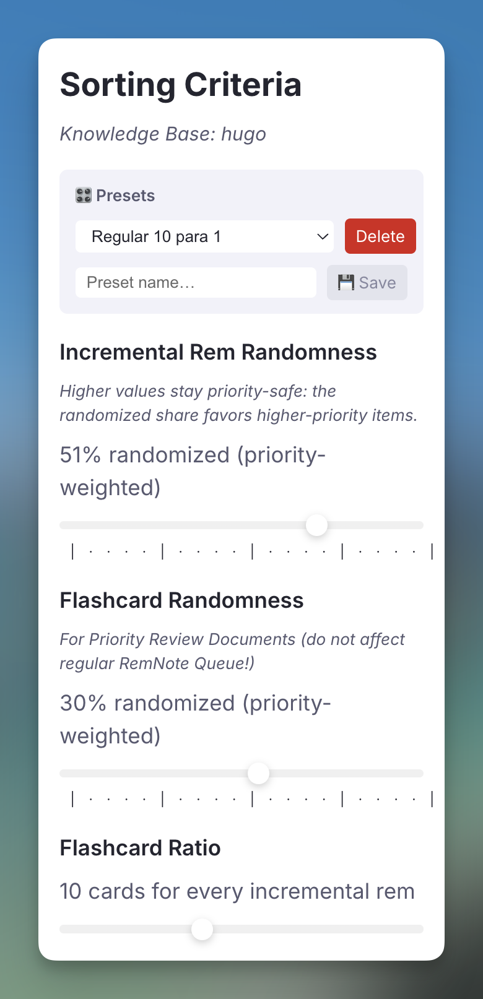{ width="350" }

### 🔧 New: PDF Highlight Repair Tool

Added **Debug PDF** and **Repair PDF** buttons to the `/debug` widget for diagnosing and fixing broken PDF highlight pins.

**The Problem:** After manual reorganization, a knowledge-base restore, or a merge, PDF highlight pins can stop navigating to the correct page. The root causes are two independent structural issues that can occur together or separately:
- Page nodes (`PDFPageNumber`) sitting under the PDF root or a broken `Highlights` container instead of the canonical one (which carries the `PDF Highlight Section` tag applied only by RemNote's PDF engine).
- The `PdfId` slot on `PDFHighlight` rems pointing to a stale or wrong rem ID — the actual cause of pin navigation failure even when the tree looks correct.

**Debug PDF** scans every descendant of the focused PDF rem and prints an annotated tree to the browser console, showing powerups, tags, and the `PdfId` value for every highlight so both issues are immediately visible.

**Repair PDF** runs three independent checks and lists all detected issues before asking for confirmation:
- Moves misplaced page nodes (from the PDF root or broken containers) into the canonical `Highlights` container.
- Fixes every `PdfId` slot that points to the wrong rem.
- Adds the `Document` powerup to the PDF root if missing.

If no canonical `Highlights` container exists yet, the tool instructs you to create a single highlight through the normal PDF viewer first (RemNote creates the container automatically), then run Repair again.

See the [PDF Highlight Repair Tool](Troubleshooting.md#pdf-highlight-repair-tool) guide in Troubleshooting for the full step-by-step workflow.

---

## v0.2.229 - May 13th, 2026

### ✨ New: Skip Paused Documents in Priority Review Document

The Priority Review Document creator now includes a **"Skip paused documents"** option (default: on). When enabled, flashcard rems that live inside a document whose **Deck Status** is "Paused" are excluded from the generated review session, preventing a paused deck from silently consuming priority slots.

**Priority override threshold:** A number input (default **20**) lets you keep items at or above that priority level even when they are inside a paused document — ensuring critically important items are never silently dropped.

**Warning panel:** After creation, if any rems were skipped, the popup shows a warning panel listing each skipped item (name + absolute priority), sorted from most to least important. Items with priority < 20 are highlighted in red as potential high-priority oversight. The "How it works" info box is hidden when the warning panel is visible so the **Close** button is always accessible. The full list (with rem IDs) is also printed to the browser console for easy lookup.

**How it works under the hood:** The check is lazy — the ancestor walk that detects the Deck `Status` slot only runs for cards that would actually be selected, so performance scales with the number of items requested, not the size of your knowledge base.

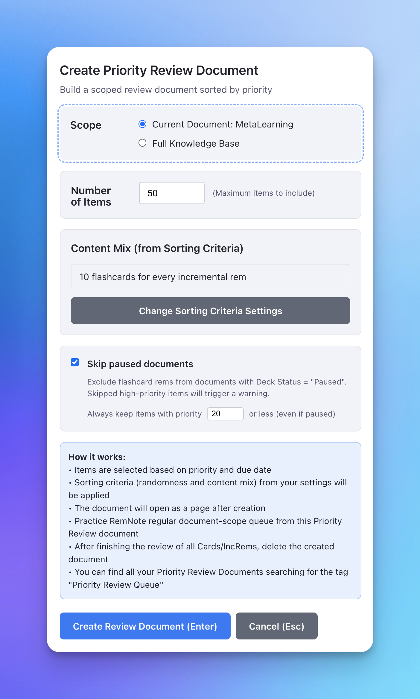{ width="600" }

---

## v0.2.228 - May 12th, 2026

### ✨ New: Rogue CardPriority Sanitization Tool

Added a powerful new diagnostic command, **"Sanitize Rogue CardPriority Tags"**, to help clean up Knowledge Bases that have accumulated "rogue" priority tags on internal property slots.

**The Issue:** Over time, automated background processes could accidentally tag internal property slots (like `History` or `Created`, or property slots from other plugins) with the `cardPriority` powerup, leading to inflated processing times and cluttered databases.

**The Solution:** A robust, two-tier sanitization workflow:
- **Tier 1 (Guaranteed Rogue):** Safely auto-detects and batch-removes tags from our plugin's own structural slots using precise SDK definition ID matching.
- **Tier 2 (Suspicious):** Surfaces third-party property nodes that have `CardPriority` but 0 flashcards for a manual, one-by-one review, ensuring no data loss for legitimate external flashcard integrations.
- **Targeted Sanitization:** You can now also sanitize a specific Rem locally using the `/debug` widget, which will surface a "Sanitize" button if rogue tags are detected on its properties.
- **Safety First:** The scanner guarantees that any Rem with actual flashcards is completely ignored and protected.

### 🐛 Bug Fix: Crash on Rems with Malformed Text
Fixed an issue where the background batch processor could crash with a `richText.toString` error when encountering rems with empty or malformed rich-text structures. It now uses a battle-tested safe string converter to gracefully handle these edge cases without interrupting the batch.

---

## v0.2.218 - May 12th, 2026

### ✨ New: Multi-PDF Support — Switch & Pin the Active PDF Per Inc Rem

Inc Rems can now have **multiple PDF sources** and you can switch between them on the fly in every surface that touches a PDF. Previously, a multi-PDF IncRem had to single out one PDF via the `#preferthispdf` tag, and IncRems without that tag fell through to the ExtractViewer — bypassing the Reader entirely. Multi-PDF Inc Rems are now first-class citizens, with a unified **active-PDF pin** persisted per Inc Rem.

**Where the switcher appears:**
- **Reader (in the queue)** — a PDF dropdown next to the 📝 Document Notes icon. Switching pins the chosen PDF as active for this Inc Rem; the queue re-renders Reader against the new PDF immediately.
- **Editor Review Timer widget** — a small PDF dropdown next to the page controls. Switching mid-session re-targets the 🔖 Scroll button, the Page Controls, and any subsequent reading-time writes to the new PDF.
- **Execute Repetition popup** (`Ctrl+Shift+J` in the editor) — a PDF dropdown above the Page Controls picks which PDF "Start Timer" will open and scroll to.
- **PDF Control Panel** — a PDF dropdown in the header showing every PDF for the current Inc Rem, with `★` marking `#preferthispdf` and `📌` marking the active pin. Selecting changes the panel's *view*; a separate **📌 Set as active** button (only visible while inspecting a non-active PDF) commits the pin.
- **Editor Toolbar (rem sidebar)** — same dropdown + **📌 Set as active** button inside the PDF Range section. Switching changes which PDF's range, current position, history, and scroll button are shown; the explicit button pins.

**Resolution model (applied uniformly everywhere):**
1. **Explicit pin** stored under `active_pdf_for_<remId>` (auto-cleared if the referenced PDF is no longer a source).
2. **`#preferthispdf` tag** — used when no pin is set; if multiple PDFs carry the tag, the first preferred wins gracefully (no more blocking toast).
3. **First PDF source** — final fallback.

**Behavior changes worth knowing:**
- A multi-PDF Inc Rem with no `#preferthispdf` tag now opens the **first PDF in the Reader** instead of falling back to the ExtractViewer. From there the new switcher lets you pick a different one and pin it. The `#extractviewer` tag remains the explicit way to opt into the ExtractViewer.
- The "PDF Control Panel" document-menu item now respects the IncRem it was triggered from. Previously, when many Inc Rems shared the same PDF (e.g. book chapters under one textbook), the menu sometimes silently routed to the parent PDF document.
- View vs. pin: **active-reading surfaces** (Reader, Timer, Execute Repetition popup) pin on switch — switching means "I'm reading this one now." **Management surfaces** (PDF Control Panel, Priority Editor) split view from pin so you can inspect any PDF's data without committing to a pin.

### ✨ Improved: Priority Distribution Graphs — Stacked Due / Processed Bars

Both priority distribution graphs — the **KB Priority Distribution Graph** (All Inc Rems main view) and the **Document Priority Distribution Graph** (IncRem Counter badge) — now use **stacked bars** that split each priority bucket into due and processed items.

Previously, each bar showed only the total count for a priority bucket (e.g. 6309 Rems with Cards in the 35–40 range). You now see at a glance how much of that bucket is still outstanding versus already reviewed and scheduled forward:

| Sub-bar | Color | Meaning |
|---------|-------|---------|
| **Due** (top, saturated) | 🔵 Blue (IncRems) / 🔴 Red (Cards) | Items currently due for review (`nextRepDate ≤ now` for IncRems; at least one due card for flashcard Rems) |
| **Processed** (bottom, light) | 🩵 Light blue / 🩷 Light red | Items already reviewed and scheduled forward — not yet due |

The **tooltip** now shows the full breakdown for each series: total count, due count, processed count, and **% processed** (degree of processing within that bucket).

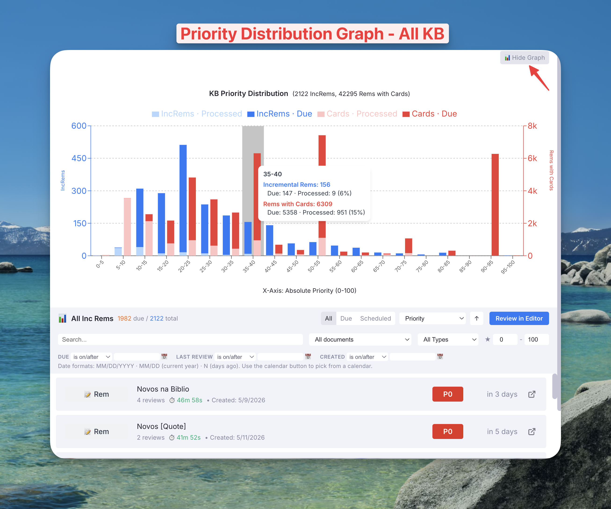{ width="600" }

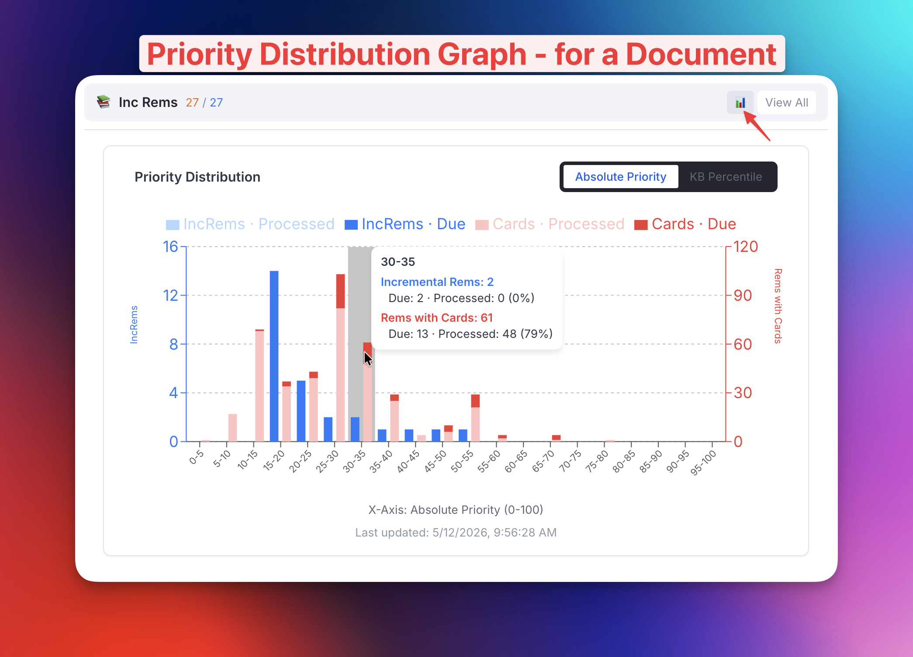{ width="600" }

---

## v0.2.217 - May 8th, 2026

### ✨ New: Weighted Shield Breakdown — Ad-hoc Subset Stats Slider

The [Weighted Shield Breakdown popup](Prioritization-&-Sorting.md#weighted-shield) now includes an interactive **Absolute Priority threshold slider** directly below each bucket table (KB scope and, when applicable, Document scope). Drag the slider to define an ad-hoc subset of all items with absolute priority ≤ the chosen value, and a stats row instantly recomputes: **Rel %ile**, **Items**, **Due**, **% Done**, **Avg W**, and **W Share** for that subset.

This complements the fixed 10-decile bucket view, letting you answer questions the deciles can't — e.g. *"How protected is everything I've prioritized at 25 or less (25 or more important)?"* or *"What share of my total weighted workload sits in my top-50 items?"* — without leaving the popup. Available in both the Flashcard and Incremental Rem Weighted Shield popups.

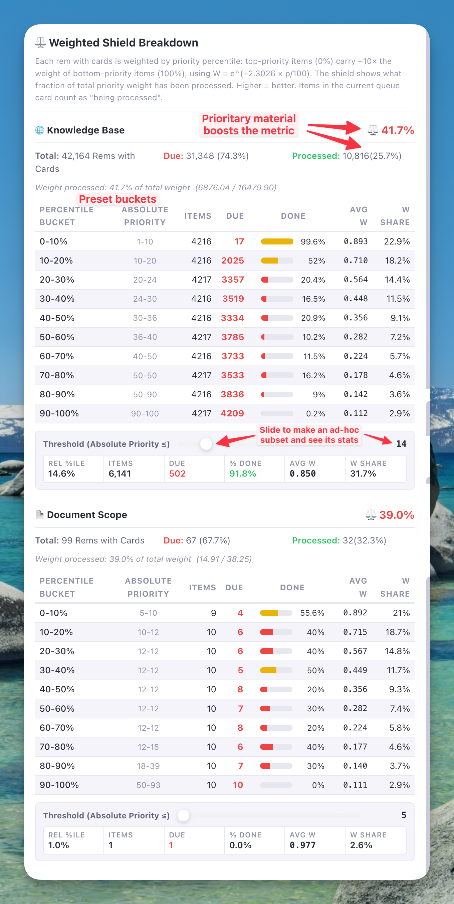{ width="600" }

---

## v0.2.216 - May 8th, 2026

### 🐛 Fix: Cloze (Alt+Z) No Longer Hides Sibling Flashcards

Creating a cloze (`Alt+Z`) used to apply the **Remove from Queue** tag to the *parent* Rem so the cloze wouldn't show its source redundantly during review. The unintended side effect: any **other** flashcard descendants of that parent (e.g. Descriptor children with their own cards) lost their parent context too — a Descriptor flashcard requires its parent Concept above it to make sense.

The new behavior tags the **cloze rem itself** with the new **Remove Parent** powerup. The parent is hidden from the queue *only when this specific cloze is the current card*, leaving sibling and descendant flashcards untouched.

### ✨ Improved: Extract Creation — Powerup-Based Hide of Source Rem

The same problem affected extracts (`Alt+Shift+X`): the source Rem was tagged with a plain Rem named `remove-from-queue`, leaving an orphan tag-rem in the KB. The extract creator now uses a powerup-based approach with a graceful fallback:

- **Preferred path** — when the **Remove from Queue** powerup is registered (either by enabling our new Hide-in-Queue integration setting or by having the standalone Hide in Queue plugin installed): the source Rem is tagged with the powerup directly. Survives extract relocation cleanly — if the user later deletes the source and lets extracts stand on their own, the powerup goes with the source.
- **Fallback path** — when the powerup is unavailable: the *extract* itself is tagged with **Remove Parent** instead. Works for the typical review case, with one caveat — if you later move the extract under a different parent, the new parent will be hidden too. Remove the powerup manually if that happens, or enable the Hide-in-Queue integration to land in the preferred path.

### ✨ New: Hide-in-Queue Powerups Incorporated (Optional Integration)

Incremental Everything can now register the powerups and commands originally distributed by the standalone **Hide in Queue** plugin (Hide in Queue, Remove from Queue, No Hierarchy, Hide Parent, Hide Grandparent), plus two new ones: **Remove Parent** and **Remove Grandparent** (which the cloze/extract flows above use internally).

- The incorporated 5 are gated by a new setting, **Enable Hide-in-Queue powerups and commands** (default: **off**). Enable it only after uninstalling the standalone plugin — the powerup codes are identical and RemNote throws a fatal `Duplicated powerup` error if both register the same code.
- **Remove Parent** and **Remove Grandparent** are always registered regardless of the setting, since the cloze and extract creators depend on them.

See the new [Queue Display Utilities](Utilities.md#queue-display-utilities) section of the Utilities wiki page for full documentation.

### ✨ Improved: Priority Review Document Creator — Keyboard Navigation

The [Create Priority Review Document](Priority-Review-Document.md#how-to-create-a-priority-review-document) popup now supports full keyboard-only operation:

- **Initial focus** lands on the **Scope** radio buttons when the popup opens — no mouse click needed to start.
- **↑ / ↓ arrow keys** switch between "Current Document" (↑) and "Full Knowledge Base" (↓) (when "Scope" selection section is focused), and increment/decrement the "Number of Items" (if focused) by 10.
- **Tab / Shift+Tab** cycles between the Scope selection and the Number of Items field.
- **Enter** at any point — regardless of which element has focus — triggers "Create Review Document" immediately, while **Esc** cancels the operation and closes the widget.

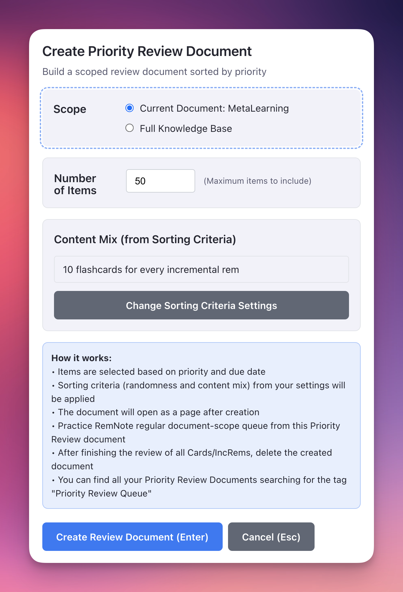{ width="600" }

---

## v0.2.214 - May 7th, 2026

### ✨ New: Authoritative Practiced Queues Statistics (Refresh Statistics button)

The **Practiced Queues History** Summary Table now has a **Refresh Statistics** button that recomputes per-period totals (Today / This Week / Month / Year / Ever) by walking the durable state RemNote itself stores: every card's `repetitionHistory`, every Incremental Rem's history slot, and the Dismissed powerup's preserved history. The previous live-listener tracking remains in place for the per-session log below the Summary, but the Summary numbers themselves are now reconciled against ground truth on demand.

**Why this matters:** the live listener can drop sessions when the queue is interrupted without a `QueueExit` event (tab closed, page navigated, plugin reloaded), and can over- or under-count IncRem time depending on engagement-tracking edge cases. The authoritative walk avoids these pitfalls — its numbers match what RemNote uses internally for its own statistics.

**How it works:**
- Click **Refresh Statistics** in the Summary header. A progress bar shows chunked progress (cards → IncRems → Dismissed) and the recompute is cancellable.
- After the first compute, the Summary is sourced from authoritative aggregates; live listener data continues to fill any gap days *after* the recompute timestamp (so today's ongoing session keeps updating the totals).
- Listener data is **never deleted** — both `practicedQueuesHistory` (raw recent sessions) and `practicedQueuesDailyAggregates` (rolled-over older buckets) remain intact and continue to power the per-session History log.
- For days **before 2026-01-30** (when the Dismissed powerup was introduced), the per-day stat takes `MAX(authoritative, listener)` per field, so dismissed-and-deleted reps that the powerup walk can no longer see are recovered from the listener log when available.
- Filters mirror RemNote's own conventions: `TOO_EARLY`, `VIEWED_AS_LEECH`, `RESET`, `MANUAL_DATE`, `MANUAL_EASE` flashcard scores are excluded; IncRem `rescheduledInEditor` / `manualDateReset` / lifecycle markers are excluded; flashcard response time is capped by the **Flashcard response time limit** setting (IncRem `reviewTimeSeconds` is intentionally not capped).

A diagnostic per-day diff is logged to the console after each Refresh, showing any day where authoritative and listener disagree.

### ✨ Improved: Interrupted-Session Recovery on Plugin Reload

If the queue was interrupted without a `QueueExit` event (tab closed, page reloaded, plugin re-initialized), the in-progress session that was synced to session storage is now rescued into the Practiced Queues history on the next plugin activation. Previously these sessions were silently abandoned.

### 🚀 Performance: Card Priority Cache Build (5x-10× Faster on Startup)

The startup card-priority cache build has been rewritten around the same patterns the authoritative aggregator uses. For a knowledge base with ~50K cards, Phase 1 now completes in seconds instead of minutes.

**What changed:**
- **Eliminated per-rem `findOne` and `hasPowerup` calls.** The build now consumes the `PluginRem` objects returned by `taggedRem()` directly — every rem in that list has the powerup by definition, so the per-rem lookup and powerup check are redundant.
- **Eliminated per-rem `rem.getCards()` calls.** A single `plugin.card.getAll()` at the top of the build buckets every card by remId into an in-memory `Map<RemId, Card[]>`, and `getCardPriority` now accepts a `preloadedCards` option to skip the per-rem round-trip entirely.
- **Parallelized the three powerup slot reads** (`priority`, `prioritySource`, `lastUpdated`) inside `getCardPriority` via a single `Promise.all` instead of three sequential awaits.

Together these reduce the per-rem cost from ~6 sequential round-trips to a single parallel batch — the same shape that makes the authoritative aggregator complete in seconds. The deferred phase (a small set of untagged rems that still need ancestor walks and powerup writes) is unchanged. Logs are also clearer now: prefixed with `[Card Priority Cache]`, with progress markers every 10% and total elapsed time at completion.

This optimization also speeds up the `Update All Inherited Card Priorities` command's final cache-build step.

---

## v0.2.207 - May 4th, 2026

### ✨ Improved: Document Notes Sidebar — Highlight IncRem Support

The **📝 Document Notes** sidebar now works when reviewing **PDF Highlight** or **HTML Highlight** Incremental Rems in the queue — not just full PDF/HTML document IncRems.

**The problem:** Previously, when the sidebar opened during a highlight review, it displayed the highlight extract Rem itself — which typically has no children or notes. The sidebar appeared empty because `currentIncRemKey` pointed to the extract Rem, not the parent reading IncRem.

**How it works now:**
- The queue now publishes the **host document ID** (the PDF/HTML source Rem) as a new session signal (`currentHostDocumentIdKey`).
- When the sidebar detects a highlight type, it uses `findAllRemsForPDF` / `findAllRemsForHTML` to discover all Incremental Rems that read the same source document.
- **Single IncRem:** Auto-selects and shows the `DocumentViewer` for that IncRem immediately — no extra click needed.
- **Multiple IncRems:** Shows a **selector** listing all discovered IncRems, so you can pick which one's notes to view. A "← Switch" button in the header lets you return to the selector at any time.

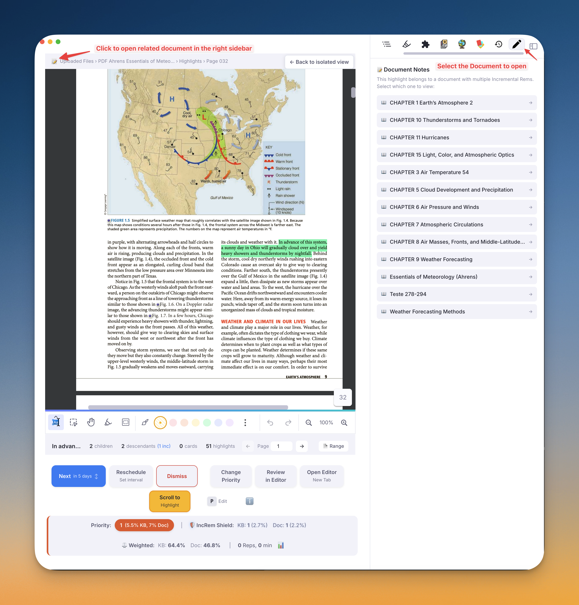{ width="800" }

---

## v0.2.206 - May 3rd, 2026

### ✨ New: Flashcard History Ratings and Filtering

- **Rating Badges**: The Flashcard History widget now displays color-coded rating badges (Again, Hard, Good, Easy) for each flashcard, indicating how you graded the card during your review session.
- **Rating Filtering**: You can now filter the flashcard history by rating grade using a new set of radio buttons at the top of the widget, making it easy to find specific cards based on their performance.
- Both standard flashcards and cluster cards are supported and record their rating accurately into the history.

{ width="600" }

---

## v0.2.202 - May 2nd, 2026

### Performance: PDF Highlight Toolbar Consolidated into Single Widget

The three separate widgets previously rendered in the PDF highlight toolbar (`pdf_bookmark_toolbar`, `create_inc_rem_toolbar`, `toggle_incremental_toolbar`) have been merged into a single `highlight_toolbar` widget. RemNote spins up an isolated iframe for each registered toolbar widget, so three widgets meant three plugin runtimes initializing every time a highlight was selected — the main cause of the visible lag. The new widget renders all three buttons (🔖 bookmark, extract, toggle incremental) from one React tree with a single `getWidgetContext()` call. Visual behavior, icons, and click actions are unchanged. Duplicate context-resolution logic (queue → editor timer → page range fallback) has been extracted into a shared helper in `src/lib/highlightToolbarActions.ts`.

---

## v0.2.199 - May 2nd, 2026

### ✨ New: Auto-Priority for Cloze Deletions (`Alt+Z` and `Alt+Shift+Z`)

Both cloze commands now **automatically assign a Card Priority** to every new cloze child Rem, based on the parent extract's priority. The intended workflow is a natural priority graduation: the first cloze you create from an extract (the most important fact) gets the lowest priority number (highest importance); each subsequent cloze from the same extract gets a slightly higher priority number (less important), reflecting that you are extracting secondary, then tertiary information.

**How the auto-priority is computed:**

> `Card Priority = clamp(parentPriority + min(existingCount, 10) × stepSize, 0, 100)`

- **`parentPriority`** — the parent extract's priority, resolved in order: IncRem priority → own Card Priority slot → ancestor IncRem or Card Priority → default setting.
- **`existingCount`** — sum of two live counts:
  - `#cloze-extract`-tagged **children** of the parent (clozes already extracted from it as siblings of the new one), plus
  - cards the **parent rem owns itself** — native cloze markers inside its text and front/back-direction cards if it is a flashcard.
  The first cloze from a plain (non-flashcard) extract sees count = 0, so it inherits the parent's priority exactly. A cloze made from a Concept/Descriptor extract or from a rem that already contains native clozes starts higher up the count.
- **`stepSize`** — from the [Priority Step Size](Plugin-Settings-Reference.md#priority) setting (default: 10).
- Decrements are **capped at 10** regardless of how many cards/clozes already exist, so even the 15th cloze receives at most 10 extra steps of priority.

**The two variants:**

- **`Alt+Z`** — Creates the cloze and applies the auto-priority **silently**. No popup is shown. Use this when you trust the computed value or want to stay in flow.
- **`Alt+Shift+Z`** — Creates the cloze and opens the **Light Priority popup**, pre-filled with the auto-computed priority. The popup shows a context panel with the parent extract's text, its resolved priority (with source label), the number of existing clozes, and the suggested priority with its full formula — so you can review and override if needed.

**Example:** parent extract has priority 30, step size 5.
| Cloze # | existingCount | Formula | Assigned Priority |
|---|---|---|---|
| 1st | 0 | 30 + 0×5 | 30 |
| 2nd | 1 | 30 + 1×5 | 35 |
| 3rd | 2 | 30 + 2×5 | 40 |
| 11th+ | 10 (cap) | 30 + 10×5 | 80 |

---

## v0.2.198 - May 1st, 2026

### ✨ New: Document Notes Sidebar for PDF/HTML IncRems

When reviewing PDF or HTML Incremental Rems in the queue, you can now easily view and take notes on the underlying document directly in the right sidebar.
- Click the **📝 Document Notes** icon in the PDF/HTML reader top bar.
- The associated document opens in the right sidebar, allowing you to view it side-by-side and jot down notes without disrupting your reading flow.
- The sidebar tab dynamically synchronizes with your queue, showing the document only when you are reviewing an applicable IncRem, and gracefully handling transitions to standard flashcards.

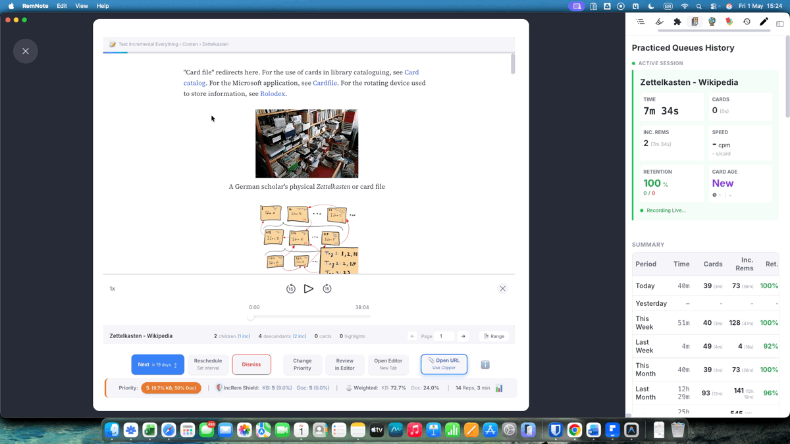


---

## v0.2.194 - May 1st, 2026

### ✨ Improvement: Sorting Criteria is now Knowledge-Base Dependent

The **Sorting Criteria** widget settings (Flashcard Ratio, Incremental Rem Randomness, and Flashcard Randomness) are now scoped to your current Knowledge Base.
- If you use multiple Knowledge Bases, you can now have completely different sorting parameters for each one.
- The active Knowledge Base name is now clearly displayed at the top of the Sorting Criteria popup so you always know which settings you are editing.
- Your previous global settings have been preserved and act as a seamless fallback if you haven't set KB-specific criteria yet.

---

## v0.2.193 - May 1st, 2026

### ✨ Incremental Rem Tracking — All Review Surfaces

IncRem time in the **Practiced Queues** dashboard is now tracked reliably from every place you can review an IncRem, not just the in-queue widget.

**What changed:**

- **All three review surfaces are now instrumented:** the in-queue `QueueComponent`, the **Editor Review Timer** (`⏱️ Start Timer`), and the **Editor Review popup** (manual-minutes confirm) all emit typed tracking signals via a session-storage event log. The main plugin process drains this log at 250 ms intervals and applies the events — the same cross-iframe messaging pattern used for card cluster tracking.
- **Removed the `QueueItemType.Plugin` heuristic.** The old code inferred that the current queue item was an IncRem by checking `QueueItemType.Plugin`. This was fragile and would silently miss editor-side reviews. It has been replaced by explicit signals from the review components.
- **Editor-only sessions.** If you review an IncRem directly from the editor (not from a queue), the plugin now opens a dedicated **"Editor Review"** session. That session auto-saves and closes after **60 minutes of inactivity**, keeping your history clean without any manual step.
- **Queue → editor deduplication.** When you click *Review in Editor* from the queue, the time is counted once — it carries over into the same session rather than starting a separate engagement. The queue and editor timer together record a single continuous block.
- **New setting — Auto focus Queue Dashboard** (default `false`): when enabled, the Practiced Queues dashboard opens automatically in the Right Sidebar every time you enter a queue (except in mobile devices). See [Plugin Settings Reference](Plugin-Settings-Reference.md#queue) for details.

## v0.2.192 - May 1st, 2026

### 🐛 Fix: Deferred card-priority tagging at startup now actually persists tags

On every startup, the cache loader's deferred phase reported successfully processing untagged cards (e.g. "Processed 29 cards in 0s"), but the next session would re-discover the **same** untagged cards and run the deferred phase again. The `Update all inherited Card Priorities` (UCP) command, by contrast, tagged them correctly.

The deferred path was delegating to `autoAssignCardPriority()`, which is intentionally loop-safe in the `GlobalRemChanged` listener: it skips writes when the rem's computed priority already matches its inherited/default value. Since `getCardPriority()` resolves inheritance on-the-fly even for untagged rems, that guard always fired in the deferred context — and the powerup tag was never actually written. The in-memory cache entry made it look like work had happened, but the persistent state was unchanged.

The fix mirrors the UCP pattern: the deferred process now computes via `calculateNewPriority()` (no writes) and unconditionally calls `setCardPriority()` for each untagged rem, bypassing the listener-safe guard. The pre-existing `plugin_operation_active` session flag continues to suppress `GlobalRemChanged` during the batch, so no write storm.

## v0.2.191 - April 29th, 2026

### 🐛 Perf Fix: Priority Editor no longer refetches host data during inheritance cascades

When changing the priority of an ancestor with many descendants, the Background inheritance cascade repeatedly flushed the card priority cache — triggering unnecessary refetches of PDF/HTML host data (source lookup, page range, history, stats) in every open Priority Editor widget.

The fix splits data fetching into three independent hooks:
- **Host identity** (`useRunAsync` on `remId`) — resolves the PDF/HTML source once; never reruns on priority changes.
- **Range / history / stats** (separate `useTrackerPlugin` on `remId + hostId`) — subscribes only to its own synced storage keys; reruns when the user saves a range or bookmark, not during cascades.
- **Priority data** (existing tracker) — reacts to cache flushes as before, but no longer drags along host lookups.

## v0.2.190 - April 29th, 2026

- For setting priorities to **Canvases** and PDFs, now there is a Document Menu Item to **Set Priority**.

## v0.2.189 - April 28th, 2026

- The **Bookmark** feature can now save and retrieve bookmarks in the **Text Reader** mode (PDFs) and **HTML Rem** as well.
- Enhanced the **Editor Toolbar** integration with the bookmark and page controls.
- When Reviewing in Editor using the Ctrl+Shift+J command, the IncRem PDF or HTML source is now opened in a new pane to the right, and scrolls to the last bookmarked highlight; a "Scroll" button is also available.

## v0.2.188 - April 27th, 2026

### Summary: PDF split-pane scrolling in the Editor 📄

When reading a PDF incrementally in the **Editor** (not the queue), you can now jump straight to your last saved bookmark without losing your place:

- **Priority Editor** → click **🔖 Scroll to Position** — the PDF opens in a **new pane to the right** while your IncRem stays on the left
- **Editor Review popup** → click **⏱️ Start Timer** — same behavior: PDF splits to the right, timer starts
- **Review Timer bar** → a new **🔖 Scroll** button appears whenever your current IncRem has a saved bookmark highlight — one click to open the PDF and jump to it

Also: the **🔖 Bookmark popup** now correctly identifies your active IncRem when you're reviewing in the Editor (not just in the Queue), so "Update Current Reading" and the bookmarks history work in that context too.

### ✨ Scroll to Bookmark (in Editor): PDF Opens in a Split Pane

The **🔖 Scroll to Position** button in the **Priority Editor** sidebar and the **⏱️ Start Timer** button in the **Editor Review** popup now open the PDF in a **new pane to the right**, while the Incremental Rem you were reading stays visible on the left.

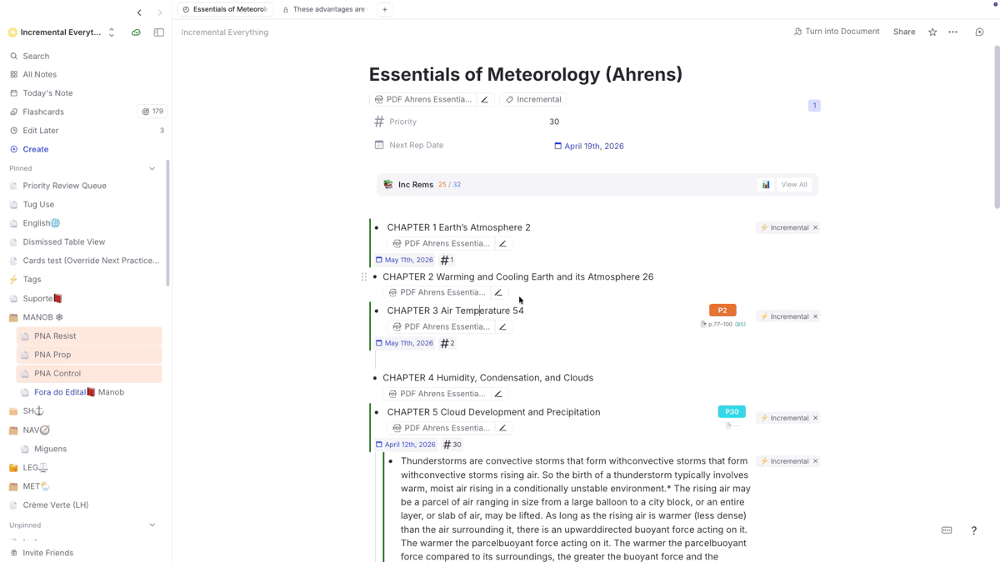

* **New helper — `openRemInNewPane`** (`src/lib/remHelpers.ts`): Uses the SDK's window-tree API (`getCurrentWindowTree` → strip pane IDs → wrap as `{direction:'row', first: existing, second: newRemId}` → `setRemWindowTree`). A smart fast-path detects when the PDF is already open in some pane and calls `setFocusedPaneId` instead of splitting again — so repeated clicks don't stack duplicate panes.
* **Editor Review fix**: The `closePopup()` call was previously executed **before** the `openRemInNewPane` SDK call, which tore down the widget sandbox and caused all subsequent SDK operations to time out (`"operation has timed out"`). The popup is now closed **after** all SDK work completes.
* **🔖 Scroll button on the Editor Review Timer**: The timer toolbar now shows a **🔖 Scroll** button (next to the page controls) when the current IncRem has a saved bookmark highlight. Clicking it opens the PDF in a split pane and jumps to the bookmarked position — identical behavior to the Priority Editor's button.

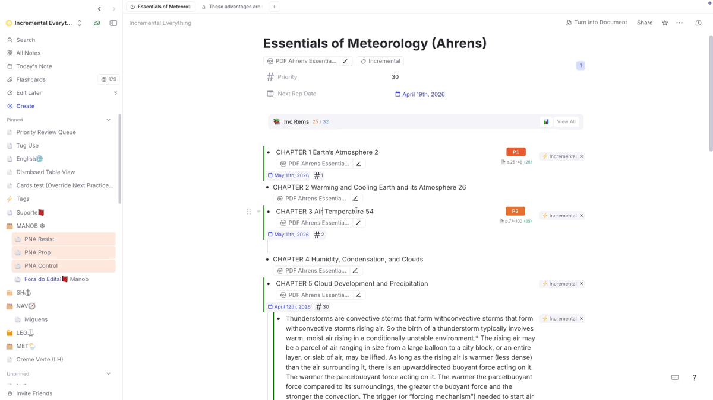

### ✨ Improved: PDF Bookmark Popup & Create IncRem Toolbar — Editor-Review-Timer Context

The **🔖 Bookmark Popup** and the **Create IncRem Toolbar** (funnel icon in the PDF highlight menu) now recognize the **Editor-Review Timer** as an active reading context, not just the queue.

* **Previously**, both widgets only checked `currentIncRemKey` / `incrementalQueueActiveKey` to detect the active IncRem. When reviewing in the editor (via the timer), the URL-change listener clears those keys, so the widgets fell through to the slow full-KB search path or failed to identify the active IncRem entirely.
* **Now**, when no queue context is found, both widgets check `editorReviewTimerRemIdKey` as a fallback. The timer's rem is validated by confirming it owns the current PDF (`findPDFinRem` with target doc ID match) before trusting it — the same safety pattern used by the queue path.
* **UI labels adapt**: The Bookmark Popup's action button shows "Update Current Editor Review Reading" (instead of "Update Current Queue Reading") and the history section header shows "Editor Review Bookmarks:" when the context came from the timer.

---

## v0.2.187 - April 26th, 2026

### 🐛 Bug Fix: UI lag and freezes when editing rems

Editing a single rem with a flashcard could cause RemNote to lock up for several seconds. The previous patch (`v0.2.186`) added a `lastUpdated > 0` clause to `autoAssignCardPriority`'s skip-write guards in an attempt to fix the **Card Priority widget not mounting** for newly cached cards. The clause was unnecessary — the widget already falls back to `getCardPriority()` for untagged rems via `lightCardInfo`, and the deferred batch pushes them into the cache by `remId` regardless of tag status. The real fix for the widget-mount issue was the separate `cardPriorityCacheRefreshKey` bump in `processDeferredCardPriorityCache`, which has been kept.

**The side effect:** the new clause forced `autoAssignCardPriority` to write a CardPriority powerup tag on every untagged rem with cards that fired `GlobalRemChanged`. Each write (`addPowerup` + 3 parallel `setPowerupProperty` calls) re-fired `GlobalRemChanged`, fanning out to ancestors and the cache rebuild. A single flashcard creation generated ~50 events across ~10 rems, blocking RemNote's main thread for seconds.

**The fix:** the `lastUpdated > 0` clauses in `autoAssignCardPriority` (`src/lib/card_priority/index.ts`) are reverted, restoring the original skip-on-match behavior. The `cardPriorityCacheRefreshKey` fix in `cache.ts` is preserved.

**Also in this release:** the cluster-card detection block in the `GlobalRemChanged` listener now short-circuits on `clusterVisibleCardId` first. When no cluster review is in progress (the common case), the listener skips both the `skip_mastery_drill` settings read and the `recentlyProcessedCards` bookkeeping — one fewer await per raw event.

---

## v0.2.186 - April 23rd, 2026

### 🐛 Bug Fix: Mastery Drill & Flashcard History — Card Cluster ratings not tracked

Cards belonging to a **Card Cluster** (a parent rem with the Cluster powerup, whose children are distinct flashcard rems) were never added to or removed from the Mastery Drill, and never appeared in the Flashcard History sidebar, regardless of how they were rated.

#### Why clusters are fundamentally different from normal cards

A Card Cluster is a **parent rem** tagged with the Cluster powerup. Each **child rem** under it is an independent flashcard with its own `remId` and `cardId`. This is different from a single rem that happens to have forward, backward, and cloze card types — those all share one `remId`.

When the queue displays a cluster, RemNote calls `QueueLoadCard` **once**, with the anchor child's `cardId` (this anchor being the first flashcard of the cluster). As the user navigates through subsequent siblings, `QueueLoadCard` does **not** re-fire — only the widget context changes inside the still-mounted queue view. When the user rates a sibling, two things break:

1. **`QueueCompleteCard` does not fire at all** for cluster card ratings. The scheduler updates the card's repetition history directly, but the event is suppressed.
2. **`data.cardId` in `QueueLoadCard` is the anchor's ID**, not the sibling currently on screen. Without additional signals, there is no way to know which sibling was just rated.

#### The role of `card_priority_display` (FlashcardUnder widget)

`card_priority_display.tsx` is a `FlashcardUnder` widget — it mounts inside the queue's card panel, re-rendering on each sibling transition via `getWidgetContext()`. It polls `getWidgetContext().cardId` every 500 ms and, when it detects a change, writes two keys to session storage:

- `clusterVisibleCardId` — the `cardId` of the sibling currently on screen
- `clusterVisibleCardLoadTime` — `Date.now()` at the moment of the write

This gives the event listeners in `events.ts` a reliable, up-to-date pointer to the actual sibling being shown, bridging the gap that `QueueLoadCard`/`QueueCompleteCard` cannot fill.

**Limitation:** `card_priority_display` is mounted inside the regular queue view. It is **not mounted** in the Mastery Drill popup — so `clusterVisibleCardId` is unavailable there.

#### Why `GlobalRemChanged` fires instead of `QueueCompleteCard`

When a cluster card is rated, the scheduler still modifies RemNote's internal data model. This triggers `GlobalRemChanged`, but with the **cluster parent rem's ID** — not any child rem's ID. The event fires 2–3 times per rating (for the parent and at least one other internal rem). This is the only event that signals a cluster card was rated.

#### The three-path fix

| Context | Card type | Mechanism |
|---|---|---|
| Regular queue | Non-cluster flashcard | `QueueCompleteCard` (existing) — `data.cardId` is reliable |
| Regular queue | Cluster sibling | `GlobalRemChanged` on the cluster parent rem → read `clusterVisibleCardId` from session storage (written by `card_priority_display`) → look up the sibling card's repetition history to confirm a fresh rating within the last 10 s |
| Mastery Drill | Any card (cluster or not) | `QueueLoadCard` / `QueueExit` → `processPreviousCard()` checks the **previous** card's repetition history; acts if the last entry is dated after that card's load time |

**Deduplication in the `GlobalRemChanged` path:** because the event fires multiple times per rating (multiple remIds), the listener claims the remId in `recentlyProcessedCards` synchronously before the first `await`, then releases it in a `finally` block once the async work completes (< 1 second). This prevents concurrent invocations from double-writing. For non-cluster cards, `QueueCompleteCard` fires first and adds the remId to the same set, so `GlobalRemChanged` silently skips — the two paths never collide.

**The drill path** (`registerDrillCardRatingListener`) is gated on `finalDrillActive` and does not interfere with the regular queue paths.

#### Flashcard History also fixed

`QueueCompleteCard` was the sole writer to `flashcardHistoryData` (the Flashcard History sidebar). Because it never fires for cluster cards or inside the drill popup, those ratings were silently absent from the history list. The `GlobalRemChanged` cluster path and `processPreviousCard()` now each write a history entry in the same format, closing both gaps.

---

## v0.2.185 - April 22nd, 2026

### ✨ New: SuperMemo-style Create Cloze Deletion (`Alt+Z`)

The **Create Cloze Deletion** command (`Alt+Z`) has been completely redesigned to follow the SuperMemo incremental reading workflow. Instead of marking the selected text as an inline cloze inside the original rem, it now creates a **standalone child rem** that functions as an independent flashcard.

**What happens when you press `Alt+Z`:**

1. A **child rem** is created containing the full text of the parent (front and back, if it is a flashcard). The card delimiter is replaced by a directional arrow (`⇒`, `⇐`, or `⇔`) derived from the rem's practice direction.
2. The **selected text** is marked as a cloze deletion in the child.
3. Any **existing cloze marks** in the parent text are stripped from the child copy and re-marked with yellow highlight + red font, so prior holes are visible without interfering with the new cloze.
4. If the parent is a **Concept** rem, the front portion of the child is rendered in bold; if a **Descriptor**, in italic — matching RemNote's native UI conventions.
5. A **back-reference pin** to the parent is appended at the end of the child's text.
6. The **selected text in the parent** is highlighted in yellow + red font to signal that this passage has been cloze-extracted.
7. The **parent rem** is tagged with `#remove-from-queue`.
8. The child receives a **`cloze-extract` tag**. In the Queue, this tag renders a small violet **↑** badge (hover for tooltip) to identify cards created via this workflow. **In the Editor**, these tagged clozes deliberately appear **less conspicuous** (faded, grayscaled, and zoomed out). This visual cue signals that the Rem merely contains material copied from a parent Rem for priority scheduling purposes, so you can safely skip past it when reviewing your notes.

**Compared to native RemNote clozes:** Native clozes have the advantage of offering **spoiler protection** (cards from the same rem are buried for ~1 hour). The new `Alt+Z` is recommended for when you want to create a **standalone rem** that can be incrementally simplified in wording over time — making each card more atomic and efficient for long-term retention; and when you want to attach different priorities for each cloze.

### 🐛 Bug Fix: Extract (`Alt+X`) — Blue highlight and pin misplaced when parent already had a prior extract

When triggering **Make Incremental with text selection** (`Alt+X`) on a rem that already contained a previous extract's reference pin, the blue highlight and pin were inserted up to 2 characters off from the correct position.

**Root cause:** RemNote's cursor position model counts `i:'q'` reference/pin nodes as **2 characters**, but the plugin's position traversal counted them as 1. Each pin preceding the selection shifted `r_start` by 1 in RemNote's model but only by 1 in our traversal — causing a cumulative offset.

**The fix:** Both `Alt+X` and `Alt+Z` now use **text-only string-matching** (`String.indexOf` on plain-text content) to locate the selection within its section, bypassing RemNote's cursor-width model for non-text nodes entirely. Reference and pin nodes are treated as zero-width in the traversal and pass through unchanged.


### 🐛 Bug Fix: Mastery Drill — Wrong Card Added/Removed Due to Stale Cluster Signal

Cards rated **Good** or **Easy** in the regular queue were incorrectly appearing in the Mastery Drill, and cards rated **Again** or **Hard** were sometimes not added.

**Root cause:** `QueueCompleteCard` used `clusterVisibleCardId` (a session-storage key written asynchronously by the Card Priority Display widget) to identify the specific cluster sibling being rated. When transitioning between cards quickly, `clusterVisibleCardId` could already reflect the *next* card that had just loaded — causing the wrong card to be added or removed from the drill.

**The fix (`src/register/events.ts`):** Before trusting `clusterVisibleCardId`, the listener now verifies that the referenced card belongs to the **same rem** as `data.cardId`. If it belongs to a different rem (i.e., it's stale from the next card), it is discarded and the event's own `data.cardId` is used instead. Legitimate cluster siblings — sharing the same rem — continue to work correctly.

**Cleanup utility:** A new command **"Mastery Drill: Remove cards whose last rating was Good or Easy"** (`cleanup_mastery_drill`) is available in the Command Palette. It audits the current knowledge base's drill queue and removes any entries where the card is missing, has no history, or whose last meaningful rating was not Again or Hard — cleaning up entries corrupted by this bug.


### 🐛 Bug Fix: PDF Database Only Registered First Source on Multi-PDF Rems

When triggering **Make Incremental (Alt+X)** on a rem that has **multiple PDF sources**, the synced `known_pdf_rems_` index (used by the Parent Selector widget to suggest parents for highlights) was only being populated for the **first** PDF source. Subsequent sources were silently skipped, so the Parent Selector would not surface this incremental rem when a highlight was created from those other PDFs.

* **The Issue:** `initIncrementalRem` called `findPDFinRem(rem)` without a target PDF ID, which — by design for backward compatibility — returns only the first PDF found. The result was passed to `registerRemsAsPdfKnown`, so only one entry was written to the index regardless of how many PDF sources the rem had.
* **The Fix:** The registration block now iterates all sources (and the rem itself), checks each one for the `UploadedFile` powerup and a `.pdf` URL, and calls `registerRemsAsPdfKnown` for every PDF found. Rems with multiple PDF sources are now correctly registered against all of them.

---

## v0.2.182 - April 19th, 2026

### ✨ New: History, Queue Dashboard & Mastery Drill (integrated from companion plugin)

All features from the standalone *History, Queue Dashboard and Mastery Drill* plugin have been fully ported into **Incremental Everything**. You no longer need to install a separate plugin.

**What's included:**

- **Visited Rem History** (right sidebar) — a chronological log of Rems you've navigated to in the Editor, with inline expand/edit and multi-word search.
- **Flashcard History** (right sidebar) — records every flashcard reviewed in the queue (cluster-aware: each sibling in a card cluster is logged individually), searchable by front and back text. Click any entry to open the Rem in the Editor.
- **Practiced Queues History & Live Dashboard** (right sidebar) — tracks all your practice sessions with speed (CPM / s/card), retention rate, total time, and a breakdown of flashcard vs. Incremental Rem activity. Includes a live dashboard updating in real time during an active session, plus Export/Import for session history backup.
- **Mastery Drill** — a focused sub-queue of cards you've rated *Forgot* or *Hard*, inspired by SuperMemo's Final Drill. Cards stay in the drill until you rate them *Good* or *Easy*. Accessible via the `Mastery Drill` command (Quick Code: `dri`) or the Left Sidebar notification widget (shown when ≥ 10 cards are pending).

**Cluster-aware improvements (IE-specific, not in original plugin):**

The integration adds fixes not present in the standalone plugin, leveraging IE's existing card cluster detection in the Card Priority Display widget:

- Flashcard history records **each sibling** in a cluster individually as it becomes visible, not just the anchor.
- Practiced Queues card count, time, and retention correctly track **per sibling**, so a 3-sibling cluster counts as 3 cards.
- The **per-card live panel** (current/previous card stats) updates per sibling during cluster review.
- Mastery Drill AGAIN/HARD tracking is attributed to the **actual sibling rated**, not the cluster anchor.

The Mastery Drill is entirely optional — you can disable all its features (popup, notification widget, command, and AGAIN/HARD tracking) via the **Skip Mastery Drill** toggle in plugin settings. Flashcard and Practiced Queue history are unaffected by this toggle.

📖 See [History-Queue-Dashboard-and-Mastery-Drill](History-Queue-Dashboard-and-Mastery-Drill.md) for full documentation.

> **⚠️ Migrating from the standalone plugin?** If you were previously using the *History, Queue Dashboard and Mastery Drill* plugin, follow the steps in [the migration guide](History-Queue-Dashboard-and-Mastery-Drill.md#migrating-from-the-standalone-plugin) before uninstalling it. Brief summary:
>
> 1. **Enable *Skip Mastery Drill* in IE settings and reload RemNote.** This disables IE's drill entirely, preventing duplicate Command Palette entries and double AGAIN/HARD tracking while both plugins coexist.
> 2. **Complete your old Mastery Drill queue** *(optional — skip if you don't mind losing pending items; they will repopulate naturally).*
> 3. **Export Practiced Queues** from the old plugin's sidebar tab.
> 4. **Uninstall the old plugin** (RemNote Settings → Plugins).
> 5. **Disable *Skip Mastery Drill* in IE settings and reload RemNote.**
> 6. **Import Practiced Queues** into IE's sidebar tab. Duplicates are skipped automatically.
>
> Flashcard History and Visited Rem History cannot be migrated; IE has been building its own copies since it was installed.

### ✨ Mastery Drill: Additional Improvements

**Keyboard shortcuts:**
The drill popup now responds to the standard RemNote queue keyboard shortcuts. Pressing **1/2/3/4/Space** will first reveal the answer if it hasn't been shown yet; a second press records the rating (Again / Hard / Good / Good / Easy). **← →** navigate between cards: Left goes back to the previous card, Right skips the current card (undoable with Left).

**Minimum delay (cooldown):**
Cards rated *Again* or *Hard* now enter a configurable cooldown period before appearing in the drill (default: **120 minutes**, adjustable in settings). This prevents immediately re-drilling the same card right after rating it. Cooling cards are shown as a **"X cooling"** badge in the toolbar. The Left Sidebar notification widget also excludes cooling cards — it only shows cards genuinely ready to drill.

**Clear Low Priority Cards:**
A new toolbar button opens a distribution view displaying how many drill cards fall into each of 20 priority buckets (0–5, 6–10, … 96–100) as a horizontal bar chart. Set a priority threshold and remove all cards above it in one click.

**Toolbar redesign:**
The drill toolbar is now split into two rows: a top row for queue management (Remaining count, cooling badge, Clear Queue, Clear Low Priority, old-items warning) and a bottom row for per-card actions (priority badge, Go to Rem, Edit Later, Edit Previous, Edit Current, Remove from Drill). All labels are `whitespace-nowrap` to prevent text from breaking across lines.

**Priority badge (reactive):**
The current card's priority is displayed in the bottom toolbar row and updates reactively as cards change. Clicking the badge opens an inline priority editor directly in the toolbar.

**"Clear Old" tooltip:**
Hovering the old-items warning badge now shows an explanation of why stale items may be better left to the spaced repetition scheduler rather than drilled.

---

## v0.2.181 - April 17th, 2026

### 📚 Documentation & Command Standardization

* **Command Renaming:** The primary `Alt+X` command previously known as "Incremental Everything" has been officially renamed to **Make Incremental (Extract)** across all documentation and the Command Palette to better reflect its core functionality.
* **Command Quick Codes:** Added **Quick Codes** to 18 registered commands, allowing you to trigger tasks even faster via the Command Palette (e.g., `/ext` for Extract, `/pri` for Set Priority, `/res` for Reschedule, `/dis` for Dismiss Incremental Rem, `/pdf` for PDF Control Panel, `/inc` for Incremental Rems Main View, `/shi` for Priority Shield Graph).

📖 See the updated [Plugin Commands Reference](Plugin-Commands-Reference.md) or [Keyboard Shortcuts](Keyboard-Shortcuts.md) for the full list of command names, shortcuts, and Quick Codes.

### 🐛 Bug Fix: Card Priority Display Stuck Inside Card Clusters

The **Card Priority Display** widget (the strip under each flashcard showing priority, Card Shield, Weighted Shield, review stats, and FSRS DSR) was not refreshing when stepping through cards inside a RemNote [Card Cluster](https://help.remnote.com/en/articles/10104223-card-clusters) — every sibling card in the cluster would be annotated with the first sibling's priority, history, and FSRS state.

* **The Issue:** The widget was deriving the current card from `rp.widget.getWidgetContext().remId`. Inside a cluster, RemNote keeps a **single** `FlashcardUnder` widget instance mounted across all sibling cards, and the `remId` field in that context stays pinned to the cluster's **parent** rem. Only the `cardId` field advances per sibling. As a bonus gotcha, `plugin.queue.getCurrentCard()` — the other obvious source — stays locked on the cluster's anchor card too, so it wasn't a usable fallback.
* **The Fix:** The widget now tracks the current sibling by polling `getWidgetContext().cardId` (and listening to `AppEvents.QueueLoadCard` for instant updates), then resolving that `cardId` back to the sibling's real rem via `plugin.card.findOne(cardId).remId`. The downstream `rem` and `cardRepData` trackers depend on that resolved rem, so shield, percentile, FSRS state, and repetition history now recompute per sibling. Verified end-to-end against a 9-sibling cluster in the priority review queue.

## v0.2.180 - April 17th, 2026
 
## ✨ New: Text Case Converter (Utilities)
 
Introduced a [Microsoft] Word-like **Text Case Converter** that cycles selected text through three styles with a single shortcut: **Shift+F3**.
 
* **How it works:** Cycles through **Title Case** → **UPPERCASE** → **lowercase**.
* **Smart Detection:** Automatically detects the current case and moves to the next stage.
* **Rich-Text Safe:** Preserves bold, italic, highlights, and other formatting even across element boundaries.
* **Inspired by:** This feature was inspired by Toshi's ["Text Case Converter"](https://github.com/hitsu3r/remnote-text-case-converter) plugin.
 
📖 See [Utilities](Utilities.md) for more details and Title Case rules.


 
## v0.2.179 - April 16th, 2026

### 🐛 Bug Fix: Incremental Properties CSS Collision

Fixed an issue where the CSS rules designed to hide raw backend properties (like *History*, *Created*, and *Priority*) were overly broad and would inadvertently hide user-created properties if they happened to share the same name (e.g., a user's custom "History" template slot).

* **The Issue:** Because RemNote's outliner virtualizes the DOM into a flat list, the previous CSS could not rely on parent-child tag relationships (like `[data-rem-tags~="incremental"]`) to safely limit the hiding rule to just the plugin's properties.
* **The Fix:** The CSS has been precision-scoped leveraging RemNote's `.rem-powerup-icon` (the native ⚡ lightning bolt). Now, properties like "History" are only forcefully hidden if they belong to a plugin Powerup. User-authored templates, which lack the lightning bolt icon, are completely spared.
* **Note:** The `prioritySource` slot is now also hidden by default to further reduce outliner clutter.

### 🐛 Bug Fix: IncRems with PDF Sources Not Listed as Parent Selector Candidates

Fixed an issue where Incremental Rems that had a PDF as their source were not appearing as candidates in the **Hierarchical Parent Selector** — the popup used when creating an extract from a PDF highlight to choose where it should be placed.

* **The Issue:** The Parent Selector's `performFullPDFSearch` relies on two paths to discover eligible IncRems: a slow iteration of the session cache (PART 1), and a fast lookup of the `known_pdf_rems_` synced-storage index (PART 2). The `known_pdf_rems_` index was only populated by specific "Add Source" commands, but never by `initIncrementalRem` — the core function called when toggling a rem as Incremental via any workflow (Toggle Incremental, toolbar, `Alt+X`, etc.). As a result, the fast synced-storage path always missed these IncRems.
* **The Fix:** `initIncrementalRem` now automatically checks if the newly initialized rem has a PDF source (via `findPDFinRem`) and, if so, registers it in the `known_pdf_rems_` synced-storage index via `registerRemsAsPdfKnown`. This ensures all IncRems with PDF sources are immediately discoverable via the fast path without requiring any expensive global database scan.

## v0.2.178 - April 15th, 2026

### ✨ New: Card Cluster Awareness in Priority Review Documents

The **Priority Review Document** generator now respects RemNote's native **[Card Cluster](https://help.remnote.com/en/articles/10104223-card-clusters)** powerup (added via `/cluster`).

**The problem it solves:** When building a Priority Review Document, the plugin would select individual flashcard rems based on priority. If, for example, only one member of a cluster was selected (the one with the highest individual priority), the other cluster members would be absent from the document. RemNote requires all cluster members to be present together to render and schedule the cluster correctly — so the cluster would silently break inside the review queue.

**The fix:** During document generation, every time a flashcard rem is selected, the plugin now checks whether its **direct parent** carries the Card Cluster powerup. If it does, all sibling rems (children of the same clustered parent) that also have due cards are automatically pulled into the document alongside it.

* **Cluster integrity preserved:** All due cluster siblings are added immediately after the triggering rem, so they appear together as a unit in the resulting queue — exactly as RemNote's native clustering expects.
* **No duplicate portals:** A deduplication set ensures each rem appears at most once, even if multiple cluster members independently meet the priority threshold.
* **Graceful fallback:** The cluster check is fully non-fatal. If the powerup code cannot be resolved (RemNote does not yet expose it in the public SDK), the plugin also checks the parent rem's tags for any text containing "cluster", covering any future SDK gaps.
* **Siblings outside the item budget:** Cluster siblings are added regardless of whether the total count exceeds the requested number of items — this is intentional, as a partial cluster would be worse than a slightly larger document.

📖 See [Priority-Review-Document#card-cluster-support](Priority-Review-Document.md) for more details.

### ⚡ Internal: Cascade Debounce Removed

The 5-second debounce that delayed the background inheritance cascade has been removed. It was originally introduced to prevent rapid `Ctrl+Opt+Up/Down` keypresses from triggering overlapping cascades, but that problem was already solved by the **Delta Queue system** (introduced in v0.2.155), which atomically accumulates and sums rapid keystrokes before ever writing to `pendingInheritanceCascade`. The debounce was therefore keeping `plugin_operation_active` and `incRemBatchActive` suppression flags held for five unnecessary seconds after every priority change.

The cascade now fires immediately upon any priority write. The existing serialization guard (`cascadeRunning` queue) is preserved for the case where a new trigger arrives while a cascade is still executing.

### ⚡ Performance & UX: PDF Bookmark Popup Improvements

Three improvements to the **🔖 Set Bookmark Position** popup (opened from the PDF Highlight Toolbar):

* **Instant open when reviewing in the Queue:** When in the queue, the popup now uses a dedicated fast path that skips all KB-wide searches. Specifically:
    * `findAllRemsForPDF` — a full-KB scan that iterates every rem to find all IncRems associated with the same PDF — is **completely skipped**. It was the primary source of the lag (the popup was iterating thousands of rems to build the hierarchical list of associated reading items), and its result was not even rendered in queue mode (the associated rem list is hidden in favour of the single-rem queue button).
    * `findPDFinRem` — a recursive child-search through the active IncRem's subtree used for queue-context validation — was also skipped (this was the fix in the prior text; `findAllRemsForPDF` is the more significant one).
    * The queue path now performs exactly: one `rem.findOne` (the current queue rem) + one `safeRemTextToString` (for the label) + one `getPageHistory` (to show the "Queue Reading Bookmarks" section). The popup renders in near-zero time.

* **"Update Current Queue Reading" now closes the popup automatically:** Previously the button fired `saveBookmark` without waiting for it to complete, and then left the popup open. The handler is now `async`, properly `await`s the save, and then calls `closePopup()` — ensuring the popup is never torn down mid-write.

* **Robustness: `safeRemTextToString` for rem name display:** The queue-context label (shown below the "Update Current Queue Reading" button) now uses `safeRemTextToString` instead of `plugin.richText.toString`. This handles IncRem names that contain embedded references, images, or other complex rich-text elements that the native conversion cannot process cleanly.

### ✨ Improved: PDF Bookmark Popup — Highlight Text Preview & Order

Two UX improvements to the **Queue Reading Bookmarks** section of the 🔖 Bookmark Position popup:

*   **Highlight text preview:** Each saved bookmark entry now shows a second line with the text of the original PDF highlight it was created from (italic, muted, capped at 90 characters). This makes it easy to identify which part of the reading the bookmark corresponds to at a glance.
*   **Most-recent-first ordering:** Bookmark entries are now sorted by timestamp descending — the most recent bookmark appears at the top of the list.


### 🛡️ Improved: Card Priority Shield Stability

Two improvements to the **Card Priority Shield** (the 🛡️ metric shown on flashcard turns):

* **"Start of Today" due boundary:** The shield now only considers cards that were due **before the start of today** (midnight in the user's local timezone). Previously, any card that became due during a session — for example after being rated *Again*, resetting its interval to a few minutes — would immediately colour the shield, causing unstable readings throughout the day. With this change, the shield exclusively reflects cards that were already waiting for review *before* the session started, aligning with the SuperMemo philosophy that the "Outstanding Queue" is defined once per day and its composition never changes intra-day. **This change applies to both the live display and the QueueExit history record.**

* **QueueExit live verification:** When the session ends and the shield value is written to the history graph, the plugin now performs a live `rem.getCards()` check on the top-priority candidate before committing the result. If the cache entry turns out to be stale (e.g. the card was rescheduled earlier in the session), the plugin automatically escalates to the next priority level and retries — up to 20 API calls total, grouped by priority tier. This eliminates phantom low-shield readings caused by stale cache data persisting into the history.

📖 See [Priorities-for-Flashcards#monitoring-your-load-card-shield](Priorities-for-Flashcards.md) and [Prioritization-&-Sorting#priority-shield](Prioritization-&-Sorting.md) for details.

### 🐛 Bug Fix: Opt+x Priority Inheritance Cache Gap

Fixed a race condition that prevented newly created Incremental Rems via `opt+x` (Extract) from reliably inheriting the priority of their parent Incremental Rem on Web and Mobile platforms.

*   **The Issue:** RemNote's cross-iframe SDK bridge introduces a tiny delay when moving a Rem (`setParent`). At creation, the background tree-climbing function checked `extractRem.parent`, found it `undefined` (due to the cache delay), and incorrectly fell back to the default priority instead of inheriting from the source extraction Rem.
*   **The Fix:** Added an `explicitParentId` override parameter to `initIncrementalRem` and the tree-traversal logic (`findClosestAncestorWithAnyPriority`). Since `opt+x` *knows* what parent it just assigned the extract to, it passes the ID directly, bypassing the SDK's stale local cache entirely for the critical first step.

### ✨ Improved: Deep PDF Reference Pinning for Extracts

When executing an Extract command (`Opt+X` / `Opt+Shift+X`) on an Incremental Rem that was originally extracted from a PDF highlight, the newly created sub-extract will now **automatically inherit the reference pin to the original PDF highlight**. 

This means deep child extracts will contain two pins: one pointing to the immediate parent, and a second one bridging directly back to the original native PDF highlight, preserving one-click access to the source document context no matter how deep your extraction tree goes.

### 🐛 Bug Fix: Create IncRem Toolbar Extracting Wrong Highlight

Fixed a bug where pressing the **Create IncRem** button (funnel icon in the PDF Highlight Toolbar) on a **second** highlight would incorrectly create the extract from the **first** highlight of the session instead.

*   **The Issue:** The toolbar widget cached the highlight's rem ID in React state (`useState`) on mount, read once via `useEffect`. RemNote reuses the same toolbar widget instance across different highlight selections without remounting it — so the state was never updated after the first selection, causing all subsequent clicks to use the stale first-highlight ID.
*   **The Fix:** Removed the cached state entirely. The widget context (`getWidgetContext`) is now called fresh inside the click handler on every press, guaranteeing the currently-selected highlight's ID is always used.


---

## v0.2.175 - April 14th, 2026

### ✨ New: Device-Specific Incremental Rem Toggle
* **Local Disable via Queue Menu:** You can now permanently disable the injection of Incremental Rems on a specific device (like your mobile phone) via the new **"Toggle Inc Rems in this device"** option in the Queue Menu (top right corner).
* **Visual Feedback:** When disabled, a `🚫 Inc Rems disabled (Device)` yellow banner appears in the Queue Toolbar during the first 10 seconds of entering the queue. It provides a quick way to re-enable Incremental Rems without pestering you or taking up valuable mobile screen real-estate permanently.
* **Separated from 15-Min Timer:** This new device-specific state behaves identically to the "15 min" timer (temporarily blocking IncRems), but is correctly saved to Local Storage instead of Synced Storage so toggling it on your phone won't affect your desktop. 

{ width="400" }

{ width="400" }

### ✨ New: Create Incremental Rem from Queue Flashcards natively
* **Direct Queue Conversion:** You can now press `Alt+X` (Make Incremental (Extract)) or `Alt+Shift+X` (Extract with Priority) while reviewing a flashcard in the queue to instantly turn that specific flashcard into an Incremental Rem. The command smartly targets the active flashcard Rem without requiring you to manually select the text or use the previewer, integrating flawlessly into your routine flow if you realize a certain flashcard should become a reading task (to clarify issues, add extra details, etc).

### 🎨 UI Polish: Card Priority Display Indicator
* **Incremental Rem Status Indicator:** The **Card Priority Display** widget (at the bottom of flashcards) now displays an unmistakable visual indicator (the mining icon) on the right border whenever the card you are answering is also an Incremental Rem. This allows you to instantly know the dual-status of the material.

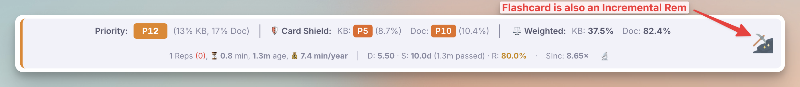{ width="900" }

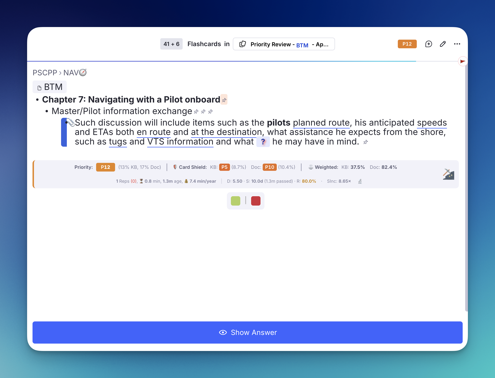{ width="900" }

## v0.2.173 - April 13th, 2026

### 🐛 Bug Fixes & Compatibility

* **Queue Caching Issue Resolved:** Fixed a bug where reviewed Incremental Rems would incorrectly reappear in the queue shortly after being answered. 
  * *The Issue:* The session cache was being updated with stale data because the plugin queried the database (`rem.findOne`) immediately after writing the new due date, hitting the SDK's local read cache before the database write had fully propagated. This affected two separate review paths: the standard **Next** button and the **Reschedule** widget.
  * *The Fix:* We bypassed the delayed SDK read cache entirely in both paths by manually constructing the updated `IncrementalRem` cache object from locally computed values (the exact same `nextRepDate`, `history`, and `priority` that were just written to the DB) and injecting it directly into the session cache — with no round-trip to the SDK required.
* **Dynamic Bookmarking in Toggle Toolbar Fixed:** Fixed an issue where the "Toggle Incremental" toolbar button failed to dynamically save PDF bookmark positions.
  * *The Issue:* The previous implementation relied on a weak session variable (`pageRangeContext`) which often failed to accurately identify the currently active Incremental Rem being reviewed in the queue.
  * *The Fix:* Implemented a strict queue context validation (verifying the `incrementalQueueActiveKey` and utilizing `findPDFinRem`) to reliably identify the exact parent context. The bookmark now accurately binds to the active queue item, providing immediate visual feedback via toasts.

## v0.2.170 - April 13th, 2026

### ✨ PDF Incremental Reading Flow Improvements

We've improved how PDFs are handled to support deep, structured reading. This update focuses on position tracking, streamlined extraction, and better management of long documents.

* **Smart Position Tracking:** The plugin now automatically remembers your last saved reading position for every PDF chapter (provided you created extracts or set the bookmark in a PDF highlight). When you review an Incremental Rem in the queue, the reader scrolls precisely to where you left off.
* **Automatic Bookmarking:** Creating an extract or toggling a highlight as incremental now automatically updates your reading position to that location, adding an entry to your reading history.
* **Enhanced PDF Toolbar:** Three new utility buttons have been added to the native PDF highlight menu:
    * 🔖 **Set Bookmark Position:** Manually record your current page.
    * { width="16" } **Create Incremental Rem:** Extract highlights into standalone items and choose their location in your hierarchy.
    * { width="16" } **Toggle Incremental Rem:** Quick-tag a highlight for later review without moving it.
* **Hierarchical Management:** Use the **PDF Control Panel** to split long PDFs into chapters, manage page ranges, and view reading statistics in a containment tree.
* **Inline Management:** Manage PDF page ranges and record positions directly from the **Priority Editor** sidebar without leaving your document.

📖 **Learn more:** See the full [PDF Incremental Reading Workflow](PDF-Incremental-Reading-Workflow.md) and the guide on [Create-Incremental-Rem-from-PDF-Highlights](Create-Incremental-Rem-from-PDF-Highlights.md).

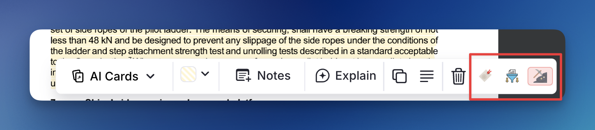{ width="700" }


### ✨ Re-enabled: Collapse Queue Top Bar (IncRem Only)

The **Collapse Queue Top Bar** setting is back — previously disabled due to cross-widget timing issues, it has been re-implemented cleanly using the same `:has()` CSS-gating pattern established in this release.

**How it works:** When enabled (default: off), the queue top bar collapses to a 3px strip during Incremental Rem turns, freeing vertical space for the content. Hover over the strip to reveal it smoothly; it auto-collapses 0.6s after the cursor leaves. The progress bar (`.rn-queue__progress-bar`) is also hidden during IncRem turns.

### 🐛 Bug Fix: Definitive Queue CSS — Flashcard History Wrongly Hidden During Regular Flashcards

This release delivers the final, stable resolution of the long-running issue where the **Flashcard Repetition History** and **AI Suggestions** widgets were incorrectly hidden during regular flashcard turns.

#### Root Cause: Two Separate Bugs Found

**1. Widget URL substring collision**

All CSS selectors were gated on:

```css
.rn-queue:has(iframe[src*="widgetName=queue"])
```

Because `*=` is a **substring match**, the URL `?widgetName=queue_toolbar_priority&…` also satisfies `src*="widgetName=queue"` — `queue` is a prefix of `queue_toolbar_priority`. Since our `queue_toolbar_priority` widget is loaded in the top toolbar on **every** queue turn (including regular flashcards), the `:has()` gate was always active, causing the hide rules to fire unconditionally.

**Fix:** The match is now anchored with the separator that always follows a URL parameter value — making it `[src*="widgetName=queue&"]`. The `queue` widget's URL is `?widgetName=queue&pluginId=…`, so `queue&` is an exact token boundary. `queue_toolbar_priority` is never followed immediately by `&` after `queue`, so it no longer triggers the selector.

**2. `[data-queue-rem-tags~="incremental"]` absent on PDF IncRems**

The previous workaround for dual-type rems (both IncRem and flashcard) inserted `[data-queue-rem-tags~="incremental"]` as a middle ancestor in the selector chain. This attribute is generated by RemNote's standard spaced-repetition prompt structure — which is **not rendered** for PDF IncRems shown as `QueueItemType.Plugin` items. On those turns the entire spaced-repetition DOM is skipped, so `data-queue-rem-tags` never appeared and the hide rules never matched. Reverting to the simpler `[src*="widgetName=queue&"]` gate made this guard unnecessary.

#### Why the Simpler Global Approach Is Now Safe

Removing `[data-queue-rem-tags~="incremental"]` and relying solely on the plugin iframe presence raises the obvious question: does this break dual-type rems (rems that are both IncRems and flashcards)?

No — because the `queue` widget is registered with `queueItemTypeFilter: QueueItemType.Plugin`. RemNote only mounts that iframe on Plugin-type turns; the iframe is **physically absent** from the DOM during a regular flashcard turn, even for a dual-type rem. The `:has()` selector cannot match an element that does not exist.

The CSS is now registered **once globally at plugin startup** (alongside the layout fix CSS), eliminating all `registerCSS(id, '')` / `registerCSS(id, CSS)` toggle calls from `GetNextCard`. This removes the pre-fetch race condition entirely: there is nothing to race against. The browser's CSS engine handles the on/off logic by evaluating `:has()` live against the DOM — the rule activates the instant the `queue` iframe mounts and deactivates the instant it unmounts.

#### Also Fixed: Excess Top Padding in the IncRem Action Bar

The `spaced-repetition__bottom` container carries a hard-coded `pt-6` (1.5 rem top padding) from RemNote's default styles. When the **Answer Buttons** widget fills that container, this padding created unwanted blank space above the buttons. A scoped `:has()` rule now zeroes out `padding-top` exactly when our `answer_buttons` iframe is present, leaving regular flashcard turns unaffected.

---

## v0.2.169 - April 11th, 2026


### ✨ New: SuperMemo-style Extract & Cloze Logic

We've introduced a major enhancement to the text-processing workflow, bringing full **SuperMemo-like Incremental Reading** capabilities directly to the editor.

#### 📝 Extract Selection (`Opt+X` / `Opt+Shift+X`)

You can now extract specific sub-sections of text into new Incremental Rems with a single keystroke. When you select text and trigger the extract command:
- **Automatic Highlighting:** The source text in your document is automatically formatted with a **blue highlight** to mark its extraction.
- **Reference Pin:** A clickable **Rem Reference Pin** is inserted immediately after the highlighted text, pointing directly to the new extract.
- **Smart Formatting:** The new extract Rem contains your selected text plus a **back-reference pin** to its parent, and is initialized as an Incremental Rem. The **parent Rem** is automatically tagged with `#remove-from-queue`.
- **Priority Sync:** For `Opt+Shift+X`, the **Priority & Interval** popup opens instantly for the new extract.
- **Intelligent Fallback:** If no text is selected, the command safely falls back to making the active Rem itself Incremental.


#### ✂️ Create Cloze Deletion (`Opt+Z`)

A new dedicated command to quickly generate **Cloze Deletions** on any selected text. 
- **Workflow-Native:** Mimics the standard SuperMemo shortcut for fast card creation during incremental reading.
- **Instant Validation:** Includes built-in checks to prevent the creation of "ghost" cards from empty selections, with helpful toast notifications.

#### 🛡️ Built-in "Remove From Queue" Styling

The plugin now natively includes the CSS required for the `#remove-from-queue` tag. This ensures that the parent document of an extract doesn't show up in the queue alongside the extract, keeping your queue uncluttered and your focus on the extracted snippet.

### 🔧 Fixes

#### 🔄 Priority Inheritance Cascade

- **Reliable Updates:** Fixed an issue where priority inheritance cascades were not being triggered during "Quick Update" actions in the Priority Editor or during Batch Card Priority assignments. All priority changes now correctly signal the background tracker to recalculate and propagate values to all descendants, ensuring data consistency.

---


### 🐛 Bug Fix: Flashcard Insights & AI Widgets Hidden During Regular Flashcard Review

This release resolves a persistent bug where the **Flashcard Insights**, **Bottom-of-card AI Suggestions**, and **Flashcard Repetition History** widgets were incorrectly hidden while reviewing regular flashcards, when they should only be suppressed during Incremental Rem review turns.

#### Root Cause: Three Compounding Problems

The fix required untangling three separate but interacting issues:

**1. Global CSS with insufficient scoping (v0.2.167)**

The first attempt scoped the `display: none` rules to `.rn-queue:has([data-queue-rem-tags~="incremental"])`. The logic was sound on paper — hide those widgets only when a queue element tagged `"incremental"` is present. However, `:has()` is a *presence* check on the entire subtree. RemNote keeps multiple queue items coexisting in the DOM simultaneously (pre-rendering the next card, caching the previous one), so the `data-queue-rem-tags~="incremental"` attribute from a *cached* Incremental Rem item was visible to `:has()` even when the currently *displayed* item was a regular flashcard. The rule matched the entire queue and hid the widgets across all items.

**2. Direct ancestor scoping was still insufficient**

The second attempt used `[data-queue-rem-tags~="incremental"]` as a **direct ancestor** of the elements to hide, rather than checking it via `:has()` at the queue root. This correctly prevented cached sibling items from triggering the rule. However, it introduced a new edge case: a Rem that is **both an Incremental Rem and a flashcard** carries `data-queue-rem-tags~="incremental"` on its container for *all* its queue appearances — both its Plugin turn and its flashcard turn. The direct ancestor selector had no way to distinguish which turn was currently active, so the widgets were still hidden during flashcard turns for those dual-type rems.

**3. The pre-fetch `GetNextCard` race condition**

The correct architectural solution — dynamically registering the hide CSS only when `GetNextCard` explicitly returns a `QueueItemType.Plugin` item — is exposed to the same class of pre-fetch race that caused the original layout-fix CSS to be reverted (commit `afb496d`, v0.2.141). RemNote fires a background `GetNextCard` call to pre-fetch the *next* card while the current one is still displayed. If that pre-fetch returns `null` (a flashcard), it calls `registerCSS(hideId, '')`, clearing the hide CSS mid-display of the current Incremental Rem — causing a brief flicker where the suppressed widgets reappear.

#### The Final Fix: Dynamic Registration with a DOM-Level Self-Guard

The fix combines a JavaScript layer and a CSS layer, mirroring the pattern used for the static layout-fix CSS:

*   **JS layer (dynamic registration in `GetNextCard`):** The hide CSS is registered only when `GetNextCard` genuinely returns a `QueueItemType.Plugin` item, and explicitly cleared in every path that returns `null` — including the no-timer block, the empty-filtered-list path, the all-items-invalid-after-verification path, and the normal flashcard turn. This correctly handles the dual IncRem+flashcard case: even for a rem that carries `data-queue-rem-tags~="incremental"`, the CSS is simply absent during its flashcard turns.

*   **CSS layer (DOM self-guard):** All four hide selectors are additionally rooted at `.rn-queue:has(iframe[data-plugin-id="incremental-everything"][src*="widgetName=queue"])`. This means the rules only match when the plugin's queue iframe is actually present in the DOM. If a concurrent pre-fetch `GetNextCard` null-return fires `registerCSS('')` a few milliseconds late, the CSS self-deactivates at the DOM level the instant RemNote removes the plugin iframe — the rules stop matching regardless of JS timing.

The two layers are complementary: the JS layer is the primary gate (correct in the common case), and the CSS iframe condition is the safety net for the race-condition edge case.

### 🎨 UI Polish: Card Priority Display Now Appears Above Flashcard Repetition History

The **Card Priority Display** widget (shown below flashcards in the queue) was previously rendered *below* the **Flashcard Repetition History** widget, because RemNote injects third-party plugin iframes before our own in the DOM order.

**Fix:** The flashcard content container is already a `flex flex-col` element, so a single `order: 1` rule on the `flashcard-repetition-history` wrapper is enough to push it after all default-ordered items — no DOM manipulation needed. The rule is scoped to only activate when our `card_priority_display` iframe is present in the same container, leaving all other flashcard layouts unaffected.

---

## v0.2.168 - April 10th, 2026

### 🗓️ IncRem List: Date-Based Filtering, New Sort Options & Created At Tracking

A significant upgrade to the **IncRem List** and **All Inc Rems** widgets, adding fine-grained date filtering, new sort options, and a new "Created At" metadata field for every Incremental Rem.

#### Date Filters

A dedicated date filter bar has been added below the existing status/type/priority filters. It contains three independent date fields — **Due**, **Last Review**, and **Created** — each supporting six comparison operators:

| Operator | Meaning |
|---|---|
| **is** | Exactly on that date |
| **is before** | Strictly earlier than the date |
| **is after** | Strictly later than the date |
| **is on/before** | On or before the date |
| **is on/after** | On or after the date |
| **is between** | Within a date range (shows a second input) |

Each field accepts three input formats:
- **MM/DD/YYYY** — a specific date
- **MM/DD** — that month and day in the current year
- **N** (plain integer) — N days ago from today (e.g. `30` = 30 days ago)

A **calendar button** (📅) next to each input opens the native date picker. Typing directly into the field is also supported; invalid values are highlighted with a **red border** and a red background tint. A shared hint line at the bottom of the filter bar explains all accepted formats.

#### New Sort Options

Two new options have been added to the sort dropdown:
- **Created At** — sort by the date the Rem was first made Incremental
- **Last Review Date** — sort by the most recent review session

The "Created At" field is also now visible on each row below the last-reviewed date.

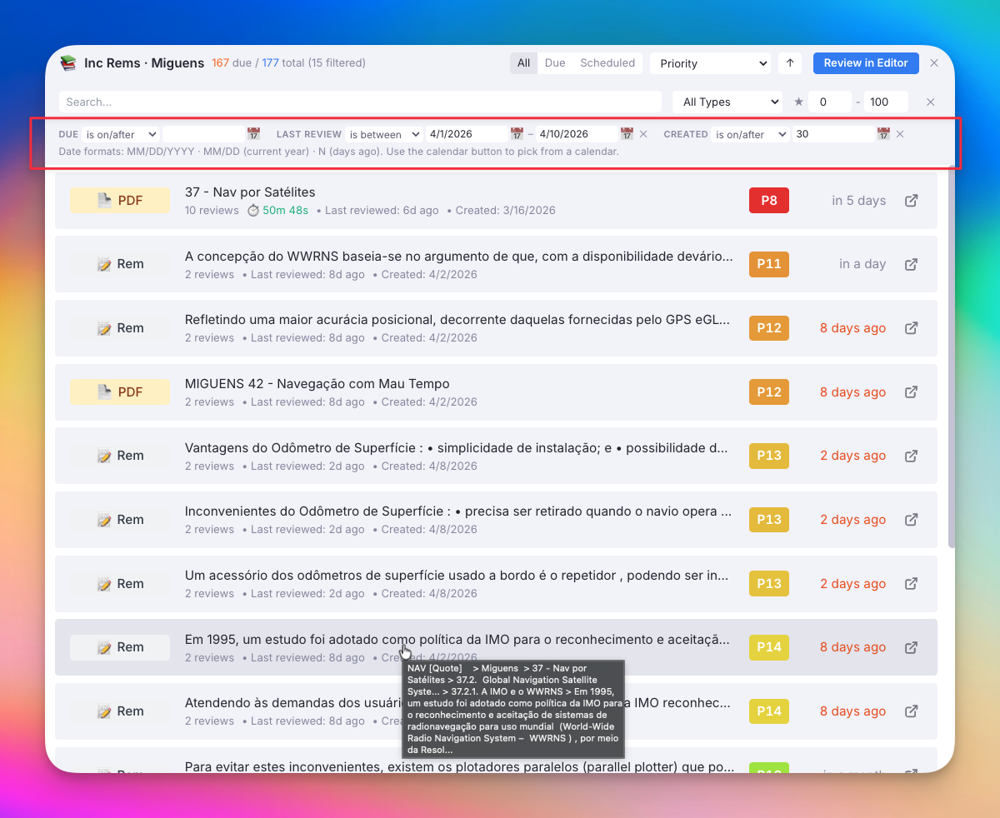{ width="800" }

#### Incremental History Widget: Unified Timeline

The **Incremental History** sidebar widget now shows a **unified chronological timeline** of both review sessions and creation events:

- When a new Incremental Rem is created, a **"Created"** event is logged automatically and appears in the history.
- Each entry now carries a pill badge:
  - 🟢 **Created** — the Rem was first made Incremental on this date
  - 🟣 **Reviewed** — a review session on this date
- All events are sorted together by time (most recent first), giving a single coherent log of all your Incremental activity.

{ width="400" }


### ⌨️ Improved Keyboard Navigation: Priority & Interval Widget

We've significantly enhanced the keyboard accessibility and focus logic for the **Priority & Interval** popup (triggered during IncRem creation).

*   **Expanded Tab Cycling:** The `Tab` key now cycles through **all** interactive elements in a logical loop: Priority Slider → Interval Input → **Save** → **Next 7 Days** → **Next 30 Days** → (wraps back to Priority).
*   **Shift+Tab Support:** Full support for reverse cycling using `Shift+Tab`.
*   **Enhanced Focus Visibility:** When navigating via keyboard, each action button now displays a prominent **colored glow ring** (matching its own background color) to make the active target unmistakable.
*   **Context-Aware Enter Key:** Fixed a bug where pressing `Enter` always triggered a standard "Save". Now, if the **Next 7 Days** or **Next 30 Days** buttons are focused, `Enter` will correctly execute that specific preset action.

---

## v0.2.167 - April 9th, 2026

### ⚖️ New Feature: Weighted Priority Shield

A brand-new **Weighted Shield** metric has been introduced to give you a macro-level diagnostic of your entire learning workload. While the standard Priority Shield identifies the *single* most important item you've missed, the Weighted Shield measures the fraction of your *total priority-weighted queue* that has been processed.

*   **Exponential Weighting:** Items are weighted exponentially by priority (top-priority items carry ~10× the weight of bottom-priority items). Processing high-priority items gives a much larger boost to your shield percentage.
*   **Breakdown Popup:** Clicking on the Weighted Shield metric in the queue toolbar opens a detailed breakdown popup that divides your knowledge base into ten percentile buckets (e.g., 0-10%, 10-20%), showing exactly how much volume within each bucket is due versus processed.
*   **Global Graph Toggle:** The [Prioritization-&-Sorting#priority-shield-history](Prioritization-&-Sorting.md#priority-shield-history) widget now features a global checkbox at the top to toggle the Weighted Shield line across all charts simultaneously.
*   **Settings Integration:** The display of the Weighted Shield in the queue can be toggled on/off in the plugin settings.

📖 **Learn more:** See the [Prioritization-&-Sorting#weighted-shield](Prioritization-&-Sorting.md#weighted-shield) documentation and the updated [Plugin-Settings-Reference#queue-display](Plugin-Settings-Reference.md#queue) for more details.

{ width="1000" }

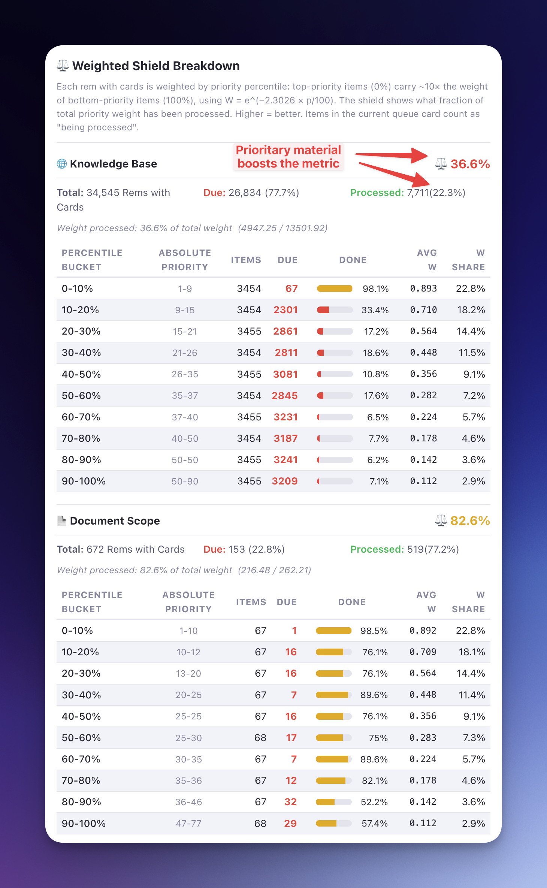{ width="600" }

### 🐛 Bug Fix: Queue Layout CSS No Longer Hides Flashcard Widgets

*   **Scoped `display: none` rules:** The CSS injected globally to fix the Incremental Rem queue layout was inadvertently hiding the **Flashcard Insights**, **Bottom-of-card AI Suggestions**, and **Flashcard Repetition History** plugin widgets during regular flashcard review. The `display: none` selectors now require `[data-queue-rem-tags~="incremental"]` to be present on the queue element, so they only activate when an Incremental Rem is actually being reviewed — leaving all three widgets fully visible for standard flashcards.

## v0.2.166 - April 7th, 2026

### 🐛 Bug Fix: Parent Selector Scroll Behavior

*   **Reliable Auto-Scroll:** The **Parent Selector** widget now reliably and perfectly centers the last selected parent node upon opening, even when dealing with extremely long trees. This eliminates the need to manually scroll down to locate your previous context.

📖 **Learn more:** See the [Plugin-Widgets-Reference#parent-selector](Plugin-Widgets-Reference.md#62-parent-selector) section in the Widgets Reference and the [Create-Incremental-Rem-from-PDF-Highlights](Create-Incremental-Rem-from-PDF-Highlights.md) guide for context on how this widget manages your reading hierarchy.

---

## v0.2.165 - April 6th, 2026

### 🎨 UI Polish: Inline PDF Current Page in Priority Editor

*   **PDF Current Page Display:** The Priority Editor widget now elegantly displays the currently recorded reading position (e.g. `(67)`) alongside the PDF page range (e.g. `p.63–75 (67)`) in both its collapsed and expanded views.

---

## v0.2.164 - April 6th, 2026

### ✨ New Widget: Queue Toolbar Priority

A new priority display widget has been installed directly into the native RemNote **Queue Toolbar**. 

Unlike the existing `Card Priority Display` (which lives at the bottom of the flashcard area and frequently gets pushed out of view when reviewing long documents or large Incremental Rems), this new widget is anchored to the persistent top toolbar. This guarantees that the **absolute priority** of the item you are currently reviewing is **always visible** at a glance (percentile rank - relative priority - is shown on hover and also indicated by the badge color).

- Supports both Incremental Rems and Flashcards without layout shifting.
- Reacts instantly to queue navigation and manual priority updates.
- Controlled via a new opt-in plugin setting: **Display Queue Toolbar Priority** (enabled by default).

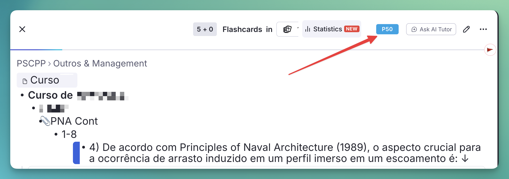{ width="600" }

---

## v0.2.162 - April 4th, 2026

### ⚡ Performance: Priority & Interval Popup Now Closes Instantly

The **Set Priority & Interval** popup (`Alt+Shift+X`) previously blocked the UI until all database writes completed — one sequential round-trip per rem for priority, SRS schedule, IncRem cache, and inheritance cascade. For a batch of N chapters this meant N×3+ awaited DB operations before the popup could close, causing visible lag.

**Root cause:** All heavy work (`setPowerupProperty`, `updateSRSDataForRem`, `updateIncrementalRemCache`, `pendingInheritanceCascade`) was running inline in the popup's iframe. React popup iframes are ephemeral and can be killed at any moment, but they were doing all the work.

**Fix — fire-and-forget job pattern (same as `priority_light.tsx`):**

The popup now does exactly **one** `await setSession(pendingIntervalBatchSaveKey, { remIds, priority, interval })` and then calls `closePopup()` immediately. A new persistent watcher in `tracker.ts` picks up the job and executes all writes safely in the index iframe, which lives for the entire session:

| Step | Before (popup iframe) | After (tracker iframe) |
|------|-----------------------|------------------------|
| Priority write | `await` × N | tracker → `await` × N |
| SRS schedule write | `await` × N | tracker → `await` × N |
| IncRem cache update | `await` × N (one patch per rem) | tracker → **1 read + 1 write** for all N rems |
| Cascade signal | fire-and-forget (unsafe) | tracker → `await` (guaranteed) |
| **Popup close** | **After all of the above** | **After 1 setSession write** |

The new `pendingIntervalBatchSaveKey` watcher in `tracker.ts` mirrors the existing `pendingPrioritySaveKey` pattern and runs under `plugin_operation_active` suppression to prevent spurious `GlobalRemChanged` events during the batch.

---

## v0.2.161 - April 4th, 2026

Several performance improvements, in our ongoing effort to eliminate lagness in RemNote caused by the plugin.

### ✨ New: Copy & Paste Rem Sources (PDF Split Workflow)

Two new commands designed to speed up the **PDF split workflow** — the technique of giving multiple Incremental Rems the same PDF source so each can cover a different page range via the **PDF Control Panel**.

| Command | Shortcut | Action |
|---------|----------|--------|
| **Copy Rem Sources** | `Ctrl+Shift+F1` | Copies all sources of the focused Rem into session storage |
| **Paste Rem Sources** | `Opt+Shift+V` / `Alt+Shift+V` | Adds the copied sources to every selected Rem (or focused Rem if nothing is selected) |

**Designed workflow:**

1. Set up your "template" chapter rem, add the PDF as its source, and tag it as Incremental.
2. Press `Ctrl+Shift+F1` → **Copy Rem Sources** — a toast confirms how many sources were copied.
3. Select all remaining chapter rems in the outliner (multi-select with `Shift+Click`).
4. Press `Alt+Shift+V` → **Paste Rem Sources** — each selected rem receives the same PDF source.
5. Open **PDF Control Panel** on any of them to assign page ranges per chapter.

**Details:**
- **Idempotent paste:** sources already present on a target rem are silently skipped. Running paste twice is safe.
- **Multi-source support:** all sources from the template rem are copied together, including rems tagged with `#preferthispdf`.
- **Session-scoped clipboard:** the copied source IDs live in session storage and are cleared when you close the tab — no cross-session contamination.

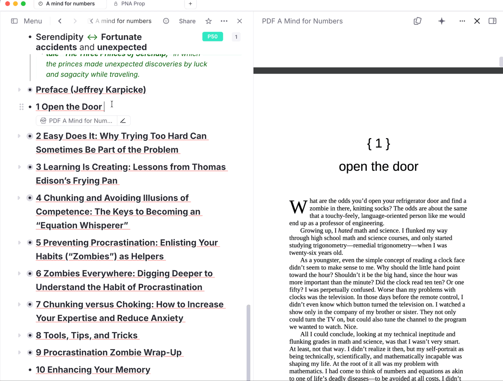{ width="900" }

📖 See [PDF-Incremental-Reading-Workflow#copying-and-pasting-sources](PDF-Incremental-Reading-Workflow.md) for the full step-by-step guide.


### ✨ New: Hierarchical Tree View in PDF Control Panel

The **All Rems Using This PDF** section of the PDF Control Panel now displays a **containment tree** instead of a flat sorted list.

**How it works:**
- Rems are sorted by page range start. If a rem's range is **fully contained** within another rem's range (e.g., a sub-section inside a chapter), it is shown **indented** below the parent, conveying the logical hierarchy.
- Depth-based indentation (16 px per level) makes nesting immediately visible.
- Rems without a page range float below the tree at depth 0.

**Overlap detection:** If two sibling rems (same parent, same depth) have page ranges that genuinely overlap, an inline **⚠ overlap** badge appears on both. Adjacent chapters that share exactly one boundary page (e.g., one ending on page 265, the next starting on page 265) are **not** flagged — this is the normal chapter-split pattern.

**Coverage badge on parent rows:** When a rem has children in the tree (sub-rems with finite page ranges), its row shows an inline **X/Ypp** coverage badge with a small fill bar:
- Blue fill = pages covered by direct children
- Gray track = uncovered pages still available
- Tooltip shows the exact count and percentage: e.g. `"25 of 30 pages covered by sub-rems (83%)"`

This makes it easy to see at a glance how much of a chapter has been split into sub-sections and how much still needs to be processed.

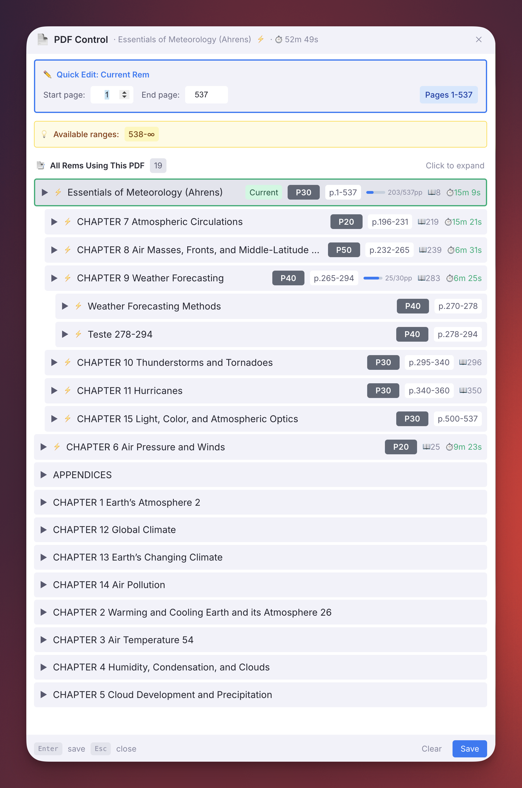{ width="650" }

### ✨ New: Inline PDF Range Management in the Priority Editor

The **Priority Editor** sidebar widget (visible to the right of every Incremental Rem in the editor) now includes a **📄 PDF Range** section for rems that have a PDF source.

**Collapsed view:**
- If the rem has a range set, a small `📄 p.X–Y` pill is shown below the priority badges.
- If the rem is mapped to a PDF but has no range yet, a dim `📄 —` indicator marks it as "needs assignment".

**Expanded view (click to open the panel):**
- A dedicated **📄 PDF Range** card shows the PDF name, current range badge, and quick action buttons.
- **📄 Range** — opens an inline Start / End page editor:
  - `Tab` cycles between Start and End fields; `Enter` saves.
  - Both inputs auto-select their value on focus so typing immediately replaces the existing number.
- **📖 Position** — records the current reading position:
  - Defaults to the last recorded page, or the first page of the range if no history exists.
  - Validates the input against the rem's assigned range; the border turns red and the Save button is disabled when the value is out of bounds.
  - `Enter` saves when valid.
- **Reading stats row** — shows total reading time (⏱️) and the last recorded page below the buttons.
- **PDF Control Panel ↗** — a button that opens the full PDF Control Panel popup for deeper management (e.g., editing all chapters, viewing full history, etc.).

This lets you set and adjust a rem's page range, record where you left off, and view reading stats — all without opening a popup or leaving the document where the PDF is visible on the right side.

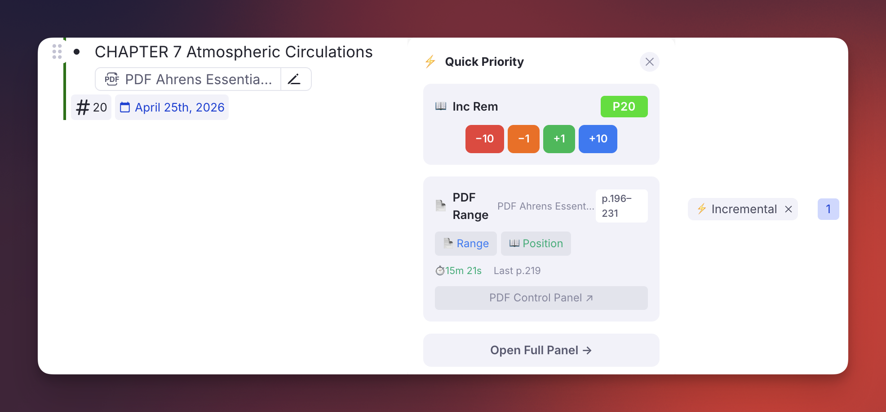{ width="800" }

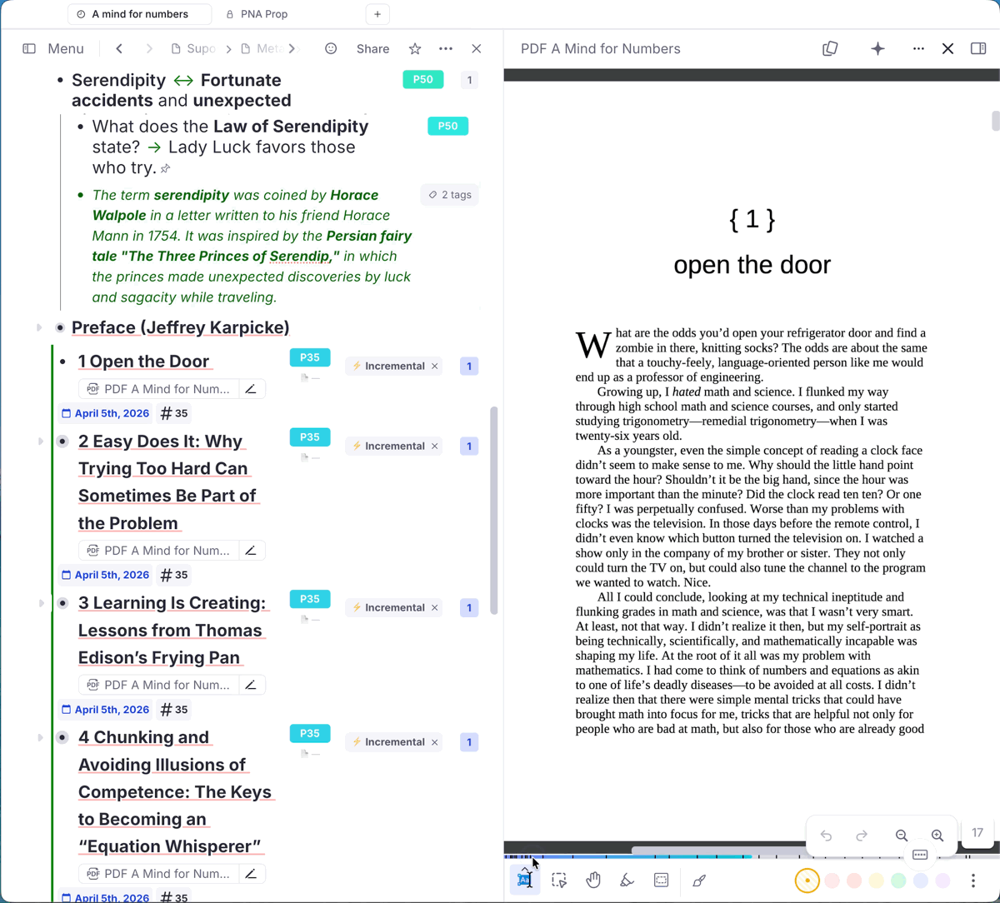{ width="900" }

### 🐛 Fix: PDF Control Panel Now Respects `#preferthispdf`

When a rem had **multiple PDF sources**, the **PDF Control Panel** command always opened with the *first* PDF it encountered — ignoring the `#preferthispdf` tag that the queue and reader already honoured. This meant the control panel and the queue could be working with different PDFs on the same rem.

**Fix:** A new shared helper `findPreferredPDFInRem()` was extracted into `pdfUtils.ts` and centralises the preference logic:
- **Single source** → open it directly (no tag scan, fastest path).
- **Multiple sources, one tagged `#preferthispdf`** → open that one.
- **Multiple sources, multiple tagged** → show a conflict warning toast; do not open.
- **Multiple sources, none tagged** → fall back to the first PDF (legacy behaviour).

The PDF Control Panel command now calls this helper, so it is consistent with what the queue opens when you review the same rem.

### ⚡ Performance: Eliminated Spurious `GlobalRemChanged` Drift Updates

Fixed two compounding bugs that caused the `GlobalRemChanged` listener to fire thousands of false "Detected true property drift" log lines — and their associated `updateCardPriorityCache` calls — every time the user opened or searched a rem.

**Bug 1 — `!cachedEntry` false-positive for non-card rems (main culprit):**
The drift comparison at the end of the debounced handler unconditionally evaluated `!cachedEntry` as `true` for any rem not already tracked in the card priority cache (opened documents, search results, etc.). Since those rems have no flashcards, `targetPriority` and `targetSource` were both `null` — but the missing cache entry still triggered the log and a full `updateCardPriorityCache` call.

**Fix:** Added an early-exit guard before the cache comparison: if `targetPriority === null && targetSource === null` (rem has no cards), the handler returns immediately. Only rems with actual flashcards proceed to the drift check.

**Bug 2 — Single debounce timer shared across all remIds:**
`let remChangeDebounceTimer` was a single `NodeJS.Timeout`. Every incoming `GlobalRemChanged` event (for *any* remId) cancelled the timer set by the previous one. During a search that fires dozens of different remIds rapidly, the timer kept resetting — causing non-deterministic behavior across concurrent events for different rems.

**Fix:** Replaced the single timer with a `Map<string, NodeJS.Timeout>` (`remChangeDebounceTimers`). Each remId now debounces independently, so a burst of 50 different rems does not stomp each other's timers.

### 🐛 Bug Fix: `GlobalRemChanged` Suppression Gap During Cascade Handoff

Fixed a class of suppression gaps where `GlobalRemChanged` would slip through **between** when a caller cleared `plugin_operation_active` and when the cascade tracker re-armed it.

**Root cause:** Callers like `priority_interval.tsx`, `reschedule.tsx`, and `initIncrementalRem` were unconditionally clearing `plugin_operation_active = false` in their `finally` block, even when they had just written `pendingInheritanceCascade`. The cascade tracker runs in a separate persistent iframe and takes a non-zero amount of time to detect the session storage change and re-arm the flag. During this gap the `GlobalRemChanged` listener was fully unguarded, processing every propagating property change from the cascade itself.

**Fix — `triggeredCascade` pattern (`priority_interval.tsx`, `reschedule.tsx`):** Both widgets now track whether a cascade was fired via a local `triggeredCascade` boolean. If `true`, the `finally` block skips clearing `plugin_operation_active` — leaving the flag up for the cascade tracker to clear when it finishes.

**Fix — Second flag check inside the debounce callback (`events.ts`):** The debounced callback (1 second after the initial event) now re-checks `plugin_operation_active` before executing its logic. This catches events that were enqueued before the flag was set but fire inside an active batch window.

**Fix — Single outer flag bracket for multi-rem batch (`commands.ts` / `Alt+X`):** When `Alt+X` initializes multiple selected rems, the flag is now set once **before** the loop and each `initIncrementalRem` call runs with `skipFlagManagement: true`. The flag is intentionally left up after the loop — `initIncrementalRem` fires `pendingInheritanceCascade` for each rem, and the cascade tracker clears the flag after the last cascade completes.

**Affected callers:**

| File | Change |
|------|--------|
| `src/widgets/priority_interval.tsx` | `triggeredCascade` pattern — flag stays up when cascade is pending |
| `src/widgets/reschedule.tsx` | `triggeredCascade` pattern — flag stays up when cascade is pending |
| `src/register/events.ts` | Second `plugin_operation_active` check inside debounce callback |
| `src/register/commands.ts` | Single outer flag bracket for multi-rem `Alt+X` batch |

### ⚡ Performance: Fixed Spurious IncRem Cache Reloads on Search / Rem Open

Fixed a major performance regression where opening or searching any rem triggered a full IncRem cache reload (~2s, scanning all 1,600+ IncRems).

**Root cause:** The `plugin.track()` callback that drives the IncRem cache loader was being called as `loadIncrementalRemCache(rp)` — passing the **reactive proxy** `rp` into the loader. Inside, the loader called `rp.powerup.getPowerupByCode(code)` and `powerup.taggedRem()` through that proxy, which registered the **entire powerup membership list** as a reactive dependency. RemNote re-evaluates this dependency any time it reads powerup state internally (e.g., when navigating to or searching a rem), causing the tracker — and a 2s full reload — to re-run on every such interaction.

**Fix:** Three coordinated changes:

1. **`consts.ts`** — Added `incRemCacheReloadKey`, a dedicated session key that acts as the sole controlled reactive signal for the IncRem cache tracker.
2. **`tracker.ts`** — The tracker now does a single lightweight reactive read of `rp.storage.getSession(incRemCacheReloadKey)`, then calls `loadIncrementalRemCache(plugin)` with the **non-reactive** `plugin` reference. This eliminates the broad `taggedRem()` subscription entirely.
3. **`incremental_rem/index.ts`** — `initIncrementalRem` bumps `incRemCacheReloadKey` with `Date.now()` after adding the incremental powerup, so the tracker still reloads when a new IncRem is genuinely created.

**Behavior after fix:**
- Searching or opening any rem → `incRemCacheReloadKey` unchanged → **no reload**
- New IncRem created → key bumped → tracker re-runs → **cache reloads correctly**
- Plugin startup → tracker runs once (key read for the first time) → **initial load**


---

## v0.2.160 - April 4th, 2026

### ✨ Extract with Priority: Multi-Rem Batch Mode

**Extract with Priority** (`Alt+Shift+X`) now supports **multi-rem selection**. When you select multiple Rems in the editor and press `Alt+Shift+X`, the plugin will:

1.  Initialize all selected Rems as Incremental (with inherited or default priorities), just like `Alt+X` does in bulk.
2.  Open the **Priority & Interval Popup** showing a blue batch indicator ("📋 N rems selected — priority & interval will apply to all").
3.  When you save, the chosen priority and interval are applied to **all** selected Rems at once.

Previously, `Alt+Shift+X` on a multi-rem selection would silently initialize all Rems with default values but never open the popup, making it functionally identical to `Alt+X`. Now the two commands are properly differentiated:

| Command | Single Rem | Multi-Rem Selection |
|---------|-----------|---------------------|
| `Alt+X` | Initialize with defaults | Initialize all with defaults |
| `Alt+Shift+X` | Initialize + open popup | Initialize all + open popup → apply to all |

{ width="800" }

---

## v0.2.159 - April 3rd, 2026

### 🗑️ Maintenance: Automatic Orphan Card Cleanup

The **"Update all inherited Card Priorities"** command now detects and offers to remove **orphan cards** — flashcards whose parent Rem has been deleted from your knowledge base — directly from within the same workflow.

**How it works:**

After the priority update finishes, if any "Rem not found" errors were logged, the plugin will:

1.  **Scan** all cards in your knowledge base whose `remId` matches one of the missing Rems.
2.  **Double-check** each candidate with a live `rem.findOne()` call to rule out transient errors. Any card whose Rem now resolves (e.g., it was a momentary loading issue) is skipped with a warning log.
3.  **Ask for confirmation** using a paged native dialog. The list is shown in pages of **25 Rems at a time**, so the confirm dialog always fits on screen. A summary overview is shown first, followed by detail pages (if needed), each of which you can accept or cancel independently.
4.  **Remove** the confirmed orphan cards in parallel batches of 25, with progress toasts throughout.

**Why this matters:**

Orphan cards accumulate silently over time when Rems are reorganized or deleted. They consume space in your card database, show up as "Rem not found" noise in every priority update run, and can't be reviewed (since their parent Rem is gone). This feature gives you a direct, safe, one-click path to clean them up immediately after running the maintenance command.


### 🐛 Bug Fix: Highlighted Rems with PDF Sources Missing from the Hierarchical Parent Selector

Fixed a bug where **Rems that had a generic highlight applied** (colored Rems) were being incorrectly skipped during PDF-related searches, causing them to disappear from the **Hierarchical Parent Selector** (`parent_selector.tsx`) — the widget used by the Create Incremental Rem pdf highlight menu item to find and assign parent to IncRems being created — as well as from related searches in `pdfUtils.ts` and the Aggregated History tree.

**Root cause:** Each search function contained a skip guard intended to exclude **PDF highlight Rems** — these are the raw inline extracts created by the RemNote PDF reader and, while they can themselves be tagged as Incrementals, they are not valid *parent holders* for other IncRems (a PDF highlight is a leaf extraction, not a container). The guard was written as:

```ts
const isPdfHighlight = await rem.hasPowerup(BuiltInPowerupCodes.Highlight);
if (isPdfHighlight) continue;
```

However, `BuiltInPowerupCodes.Highlight` is the code for the **generic editor highlight** powerup — the one applied when a user colors a Rem in the outliner. The correct code for PDF reader highlights is `BuiltInPowerupCodes.PDFHighlight`. Because of this mismatch, any Rem carrying the generic `Highlight` powerup (i.e. a user-colored Rem) was silently discarded as if it were a PDF extract, even when it had a valid PDF source and should have been a selectable parent.

**Affected functions:**

| Function | File | Symptom |
|---|---|---|
| `performFullPDFSearch` (×2) | `treeHelpers.ts` | Highlighted Rems missing from the Hierarchical Parent Selector |
| `getAllIncrementsForPDF` | `pdfUtils.ts` | Highlighted Rems absent from the PDF's Incremental list |
| `findAllRemsForPDF` (×2) | `pdfUtils.ts` | Highlighted Rems excluded from PDF-associated Rem lookups |
| Aggregated History tree navigator | `aggregated_repetition_history.tsx` | Highlighted Rems not navigable from the history tree |

**Fix:** All six occurrences replaced with `BuiltInPowerupCodes.PDFHighlight`, so only true PDF reader extracts are excluded from parent searches, while user-highlighted Rems with PDF sources are correctly surfaced.

---

## v0.2.157 - April 2nd, 2026

### 🎨 UI Renaming: "Done" → "Dismiss"

* **Universal Terminology Update:** Across the entire plugin—including the **Queue Answer Buttons**, the **Editor Review Timer**, and the **IncRem List**—the "Done" action has been renamed to **"Dismiss"**. This change is to avoid ambiguity (one could think "this review is done" instead of "I'm done processing this item") and more accurately describes the behavior of permanently removing an item from the Incremental review loop while preserving its history in the **Dismissed** state.
* **Command Renaming:** The "Dismiss Incremental Rem (Untag)" command has been simplified to **"Dismiss Incremental Rem"**.
* **Toast Improvements:** Success messages now consistently use "Dismissed" terminology.

## v0.2.156 - April 2nd, 2026

### ⏱️ Editor Review Timer: "Done" Button & Layout Improvements

We've enhanced the **Editor Review Timer** widget with a new primary action and a more robust responsive layout.

*   **"Done" Button:** When launching a review from the IncRem List or Main View, the timer now features a **✓ Done** button (in red). This works exactly like the "Done" button in the queue: it records your final review time, transfers your history to the **Dismissed** state, and removes the Incremental status from the Rem before advancing you to the next item.
*   **Responsive Button Wrapping:** The widget's layout has been overhauled with `flex-wrap` and row-gap logic. If you're working in a narrow sidebar or a collapsed editor, the buttons will now gracefully flow into multiple lines instead of shrinking or overlapping the timer text.
*   **Hierarchical "End Review" Label:** The "End Review and Back to..." buttons have been redesigned with a two-line hierarchical layout. "End Review" is now larger and bold, while the destination sub-label ("and Back to Queue/List") is smaller and slightly transparent, reducing the button's total width and improving readability.

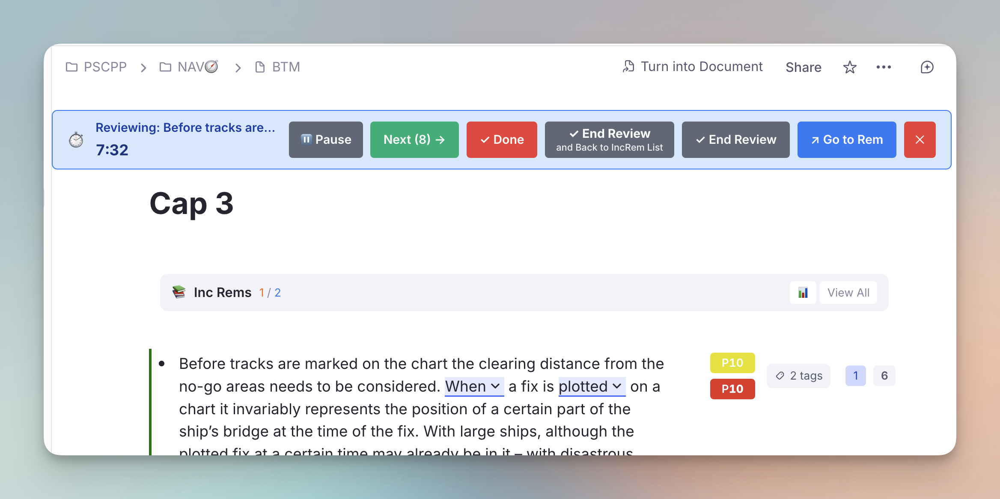{ width="800" }

### ⚠️ IncRem Table: Intelligent Due-Filter Warnings

To prevent accidentally reviewing large numbers of items that aren't actually due yet, the **IncRem List** and **All Inc Rems** views now feature context-aware safety warnings.

*   **Universal Due-Filter Guard:** Clicking "Review in Editor" (either the top-level button or a per-row starting point) will now trigger a warning if your list is not currently filtered to **Due** items only.
*   **Header-Level Warning:** If you click the main "Review in Editor" button while viewing your full backlog, a warning banner appears at the top, showing your total filtered count vs. the actual due count.
*   **Inline Row Warning:** If you launch a review from a specific row in an unfiltered list, an inline warning box appears immediately below that row, showing how many items are in the resulting sub-queue and how many of those are actually due.
*   **Smart Actions:** Both warning types let you instantly toggle the **"Filter to Due Only"** state or chose to **"Proceed As-Is"** with your current selection.

📖 **Full documentation:** See the [Reviewing-Items-in-the-Editor#2-sequential-review-via-increm-lists](Reviewing-Items-in-the-Editor.md#2-sequential-review-via-increm-lists) and [IncRem-List-and-Main-View#due-filter-warning](IncRem-List-and-Main-View.md#due-filter-warning) sections in the wiki.

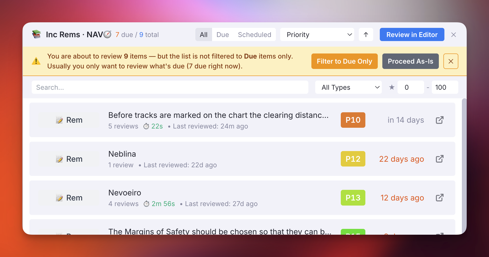{ width="700" }

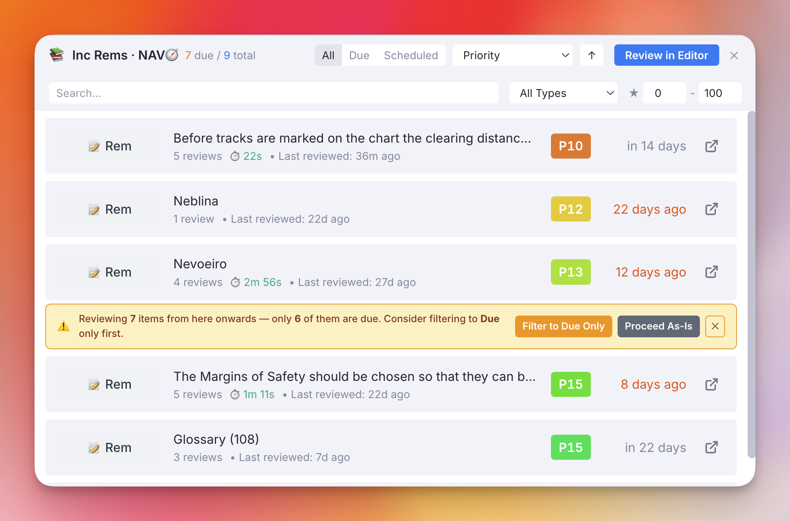{ width="700" }


---

## v0.2.155 - March 31st, 2026

### 📄 Multiple PDF Sources: `#preferthispdf` Support

You can now use multiple PDF sources on a single Incremental Rem while retaining the ability to open one of them directly in the native Reader view!
*   **The behavior:** By default, if an Incremental Rem has multiple sources, it opens in the `ExtractViewer` to allow you to review all your context. 
*   **The solution:** But if you tag **exactly one** of those PDF sources with `#preferthispdf` (or `#prefer this pdf`), the plugin will intelligently identify it as your primary PDF and open the Incremental Rem directly into the Reader view for that specific document.
*   **Safety fallback:** If you accidentally tag multiple PDF sources with it, the plugin will display a warning toast and safely fall back to the ExtractViewer.


### ⚡ Rapid Quick-Priority Adjustments

We have completely overhauled how the quick increase/decrease priority shortcuts (**`Ctrl` + `Opt` + `Up`** and **`Ctrl` + `Opt` + `Down`**) are handled to support rapid, consecutive keystrokes without dropping inputs or causing database race conditions.

* **Delta Queue System:** Previously, each keypress wrote an absolute priority value to session storage, meaning rapid presses would overwrite each other before the background tracker could read them. Now, each keypress appends a relative delta (e.g., `-10`) to a queue array, allowing the tracker to calculate the net change accurately.
* **Atomic Keystroke Processing:** Solved a Time-of-Check to Time-of-Use (TOCTOU) race condition where rapidly spamming the shortcuts would cause the tracker to overlap database reads/writes with incoming keystrokes. The tracker now uses a shared mutex lock to safely capture and clear the queue. Rapid key presses (e.g., pressing `Ctrl` + `Opt` + `Down` 3 times quickly) will perfectly and reliably compose into a single, accurate database write (e.g., a net -30 change) with no duplicated events.

### ⚡ Unified Background Event Suppression

We've extended the robust background event suppression system across all of the plugin's major mutation workflows, ensuring that your Knowledge Base remains lightning-fast even during large scale updates or high-frequency edits.

*   **Universal `plugin_operation_active` Flag:** The previous `batch_priority_active` session flag has been renamed to `plugin_operation_active` and is now the universal standard for suppressing the `GlobalRemChanged` cache-rebuilding listener during heavy plugin operations.
*   **Priority Widget Refactor (`Alt+P`):** The main **Priority Settings** popup has been fundamentally optimized. Just like the Light Priority Widget, it now features an **Instant Close (0ms)** design! All Database SDK writes (`setPowerupProperty`, `addPowerup`) have been decoupled from the popup and are seamlessly handed off to the persistent background tracker via a `pendingPrioritySaveKey` job. This guarantees the popup closes instantly while the tracker safely wraps the heavy SDK network calls in the new `plugin_operation_active` suppression guard.
*   **Creation & Widget Zero-Lag Wrapping:** Applied the universal `plugin_operation_active` suppression wrapper to multiple other intensive paths, including:
    *   **Queue "Next" Repetitions:** Every repetition cycle (clicking "Next", dragging to force Today/Tomorrow, or hitting `Cmd+Right` in the queue) now bypasses the heavy event listener rebuilding, keeping manual cache sync immediate and the queue perfectly fluid.
    *   **Quick Priority Commands:** The `Increase/Decrease Priority` keyboard shortcuts (`Ctrl+Shift+Up/Down`) have been fully decoupled. They instantly update your visual state and hand the actual Database writes to the background tracker.
    *   **Extract with Priority** (`Alt+Shift+X`): Suppresses the massive event cascade that previously fired while the background initialized the new Incremental Rem's 4 powerup properties slot-by-slot.
    *   **Priority & Interval Popup:** Suppresses DB cascades when saving initial configurations.
    *   **Editor Review Timer:** Suppresses DB cascades when ending a review session.
    *   **Reschedule Widget:** Suppresses DB cascades when manually modifying an item's schedule.

### 🌳 Automatic Inheritance Cascade

The automatic background inheritance cascade has been extended to three additional workflows:
*   Saving a priority in the **Reschedule** widget (`Ctrl+J`)
*   Saving a priority in the **Priority & Interval** widget (used during advanced IncRem creation)
*   Standard Incremental Rem creation (e.g., manually toggling a folder or using `Alt+X`)

All of these workflows now drop a silent token when closing or finishing. If you use them on a Rem with an extensive flashcard subtree, the inheritance cascade will execute fully out-of-sight without lagging your active session.

### 🐛 Bug Fix: Cascade Suppression Gap During Debounce Window

Fixed a subtle but impactful bug where the `GlobalRemChanged` cache-rebuilding listener was **not suppressed during the 5-second debounce window** that precedes the background inheritance cascade.

*   **Root cause:** The `plugin_operation_active` and `incRemBatchActive` flags were only set inside `runCascade()`, which executes *after* the debounce timer fires. For the entire 5-second accumulation window — precisely when the writes that *triggered* the cascade were still propagating — the listener was completely unguarded.
*   **Fix:** Both suppression flags are now armed **immediately** when the debounce timer is first started (not when it eventually fires), guaranteeing full suppression from the first trigger all the way through the last cascade's completion. Subsequent remIds arriving within the same debounce window correctly skip re-arming (already armed guard). A defensive cleanup path handles the edge case where the accumulated set is empty at fire time.

### 🐛 Bug Fix: `Alt+X` Ignored Existing Card Priority When Initializing IncRem Priority

Fixed an edge case in `getInitialPriority` where making a Rem incremental via `Alt+X` (or any other IncRem creation flow) would **ignore the Rem's own `cardPriority` slot** and inherit from the closest ancestor instead.

*   **Root cause:** `getInitialPriority` called `findClosestAncestorWithAnyPriority`, which starts its walk at `rem.parent` — the Rem itself was never checked. A Rem with a `manual` or `incremental` card priority already set would be silently bypassed, and a closer ancestor's priority would win.
*   **Fix:** `getInitialPriority` now checks the Rem's own `cardPriority` slot first (source `manual` or `incremental`), identical to the guard already present in `getCardPriority` and `handleCardPriorityInheritance`. This unifies the priority resolution contract across all three paths: **own cardPriority → ancestor IncRem → ancestor Card → plugin default**. The fix reuses the shared `CARD_PRIORITY_CODE`, `PRIORITY_SLOT`, and `SOURCE_SLOT` constants — no logic is duplicated.

### ✨ New: "Clear Card Priority" Button in Priority Settings

The **Priority Settings** popup (`Alt+P`) now shows a **Clear Card Priority** button when a Rem holds the `cardPriority` powerup purely as an inheritance anchor (i.e., the Rem has **no flashcards of its own**).

Previously, the only way to remove a stale inheritance anchor was to manually find and delete the `cardPriority` tag on the Rem in the editor. This button provides a direct, one-click path to do it from within the widget.

*   **Instant close:** Following the plugin's fire-and-forget philosophy, clicking the button closes the popup immediately. The actual `removePowerup` call and cache refresh are delegated to the persistent background tracker via a new `pendingCardPriorityRemoval` session-storage key — identical in structure to the existing `pendingPrioritySave` handshake.
*   **Optimistic cache eviction:** Before closing, the button evicts the Rem from the cross-iframe `allCardPriorityInfoKey` cache, so other widgets (e.g., the card priority display in the queue) see the removal immediately without waiting for the tracker to run.
*   **Safe guard:** The button is gated on `hasCardPriorityPowerup && hasCards === false` (strict equality). It will never appear if the Rem has its own flashcards — those must always retain a card priority. The strict `=== false` check also prevents a false positive during the loading phase when `hasCards` is still `undefined`.

---

## v0.2.152 - March 27th, 2026

### ⏸️ Editor Review Timer: Pause / Resume Button

The **Editor Review Timer** widget now has a **⏸ Pause / ▶ Resume** button, allowing you to temporarily freeze the timer without ending or cancelling your review session.

*   **Pause**: Clicking ⏸ Pause freezes the displayed timer. The label changes from `Reviewing: …` to `Paused: …` (in amber) and the icon switches to ⏸️ to make the paused state visually unmistakable.
*   **Resume**: Clicking ▶ Resume picks up counting exactly where it left off — the paused interval is excluded from the total. No time is lost or double-counted.
*   **Accurate review time**: The `reviewTimeSeconds` value recorded when you click End Review counts only *active* (non-paused) seconds, so your repetition history remains an accurate reflection of actual reading time.
*   **Session-persistent**: The pause state is stored in session storage, so it survives widget re-renders and navigation without drifting.

---

## v0.2.150 - March 27th, 2026

* **Priority Shield Graph Fix:** Resolved an issue where using RemNote on mobile (or Light Mode) recorded flawed shield data (missing absolute priority). The plugin now correctly pauses history recording when operating in Light Mode, and the graph automatically filters out any previously saved incomplete data points.

## v0.2.149 - March 26th, 2026

### ✨ Batch Card Priority Widget — Major UX Overhaul

The **Batch Assign Card Priority** widget (accessible via the Document Menu) has been significantly improved with a richer scope, better navigation, and smarter filtering.

**Scope Selector**

A new 3-way radio toggle controls which rems are loaded:

| Option | Behaviour |
|--------|-----------|
| **Tagged Rems** | Rems tagged with the anchor rem (original behaviour) |
| **Rem References** | Rems that contain an `[anchor](anchor.md)` reference (`remsReferencingThis`) |
| **Both** | Union of the above, deduplicated |

Switching scope re-triggers the load immediately; the stale list is cleared instantly so there is no ghost data on scope change.

**Hierarchical Tree with Ancestor Breadcrumbs**

Each rem row now shows a compact ancestry breadcrumb (up to 5 levels) in small grey text beneath the rem name — e.g. `PSCPP › SH › A – Definições`. The list is sorted by this breadcrumb path so rems from the same KB location cluster together, giving a pseudo-tree view without a costly full-tree traversal.

**Priority & Source Column**

A new **Priority** column shows the current card priority with colour-coded badges:
- 🟡 **Yellow** = manually set
- 🟢 **Green** = synced from an Incremental Rem
- ⬜ **Grey/outlined** = inherited (shown but visually subdued)
- 🔵 **Blue** = IncRem priority only (no card priority yet)

A **Source** column displays `manual`, `incremental`, `inherited`, or `—`.

**Filters**

Two independent filters (applied before rendering, not before loading):

| Filter | Description |
|--------|-------------|
| **Only rems with cards** | Checked by default — excludes rems whose entire subtree has zero flashcards, since assigning a card priority to them would be pointless |
| **Priority range** | Filter by current priority value (0–100); rems with no priority are always shown |

**Front → Back Text**

Both the anchor rem name and each scoped rem's name now show `Front → Back` when the rem has back text, so flashcard-style rems are immediately identifiable.

**Sample Use Cases:**

* Migrating from a previous tag prioritization system (e.g. p1, p2, p3 tags) 

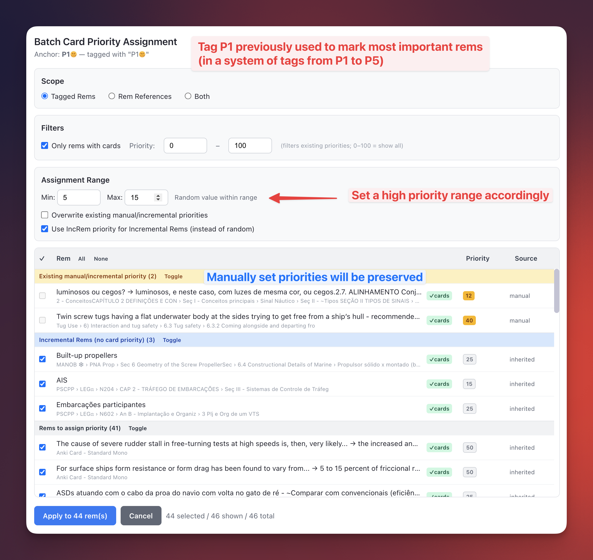{ width="900" }

* Decreasing the priority using an Universal Descriptor considered of lower importance (e.g. `~Translation`)

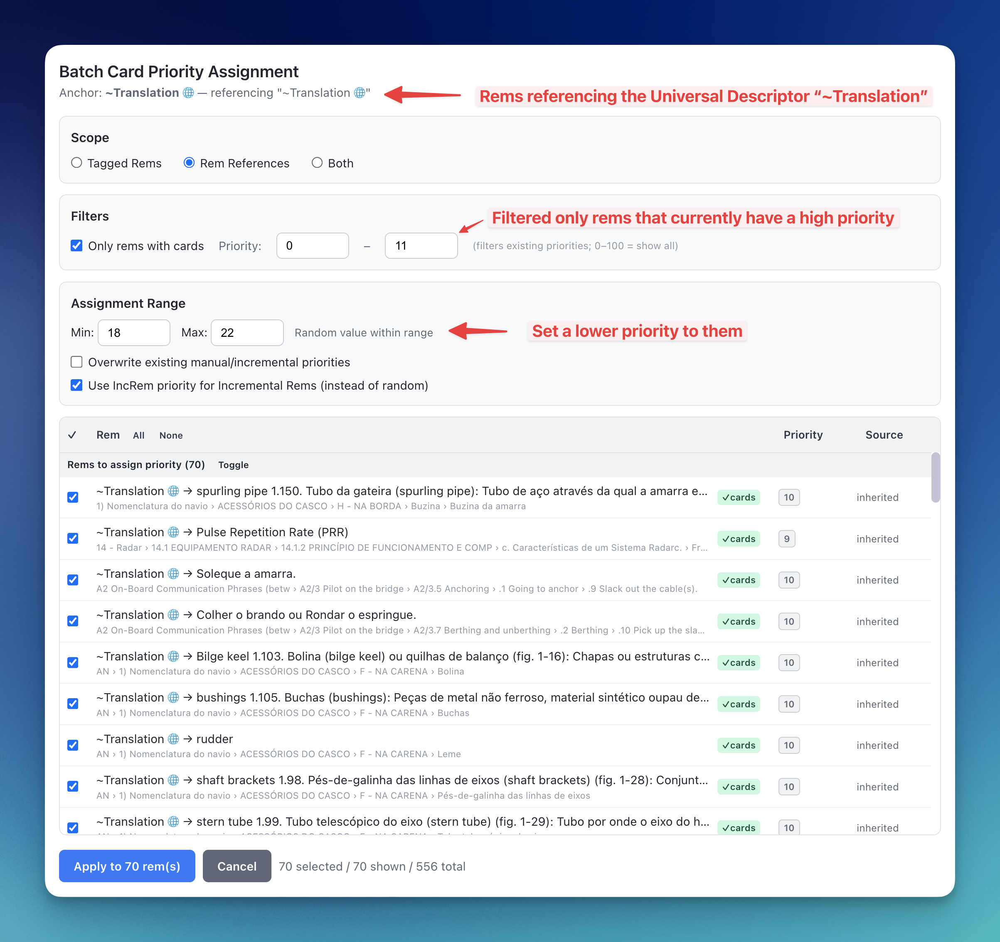{ width="900" }


📖 See [Priorities-for-Flashcards#2-batch-assignment-for-tag-or-reference-migration](Priorities-for-Flashcards.md#2-batch-assignment-for-tag-or-reference-migration) in the wiki for step-by-step instructions and full feature details.

---

## v0.2.148 - March 26th, 2026


### ⚡ Light Priority Widget — Performance Overhaul

The **Quick Set Priority** popup (`Ctrl+Alt+P`) has received a major performance refactor. The key changes:

*   **Instant popup close (no more close lag):** `handleSave` no longer `await`s any database writes before calling `closePopup()`. Instead, it writes a lightweight job descriptor (`pendingPrioritySave`) to session storage and closes immediately (~1–2 ms). The actual DB writes (`setPowerupProperty`, `setCardPriority`, `addPowerup` for first-time assignments) are picked up and executed by `tracker.ts` in the persistent index widget, which survives popup teardown.
*   **No more GlobalRemChanged storm after save:** `tracker.ts` sets `batch_priority_active = true` before executing the writes, suppressing the `GlobalRemChanged` handler for every property write. This prevents the storm of redundant event processing that previously followed each save.
*   **Eliminated spurious IncRem cache reloads:** The IncRem cache loader watcher previously read `batch_priority_active` from session storage, making it a reactive dependency. Clearing the flag after every write re-triggered a full reload of all 1,600+ IncRems — even for card-only priority saves that touch no IncRem data. The check is now a module-level boolean (`incRemBatchActive`), invisible to the `plugin.track()` reactive system, so clearing it never re-triggers the loader.
*   **5-second cascade debounce:** The background inheritance cascade now has a 5-second debounce. All `pendingInheritanceCascade` writes within a 5-second quiet window accumulate in a `Set` (deduplication is free). After 5 seconds of no new saves, cascades run for every collected Rem — serially, with `batch_priority_active` held throughout. This prevents rapid consecutive priority changes from each launching a separate 7-second cascade.

> [!NOTE]
> The cascade debounce applies to **all** cascade-triggering entry points (Priority widget, Light Priority widget, Quick Increase/Decrease Priority). If you need inheritance to propagate immediately, run **"Update all inherited Card Priorities"** manually.

---

## v0.2.147 - March 26th, 2026

### ⚡ Auto-Cascade Card Priority Inheritance on Priority Widget Save

Previously, when you changed the priority of an ancestor Rem using the Priority widget (`Alt+P`), descendant Rems with inherited card priorities were **not automatically updated** — they would remain stale until you manually ran the "Update all inherited Card Priorities" command.

**What changed:**

*   **Automatic background cascade:** Every time you save a priority using the **Priority widget** (`Alt+P`), the **Light Priority widget** (`Ctrl+Alt+P`), or the **Quick Increase/Decrease Priority** commands (`Ctrl+Shift+Up/Down`), the plugin now fires a **background inheritance cascade** for the entire subtree rooted at that Rem. Descendants with `inherited` card priority (and those whose `source: 'inherited'` traces back to an IncRem ancestor) are recalculated and updated automatically.
*   **Fire-and-forget — no popup delay:** The cascade is triggered by a single session-storage write. The popup closes immediately as before; the actual propagation runs in the background through the persistent index widget (`tracker.ts`), protected by the same serialization guard already used by the Batch Priority widget.
*   **Applies to both IncRem and Card priority saves:** Changing an Incremental Rem's priority cascades to any descendant cards that inherit from that IncRem (i.e., `source: 'inherited'` via an IncRem ancestor). Changing a Card priority anchor cascades to all descendant cards under it.
*   **Light Mode is unaffected:** The cascade is skipped when Light Mode is active, consistent with all other heavy background operations.

> [!NOTE]
> The **"Update all inherited Card Priorities"** command remains available and is still recommended after large bulk operations (e.g., reorganizing your hierarchy or running the Batch Priority widget), as well as regularly to cover the cases where the auto-cascade may not have been triggered.

 

### 🎨 Dark Mode Fix: Review Document Creator Widget

Fixed illegible text in the **Create Priority Review Document** popup when using RemNote in dark mode. Section cards, labels, and the content mix value box were using hardcoded light-mode colors (`#f9fafb`, `white`, `#1f2937`), causing white-on-white text in dark mode. All styles now use `rn-clr-background-secondary`, `rn-clr-content-primary/secondary`, and CSS variables (`var(--rn-clr-border)`) consistent with the rest of the plugin's widgets.

---

## v0.2.146 - March 25th, 2026


### ✨ New Widget: Priority & Interval Popup

When you create a new Incremental Rem — via **Extract with Priority** (`Opt+Shift+X`), the **Create Incremental Rem** PDF/web highlight button, or **Toggle Incremental Rem** — a new combined popup now opens that lets you set both the **priority** and the **first review interval** in a single step, without needing to open two separate dialogs.

**What's new:**

*   **Rem Name Header**: The name of the newly created rem is shown at the top of the popup for easy confirmation.
*   **Priority Section (auto-focused):** A full priority slider (identical to the Light Priority widget) is immediately focused on open. Adjust using ↑/↓ arrow keys with acceleration, or drag the slider.
*   **Interval Section:** A days input field (same orange style as the Reschedule widget) sets when the item will first appear in your queue. Shows a computed "Next review: [date]" preview as you type.
*   **Tab Cycling:** Tab moves focus from Priority → Interval → Priority (wraps around).
*   **Preset Buttons:** Two quick-action buttons skip manual input entirely:
    *   **Next 7 Days** — saves your priority and schedules the first review in 7 days.
    *   **Next 30 Days** — same, but for a 30-day interval.
*   **Interval Default:** Defaults to your configured **Initial Interval** plugin setting.
*   **Enter to Save / Esc to Cancel**: Standard keyboard shortcuts apply across all fields.

> [!NOTE]
> The **Quick Set Priority** (`Ctrl+Opt+P`) command and the full **Set Priority** (`Opt+P`) command are unchanged and still open their existing widgets. The new popup is only triggered during **new rem creation** flows.

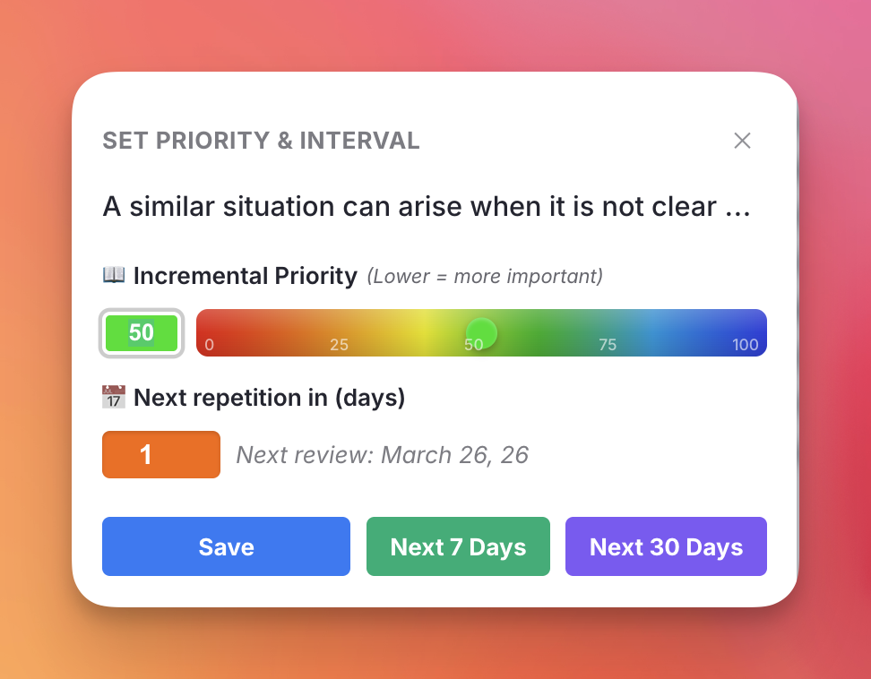{ width="400" }

---

## v0.2.144 - March 24th, 2026


### ⚡ Batch Operations Performance Optimization

*   **Suppressed Redundant Listener Firing:** All bulk-write operations — **Batch Priority Change**, **Update All Inherited Card Priorities**, **Remove All CardPriority Tags**, and **Batch Assign Card Priority** — now set a `batch_priority_active` flag that suppresses the `GlobalRemChanged` listener. Previously, every single `setPowerupProperty` call during these operations would trigger full listener processing (cache reads, powerup checks, history capture, card auto-assignment), causing massive redundant work and lag.
*   **Background Inheritance Cascade:** The Batch Priority Change widget now delegates the expensive `recalculateTreeInheritance` operation to a persistent background tracker instead of blocking the UI. The widget closes in ~5 seconds (down from ~2 minutes for large documents), and the cascade runs silently in the background.
*   **Optimized Cache Sync:** The post-apply IncRem cache sync now patches priority values in-memory instead of re-querying each rem from the database, eliminating dozens of redundant SDK calls.
*   **Dead Code Removal:** Removed unused `updateInheritedPriorities` and `batchUpdateInheritedPriorities` functions, superseded by `recalculateTreeInheritance`.

---

## v0.2.143 - March 23th, 2026

### 🎯 Batch Priority Change: Unified IncRem and Flashcard Support

*   **Unified Prioritization:** The Batch Priority Change widget has been completely overhauled to support **Flashcard Priorities** (Card Priorities) directly alongside Incremental Rems! You can now manage all your learning priorities from a single, unified interface.
*   **Dual-Type Visibility:** The table now intelligently displays both Incremental Rem percentiles and Card Priority percentiles side-by-side for each item. If a node possesses both types of priorities simultaneously, the widget clearly distinguishes them.
*   **Card Status Tracking:** The "Type" column has been upgraded to track specific flashcard states, showing whether an item actually "Has Cards" or is simply carrying a priority tag for "Inheritance only".
*   **Advanced Type Filtering:** The dropdown type filter now supports **multi-selection** (hold Cmd/Ctrl while clicking) and dynamically populates to only show the exact property types mapped to your current document hierarchy. You can instantly filter to see only Extract rems along with rems that have active flashcards.

{ width="900" }

## v0.2.142 - March 23rd, 2026

### 🧠 Smart Category Matching for Priority Inheritance

*   **Improved Inheritance Matching:** When a new Incremental Rem or flashcard inherits a priority from an ancestor, proximity correctly remains the strongest factor (the child inherits from the closest prioritized parent). However, if the closest prioritized ancestor possesses *both* an Incremental Rem priority and a Card priority, the system will now intelligently inherit from the precisely matching category space. (e.g. A new Incremental Rem will inherit the ancestor's Incremental priority rather than its Card priority). For full details on how "True Priorities" are resolved, see the updated [Priority Inheritance System](Prioritization-&-Sorting.md#priority-inheritance-system) documentation.


---

## v0.2.141 - March 23rd, 2026

### 🐛 Bug Fix: Incremental Queue Iframe Height

*   **Fixed Iframe Collapse:** Resolved a visual issue where the Incremental Everything iframe would occasionally shrink or fail to expand to its full height while reviewing in the queue. This was caused by a race condition with RemNote's background pre-fetching engine incorrectly scrubbing our layout CSS mid-review. The necessary CSS is now safely registered globally, ensuring perfect height expansion during every review session.

---

## v0.2.140 - March 20th, 2026

### 🔀 Exponential Randomness Curve

We have overhauled the Randomness sliders in the **Sorting Criteria** widget to operate on a **cubic exponential curve**, modeled closely after the behavior seen in *SuperMemo*. 

**What changed:**
*   **The Problem:** Previously, the slider was linear. 50% on the slider meant exactly 50% of the maximum allowable randomness. This made fine-tuning very low amounts of randomness (the desired state for most users who want the preservation of strict priorities with a tiny bit of serendipity) difficult, as it was cramped into the far left edge.
*   **The Solution:** The slider now uses an exponential scale under the hood. 
    *   **0% to 50%** of the slider is dedicated specifically to fine-tuning **Low-to-Moderate randomness** (up to ~12.5% items swapped). 
    *   **50% to 100%** rapidly accelerates to introduce total chaos (up to 100% items swapped).
*   **Visual Feedback:** The widget now displays the **Actual % of Items Swapped** underneath the slider instead of the generic text, and features 21 visual tick markers to help you gauge your setting exactly.
*   **Backward Compatible:** Your old randomness values have been perfectly preserved in the database. When you open the settings, the slider thumb will simply appear shifted to perfectly match your target randomness on the new scale!

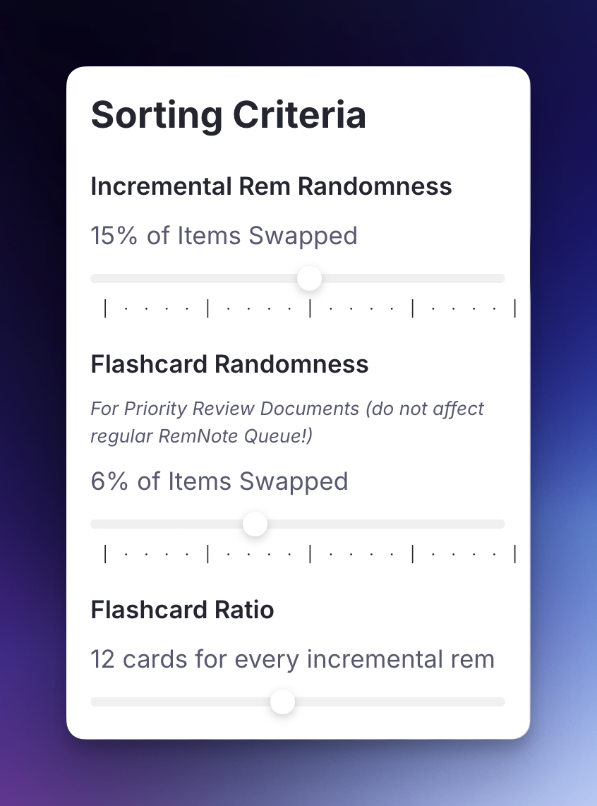{ width="350" }

---

## v0.2.138 - March 18th, 2026

### 🎯 Batch Priority Change: Filter-Aware Controls

*   **Filter-Aware Bulk Actions:** The **Check All**, **Preview Changes**, and **Apply** buttons in the Batch Priority Change widget now respect active filters (search text, type filter, or priority range).
    *   When filters are active, **Check All Filtered** / **Uncheck All Filtered** will only toggle items matching the current filter criteria, leaving out-of-scope items untouched.
    *   **Preview Filtered** calculates new priorities only for filtered items, preserving any previously calculated values for items outside the filter scope.
    *   **Apply to Filtered** applies changes exclusively to the filtered subset.
*   **Dynamic Button Labels:** Button labels automatically update to indicate filter awareness (e.g., "Check All" → "Check All Filtered"), providing clear visual feedback on the scope of the action.
*   When no filters are active, all buttons behave exactly as before.

---

## v0.2.136 - March 13th, 2026

### 🛡️ UI Polish & Gamification: Priority Shield Feedback

* **Active Shield Animation:** When the absolute priority of the card/IncRem you are currently reviewing perfectly matches the active Priority Shield of your Knowledge Base or Document, the "🛡️" indicator and text will now subtly pulse and glow in RemNote blue. This provides a rewarding visual confirmation that you are directly attacking the most important material in your queue!
* **Consistent Priority Colors:** Added the priority-associated left-border color to standard flashcards in the queue (matching the Incremental Rem infobar), making it easier to instantly recognize the priority level of the current card at a glance.

## v0.2.134 - March 11th, 2026

### 📈 UI Polish: Card Age in Review Stats

*   **Card Age, Coverage & Cost metrics:** The Card Priority Display (info bar below flashcards) and the Flashcard Repetition History popup now display the **card age** (the interval in days from the very first review until now) and the **cost** (average time spent reviewing this card per year of age or coverage) next to your total Reps and total Review Time. The Flashcard Repetition History widget also displays the **coverage** (time from the first review to the next scheduled review). This helps you quickly contextualize the review count against the physical calendar lifespan of your flashcard.

---

## v0.2.133 - March 10th, 2026

### 📈 FSRS Analytics Enhancements

*   **Time Passed Indicator**: The Card Priority Display now shows the exact time elapsed since your last review directly next to the Stability (S) metric (e.g., `S: 4.3 m (6.2 m passed)`).
*   **Next Difficulty Projections**: Hovering over the FSRS DSR statistics now displays the projected Next Difficulty for all four grading options (Again, Hard, Good, Easy), helping you understand how your rating will impact the card's future burden.

---

## v0.2.132 - March 10th, 2026

### 🎨 UI Polish: Priority Badges

*   **Bold Priority Indicators:** We've reintroduced a visual cue to help you quickly identify the source of a specific priority. When a flashcard priority is explicitly set by you (`manual` source) or synced from a completed Incremental Rem (`incremental` source), the priority number inside the badge (e.g., **P10**) will now render in **heavy bold**. Inherited and default priorities will remain in the standard font weight.

---

## v0.2.131 - March 10th, 2026

### ⌨️ Selection-Aware Commands & Queue Improvements

*   **Selection-Aware Logic:** Core commands now intelligently prioritize your active editor selection over the current queue card. If you are previewing a document from the queue and focus on a different Rem, the following commands will now act on your **focused Rem** rather than the main flashcard:
    *   **Set Priority** / **Quick Set Priority** (`Opt+P` / `Ctrl+Opt+P`)
    *   **Open Repetition History** (`Ctrl+Shift+H`)
    *   **Quick Increase/Decrease Priority** (`Ctrl+Opt+Up/Down`)
    *   **Reschedule Incremental Rem** (`Ctrl+J`)
    *   **Dismiss Incremental Rem** (`Ctrl+D`)
*   **Queue Navigation Stability:** Fixed a bug where using **Reschedule** or **Dismiss** on a different Rem in "Preview Document" mode would cause the main flashcard queue to advance unexpectedly. The queue now only advances if the command is actually targeting the current queue card.

---

## v0.2.130 - March 10th, 2026

### 📈 Card Stats & FSRS Enhancements

*   **Lapses Tracking:** The Card Priority Display info bar now explicitly shows the number of **lapses** (times you rated the card "Again") in red parentheses immediately following the total Reps count (e.g., `10 Reps (3), 4.5 min`).
*   **Informative Tooltip:** Hovering over the "Reps / min" text section now reveals a helpful tooltip explaining what each number represents.
*   **Intelligent History Reset:** The FSRS memory state calculator and review statistics (like total time and reps) now intelligently **ignore any repetition history prior to a "Reset" event**. If you manually reset a card's schedule, all FSRS metrics (Difficulty, Stability, Retrievability) and displayed review counts will correctly start fresh, matching RemNote's native resetting behavior.

---

## v0.2.129 - March 10th, 2026

- Applied fix to the webpack.config.js to bundle snippet.css and App.css into their distributions, which should prevent the 403 (Forbidden) error.

## v0.2.128 - March 7th, 2026

### 🐛 Bug Fix: Card Shield Metrics
*   Fixed a visual bug where the newly added **Dismissed Rems Tracking** metrics and **Total Universe** tooltips for Incremental Rems were incorrectly rendering over the **Flashcard** Priority Shield charts as well.

---
## v0.2.127 - March 6th, 2026

### ⚡ Aggregated Repetition History: Massive Performance & UX Boost

*   **Massive Speed Improvement:** The Aggregated history widget now loads almost instantly even for massive documents with thousands of descendants. We achieved this by:
    *   **Lazy Loading Names:** The widget now securely calculates all stats upfront but defers loading the actual text names of descendants until you expand their branches.
    *   **Parallelized Data Fetching:** Descendant data is now aggressively fetched concurrently in background chunks rather than one-by-one.
*   **Open Rem Navigation:** Added a subtle `↗` link icon to the far right of every row in the hierarchy tree. While clicking anywhere on the row safely expands/collapses the branch, clicking this icon instantly teleports you to that specific Rem in the editor and closes the widget out of your way.

📖 **Full documentation:** See the [Getting-Started#2-aggregated-history-view](Getting-Started.md#2-aggregated-history-view) section in the Getting Started guide.

---
## v0.2.126 - March 5th, 2026

### 📈 Priority Shield Graph: Dismissed Rems Tracking & Interactive Zoom

We've fundamentally improved the **Priority Shield History** widget with better categorization, interactivity, and brand-new processing metrics.

**What's new:**

*   **Dismissed Rems Tracking:** The backend now accurately calculates the volume of "Dismissed" rems that you have processed every time you exit a queue, saving this into your daily Priority Shield snapshot (for both Document-level and KB-level).
*   **Processing Visibility:** The graph for Incremental Rems has been overhauled into a stacked Area chart. You will now see:
    *   A **Green Line** representing your true Incremental Rems universe.
    *   A **Black Dashed Line** representing your *Total Universe* (IncRems + Dismissed).
    *   A **Yellow Filled Area** between these lines visually illustrating the physical volume of your Dismissed material.
*   **Detailed Tooltips:** Hovering over the IncRem graph now displays a detailed breakdown of your Universe, including a calculated **"Processing Percentage"** metric showing exactly how much of your total universe has been successfully dismissed.
*   **Drag-to-Zoom:** You can now click and drag on any graph to zoom into a specific date range. This is especially useful for high-volume users with months of history. A "Reset Data Range" button appears to return to the full view.
*   **Optimize Priorities Zoom:** A new button automatically scales the absolute and relative priority Y-Axes to perfectly frame the visible data in your current zoom window. Highly beneficial for viewing subtle metric changes over time!
*   **Logical Grouping:** Graphs are now grouped by scope: **Document** charts (IncRem & Card) are shown first, followed by a separator and then the **Knowledge Base** charts.
*   **Visual Separator:** A clean horizontal divider now separates Document-level data from KB-wide data, making the widget easier to scan.

### 🐛 Bug Fix: Priority Shield Title
*   Fixed a bug where the actual document name in the chart titles would display as `[object Object]` instead of the plain title name.

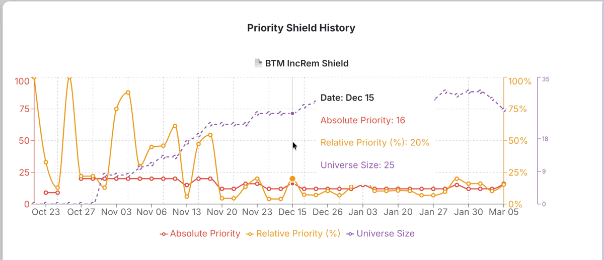{ width="800" }

📖 **Full documentation:** See the [Prioritization-&-Sorting#priority-shield-history](Prioritization-&-Sorting.md#priority-shield-history) and [Plugin-Widgets-Reference#priority-shield-graph](Plugin-Widgets-Reference.md) pages.


---
## v0.2.124 - March 5th, 2026

### 🔄 New Workflow: Sequential Review in the Editor

We've introduced a powerful new way to process your Incremental Rems outside of the standard queue, bridging the gap between queue sorting and deep-work editing.

**What's new:**

*   **"Sort for Review" mode:** The [IncRem-List-and-Main-View](IncRem-List-and-Main-View.md) now features a "Sort for Review (Queue Order)" sorting option. This accurately mirrors the exact priority distribution, date filtering, and random shuffling of the main flashcard queue, giving you a reliable "queue view" in a standard table.
*   **Editor Sequence Teleportation:** Clicking the new top-level blue **"Review in Editor"** button launches a batched review session. It opens the first item in the editor along with the Timer widget.
*   **"Next" Button in Timer:** The Editor Review Timer now features a **"Next (N) →"** button when you are in a sequential review flow. Clicking "Next" securely logs your repetition interval and reading time, and instantly teleports you to the next item in the sorted list. This allows you to fluidly churn through your reading backlog without ever leaving the full-power editor! 
*   **History Integration:** All repetitions made via the Editor Review Timer are now fully logged in the **Incremental History** widget.

{ width="800" }

📖 **Full documentation:** See the new [Reviewing Items in the Editor](Reviewing-Items-in-the-Editor.md) wiki page for a complete guide to Editor workflows.

---
## v0.2.123 - March 5th, 2026

### 🎨 Review Document Creator: Style & UX Improvements

*   **Updated styling:** The layout, typography, and button styles have been improved for a consistent look across the plugin.
*   **Progress indicator:** The widget now shows step-by-step progress feedback at the bottom ("Creating review document…" → "Opening document…" → "✅ Successfully created…"), matching the pattern used by the Batch Card Priority widget.

### ✏️ Renamed: "Review & Open" → "Review in Editor"

The **"Review & Open"** button in the Answer Buttons bar has been renamed to **"Review in Editor"** to better describe its actual behavior — rescheduling the item and opening it in the editor with the timer running. The wiki documentation has been updated accordingly.

### 🔀 Editor Review Timer: "End Review" Without Navigation

When the Editor Review Timer was started from the queue or an IncRem list, it previously only showed "End Review and Back to Queue" (or "…Back to IncRem List"). The widget now shows **both**:

1.  **End Review and Back to Queue / IncRem List** (green, primary) — same behavior as before.
2.  **End Review** (gray, secondary) — performs all the same review logic (records time, updates SRS, clears timer) but **stays in the editor** without navigating back.

This is useful when you want to continue working in the editor after finishing a timed review session.

---
## v0.2.122 - March 5th, 2026

### ✨ New Feature: Beta Scheduler — Saturating Curve

Introduced an opt-in **beta scheduler** that replaces the default exponential formula with a **saturating curve**, designed to handle items of all sizes — from entire books to single sentences.

**The problem with exponential growth:** The default scheduler (`⌈Multiplier ^ N⌉`) increases intervals so quickly that after ~8 reviews the gap already exceeds a month. This makes it nearly impossible to finish processing large items that need many reviews (books, chapters). Conversely, single sentences get intervals that start too short (2 → 3 → 4 days) when you've already extracted the key idea.

**The saturating curve solution:**

```
interval = ⌈ firstReviewInterval + (maxInterval − firstReviewInterval) × (N−1) / (N−1 + 4) ⌉
```

Intervals start at your chosen **First Review Interval** (default 5 days) and gradually approach a configurable **Max Interval** (default 30 days), slowing down the closer they get. The same global settings naturally adapt to all item types:

| Review | Default Scheduler (1.5×) | Beta Scheduler (5 / 30) |
|--------|--------------------------|-------------------------|
| 1st | 2 d | 5 d |
| 3rd | 4 d | 14 d |
| 5th | 8 d | 18 d |
| 8th | 26 d | 21 d |
| 10th | 58 d | 23 d |
| 20th | 3325 d | 26 d |

**New Settings** (after Multiplier):

| Setting | Default | Description |
|---------|---------|-------------|
| **Use Beta Scheduler (Saturating Curve)** | `false` | Toggle between exponential and saturating curve. |
| **First Review Interval (Beta)** | `5` | Days after the first review (not to be confused with *Initial Interval*, which is days before first queue appearance). |
| **Max Interval (Beta)** | `30` | Ceiling the interval approaches but never exceeds. |

📖 **Full documentation:** [IncRem Scheduler](IncRem-Scheduler.md) — covers both schedulers with formulas, progression tables, and guidance on choosing settings.

### 🗑️ Disabled: Collapse Queue Top Bar

The **Collapse Queue Top Bar** setting has been temporarily disabled as it was not functioning correctly. The setting has been removed from the UI; the feature will be re-enabled once the underlying issue is resolved.


## v0.2.120 - March 4th, 2026

### 🐛 Bug Fix: Global Listener Not Transferring History on Manual Powerup Removal

*   **Root cause:** Commit `9ac4036` changed the `GlobalRemChanged` listener to read history directly from the Rem's powerup slots instead of the session cache. However, when `removePowerup()` is called, the `GlobalRemChanged` event fires *after* the powerup and all its slots are already deleted — so `getIncrementalRemFromRem()` returned `null` and history was never captured.
*   **Fix:** Restored the session cache (`allIncrementalRemKey`) as the primary source for history capture, with a fallback to the direct Rem read for edge cases (Light Mode, before first queue entry). Manual date reset detection remains unaffected.

### ✨ Dismiss Command Enhancements

*   **Multi-select support:** The "Dismiss Incremental Rem (Untag)" command (`Ctrl+D`) now supports dismissing multiple selected Rems at once in the editor, with a contextual toast showing the count (e.g., "3 Incremental Rems dismissed.").
*   **Supersedes Untag command:** The old "Untag Incremental Everything" command was redundant — the Dismiss command now does everything it did and more (explicit history transfer, cache cleanup, multi-select). The Untag command can be safely removed in a future cleanup.

### 🗑️ Removed: "Next Repetition" Command

*   The legacy "Next Repetition" command (no shortcut, contained a leftover `debugger;` statement) has been removed. The newer "Next Item in Queue" command (`Cmd+Right`) fully supersedes it — same core action plus PDF page history saving, robust validation, and proper error messages.

### 📚 Documentation

*   **New:** [Plugin Settings Reference](Plugin-Settings-Reference.md) — comprehensive page documenting all 18 configurable settings, organized by category.
*   **New:** [Plugin Widgets Reference](Plugin-Widgets-Reference.md) — visual manual covering every widget in the plugin with descriptions, features, and screenshots.
*   **New:** [Plugin Commands Reference](Plugin-Commands-Reference.md) — complete reference with default keybindings on every command, expanded descriptions with use cases, features, and images from the changelog.
*   **Sidebar:** Now there is a **sidebar** to easily navigate the user's manual page.

---
## v0.2.119 - March 4th, 2026

### 📊 Flashcard Repetition History Enhancements

We've packed several new insights and usability improvements into the Flashcard Repetition History popup:

*   **Total Review Time:** The header now displays the total time spent reviewing the card alongside the review count.
*   **Rich Date Summaries:** A new summary section elegantly displays:
    *   **Next repetition scheduled date**
    *   **Optimum Next repetition date:** Calculates the optimal review date based on FSRS memory models (Last practice + Stability), complete with a helpful tooltip.
    *   **Date at which becomes stale:** Shows when the card becomes overdue (Last practice + 2x Interval).
    *   **Current interval:** Includes the ratio of the current interval to the predicted FSRS stability.
*   **Retrievability Gradient:** The Retrievability (R) metric now uses a dynamic color gradient. It smoothly transitions from pure red (≤ 70%) to green (100%), replacing the old static color tiers.
*   **Rem Name Display:** The parent Rem's name is now conveniently displayed at the top of the history window, right before the Card ID and Rem ID.
*   **Esc to Close:** You can now dismiss the history popup simply by pressing the `Esc` key.

### ⌨️ Esc & Shortcut Improvements

*   **Universal `Ctrl+Shift+H`:** The "Open Repetition History" command has been upgraded. If you trigger it while reviewing a *regular flashcard* in the queue, it will now seamlessly open the Flashcard Repetition History widget instead of showing an error toast.

---
## v0.2.118 - March 4th, 2026

### ✨ New Features: IncRem List Workflows

The IncRem List and All Inc Rems widgets now support powerful new workflows that bring queue-like features directly into your overview lists:

*   **Review in Editor (🔗)**: A new icon on each row lets you launch a timed review session directly from the list. This opens the Rem in the editor, starts the Editor Review Timer, and defers the actual SRS rescheduling until you click "End Review" — matching the true behavior of the [Execute Repetition Command](Reviewing-Items-in-the-Editor.md#1-execute-repetition-command). When you finish, the list automatically reopens and restores your exact same document filter and sorting state.
*   **Inline Priority Editing**: Clicking the Priority badge on any row now opens a fully-featured inline editor. You can rapidly adjust priorities using ↑/↓ arrow keys with acceleration (tap faster for bigger jumps), exactly like the priority widgets in the queue.

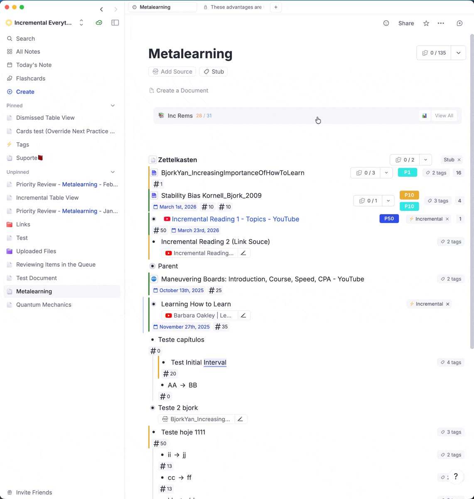{ width="800" }

### 🐛 Bug Fix: False "Manual Date Reset" Events

Fixed a race condition where programmatic SRS updates (via `updateSRSDataForRem`) were falsely detected as manual date changes, creating spurious "Manual Date Reset" entries in the Repetition History.

**Root Cause:** The `plugin_updating_srs_data` guard flag was cleared after 500ms, but the `GlobalRemChanged` handler had a 1000ms debounce — so the flag was already cleared by the time the handler checked it.

**Fix:** Increased the flag clear timeout to 3000ms, safely outlasting the debounce window.

### 📖 New Wiki Page: [IncRem-List-and-Main-View](IncRem-List-and-Main-View.md)

Added comprehensive documentation for the IncRem List and All Inc Rems widgets, covering:
*   Two entry points (scoped list vs. KB-wide main view)
*   Table features, filtering, sorting, inline priority editing
*   Review in Editor flow with state preservation
*   Document and KB Priority Distribution Graphs


---
## v0.2.116 - March 3rd, 2026

### 🐛 Bug Fix: "Done" Button Blank Screen Issue (Take 3)

Definitively fixed the blank screen after pressing "Done" on an Incremental Rem.

**Root Cause (refined):**
After `removePowerup` resolves, RemNote destroys the widget sandbox on the very next microtask tick. Any subsequent `await` (like `removeCurrentCardFromQueue`) never completes — the queue never advances, and the now-empty `QueueComponent` overlay covers the next flashcard.

**The Solution:**
Both `removePowerup` and `removeCurrentCardFromQueue` are now fired **simultaneously** using `Promise.allSettled`. This ensures both IPC messages reach RemNote in the same synchronous tick, before either can trigger sandbox destruction:

```typescript
await Promise.allSettled([
  rem.removePowerup(powerupCode),
  plugin.queue.removeCurrentCardFromQueue(true),
]);
```

Additionally, `tracker.ts`'s polling loop no longer calls `removeCurrentCardFromQueue` (it just logs and stops), eliminating the previous double-advance race condition.

The same fix was also applied to the **"Dismiss Incremental Rem" command** (`Ctrl+D`), which replicates the Done button logic when used in the queue.

### 🐛 Bug Fix: IncRem Injection Blocked When Entering Queue Early

Fixed an issue where no Incremental Rems were injected into the queue (and the `+ N` counter was missing) when entering the queue before the flashcard cache had finished loading.

**Root Cause:**
The `getNextCard` callback tried to compute the document scope on-the-fly by calling `buildDocumentScope()` when the `QueueEnter` handler hadn't finished setting it up yet. This function performs hundreds of sequential SDK calls (scanning every IncRem for PDF highlights), which **hangs** under RemNote's startup load. Since `getNextCard` has an internal timeout, RemNote would give up and show a regular flashcard instead — every single time.

Additionally, the `isInScope` filter treated a null scope as "nothing in scope" rather than "everything in scope," and the queue counter CSS was only registered when the scope cache was present (which it never was during the race window).

**The Fix:**
* **Removed on-the-fly scope building** from `getNextCard`. When the scope cache isn't ready, IncRems are now injected from the full Knowledge Base. Once `QueueEnter` finishes in the background, subsequent calls use the proper document scope.
* **Fixed scope filter logic** so that a null scope means "all IncRems are in scope" instead of "no IncRems are in scope."
* **Queue counter now always registers**, regardless of whether the scope cache has been set.

### 🐛 Bug Fix: Card Priority Display Permanently Disappearing

Fixed an issue where the Card Priority Display widget would permanently stop showing on ALL flashcards for the rest of the queue session after answering a single Incremental Rem.

**Root Cause:**
The widget hides itself whenever an Incremental Rem is active by checking the `incremental-queue-active` session flag. This flag was set to `true` when the IncRem widget mounted and back to `false` when it unmounted using React's `useEffect` cleanup. However, RemNote frequently destroys plugin widget iframes abruptly during queue transitions, which means the cleanup callback never fired and the flag got permanently stuck at `true`, blanking the widget for the entire session.

**The Fix:**
Added multiple safety nets to proactively reset the `incremental-queue-active` flag outside of the fragile React lifecycle:
* **Mid-session reset:** The `getNextCard` callback now explicitly forces the flag to `false` every time it decides to serve a regular flashcard. 
* **Session boundaries:** The flag is also forcibly cleared in the `QueueEnter` event handler, `QueueExit` event handler, and the general `resetQueueSession` function.

---
## v0.2.115 - March 3rd, 2026

### 📈 New Feature: FSRS Stability Increase (SInc) & Display Improvements

**Stability Increase (SInc)** — a new metric that shows how much your memory stability will grow after your next answer. This helps you understand the learning dynamics of each card at a glance.

**What's new in the Card Priority Display:**

*   **SInc metric:** After the Retrievability (R), the info bar now shows `SInc: 1.42×` — the stability multiplier if you press **Good**. Hover to see the SInc for all three recall grades (Hard / Good / Easy) with projected stability values.
*   **Friendly stability format:** Stability is now shown in human-readable units: days (`5.0d`), months (`3.5m`), or years (`2.0y`) instead of raw day counts.

{ width="900" }

**What's new in the Flashcard Repetition History popup:**

*   **SInc in the heading:** Shows all three SInc values color-coded: 🟠 Hard / 🟢 Good / 🔵 Easy (e.g., `SInc: ×1.12 / ×1.42 / ×2.66`). Hover for projected stability after each grade.
*   **SInc column per review:** A new column shows the actual stability increase ratio applied at each historical review step (e.g., `×1.35`), so you can see how your memory grew over time.
*   **Friendly stability in S column:** The S column now shows both raw days and the friendly format (e.g., `35.2d (1.2m)`).
*   **Wider pluginData column:** Increased width and character limit for better visibility of plugin metadata.

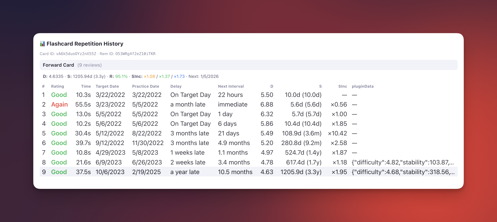{ width="900" }

📖 **Full documentation:** [Reviewing Items in the Queue#card-stats--fsrs-integration](Reviewing-Items-in-the-Queue.md#card-stats-fsrs-integration)

---
## v0.2.112 - March 3rd, 2026

### 📊 New Feature: FSRS Card Stats & Flashcard Repetition History

The **Card Priority Display** widget (shown below flashcards in the queue) now shows **review statistics** and **FSRS memory state** alongside the existing priority and shield information.

**Card Stats at a Glance:**

The info bar now displays:
*   **Reps & Time:** Total number of reviews and cumulative time spent on the card.
*   **FSRS DSR:** Difficulty (D), Stability (S), and Retrievability (R) — the three core metrics of the [FSRS algorithm](https://github.com/open-spaced-repetition/fsrs4anki/wiki/The-Algorithm) — computed in real time from the card's full repetition history.

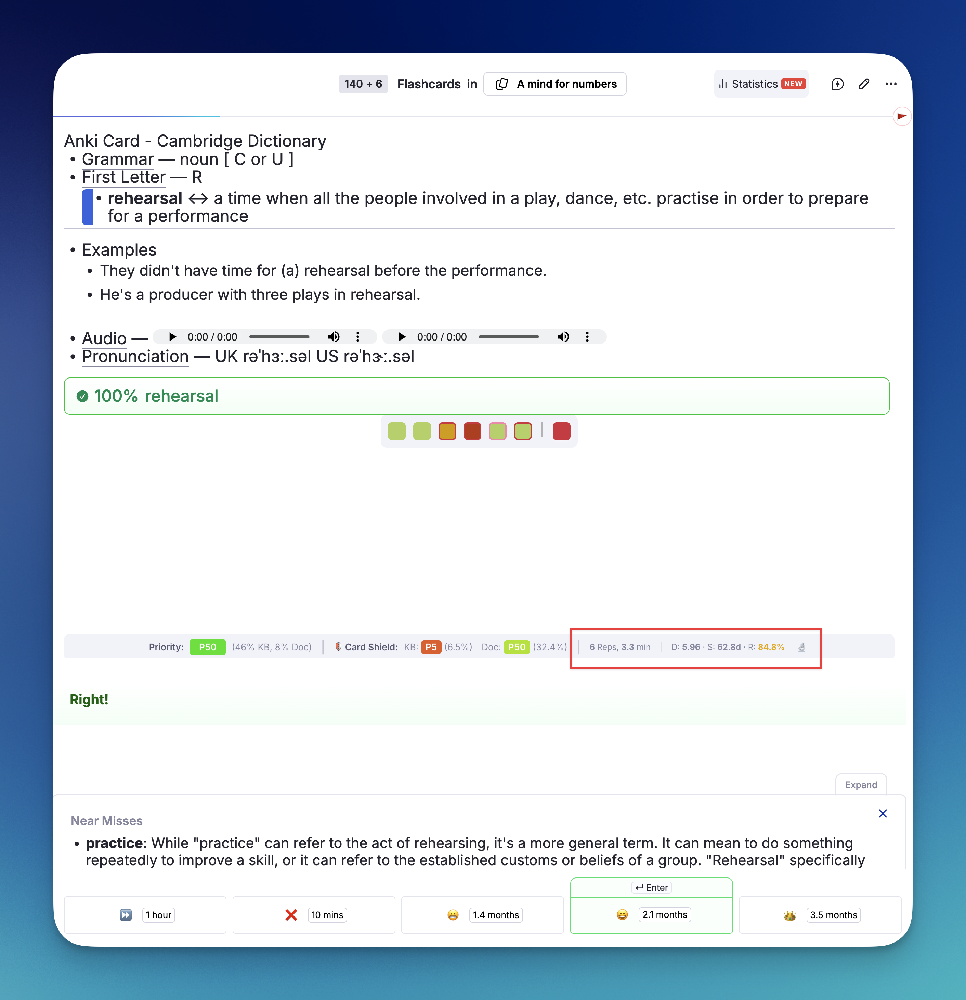{ width="900" }

**Flashcard Repetition History Popup:**

Clicking the 🔬 button opens a detailed **Repetition History** popup, modeled after RemNote's built-in Practice History. It shows every review with:
*   **Rating** (color-coded: Again, Hard, Good, Easy)
*   **Target Date** vs. **Practice Date** — when it was *scheduled* vs. when you actually reviewed
*   **Delay** — how early or late you reviewed ("On Target Day", "2 days late", "3 months late", etc.)
*   **Next Interval** — the interval assigned after each review
*   **D & S per review** — how Difficulty and Stability evolved over time
*   **pluginData** — raw data from plugin-driven reviews (historical)

{ width="900" }

**FSRS Integration Details:**

The plugin includes a pure TypeScript implementation of the **FSRS v6.1.1** algorithm that replays the card's repetition history to derive D, S, and R. This is necessary because RemNote's SDK does not expose FSRS state directly.

> ⚠️ **Limitation:** The plugin cannot detect which custom scheduler is assigned to a specific card. Only the **global FSRS weights** configured in the plugin settings will be used for all cards. If you use different custom schedulers for different documents / folders, the computed values may not exactly match RemNote's internal calculations for cards using non-global schedulers.

**New Plugin Settings:**
*   **Display FSRS DSR Stats** (boolean): Toggle the DSR line on/off.
*   **FSRS Global Weights** (string): Paste your FSRS weights here (comma-separated, 19 or 21 values). To find your weights: go to RemNote Settings → Spaced Repetition → your scheduler → copy the weights array. If left empty, the official FSRS v6.1.1 default weights are used.

📖 **Full documentation:** [Reviewing Items in the Queue#card-stats--fsrs-integration](Reviewing-Items-in-the-Queue.md#card-stats-fsrs-integration)

---
## v0.2.111 - March 3rd, 2026

### ⌨️ New Feature: Queue Keyboard Navigation

Added two new keyboard commands for faster navigation when reviewing Incremental Rems in the queue.

**New Commands:**

| Command | Shortcut | Description |
|---------|----------|-------------|
| **Next Item in Queue** | `Cmd+Right` (Mac) / `Ctrl+Right` (Win/Linux) | Mark the current Incremental Rem as reviewed, calculate the next interval, and advance to the next item. Same as clicking the "Next" button. |
| **Dismiss Incremental Rem** | `Ctrl+D` | Permanently finish the current Incremental Rem by removing its Incremental power-up and transferring its repetition history to the Dismissed state. Same as clicking the "Done" button. |

**Dismiss command also works in the Editor:** When focused on an Incremental Rem outside the queue, `Ctrl+D` will dismiss it directly (transfer history to Dismissed powerup and remove the Incremental tag).

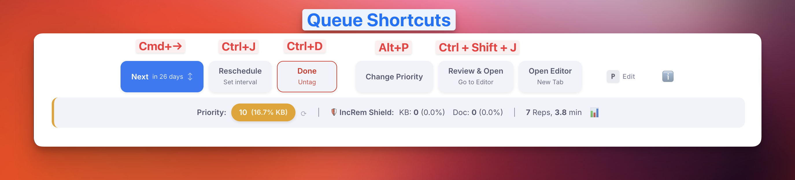{ width="900" }

**Technical details:**
*   Both commands replicate the exact behavior of the corresponding answer buttons, including card priority inheritance, review time tracking, PDF page history, and SRS interval calculations.
*   `handleCardPriorityInheritance` was extracted into a shared module (`src/lib/card_priority/card_priority_inheritance.ts`) for reuse by both the Done button and the Dismiss command.

---
## v0.2.109 - March 2nd, 2026

### 🐛 Bug Fix: Card Priority Display Not Updating Immediately

Fixed a stubborn issue where the Card Priority metric shown below flashcards was occasionally freezing or failing to update after you manually adjusted it using the Priority Popup (Opt+P / Alt+P).

**What was fixed:**
When changing an item's priority in the popup widget, the cache system would optimistically update the priority buffer in the background. However, due to RemNote's internal plugin architecture, popup widgets execute inside completely isolated compartments (Iframes). The exact millisecond the popup successfully closed, the browser would forcefully terminate the widget's isolated JavaScript engine—frequently severing the background cache processing mid-flight and dropping the update before it reached your visual queue.

**The Solution:**
* **Cross-Iframe Optimistic Bridge:** Completely re-architected the memory transfer logic so that the priority slider now forcibly injects your cache updates explicitly into the global Shared Session Storage *before* permitting the popup to close.
* **Array-Based Concurrency Tracking:** Updated the background persistent worker (which survives popup closures) to track concurrent manual updates using specific IDs instead of generic toggle switches, flawlessly guaranteeing that no background sync noise can swallow your manual adjustments.
* **Light Mode Stability:** Solidified the distinction between heavy database re-sorts and purely aesthetic updates, ensuring the UI remains instantaneous and responsive even on mobile devices.

### 🛠️ Developer Experience: TypeScript Strict Mode Fixes

Resolved all remaining React IDE compilation errors and type warnings across the priority components.

**The Fixes:**
* **Ambiguous Imports:** Deleted duplicate, broken import scopes for `IncrementalRem` that caused the TS compiler to reject perfectly valid objects as "incompatible interfaces".
* **Zod Type Inference Bleed:** Explicitly type-casted generic Map and Filter arrays (like `applySortingCriteria`) to prevent the TS compiler from defaulting to loose `any` or `Partial` schemas that eagerly forgot `remId` and `priority` properties existed on their items.
* **Dictionary Keys:** Pushed the newly-created `incremental` key into the `PrioritySource` reducer dictionaries to clear out invalid `NaN` additions.
* **Never Catch:** Replaced unreachable ternary branches attempting to index properties on `undefined` variables with safe fallback objects so standard builds complete successfully.

---
## v0.2.105 - March 2nd, 2026

### 🐛 Bug Fix: "Done" Button Blank Screen Issue (Take 2)

Significantly improved the reliability of advancing the queue when an Incremental Rem is marked as "Done". 

**What was fixed:**
Previously, the plugin relied on a background tracker to advance to the next card after removing the `incremental` powerup. In some cases, rapid UI state changes would reset this background tracker's timer, causing it to stall and leaving the user stuck on a blank "ghost" flashcard screen. 

**The Solution:**
The Queue Viewer component now proactively monitors its own powerup status. The exact moment it detects the `incremental` powerup has been removed (e.g., when you press "Done"), it immediately orchestrates the queue advancement itself, ensuring a snappy, guaranteed transition to your next item.

---
## v0.2.103 - February 26th, 2026

### 🔄 Workflow: "Review & Open" & Timer Integration

The **"Review & Open"** button has been significantly upgraded to form a seamless loop with the **Editor Review Timer**:
*   Clicking **"Review & Open"** now not only opens the Rem in the editor, but immediately **starts the Editor Review Timer**.
*   Clicking **"End Review"** on the Timer properly stops tracking, records your repetition, and **automatically routes you back to the queue document** you originated from.
*   *Note*: To resume the queue, you must manually press `Cmd+Shift+P` (or click Practice) once back at the document.

### 🎨 Queue Layout Improvements 
*   **Maximized Viewer Height**: Adjusted robust CSS targeting to ensure the Incremental Rem Queue utilizes all available vertical space. Hidden components (like the Flashcard Repetition History) no longer invisibly consume empty space during your Incremental Queue sessions.

### 📚 Page Controls Integration

*   **Editor Review PDF Synchronization**: Fully abstracted the PDF reading location state hook. When using the **Execute Repetition** command inside an editor view on a PDF Note, you no longer fly completely blind! The `Execute Repetition` modal and the `Editor Review Timer` will now seamlessly display the standard **PDF Page Controls** bar. 
*   **Direct History Sync**: Modifying your reading range, tracking pages, or tracking reading time via the Editor Review Timer now perfectly writes back to your PDF Reading History analytics, exactly as if you were studying back inside the standard queue.

### 🐛 Bug Fixes & UX Polishes

*   **PDF Note "Review & Open" Behavior**: Fixed an issue where using the "Review & Open" button on a PDF Note would incorrectly open the PDF viewer instead of the note itself. It now correctly opens the Rem as a page in the editor.
*   **False "Manual Date Reset" Repetitions**: Resolved an issue where ending a review in the editor (via the timer widget) would erroneously log a "Manual Date Reset" event in the Repetition History. The system now perfectly distinguishes between plugin-driven interval updates and genuine user-initiated manual changes.
*   **TypeScript Cleanups**: Resolved inner compilation type mismatches between the `RNPlugin` and `ReactRNPlugin` interfaces within the standard widget SDK tracker hooks.


---
## v0.2.101 - February 25th, 2026

### 🐛 Bug Fix: Infinite Heavy Recalc Loop

Fixed a performance bug where the card priority cache would continuously trigger heavy recalculations (~1/second) even when RemNote was completely idle, causing sluggishness.

**Root Cause:** `autoAssignCardPriority` always called `setCardPriority` — even when the priority value and source hadn't changed. Since `setCardPriority` writes `lastUpdated` with `Date.now()`, this modified the Rem, which fired `GlobalRemChanged`, which called `autoAssignCardPriority` again — creating an infinite loop for any Rem with `inherited` or `default` priority source.

**Fix:** Added early-exit guards in `autoAssignCardPriority` to skip the write when the existing priority already matches (same value and source), breaking the feedback loop.

---
## v0.2.100 🎉 — February 20th, 2026

### 🎬 New Feature: Video Extracts & Incremental Video

The **100th improvement** to Incremental Everything Plus brings a major new capability: **Video Extracts** — letting you apply incremental learning to YouTube videos just like you do with PDFs and articles.

**What's new:**

*   **Video Extracts:** Mark specific passages of a YouTube video with precise start/end timestamps. Each extract becomes its own Incremental Rem with its own schedule and priority — when you review it later, it opens the video **directly at that passage**.
*   **Auto-Pause on Extract:** When you click "Set End" to finalize an extract, the video **pauses automatically** so you can set a priority without distraction.
*   **Automatic Transcription (macOS):** When creating a Video Extract, the plugin automatically fetches the YouTube transcript for that time range and saves it as text under the extract Rem. This makes spoken content searchable, editable, and ready for flashcard creation.
*   **Two Viewing Modes:** 
    *   **Native Mode** (paste URL directly) — uses RemNote's built-in player with AI features (highlight moments, AI Summary, AI Tutor) 
    *   **Extract Mode** (import via RemNote Clipper) — enables Video Extracts, session-level position tracking, and transcription

📖 **Full documentation:** [Incremental Video](Incremental-Video.md) wiki page — includes philosophy, step-by-step instructions, and transcription setup guide.

---
## v0.2.99 - February 17th, 2026

### 🐛 Bug Fix: "Done" Button Not Fully Dismissing Incremental Rems

Fixed a critical bug where Incremental Rems would reappear in the queue after pressing "Done," because the `removePowerup` call was never actually executing.

**Root Cause:**

The `onClick` handler for the "Done" button performed its operations in this order:

1. `removeCurrentCardFromQueue(true)` — advance the queue
2. `rem.removePowerup(powerupCode)` — remove the Incremental tag

However, `removeCurrentCardFromQueue` caused the widget to **unmount immediately**, killing the async chain. As a result, `removePowerup` **never executed** — the Incremental powerup stayed on the Rem, and it would reappear in the next queue session.

**Fix:**

Reordered the operations so `removePowerup` executes **before** `removeCurrentCardFromQueue`:

1. `handleCardPriorityInheritance` — sync priority to Card Priority
2. `transferToDismissed` — save history to the Dismissed powerup
3. `removeIncrementalRemCache` — remove from session cache
4. **`rem.removePowerup(powerupCode)`** — remove the Incremental tag (**must happen before queue advance**)
5. `removeCurrentCardFromQueue(true)` — advance the queue (best-effort, widget may already be unmounting)

### 🧹 Console Log Cleanup

Commented out verbose debug logging across multiple files to reduce console noise during normal operation. Key logs for Priority Review Documents, Queue Enter/Exit, and GlobalRemChanged events are preserved for diagnostics.

---
## v0.2.98 - February 12th, 2026

### 🐛 Bug Fixes: Card Priority Inheritance for Incremental Rems

Fixed several issues where Incremental Rem priorities were not correctly inherited or respected by the Card Priority system.

**What was fixed:**

*   **New flashcards on IncRems not inheriting priority:** Fixed a bug where newly created flashcards on Incremental Rems would not get their IncRem's priority assigned. The `GlobalRemChanged` listener's guard was too restrictive and never triggered `autoAssignCardPriority` for rems with `default` or `inherited` source priorities.

*   **Explicit cardPriority overridden by IncRem ancestor priority:** When an ancestor Rem had both a `cardPriority` powerup (with `incremental` source) and an Incremental Rem powerup with a different priority value, descendants would incorrectly inherit the IncRem priority instead of the explicit cardPriority. The inheritance logic now treats `incremental` source the same as `manual` — both take precedence over the IncRem powerup value.

*   **Batch update skipping card-less Rems:** The "Update all inherited Card Priorities" command only processed Rems that had flashcards. Rems with a `cardPriority` powerup set for inheritance purposes (but no cards of their own, such as IncRems) were completely skipped. The command now also processes rems tagged with the `cardPriority` powerup.

### 🎨 Batch Card Priority Assignment for Tagged Rems Widget Improvements

*   **`incremental` source treated as protected:** Rems with cardPriority source `incremental` are now treated separately to avoid undesired overwrites, just like `manual` source was before. Previously, only `manual` source was protected — `incremental` source rems were grouped with unset rems and could be silently overwritten.
*   **Distinct badges for priority sources:** The "Overwrite existing" section now shows color-coded badges distinguishing **Manual CP** (amber) from **Incremental CP** (green), making it clear where each priority came from.

---
## v0.2.97 - February 11th, 2026

### 📊 New Feature: Priority Distribution Graphs 

We've added powerful new visualizations to help you understand and manage the priority distribution of your reading list and flashcards.

**What's new:**

*   **Document-Level Graph:**
    *   Located in the **IncRem Counter** widget (click the 📊 button to toggle).
    *   Shows the priority distribution for the *current document*.
    *   **Absolute Priority View**: See how your items are distributed across the 0-100 priority scale.
    *   **KB Percentile View**: See how your document's items rank compared to the *entire Knowledge Base*.

    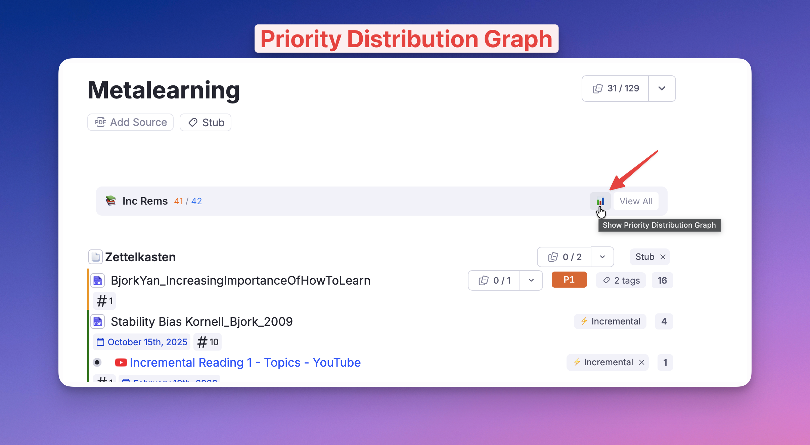{ width="600" }

    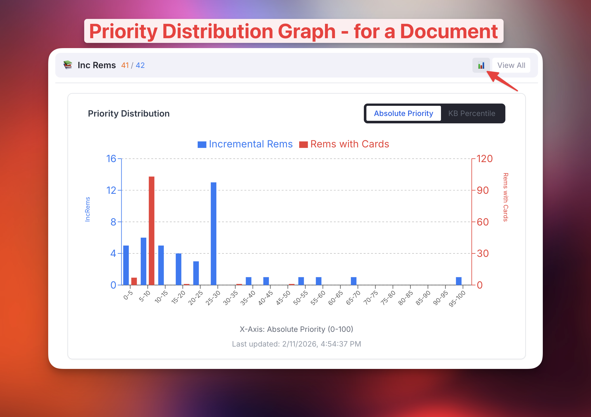{ width="600" }
    
    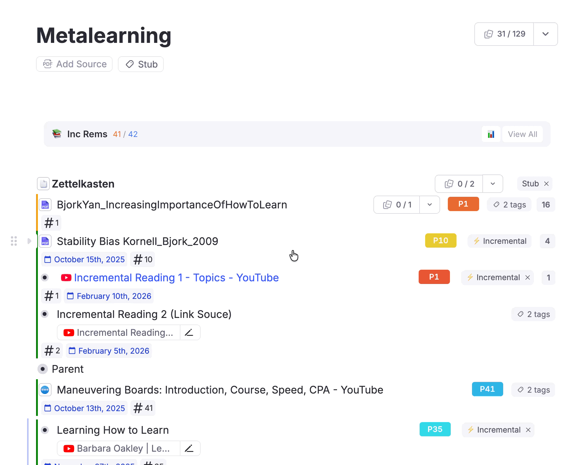{ width="600" }


*   **KB-Wide Graph:**
    *   Located in the **IncRem Main View** (click "View All", then toggle the graph).
    *   Shows the priority distribution for your *entire Knowledge Base*.
    *   Helps you spot imbalances (e.g., too many low-priority items) and adjust your strategy.

    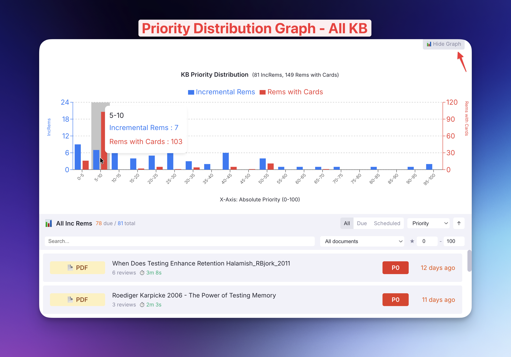{ width="600" }
    
    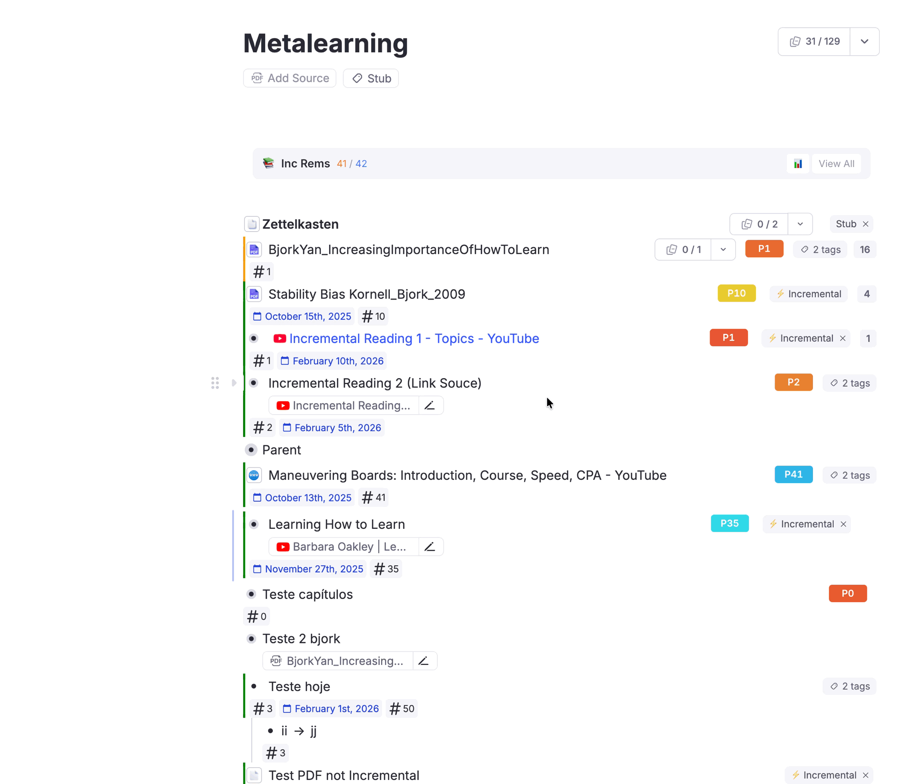{ width="600" }

### 📋 IncRem List Widget Improvements

The IncRem List (both scoped and KB-wide) now has better sorting, filtering, and usability.

**What's new:**

*   **Sorting by Last Review Date:** A new "Last Review Date" sort option lets you find items you haven't reviewed in a while. The previous "Date" option has been renamed to "Due Date" for clarity.
*   **Rem Type Filter:** A new dropdown lets you filter the list by type (PDF, PDF Highlight, PDF Note, HTML, YouTube, Video, Rem, etc.).
*   **Breadcrumb Tooltips:** Hovering over any row now shows its ancestor chain (e.g., "Grandparent > Parent > Rem") so you can quickly identify where a Rem lives in your hierarchy.
*   **Last Review Date Display:** Each row now shows "Last reviewed: X ago" inline with other metadata.
*   **PDF Note Click Fix:** Clicking a "PDF Note" now opens the note as a page in the editor, instead of opening the PDF viewer.


## v0.2.96 - February 9th, 2026

### 🎮 Improved Accessibility for Power Tools

We've made the advanced "Sorting Criteria" and "Priority Shield" features much easier to access, whether you're in the queue or the editor.

**What's new:**
*   **New Commands:**
    *   **"Open Sorting Criteria":** Quickly open the sorting settings widget from anywhere via the Command Palette.
    *   **"Open Priority Shield Graph":** access your priority stats instantly.
*   **Context-Aware Priority Shield:**
    *   **In the Queue:** Shows the history for your current queue (Flashcards or Document).
    *   **In the Editor:** Shows the history for the focused Rem or Document.
    *   **Document Menu Item:** Added "Priority Shield History" to the 3-dot menu of documents for easy access.

## v0.2.95 - February 8th, 2026

### 🧹 UI Cleanup: Hidden Internal Slots in Queue

We've decluttered the flashcard queue by hiding several internal metadata slots that were previously visible.

**What's new:**
*   **Hidden Slots:** The following slots are now hidden from the queue view:
    *   **Last Updated** (from Card Priority)
    *   **Created** (Original Incremental Date)
    *   **Dismissed Date**
    *   **History** (from Dismissed powerup)

This ensures a cleaner review experience without distraction from technical metadata.

## v0.2.94 - February 8th, 2026

### 🐛 Bug Fix: Priority Badge Color in Light Mode

Fixed an issue where the priority badge in the **Flashcard Priority Display** widget would appear gray instead of color-coded when using the plugin in a web browser (Light Mode).

**What was fixed:**
*   **Forced Absolute Coloring:** In environments where full relative percentile data isn't available (like the web browser), the badge now correctly uses the absolute priority score (0-100) to determine its color (Red-Yellow-Green-Blue), restoring visual feedback.

## v0.2.93 - February 4th, 2026

### ✨ Aggregated Repetition History

A powerful new view that gives you a high-level overview of your progress stats for entire trees of content.

**What's new:**
*   **Tree-View Hierarchy**: Displays a hierarchical tree of your Incremental Rems and their stats, sorted exactly as they appear in your document.
*   **Aggregated Metrics**: Shows total repetitions, time spent, and item counts for both your current selection AND all its descendants.
*   **Smart Routing**: The `Ctrl+Shift+H` command now intelligently opens the **Single History** view for individual items or the **Aggregated View** for folders with incremental descendants.
*   **Toggle Views**: Easily switch between "Single" and "Aggregated" views with a new toggle button in the window header.

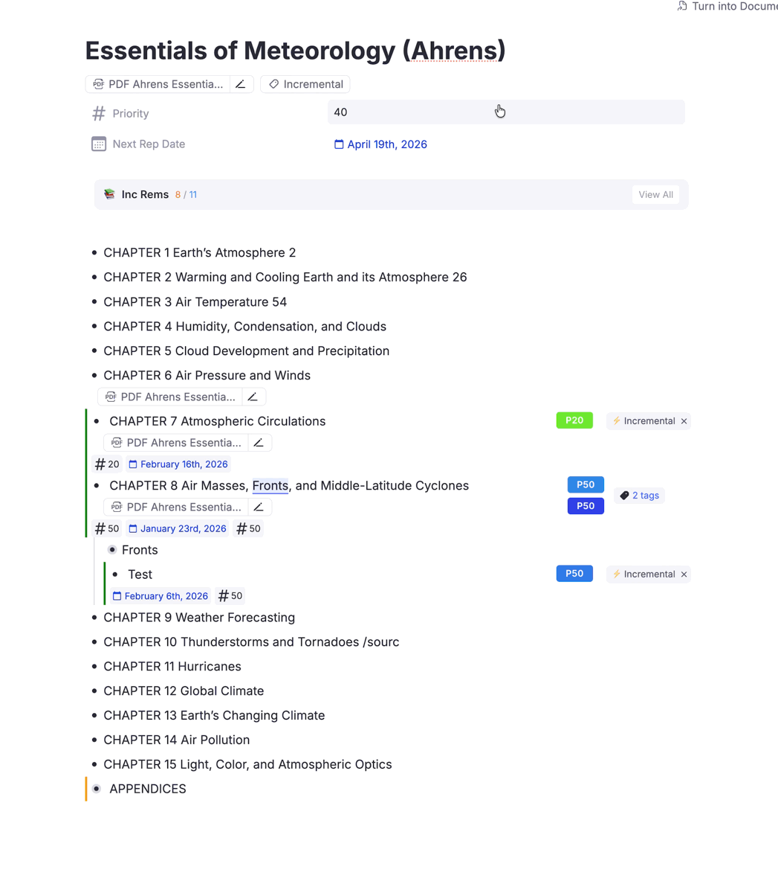{ width="600" }

### 📝 Other Improvements

*   **Batch Priority Sorting**: The "Hierarchy" sort in the Batch Priority widget now respects the exact order of elements in your document/editor.

## v0.2.92 - February 4th, 2026

### 🛡️ KB-Aware Priority Shield History

We've improved how **Priority Shield** history is stored and displayed to support multiple Knowledge Bases (KBs).

**What's new:**
*   **Data Isolation:** History data is now strictly separated by Knowledge Base. Your Main KB stats won't mix with your test or secondary KBs.
*   **Smart Migration:** Existing history data is intelligently migrated to your Primary KB partition to preserve your long-term progress.
*   **Isolated Graphs:** The Priority Shield Graph now only displays data relevant to the specific Knowledge Base you are currently viewing.

## v0.2.91 - February 4th, 2026

### 🐛 Bug Fix: "Done" Button History & Dismissal

Fixed an issue where completing an Incremental Rem (using the "Done" button) failed to record the final session's history and, in some cases, failed to add the Dismissed powerup entirely.

**What was fixed:**
*   **Recording Final Repetition:** The plugin now correctly calculates the review time and records a standard **Repetition** event for the session you just completed.
*   **Guaranteeing Dismissal:** By ensuring history is never empty (thanks to the recorded repetition), the transfer to the **Dismissed** state now works reliably for all items, even those with no prior history.
*   **History Sequence:** This results in a clean history log: `... -> [Last Repetition] -> [Dismissed Marker]`.

## v0.2.90 - February 3rd, 2026

### 🔄 Synced Card Priority for Incremental Rems

We've improved how priority is handled when an Incremental Rem (which also has flashcards) is completed in the queue.

**What's new:**
*   **Intelligent Syncing:** When you finish reviewing an Incremental Rem (by clicking **"Done"**), its priority is now automatically synced to the `Card Priority` powerup.
*   **"Sticky" Priority Source:** This synced priority is marked with a new source type: **`incremental`**. This acts like a "manual" priority, meaning it sticks! It won't be overwritten by default or inherited values from parent Rems, ensuring your specific prioritization is preserved.
*   **Consistent Visibility:** The **Card Priority Widget** (displayed under flashcards) now correctly appears for these items when they come up as regular flashcards, showing you the priority you set during your incremental review.

This ensures a seamless transition of priority data from your incremental reading workflow to your flashcard reviews.

## v0.2.89 - February 2nd, 2026

### 🛡️ Priority Shield Improvements

Significantly improved the calculation and display of the **Priority Shield** to address cases where large blocks of items have the same priority.

**What's new:**
*   **Volume-based Percentile (Dynamic Progress):** Instead of calculating the percentile based on rank alone (which caused the shield to stay stuck at 0% for large blocks of tied priorities), the shield now calculates progress **by volume**. As you review cards within a priority group (e.g., Priority 10), the percentile will now increase smoothly (e.g., `10.5%` → `12.1%` → `15.2%`), giving you a true sense of progress.
*   **Increased Precision:** The shield now displays **1 decimal place** (e.g., `45.2%`) for granular tracking.
*   **Performance Optimization:** The calculation logic was rewritten to use `O(N)` linear scans instead of `O(N log N)` sorting. It also uses efficient `Set` lookups during reviews. This means **zero lag** even when reviewing large documents with thousands of cards.
*   **Accuracy Fix for Priority Review Documents:** Fixed an issue where the Document Shield would show 0% for Priority Review Documents. It now correctly scopes to the original source document to calculate the universe size.
*   **Consistent History:** The [Prioritization-&-Sorting#priority-shield-history](Prioritization-&-Sorting.md#priority-shield-history) graph now also uses this improved volume-based calculation, ensuring your historical data matches what you see during review.

## v0.2.87 - January 31st, 2026

### 🐛 Bug Fix: Priority Display in Reschedule Events

Fixed an issue where the **Repetition History widget** was not displaying the priority value for "Rescheduled in Editor" events.

**What was fixed:**
- **Recording the correct priority**: The reschedule function now records the **new priority** set by the user during the reschedule action, instead of the old priority value.
- **Displaying priority in event markers**: Both "Rescheduled in Editor" (📅) and "Manual Date Reset" (✏️) event markers now display the priority value (e.g., `— Pri: 5`).

---

## v0.2.86 - January 31st, 2026

### ✨ New Feature: Dismissed State & History Preservation

When you're done reviewing an Incremental Rem, you can now **preserve its complete learning history** even after removing the Incremental tag. This enables future recovery and analytics.

**How it works:**

1. **Done Button**: When you click "Done (Untag)" in the queue, the Rem's full repetition history is transferred to a new `Dismissed` powerup before removing the `Incremental` tag.

2. **Manual Tag Removal**: If you manually remove the `Incremental` tag in the editor, the history is also automatically transferred to the `Dismissed` powerup.

3. **Visual Indicator**: Dismissed Rems show a **yellow left border** in the editor (can be toggled off in settings).

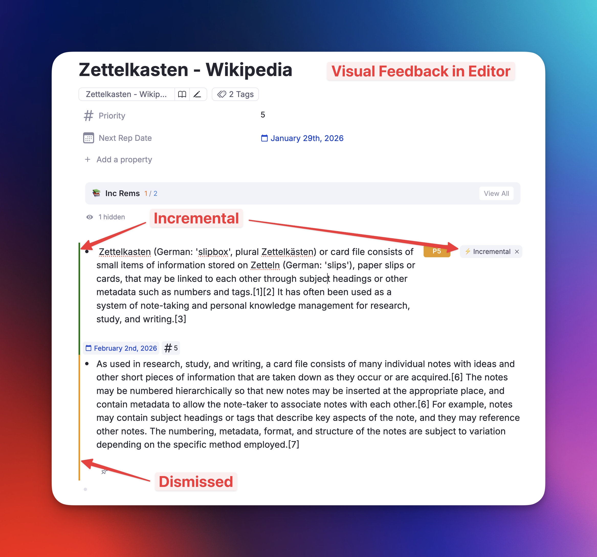{ width="600" }

4. **Re-activating**: If you make a previously-dismissed Rem incremental again, the old history is **restored and merged** with the new session. A "Made Incremental" marker is added to distinguish learning sessions.

**Settings:**
- **Show Yellow Left Border for Dismissed Rems**: Toggle the visual indicator (default: on)
- **Hide Dismissed Tag in Editor**: Hide the Dismissed tag to reduce clutter (default: on)

### 📊 Repetition History: Priority Tracking

The Repetition History widget now records and displays the **priority value at the time of each repetition**.

**What's new:**
- Each repetition entry now includes a **"Pri." column** showing the priority when reviewed
- The **"Made Incremental"** event marker shows the initial priority set
- All history entries (Next button, Reschedule, Editor Review) now record priority

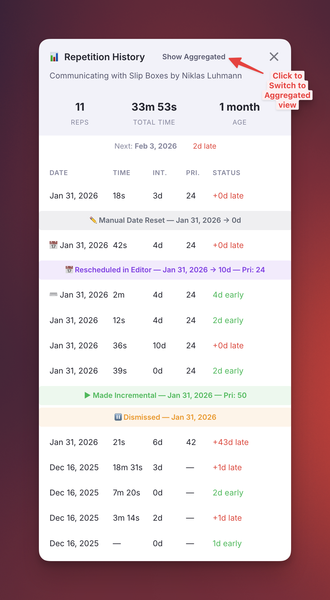{ width="400" }

### 📋 Reschedule Event Type Tracking

The plugin now **differentiates reschedule and repetition events** based on their source, allowing for more accurate interval calculations and better history visibility.

**Event Types:**

| Event Type | Source | Counts for Interval? |
|------------|--------|---------------------|
| `rep` | Next button in queue | ✅ Yes |
| `rescheduledInQueue` | Ctrl+J in queue | ✅ Yes |
| `rescheduledInEditor` | Ctrl+J in editor | ❌ No |
| `manualDateReset` | Manual edit of Next Rep Date | ❌ No |
| `executeRepetition` | [Execute Repetition command](Reviewing-Items-in-the-Editor.md#1-execute-repetition-command) | ✅ Yes |

**Why this matters:**
- **Review actions** ([Next](Reviewing-Items-in-the-Queue.md#next), [Reschedule in queue](Reviewing-Items-in-the-Queue.md#reschedule), [Execute Repetition command](Reviewing-Items-in-the-Editor.md#1-execute-repetition-command) in editor) count for interval calculation because you engaged with and reviewed the content
- **Administrative adjustments** (Ctrl+J in editor, manual date edits) don't count — they change the schedule without confirming a review took place
- The **[Repetition History widget](Getting-Started.md#repetition-history-statistics)** displays visual indicators for each event type (📅 for queue reschedules, ⌨️ for editor command reviews, colored markers for administrative events)

See [Reviewing Items in the Queue#reschedule-event-types](Reviewing-Items-in-the-Queue.md#technical-note-reschedule-event-types) for the complete event type reference.

---

## v0.2.85 - January 30th, 2026

### 🐛 Bug Fix: Interval Calculation Now Counts Current Repetition

Fixed an issue where the spaced repetition interval was calculated using only **past** repetitions, excluding the current one being recorded. This caused the next interval to be shorter than expected.

**What changed:**
- Previously: After completing your 2nd rep, the interval was `1.5^1 = 2 days` (supposing your multiplier is the default 1.5)
- Now: After completing your 2nd rep, the interval is `1.5^2 = 3 days`

**What to expect:**

| After completing... | Old interval | New interval |
|---------------------|--------------|--------------|
| 1st repetition | 2 days | 2 days |
| 2nd repetition | 2 days | 3 days |
| 3rd repetition | 3 days | 4 days |
| 4th repetition | 4 days | 6 days |

This aligns the scheduling behavior with the expected exponential growth from the first review onwards.

**Note:** Be aware that **early repetitions** are not computed to determine the New Interval.

---

## v0.2.84 - January 29th, 2026

### New Feature: Repetition History Popup

Added a new **Repetition History** popup that provides detailed insights into your review history for any Incremental Rem.

**How to access:**
- In the **Queue**: Click the 📊 icon in the Answer Buttons info bar
- **Keyboard shortcut**: `Ctrl+Shift+H` (works in both Queue and Editor)

**What it shows:**
- **Rem name** in the header for context
- **Summary stats**: Total reps, total time spent, and age since first review
- **Next scheduled date** with days late/early indicator
- **Full history table**: Date, time spent, scheduled interval, and status for each repetition

**Answer Buttons improvements:**
- Info bar now displays **"X Reps, Y min"** stats inline before the history icon
- Centralized layout with `|` separators between Priority, Shield, and History sections

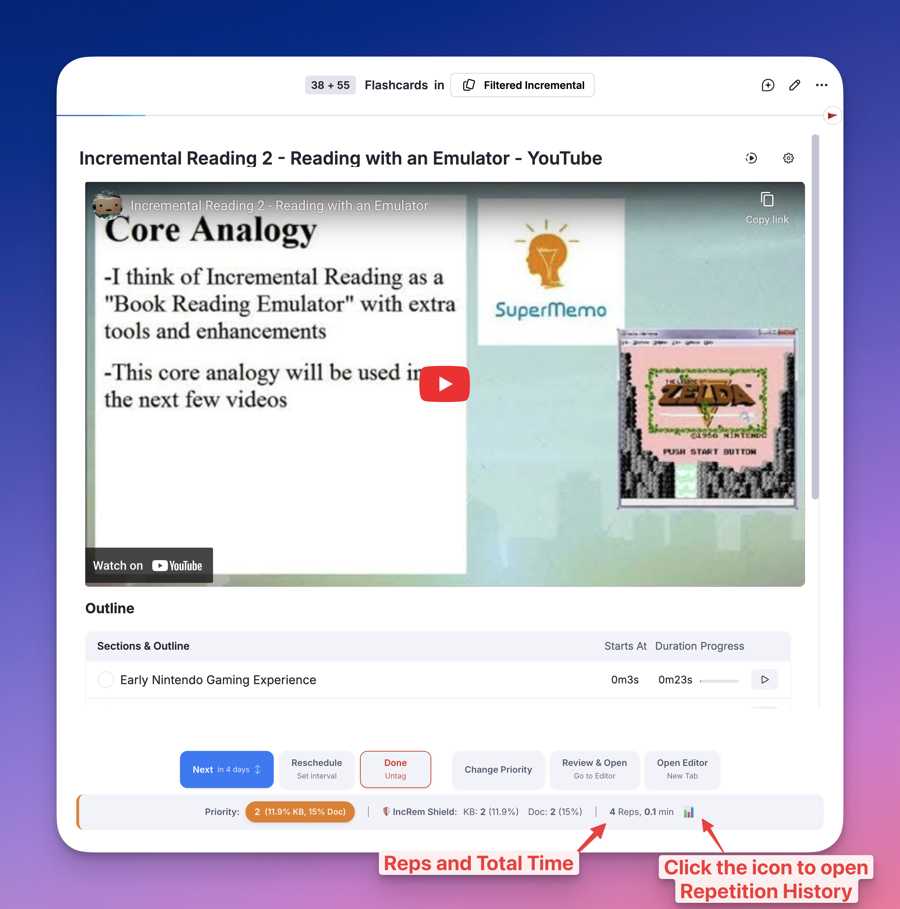{ width="600" }

{ width="400" }

## v0.2.81 - January 24th, 2026

* Remapped **Quick Priority shortcuts**. See [Prioritization-&-Sorting#quick-priority-shortcuts](Prioritization-&-Sorting.md#quick-priority-shortcuts) for details.

## v0.2.79 - January 23rd, 2026

### New Feature: Incremental Rem History

Implemented the Incremental Rem History feature, which records Incremental Rems viewed in the queue and displays them in a searchable list in the **right sidebar**. Good companion to the **[History and Final Drill](https://www.remnote.com/plugins/final_drill_and_history)** plugin.

* Filters by the current Knowledge Base (KB aware).
* Includes a search bar to filter by text content.
* Shows "seen X time ago".
* Limits history to 200 items.

{ width="400" } 


## v0.2.70 - January 22nd, 2026

* Improved **Reschedule** widget appearance and behavior.
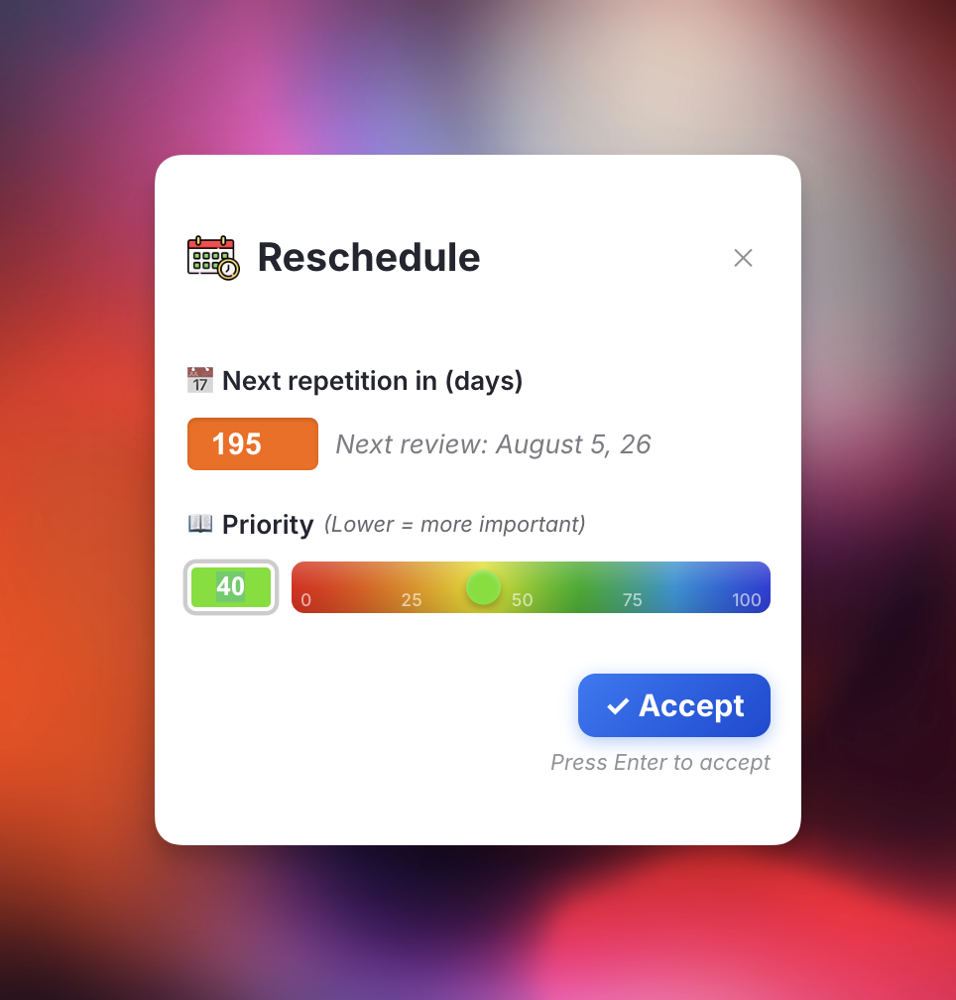{ width="400" }


## v0.2.69 - January 22nd, 2026

### 🚀 Priority System Overhaul

This release brings a significant refactoring of how priorities are handled, focusing on speed and usability:

*   **Minimum-Lag Main Priority Widget (Opt+P):** We've optimized the main priority widget to eliminate lag, making interactions fast even in large Knowledge Bases. You should use this widget whenever you want to make analytics about your priority distribution.
*   **New Zero-Lag "Light Priority Widget" (Ctrl+Opt+P):** Implemented a streamlined version of the priority controls for even faster day-to-day adjustments.
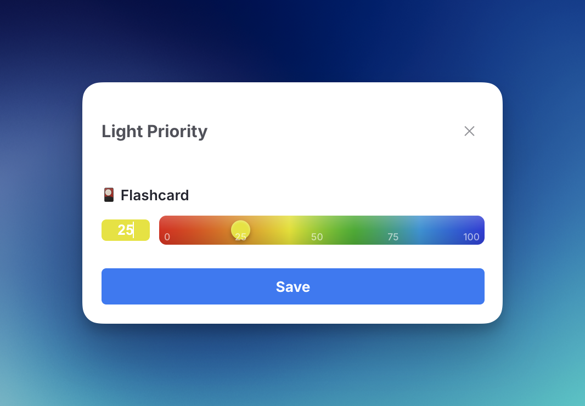{ width="400" }

**Note:** If you are on **Windows** instead of Mac, you may need to disable the default keybindings for "Add All Properties" in the settings to avoid conflicts with this plugin. Go to Settings > Keyboard Shortcuts, search for "Add All Properties" and disable it.

*   **Quick Priority Shortcuts:** You can now adjust priorities instantly without opening any menus!
    *   **Ctrl+Opt+Up:** Increase absolute priority (make less important) (e.g., 10 → 20)
    *   **Ctrl+Opt+Down:** Decrease absolute priority (make more important) (e.g., 25 → 15)
    *   *(Note: Lower numbers = Higher priority)*
    *   *(Note: you can adjust the desired step size in the settings)*

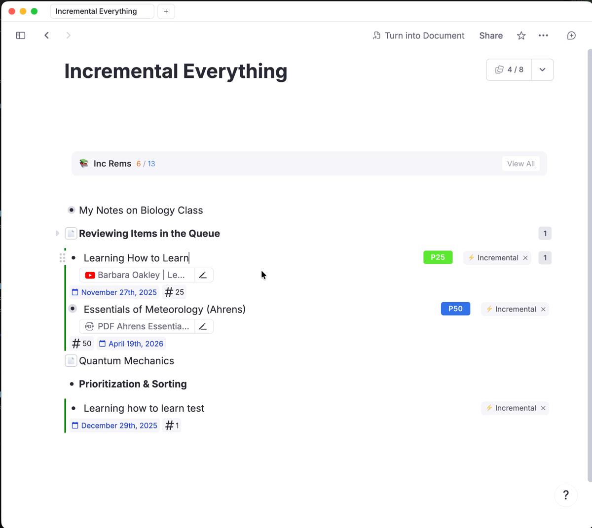{ width="600" }

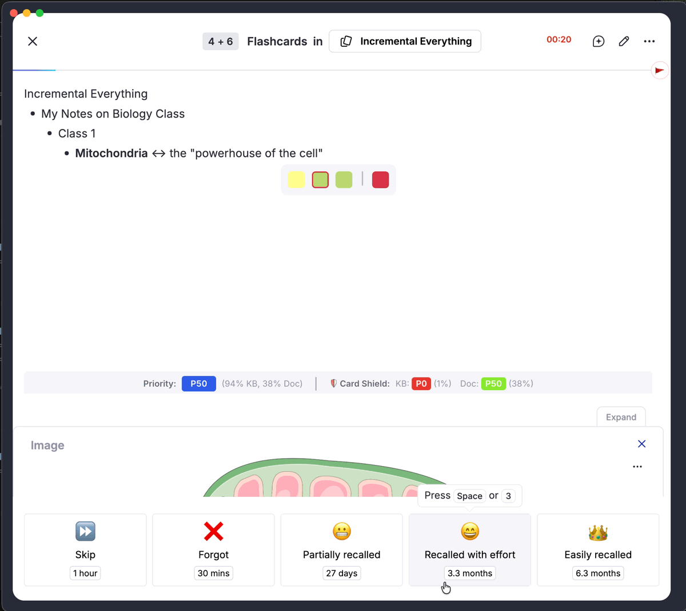{ width="600" }

## v0.2.65 - January 21st, 2026

**Fix:** Resolved an issue where [Prioritization-&-Sorting#priority-shield-history](Prioritization-&-Sorting.md#priority-shield-history) was recorded with incorrect data if the queue was exited before the cache fully loaded. This eliminates spurious "humps" in the history graph caused by partial universe sizes, ensuring history is only saved when the cache is complete.


## v0.2.64 - January 21st, 2026

### ⚡ Performance & Optimization
*   **Instant Priority Updates:** Implemented optimistic cache updates and non-blocking "fire-and-forget" writes, eliminating lag when closing the priority widget.

### ✨ Features & UX
*   **Streamlined Workflow:** The priority popup now automatically opens when **making a document Incremental** using the Document Menu.

### 🐛 Bug Fixes
*   **Visual Logic:** Fixed priority slider and input background colors not updating correctly with value changes.
*   **State Stability:** Resolved an issue where input values could be overwritten during the loading state.

## v0.2.61 - January 10th, 2026

### 📆 Enhanced Reschedule Widget
- Added advanced keyboard navigation:
  - Use `Arrow Up`/`Arrow Down` to adjust Days and Priority values with acceleration (hold for faster changes).
  - Use `Tab` to cycle focus between Days and Priority inputs.
  - Press `Esc` to close the popup without saving.

## v0.2.60 - January 8th, 2026

### 🚀 Priority Widget: Performance & UX Improvements

*   **Instant Priority Popup**: The priority settings now open immediately, loading heavy stats in the background for a snappier experience.
*   **Pro Keyboard Controls**: Adjustable step sizes! **Tap arrow keys up and down** rapidly to jump by +5, +10, or +20, or hold to accelerate. Tab cycling between sliders is now supported.
*   **Adaptive Visuals**: Priority sliders now intelligently switch between absolute colors (for immediate feedback) and relative percentile colors (for context).
*   **Smart Inheritance**: New items automatically "snap" to inherited priority values or your configured defaults.

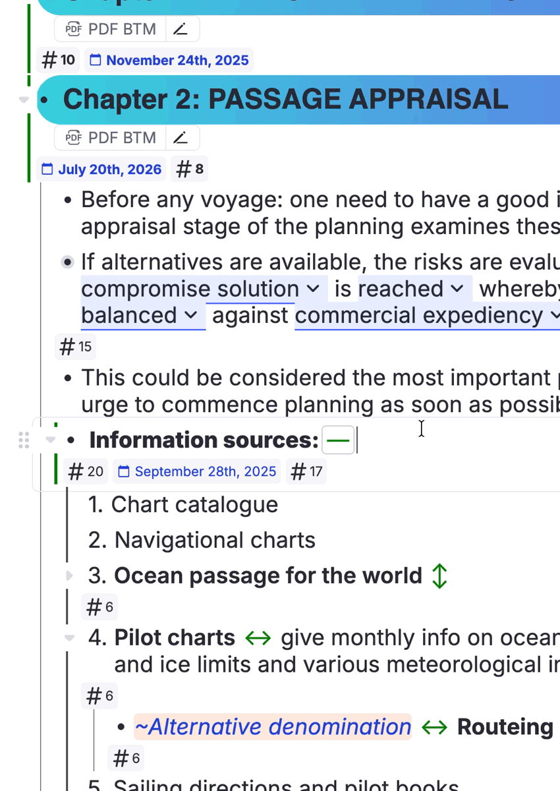{ width="450" }


## v0.2.59 - January 8th, 2026

## 🎨 Improved PDF Highlighting Experience
We've completely overhauled how PDF highlights are styled to give you immediate visual feedback on their status.

- **Meaningful Colors**: Highlighs now automatically change color to tell you see at a glance their state:
  - 🟢 **Green**: This highlight has been **Toggled Incremental**. It's active and waiting for your review, but is not an extract yet: it will be shown to you in the PDF context (the PDF highlight itself) in an uneditable form.
  - 🔵 **Blue**: You have successfully **extracted** this highlight into a new Rem using the **"Create Incremental Rem"** feature (recommended approach). This means you have already processed this highlight, as its content has been extracted, prioritized and transferred to a regular rem (that will be presented to you incrementally), where you will be able to edit, break the complexity, polish text, rephrase and finally create flashcards!

- **Simplified Settings**: We've removed the manual "Incremental PDF Highlight Color" setting. The plugin now manages this for you automatically using the smart colors above, keeping your experience consistent and clutter-free. 

(Note: This update was only possible because RemNote recently exposed the data-rem-tags of PDF highlights in the DOM.)


## v0.2.58 - January 8th, 2026

### Priority Widget Performance & UX Improvements

*   **Fixed Open Lag**: Changed default initialization to 'Light Mode' and implemented logic to totally skip expensive card checks (Tier 2/3) when in Light Mode. Also fixed mobile and web browsers not being recognized to impose the Light Mode.
*   **Optimistic UI Loading**: The Inheritance interface now renders immediately in Full Mode without blocking on descendant card calculations.
*   **Future Priority Support**: Enabled setting priority for descendant cards even if count is 0 (supports future cards), removing the "neither Incremental nor has flashcards" fallback state.

## v0.2.55 - January 3rd, 2026
* Moved the **Summary** and [Priority-Review-Document#priority-review-document-graph-view](Priority-Review-Document.md#priority-review-document-graph-view) to the top of [Priority Review Document](Priority-Review-Document.md)s (instead of the bottom).

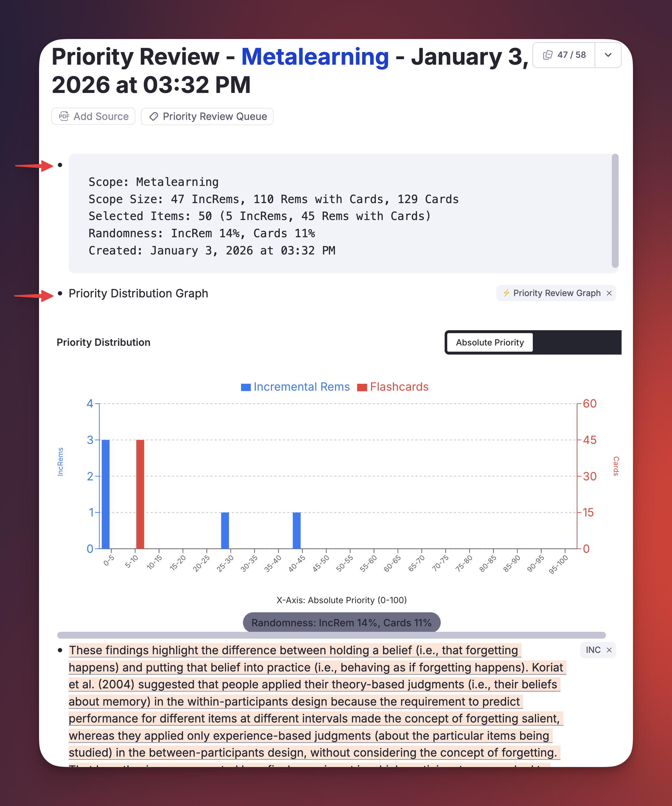{ width="800" }


* Changed the name of the "**Pre-compute all card priorities**" command to "**[Priorities-for-Flashcards#maintenance-the-update-all-inherited-card-priorities-command](Priorities-for-Flashcards.md#manual-full-kb-sweep-update-all-inherited-card-priorities)**".

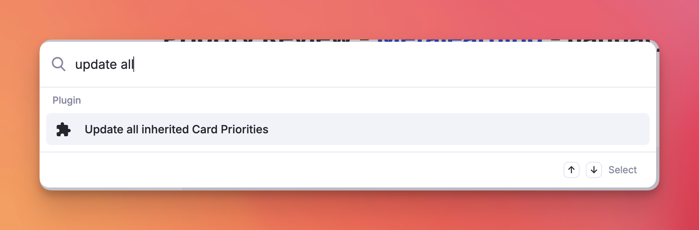{ width="700" }

## v0.2.54 - December 31th, 2025 - Improved [Priority-Review-Document#priority-review-document-graph-view](Priority-Review-Document.md#priority-review-document-graph-view) and Metadata for Summary

Graph View now can also show distributions by relative priority percentile.

Summary now shows scope size data (total number of IncRems, Rems with Cards and Cards).

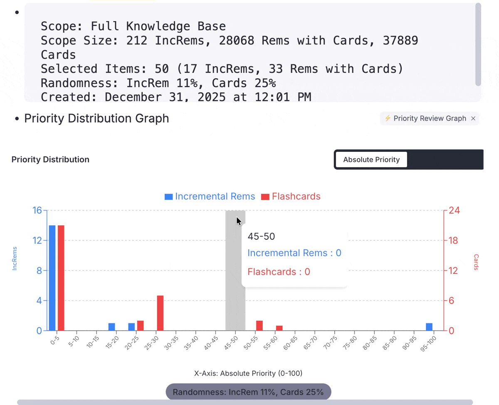{ width="750" }


## v0.2.53 - December 30th, 2025

### 📊 Feature: [Priority Review Document](Priority-Review-Document.md) Graph View

Implemented a visual distribution graph for Priority Review Documents. This feature appends a bar chart to the end of newly created review documents, visualizing the priority distribution of the included Incremental Rems and Flashcards. This helps users verify the effect of the requested randomness parameters in their [Prioritization-&-Sorting#sorting-criteria](Prioritization-&-Sorting.md#sorting-criteria), and that the "[Prioritization-&-Sorting#priority-shield](Prioritization-&-Sorting.md#priority-shield)" logic is correctly prioritizing high-value items.

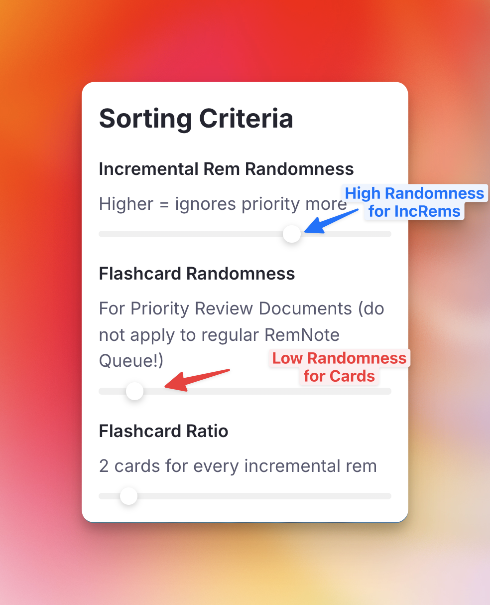{ width="500" }

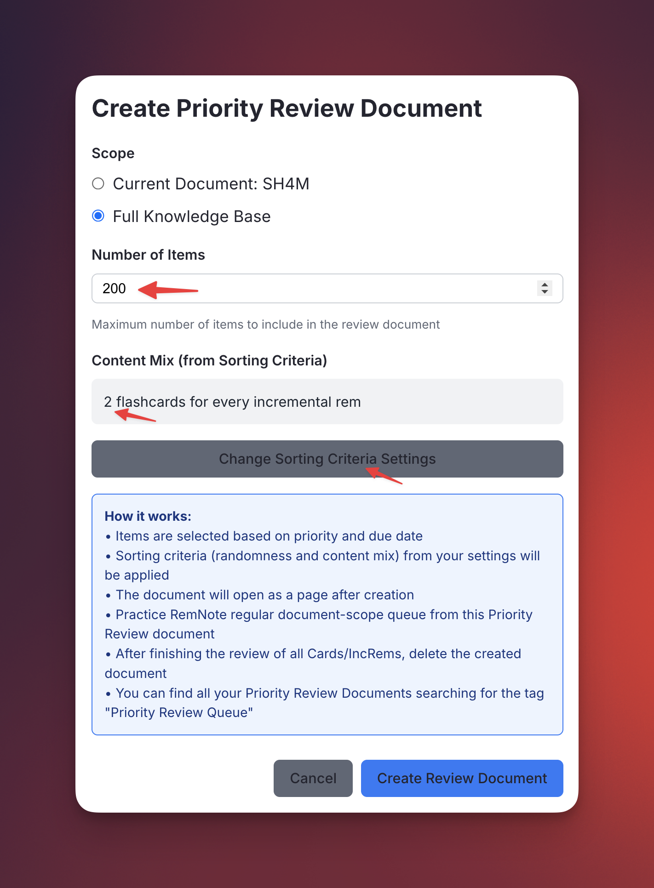{ width="600" }

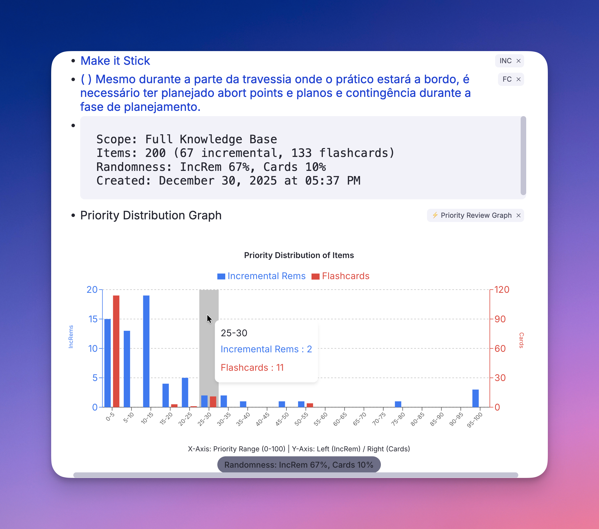{ width="850" }


## v0.2.52 - December 26th, 2025 - Injected css to hide Priority and Priority Source slots from Editor and Queue

This aims to declutter the interface from these usually unhelpful information.

What was this:

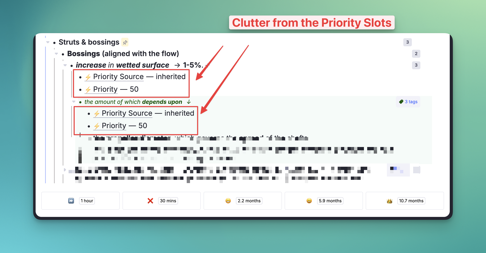{ width="600" }


Now looks like this:

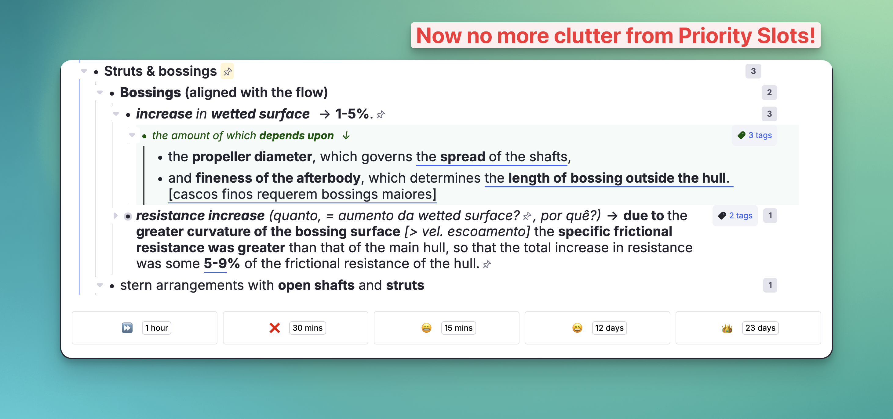{ width="600" }


## v0.2.51 - December 23th, 2025

**Improved Card Priority inheritance logic:** Updated to prioritize **Manual** Card Priorities over Incremental Rem priorities, while keeping Incremental Rem priorities higher than **Inherited/Default** Card Priorities (in the case of the closest ancestor having both Incremental and CardPriority powerups, with different priorities set in each one).

## v0.2.48 - December 16th, 2025

**"Create Incremental Rem"** button support for HTML and HTML-highlight IncRems, enabling the parent selector widget to work with web page highlights just like it does with PDF highlights.

## v0.2.47 - December 16th, 2025

### ✨ New Button for HTML IncRem: Open URL for Web Clipper

Added a new "📎 Open URL" button to the answer bar for HTML-type Incremental Rems. When reviewing IncRems with web pages sources, this button opens the original URL in a new browser tab, allowing you to use the Clipper's side panel for additional notes and extracts, improving the experience of Incremental Reading web pages. The button features an animated design to highlight when you're reviewing web content.

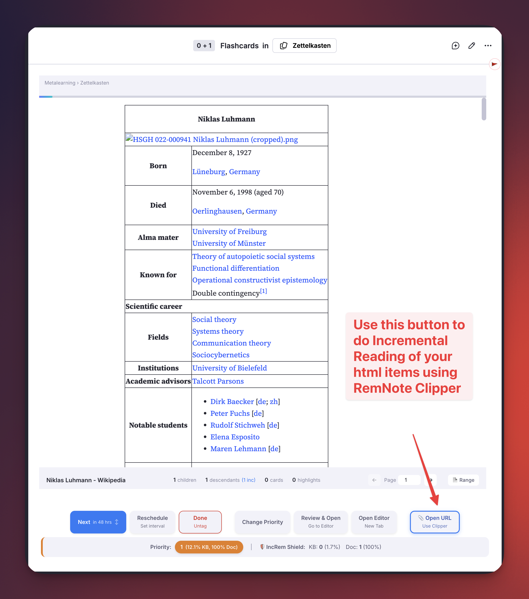{ width="800" }


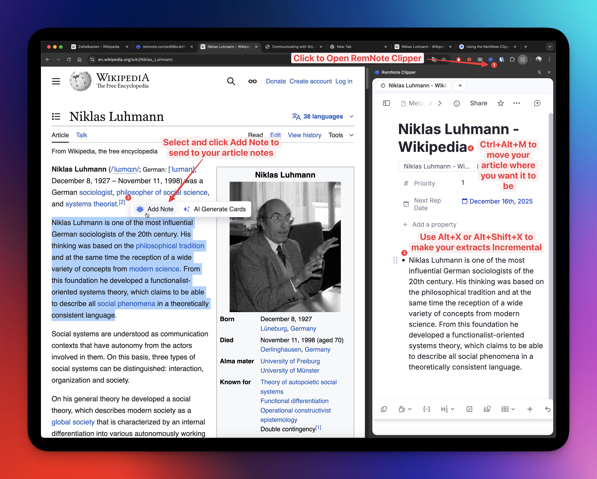{ width="1000" }

See also: [Using the RemNote Clipper](https://help.remnote.com/en/articles/6030855-using-the-remnote-clipper).

## v0.2.46 - December 15th, 2025

### Fix SDK rem.getCards() Inconsistency (in old large DB)

#### Problem
`rem.getCards()` intermittently returns empty array `[]` for valid flashcard rems due to SDK bug, causing:
- Priority popup showing "neither Incremental Rem nor flashcards" incorrectly
- Potential missed cards in Priority Review Document creation
- Incorrect flashcard counts in Reader/ExtractViewer metadata

#### Solution
Replace all `rem.getCards()` calls with reliable alternatives:

1. **priority.tsx**: Three-tier fallback with `hasPowerup('cardPriority')` check first
2. **getDueCardsWithPriorities**: Use cache's `dueCards > 0` instead of fetching cards (cards array was never used by callers anyway)
3. **Reader/ExtractViewer metadata**: Use `allCardPriorityInfoKey` cache for card counts

**PS:** RemNote developers informed that `rem.getCards()` does not return cards that are disabled (or paused). This may be the reason why empty arrays `[]` were being returned for valid flashcard rems.


## v0.2.45 - December 15th, 2025

### Enhance parent selector filtering and improve highlight IncRem creation UX

**Description:**
* **Refined Powerup Filtering:** Significantly expanded `powerupSlotFilter.ts` to filter out internal RemNote metadata and structural Rems that should not be used as parents. This includes:
    * Search Portals and queries (e.g., "Automatic Backlink Search Portal").
    * PDF/Reader state Rems (e.g., "Pages", "Highlights", "Last Zoom Workspace Point", "ShouldOpenInTextReader").
    * Common powerup slots (Headers, AutoSort, Aliases, Todos).
    * Empty/"Untitled" nodes and generic "Query" Rems.
* **Improved Highlight IncRem Creation Workflow:** Updated `createRemFromHighlight` to consistently open the Parent Selector popup.
    * Removed the auto-creation fallback when no existing candidates are found (or only the PDF is found). Now the parent selector always open, giving the user the opportunity to create a parent holder to place the highlight in an organized way.


## v0.2.43 - December 15th, 2025

- **Fixed:** Priority popup incorrectly showing "neither Incremental Rem nor flashcards" message for rems with flashcards

## v0.2.42 - December 11th, 2025

### ✨ Improvement - "Create Incremental Rem" from PDF Highlights: Enhanced Parent Selector with Hierarchical Navigation

The Parent Selector popup (used when creating Incremental Rems from PDF highlights) has been significantly improved with **hierarchical tree navigation** and **inline child creation**.

**Hierarchical Tree Navigation:**
- Nodes can now be **expanded to reveal children**, allowing you to navigate deep into your note structure
- Use `→` to expand a node, `←` to collapse (or jump to parent)
- The tree **remembers your last destination** and auto-expands to it on next use
- Incremental Rems are shown first, sorted by priority

**Inline Child Creation:**
- Press `+` or `n` on any selected node to create a child
- Type the name and press `Enter` — the new Rem appears immediately in the tree
- Press `Enter` again to select it as your destination

This eliminates the friction of closing the popup, navigating to the editor to create a missing parent, and returning to the PDF highlight.

| Shortcut | Action |
|----------|--------|
| `↑` / `↓` | Navigate up/down |
| `→` or `Tab` | Expand node |
| `←` | Collapse node or jump to parent |
| `+` or `n` | Create child for selected node |
| `Enter` | Confirm selection |
| `Escape` | Close popup |


## v0.2.39 - December 9th, 2025

- Added a plugin setting **“Show regular Rems in isolated view (Queue)”** so Extracts Incremental Rems can use the isolated card layout and still toggle to context (ExtractViewer) if desired, using the button (and switch back and forth).

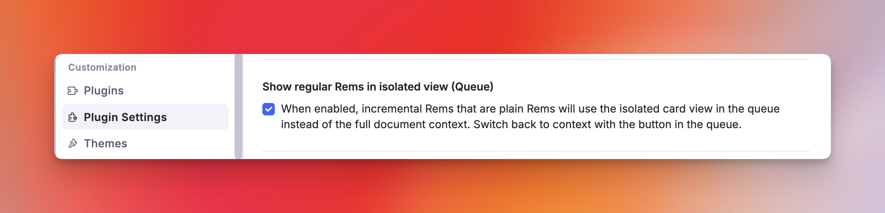{ width="800" }

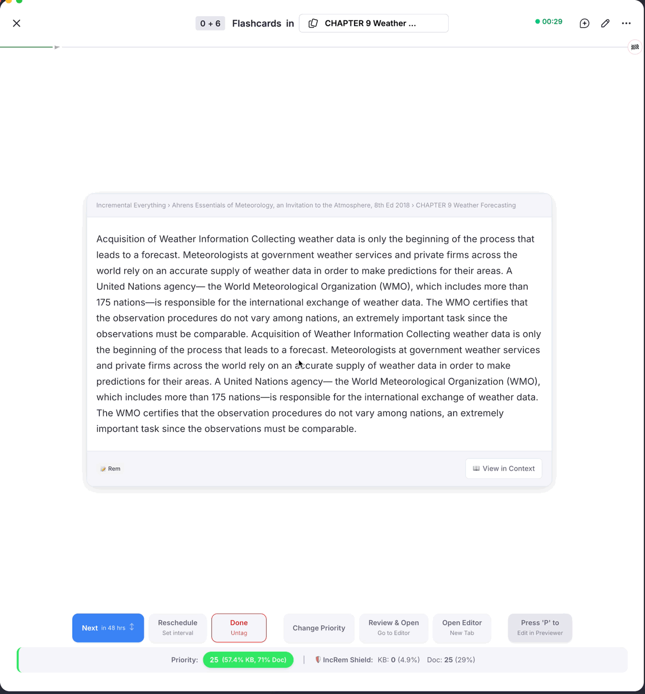{ width="800" }

{ width="800" }


- Fixed Priority Shield for Cards not showing relative priorities

{ width="700" }


## v0.2.37 - December 7th, 2025 

### ✨ New Feature: Quick Reschedule Gesture on "Next" Button

**Swipe-to-Reschedule for Incremental Rems**

A new gesture has been added to the "Next" button for faster scheduling when reviewing Incremental Rems:

**How to use:**
- **Normal click** → Schedules the next repetition using the standard SRS multiplier (same as before)
- **Click and slide UP** → Schedules for **tomorrow** 
- **Click and slide DOWN** → Schedules for **today** (later in the same day)

**When to use:**
This is particularly useful for content you're actively working through, like reading a book chapter by chapter. Instead of the SRS algorithm potentially scheduling your next reading session days or weeks away, you can quickly force the content to reappear today or tomorrow — keeping your momentum without opening the Reschedule popup.


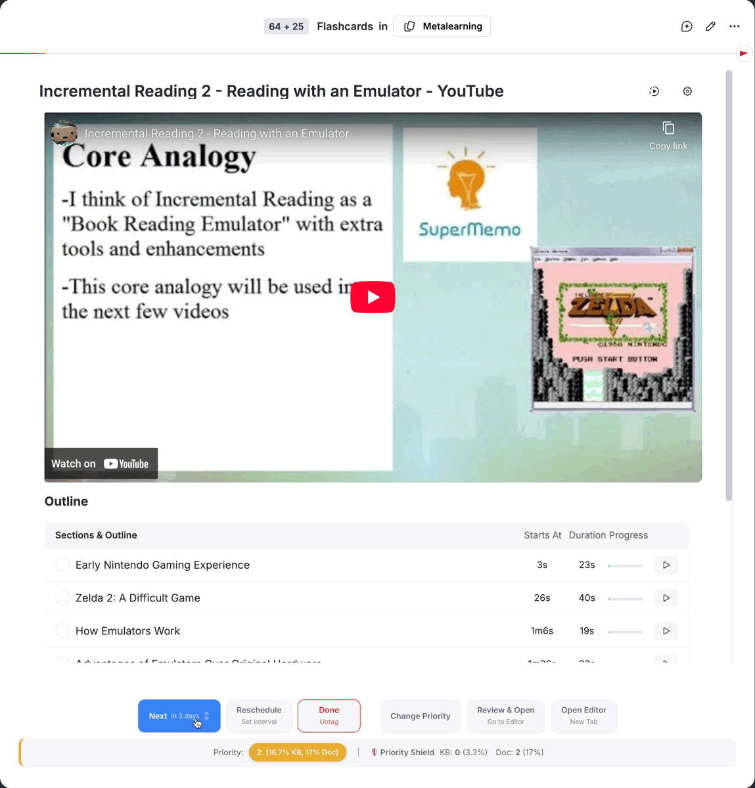{ width="700" }


### ✨ New Feature: "Create Incremental Rem" from PDF Highlights

**New "Create Incremental Rem" Button in PDF Highlight Menu**

A new option has been added to the PDF highlight popup menu that streamlines the process of turning extracts into standalone incremental reading items.

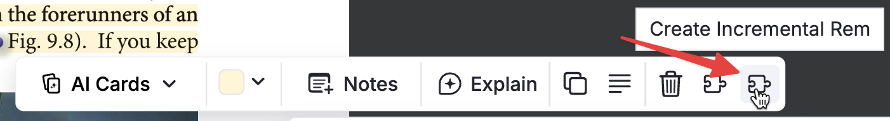{ width="700" }


**How it works:**

1. When you select text in a PDF and create a highlight, click on it to open the highlight menu
2. Click **"Create Incremental Rem"** (identified by the second puzzle icon)
3. A **Parent Selector popup** appears, showing all Rems associated with this PDF (sorted with Incremental Rems first, ordered by priority)
4. Select the parent where you want to place your new Rem
5. The plugin creates a new Incremental Rem under your chosen parent, containing the highlight text plus a pinned reference back to the original highlight

**What happens automatically:**
- The new Rem inherits the Incremental tag and gets scheduled for review
- The original highlight is "consumed" — its Incremental tag is removed (if existing) and its color resets to yellow
- The new Rem maintains a link to the source highlight for easy navigation back to the PDF context

**When to use:**

This is ideal for workflows where you want to:
- Extract key ideas from PDFs into your main note structure rather than leaving them as orphan highlights (it will be **much easier to process this extract, cloze keywords, create flashcards**, etc)
- Organize extracts under topic-specific Incremental Rems (e.g., placing all extracts about "Navigation Systems" under a dedicated parent)
- Build a hierarchical structure where child extracts inherit context and priority from their parent

**Difference from "Toggle Incremental Rem":**

- **Toggle Incremental Rem**: Marks the highlight *itself* as an Incremental Rem (stays in place inside the PDF structure)
- **Create Incremental Rem**: Creates a *new* Rem with the highlight content under a parent of your choice, with a reference back to the source


{ width="700" }


## v0.2.33 - November 26, 2025

### ✨ New Features

### Isolated Card Viewer for PDF Highlights
- Added isolated card view for highlights and rems in queue, providing a focused review experience
{ width="600" }


- **Create Rem** button allows creating new rems directly from the viewer
- **Create Inc Rem** button with option to remove incremental status from original
- **Parent Selection** for PDF Highlights
  - New parent selection feature when creating rems from PDF highlights
  - Shows all PDF rems that has the specific PDF as source, including Done/untagged ones
- Type badge and hover feedback for better visual distinction
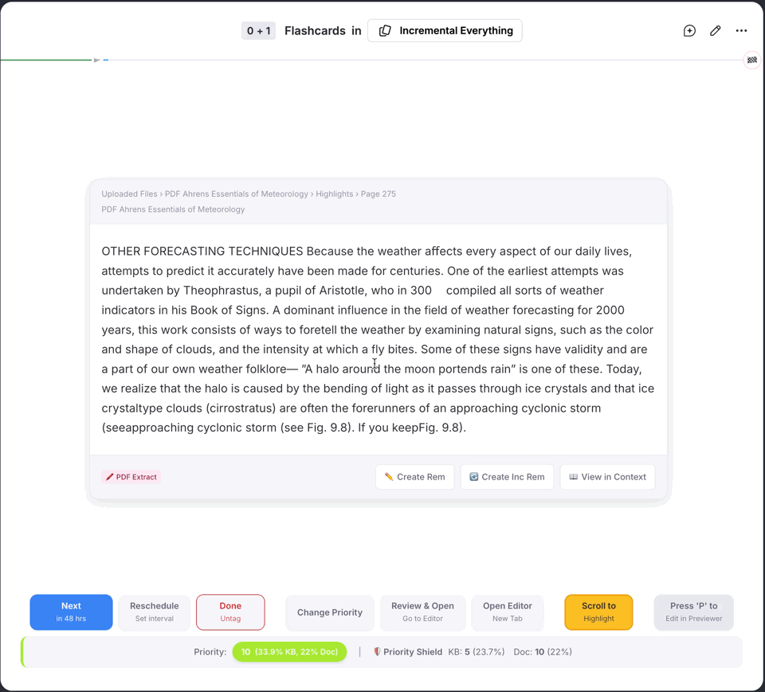{ width="600" }

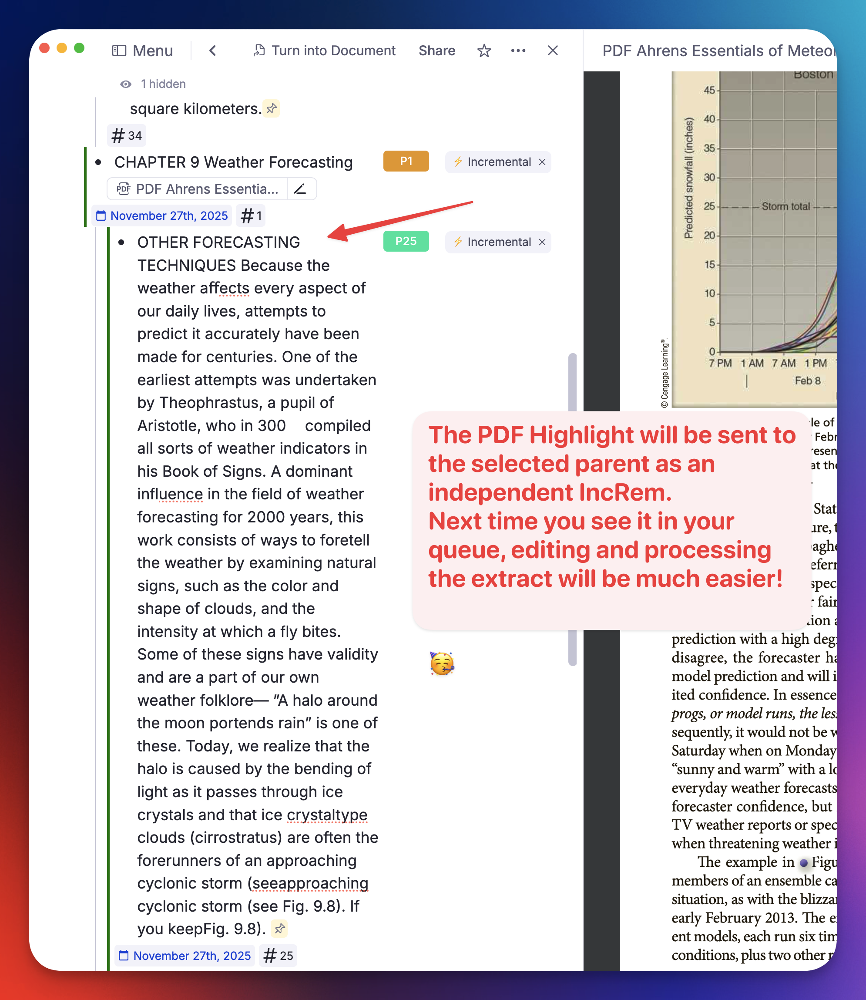{ width="600" }


### Priority Dialog Redesign
- Visual priority slider with unified badges
- Keeps the direct input field for typing priority values
- Relative priority for slider color feedback
- Improved UI and badge design

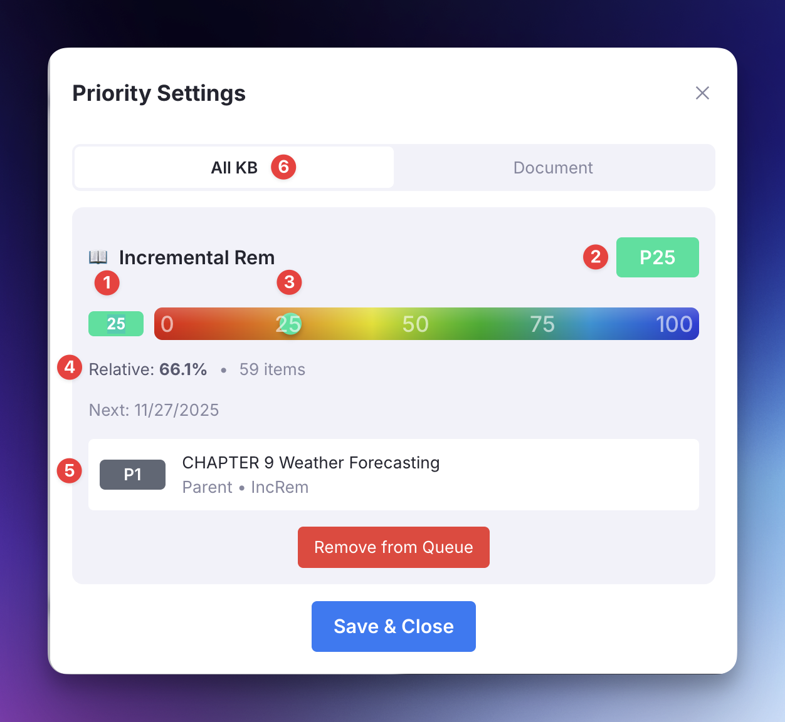{ width="500" }

- What is displays:
  - (1) [Absolute] Priority input field (selected when the dialog opens, so that you can just type the priority and press Enter to save)
  - (2) Priority Badge: the number shows the absolute priority; the **color code** provides visual indication of the **relative priority** (shown in 4)
  - (3) You can slide this button to select the priority. Pay attention that the **position on the slider** indicates **absolute priority**, but the **color** of the button indicates the **relative priority** (shown in 4)
  - (4) Relative priority of the IncRem (or flashcard), in the scope shown on 6, as well as the number of items that form this scope
  - (5) The priority of the closest ancestor, for reference. Shows the name of the closest ancestor, its relationship with the current rem (e.g. parent, grandparent), and if it is an IncRem or a flashcard.
  - (6) The **scope** to be used for the calculation of the **Relative Priority**. May be "All KB" or a Document. If you select the Document tab, it will display a document scope. You can then use the arrows to go up and down on the hierarchy, and see how the current rem is proportionally positioned in relation to each of these scopes.


### Incremental Rem List Improvements
- Redesigned with compact layout, sorting, and aligned columns
- Type badges with descriptive tooltips
- Time spent tracking displayed in Inc Rem list
- Redesigned "View All" with compact professional layout
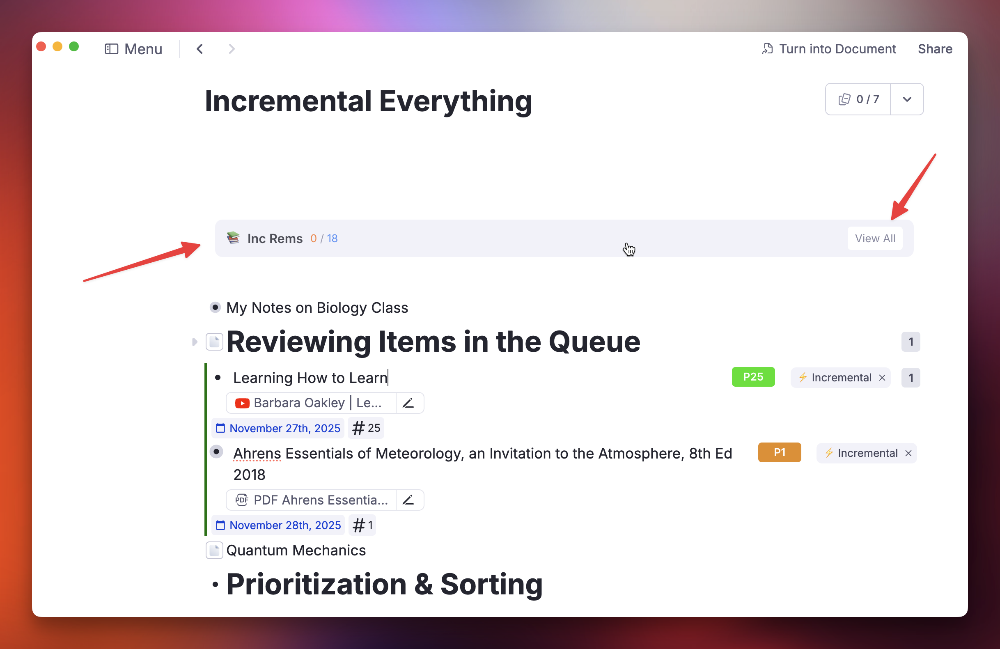{ width="700" }

{ width="700" }


### PDF Control Panel Enhancements
- Time spent tracking per session and total time spent in a PDF
- Review history and data persists even after rem is marked Done
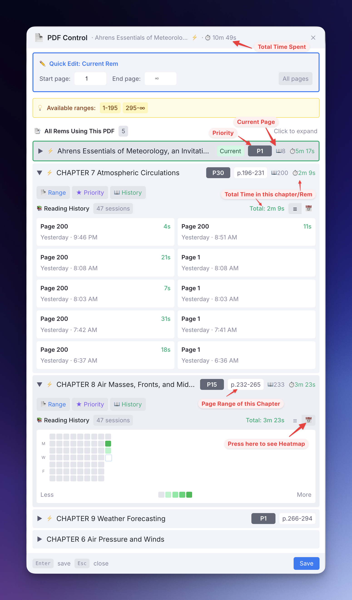{ width="500" }


### 🐛 Bug Fixes

- Fixed: PDF extracts now properly counted in document scope
- Fixed: Queue advances correctly when incremental powerup is removed
- Fixed: Review history no longer recorded twice with incorrect page
- Fixed: CSS properly imported in inc_rem widgets in an attempt to improve mobile styling
- Fixed: Show highlight name instead of PDF name in View In Context metadata
- Fixed: Context-independent function used for parent selector PDF search

### ⚙️ UI/UX Improvements

- Clickable breadcrumbs in PDF Reader for easy navigation
- Modernized queue buttons with dark mode support
- Green left border for IncRem indicator (changed from blue to avoid confusion with portals)
- Now uses RemNote CSS variables throughout for consistent theming:
  - Answer buttons
  - PDF control panel
  - IsolatedCardViewer

### 🔧 Refactoring

- Extracted reusable components: Breadcrumb, StatBadge, IncRemTable
- Consolidated editing state in page-range widget
- Extracted shared incRem helper functions and formatCountdown utility
- Improved page-range.tsx with component extraction and cleanup
- Uses tracker for incremental rems with fixed priority badge colors


## v0.2.32 - November 25, 2025

### 🚀 **New Features & Improvements**
* **PDF Time Tracking:** The PDF Control Panel now displays the time spent in each session and the total review time for the document.

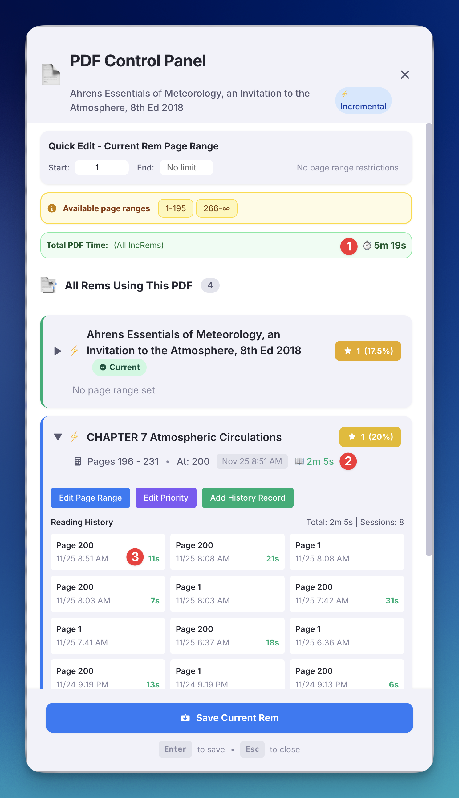{ width="550" }


{ width="550" }


* **Persistent Reading Stats:** Reading statistics and history are now visible for all Rems associated with a PDF, even after they have been marked as "Done" (untagged).

{ width="600" }


### 🐛 **Bug Fixes**
* **Fixed History Duplication:** Resolved an issue where history entries were duplicated on every page turn. History is now saved correctly only when leaving the card.
* **Queue Stability Fix:** Fixed a bug where removing the `Incremental` powerup from the current item would break the queue. The queue now detects this change and automatically advances to the next item.

## v0.2.30 - November 22, 2025

### Improvements

- Added a blue left border to Incremental Rems, to make it easier to spot your "extracts" among other rems (if you prefer, you can disable this in your settings).

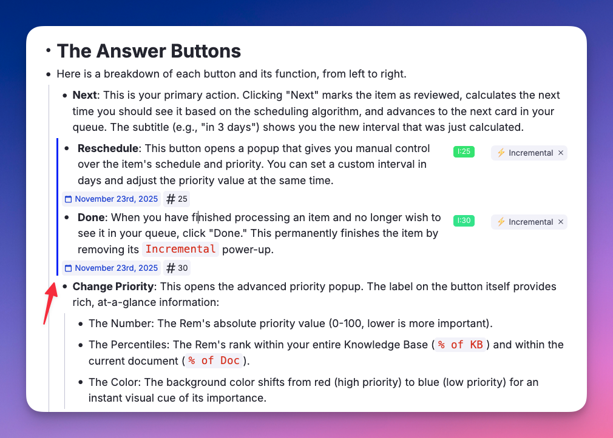{ width="750" }

## v0.2.29 - November 18, 2025

### 🐛 Bug Fixes & Improvements
(thanks to [@randygrok](https://github.com/randygrok) )

- Fixed PDF highlights and extracts not being counted in incremental rem scopes.

## v0.2.28 - November 17, 2025

### ✨ Main view for incremental rems with filtering and sorting 
(thanks to [@randygrok](https://github.com/randygrok) )

- New comprehensive main view widget for managing incremental rems
- Advanced filtering by status (all/due/scheduled), priority range, and text search
- Sorting by priority, due date, or review count with ascending/descending toggle
- "View All" button added to counter widget with keyboard shortcut (Opt+Shift+I)
- Auto-close popup when clicking on a rem item

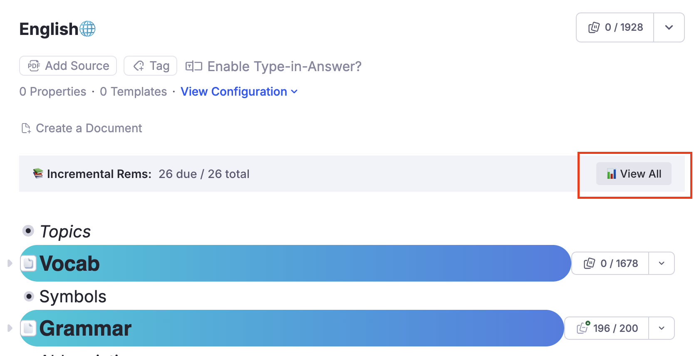{ width="700" }

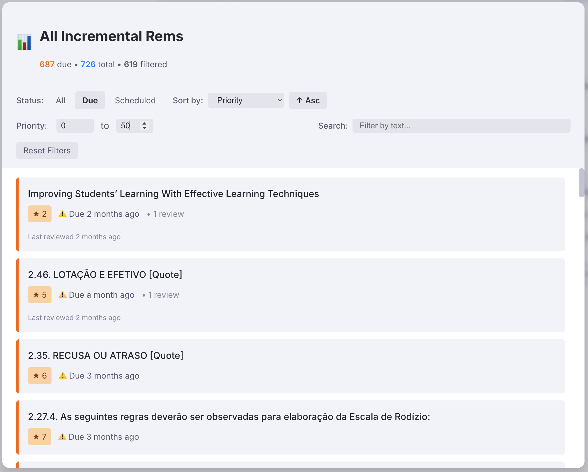{ width="800" }


## v0.2.27 - November 15, 2025

### ✨ PDF Control Panel improvements 
(thanks to [@randygrok](https://github.com/randygrok) )
- Modernized PDF Control Panel UI
- Added menu item in PDF viewer (Document Menu) for direct access to control panel (3-dot icon at the top-right of Documents)
- Replaced hardcoded colors with RemNote CSS variables for theme consistency

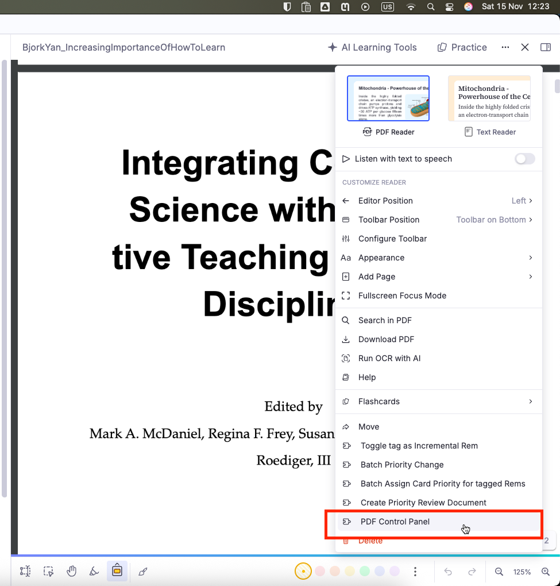{ width="700" }


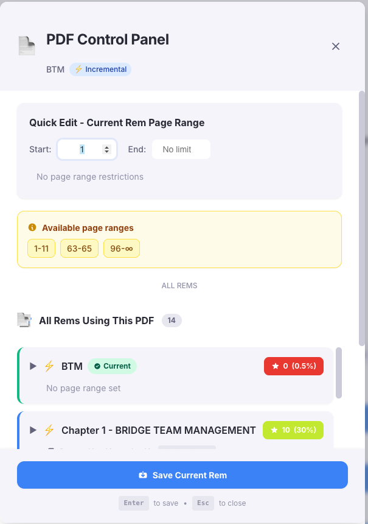{ width="500" }


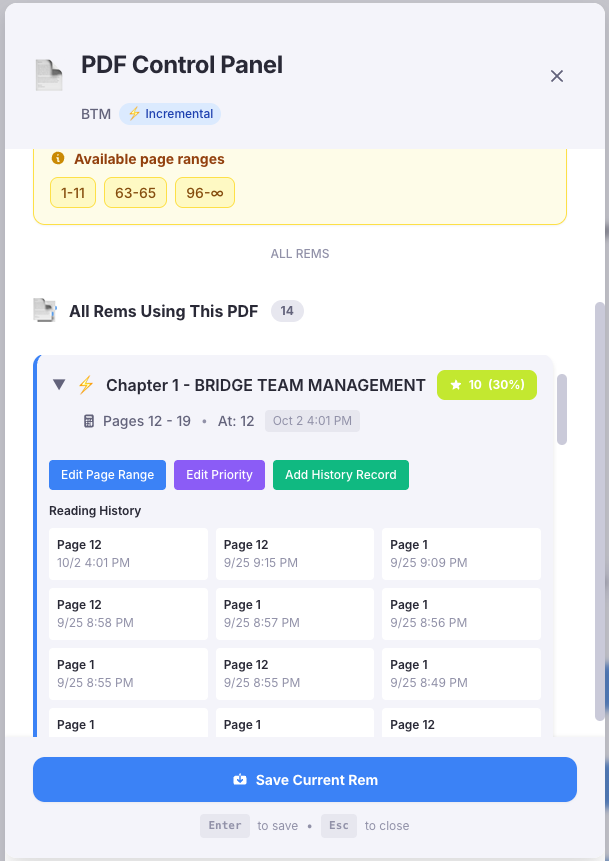{ width="500" }


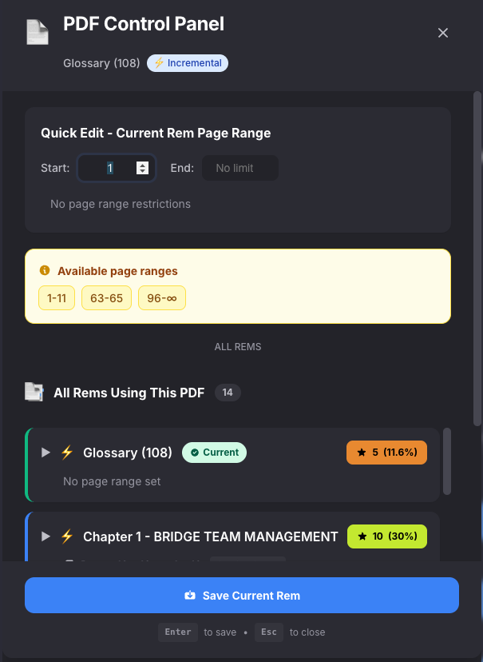{ width="500" }


## v0.2.26 - November 15, 2025

### ✨ New Widgets (thanks to [@randygrok](https://github.com/randygrok) ) 

- Added a document-scoped counter widget that displays due/total incremental rems for the current document

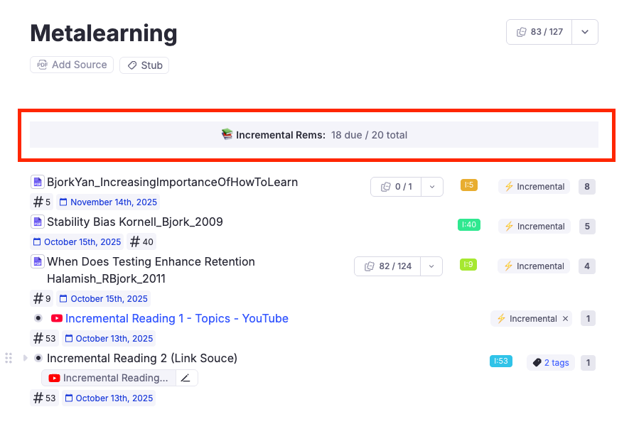{ width="700" }


- Added a clickable popup that shows a detailed list of all incremental rems with their status, priority, and review history

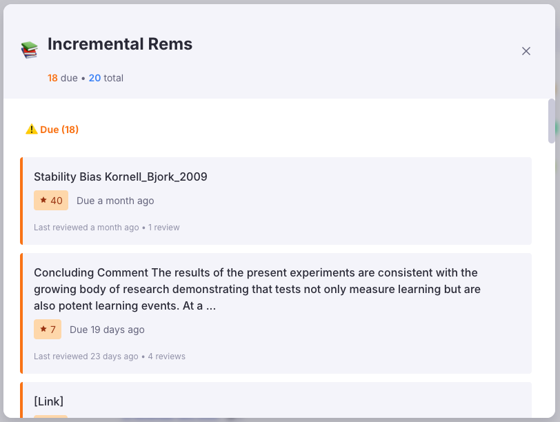{ width="600" }


## v0.2.24 - November 14, 2025

### 🐛 Bug Fixes & Improvements

- Optimized priority widget loading and ensure proper IncRem initialization (thanks to [@randygrok](https://github.com/randygrok) )

## v0.2.23 - November 13, 2025

- Reorganized code structure with better module boundaries (thanks to [@randygrok](https://github.com/randygrok) )


## v0.2.22 - November 10, 2025

- Improved Closest Ancestor info in the Priority widget (corrected logic and improved styling).

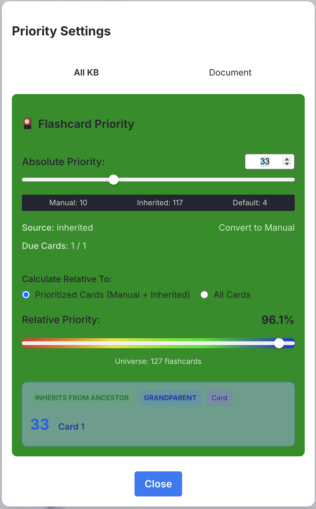{ width="350" }


## v0.2.21 - November 10, 2025

- Major code refactor (thanks to [@randygrok](https://github.com/randygrok) )

## v0.2.20 - November 8, 2025

### 🐛 Bug Fix

- Fixed race condition preventing IncRems from displaying in queues empty of flashcards. (Thanks to [@randygrok](https://github.com/randygrok) )

## v0.2.19 - November 8, 2025

### Improvement: Visual feedback for Incremental PDF Highlights

- Toggle PDF highlights incremental now turn the highlights **blue** *(or other user-configured setting)* when *tagged* and **yellow** when *untagged*.
- Obs: you would have to adopt this convention (blue highlights [or your configured color] are incremental; yellow highlights are non incremental).


#### Available Colors
Users can choose from 5 highlight colors:
- 🔴 Red
- 🟠 Orange
- 🟢 Green
- 🔵 Blue (default)
- 🟣 Purple

#### Behavior
- **Toggling ON (Adding Incremental tag):** Uses the color selected in settings
- **Toggling OFF (Removing Incremental tag):** Always resets to Yellow
- **Default:** If no setting is configured, defaults to Blue


## v0.2.17 - November 7, 2025

### New Feature (Execute IncRem Repetition): Review Incremental Rems Directly in the Editor

You can now review Incremental Rems without entering the queue! Use the new command **"Execute Incremental Rem Repetition (Review in Editor)" (Ctrl+Shift+J)** to register the processing of IncRems while working in the Editor.

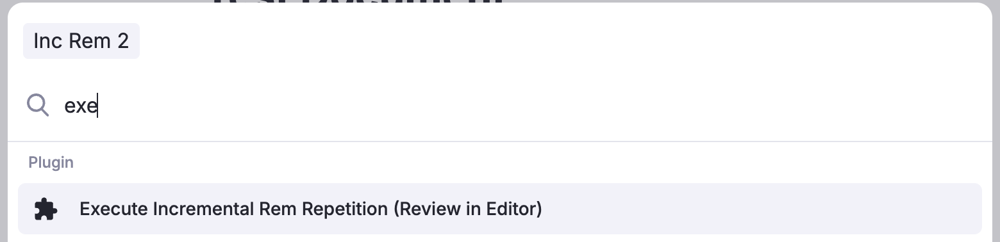{ width="650" }


#### Key Features:

**Manual Review Mode:**
- Focus on any IncRem and trigger the command
- Enter how long you spent reviewing (in minutes)
- Adjust the next review interval (the initially suggested one is that you would get if reviewing in the queue) and priority
- Click "Confirm" to save your review

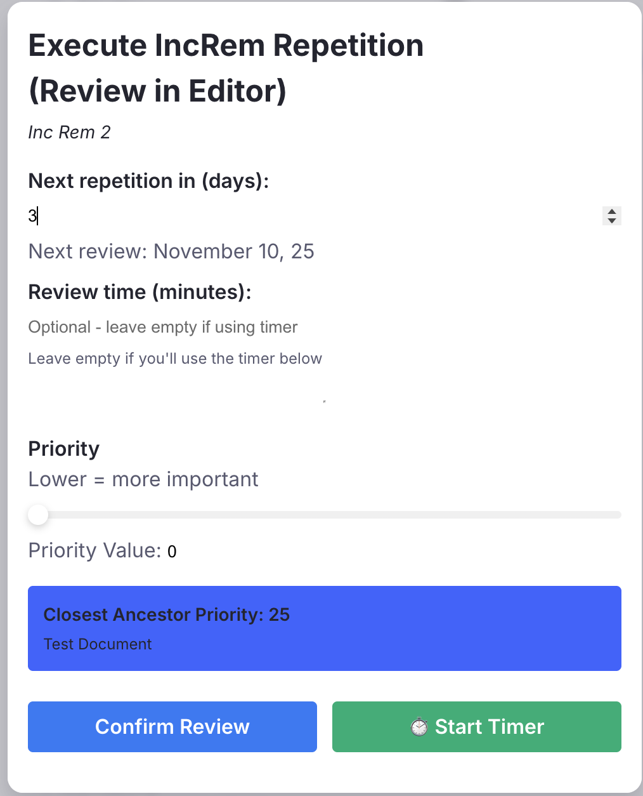{ width="400" }


**Timer Mode:**
- Click "Start Timer" to track your review time automatically
- A timer appears above your document while you work
- Click "End Review" when finished to save everything with precise timing

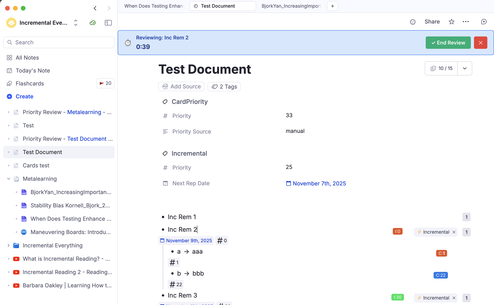{ width="800" }


#### Use Cases:

- **Deep work sessions:** Review a complex document in the editor with full editing capabilities, then log your review time when done
- **Flexible scheduling:** Manually set longer or shorter intervals based on how well you understood the content
- **Batch processing:** Quickly review multiple IncRems during a focused editor session without switching to queue mode
- **Interruption recovery:** If you exit the queue mid-session, you can still record reviews for IncRems you studied

All reviews are tracked with the same rich history data as queue reviews, including timing, interval, and scheduling metrics for your learning analytics.

### 🐛 Bug Fix #1: Priority Editor Widget Not Rendering for Inheritance-Only Rems

- Files: index.tsx (2 functions)
- Fix: Cache now includes Rems with cardPriority tag even without flashcards
- Impact: Inheritance priorities now work correctly

### 🐛 Bug Fix #2: Priority Value 0 Treated as Missing

- Files: cardPriority.ts, priority_editor.tsx, batch_card_priority.tsx
- Fix: Replaced || with ?? operator and proper NaN checks
- Impact: Priority 0 (highest priority) now works throughout the plugin


## v0.2.16 - November 4, 2025

### 🐛 Bug Fixes & Improvements

Solved card_priority_display widget Light Mode detection bug that prevented it from being shown on web browser and Android.

## v0.2.14 - November 4, 2025

### Performance Optimization: Pre-compute Card Priorities

**Improved efficiency of the Pre-compute Card Priorities command:**

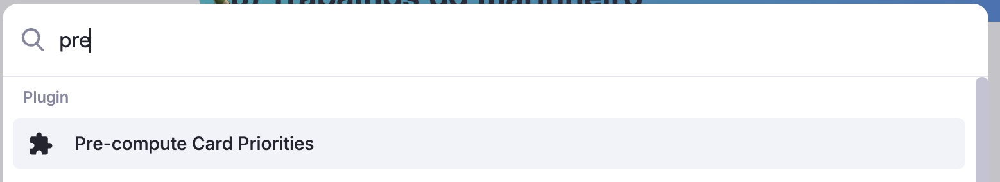{ width="700" }


- **Skip unnecessary updates**: Now only retags and updates `lastUpdated` timestamp when a card's priority value or source actually changes
- **Avoid redundant syncing**: Rems with unchanged priorities are skipped entirely, reducing RemNote sync and wiring operations and improving performance
- **Accurate reporting**: Fixed logic that was incorrectly detecting the presence of cardPriority tags, eliminating false "newly tagged" reports on subsequent runs
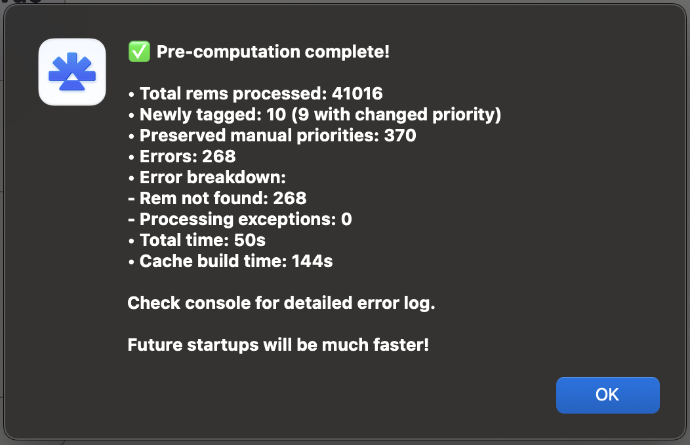{ width="500" }


**Result**: Now you can run pre-computation frequently to ensure the few priorities you have manually set in between will be inherited by many other cards, significantly improving the flashcard prioritization based on a few manual inputs that can be inherited by many other flashcards.

## v0.2.13 - November 3rd, 2025

### Web Browser Light Mode Detection 

No need to fear the **Full Mode** anymore! This implementation adds automatic Light Mode detection for web browsers, similar to the existing mobile detection feature. When users access RemNote through a web browser, the plugin will automatically use Light Mode for better performance and stability.

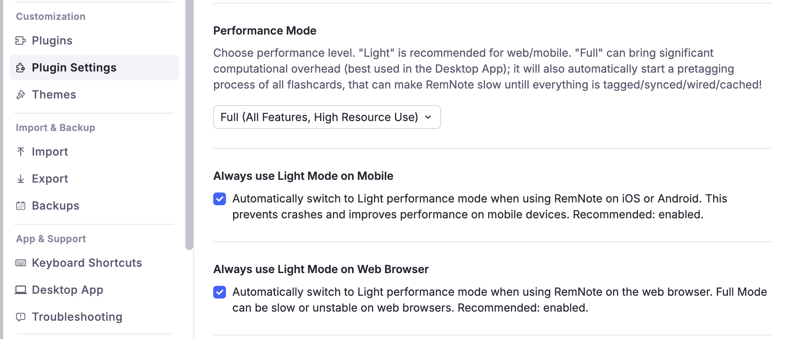{ width="800" }


## v0.2.12 - November 3rd, 2025

### Mobile Detection Fix - Session Storage Migration

**Problem**
When using RemNote on both mobile and desktop simultaneously, the mobile detection was syncing across devices via synced storage, causing the desktop app to incorrectly switch to Light Mode.

**Root Cause**
The `isMobileDeviceKey` was stored in **synced storage** (`plugin.storage.getSynced()`), which synchronizes data across all devices connected to the same RemNote account.

**Solution**
Change `isMobileDeviceKey` from **synced storage** to **session storage** (`plugin.storage.getSession()`), which is device-specific and doesn't sync. (File: `mobileUtils.ts`)

**Why This Works**

**Session Storage**
- **Device-specific**: Each device maintains its own value
- **No sync**: Data stays on the current device only
- **Perfect for device detection**: Mobile stays mobile, desktop stays desktop

**Synced Storage** (kept for `lastDetectedOSKey`)
- **Cross-device**: Values sync across all devices
- **Good for**: User preferences, history tracking
- **Not good for**: Device-specific hardware characteristics

**Impact**

✅ **Mobile device**: Will correctly detect as mobile and use Light Mode (if enabled)

✅ **Desktop device**: Will correctly detect as desktop and use Full Mode (if selected)

✅ **Concurrent usage**: Both can run simultaneously without interfering with each other

**Note on lastDetectedOSKey**

The `lastDetectedOSKey` intentionally remains in **synced storage** because:
- It tracks OS history across devices for comparison
- Used for the "switched from mobile to desktop" detection message
- Doesn't affect the actual mode determination, only informational toasts


## v0.2.11 - November 3rd, 2025 

### Summary of 🐛 Bug Fixes & Improvements
- **PDF Viewer and Extract Viewer:** metadata section statistics now do not block the UI. For long documents, the viewer will show the PDF/Document immediately, and when the stats calculation is finished, the Metadata section updates to show the statistics.
- **Card Priority Display Widget** in the queue is now clickable. In the mobile, tap over it to change card priority.
- **"Done (untag)" button** intelligently handle card priority inheritance when removing the Incremental tag from a Rem.

### "Done (untag)" button smart Card Priority Inheritance Implementation

#### Overview
Enhanced the "Done (untag)" button in the Incremental Everything Plugin to intelligently handle card priority inheritance when removing the Incremental tag from a Rem.

#### Problem Solved
When removing the Incremental tag from a Rem, descendant flashcards could lose their priority reference for inheritance. This implementation ensures that if the Rem or any of its descendants have flashcards, the Rem is automatically tagged with cardPriority to maintain the inheritance chain.

#### Implementation Details

**Key Features:**
1. **Smart Detection**: Only adds cardPriority tag when actually needed (Rem or descendants up to the 3rd level have flashcards)
2. **Early Termination**: Stops searching as soon as any flashcard is found for optimal performance
3. **Batch Processing**: Processes descendants in batches of 50 for better performance
4. **Reasonable Limits**: Checks up to 500 descendants to avoid performance issues with very large hierarchies
5. **Error Handling**: Fails gracefully without interrupting the Done action if errors occur

**Function: `handleCardPriorityInheritance`**

This function:
1. First checks if the Rem already has a cardPriority set (avoids redundant work)
2. Checks if the Rem itself has flashcards (immediate return if found)
3. Processes descendants in batches with early termination
4. Sets cardPriority with source='manual' using the IncRem's priority value

**Performance impact:**
- **Synchronous execution**: Despite the effort to reduce impact of performance, the new function can block the UI for a few seconds after pressing the Done button, while the check for flashcards in the descendants takes place.

**Benefits:**
1. **Minimal UI clutter**: Only adds cardPriority tags when necessary
2. **Inheritance Preservation**: Ensures flashcard priorities are maintained
3. **Backward Compatible**: Works with existing priority system

**Console Logging:**
The implementation includes console logging for debugging:
- `[Done Button] Set card priority X for Rem with direct flashcards` - when Rem has its own cards
- `[Done Button] Set card priority X for Rem with descendant flashcards` - when descendants have cards
- `[Done Button] No flashcards found in Rem or descendants, skipping card priority` - when no cards found
- `[Done Button] Error in handleCardPriorityInheritance:` - if any error occurs

**Files Modified:**
- `answer_buttons.tsx`: Added the smart card priority inheritance logic to the Done button
- `pdfUtils.ts`: Now getDescendantsToDepth function is exported.


## v0.2.10 - November 1st, 2025 

### New Feature: Reschedule Command

Added keyboard shortcut **Ctrl+J** (Windows and macOS) to quickly reschedule Incremental Rems. Works both in the queue (same as pressing the Reschedule button) and in the editor when focused on an Incremental Rem.

**Note:** This command only works with Incremental Rems, not regular flashcards.

## v0.2.9 - November 1st, 2025 - New Feature: Mobile Light Mode Auto-Switch 📱⚡

### What's New

Added a new setting **"Always use Light Mode on Mobile"** that automatically optimizes performance when using RemNote on mobile devices (iOS/Android).

### Why This Matters

The Full performance mode can be resource-intensive and potentially cause crashes on mobile devices. This new feature automatically switches to Light Mode when you open RemNote on your phone or tablet, ensuring a stable and smooth experience.

### How It Works

- **Automatic Detection**: The plugin detects your device's operating system on startup
- **Smart Switching**: When on mobile (iOS/Android), the plugin automatically uses Light Mode regardless of your performance mode setting
- **Desktop Freedom**: On desktop (macOS/Windows/Linux), your chosen performance mode setting is always respected
- **Toast Notifications**: You'll see a friendly notification showing what was detected and which mode is active

### Settings

**Location**: Plugin Settings → "Always use Light Mode on Mobile"

- **Default**: Enabled (recommended)
- **When Enabled**: Light Mode is automatically used on mobile devices for stability
- **When Disabled**: Your performance mode setting applies on all devices (use with caution on mobile)

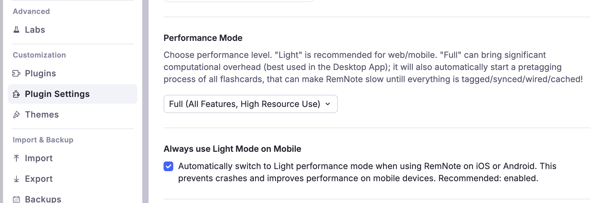{ width="800" }


### Benefits

✅ **Prevents mobile crashes** - No more app freezes or force closes on phones/tablets  
✅ **Seamless experience** - Works automatically without manual intervention  
✅ **Device-aware** - Remembers which device you're on  
✅ **User control** - Can be disabled if you want to use Full Mode on mobile (not recommended)

### Toast Examples

When you open the plugin, you'll see messages like:
- 📱 `"iOS detected: using Light Mode (Full Mode disabled on mobile for stability)"`
- 💻 `"macOS detected: running in Full Mode"`
- ⚠️ `"Android detected: Full Mode can crash mobile. Consider enabling 'Always use Light Mode on mobile' in settings"`

### Technical Details

The plugin now tracks your device type and automatically adjusts which features run:
- **Light Mode**: Essential features only, fast and stable
- **Full Mode Override**: When on mobile with auto-switch enabled, intensive features like priority shields and relative percentiles are disabled for performance

This ensures RemNote remains responsive and stable on all devices! 🎉

## v0.2.8 - October 31, 2025

### 🐛 Bug Fixes & Improvements

-  In reader metadata page control section, added self-check for IncRem (now PDF directly tagged Incremental will also show page controls)
-  Reader breadcrumb and metadata sections now adapt to dark and light modes.
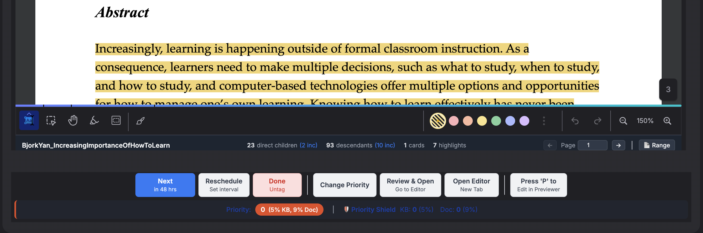{ width="800" }


## v0.2.5 - October 30, 2025

- **Light Mode** in now default performance mode. It keeps manual priority tools for flashcards, while all the automatic, performance-intensive background work (including pre-tagging flashcards) are reserved for the "Full Mode".
- **Light Mode** enhancements: Event Listeners AppEvents.QueueCompleteCard and AppEvents.GlobalRemChanged are now conditional, to ensure that no automatic caching or priority assignment happens in "Light Mode".


## v0.2.4 - October 29, 2025 -  Priority Shield Enhancement - Universe Size Tracking

### 🎯 Overview
Enhanced the Priority Shield system to display the total universe size (count of items) being tracked, providing crucial context for understanding priority changes over time.

### 📊 What's New

#### **Priority Shield Graph Improvements**
- **Added Universe Size Tracking**: A third metric line (dashed) now displays the total count of IncRems/Cards in each scope
- **Triple Y-Axis Display**: 
  - Left axis: Absolute Priority (0-100)
  - Right axis: Relative Priority Percentile (0-100%)
  - Far-right axis: Universe Size (with smart formatting: "1.5k" for 1500+ items)
- **Enhanced Tooltips**: Custom tooltips now clearly show all three values when hovering over data points

#### **Data Tracking Enhancements**
- **Universe Size History**: Now stores the total count of items alongside priority shield values
- **Comprehensive Scope Tracking**: 
  - Knowledge Base level: Total IncRems and Cards across entire KB
  - Document level: Total items within document/folder scopes reviewed in a given day
  - Priority Review Documents: Correctly tracks original document scope, not the review document itself

### 💡 Why This Matters

#### **Better Context for Priority Changes**
Users can now distinguish:
- **Genuine Progress**: Priority shield improving due to processing high-priority items
- **Progress hidden by the Universe Shrinkage of IncRems**: Percentiles remain low due to processed IncRems (and therefore untagged) being removed from the IncRem queue
- **Queue Growth**: Understanding how new content affects relative priorities

#### **Workflow Insights**
The universe size line reveals:
- **Processing Efficiency of IncRems**: Decreasing universe = successful completion and untagging of IncRems
- **Content Inflow Rate**: Increasing universe = new material being added
- **Optimal Queue Size**: Helps users find their sustainable learning capacity

### 🔧 Technical Changes

#### **Modified Files**
1. **`priority_shield_graph.tsx`**
   - Added universe size as third line in all charts
   - Implemented three Y-axes layout
   - Added smart number formatting for large values
   - Fixed container scrolling issues

2. **`priority_shield.ts`**
   - Extended `PriorityShieldStatus` and `CardPriorityShieldStatus` interfaces
   - Added `universeSize` field tracking
   - Returns universe size even when no items are due

3. **`index.tsx`**
   - Updated QueueExit event handler to save universe sizes:
     - KB IncRem: `allRems.length`
     - Doc IncRem: `scopedRems.length`
     - KB Card: `allCardInfos.length`
     - Doc Card: `docCardInfos.length`

### 📈 Visual Examples

The graph now shows three synchronized metrics:
- **Solid lines**: Absolute and Relative Priority (existing metrics)
- **Dashed line**: Universe Size (new metric)
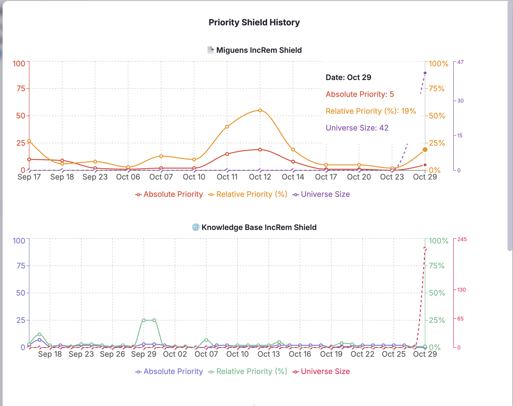{ width="800" }


Example insights from the new visualization:
- "Priority dropped from 10% to 5%, but universe size halved" → Good progress, not regression
- "Priority stable at 4%, universe growing" → Need to increase review volume or reduce inflow
- "Universe size stable, priority improving" → Workflow is optimally balanced

### 🎓 User Guidance

New description added to help users understand:
- **Universe Size Changes**: How item removal/addition affects percentiles
- **Priority Shield Interpretation**: Context-aware understanding of shield values
- **Workflow Optimization**: Using universe size trends to adjust learning strategies

### ⚙️ Backward Compatibility
- Fully backward compatible with existing data
- Old history entries without universe size display as 0 or handle gracefully
- No migration required

---

*This enhancement provides users with a complete picture of their learning queue dynamics, enabling more informed decisions about content management and review strategies in the Incremental Reading workflow.*


### Other Improvements

- Priority widget in Editor can now be set to show for both IncRem and Cards, only for IncRem or be disabled.
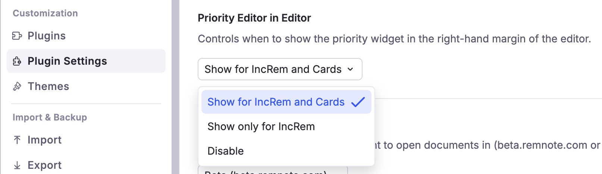{ width="600" }


## v0.2.3 - October 29, 2025 - Card Priority System Enhancements

This update introduces powerful new tools for managing card priorities in bulk and provides clearer visual feedback in the editor.

### ✨ New Widget: Batch Card Priority Assignment by Tag


* You can now assign `CardPriority` to hundreds of rems at once, based on a tag.
* **Use Case:** If you used to use tags to prioritize your cards (before Incremental Everything prioritization system), like `#important!`, `#P1`, `#P2`, `#P3`, you can convert your old and more primitive system to the new one in bulk.
* Access by focusing a tag rem and using the command `Batch Assign Card Priority for tagged rems` (or via the Document Menu).
* **Features:**
    * Assign random priorities within a specific range (e.g., 20-40).
    * Intelligently handles IncRems, allowing you to use their existing IncRem priority as their Card Priority.
    * Safely updates rems with existing `manual` priorities by requiring explicit "Overwrite" confirmation.

{ width="450" }


### 🎨 Improvements

* **Priority Editor Widget: Manual Priority Feedback**
    * The `priority_editor` (the small widget in the right-hand editor margin) now provides immediate visual feedback.
    * The priority number for **Cards** will appear **bold** if its source is `"manual"`, making it easy to distinguish manually-set priorities from inherited or default ones.

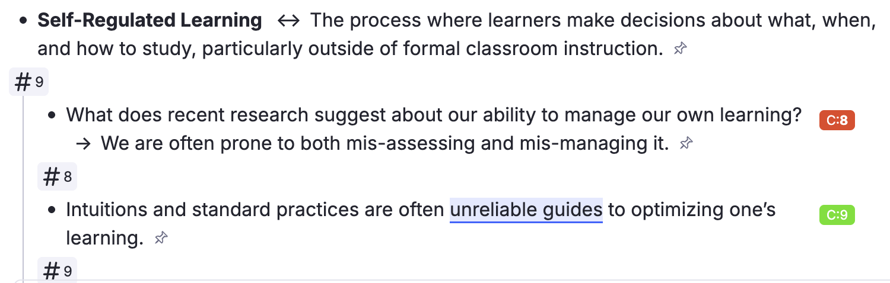{ width="600" }


## v0.2.2 - October 28, 2025

### 🐛 Bug Fixes & Improvements

- Added a plugin setting to hide cardPriority tags in the editor to reduce clutter, as the priority_editor widget already gives visual feedback.
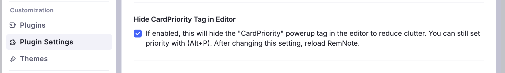{ width="700" }

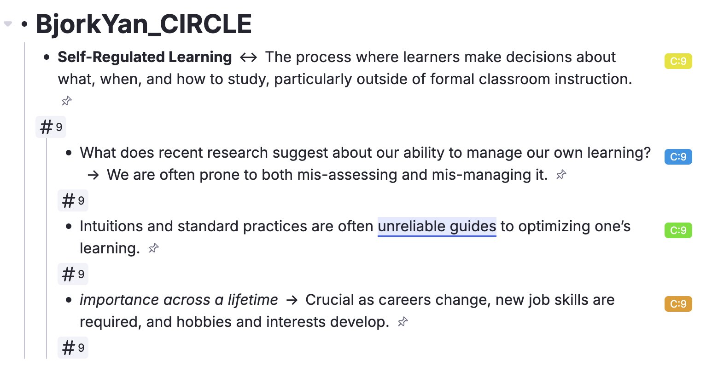{ width="700" }

- Corrected IncRem counter CSS injection and adapted it to the Light mode.


## v0.2.1 - October 28, 2025

### 🐛 Bug Fixes & Improvements

- Now the Priority Review Document creator popup widget is visible properly when in dark mode.
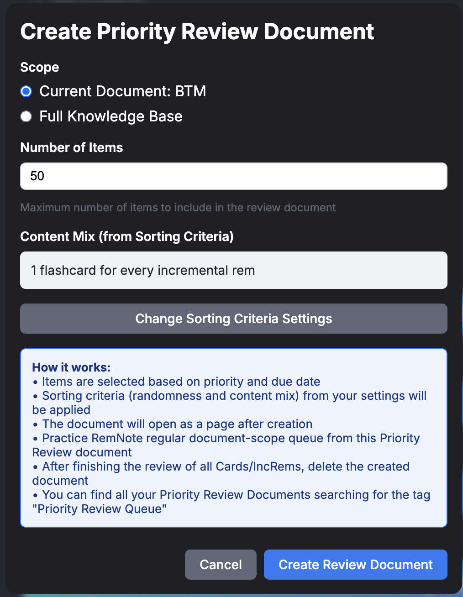{ width="400" }


## v0.2.0 - October 28, 2025

### 🎯 Major Feature: Flashcard Priority System

Implemented a comprehensive priority management system for flashcards, bringing the same level of control to spaced repetition that already exists for Incremental Reading.

#### Core Capabilities

- **Manual Priority Assignment**: Set priorities (0-100) on any flashcard Rem through an integrated priority widget
- **Automatic Inheritance**: Child flashcards inherit priorities from parent Rems (both from IncRem priorities and flashcard priorities)
- **Priority Sources**: Three priority types tracked:
  - **Manual**: Explicitly set by user
  - **Inherited**: Automatically inherited from ancestors
  - **Default**: Unset (priority 50)
- **Dual Priority Management**: Rems can have both IncRem priority and flashcard priority independently, with smart conflict resolution UI
- **Relative Priority Percentiles**: View each flashcard's ranking within its scope (document or full KB)
- **Priority Shield for Flashcards**: Track your capacity to keep up with high-priority flashcard reviews
- **Comprehensive Caching**: High-performance system pre-calculates all flashcard priorities and due counts at queue start

#### Priority Widget Enhancements

The priority widget now handles both Incremental Rems and flashcards:

- **Unified Interface**: Single widget manages both IncRem and flashcard priorities
- **Smart Sections**: Shows relevant sections based on content type:
  - IncRem section for Incremental Rems
  - Flashcard section for Rems with cards
  - Inheritance section for setting priorities on parent Rems
- **Context-Aware Scope**: 
  - Calculate relative priorities against document scope or entire KB
  - Automatic scope detection when in Priority Review Documents (uses original document scope)
  - Fast cache utilization when in queue sessions
- **Conflict Resolution**: When IncRem and flashcard priorities differ, offers clear options:
  - Save both as-is
  - Sync flashcard priority to IncRem priority
  - Sync IncRem priority to flashcard priority
- **Inheritance Visualization**: Shows closest ancestor with priority and its source type
- **Universe Statistics**: Display total items in scope and breakdown by priority source

#### Priority Shield for Flashcards

Track your progress on high-priority flashcard reviews:

- **KB-Level Shield**: Shows highest missed priority across all flashcards
- **Document-Level Shield**: Shows highest missed priority within document scope
- **Historical Tracking**: Graph displays both absolute priority and percentile over time
- **Dual Graphs**: Separate visualizations for IncRem shields and flashcard shields
- **Session Awareness**: Updates automatically as you review items

#### Technical Implementation

- **Global Cache System**: `allCardPriorityInfoKey` stores all flashcard priorities in session
- **Queue Session Cache**: Pre-calculated percentiles for ultra-fast lookups during review
- **Incremental Updates**: Light cache updates during review, bulk refresh on queue exit
- **Priority Inheritance Algorithm**: Traverses ancestor tree to find closest priority source
- Flashcards start with inherited priorities from their ancestors, or default priority (the one specified in your plugin settings, default: 50), until manually set
- Users shall use the "Pre-compute Card Priorities" command regularly to update the automatically added card priorities (by inheritance, of default if there is no ancestor to inherit priority from)
- **Comprehensive Scope Integration**: Flashcard priorities respect the same scope calculation as IncRems

#### Access Points

- **Keyboard Shortcut**: `Alt+P` to open priority widget on any Rem
- **Queue Widget**: Opens automatically when clicking priority indicators in queue
- **Command Palette**: "Set Priority" command

#### Performance Considerations

⚠️ **Important**: This feature adds significant computational overhead:
- Initial cache building: may take more than 2 min on plugin load (depending on KB size) [in the Desktop App, for a KB with 41k rems with cards, it took 2 min 15 sec]
- Queue entry calculations: May be up to 25 seconds for large documents
- Memory usage: Maintains cache of all flashcard Rems with priorities

**Recommended**: Use Desktop App for best performance. Browser version may experience lag, especially on large knowledge bases (>10,000 flashcards).

---

### 🎯 New Feature: Priority Review Document

Create custom review sessions that combine flashcards and Incremental Reading items based on their priorities, ensuring you review the most important content first.

#### Key Capabilities

- **Create Mixed Review Documents**: Generate documents containing both flashcards and Incremental Rems (IncRems) sorted by priority
- **Flexible Scope Selection**: Review from a specific document/folder or your entire knowledge base
- **Customizable Content Mix**: Control the ratio of flashcards to IncRems (e.g., 6 flashcards per IncRem, only flashcards, or only IncRems)
- **Priority-Based Selection**: Items are selected using the same sorting criteria and randomness settings as your regular queue
- **Rem Reference-Based Review**: All items appear as rem references in the review document
- **Tagged for Easy Management**: Documents are tagged with "Priority Review Queue" for easy finding and bulk management

#### Use Cases

- **Overwhelmed Queues**: When you have thousands of due items, create a manageable review session of your top 50-100 priority items
- **Focused Study Sessions**: Review high-priority content from a specific course or project without distractions
- **Priority Triage**: Ensure critical information gets reviewed even when you can't complete your entire queue (the norm in Incremental Reading workflows)
- **Document-Specific Practice**: Review due items from a particular document while respecting their priorities
- **Mixed Learning Sessions**: Alternate between passive reading (IncRems) and active recall (flashcards) in a single session

#### Access Points

- **Keyboard Shortcut**: `Opt+Shift+R` (Mac) / `Alt+Shift+R` (Windows/Linux) to create from current document
- **Document Menu**: use the 3-dots menu at the top right of any document to create a review from its scope
- **Queue Menu**: Create while in queue to use current queue scope (using the 3-dots menu)
- **Command Palette**: "Create Priority Review Document" command

#### Priority Review Document Workflow

1. Navigate to a document or focus on a rem
2. Create a Priority Review Document (via shortcut or menu)
3. Configure:
   - **Scope**: Current document, parent folder, or full KB
   - **Item Count**: Number of items to include (e.g., 50, 100)
   - **Card Ratio** and **Sorting Criteria**: Mix of flashcards to IncRems (e.g., 6:1, cards only, IncRems only) and priority randomness are inherited from your queue randomness settings
4. Review the generated document as a regular RemNote document queue
5. Priority Widget and Priority Shields reflect the **original document scope**, not the review document
6. Delete the review document after completion (or keep for later)
7. Priority history and statistics are preserved under the original scope

#### 🔧 Technical Implementation

##### Smart Scope Detection
Priority Review Documents maintain awareness of their original source:
- **Rem Reference in Title**: Document titles contain actual rem references to their source scope
- **Dual Scope System**: 
  - Item selection uses Priority Review Document contents
  - Priority calculations use original document scope
- **Session Storage**: `originalScopeId` tracks the source document throughout the session

##### Accurate Priority Calculations
When reviewing through a Priority Review Document:
- **Priority Widget**: Displays relative priorities against original document, not the filtered review document
- **Priority Shields**: Calculate highest missed priorities from original scope
- **Scope Indicator**: Visual indicator in the Priority popup shows "Scope: [Original Document] (Original Document)"
- **History Tracking**: All priority shield history saved under original document ID

##### Comprehensive Scope Calculation
Reviews include all relevant content from the source:
- Document descendants
- Portal contents  
- Table Views 
- Referenced rems (backlinks to scope rem)
- Sources (of scope rem)
- Folder queue items

This ensures Priority Review Documents capture the full semantic context of the source material.

##### Performance Optimizations
- **Pre-calculated Cache**: Queue entry builds session cache with percentiles for instant lookups
- **Fast Path**: Subsequent priority widget opens use cached data
- **Fallback Path**: Comprehensive scope recalculated only when cache unavailable

#### Why This Matters

Priority Review Documents solve the fundamental challenge of Incremental Reading: **information overflow**. When you have thousands of due items, you need a way to guarantee that your most important material gets reviewed first. This feature makes that guarantee tangible by creating focused, priority-based review sessions that respect both your time constraints and learning priorities.

---

### 🎯 Comprehensive Scope System

#### Overview
Implemented a **comprehensive scope calculation system** that significantly expands what content is included when studying a document queue or generating a Priority Review Document. The plugin now captures all semantically related content, not just hierarchical descendants.

#### What's Included in Document Scope

When you study a document, the queue now includes (IncRems only for regular RemNote queue; IncRems + Flashcards for Priority Review Documents):

1. **Hierarchical Descendants** - All child rems (as before)
2. **Document/Portal Context** - Rems appearing in portals, tables, and search portals within the document
3. **Folder Queue Rems** - Content from RemNote's native folder queue system
4. **Sources** - Source documents (e.g., PDFs) attached to the scope document
5. **Backlinks** - Rems that reference this document (with smart filtering to exclude property values)

#### What Changed

##### Updated Components:
- **QueueEnter Event Handler** - Builds comprehensive scope cache at queue start for ultra-fast lookups
- **Priority Widget** - Uses comprehensive scope for accurate relative priority calculations
- **Card Priority Shield** and **IncRem Priority Shield** - Display shield values based on comprehensive scope
- **Priority Review Document Generator** - Creates review documents with comprehensive scope

##### Performance Optimization:
- Scope is calculated **once** at queue start and cached in session storage
- All subsequent lookups use the pre-calculated cache for instant performance
- Cache includes pre-calculated percentiles for both Incremental Rems and Flashcards

#### Why This Matters

**Before:** Studying a literature note would only show IncRems (+ flashcards in Priority Review Documents) from that note's children.

**After:** Studying a literature note now includes IncRems (+ flashcards in Priority Review Documents):
- From the note itself and its children
- From source papers referenced in the note  
- From notes that reference this literature note
- Appearing in any portals/tables within the note
- From the document's folder queue

This creates a much more **contextually complete** study session, especially useful for:
- 📚 Literature review documents with many source citations
- 🗂️ Index documents that aggregate content via portals
- 🔗 Hub notes with extensive backlinks
- 📊 Documents using tables and search portals to organize content

#### Technical Implementation

The comprehensive scope uses RemNote SDK methods:
- `scopeRem.getDescendants()` - Hierarchical children
- `scopeRem.allRemInDocumentOrPortal()` - Portal/table context
- `scopeRem.allRemInFolderQueue()` - Folder queue rems
- `scopeRem.getSources()` - Sources (of the scope document only; does not include sources of descendants)
- `scopeRem.remsReferencingThis()` - Backlinks (with property filtering; to scope document only; does not include backlinks to descendants)

All sources are deduplicated and stored in `currentScopeRemIdsKey` session storage for consistent access across the plugin.

#### User Experience

No configuration needed - the comprehensive scope is **automatic**! When you:
- Enter a document queue → Scope is calculated and cached
- View priority in queue → Uses fast cached scope
- Check priority shield → Reflects comprehensive scope
- Create Priority Review Document → Includes comprehensive scope

The plugin now provides a more **complete and intelligent** view of what content is truly related to the document you're studying.

---

### 🐛 Bug Fixes & Improvements

- Fixed register powerup error of version 0.1.7
- **Priority Widget Scope Management**: Fixed scope initialization to correctly handle Priority Review Documents
- **Cache Consistency**: Improved cache synchronization between queue sessions and widget interactions
- **Memory Management**: Optimized cache storage to prevent memory leaks during long review sessions
- **Visual Feedback**: Added loading states and progress indicators for cache building operations
- **Error Handling**: Enhanced error recovery for malformed priority data and missing rem references

---

### ⚠️ Breaking Changes

None. This release is fully backward compatible with existing Incremental Rem priorities and workflows.

---

### 📝 Migration Notes

If upgrading from v0.1.x:
- Existing IncRem priorities are preserved
- Flashcards start with inherited priorities from their ancestors, or default priority (the one specified in your plugin settings, default: 50), until manually set
- Cache will build automatically on first plugin load (may take more than 2 min for large KB)
- No action required from users

---

### 🔮 Known Limitations

- **Performance**: Initial cache building can be slow on large knowledge bases (>10,000 flashcards)
- **Mobile Support**: Not optimized for mobile devices; use Desktop App for best experience
- **Browser Performance**: May experience lag in browser version with large KBs
- **Cache Invalidation**: Requires manual plugin reload if priorities changed outside of queue session


## v0.1.7 - October 27, 2025

### ✨ New Feature: **🚀 Introducing Batch Priority Change!**

This version introduces a powerful new widget for managing the priorities of multiple incremental Rems at once. This feature is designed to streamline your workflow, especially in large documents with many nested items. Now you can modify all incremental Rems under a specific parent with a single, unified interface. You can use it after a test to batch decrease priority of a document/branch, or when your interest for a given subject increases or decreases.

* **Access the widget in multiple ways:**
    * Via the **Command Palette** by searching for "Batch Priority Change".
    * Using the new keyboard shortcut `Option+Shift+P` (`opt+shift+p`).
    * From the **Document Menu** (`...` on a Rem) on any Rem to act on it and its descendants.
{ width="250" }
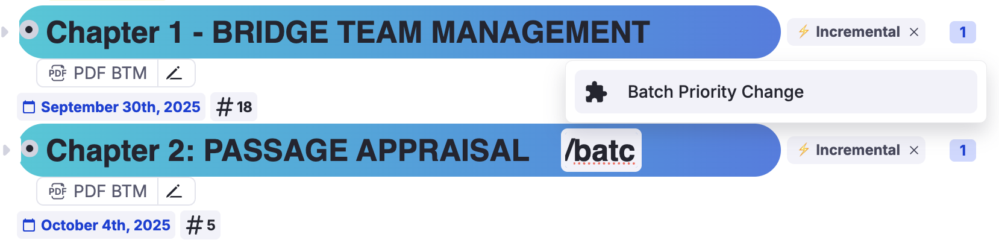{ width="800" }


* **Powerful Priority Operations:** Select a group of Rems and apply one of four bulk operations:
    * **Increase Priority**: Makes items more important by multiplying their priority value by a percentage.
    * **Decrease Priority**: Makes items less important.
    * **Spread Evenly**: Distributes priorities linearly across a range you define.
    * **Adjust Proportionally**: Remaps priorities to a new range while maintaining their relative spacing.

* **Advanced Table and Filtering:**
    * View all incremental Rems within a hierarchy in a single, interactive table.
    * See detailed information including current priority, percentile rank, type, next repetition date, and repetition count.
    * **Filter** your view by name, item type (e.g., Extract, PDF, YouTube), or a specific priority range.
    * **Sort** the table by any column to organize your Rems exactly how you need them.
    * Includes a "Preview Changes" mode to see the impact of your operations before committing and an "Export to CSV" option for external analysis.

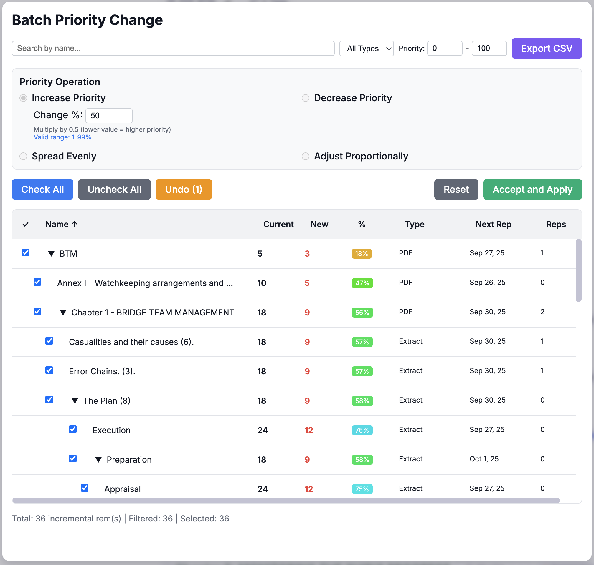{ width="800" }


### ✨ New Feature:  No Incremental Rem Mode (especially for mobile)

- **15-minute timer:** When activated, incremental rems are disabled for exactly 15 minutes
_ **Auto-cleanup:** The timer automatically clears itself when expired
- **Visual feedback:** Toast notifications inform the user when the timer is activated/cancelled
- **Manual cancel option:** Users can cancel the timer early via a command
- **Queue refresh:** The queue automatically updates when the timer is set or expires
- **Mobile-friendly:** Allows mobile users to focus on flashcard review without incremental rem editing

This solution effectively creates a temporary "flashcards-only" mode that's designed for mobile users who want to review without dealing with the complexities of incremental reading on a small screen.

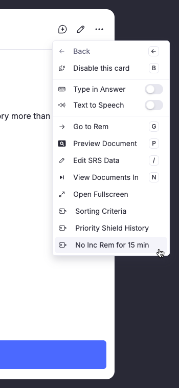{ width="300" }

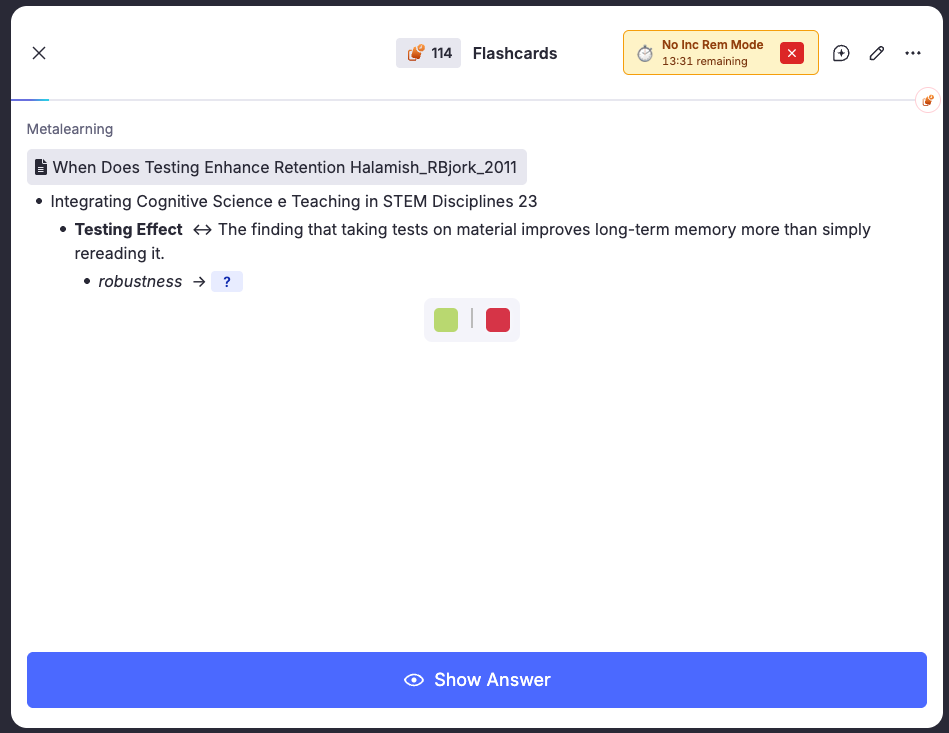{ width="800" }

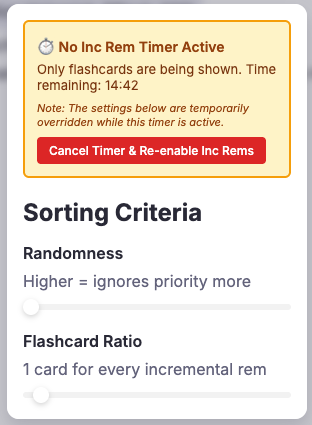{ width="312" }


### ⚙️ UI/UX Improvements for Answer Buttons and PDF Reader Metadata

#### Summary
Redesigned the answer buttons and PDF reader metadata section to improve visual hierarchy and user experience.

#### Changes Made

##### Answer Buttons (`answer_buttons.tsx`)
- **Improved visual hierarchy**: 
  - Primary actions (Next, Reschedule, Done) grouped together
  - Secondary actions separated by visual dividers
  - Color-coded buttons (blue primary, gray secondary, red destructive)
- **Enhanced priority display**: Combined priority badge and shield info into single compact bar with dynamic color visualization
- **Highlight button emphasis**: Added golden color scheme and pulse animation to "Scroll to Highlight" button for better visibility when reviewing highlights

##### PDF Reader Metadata (`Reader.tsx`)
- **Streamlined metadata bar**: 
  - Reduced padding (6px → 4px vertical)
  - Removed redundant "Incremental Rem" label
  - Prevented line wrapping with `flexWrap: 'nowrap'`
- **Fixed reading history**: Changed to record only one entry per reading session (on component unmount) instead of multiple entries during navigation
- **Improved page controls**: Fixed input field to properly track page changes in real-time

#### Visual Improvements
- More compact design saves ~60px of vertical space
- Cleaner, more professional appearance with consistent spacing
- Better accessibility with clear button labels and sublabels
- Responsive design maintains functionality on different screen sizes

#### Technical Improvements
- Fixed page tracking reliability by removing DOM detection methods
- Optimized reading history to prevent duplicate entries
- Improved component performance with proper React hooks usage

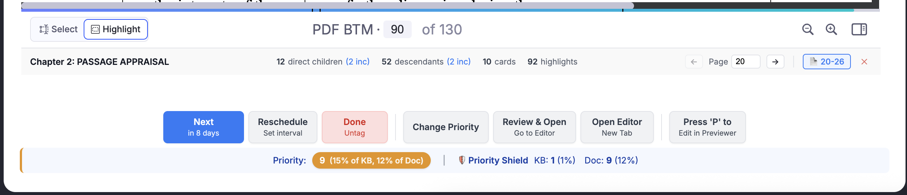{ width="1000" }


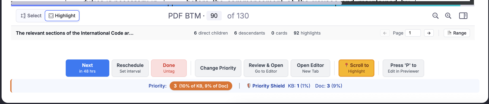{ width="1000" }


### Other minor improvements / bug fixes

- As RemNote SDK `queueInfo.numCardsRemaining` info wasn't showing to be reliable, we ensured the plugin will not interfere in the queue card counter, except by adding the <+ nr of inc rem> after the remaining number of flashcards.
- Reverted a change to the "Done" button that was causing the untagged rem to reappear in the same session.
- Solved strange rendering issues of iOS (iPhone) that were crashing RemNote and making the plugin unusable; in my testes PDF Reader and ExtractViewer now render in iOS, although PDFs will not show the metadata section (will be hidden by the PDFWebViewer). Best possible solution for the moment.

## v0.1.6 - September 25, 2025

This update introduces four powerful new features designed to make your workflow faster and more intuitive: **PDF Advanced page controls** to help you track your progress within longer PDFs, **Priority Shield** to allow you to grasp your degree of processing of your high priority material, **Priority Inheritance** for smarter topic management and an "**Open Editor in New Tab**" button to restore a critical PDF review workflow.

### ✨ New Feature: PDF Control Panel (Advanced PDF Page Controls)

- You can now set specific start and end page ranges for any Rem that has a PDF source, allowing you to break large documents into smaller, manageable incremental items (e.g., chapters).
- A new **"Set Page Range" popup** can be opened from the editor or directly from the queue.
- The popup intelligently discovers and lists all other Rems using the same PDF, with visual indicators for those that are also incremental items.
- From the PDF Control Panel you can **set the page ranges** of *all other rems using the same PDF* source, as well as their priorities, and even tag one of these rems "incremental".
- Page range settings are saved persistently and remain even if a Rem is untagged as incremental.
- You can also see the **Reading History** of any of these PDF "Chapters", making a full assessment of your progress in that PDF.

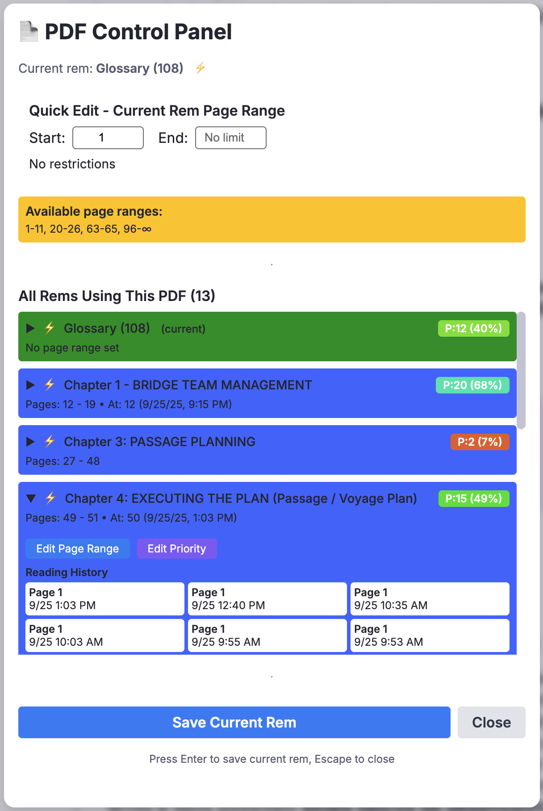{ width="608" }
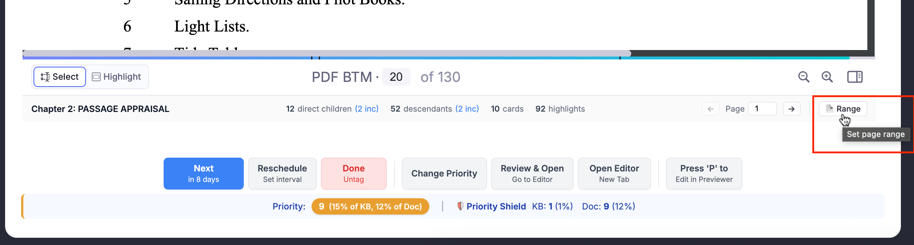{ width="900" }
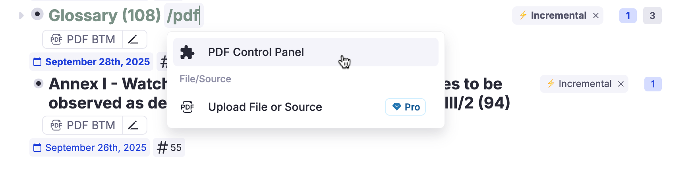{ width="871" }


### ✨ New Feature: [Prioritization-&-Sorting#priority-shield](Prioritization-&-Sorting.md#priority-shield) & History Graph (= Priority Protection)

Inspired by advanced metrics in SuperMemo, this update introduces the **Priority Shield**, a powerful diagnostic tool to help you understand and manage your learning process. This feature gives you a clear, numerical value for your "Priority Protection"—your capacity to process high-priority material on any given day.

The core purpose of the Priority Shield is to move beyond guessing and provide you with concrete data to build a sustainable and effective study strategy. By knowing the exact priority of the most important Incremental Rem you have yet to review, you can answer critical questions about your learning habits:

-   **Am I creating new material faster than I can review it?** If you consistently see a low Priority Shield value (e.g., your Relative Priority Shield is only protecting 4% of your top priority Incremental Rems), it's a strong indicator that the inflow of new Incremental Rems is too high, and your most important knowledge is at risk of being forgotten.
-   **Is my "[Prioritization-&-Sorting#sorting-criteria](Prioritization-&-Sorting.md#sorting-criteria)" setting right for me?** The Priority Shield gives you direct feedback on your randomness setting. If your shield value is too low, you might want to decrease the randomness to focus more strictly on high-priority material. Conversely, if you feel your reviews are too rigid, you can increase randomness and watch how it affects your shield value over time.
-   **Am I at risk of burnout?** The history graph allows you to see trends. If you notice your Priority Shield value steadily declining over days or weeks, it may be a sign that your workload is becoming unmanageable, allowing you to adjust your strategy *before* you feel overwhelmed.

This new feature includes:

* **Real-Time Status in the Queue**: A "Priority Shield" display appears below the answer buttons, giving you an at-a-glance status of your protection for both your entire Knowledge Base and the current document you are studying.
{ width="1000" }


* **Historical Graph**: A new "Priority Shield History" menu item in the queue opens a popup with a detailed graph, allowing you to track your performance over time with two key metrics: **Absolute Priority** and **Relative Priority (%)**.

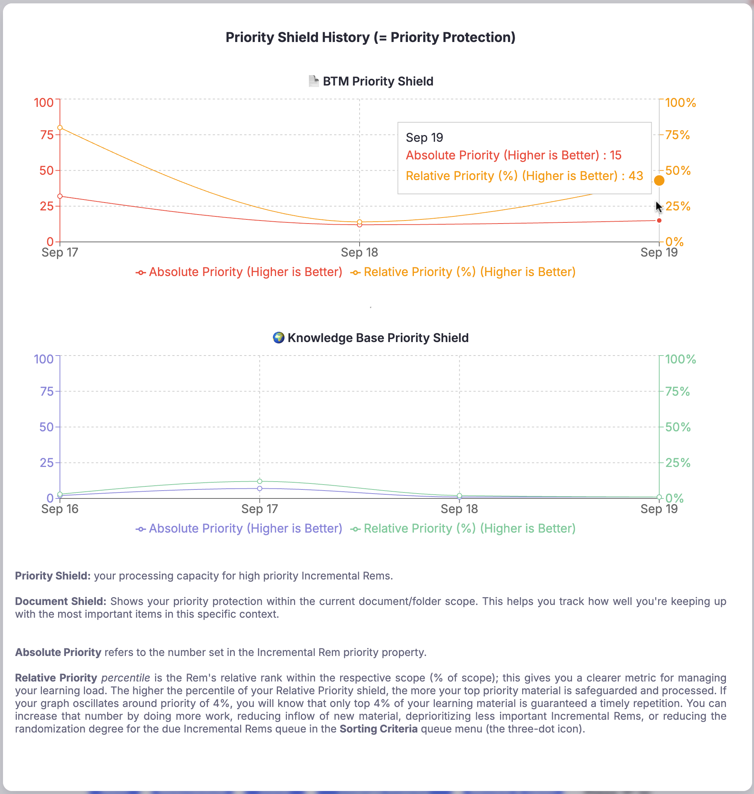{ width="800" }

* **Customizable Display**: The real-time display can be toggled on or off in the plugin's settings to keep your UI as clean as you prefer.
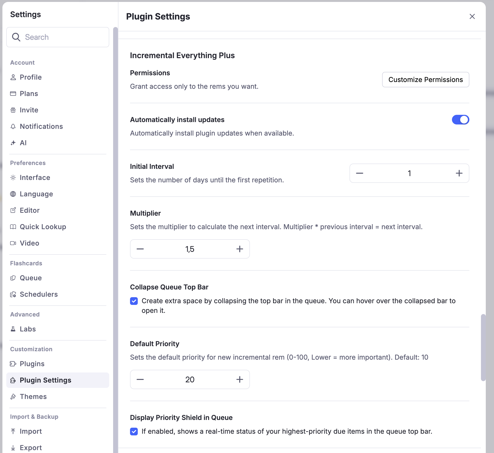{ width="700" }


### ✨ New Feature: [Prioritization-&-Sorting#priority-inheritance-system](Prioritization-&-Sorting.md#priority-inheritance-system)

This feature mimics SuperMemo's hierarchical priority system, making the management of complex topics effortless.

#### The Problem It Solves

When breaking down a large topic (like a key chapter in a textbook) into smaller incremental rems (sections, extracts...), you had to manually set the priority for each new item. This was repetitive and made it easy for child rems to be badly prioritized.

#### How It Works & When to Use It

Now, when you create a new incremental rem, it automatically inherits the priority of its closest parent or ancestor that is also an incremental rem.

-  **Use Case 1: Deconstructing a High-Priority Document**

Imagine you have a PDF of a crucial research paper with a priority of 10. As you read and create highlights (extracts) from it, each new highlight will automatically be assigned a priority of 10. This ensures that all the core concepts from that paper are reviewed together and with the urgency they deserve, without any manual adjustments.

-  **Use Case 2: Hierarchical Note-Taking**

If you have a parent rem for a broad topic like "Quantum Mechanics" with a set priority, any new child rems you create under it (e.g., "Wave-Particle Duality," "Superposition") will inherit that priority. This keeps your knowledge hierarchy organized and ensures that foundational topics and their sub-topics are treated with the same level of importance in your reviews.

The "Set Priority" and "Reschedule" popups have also been updated to display the ancestor's priority, giving you immediate context when you decide to manually override the inherited value.

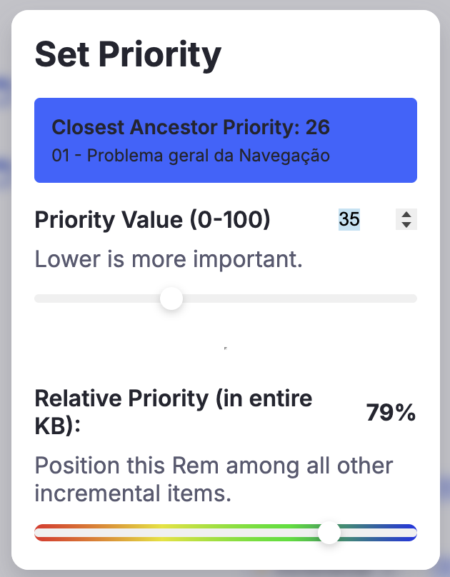{ width="315" }


### ✨ New Feature:  "[Reviewing-Items-in-the-Queue#open-editor-in-new-tab-for-pdfs](Reviewing-Items-in-the-Queue.md#open-editor-in-new-tab)" Button for PDFs

This button is a direct response to a recent RemNote UI change and serves as an essential workaround to restore a seamless PDF review workflow.

####  The Problem It Solves

RemNote recently removed the ability to open an editor pane on the left side of the screen when reviewing a PDF highlight in the queue (PDFWebViewer). This made it impossible to take notes and paste extracts without exiting the queue entirely, breaking the review flow (not always the *Previewer* - pressing "P" - is sufficient to this flow, nor does it allow having the PDF and editor side by side).

####  How It Works & When to Use It

This new button appears in the answer bar exclusively for PDF and PDF highlight rems. Clicking it instantly opens the full source document in a new browser tab, right at the location of your highlight/PDF document.

-  **Use Case: In-Depth Note-Taking During Review**
A highlight sparks a complex new idea that requires more space than a simple comment. Or you want to take notes of what you are reading in a PDF section, and paste highlighted extracts right there (tagging it "incremental" in the editor note rather than in the PDF highlight itself, for easier manipulation and future flashcard creation). Use the button to open the full editor, where you have access to all of RemNote's formatting tools, can link to other ideas, and can write extensive notes alongside the original PDF. This allows you to capture detailed thoughts without being constrained by the queue's limited interface.

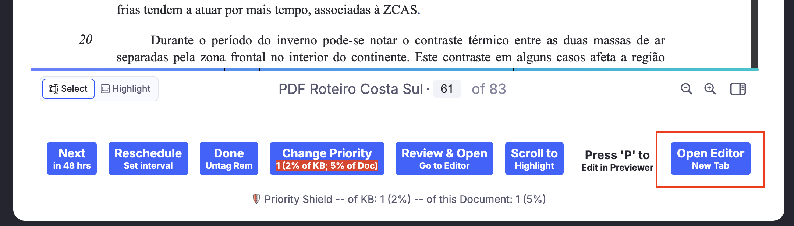{ width="800" }


####  ⚙️  New Setting: Preferred RemNote Environment

For users who primarily work on the beta version of RemNote, a new "Preferred RemNote Environment" setting has been added. This dropdown menu in the plugin settings allows you to choose whether the "Open Editor in New Tab" button directs you to the stable (`www.remnote.com`) or beta (`beta.remnote.com`) environment. This ensures a seamless workflow by keeping you in your preferred version of RemNote.


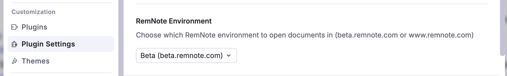{ width="750" }

### ⚙️ UI/UX Improvements

####  Enhanced Queue Viewer UI

- **Breadcrumbs**: Both the PDF Reader and the Extract Viewer now feature a breadcrumb navigator at the top to show the document's position in your knowledge base.
- **Metadata Footers**: A rich metadata footer has been added to the viewers, displaying useful statistics like direct children, descendant, flashcard, and highlight counts.
- **PDF Page registry**: The PDF Reader now includes a footer bar where you can manually track your current page number (easier to find where you were in the next review).
-- **Automatic Page Saving**: The reader automatically saves your last-viewed page for each incremental PDF item and returns to it on your next review.


## v0.1.5 - September 5, 2025

* Improved the visibility of buttons for mobile.


## v0.1.4 (Plus Version release) - September 3, 2025

This initial version is a fork of the original Incremental Everything plugin, focused on enhancing the user interface, adding powerful new features for prioritization, and fixing core layout and compatibility issues.

### ✨ New Features & Major Enhancements

* **Interactive Priority Popup:** The "Set Priority" popup has been completely redesigned for a more intuitive workflow. It now features a new **"Relative Priority" slider** with a full-color gradient, allowing you to set a Rem's priority by either typing an absolute value or visually selecting its desired percentile rank.
* **At-a-Glance Priority Assessment:** The "Change Priority" button is now enhanced with a **color-coded indicator** (red for high priority, blue for low) and a label showing the Rem's relative rank within your entire Knowledge Base (`% of KB`) and the current document (`% of Doc`).
* **Reschedule Button:** A new button has been added to the answer bar that opens a popup for manually setting the next review interval in days.
* **"Scroll to Highlight" Button:** A convenient button now appears for PDF highlight cards, allowing you to instantly jump back to the highlight's position in the PDF.
* **"Change Priority" Button:** You can now quickly change a Rem's priority directly from the queue via a new button on the answer bar.
* **Customizable Default Priority:** A new option in the plugin settings allows you to set your own default priority for new incremental Rem.
* **Improved Sorting Logic:** The "Flashcard Ratio" slider in the Sorting Criteria has been completely overhauled to be more linear and intuitive. This fixes persistent bugs in the queuing logic, ensuring the selected card sequence is now reliable and accurate.
Of course. Here are the summaries for your Changelog and README files.

* **"Review & Open" Button:** A new button has been added to the answer bar that performs a repetition (like the "Next" button) and then immediately opens the Rem in the main editor. This provides a seamless workflow for when you need the full power of the editor for a specific item in your queue.


### ⚙️ UI/UX Improvements

* **"Enter" Key to Close Popup:** The priority popup can now be submitted and closed by pressing the "Enter" key, speeding up your workflow.
* **Streamlined PDF Highlighting:** Creating an incremental Rem from a PDF highlight now immediately triggers the **priority popup**, allowing you to instantly set the priority or press enter to accept the default.
* **"Press 'P' to Edit" Hint:** A helpful, non-intrusive button now appears for applicable cards, reminding users of the native shortcut to open the editor and avoid keyboard conflicts.

### 🐛 Bug Fixes & Compatibility

* **Conditional Queue Styling:** The plugin no longer applies a permanent style to the queue. Layout fixes are now applied **conditionally** only when an incremental Rem is active, preserving the native layout for standard flashcards.
* **Plugin Compatibility:** A conflict with the "Flashcard Repetition History" plugin has been resolved. Its widget is now automatically hidden during incremental reviews to prevent layout issues.