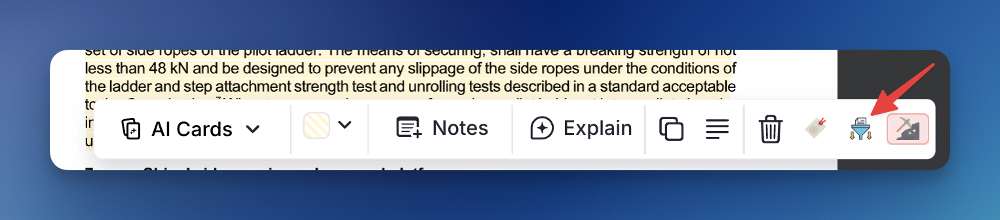

This feature allows you to extract PDF highlights into standalone Incremental Rems, organizing them under any parent in your knowledge structure.

## How to Use

1. **Create a highlight** in a PDF by selecting text
2. **Click the highlight** to open the popup menu
3. **Click "Create Incremental Rem"** (the funnel icon button)
4. **Select a parent** from the hierarchical tree that appears
5. **Press Enter** to confirm — your new Incremental Rem is created

## Parent Selector Features

The Parent Selector shows all Rems associated with the current PDF, sorted with Incremental Rems first (ordered by priority). You can:

- **Navigate the tree** to find the right location
- **Expand/collapse nodes** to see children
- **Create new child Rems inline** without leaving the popup
- **Remember Last Input** and **Smart Auto-scrolling**: The widget automatically remembers and perfectly scrolls to the parent you previously selected for that specific Incremental Rem (or, if your are in the Editor instead of the Queue, the last parent you chose for that PDF).

**Note:** In case you don’t find the desired rem with that PDF as source, make sure you made it incremental, otherwise it will not be cached as necessary. (You can untag it later, and the cache will keep it)

### Headings in the Tree

Headings are a document's table of contents, so the selector treats them as the primary filing destinations. When you expand a branch, each **heading child (H1–H6)** shows an **`H1`–`H6` badge** on the right of its row, and two checkboxes at the top of the popup control how the branch is presented:

| Option | Default | Effect |
|--------|---------|--------|
| **List headings first** | On | Heading children are listed **before** the rest, shallowest level first (`H2` above `H4`). Non-headings follow in their usual editor order. |
| **Filter only headers** | Off | Hides non-heading rems inside expanded branches, leaving a clean chapter outline. |

Both settings are **remembered per device**.

Two deliberate exceptions keep the filter from hiding something you need:

- A **plain rem that leads to headings below it** is kept, so a wrapper rem can never make its headings unreachable.
- The **remembered destination** and the **suggested rem** are always shown, even when they aren't headings.

Neither option affects the **initial list of Incremental Rem candidates** for the PDF — they only reshape a rem's own tree once you expand it.

### Portals in the Tree

A **portal** shows a Rem that lives somewhere else inside the branch you're looking at, so you can read and edit it from both places. The Parent Selector now sees them: when you expand a branch, any Rem mirrored in by a portal is listed **in the portal's position in the branch**, marked with a **`⧉ portal`** badge. Hovering the badge shows the **full breadcrumb** of where the Rem actually lives (`Chapter › Section › Subsection`), using the same pin-aware rendering as the Reader's breadcrumb — a 📌 reference pin in an ancestor's title stays a 📌 instead of expanding into the whole referenced Rem.

Portal rows behave like any other row: expand them to walk their children, or press `Enter` to file the new Rem there. Because the portal's target is an ordinary Rem, the new Rem is created in that **real home** — and therefore shows up inside the portal too, exactly as if you had typed it there.

A few details:

- **Mirrored Rems keep their own hierarchy.** A portal records every Rem it displays, so a branch and everything under it come back together. Only the **outermost** ones are listed at the portal's position; their descendants appear where they belong — under that Rem, once you expand it — instead of being flattened into a row of siblings.
- The **portal itself is never offered** as a destination — a portal isn't a real parent. Only the Rems it mirrors are.
- **Portal rows survive "Filter only headers"**, even when the mirrored Rem isn't a heading, since placing a portal in a branch is a deliberate structural choice.
- If a Rem is both a real child and a portal target of the same parent, it's shown **once**.
- **Embedded queues, scaffolds and search portals are ignored** — their contents are widgets or live query results, not a place you filed anything.
- The **remembered destination** is found again even when the only route to it runs through a portal.

### Keeping the Suggested Destination

The popup opens on your last destination (or its suggestion) and scrolls it into view. Because that scroll moves rows underneath the cursor, the selection used to be replaced by an accidental hover before you had done anything. Now:

- **Hover only takes over once the mouse genuinely moves**, and arrow-key navigation disarms it again — so a resting cursor can't undo a keyboard selection.
- **Clicks are ignored for a moment after the popup opens**, so a quick second click can't create the Rem under whatever row landed beneath the cursor.
- If the selection still drifts, press **`L`** or click the **↩ Last destination** / **↩ Suggested** button in the header to jump back to it. If you collapsed the path in the meantime, it re-expands to reach it.

### Keyboard Shortcuts

| Key | Action |
|-----|--------|
| `↑` / `↓` | Navigate up/down the tree |
| `→` or `Tab` | Expand selected node |
| `←` | Collapse node, or jump to parent |
| `Enter` | Select as destination |
| `+` or `n` | Create a new child under selected node |
| `L` | Reselect the last/suggested destination |
| `Escape` | Close popup |

### Creating Children Inline

If you need a destination that doesn't exist yet (e.g., "Section D" under "Chapter 9"):

1. Navigate to the parent node (Chapter 9)
2. Press `+` or `n` (or click the `+` button)
3. Type the name of the new Rem
4. Press `Enter` to create it
5. The new Rem is now selected — press `Enter` again to use it as destination

**Automatic heading level:** new child Rems are styled as a heading one level deeper than their parent, so your structure stays visually nested. An `H1` parent yields an `H2` child, `H2` → `H3`, `H3` → `H4`, `H4` → `H5`, and `H5` → `H6` (the deepest level RemNote supports; `H6` parents keep `H6` children). If the parent isn't a heading, the child defaults to `H4`.

## What Happens Automatically

- **New Rem**: Created under your chosen parent with the highlight text + a pinned reference to the source
- **Incremental status**: The new Rem is tagged as Incremental and scheduled for review
- **Original highlight**: Its Incremental tag is removed (if any) and it is tagged with `pdfextract` (which handles its visual styling via CSS). `pdfextract` highlights render **blue** and still-`incremental` highlights render **green**, so the two kinds are told apart by hue alone; selecting text *inside* a highlight uses a high-contrast (dark background, white text) selection so it stays readable, and in the editor's dark mode the backgrounds darken to keep light text legible. In the editor tag bar, the full `pdfextract` label is replaced by a compact **✂️** badge to save horizontal space — this is purely cosmetic and does not affect functionality.
- **Deep Reference Pinning**: Any future sub-extracts made from this new Rem (using the `Opt+X` or `Opt+Shift+X` shortcuts) will automatically inherit the reference pin bridged to the original highlight!
- **Auto-Bookmark**: If you are in the Queue, your current reading position is automatically updated to the location of this highlight, and an entry is added to your reading history.

## When to Use

| Use Case | Benefit |
|----------|---------|
| **Extract key ideas** | Move important content from PDF into your main note structure for easier processing (clozing, flashcard creation) |
| **Organize by topic** | Place extracts under topic-specific parents (e.g., all "Navigation Systems" notes together) |
| **Build hierarchy** | Child extracts inherit context and can be reviewed alongside their parent |

## Toggle vs. Create Incremental Rem

| Feature | Toggle Incremental Rem | Create Incremental Rem |
|---------|------------------------|------------------------|
| **Location** | Highlight stays in PDF structure | New Rem under parent of your choice |
| **Original highlight** | Becomes the Incremental Rem | Remains as a reference |
| **Use when** | Quick marking for later review | Organizing into knowledge structure |

