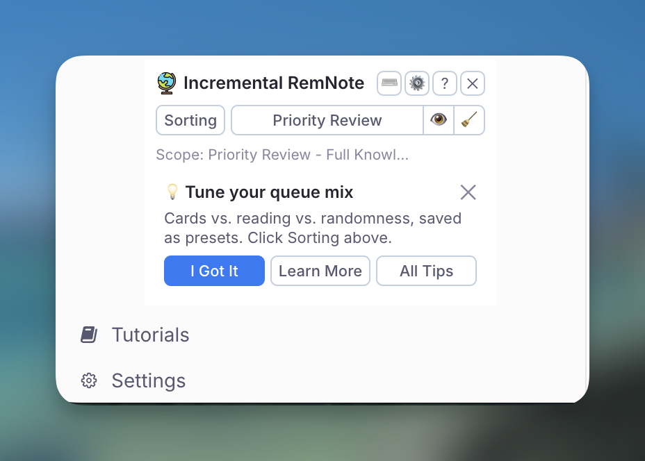

# Getting Started with Incremental RemNote

Welcome to **Incremental RemNote**! This guide will walk you through the basics of making Rems incremental, reviewing them, and managing your learning workflow.

---

## What is Incremental Learning?

Incremental learning transforms how you acquire knowledge. Instead of reading a book from cover to cover or watching a full lecture, you break content into smaller pieces and review them over time—interleaved with flashcards and other material.

**Key Benefits:**

- **Process 1000+ sources in parallel** without losing track
- **Prioritize ruthlessly** to focus on what matters most
- **Build lasting knowledge** by converting passive reading into active flashcards

For a deeper understanding, see [What is Incrementalism?](What-is-Incrementalism%3F.md).

---

## Installation

1. Open the [RemNote Plugin Store](https://www.remnote.com/plugins)
2. Search for "**Incremental RemNote**"
3. Click **Install**

---

## The Incremental RemNote Panel { #the-incremental-plugin-panel }

Once installed, the plugin adds a small **Incremental RemNote** 🌐 panel at the bottom of the left sidebar. It is the one fixed place to reach the plugin from, and where the onboarding tips live.

{ width="400" }

**In the header:**

| Control | What it does |
|---------|--------------|
| ⌨ | Opens the [Keyboard Shortcuts](Keyboard-Shortcuts.md) page |
| ⚙ | Opens the plugin's [settings popup](Plugin-Settings-Reference.md) — every setting the plugin owns, grouped |
| ? | Opens this documentation, at the home page |
| ✕ | Hides the panel **for this session** — it is back next time you open RemNote. To bring it back sooner, run the **Show Incremental RemNote Panel** command |

**Action buttons:**

- **Sorting** — the [flashcard/incremental mix and randomness](Prioritization-&-Sorting.md#sorting-criteria) for your queue.
- **Priority Review** — three actions on [Priority Review Documents](Priority-Review-Document.md), grouped into one control:

| Button | What it does |
|--------|--------------|
| **Priority Review** | Creates a review document scoped to the document you currently have open. The same as **Create Priority Review Document** in the document menu, without opening the menu; the scope it will use is named under the button, and with no document open it falls back to the whole knowledge base |
| 👁 | Opens the **Priority Review Queue** Rem — every review document you have built is tagged with it, so its references are the list of them. Go there to study from one you made earlier |
| 🧹 | Runs [Clean Priority Review Documents](Priority-Review-Document.md#cleaning-a-review-document) — strips the entries you have already reviewed and offers to delete the documents that are finished |

The 👁 button says so if you have no review documents yet: the tag is created by the first one.

### Tips { #tips }

The panel shows **one tip per session**. Answer it and the tip area is done until the next time you open RemNote — it will not hand you another one, and moving around RemNote will not swap it for a different one either. Each tip has four buttons:

- **I Got It** — you know this one. It is never shown again. This is remembered per knowledge base and syncs across your devices.
- **✕** — not now. The tip stays in the pile and can resurface later; the panel also goes quiet for two hours, so a reload does not immediately produce another one.
- **Learn More** — opens the documentation section for the feature the tip is about. Tips that are habits rather than features have no such button.
- **All Tips** — opens the full list. See [All Tips](#all-tips) below.

A tip you have not retired **will** come back on another day — that is what ✕ means. But tips are offered in rotation, least recently seen first, so every other tip still in the pile gets its turn before any one of them repeats. This matters most near the end: with two or three tips left, a random draw would keep landing on the same one.

Tips come in two groups, and the second is not offered until the first is done: **Basics** teaches the daily loop, **Utilities** waits until you have it. So a brand-new user's first tip is about `Alt+X`, not about cycling text case.

When you have answered **I Got It** to every tip, the tip area disappears for good and the panel keeps a small **💡 All tips** link.

### All Tips { #all-tips }

**All Tips** opens the whole pile in one popup — useful for checking what you have already been told, and for reading ahead without waiting a session per tip.

- **Acknowledged** first, most recently answered at the top, each with the date you pressed **I Got It**. Tips you retired before the plugin started recording dates say *date not recorded*.
- **Not yet acknowledged** below, in the order the panel will offer them.

Each row has its own **Learn More**, and every tip you have not retired has its own **I Got It** — so you can clear tips you already know without waiting for the panel to offer them one at a time. As in the panel, **I Got It** here means the tip is never shown again.

The popup is keyboard-driven: `↑`/`↓` move (`Home`/`End` jump to either end), `Enter` acknowledges the selected tip, `Space` opens its documentation, `Esc` closes.

!!! note "Starting over"
    There is no undo for **I Got It**. If you want the whole pile back, the **Debug** popup has a *Reset acknowledgements* button under **Onboarding Tips State**, which clears every acknowledgement for the current knowledge base.

---

## Making a Rem Incremental

The first step is to convert a Rem, PDF, or website into an "Incremental Rem" so it will appear in your queue.

### Method 1: Slash Command

1. Focus on any Rem in the editor
2. Type `/Make Incremental (Extract)` and select the command
3. The Rem is now tagged with the `Incremental` powerup

### Method 2: Keyboard Shortcut

- **[Alt+X](Keyboard-Shortcuts.md#core-commands)** (or **Opt+X** on Mac) — Makes the focused Rem incremental. **If text is selected**, it creates a new **[Reviewing-Items-in-the-Editor#extracting-text](Reviewing-Items-in-the-Editor.md#extracting-text)** from that selection.
- **[Alt+Shift+X](Keyboard-Shortcuts.md#core-commands)** — Makes the Rem incremental AND opens the priority popup. Supports **[Reviewing-Items-in-the-Editor#extracting-text](Reviewing-Items-in-the-Editor.md#extracting-text)** from selections.

### Method 3: Document Menu

1. Click the **⋮** (three dots) menu at the top-right of any document
2. Select **"Toggle Incremental Rem"**
3. The priority popup will open automatically

### What Happens When You Make a Rem Incremental?

1. The Rem receives the `Incremental` powerup tag
2. A **"Made Incremental"** event is recorded in the repetition history, stamped with the priority and the interval the Rem started with
3. The Rem is scheduled for its first review (based on your Initial Interval setting, default: 1 day)
4. The Rem will now appear in your queue, interleaved with flashcards

---

## Reviewing Incremental Rems in the Queue

When you enter the queue, your Incremental Rems appear alongside your flashcards. The **Answer Buttons bar** at the bottom provides your main actions:

| Button | Shortcut | What it does |
|--------|----------|--------------|
| **[Next](Reviewing-Items-in-the-Queue.md#next)** | — | Marks item as reviewed, schedules next repetition |
| **[Reschedule](Reviewing-Items-in-the-Queue.md#reschedule)** | [Ctrl+J](Keyboard-Shortcuts.md#core-commands) | Manually set the next review date |
| **[Dismiss](Reviewing-Items-in-the-Queue.md#dismiss)** | — | Finishes the item, removes Incremental tag |
| **[Change Priority](Reviewing-Items-in-the-Queue.md#change-priority)** | [Alt+P](Keyboard-Shortcuts.md#priority-commands) | Opens priority popup |
| **[Review & Open](Reviewing-Items-in-the-Queue.md#review-in-editor)** | — | Reviews the item AND opens it in the editor |

### The "One Memory, One Action" Principle

Before clicking "Next," always perform at least one productive action:

- **Extract** a key sentence as a new Incremental Rem
- **Create** a flashcard from important information
- **Rephrase** a confusing passage
- **Highlight** essential content

Avoid "futile reviews" where you just glance at content without engaging.

For more details, see [Reviewing Items in the Queue](Reviewing-Items-in-the-Queue.md).

---

## Dismissing an Incremental Rem (Dismiss Button)

When you've fully processed an item and extracted all valuable knowledge:

1. Click the **"Dismiss"** button in the queue, OR
2. Manually remove the `Incremental` tag in the editor

### What Happens When You Dismiss?

1. The Rem's **complete repetition history is preserved** in a `Dismissed` powerup
2. The `Incremental` tag is removed
3. A **yellow left border** appears in the editor to indicate the Rem has preserved history
4. The item no longer appears in your queue

{ width="600" }

**Visual Settings:**

- **Show Yellow Left Border for Dismissed Rems** — Toggle the visual indicator (default: on)
- **Hide Dismissed Tag in Editor** — Reduce clutter by hiding the tag (default: on)

---

## Re-activating a Dismissed Rem

If you want to review a dismissed item again:

1. Make the Rem incremental again using **[Alt+X](Keyboard-Shortcuts.md#core-commands)** or the slash command
2. The old history is **automatically restored and merged**
3. A **"Made Incremental"** marker is added to distinguish the new learning session

This allows you to:

- See your complete learning journey across multiple sessions
- Resume where you left off with preserved context
- Analyze your long-term engagement with material

---

## Setting Priorities

Priority is crucial for managing information overload. Lower numbers = higher priority.

| Priority | Meaning |
|----------|---------|
| **0-20** | Critical, must review frequently |
| **20-50** | Important, regular review |
| **50-80** | Moderate, occasional review |
| **80-100** | Low priority, review when time permits |

### Quick Methods

- **[Alt+P](Keyboard-Shortcuts.md#priority-commands)** — [Full priority popup](Prioritization-&-Sorting.md#main-priority-popup) with analytics
- **[Ctrl+Opt+P](Keyboard-Shortcuts.md#priority-commands)** — [Light priority popup](Prioritization-&-Sorting.md#light-priority-popup) (faster)
- **[Ctrl+Opt+Up/Down](Keyboard-Shortcuts.md#priority-commands)** — [Quick Priority Change](Prioritization-&-Sorting.md#quick-priority-shortcuts): Adjust priority instantly without opening any popup

For comprehensive details, see [Prioritization & Sorting](Prioritization-&-Sorting.md).

---

## Next Steps

Now that you understand the basics, explore these topics:

- [Repetition History & Statistics](Repetition-History-and-Statistics.md) — Read an item's review log, the aggregated tree view, and what each event marker means
- [Prioritization & Sorting](Prioritization-&-Sorting.md) — Master the priority system
- [Reviewing Items in the Queue](Reviewing-Items-in-the-Queue.md) — Deep dive into the queue workflow
- [Create Incremental Rem from PDF Highlights](Create-Incremental-Rem-from-PDF-Highlights.md) — Extract from PDFs, and [move an Incremental Rem's data to its parent](Create-Incremental-Rem-from-PDF-Highlights.md#transfer-to-parent) when it landed on the wrong one
- [Keyboard Shortcuts](Keyboard-Shortcuts.md) — Speed up your workflow
- [Changelog](Changelog.md) — See the latest features

**Happy Incremental Learning!** 🚀
