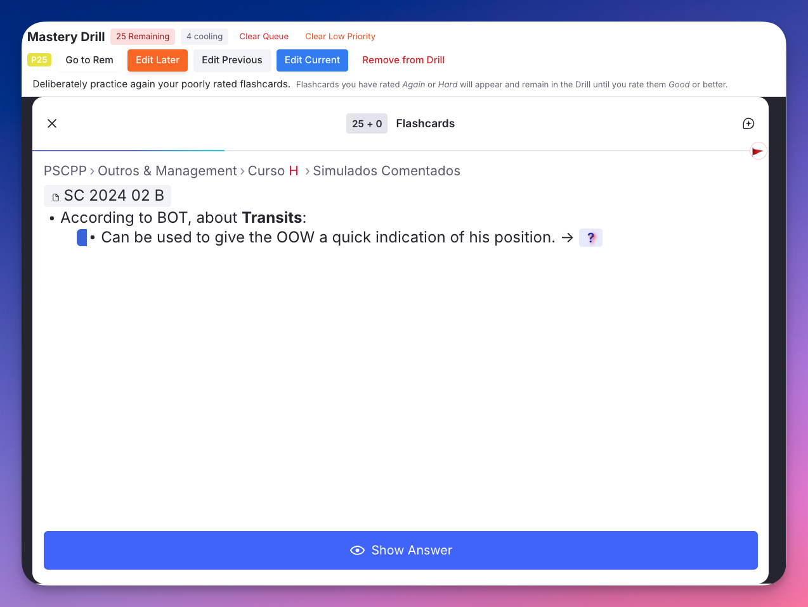
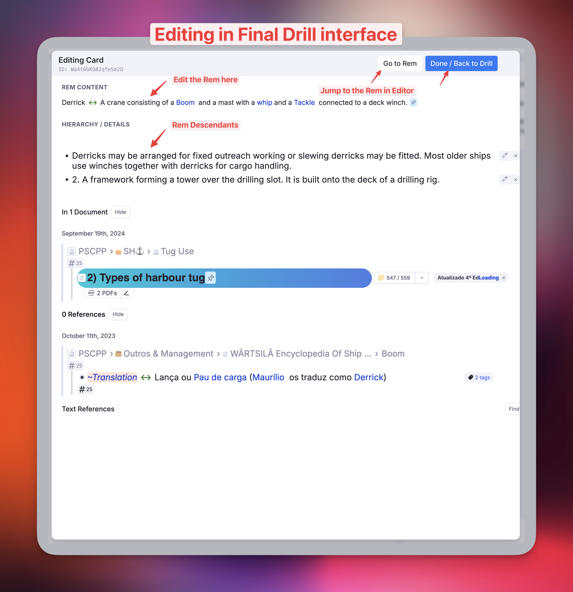

# History, Queue Dashboard & Mastery Drill

These features were originally developed as a companion plugin (*History, Queue Dashboard and Mastery Drill*) and have been fully integrated into **Incremental RemNote** as of v0.2.182.

They add a suite of history and practice tools to your right sidebar: a **Live Session Dashboard** with real-time study metrics, a **Practiced Queues History** to track sessions over time, a **Flashcard History** to find recently reviewed cards, a **Visited Rem History** to retrace your navigation, and a **Mastery Drill** queue to deliberately target your most difficult material.

---

---

## Migrating from the Standalone Plugin

> **This section only applies to users who previously had the *History, Queue Dashboard and Mastery Drill* plugin installed.** If you are a new Incremental RemNote user, skip ahead.

### Background

Both plugins store their data in isolated, plugin-scoped namespaces — so running them simultaneously will not corrupt any data. However, both plugins register a command with the same name (*Mastery Drill: deliberately practice poorly rated cards*), which causes two identical entries in the Command Palette. Each plugin also maintains its own separate drill queue; rating a card *Forgot* or *Hard* would add it to **both** queues independently. Running both at the same time is therefore confusing and not recommended.

The cleanest migration path is to disable IE's Mastery Drill while you finish and export from the old plugin, then uninstall the old plugin and re-enable IE's drill.

### Migration Protocol

**Step 1 — Disable IE's Mastery Drill temporarily**

In the plugin's settings popup (**`Incremental RemNote: Settings`**, quick code `is`) → **Mastery Drill**, turn **Enable Mastery Drill** off. Then **reload RemNote**. This hides IE's drill popup, notification widget, and command, and stops IE from tracking AGAIN/HARD cards — leaving only the old plugin's drill active and unambiguous.

**Step 2 — Complete your old Mastery Drill queue *(optional)*

Open the old plugin's drill via Command Palette → *Mastery Drill* and practice the queue to completion. Any cards you don't practice will not transfer to IE — they will simply repopulate in IE's drill the next time you rate them *Forgot* or *Hard* in a regular queue session. If you don't mind losing the pending items, skip this step.

**Step 3 — Export your Practiced Queues history from the old plugin**

In the old plugin's *Practiced Queues History* sidebar tab, click the **Export** button and save the JSON file.

> **What cannot be migrated:** Flashcard History and Visited Rem History do not transfer. IE has been tracking its own copies from the moment it was installed, so those tabs will already contain recent entries.

**Step 4 — Uninstall the old plugin**

Go to **RemNote Settings → Plugins**, find *History, Queue Dashboard and Mastery Drill*, and uninstall it.

**Step 5 — Re-enable IE's Mastery Drill**

In the same place, turn **Enable Mastery Drill** back on. Then **reload RemNote**. IE's drill popup, notification widget, and command are now active again, and AGAIN/HARD tracking resumes.

**Step 6 — Import your Practiced Queues history**

In IE's *Practiced Queues History* sidebar tab, click the **Import** button and select the JSON file from step 3. Duplicate sessions are automatically detected and skipped.

---

## Visited Rem History

**What it does:** Records a chronological history of the Rems you have navigated to in the Editor.

**Why use it:** Quickly jump back to documents you were just working on without losing your place.

**Interaction:** You can expand and edit the Rem directly in the right sidebar.

**Search:** Includes a search bar to instantly filter your history. Supports multi-word queries (e.g., "Biology Exam") and deep text search across all recorded items.

**Retention:** The list keeps the **500 most recent** visits for the knowledge base you are in. See [How the history lists are stored](#how-the-history-lists-are-stored).

{ width="500" }

---

## Flashcard History

**What it does:** Records the chronological history of the Rems associated with the flashcards you have just seen in the Flashcard Queue.

**Why use it:** If you want to check context or edit a flashcard you just reviewed, you can easily find it here without interrupting your session flow.

**Interaction:** Clicking on a flashcard will open the Rem in the Editor.

**Search & Filter:** Effortlessly find a card you practiced moments or days ago. The search checks both the front (question) and back (answer/context) of your cards. You can also filter the history by rating grade (Again, Hard, Good, Easy) using the radio buttons at the top.

**Rating Badges:** Each card in the history displays a colored badge indicating the grade you assigned to it during the review session.

**Priority Badge & inline editing:** Each entry also shows a priority badge, right-aligned in the badge row. Click it to open an inline slider editor directly in the row — adjust with the number field or the drag slider, then Save. No popup is opened, so editing a priority here never conflicts with the queue's target-rem selection. The change is written by the plugin's persistent background tracker, so it is saved reliably and still triggers the priority-inheritance cascade. The Incremental Rem History sidebar has the same badge, showing the IncRem priority (colored by its KB-wide percentile).

**Cluster-aware recording:** Inside [Card Clusters](https://help.remnote.com/en/articles/10104223-card-clusters), each sibling card is recorded individually as it becomes visible — not just the cluster anchor. This ensures your history accurately reflects every card you actually reviewed. Cards rated inside the [Mastery Drill](#mastery-drill) popup are recorded here too, for the same reason.

**Retention:** The list keeps the **500 most recent** cards for the knowledge base you are in. See [How the history lists are stored](#how-the-history-lists-are-stored).

{ width="600" }

{ width="500" }

---

## How the history lists are stored

Both jump-lists above — **Visited Rem History** and **Flashcard History** — live in the plugin's synced storage, which RemNote caps at **900 KB per item**. Each list keeps a short text preview of every entry so the search bar can work offline, and that preview is what makes the lists grow.

Since **v1.0.37** each knowledge base gets its own list, and three limits keep it comfortably inside the cap:

| Limit | Flashcard History | Visited Rem History |
|---|---|---|
| Entries kept, per knowledge base | 500 | 500 |
| Preview text stored per entry | 400 characters | 400 characters |
| Hard byte budget per knowledge base | 550 KB | 550 KB |

The preview limit applies to the **whole** preview — the front and the back together for a flashcard. It used to be applied to each side separately, so an entry could store twice the stated number.

The byte budget is the one that actually guarantees the cap is never hit: if your entries happen to be unusually long, the list is trimmed further until it fits, rather than being rejected on write. In normal use the 500-entry cap is what binds first.

**What this means for you**

- **Nothing to do.** Your existing history is split across your knowledge bases automatically the first time each list is read or written after updating. No entries are lost, and entries recorded before the plugin tracked knowledge bases are claimed by your primary one.
- **Each knowledge base now has its own history.** Previously all of them shared one list and the sidebar filtered it down to the KB you were in, so the behaviour on screen is unchanged — but a busy KB can no longer crowd out the others.
- **Older entries fall off sooner** than they used to, because the previous limit was 1000 entries shared across every knowledge base.

> [!NOTE]
> If the Flashcard History sidebar stopped recording anything before you updated, this is why: the shared list had grown past RemNote's ceiling, and every attempt to add to it was refused. The update repairs it on the first write — no manual clearing needed.

The **Debug: Clear Flashcard History** command clears the list for the knowledge base you are currently in.

---

## Practiced Queues History & Live Dashboard

**What it does:** Tracks your practice sessions and metrics.

**Live Dashboard:** Displays real-time metrics for your currently active queue session, including current speed, retention rate, and the age of the exact card you are reviewing.

{ width="500" }

### Metrics Collected

| Metric | Description |
|---|---|
| **Total Time** | Total time spent in the session |
| **Retention Rate** | Remembered vs. Forgot percentage |
| **Speed (CPM / s/card)** | Cards per minute and seconds per card, [colour-coded](#speed-colour-coding) |
| **Card Age** | Age of the card currently being reviewed (live view only) |
| **Cost** | Minutes per year of card age/coverage |
| **Interval** | Time until next scheduled review (prev/current card) |
| **Sessions Summary** | Aggregated stats for Today, Yesterday, This Week, Last Week, and more |
| **Flashcards** | Count and time for regular flashcards |
| **Incremental Rems** | Count and time for IncRems reviewed during the session — tracked from the queue widget, the Editor Review Timer, and the Editor Review popup |

### Speed Colour Coding

Every speed reading — in the live session card, in the History Log, and in the Sessions Summary table — is tinted on a **red → yellow → green gradient**. The colour is always derived from the cards-per-minute pace, so a given pace looks identical whichever unit it is displayed in.

**Out of the box the two ends of that gradient are measured from your own card history**, so "slow" and "fast" mean slow and fast *for you* — see [Choosing your own limits](#choosing-your-own-limits) below. Until the first measurement completes, and whenever you switch to fixed limits, the gradient falls back to two absolute values:

| Colour | Cards per minute | Seconds per card | Reading |
|---|---|---|---|
| 🔴 Red | ≤ 1.5 cpm | ≥ 40 s/card | Slow — long cards, heavy material, or interruptions |
| 🟡 Yellow | ≈ 2.75 cpm | ≈ 22 s/card | Mid-range |
| 🟢 Green | ≥ 4 cpm | ≤ 15 s/card | Fast — short cards or well-known material |

Between the two limits the hue shifts continuously with the pace; below and above them it stays fully red and fully green. Since seconds per card is the inverse of cards per minute, the s/card scale runs the other way — **lower** s/card is greener.

The gradient is a pace indicator, not a quality score: reading-heavy or cloze-dense material sits naturally at the red end, and speed says nothing on its own without the **Ret.** column beside it.

#### Choosing your own limits

The two ends of the gradient are configurable under **Queue Dashboard** in the [IE Settings popup](Plugin-Settings-Reference.md#queue-dashboard), in either of two modes.

**Calibrated from your card history** — the default. An absolute cards-per-minute standard says little about a collection of long extracts, or one of one-word clozes, so instead of two fixed numbers the plugin measures the **average seconds per card** across your real flashcard repetitions and places the gradient around it:

| | Seconds per card |
|---|---|
| 🟢 Fully green | your average **−** the margin |
| 🟡 Mid-gradient | your average |
| 🔴 Fully red | your average **+** the margin |

Two settings shape the measurement:

- **Calibration Period** — how far back it looks: *Ever*, *Last 1 year*, *Last 1 month*, or *Last 1 week*. A short window tracks your current form and moves with it; a long one is steadier and harder to shift.
- **Margin Around the Average** — how many seconds either side of your average the colour saturates, 10 s by default. With a 24 s/card average and a 10 s margin, 14 s/card and faster is fully green, 34 s/card and slower fully red. A smaller margin makes the dashboard react sharply to small changes of pace; a larger one only flags real outliers.

While calibrated mode is selected, the **Queue Dashboard** settings section shows the average it is working from — in both cpm and s/card, with the number of repetitions behind it and the green and red points your current margin produces — plus a **Recalibrate** button:

{ width="900" }

Every real repetition in the window counts — *Again*, *Hard*, *Good* and *Easy* — with each response time capped by the **Flashcard Response Time Limit**, so a card left on screen while you made coffee cannot drag your average up by minutes. Ratings that are not real reviews (*Too Early*, leech views, resets, manual date or ease changes) are excluded.

In calibrated mode the Sessions Summary carries a caption spelling out the scale actually in force — your measured average, how many repetitions it came from, and the resulting green and red points — with a **Recalibrate** link beside it:

> Speed colours calibrated on **38.0 s/card** average over the last year (23,290 reps): green at 28.0 s/card or faster, red at 48.0 s/card or slower. *Recalibrate*

**How often it measures.** Reading every card's repetition history is far too heavy to repeat on each render, so the result is cached **on your device** and re-measured only when it is missing, when it came from another knowledge base, when you change the Calibration Period, or when it is more than **seven days** old. Use **Recalibrate** to force a fresh measurement at any time — after a long study run, say. While the first measurement is in flight the dashboard keeps colouring with the fixed limits, and if the window contains no reviews at all it says so and stays on them. In practice this means one history walk the first time you open the dashboard, then nothing for a week.

**Fixed limits** — the alternative, for when you would rather judge against an absolute standard than a moving one. Set **Red At or Below** and **Green At or Above** in cards per minute to whatever suits your material; they apply exactly as typed, the same on every device and in every knowledge base, and nothing is ever measured. The 1.5 / 4 cpm defaults are what the dashboard used before either mode existed.

Both modes affect only the Practiced Queues dashboard. The [Study Dashboard](Study-Dashboard.md) has its own speed columns and still uses the fixed 1.5 / 4 cpm gradient.

**Cluster-aware tracking:** Card count, time, and retention are tracked per sibling card in a cluster — not just the cluster anchor. Average speed (s/card) and total card count correctly reflect all siblings rated.

**IncRem tracking across all review surfaces:** IncRem count and time are recorded no matter where the review takes place — in the queue widget, via the ⏱️ Start Timer (editor timer), or via the Editor Review popup (manual-minutes confirm). If you open an IncRem in the editor directly from the queue (*Review in Editor*), the time is counted once in the same session rather than creating a duplicate engagement. Editor-only reviews (not started from a queue) appear as a separate **"Editor Review"** session that auto-saves after 60 minutes of inactivity.

### Monthly Higher Shield Catch-Up

The live session card has a small **📈 Monthly Higher Shield** block at the bottom that ties the current session back to your recent [Priority Shield](Prioritization-&-Sorting.md#priority-shield) history. Up to four rows appear — Knowledge Base × Document, each split between Incremental Rems and Cards — using the same line format as the threshold-slider caption in the [Weighted Shield popup](Prioritization-&-Sorting.md#weighted-shield):

> 🌐 **KB · Cards** — priority ≤ **N** → **X** due to catch up
> 📄 **Doc · IncRem** — ✓ At monthly higher priority shield (≤ **N**)

**What it tells you.** "Monthly higher shield" is the **highest absolute-priority cutoff your shield reached in the last 30 days** — the deepest into your low-number, high-importance priorities your processing kept up with, recorded once per day on the [Priority Shield Graph](Plugin-Widgets-Reference.md#44-priority-shield-graph). The catch-up count is then the number of items currently due at-or-above that historical cutoff (`priority ≤ N`), excluding items you have already reviewed in the current session — so this number **drains live** as you clear the top of the queue.

**How to read it.** A non-zero count is the smallest top-priority backlog you would need to clear, in this session or soon, to put the shield back at the highest level it has touched in the last month. When the count reaches 0 the row collapses to the `✓ At monthly higher priority shield` form — meaning the scope's most important items are already processed and the next shield record could match or exceed the recent high. Rows are shown only when shield history exists for that scope/item-kind combination, so a fresh KB or a never-visited document will simply have fewer (or no) rows.

This is intentionally a passive readout — it doesn't gate or sort the queue. It's there so you can see, at a glance, how much top-priority work stands between you and your best recent protection level without opening the Weighted Shield popup.

**Why use it:** Gain insights into your study habits, track your velocity, and monitor your usage of incremental reading tools alongside standard flashcards.

**Interaction:** Clicking on a session opens the document in the Editor, so you can review the material again.

**Export & Import:** Back up your practice session history across all Knowledge Bases to a local JSON file, and import it back at any time (duplicate sessions are automatically skipped).

### Speed Units in the Sessions Summary

The Sessions Summary table's **Speed** column has a small unit button in its header. Click it to switch every row between **cpm** (cards per minute) and **s/card** (seconds per card) — the same two readings the per-session History Log below always shows side by side.

{ width="800" }

The choice is stored **on your device** (not synced), so the table opens in your preferred unit in every later session, while another device can keep its own.

Values are colour-coded on the same red → green gradient as the live session card and the History Log, and the colour follows the underlying pace rather than the printed number — so switching to s/card recolours nothing. See [Speed Colour Coding](#speed-colour-coding).

### Refresh Statistics — Authoritative Summary Recompute

Above the Sessions Summary table you'll find a **Refresh Statistics** button alongside an "Updated *N* ago" timestamp. Clicking it walks RemNote's durable state — every card's repetition history, every Incremental Rem's history slot, and the Dismissed powerup's preserved history — and recomputes the per-period totals from ground truth instead of from the live event listeners.

**Why it exists:** event-listener tracking can miss sessions when the queue is interrupted without firing `QueueExit` (tab closed, page navigated, plugin reloaded), and can over- or under-count IncRem time in certain engagement edge cases. The authoritative recompute reconciles the Summary against the same data RemNote uses for its own statistics.

**How it works:**
- A chunked progress bar shows progress through cards → IncRems → Dismissed rems. The recompute is cancellable at any time.
- After the first recompute, the Summary is sourced from authoritative aggregates. Live listener data continues to fill the **gap after the recompute timestamp**, so today's ongoing session still updates the totals in real time.
- Listener data is **never deleted**. Both the raw recent-session list and the rolled-over older buckets remain intact and continue to power the per-session History log below the Summary.
- For days *before 2026-01-30* (when the Dismissed powerup was introduced), the Summary takes `MAX(authoritative, listener)` per field per day — recovering reps from rems that were dismissed-and-deleted before powerup-based history preservation existed, when they were captured by the listener at the time.
- Filters mirror RemNote's own conventions: only flashcard scores `Again`/`Hard`/`Good`/`Easy` count (`TOO_EARLY`, `VIEWED_AS_LEECH`, `RESET`, `MANUAL_DATE`, `MANUAL_EASE` are excluded); for IncRems only real reviews count (`rescheduledInEditor`, `manualDateReset`, and lifecycle markers are excluded). Flashcard response time is capped by the **Flashcard response time limit** setting; IncRem `reviewTimeSeconds` is intentionally uncapped (an IncRem rep can legitimately span several minutes of reading).
- A diagnostic per-day diff is logged to the browser console after each Refresh — useful when investigating discrepancies between the authoritative and listener views.

**When to use it:** click Refresh whenever you want to confirm the Summary numbers match RemNote's view of your practice — for example, if a session was interrupted, after restoring a backup, or simply to validate at the end of a study day. For knowledge bases with many IncRems, the recompute may take 30 s–2 min and surfaces real-time progress.

**Where the results are stored:** since v1.0.37, in one synced item **per knowledge base**. Previously every KB's daily totals shared a single item, so a Refresh rewrote and re-synced all of them — for one measured knowledge base, half of what was written on every Refresh belonged to KBs that had not been studied in for months. Each KB's history is now written on its own, and knowledge bases you are not studying are never touched.

**No history is discarded.** These totals go back as far as your records do — over a decade, if you imported an older study log — and the **Ever** row of the Sessions Summary depends on all of it. Splitting the storage per knowledge base is precisely what keeps holding all of it affordable, rather than having to drop old days to stay under RemNote's per-item ceiling. Your existing totals are split automatically, without a recompute, the first time the plugin loads after updating.

{ width="700" }

---

## Mastery Drill

Inspired by SuperMemo's *Final Drill*, the **Mastery Drill** creates a focused sub-queue of cards you have recently struggled with, so you can target them deliberately until they stick.

{ width="900" }

!!! info "Off by default — switch it on to use it"
    Turn on **Enable Mastery Drill** in the [IE Settings popup](Plugin-Settings-Reference.md#where-the-settings-are) (command `is`, under *Mastery Drill*) and reload RemNote.

    While the drill is on, the plugin listens to every flashcard rating and keeps a list of the cards that need drilling, and it registers the drill popup, its command and the sidebar notification. Off, none of that runs — which is why it is opt-in rather than always present. Your flashcard and Practiced Queue history are unaffected either way.

    *Upgrading:* this replaces the old **Skip Mastery Drill** switch. If you had turned that on, the drill stays off; the value is inverted and carried over for you.

### How It Works

- Any flashcard you rate **Forgot** or **Hard** is automatically added to the Mastery Drill queue.
  - **Forgot** cards usually already have a RemNote relearning step. If you complete it successfully (Good/Easy), the card is cleared from the drill. The drill ensures you actually complete the relearning step, especially useful when studying document-scoped queues rather than the global queue.
  - **Hard** cards are the real differentiator. Drilling them is equivalent to reviewing slightly ahead of time — FSRS accounts for this and the resulting interval is nearly unchanged. The purpose is to raise retrievability close to 100%.
  - Unlike *SuperMemo*, these reviews **are recorded** in your repetition history.
- Cards stay in the drill until you rate them **Good** or **Easy** inside the Mastery Drill.
- A periodic notification widget appears in the Left Sidebar when ≥ 10 cards are pending, with a motivational phrase and a direct *Start Drill* button.

### Why Use It

Use the Mastery Drill to review only items you struggled with recently, ensuring you master them before they fall back into the scheduled queue. Working in a difficult-only mode puts your brain on an emergency alertness level — you approach repetitions differently when recall failure is expected, which is often enough to finally wrap your mind around harder material.

> The Mastery Drill is optional. Not using it has no negative consequences: the scheduler will test you again at the next scheduled repetition and handle failures accordingly. But using it costs little and significantly increases success on subsequent repetitions.

### Minimum Delay

Cards rated *Again* or *Hard* enter the drill queue immediately but are held back for a configurable cooldown period (default: **120 minutes**) before appearing in the drill. This prevents you from re-reviewing the same card seconds after rating it, giving the initial repetition time to consolidate. While cards are cooling, a **"X cooling"** badge is shown in the drill toolbar. The notification widget in the Left Sidebar also excludes cooling cards from its count, so it only shows cards that are genuinely ready to drill.

### Queue Management

The drill toolbar (top row) provides several queue management tools:

- **Clear Queue:** Empties the entire Mastery Drill queue at any time to start fresh.
- **Clear Low Priority Cards:** Opens a distribution view showing how many drill cards fall into each of 20 priority buckets (0–5, 6–10, …, 96–100). Set a priority threshold and remove all cards above it in one click — useful when the queue has accumulated low-priority cards that aren't worth drilling urgently.
- **Old Items Warning:** If items linger past the configured threshold (default: 7 days), a warning badge appears. Hover it to read an explanation of why stale items may be better left to the scheduler. Clear them with one click to keep sessions focused on fresh struggles.

### Editor Access

The drill toolbar (bottom row) provides per-card actions for the currently visible card:

- **Priority Badge:** Shows the current card's priority. Click it to open an inline priority editor directly in the toolbar — no popup needed.
- **Go to Rem:** Opens the Rem in RemNote's native Editor (closes the drill popup; a resume trigger re-opens it on return).
- **Edit Later:** Prompts for an optional note, marks the card's Rem with the *Edit Later* powerup (storing the note in the Message slot), and removes the card from the drill queue.
- **Edit Previous:** Opens an inline editor for the card you just rated — useful for quick corrections after seeing the answer.
- **Edit Current:** Opens an inline editor for the currently visible card.
- **Remove from Drill:** Removes the current card from the drill queue without rating it.

{ width="900" }

### Keyboard Shortcuts

The Mastery Drill popup supports the standard RemNote queue keyboard shortcuts:

| Key | Action |
|---|---|
| **1** | Again (if answer revealed) — or reveal answer first |
| **2** | Hard (if answer revealed) — or reveal answer first |
| **3** / **Space** | Good (if answer revealed) — or reveal answer first |
| **4** | Easy (if answer revealed) — or reveal answer first |
| **←** | Go back to the previous card |
| **→** | Skip the current card (can be undone with ←) |

If the answer has not yet been revealed, the first rating keystroke reveals it. The second keystroke records the rating. Shortcuts are suppressed when focus is on a text input or editable field.

---

## How to Use

### Right Sidebar Tabs

Three tabs are added to the right sidebar:

1. **Rem History** — Navigate through your knowledge base as usual. Click items in the list to jump back.
2. **Flashcard History** — Start a flashcard queue. As you rate cards, they appear here. Click a Rem to open it in the Editor.
3. **Practiced Queue History** — Monitor session stats and click on a queue name to navigate back to it.

### Mastery Drill

1. Rate any flashcard **Forgot** or **Hard** during your regular queue.
2. A notification will appear periodically in the Left Sidebar when the queue accumulates ≥ 10 pending cards.
3. Open the drill using the **`Mastery Drill`** command in the Command Palette (Quick Code: `dri`), or click *Start Drill* in the notification widget.
4. The queue clears as you master cards (rate them Good or Easy).

{ width="350" }

---

## Settings

| Setting | Default | Description |
|---|---|---|
| `Auto focus Queue Dashboard` | Off | When enabled, opens the Practiced Queues dashboard in the Right Sidebar automatically every time you enter a queue — no need to open the sidebar manually. It also **restores the dashboard after you press Next or Dismiss on an Incremental Rem**, bringing you back to the live session metrics once the sidebar was used for editing (Rem notes) or RemNote auto-focused its own pane (PDF/HTML). |
| `Flashcard Response Time Limit` | 180 s | Caps recorded study time per card to prevent inflated stats when you step away from your device. |
| `Skip Mastery Drill` | Off | Master switch to disable all Mastery Drill features: hides the drill popup and sidebar notification widgets, removes the `Mastery Drill` command, and stops tracking *Again*/*Hard* cards. Flashcard and Practiced Queue history are not affected. |
| `Old Items Threshold` | 7 days | Number of days after which a Mastery Drill item is flagged as stale. Hover the warning badge in the toolbar for an explanation. |
| `Mastery Drill Minimum Delay` | 120 min | A card rated *Again* or *Hard* will not appear in the drill until at least this many minutes have passed. Prevents re-reviewing the same card too soon after the initial rating. |
| `Disable Mastery Drill Notification` | Off | Hides the periodic Left Sidebar notification widget. The notification only counts cards that have passed the minimum delay and are genuinely ready to drill. |

📖 See [Plugin Settings Reference](Plugin-Settings-Reference.md) for the full settings list.

---

## Commands

| Command | Quick Code | Description |
|---|---|---|
| `Mastery Drill` | `dri` | Opens the Mastery Drill popup. |
| `Debug: Clear Flashcard History` | — | Clears this knowledge base's flashcard history (useful if sync errors occur). |

📖 See [Plugin Commands Reference](Plugin-Commands-Reference.md) for the full command list.
