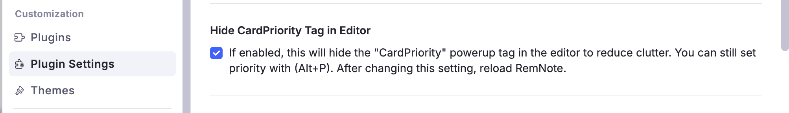
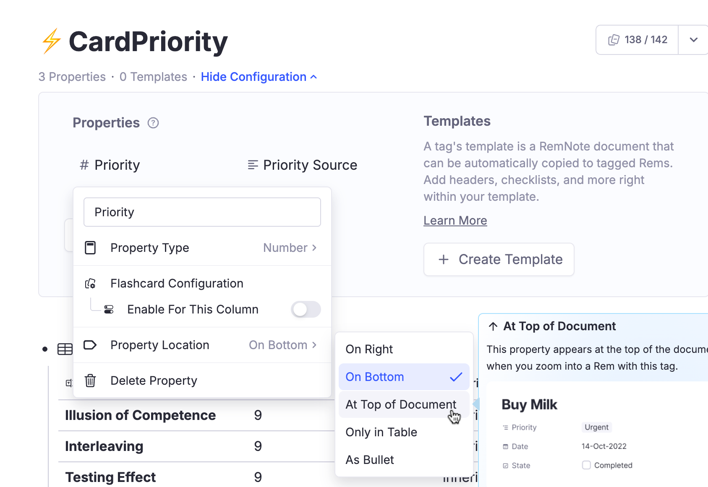
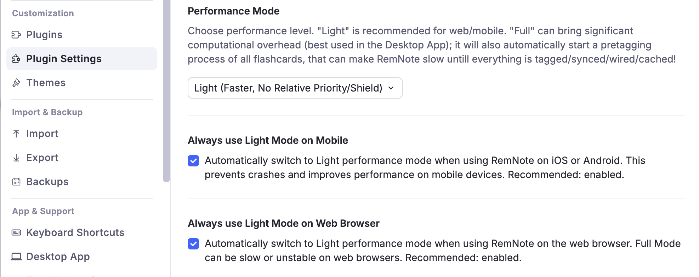
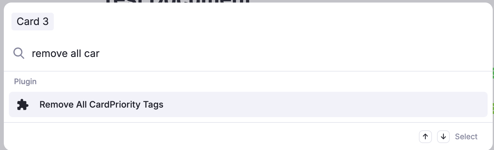

## Hiding the cardPriority tag

The cardPriority tag is hidden by default using injected CSS (see user settings - Hide CardPriority Tag in Editor).

{ width="700" }

## Hiding cardPriority properties (priority and source)

If you want also to hide the slots (properties) - priority and source: You can hide these properties as you would for any other tag: enter it and change the property location to "At top of Document" or "Only in Table":

{ width="800" }

## Removing cardPriority tags and its properties

If you want to remove these tags (cardPriority) and slots altogether of all your database, follow these steps:

- First, stop the plugin from writing new ones — otherwise they come straight back. Turn **Enable Flashcard Prioritisation** off (**Settings → Plugins → Incremental Everything**), or switch to "[Light Mode](Full-Mode-x-Light-Mode.md)".
{ width="700" }

- AFTER changing that setting, use the Omnibar to run the command **"Remove CardPriority Tags…"**. It asks which tags to remove:
    - **OK — inherited & default only:** removes the tags the plugin created by itself and keeps the priorities you set by hand. **Reversible.** This is what the plugin also offers to do for you on the first reload after you turn Flashcard Prioritisation off — see [Switching it back off](Priorities-for-Flashcards.md#switching-it-off).
    - **Cancel — remove everything:** wipes every cardPriority tag, manual priorities included, and clears this knowledge base's shield history. **This cannot be undone**, so it asks again and makes you type `REMOVE ALL` when manual priorities are at stake.

{ width="700" }

- Note 1: The command removes only flashcard priorities (stored in the cardPriority powerup). Incremental rems priorities are stored elsewhere (in the Incremental powerup) and will not be affected. (The plugin uses completely separated systems for the control of Incremental Rems priorities and flashcard priorities)
- Note 2: It only touches the knowledge base you have open — the one it names in its dialogs. Other knowledge bases are left alone.
- Note 3: If you turn Flashcard Prioritisation (or "Full mode") back on, the process of pre-tagging will happen again.

