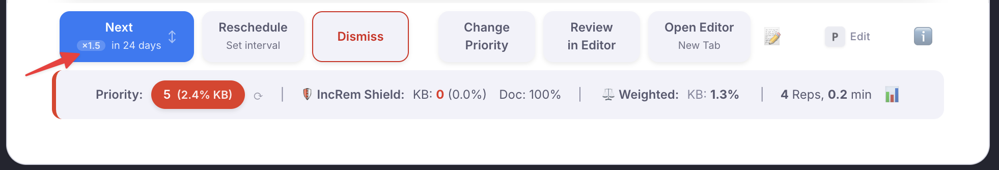
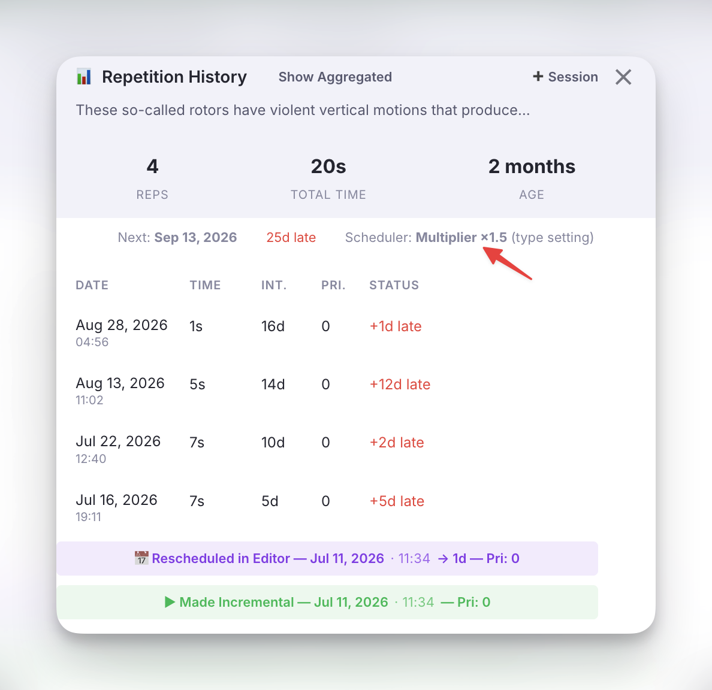
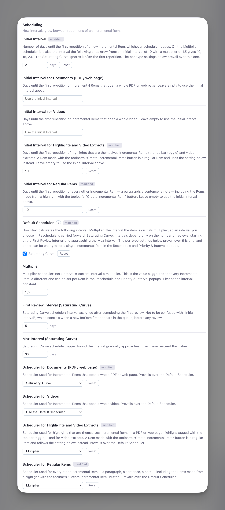

# IncRem Scheduler

This page explains how the plugin calculates the **next review interval** each time you press **Next** on an Incremental Rem, and how to choose which scheduler an item uses.

> [!NOTE]
> "Interval" here means _days until the next review **after** pressing Next_. This is separate from the **Initial Interval** setting, which controls how many days pass between tagging a Rem as incremental and its first appearance in the queue (before any review happens).

---

## Two schedulers { #two-schedulers }

Incremental Rems cover a **wide range of processing depth**, and no single rule suits all of them:

| Stage | Example | Typical reviews | What it needs |
|-------|---------|-----------------|---------------|
| 📕 Raw import | An entire PDF book | 20–50+ | To come back often enough to be finished |
| 📄 First extract | A chapter or section | 10–20 | The same, on a smaller scale |
| 📝 Refined extract | A paragraph | 5–10 | Growing gaps |
| 💡 Atomic fact | A sentence you already know well | 2–4 | Long gaps *you* choose, kept from one review to the next |

So the plugin has two schedulers, and every Incremental Rem uses one of them:

| | **Multiplier** | **Saturating Curve** |
|---|---|---|
| Next interval comes from | The interval the item is on | The number of reviews |
| Growth | Unbounded: × the multiplier at every review | Levels off below a ceiling |
| An interval you set in Reschedule | Is **kept** and multiplied from then on | Is a **one-off**; the curve resumes afterwards |
| Suits | Extracts, paragraphs, sentences | Books, chapters, long videos |

---

## Multiplier scheduler { #multiplier-scheduler }

```
next interval = ⌈ current interval × multiplier ⌉  days
```

The **current interval** is the one the item was last put on, whoever chose it: the previous **Next**, a [Reschedule](Reviewing-Items-in-the-Queue.md#reschedule) (in the queue or the editor), the [Priority & Interval popup](Plugin-Widgets-Reference.md) shown when the Rem was created, or a manual edit of the *Next Rep Date*. The **multiplier** defaults to the *Multiplier* setting (`1.5`) and can be changed for a single Rem.

That is the point of this scheduler: **an interval you choose is remembered.** Take a sentence you extracted from a book and know well, but must not forget. You give it 50 days when you create it. In 50 days you read it again and press Next:

| Review | Multiplier 1.5 |
|--------|----------------|
| Created with | **50 d** |
| 1st Next | **75 d** |
| 2nd Next | **113 d** |
| 3rd Next | **170 d** |

Left alone from the default 1-day Initial Interval, the same multiplier gives 2 → 3 → 5 → 8 → 12 → 18 days.

**Details worth knowing**

- **It uses the scheduled interval, not the time that actually passed.** Reviewing an item late, because the queue was overloaded, does not inflate its interval.
- **A multiplier of `1` keeps the interval constant** — "show me this every 50 days". The allowed range is 1 to 10.
- **A multiplier above 1 always moves the interval by at least a day**, and an interval of 0 counts as 1, so an item never gets stuck.
- **Swiping Next to "tomorrow" or "today" does not change the interval.** Those gestures mean "carry on soon", so the next Next still multiplies the interval the item had before the swipe.

!!! note "Replaces the old exponential scheduler"
    Before v1.0.148 the default scheduler was `⌈Multiplier ^ N⌉`, where N is the number of reviews. For an item you never reschedule the two give almost the same sequence. The difference is what happens after you choose an interval yourself: the old formula ignored it at the next review, the multiplier scheduler builds on it.

---

## Saturating Curve scheduler { #beta-scheduler }

The saturating curve ignores the interval the item is on and looks only at **how many times you have reviewed it**. It:

1. **Starts at a comfortable interval** you choose (default **5 days**).
2. **Gradually approaches a ceiling** you set (default **30 days**), growing slower the closer it gets.
3. **Never exceeds the ceiling**, so high-volume items are always revisited in time.

### Formula

```
interval = ⌈ firstReviewInterval + (maxInterval − firstReviewInterval) × (N−1) / (N−1+4) ⌉
```

**N** is the review number. The constant `4` controls how quickly the curve saturates: by review 5 you're **halfway** between your first-review interval and the max.

### Example progression (First Review Interval = 5, Max Interval = 30)

| Review | Fraction | Interval |
|--------|----------|----------|
| 1st | 0 % | **5 d** |
| 2nd | 20 % | **10 d** |
| 3rd | 33 % | **14 d** |
| 4th | 43 % | **16 d** |
| 5th | 50 % | **18 d** |
| 6th | 56 % | **19 d** |
| 8th | 64 % | **21 d** |
| 10th | 69 % | **23 d** |
| 15th | 78 % | **25 d** |
| 20th | 83 % | **26 d** |

Because it depends only on the count, a [Reschedule](Reviewing-Items-in-the-Queue.md#reschedule) on a curve item is a **one-time postponement**: the next Next returns to the curve. That is what you want for a book you push a month ahead while you read its prerequisites.

---

## Which scheduler an item uses { #which-scheduler }

Three layers decide, the most specific one winning:

1. **The Rem's own choice**, set in the Reschedule or Priority & Interval popup.
2. **The setting for its type**, if you set one.
3. **The Default Scheduler** setting.

### Per-type defaults { #per-type-defaults }

Each kind of Incremental Rem can have its own **scheduler** and its own **Initial Interval**:

| Type | Applies to |
|------|------------|
| **Documents (PDF / web page)** | A Rem that opens a whole PDF or web page, including a Rem that has one as its source |
| **Videos** | A Rem that opens a whole video |
| **Highlights and Video Extracts** | A PDF or web page highlight that is *itself* an Incremental Rem (the toolbar toggle), and video extracts |
| **Regular Rems** | Everything else: a paragraph, a sentence, a note |

- **Scheduler for …** starts at *Use the Default Scheduler*.
- **Initial Interval for …** starts empty, which means "use the general Initial Interval". Type a number of days to give that type its own; `0` means due today. It is what a new Rem of that type is scheduled with, and what the Priority & Interval popup suggests.

The Initial Interval matters most on the Multiplier scheduler, where it is the interval the following ones grow from: 10 days with a multiplier of 1.5 gives 10, 15, 23… On the Saturating Curve it only places the first repetition.

!!! warning "A Rem created from a highlight is a regular Rem"
    The highlight toolbar's **Create Incremental Rem** button makes a new, ordinary Rem holding the highlight's text. It follows the *Regular Rems* settings, not the *Highlights* ones.

A common setup: *Default Scheduler* = Saturating Curve for the raw material, *Scheduler for Regular Rems* = Multiplier for what you extract from it.

### Changing it for one Rem { #per-rem-scheduler }

The [Reschedule](Reviewing-Items-in-the-Queue.md#reschedule) popup (`Ctrl+J`) and the Priority & Interval popup both have a **Scheduler** row:

- `←` / `→` switch between **× Multiplier** and **Saturating Curve**.
- With the multiplier selected, `↑` / `↓` step its value by 0.1, or type a number.
- A line underneath previews what follows the interval you are setting, e.g. *After that: 75 → 113 → 170 days*, and another says whether the Rem now differs from the settings.

The choice is saved with the popup. A Rem only stores it when it **differs** from what the settings give it; choosing the same thing again clears it, and the Rem goes back to following the settings as you change them.

### Seeing which one is in use { #scheduler-indicator }

**Next button** — a small chip before the interval: `×1.5` for the multiplier, `curve` for the saturating curve. The chip is outlined when the scheduler was chosen for that Rem. Hover it for the details.

{ width="900" }

**Repetition History popup** — the line under the totals names the scheduler and where the choice comes from: *set for this Rem*, *type setting* or *default*.

{ width="500" }

---

## Settings Reference

All of these are in the **Scheduling** group of the [settings popup](Plugin-Settings-Reference.md#where-the-settings-are).

{ width="600" }

*Above: an example setup — whole documents on the Saturating Curve, highlights and regular Rems on the Multiplier with a 10-day Initial Interval.*

| Setting | Type | Default | Description |
|---------|------|---------|-------------|
| **Initial Interval** | Number | `1` | Days before a **new** IncRem first appears in the queue (before any review), on either scheduler. On the Multiplier scheduler it is also the interval the following ones grow from. |
| **Initial Interval for Documents / Videos / Highlights and Video Extracts / Regular Rems** | Text | *(empty)* | [Per-type](#per-type-defaults) Initial Interval in days. Empty = use the general one. |
| **Default Scheduler** | Multiplier / Saturating Curve | `Multiplier` | The scheduler used when neither the Rem nor its type says otherwise. |
| **Multiplier** | Number | `1.5` | Multiplier scheduler: `next interval = current interval × multiplier`. The value suggested for every Rem; `1` keeps the interval constant. |
| **First Review Interval (Saturating Curve)** | Number | `5` | Saturating Curve: interval in days after the **first** review. |
| **Max Interval (Saturating Curve)** | Number | `30` | Saturating Curve: ceiling the interval gradually approaches but never exceeds. |
| **Scheduler for Documents / Videos / Highlights and Video Extracts / Regular Rems** | Dropdown | `Use the Default Scheduler` | [Per-type defaults](#per-type-defaults) that prevail over the Default Scheduler. |

---

## How this compares to SuperMemo's A-Factors { #a-factors }

SuperMemo brings in its [documentation](https://help.supermemo.org/wiki/Incremental_learning):

>The algorithm for determining inter-review intervals for **topics** is much simpler and is entirely under your control. Each article receives a specific priority. The priority determines which articles are reviewed first and which can be postponed in case you run out of time. Each article is also assigned a number called the **A-Factor** that *determines how much intervals increase between subsequent reviews*. For example, if A-Factor is 2, review intervals will double with each review. Priority and A-Factors are set automatically, but you can change them manually at any time. Priorities and A-Factors are determined and modified heuristically on the basis of the length of the text, the way it is processed, the way it is postponed or advanced, and by many other factors.

The multiplier scheduler is the same idea: a per-item factor applied to the item's current interval. What the plugin does **not** copy is the automatic part. A multiplier is never adjusted behind your back from text length or postponements; it is the *Multiplier* setting until you change it for a Rem.

The reason for having it is convenience, not memory science. Spacing improves retention, but the theory of an *optimum* interval applies to active recall (flashcards). For passive reading there is no such thing as an optimum interval, so the goal is simply a scheduler that keeps the intervals you want with the least effort: one that remembers a long interval you chose for a sentence, and another that keeps a book coming back.

---

## Scheduling and the Queue

The scheduler described above determines **when** an Incremental Rem becomes due again. But once an item is due, how does the queue decide which item to show you first?

### Due Date is a Yes/No Gate

The due date is **not** a ranking factor. The queue does not care about *how overdue* an item is — whether it was due 1 hour ago or 3 months ago makes no difference. The due date serves purely as a **binary filter**:

- **Due** (`Date.now() >= nextRepDate`) → the item enters the pool of candidates.
- **Not due** → the item is excluded entirely.

An item that has been overdue for months receives no special treatment over an item that became due just now. This is by design: in the context of passive reading material, there is no meaningful "urgency" metric tied to overdue time the way there is for flashcards.

### Priority is the Sole Sorting Criterion

Among all items that pass the due-date filter, the queue sorts them strictly by **Priority** (lower number = higher priority). A Priority 5 item will always appear before a Priority 30 item, regardless of how long either has been waiting.

### Controlled Randomness

After sorting by priority, the [Sorting Randomness](Prioritization-&-Sorting.md#sorting-criteria) setting introduces a configurable degree of shuffling:

- **0% randomness**: The queue is fully deterministic — always the highest-priority due item first.
- **20% randomness** (default) **and above**: A slice of the sorted list is randomized via a [priority-weighted lottery](Prioritization-&-Sorting.md#how-randomness-works-the-priority-weighted-lottery) — lower-priority items get a chance to surface, but the items pulled forward are drawn in proportion to their priority weight (not uniformly). This prevents the queue from becoming too rigid while keeping the priority gradient intact, so **higher settings stay safe**. *(Note: the slider is non-linear and eases in, so the left portion finely tunes small amounts while the middle reaches a meaningful ~25%.)*

### See Also

- [How the Incremental Queue takes priority and due date in consideration](How-the-Incremental-Queue-takes-priority-and-due-date-in-consideration.md)
- [Does the plugin prioritize items that are due today over older items?](Does-the-plugin-prioritize-items-that-are-due-today-over-older-items%3F.md)
