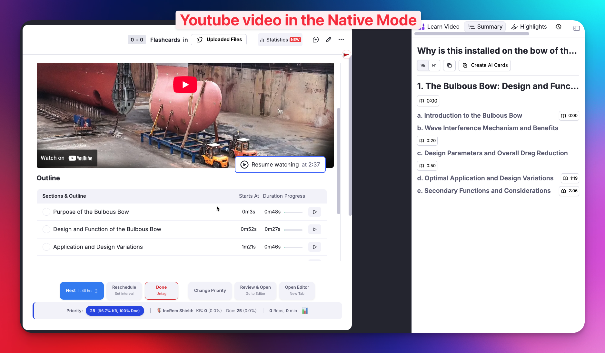
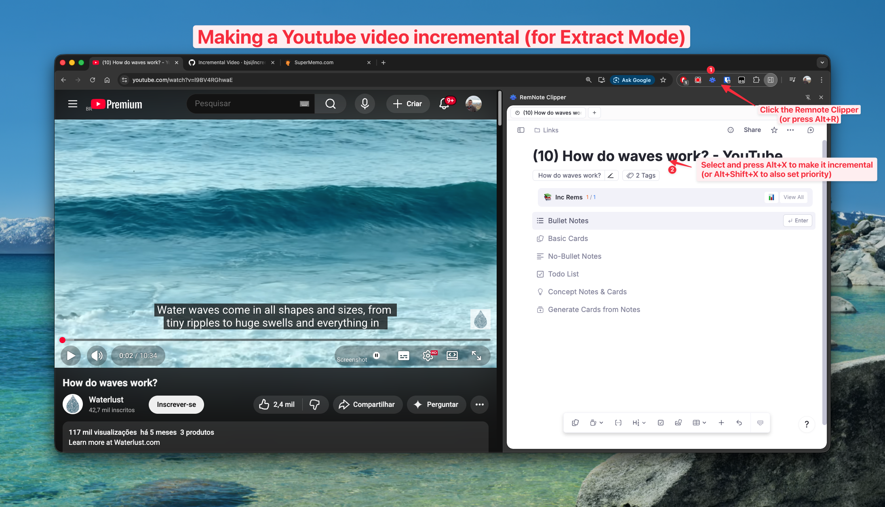
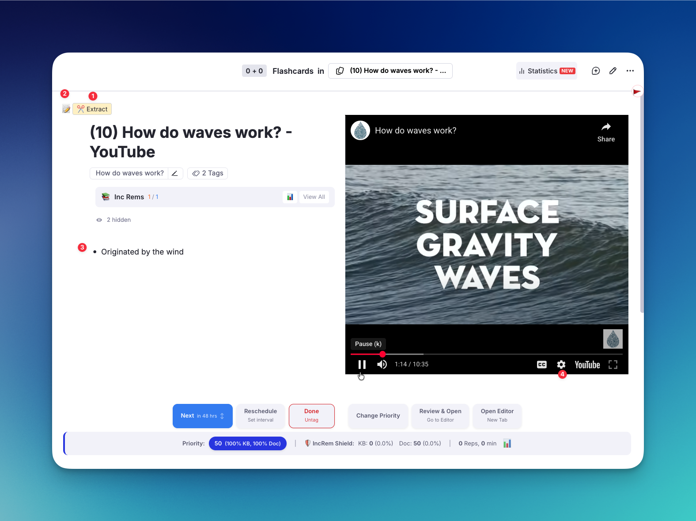

# Incremental Video

## The Philosophy of Incremental Video

Video is one of the richest sources of knowledge available today. Lectures, tutorials, talks, and documentaries carry information that can't always be captured by reading alone — tone of voice, visual demonstrations, and live reasoning all contribute to deeper understanding.

However, watching a full video in a single sitting often leads to the same problem as traditional reading: **massive input with poor retention**. Most of what we watch is forgotten within days. Even worse, we tend to re-watch entire videos just to find a single passage that mattered.

**Incremental Video** applies the principles of [incrementalism](What-is-Incrementalism?.md) to video content. Instead of watching a video from start to finish, you:

1. **Watch in segments** — process a video gradually across multiple review sessions
2. **Extract key passages** — mark important segments with precise start/end times
3. **Prioritize what matters** — assign priorities so the most important segments surface first
4. **Interleave with other material** — mix video segments with readings, flashcards, and notes in a single session

This mirrors how incremental reading breaks articles into manageable extracts. The goal is the same: **fluent transition from passive consumption to active retention**, guided by priorities.

In [SuperMemo's terminology](https://help.supermemo.org/wiki/Incremental_video), incremental video ensures that "the student can process far more video material than conventional viewing can allow" — because the student is always reviewing the *most important* segments first, at optimum intervals, rather than rewatching entire videos.

---

## How It Works

### Two Ways to Watch: Native Mode vs. Extract Mode

There are two ways a YouTube video Incremental Rem can be displayed in the queue, each with different capabilities:

#### Native Mode (Default)

When you paste a YouTube URL directly into RemNote and make the Rem incremental, the plugin uses RemNote's **built-in video player** (NativeVideoViewer). This happens because RemNote processes the YouTube URL internally in a way that prevents the plugin from retrieving it.

**Benefits:**
- All of RemNote's native YouTube features: **highlight moments**, **AI Summary**, **AI Tutor**
- Familiar RemNote experience

**Limitations:**
- ❌ **No Video Extracts** — the Extract button is not available
- ❌ **No session-level position tracking** — RemNote saves your last playback position, but if you open the video outside an Incremental Session (e.g., in the editor), its position resets. Your next Incremental Session will start from that point, not from where the last session left off.
- ❌ **No automatic transcription**



#### Extract Mode (via RemNote Clipper)

To enable **Video Extracts and automatic transcription**, import the video using the [RemNote Clipper browser extension](https://chromewebstore.google.com/detail/remnote-clipper/lpnnhhkdbmobjiheokoonjlmaffljcng) for Chrome. The Clipper stores the YouTube URL as a normal link that the plugin can capture and use with its own custom video player.



**Benefits:**
- ✅ **Video Extracts** (1) — mark specific passages with start/end times
- ✅ **Session-level position tracking** — resume where you left off in each Incremental Session
- ✅ **Automatic transcription** (macOS, with local proxy)
- ✅ Adjustable playback speed (4)
- ✅ Side-by-side notes panel (2)(3)




**Limitations:**
- Does not have RemNote's built-in YouTube features (highlight moments, AI Summary, AI Tutor)

> **Which should I use?** If you plan to create extracts from the video (recommended for lectures and long content), use the **RemNote Clipper**. If you just want to watch and take notes with RemNote's AI tools, paste the URL directly.

### The Video Component (Extract Mode)

When reviewing a video imported via the Clipper, the plugin displays its custom embedded video player with:

- **Playback controls**: Play/pause, seek, and playback speed adjustment
- **Position tracking**: Your playback position is saved automatically between Incremental Sessions, so you resume where you left off
- **A notes panel** (📝 button): Toggle the editor side-by-side with the video to take notes while watching
- **Extract controls**: Create Video Extracts from specific passages (see below)

### Creating Video Extracts

Video Extracts let you mark a specific segment of a video as a new Incremental Rem — with its own schedule, priority, and child notes.

#### Step-by-step:

1. **Start watching** the video in your queue
2. Click **✂️ Extract** at the point where the important passage begins
   - The current timestamp is recorded as the **start time**
   - A green indicator shows `▶ Start: MM:SS` and tracks the current position
3. **Continue watching** until the passage ends
4. Click **Set End** to finalize the extract
   - The video **pauses automatically** so you can set a priority without distraction
   - The Priority popup appears for you to assign a priority
5. The extract is created as a child Rem with the label `Video Extract [MM:SS – MM:SS]`

The extract becomes a new Incremental Rem in your queue. When you review it later, it opens the video **directly at the start time** of the passage — no need to search through the video again.

> **Tip:** You can create multiple extracts from the same video. Each one keeps its own start/end time, priority, and schedule. This is perfect for lectures where only certain sections are relevant.

[](https://youtu.be/o5I-UL9SG0E)


---

## Automatic Transcription (macOS)

> [!NOTE]
> Currently down after YouTube recent anti-bot measures

When creating a Video Extract, the plugin can automatically fetch the YouTube transcript for that segment and save it as a child Rem under the extract. This makes the spoken content searchable and reviewable as text, and makes it much easier to process the content (create flashcards, summarize, etc).

### How It Works

Transcript fetching uses a small local proxy server that runs on your machine. This is necessary because YouTube's transcript API requires requests from a residential IP address — cloud-hosted proxies (like Cloudflare Workers) are blocked by YouTube.

The proxy:
- Uses **zero external dependencies** — runs with Node.js built-in modules only
- Listens on `http://localhost:3456`
- Fetches YouTube caption data through YouTube's internal API
- Parses captions and returns clean text segments
- Stays running in the background, using virtually no resources when idle

### Setup Instructions

#### Prerequisites
- **Node.js** installed (check with `node --version` in Terminal)

#### Option A: Auto-start on Login (Recommended)

This installs the proxy as a macOS LaunchAgent — it starts automatically when you log in and restarts if it crashes.

1. In Terminal, copy the LaunchAgent plist:
   ```bash
   cp ~/incremental-everything/com.incrementaleverything.yt-transcript-proxy.plist ~/Library/LaunchAgents/
   ```

2. Load the agent (replace `501` with your user ID — run `id -u` to check):
   ```bash
   launchctl bootstrap gui/501 ~/Library/LaunchAgents/com.incrementaleverything.yt-transcript-proxy.plist
   ```

3. Verify it's running:
   ```bash
   curl http://localhost:3456/
   ```
   You should see: `{"status":"ok","message":"YouTube Transcript Proxy running"}`

**To stop the proxy:**
```bash
launchctl bootout gui/501/com.incrementaleverything.yt-transcript-proxy
```

#### Option B: Manual Start

Run the proxy manually whenever you want transcripts:

```bash
node ~/incremental-everything/yt-local-proxy.js
```

You'll see:
```
🎬 YouTube Transcript Proxy running on http://localhost:3456
```

Keep this terminal window open while using the plugin. Press `Ctrl+C` to stop.

### What You Get

When you create a Video Extract with the proxy running, the transcript for that time range is automatically fetched and saved as child Rems under the extract. The text is consolidated into readable blocks (~300 characters each) rather than individual word-level segments.

If the proxy is not running or the video has no captions available, the extract is still created normally — transcription is a best-effort enhancement that fails silently.

### Notes

- **Language**: The proxy attempts to fetch English captions by default. Auto-generated captions (ASR) are supported.
- **Availability**: Not all YouTube videos have captions. Videos with captions disabled or private videos will not return transcripts.
- **Proxy logs**: If something isn't working, check the Terminal running the proxy for `[Proxy]` log messages, or check `/tmp/yt-transcript-proxy.log` if using the LaunchAgent.

---

**See also:**
- [What is Incrementalism?](What-is-Incrementalism%3F.md)
- [PDF Incremental Reading Workflow](PDF-Incremental-Reading-Workflow.md)
- [Reviewing Items in the Queue](Reviewing-Items-in-the-Queue.md)
