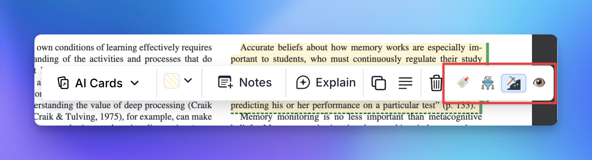

# PDF Incremental Reading Workflow

This page documents how to use the **Incremental Everything** plugin to incrementally read long PDFs by breaking them into chapters or sections, each managed as a separate Incremental Rem.

---

## Overview: The Full Incremental Workflow

The **Incremental Everything** approach to PDFs is designed to support deep reading without feeling overwhelmed. The workflow typically looks like this:

1. **Split & Prioritize**: Instead of one massive PDF to read, you create multiple Incremental Rems for the PDF (e.g., one per chapter or section) and assign each a priority.
2. **Read in the Queue**: When a chapter is due, it appears in your Queue. The PDF Reader automatically opens at your last saved reading position.
3. **Extract & Organize**: As you encounter important information, you use PDF highlights. With the PDF Highlight Toolbar utilities, you can easily turn these highlights into their own Incremental Rems, seamlessly organizing them into your Knowledge Base structure.
4. **Track Position & Deep Link**: When you extract information (or toggle a highlight as incremental), the plugin **automatically saves that highlight's page as your current reading position**. Furthermore, if you extract sub-text from those Incremental Rems later, the new sub-extracts will smartly inherit a reference pin bridging directly back to the original PDF highlight!
5. **Manage Globally**: Use the **PDF Control Panel** to manage all chapters from a single interface.


---

## Step-by-Step Setup

The core idea is to **link multiple Incremental Rems to the same PDF**, each covering a different page range. This lets you:

- Queue chapters independently with their own priorities and schedules
- Use the **PDF Control Panel** to manage all chapters from a single interface
- Switch between reading the PDF and processing your notes per chapter

### 1. PDF Structure Setup

```
📁 Book Title (folder rem, contains the PDF)
  ├── Chapter 1  ← Incremental Rem, PDF source, pages 1–50
  ├── Chapter 2  ← Incremental Rem, PDF source, pages 51–120
  └── Chapter 3  ← Incremental Rem, PDF source, pages 121–200
```

1. Create a parent folder rem for the book and add the PDF as its source (or as a direct child rem).
2. Create child rems for each chapter.
3. Tag the first chapter as Incremental (`Alt+X`) and add the PDF as its source.
4. Use **Copy & Paste Rem Sources** (below) to efficiently propagate the PDF source to all other chapters.
5. Open **PDF Control Panel** (`Command Palette → PDF Control Panel`) on any of the rems with that PDF source to assign the page range to all chapters.

---

## 2. Copying and Pasting Sources

When you have many chapters, manually adding the PDF source to each one would be tedious. Two commands automate this:

| Command | Shortcut | Description |
|---------|----------|-------------|
| **Copy Rem Sources** | `Ctrl+Shift+F1` | Copies all sources from the **focused Rem** into a session clipboard |
| **Paste Rem Sources** | `Opt+Shift+V` / `Alt+Shift+V` | Adds the copied sources to **all selected Rems** (or the focused Rem if nothing is selected) |

### Workflow

1. **Focus** your template chapter (the one already linked to the PDF).
2. Press `Ctrl+Shift+F1` → a toast confirms how many sources were copied (e.g., *"📋 1 source copied"*).
3. **Select** all remaining chapter rems in the outliner (hold `Shift` and click, or use `Shift+↑/↓`).
4. Press `Alt+Shift+V` → each selected rem receives the same PDF source. A summary toast reports how many sources were added and how many were already present.
5. Open **PDF Control Panel** on any chapter to set page ranges.

> [!TIP]
> The paste operation is **idempotent** — sources already present on a target rem are silently skipped. You can safely run paste multiple times or on a mix of rems that already have the source and rems that don't.

> [!NOTE]
> The clipboard is **session-scoped** — copied source IDs are stored in session storage and discarded when you close the tab. There is no cross-session contamination.

{ width="900" }

---

## 3. PDF Control Panel

The **PDF Control Panel** (`Command Palette → PDF Control Panel`) is the central hub for managing all rems that share the same PDF.

**Features:**
- Set and adjust the page range for each chapter
- Edit priorities inline with visual feedback
- View reading histories and time spent
- Make rems Incremental without leaving the panel
- Sort chapters by page range for logical reading progression

### Hierarchical Tree View

The **All Rems Using This PDF** list builds a **containment tree** based on page ranges:

- If a rem's range is **fully contained** within another's (e.g. a sub-section inside a chapter), it appears **indented** below the parent.
- Each rem is placed under the **tightest** range that contains it, so a sub-sub-section nests under its sub-section rather than jumping straight to the chapter.
- Depth-based indentation (16 px/level) makes nesting visible at a glance.
- Rems without an assigned page range float below the tree at depth 0.

This is useful when you split a chapter into sub-sections during incremental reading — you can see the exact hierarchy without any manual tagging.

**Page ranges are the only thing that builds the tree.** Where a rem lives in your knowledge base is never consulted for nesting. If you scatter a book's sections across unrelated parts of your KB, a snippet *4.1 Introduction* with range 30–40 still nests under a *Chapter 4* snippet with range 30–60, because 30–40 sits inside 30–60. The reconstruction is purely geometric, which is what makes it survive any amount of reorganisation.

A chapter and its first sub-section usually **start on the same page** (Chapter 4 opens on p.30, and so does 4.1). Ties on the start page are resolved by putting the **wider** range first, so the chapter is always recognised as the container.

**Reading order:** the list is emitted depth-first — each rem is followed immediately by its own sub-tree, then the next rem at that level. So you read it top to bottom in page order, with every child directly beneath the parent it belongs to.

> [!NOTE]
> The current rem is marked by its highlighted border and a **Current** chip, and the panel scrolls it into view when it opens. It is *not* pulled to the top of the list — doing so would break the containment ordering above.

**Overlap detection:** If two siblings have genuinely overlapping ranges, an inline **⚠ overlap** badge appears on both. Shared boundary pages (one chapter ends on page 265, the next starts on page 265) are **not** flagged.

**Coverage badge:** Parent rows show an **X/Ypp** badge with a tiny fill bar indicating how many pages are already covered by child rems. Hover to see the percentage (e.g. `"25 of 30 pages covered by sub-rems (83%)"`). This tells you at a glance how much of a chapter still needs to be sub-divided.

{ width="650" }

### Dismissed Chapters in the Panel

Dismissing a chapter stops it being scheduled, but it keeps its page range and reading history (see [v1.0.34](Changelog.md#v1034-august-5th-2026)). Such a chapter still appears in the tree, nested by its range like any other, and carries a **Dismissed** chip so you can tell it apart from a rem that was never Incremental — otherwise the two look identical, since neither shows the ⚡ or a priority badge.

Expanding a dismissed row offers:

| Action | Available | Why |
|---|---|---|
| **📄 Range** | ✅ | The range is stored with the chapter and stays editable, so you can keep the book's map accurate without reviving anything. |
| **📖 History** | ✅ | Same — the reading position and history travel with the rem. |
| **★ Priority** | ❌ | A priority only means something for a scheduled rem; a dismissed one has none to edit. |
| **⚡ Restore** | ✅ | Makes it Incremental again, resuming at the page it was left on and merging the history from before it was dismissed. |

A rem that has **neither** been made Incremental nor dismissed — the book's own document rem, say — offers only **Make Incremental**. It has nowhere to keep a page range yet, so there is no range to edit.

---

## 4. PDF Highlight Toolbar Utilities

When you select text in the PDF Reader and create a highlight, the native RemNote popup toolbar appears. The plugin injects four widgets into this toolbar to help you process and organize information on the fly:

| Icon | Tool | Description |
|------|------|-------------|
| 🔖 | **Set Bookmark Position** | Manually records your current reading position at this highlight's exact page. *(Note: Using the extraction tools below will also do this automatically).* |
| { width="16" } | **Create Incremental Rem** | Extracts the highlight into a standalone Incremental Rem and lets you choose precisely where it should live in your Knowledge Base hierarchy. See the [Create-Incremental-Rem-from-PDF-Highlights](dedicated-guide-here.md) for full details. |
| { width="16" } | **Toggle Incremental Rem** | Quick-tags the highlight itself as an Incremental Rem without moving it. The button background turns blue to indicate the highlight is now actively tracked in your queue. |
| 👁️ / 🙈 | **Toggle Marker Borders (Peek)** | Shows/hides the extract & incremental **marker borders** (see below) over all PDF highlights, so you can read a busy page cleanly. Turns amber while markers are hidden. Also available as the **Toggle PDF Highlight Marker Borders** command (quick code `tb`), and remembered per device (default: on). |

{ width="700" }

### Visual Recognition: Extract & Incremental Markers

Once you've processed a highlight, it's marked **directly in the PDF** so you can recognize its state at a glance — **without changing the highlight's original color**. Each processed highlight gets a subtle **dashed underline + a thin colored right bar** drawn on top of it, in the tag's colour:

- 🔵 **Blue** — the highlight has been **extracted** into a standalone Incremental Rem (via **Create Incremental Rem**).
- 🟢 **Green** — the highlight has been **toggled incremental** in-place (via **Toggle Incremental Rem**).

The original background is preserved (the markers sit over it), so recognition never fights with RemNote's own highlight colors. The right bar sits in the free right margin as the reliable block marker; the dashed underline reinforces it at block edges.

> **Peek to read cleanly.** If the markers ever get in the way, use the **👁️ / 🙈 button** in the toolbar (or the *Toggle PDF Highlight Marker Borders* command, quick code `tb`) to hide them all at once, then toggle back. The setting is remembered per device.

{ width="800" }

{ width="800" }

### Automatic Position Tracking
A major benefit of using the **Create Incremental Rem** or **Toggle Incremental Rem** tools while you are reviewing a chapter in the Queue is that the plugin **automatically assumes you have read up to that highlight's page**.

It will seamlessly update the bookmark/reading position for the current chapter, so the next time the item is due, you will be taken right back to where you left off — no need to manually click the 🔖 button.

### 🔖 Set Bookmark Position — Queue Behaviour

When you click 🔖 while reviewing in the Queue, the popup opens instantly (no search overhead) and shows a single **"Update Current Queue Reading"** button pre-targeted at the active chapter. Clicking it saves the bookmark and **closes the popup automatically** so you can continue reading without an extra click.

- Outside the Queue, the popup falls back to showing all Incremental Rems linked to this PDF (the full list), letting you choose which chapter should receive the bookmark.

---

## 5. Document Notes (Side-by-Side Reading)

When reading a PDF or HTML Incremental Rem in the queue, you can easily pull up the document's notes in the right sidebar. This lets you read the source material and write notes simultaneously without constantly switching contexts.

- Click the **📝 Document Notes** icon in the document's top bar (next to the breadcrumbs).
- The document's own Rem opens in the Right Sidebar.
- You can write notes, organize extracts, or add new child rems directly into the document's hierarchy while the PDF remains visible on the left.
- The sidebar dynamically syncs with the queue: it shows the notes when you are reviewing an applicable IncRem, and gracefully shows an empty state during flashcard turns.

**Highlight IncRems:** The sidebar also works when reviewing **PDF Highlight** or **HTML Highlight** Incremental Rems. Since highlights are linked to the source PDF/HTML document (not directly to the reading IncRem that created them), the sidebar automatically discovers all Incremental Rems that read the same source. If multiple are found, a selector is shown so you can choose which IncRem's notes to view. If only one exists, it is auto-selected.


{ width="800" }

---

## 6. Flexible Processing Modes

Each chapter rem can be opened in two modes, controlled by tags:

### Default Mode (PDF Reader)
Without any special tag, selecting a chapter in the queue opens the PDF Reader at the configured page range. This is the standard reading mode.

### ExtractViewer Mode
Add the **`extractviewer`** tag to a chapter rem to open it in the ExtractViewer instead. This lets you see your notes and children, process highlights, and work with your extracted material — all without losing the PDF source connection needed for the PDF Control Panel.

Toggle behavior simply by adding or removing the `extractviewer` tag:

| State | Opens in |
|-------|----------|
| No tag | PDF Reader (configured page range) |
| `#extractviewer` tag | ExtractViewer (notes and children) |

> [!TIP]
> If the chapter has a **[read point](Reviewing-Items-in-the-Editor.md#read-points-for-rem-type-incremental-rems)** set on a descendant, you don't need the tag to peek at the outline: a **📑 View outline / 📄 Read document** toggle appears in the top-right of the queue card, letting you flip between the PDF reader and the outline view **per session** without re-tagging. The `#extractviewer` tag is for making the outline the **permanent default** for that chapter. See [Reviewing-Items-in-the-Queue#the-answer-buttons](Reviewing-in-the-Queue-→-hybrid-toggle.md).

### Multiple PDF Sources — Active PDF, Switcher, and `#preferthispdf`

An Incremental Rem can now have **as many PDF sources as you like**, and you can switch between them on the fly. The plugin tracks an **active PDF** per Inc Rem — pinned in the Rem's own hidden *Reading State* property, alongside its page position, page range and page history — and applies the same resolution chain everywhere a PDF is opened or displayed.

**Resolution chain (applied uniformly across queue Reader, PDF Control Panel, Priority Editor, Editor Review Timer, Execute Repetition popup, bookmark popup, etc.):**

| Step | What's checked | Outcome |
|------|----------------|---------|
| 1 | Explicit **active pin** (set via the switcher UIs below) | Wins if the pinned PDF is still a source. Stale pins auto-clear. |
| 2 | A PDF tagged **`#preferthispdf`** | Used when no pin is set. If multiple PDFs carry the tag, the first one wins (graceful — no blocking toast). |
| 3 | First PDF source on the rem | Final fallback. |

> [!NOTE]
> Previously, an IncRem with 2+ PDF sources and no `#preferthispdf` tag fell through to the **ExtractViewer** instead of opening any PDF in the Reader. That's no longer the case — the Reader opens on the first PDF and lets you switch from there. (Adding the `#extractviewer` tag remains the explicit way to opt back into ExtractViewer behaviour.)

**Where the switcher appears:**

| Surface | Switcher style | Pin behaviour |
|---------|---------------|---------------|
| **Reader** (queue) — next to the 📝 Document Notes icon | Dropdown of all PDFs | Pins on switch (you're reading this one now) |
| **Editor Review Timer** widget — next to the page controls | Compact dropdown | Pins on switch |
| **Execute Repetition** popup (`Ctrl+Shift+J` in editor) — above the Page Controls | Dropdown picks the PDF "Start Timer" will open | Pins on switch |
| **PDF Control Panel** — header row | Full dropdown with **★ #preferthispdf** and **📌 active** markers | Selecting changes the panel's *view only*; a separate **📌 Set as active** button (only visible while inspecting a non-active PDF) commits the pin |
| **Editor Toolbar** (rem sidebar) — inside the PDF Range section | Same dropdown + markers | Same view/pin split as the PDF Control Panel |

The selector only appears when the Inc Rem has **two or more** PDF sources. Single-PDF Inc Rems look exactly as before.

**Why two flavours of pin behaviour?**
- In **active-reading surfaces** (Reader, Timer, Execute Repetition popup), switching the dropdown is the same gesture as "I'm reading this PDF now" — so it pins immediately and the rest of the UI re-targets the new PDF.
- In **management surfaces** (PDF Control Panel, Editor Toolbar), you often want to *inspect* a different PDF's data (range, history, stats) without changing the queue default. The dropdown changes the view only; the **📌 Set as active** button is the explicit commit.

---

## 7. Inline PDF Range Management (Priority Editor)

For a faster workflow when the PDF is open on the right side of the screen, you can manage a rem's page range **directly from the Priority Editor** sidebar widget — without opening any popup.

The Priority Editor (shown to the right of every Incremental Rem in the editor) gains a **📄 PDF Range** section whenever the current rem has a PDF source:

| State | What you see |
|-------|--------------|
| No range set yet | Dim `📄 —` indicator in collapsed view; "No range" label in expanded view |
| Range set | `📄 p.X–Y` pill in collapsed (includes the current reading position in green parenthesis, e.g. `(Z)`, if history exists); range badge + action buttons in expanded |

**Available actions in expanded view:**

- **📄 Range — Inline range editor**
  - Tab cycles between Start → End fields; Enter saves.
  - Both fields auto-select their value on focus so you can just type the new number.
- **📖 Position — Record reading position**
  - Defaults to the last recorded page, or the first page of the range the first time.
  - Validates the entry: if the page is outside the rem’s assigned range, the border turns red and Save is disabled.
  - Enter saves when valid.
- **Reading stats** — Total reading time (⏱️) and last recorded page appear below the buttons.
- **PDF Control Panel ↗** — Opens the full PDF Control Panel popup for deeper management.

{ width="800" }

> [!TIP]
> Open a document, keep the PDF visible on the right side, and expand the Priority Editor on the left. You can then set and adjust page ranges for each chapter rem without ever leaving the document view.

{ width="900" }
---

## Summary

| Feature | How |
|---------|-----|
| Link chapters to a PDF | Add PDF as source to each chapter rem |
| Quickly propagate sources | **Copy Rem Sources** (`Ctrl+Shift+F1`) → select chapters → **Paste Rem Sources** (`Alt+Shift+V`) |
| Assign page ranges | PDF Control Panel (`Command Palette → PDF Control Panel`) or inline via the **Priority Editor** |
| Read a chapter | Queue the chapter — opens PDF Reader at its configured pages |
| Process notes | Add `#extractviewer` tag to open in ExtractViewer |
| Multiple PDF sources | Use the PDF switcher (Reader / Timer / Execute Rep popup / PDF Control Panel / Editor Toolbar) to switch and pin an active PDF. Optional: tag one source with `#preferthispdf` as the default. |
| See sub-section hierarchy | Containment tree in the PDF Control Panel (depth-based indentation) |
| See chapter coverage | Coverage badge (X/Ypp + fill bar) on parent rows in the PDF Control Panel |
| Record reading position | **📖 Position** button in Priority Editor, or History button in PDF Control Panel |

---

## Troubleshooting: Rem Not Appearing in the PDF Control Panel

### Why this happens — an SDK limitation

The RemNote plugin SDK does not expose a query equivalent to *"find all rems that have this rem as a source"*. There is no `remsHavingThisAsSource()` call the way there is `remsReferencingThis()` or `taggedRem()`. This means the plugin has no direct way to enumerate every rem that shares a given PDF source.

### How the plugin searches

When you open the PDF Control Panel, `getAllIncrementsForPDF` discovers rems through three strategies executed in order:

| Strategy | What it covers | Speed |
|----------|---------------|-------|
| **1. Local tree scan** | Parent rem, all siblings, and descendants up to 3 levels deep — the most common case for chapter rems nested under the same book folder | Fast |
| **2. IncRem cache scan** | All rems currently tagged as Incremental — covers any IncRem anywhere in your KB that already went through the queue | Medium |
| **3. Persistent index** (`known_pdf_rems_*`) | A synced-storage list of rem IDs explicitly registered as users of this PDF — covers rems discovered in previous sessions or registered via the Copy/Paste commands | Fast |

The persistent index is updated in the following situations:
- When a rem is **found** by strategies 1 or 2 (it gets added to the index automatically)
- When you run **Copy Rem Sources** (the template rem is registered immediately for all its PDF sources)
- When you run **Paste Rem Sources** (each target rem is registered for each PDF source that was added)

### What to do if a rem is still missing

> [!NOTE]
> If a rem you assigned the PDF source to does not appear in the PDF Control Panel list, it simply means the plugin has not "seen" it yet through any of the three strategies above.

**Try these steps in order:**

1. **Open the PDF Control Panel from the missing rem itself.**
   Focus the rem, open the Command Palette, and run *PDF Control Panel*. The plugin will discover the rem via widget context detection and add it to the persistent index. The next time you open the panel from any other chapter, this rem will appear.

2. **Use Copy & Paste Rem Sources.**
   Even if you already assigned the PDF manually, running *Copy Rem Sources* (`Ctrl+Shift+F1`) on the rem and then *Paste Rem Sources* (`Alt+Shift+V`) back onto it (i.e., target = itself) will write it into the index.

3. **Tag the rem as Incremental and queue it once.**
   The IncRem cache scan (strategy 2) runs every time the panel opens and covers all rems tagged with `#Incremental`. Once the rem passes through the queue at least once, it will always be discoverable.

4. **Wait for the next full panel open from another chapter.**
   Strategy 1 (local tree scan) searches siblings and cousins up to 3 levels. If all your chapters share the same parent folder, they will all be found the first time any one of them opens the Control Panel.