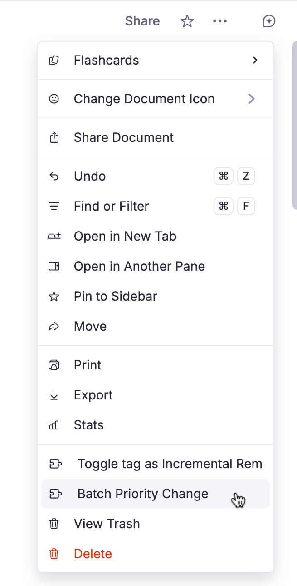
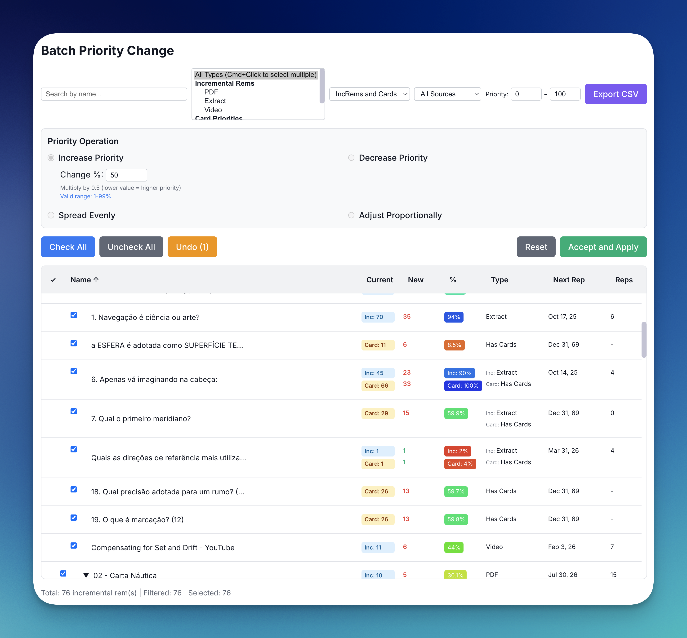
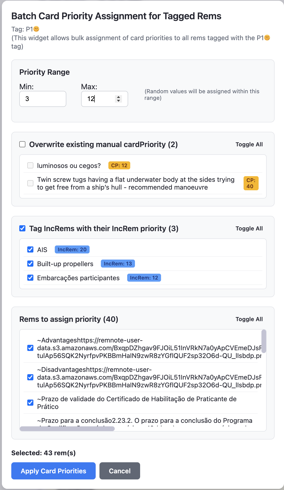
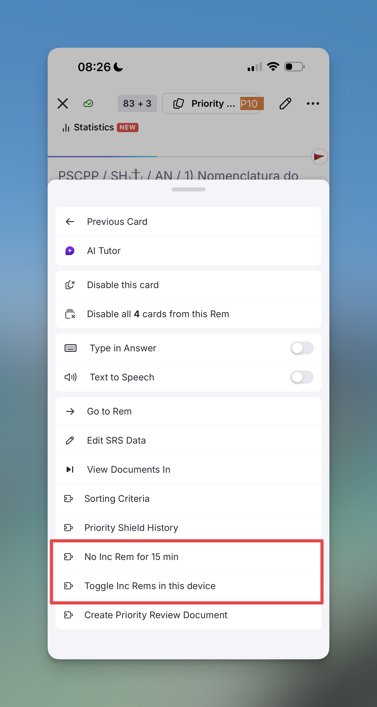
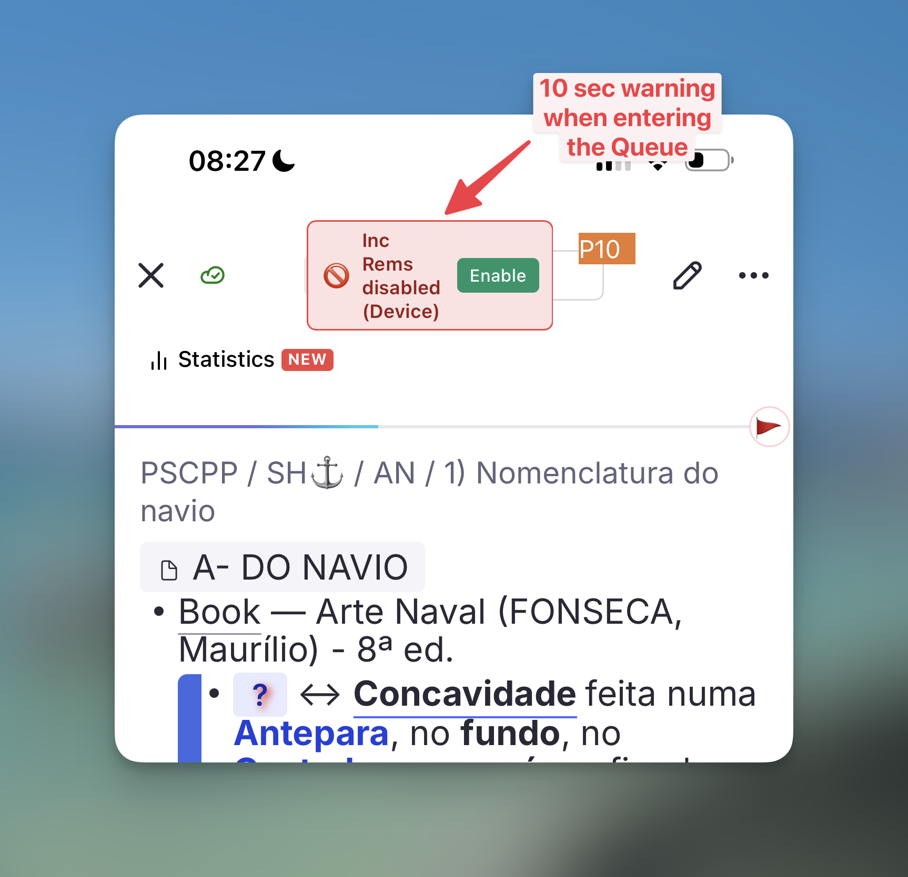
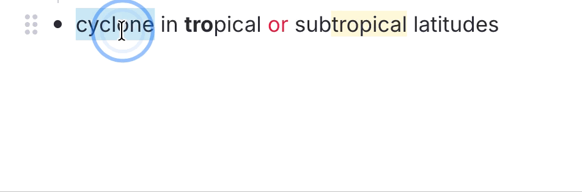

# Plugin Commands Reference

This is a complete list of commands registered in RemNote by the **Incremental Everything (Plus)** plugin. You can access these via the Command Palette (`Cmd+/` / `Cmd+/` or `Cmd+K` / `Ctrl+K`) or their assigned keyboard shortcuts.

See the [Keyboard Shortcuts](Keyboard-Shortcuts.md) page for default bindings.

> [!NOTE]
> **Selection-Aware Behavior:** Most commands are now context-aware. If you are in the Flashcard Queue but have explicitly focused a different Rem in the **Preview Document** pane, the command will prioritize your active editor selection over the current flashcard. This allows you to adjust priorities or view history for surrounding material without losing your place in the queue.

## Core Incremental Commands

- **[Make Incremental (Extract)](Getting-Started.md#making-a-rem-incremental)** (`Opt+X` / `Alt+X`) — `quick: ext`
  Tags the focused Rem with the `#Incremental` powerup.
  **Text Selection:** If text is selected in the editor, it performs a **[Reviewing-Items-in-the-Editor#extracting-text](Text-Extract.md)** (see below). If no text is selected, it initializes the current Rem with inherited or default priority.

- **[Extract with Priority](Getting-Started.md#making-a-rem-incremental)** (`Opt+Shift+X` / `Alt+Shift+X`) — `quick: ep`
  Tags the target with the `#Incremental` powerup and immediately opens the **Priority & Interval Popup**.
  **Text Selection:** Performs a **[Reviewing-Items-in-the-Editor#extracting-text](Text-Extract.md)**, creating a new child Rem from the selected text. The source text is highlighted in **blue**, and a **reference pin** to the new extract is inserted immediately after. The new extract includes a back-reference to the parent. The source Rem is also hidden from queue display so its slot doesn't show redundantly during review of the extract — the mechanism depends on what's installed: **Remove from Queue** powerup on the parent (preferred, survives extract relocation) when the [Hide-in-Queue integration](Utilities.md#queue-display-utilities) is enabled or the standalone Hide in Queue plugin is installed; otherwise **Remove Parent** powerup on the extract itself (fallback — see [Create Extract behavior](Utilities.md#create-extract-source-rem-hiding-behavior)). If you extract from a PDF highlight, the new sub-extract will also automatically inherit a reference pin bridging directly back to the original PDF source!
  **Multi-rem selection:** When multiple Rems are selected, all are initialized as Incremental and the popup opens in **batch mode**.


- **[Reschedule Incremental Rem](Reviewing-Items-in-the-Queue.md#reschedule)** (`Ctrl+J`) — `quick: res`
  Manually pick a new target date interval, overriding the standard scheduler algorithm.

- **[Set Read Point (Bookmark)](Reviewing-Items-in-the-Editor.md#read-points-for-rem-type-incremental-rems)** (`Ctrl+F7`) — `quick: srp`
  Marks the **focused rem** — a descendant of a **Rem-type** Incremental Rem's outline — as that IncRem's current **reading position** (the rem-type analogue of a PDF/HTML highlight bookmark). The owning IncRem is resolved from the active review session (Editor Review Timer or queue) when its outline contains the focused rem; otherwise from the **nearest ancestor** tagged Incremental. Use it while reading a long note/outline extract to remember where you stopped. Saved positions are kept in a read-point history.

- **[View Read Points (History)](Reviewing-Items-in-the-Editor.md#read-points-for-rem-type-incremental-rems)** (`Ctrl+Shift+F7`) — `quick: vrp`
  Opens the **[Read Points popup](Plugin-Widgets-Reference.md#68-read-points-popup)** listing the read-point history for the current Rem-type IncRem (resolved from the focused rem or the active session). The most recent entry is the current reading position; click any entry to jump to that descendant.

- **Create Cloze Deletion** (`Opt+Z` / `Alt+Z`)
  Applies the native RemNote **Cloze Deletion** formatting to the selected text. Mimics the SuperMemo workflow for rapid creation of flashcards during incremental reading. Requires a selection — which can be plain text, a **Rem reference** (`[...](....md)`), or a mix of both; references anywhere in the selection (including on the front or back of a two-sided card) are clozed too, and the selected span is highlighted on the source Rem. The new cloze child is automatically tagged with the **Remove Parent** powerup, so the source Rem is hidden from queue display *only* while reviewing this specific cloze — sibling and descendant flashcards are unaffected. See [Remove Parent](Utilities.md#remove-parent-rp-new) in Queue Display Utilities.

- **Create Cloze Deletion with Priority** (`Opt+Shift+Z` / `Alt+Shift+Z`)
  Identical to **Create Cloze Deletion**, but immediately opens the **[Prioritization-&-Sorting#set-priority-popup](Light-Priority-popup.md)** after creating the cloze child Rem. The popup is pre-filled with the auto-computed priority (see below) and shows a **parent extract context panel** — including the parent's text, its resolved priority with source label, the number of existing cloze children, and the suggested priority with its formula (e.g. `30 + 2×10`). Use this when you want to review and optionally override the computed value.

Both `Alt+Z` and `Alt+Shift+Z` apply **automatic Card Priority graduation**: each new cloze created from a parent extract inherits a priority derived from the parent's priority plus a per-cloze step increment, so that the most important fact (first cloze) gets the lowest priority number and subsequent, less critical clozes get progressively higher numbers. The formula is `clamp(parentPriority + min(existingCount, 10) × stepSize, 0, 100)`, where `existingCount` is the sum of (a) the parent's `#cloze-extract`-tagged children and (b) the cards the parent rem already owns itself (native clozes plus front/back-direction cards if it is a flashcard). The decrement is capped at 10 steps regardless of how many prior cards/clozes exist. `Alt+Z` applies this silently; `Alt+Shift+Z` shows it in the popup so you can adjust.

- **[Dismiss Incremental Rem](Getting-Started.md#dismissing-and-re-activating-rems)** (`Ctrl+D`) — `quick: dis`
  Equivalent to clicking the "[Dismiss](Reviewing-Items-in-the-Queue.md#dismiss)" button. Removes the Incremental and transfers its history to the Dismissed powerup.

- **[Open Repetition History](Getting-Started.md#repetition-history-statistics)** (`Ctrl+Shift+H`) — `quick: his`
  Displays a comprehensive history popup. For Incremental Rems, opens the [IncRem Repetition History](Getting-Started.md#repetition-history-statistics). For regular flashcards, opens the [Flashcard Repetition History](Reviewing-Items-in-the-Queue.md#flashcard-repetition-history).

- **[Open Study Dashboard](Study-Dashboard.md)** — `quick: sdb`
  Opens the [Study Dashboard](Study-Dashboard.md): a filterable summary of Incremental, Dismissed, and Flashcard activity (Global or Document scope, with multiple period presets and a custom date range), plus an expandable hierarchy of every rem with activity showing total time, reps, retention, and speed. Auto-detects the focused rem in the editor or the current card in the queue to use as the Document-mode root; falls back to Global mode otherwise.

- **[Execute Incremental Rem Repetition (Review in Editor)](Reviewing-Items-in-the-Editor.md#1-execute-repetition-command)** (`Ctrl+Shift+J`) — `quick: er`
  Open the Editor Review Timer to log a spaced-repetition event directly from your document, without needing to enter the queue.

- **[Next Item in Queue](Reviewing-Items-in-the-Queue.md#next)** (`Cmd+Right` / `Ctrl+Right`) — `quick: next`
  Records a rep and advances to the next item. Equivalent of clicking the "Next" button. Also saves PDF page history before advancing.


## Prioritization Commands

- **[Set Priority](Prioritization-&-Sorting.md#set-priority-popup)** (`Opt+P` / `Alt+P`) — `quick: pri`
  Opens the Full Priority widget to deeply adjust absolute and relative rankings of the Rem.

- **[Quick Set Priority](Prioritization-&-Sorting.md#set-priority-popup)** (Light Widget) (`Ctrl+Opt+P` / `Ctrl+Alt+P`) — `quick: qpri`
  Opens the zero-lag Light Priority widget for immediate integer adjustments.

- **Quick Increase Priority Number (Less Important)** (`Ctrl+Opt+Up` / `Ctrl+Alt+Up`)
  Instantly increases the priority number (making the item *less* important) by the configured [Priority Step Size](Plugin-Settings-Reference.md#priority) (default: `5`). No popup is shown.

- **Quick Decrease Priority Number (More Important)** (`Ctrl+Opt+Down` / `Ctrl+Alt+Down`)
  Instantly decreases the priority number (making the item *more* important) by the configured [Priority Step Size](Plugin-Settings-Reference.md#priority) (default: `5`). No popup is shown.

- **[Batch Priority Change](Prioritization-&-Sorting.md#batch-priority-change-incremental-rems)**
  A powerful widget for managing the priorities of multiple Incremental Rems at once, designed for large documents with many nested items. (No quick code)


  **Use Cases:** Batch decrease priority of a document/branch after a test, or adjust priorities when your interest in a given subject increases or decreases.

  **Access:**
    - Via the **Command Palette**: search for "Batch Priority Change".
    - From the **Document Menu** (`...` on a Rem) to act on it and its descendants.

  **Priority Operations:**
    - **Increase Priority**: Makes items more important by multiplying their priority value.
    - **Decrease Priority**: Makes items less important.
    - **Spread Evenly**: Distributes priorities linearly across a range you define.
    - **Adjust Proportionally**: Remaps priorities to a new range while maintaining relative spacing.

  **Advanced Features:** Interactive table with filtering by name/type/priority range, sorting by any column, "Preview Changes" mode, and CSV export.

  { width="250" }

  { width="900" }

- **[Batch Assign Card Priority for tagged rems](Prioritization-&-Sorting.md#batch-card-priority-flashcards)** (`Opt+Shift+C` / `Alt+Shift+C`)
  Assign `CardPriority` to hundreds of rems at once, based on a tag. 
  
  **Use Case:** If you previously used tags to prioritize your cards (e.g., `#important!`, `#P1`, `#P2`, `#P3`) before the Incremental Everything prioritization system, you can convert your old tagging system to the new one in bulk.

  **Features:**
    - Assign random priorities within a specific range (e.g., 20–40).
    - Intelligently handles IncRems — use their existing IncRem priority as their Card Priority.
    - Safely updates rems with existing `manual` or `incremental` priorities by requiring explicit "Overwrite" confirmation, with color-coded badges distinguishing **Manual CP** (amber) from **Incremental CP** (green).

  **Access:** Focus a tag rem and run the command from the Command Palette, or use the Document Menu.

  { width="450" }

## Special Operations

- **[Create Priority Review Document](Priority-Review-Document.md)** (`Opt+Shift+R` / `Alt+Shift+R`) — `quick: prd`
  Generate a custom document that compiles your absolute highest priority Rems mixed with standard Flashcards for subset review.

- **[Open Sorting Criteria](Prioritization-&-Sorting.md#sorting-criteria)** — `quick: sort`
  Brings up the Sorting dialog to manipulate the flashcard:increm ratio and queue randomization.

- **[Open Priority Shield Graph](Prioritization-&-Sorting.md#priority-shield)** — `quick: shi`
  Open your dynamic progress tracker graph.

- **[Open Weighted Shield Popup](Prioritization-&-Sorting.md#weighted-shield)** — `quick: wsh`
  Open the Weighted Shield breakdown popup for the current scope (sub-queue when in the queue, focused rem when in the editor).

- **[Open Incremental Rems Main View](IncRem-List-and-Main-View.md)** (`Opt+Shift+I` / `Alt+Shift+I`) — `quick: inc`
  Opens a full-page tracking list of every Incremental Rem in your Knowledge Base.

- **[PDF Control Panel](PDF-Incremental-Reading-Workflow.md#3-pdf-control-panel)** — `quick: pdf`
  Opens the advanced PDF Control Panel popup for the current PDF source. Allows you to set page ranges for chapters, view and manage all other Rems using the same PDF, track reading time per session and total, view reading history, and set priorities — all from a single interface.

  { width="550" }

- **[Copy Rem Sources](PDF-Incremental-Reading-Workflow.md#2-copying-and-pasting-sources)** (`Ctrl+Shift+F1`) — `quick: copy`
  Copies all sources from the **focused Rem** into a session clipboard. Use this to capture the PDF source rem from a template chapter before pasting it onto other chapters/sections.

- **[Paste Rem Sources](PDF-Incremental-Reading-Workflow.md#2-copying-and-pasting-sources)** (`Opt+Shift+V` / `Alt+Shift+V`) — `quick: paste`
  Adds the previously copied sources to **all selected Rems** (multi-select supported), or to the focused Rem if nothing is selected. Sources already present are silently skipped (idempotent). Together with **Copy Rem Sources**, this automates the [PDF-Incremental-Reading-Workflow#2-copying-and-pasting-sources](PDF-split-workflow.md).

- **No Inc Rem for 15 min** (Queue Menu)
  Temporarily disables the injection of Incremental Rems into your queue for 15 minutes, allowing you to focus purely on flashcards. A timer countdown widget appears in the queue to show the remaining time.

- **Toggle Inc Rems in this device** (Queue Menu)
  Permanently toggle whether Incremental Rems should appear in the queue on the current device (saved to local storage). Useful for devices with smaller screens where the reading interface is cluttered. A yellow banner will appear for 10 seconds whenever you enter the queue to remind you if they are disabled.


  { width="400" }

  { width="400" }


---

## Utilities

- **Mastery Drill** — `quick: dri`
  Opens the [Mastery Drill](History-Queue-Dashboard-and-Mastery-Drill.md#mastery-drill) popup — a focused re-practice queue for cards rated *Forgot* or *Hard*. Cards are added automatically as you review; they leave the drill once rated *Good* or *Easy*.

### Queue Display Commands

These commands tag a Rem with one of the [Utilities#queue-display-utilities](Queue-Display-Utilities.md) powerups. The tagged Rem then renders differently (or is removed entirely) during queue review. All commands work both from the editor and directly inside the Queue. See the [Utilities](Utilities.md#queue-display-utilities) page for visual examples and full behavior of each powerup.

**Always available:**

- **Remove Parent** — `quick: rp`
  Hides the immediate parent of the tagged Rem from the queue, on **both front and back** of the card (no "Hidden in queue" placeholder). Used internally by **Create Cloze Deletion** above.
- **Remove Grandparent** — `quick: rgp`
  Same as Remove Parent, one level up.

**Gated by the *Enable Hide-in-Queue powerups and commands* setting** (default off — see [Utilities → Activation](Utilities.md#activation) for the standalone-plugin warning):

- **Hide in Queue** — `quick: hiq`
  Replaces the tagged Rem's content with a "Hidden in queue" placeholder on the front of descendant flashcards.
- **Remove from Queue** — `quick: rfq`
  Completely removes the tagged Rem from the queue's visual hierarchy. Used internally by **Extract with Priority** above when available.
- **No Hierarchy** — `quick: nh`
  Hides any ancestors on both front and back of the tagged flashcard.
- **Hide Parent** — `quick: hp`
  Hides the immediate parent on the front side of the tagged flashcard (revealed on the back).
- **Hide Grandparent** — `quick: hgp`
  Hides the grandparent on the front side of the tagged flashcard (revealed on the back).

### Other utilities

- **Toggle Ignore Tag** (`Ctrl+Shift+I`) — `quick: ign`
  Adds or removes the `#ignore` tag on the **focused editor Rem**, or on a **multi-rem selection** (select several rems in the outline and run it from the Omnibar). The plugin registers CSS so ignored rems are rendered smaller and slightly dimmed (full opacity returns on hover/focus), and the `#ignore` chip itself is hidden from the editor tag bar to keep the document clean.
  **Multi-rem behavior:** if **every** selected rem is already tagged, the tag is **removed** from all; otherwise it is **added** to those that lack it (so a mixed selection becomes uniformly tagged).

  **Use Case:** During [Incremental Reading](IR-Flow--Reading-Extracting-and-Clozing.md), use this to signal that a snippet has already been read but wasn't important enough to make Incremental — it stays in place for archive or future consultation, and the de-emphasized styling tells you not to re-process it next time you're exposed to it.

- **Bulletize Inline Selected Text** (`Shift+F8`) — `quick: bul`
  Toggles a `• ` prefix at the start of each line **within a single rem**, across a multi-line selection. Built for restoring bullets that a **PDF highlight flattened** into soft-wrapped text (lines joined by `Shift+Enter`) before turning the highlight into an IncRem.
  - **Toggle:** if every non-empty selected line already starts with `• `, all are stripped; otherwise the prefix is added only to the lines that lack it (no double bullets).
  - **Selection modes:** a multi-line text selection acts on every line it touches (partial selections expand back to each line's start); a collapsed cursor bulletizes the rem's entire front text.
  - **Formatting-safe:** preserves highlights, colors, references and other inline nodes; empty lines are skipped; the bullet is inserted as a plain node.

  📖 See [Utilities → Bulletize Inline Selected Text](Utilities#bulletize-inline-selected-text.md) for full behavior and examples.

- **Inlinize Detected List** — `quick: inl`
  Detects a list flattened onto one line by a PDF highlight (`… evitá-las: 1 Aumentar… 2 Deixar… 3 O Oficial…`, or bullets run together like `… reconhecidas: • alvos…; • ocorrem…`) and inserts a line break + `• ` before each item, turning it into soft-wrapped bulleted lines **in the same rem**. Enumerated items keep their number; existing `•`/`-`/`*` markers are normalized to `• `. Acts on the **focused rem** (no selection needed) and is `Ctrl+Z`-able — the review checkpoint before breaking to children.
  - **Detection:** enumerated lists follow an **ascending chain** (accepts only the next expected value at a word boundary, preferring markers after sentence punctuation), so stray numbers in prose aren't mistaken for markers. Supports decimal (`1`, `1.`, `1)`), lettered (`a)`, `b.`) and roman (`i.`, `ii.`) enumerators, **depth/compound markers** (`1.1`, `1.2`… and mixed `1.a`, `1.b`…, kept as flat siblings), plus **bullet/dash lists** (`•`, `-`, `*`) — a marker must stand alone, and dash/compound lists need a clause boundary (`:`, `;`, `.`) before the first item to rule out parenthetical dashes and inline version numbers.

- **Break Inline List Into Children** — `quick: brl`
  Splits an inline-bulletized list rem into child rems: the caput/title stays on the parent, each `• ` line becomes a child (order preserved, `• ` prefix stripped).
  - **PDF-highlight pin follows the caput:** if the rem has a pin to a PDF highlight (toolbar-created *or* pasted as text + pin; the `#pdfextract` tag is optional), it's moved to the end of the caput instead of the last item.
  - **Images & other pins survive:** a trailing image becomes its own **last child item**; other trailing references join the caput; a mid-list image stays with its item.
  - **Undoable:** snapshots the original text + created child IDs to synced storage first, so **Restore List Rem** can reverse it exactly.
  - **Flashcard-safe:** refuses rems that have back text (to avoid scrambling a card). Run **Inlinize Detected List** first.

- **Restore List Rem** — `quick: rlr`
  Reverses the most recent **Break Inline List Into Children** on the focused rem: deletes exactly the children it created (skipping any you re-parented), rewrites the original front text from the snapshot, and clears the snapshot.

  📖 See [Utilities → Inlinize & Break Lists](Utilities#inlinize--break-lists-from-pdf-highlights.md) for the detection algorithm, the full workflow, and limitations.

- **Text Case Converter** (`Shift+F3`) — `quick: case`
  Cycles through **Title Case** → **UPPERCASE** → **lowercase**.
  - **Smart Detection:** Automatically detects the current case and moves to the next stage.
  - **Rich-Text Safe:** Preserves bold, italic, highlights, and other formatting even across element boundaries.
  - **Multi-Rem:** Select one or more whole rems in the outline and the cycle applies to each rem's text (and the back text of concept/descriptor rems) in one shot.
  - **Inspired by:** This feature was inspired by Toshi's ["Text Case Converter"](https://github.com/hitsu3r/remnote-text-case-converter) plugin.

  📖 See [Utilities](Utilities.md) for more details and Title Case rules.

  

- **Restructure Outline by Headings** — `quick: roh`
  Re-nests a flat or mis-pasted document so that paragraphs and lower-level headings sit under their preceding higher-level heading. Opens a side-by-side **Before | After** preview with per-rem **Preserve / Flatten** toggles for non-heading rems with existing children.
  - **Scope:** single rem selected → operates on its descendants; multi-rem selected → operates on those rems plus their descendants, slotting the result back into the selection's original position so unselected siblings keep their relative order.
  - **Headings:** supports **H1 through H6**. Heading-level skips (e.g. `H1 → H3` with no `H2` between) are handled — the `H3` nests directly under the `H1`.
  - **Undo:** after applying, an **Outline Restructured** banner appears in the sidebar with an **Undo Restructure** button; also available as the `Revert Last Outline Restructure` command (below). Single-slot, session-scoped.

  📖 See [Utilities → Restructure Outline by Headings](Utilities#restructure-outline-by-headings.md) for the full algorithm and preview UI details.

- **Revert Last Outline Restructure** — `quick: rolr`
  Reverts the most recent Restructure Outline by Headings operation in this session. Same effect as the **Undo Restructure** button on the sidebar banner. Restores every moved rem to its exact prior parent and position.

- **Set Next Heading Level** — `quick: hn`
  Styles the selected rem(s) as **one heading level deeper than their parent** — e.g. under an `H3` parent the rem becomes `H4`. Reuses the same H1–H6 detection/application as Restructure Outline by Headings, so H4/H5/H6 (stored in the Header powerup's `Size` slot) work too.
  - **Direct case:** parent is a heading `Hn` → rem set to `H(n+1)` (clamped at `H6`).
  - **Grandparent fallback:** parent isn't a heading but the grandparent is `Hn` → a confirmation dialog offers to set the **parent** to `H(n+1)` and the **rem** to `H(n+2)` (e.g. grandparent `H2` → parent `H3`, rem `H4`); Cancel leaves both unchanged.
  - **Multi-rem:** select several rems → each is styled relative to its own parent; all grandparent-fallback cases are covered by a **single** confirmation, and a shared parent is promoted only once. Rems with no ancestor heading are skipped (reported in a summary toast).

  📖 See [Utilities → Set Next Heading Level](Utilities#set-next-heading-level.md).

- **Apply Heading Levels by Hierarchy (Table of Contents)** — `quick: htoc`
  Assigns heading levels (H1–H6) to the selected outline **by each rem's depth in the hierarchy**, to a level range you choose — a one-shot "table of contents". Never moves rems; only changes their level. Reuses the same H1–H6 detection/application as Restructure Outline by Headings.
  - **Selection → forest:** the selection is reduced to its topmost rems (forest roots) = the top level; everything beneath is leveled by depth. Selecting a parent and its descendants together is fine (no double-counting).
  - **Mapping:** pick a **Top level** and **Deepest level** in the preview. Top rems get the Top level, each level deeper adds one up to the Deepest level; rems deeper than the range **keep their current level** (left unchanged).
  - **Preview & undo:** opens a Before | After popup with live Top/Deepest dropdowns and `old → new` badges; after Apply a sidebar **Heading Levels Applied** banner offers undo (own snapshot slot, separate from the restructure banner).
  - Quick code is `htoc`, not `toc` (RemNote's built-in Table-of-Contents reference owns `toc`).

  📖 See [Utilities → Apply Heading Levels by Hierarchy](Utilities#apply-heading-levels-by-hierarchy-table-of-contents.md).

- **Demote Heading Level (one level deeper)** — `quick: hdmt`
  Shifts the **selected subtree's** existing headings one level deeper (`H2 → H3`). RemNote's outline selection reports only the top-level rems, so this walks the whole selected subtree (like the ToC command) and shifts every heading within it; non-heading rems are left untouched. Clamped at `H6`. Opens the same Before | After preview as the ToC command and is undoable via the same banner.

- **Promote Heading Level (one level shallower)** — `quick: hpmt`
  Mirror of Demote: shifts the selected rems' headings one level shallower (`H2 → H1`), clamped at `H1`.

- **Revert Last Heading Level Change** — `quick: rlh`
  Reverts the most recent heading-level change (ToC or promote/demote) in this session, restoring each rem's prior level (including back to a plain paragraph). Same effect as the **Undo Heading Changes** button on the sidebar banner. Single-slot, session-scoped.

- **Find Rem (insert reference / open in pane)** (`Opt+Shift+F` / `Alt+Shift+F`) — `quick: fir`
  Opens a floating picker that finds Rems **RemNote's `[Utilities → Find Rem — Reference or Open](`-reference-search-can't-surface**-—-Rems-whose-name-is-made-entirely-of-high-frequency-words-(e.g.-`Navegação-Interior`.md)-get-out-ranked-off-RemNote's-per-token-candidate-list,-so-typing-the-name-never-returns-them.-The-picker-searches-each-word-separately,-unions-the-results,-keeps-Rems-containing-all-words,-and-floats-exact-name-matches-to-the-top.
----**Enter-/-click**-inserts-a-reference-at-the-cursor;-**Ctrl/Cmd+Enter**-(or-Ctrl/Cmd+click)-inserts-it-as-a-**pin**-(link-chip-without-text-—-one-keystroke-vs.-RemNote's-right-click-→-Edit-Alias-→-clear-text-trick);-**Opt/Alt+Enter**-(or-Opt/Alt+click)-inserts-the-Rem's-**text-then-a-pin**-("Text-with-Pin"-—-preserves-formatting/images,-brings-a-card's-back-text-after-a-practice-direction-arrow,-and-marks-the-source's-clozes-rather-than-re-clozing-them);-**Shift+Enter-/-Shift+click**-opens-the-Rem-in-a-new-pane-(to-reach-"invisible"-Rems).
----**Alias-aware:**-also-matches-a-Rem-by-its-**aliases**-(`ALIAS`-badge);-picking-one-inserts-a-reference-to-the-owning-Rem-that-renders-the-alias-text.
----**Cloze-aware:**-inserting-inside-a-cloze-keeps-the-reference-inside-it-instead-of-breaking-it.
----**Accent-insensitive**-(`navegacao-interior`-→-`Navegação-Interior`);-**selection-aware**-(selected-text-seeds-the-search-and-is-replaced-by-the-reference-on-insert).

--📖-See-[[Utilities#find-rem--reference-or-open.md).

- **Open Hovered Source in Popup** (`Opt+O` / `Alt+O`)
  Opens the **PDF or web article behind a hovered reference pin in a centered modal popup — without leaving the queue.** Clicking a pin directly navigates away and tears down the queue (losing your position and rating ability); this command shows the source on top of the queue instead. **Hover** the pin, then press the shortcut.
  - **Source-only:** acts on PDF/HTML **highlights** (auto-scrolls to the highlight), **PDF source docs**, and **HTML sources**. A plain Rem with no PDF/HTML source does nothing (just a toast) — default behavior is untouched.
  - **Why hover, not right-click:** RemNote exposes a *hover* event for references but **no right-click event**, and the navigating left-click can't be intercepted — so the queue-safe path is hover-to-identify + a shortcut you own.
  - **Scroll to Highlight:** the header has a **🔖 Scroll to Highlight** button to re-center on the highlight after scrolling around.

  📖 See [Utilities → Open Source in Popup](Utilities#open-source-in-popup.md).

- **Open Hovered Source in Floating Window** (`Opt+Shift+O` / `Alt+Shift+O`)
  Same source viewer as above, but opened as a **non-blocking floating window on the right (~48% width)** instead of a centered modal — so the **card/editor stays visible beside it** for peeking back and forth without close/reopen. **Hover** the pin, then press the shortcut.
  - **Stays open while you use the PDF:** highlighting, selecting, or clicking highlights in the reader does **not** dismiss it (outside-click-to-close is disabled).
  - **Auto-closes on card advance**, so a previous card's source never lingers over the next.
  - **Esc closes it without closing the queue:** the float "steals" the Esc key while open. (Inside the PDF iframe, use `✕`.)
  - Same source-detection and 🔖 Scroll to Highlight behavior as the modal variant.

  📖 See [Utilities → Open Source in Popup](Utilities#open-source-in-popup.md).

- **Jump to Rem by ID**
  Utility to navigate quickly based on raw IDs.

## System & Maintenance Commands

- **Incremental Everything: Settings** (`ies`)
  Opens the plugin's own settings popup — every setting the plugin owns, grouped by area, with the ones that do not currently apply hidden and a **?** beside each entry linking to the section of this manual that explains it. See [Plugin Settings Reference](Plugin-Settings-Reference.md#where-the-settings-are) for what lives here and what stays in RemNote's own panel.

- **Import Incremental Rems with History**
  Bulk-imports Incremental Rems from a **JSON payload** — including each rem's **full repetition history**, priority and next-repetition date. Built for migrating an external study log (e.g. a spreadsheet with years of study sessions) into the plugin's native history format.
  - **Input:** a version-1 JSON file following the format documented below. What matters is the JSON contract — how you produce the file is up to you. The repository ships `scripts/convert_study_log.py` **only as a sample** (an Excel → JSON converter tailored to one specific spreadsheet layout, with source-specific adjustments hardcoded); use it as a starting point, not as the reference.
  - **Structure created:** a root document (name configurable in the popup) → one document per book → one child rem per chapter. A book with a top-level `history` becomes Incremental itself; chapters are always Incremental.
  - **History entries** carry date, review time (`reviewTimeSeconds`, feeding the total-time-spent stats), interval, and free-form notes — displayed in the Repetition History popup like natively-recorded reps. A `madeIncremental` marker is appended **after** the imported reps, so the scheduler restarts interval counting at the import (counting hundreds of historical reps would explode the classic exponential scheduler's next interval).
  - **Preview before import:** the popup validates the payload and shows books/rems/entries counts plus a warning list of histories **over 50 KB** (worth verifying for sync after import).
  - **Resume-safe:** rems already created (matched by text under the same parent) that already carry the Incremental powerup are skipped, so an interrupted import can simply be re-run with the same file. Large imports can take a few minutes; keep the popup open.

  #### Import JSON format (version 1)

  ```jsonc
  {
    "version": 1,            // required — must be exactly 1
    "defaultPriority": 90,   // optional, 0–100 (default 90) — priority given to every imported rem
    "nextRepDays": 10,       // optional, ≥ 0 (default 10) — next repetition = import day + N days
    "books": [               // required, at least one
      {
        "item": "2.01",                     // required — identifier (not displayed; used for bookkeeping)
        "title": "2.01 - Arte Naval",       // required — text of the book document
        "history": [ /* entries */ ],       // optional or null — if present, the book rem itself becomes Incremental with this history
        "chapters": [                       // required (may be empty)
          {
            "chapter": "1",                 // required — raw grouping key (not displayed)
            "title": "Chapter 1",           // required — text of the chapter rem
            "history": [ /* entries */ ]    // required, at least one entry
          }
        ]
      }
    ]
  }
  ```

  Each **history entry** follows the plugin's `IncrementalRep` interface. Fields used by an import:

  | Field | Required | Meaning |
  |---|---|---|
  | `date` | ✅ | Timestamp in **milliseconds** of when the session/review happened |
  | `scheduled` | ✅ | Scheduled timestamp (ms) — for external logs, usually the same as `date` |
  | `eventType` | recommended | Use `"rep"` for imported sessions (omitted also counts as a rep) |
  | `reviewTimeSeconds` | optional | Session duration in **seconds** — feeds the total-time-spent stats |
  | `interval` | optional | Interval in days set at this rep (for external logs: days until the next session) |
  | `notes` | optional | Free-form note shown in the Repetition History views for this entry |

  Entries must be sorted by `date` ascending. Do **not** include a `madeIncremental` marker — the importer appends one automatically (stamped with the next-rep date). Unknown fields are ignored; keep the payload minimal.

- **Update all inherited Card Priorities** — `quick: ucp`
  Crucial maintenance task. Recursively processes every flashcard and tagged Rem in your knowledge base, pre-computing and propagating `cardPriority` tags so that the queue loads instantly on startup.

  After the update completes, if any **"Rem not found"** errors were detected, the command automatically offers to **remove orphan cards** — flashcards whose parent Rem has since been deleted. The cleanup flow:
  - Shows a summary of all orphan cards found (count + affected Rem IDs)
  - **Offers to preserve cards with review history.** Orphan cards are split by whether they carry a `repetitionHistory` (past reviews and time-spent records, which still feed some RemNote statistics even after the parent Rem is gone). When any orphan has history, you choose:
    - **Delete only cards without history** — keep the reviewed ones so their stats remain retrievable, or
    - **Delete all** — remove everything, including reviewed cards (a second confirmation warns that their review/time-spent records will be lost).

    If no orphan has any history, this prompt is skipped and all are removed.
  - **Every dialog states what would be lost:** the number of reviews and the total time spent — for the whole batch in the overview, and per Rem (and per card, when one Rem has several) in the detail pages. Cards with nothing recorded read `no review history`. Time is summed from each rep's `responseTime`, capped at your **Flashcard Response Time Limit** setting so one walked-away review can't inflate the figure — the same convention the [Study Dashboard](Study-Dashboard.md) uses.
  - Presents the list in pages of **12 Rems at a time** so the dialog always fits on screen
  - Double-checks each candidate live before removal (transient errors are skipped)
  - Removes the chosen set in batches of 25 with progress toasts; the final summary reports how many were removed and how many were **preserved**, each with its review count and time spent (the removed figures count only the cards that were actually deleted, so a partial failure doesn't overstate the loss)
  - You can cancel at any page without affecting already-confirmed removals

  Orphan cards are also flagged at **startup**: when the Card Priority cache finishes its background pass, any Rem whose cards exist but whose Rem cannot be found is counted and surfaced via a toast suggesting you run this command — **nothing is deleted automatically at startup**, since a Rem can transiently appear missing before sync finishes hydrating.

  📖 See [Troubleshooting](Troubleshooting#rem-not-found-errors.md) for more details.

- **Refresh Card Priority Cache**
  Forces a manual recalculation of the queue caching system.

- **Preserve history & remove** — `quick: phr`
  Deletes a rem's content the way native delete does (the rem **and its whole subtree**), but first **rescues all repetition history** in that subtree so your study stats survive. Normally, deleting a flashcard / Incremental / Dismissed rem discards its reviews and time-spent — and the [Study Dashboard](Study-Dashboard.md) total silently drops. This command prevents that.

  Works both in the **editor** (on the focused rem) and in the **queue** (on the rem/card currently under review). It will:
  - **Consolidate every review in the subtree** — flashcard `repetitionHistory`, Incremental powerup history, and Dismissed powerup history — onto the rem's own **Dismissed** powerup, chronologically. Flashcard reviews are converted to history entries (review time preserved and capped like the Dashboard's flashcard limit; the grade is kept). Reviews with no response time are skipped.
  - **Delete the descendants and remove the flashcards**, then **scrub the rem's content** to a `🪦 Preserved history — content removed` tombstone and hide it from the editor and queue (via the always-on `Preserved History` powerup) so the stale text stops polluting your documents and search.
  - **Clean up the tombstone's tags:** its **Incremental** and **CardPriority** powerups are removed (it holds no cards and is no longer an inheritance anchor), leaving just **Dismissed** + **Preserved History**.
  - If **no history** is found to preserve, it just fully deletes the rem and its subtree (like `Cmd+Opt+Shift+Backspace`).

  A confirmation summarises the impact first, **led by the name of the rem** (so you can be sure of the target — important in the queue, where a previewer or sidebar widget can hold a different rem than the one under review): descendants to be deleted, flashcards to be removed, reviews/study-time to be preserved, and **how many references from outside the subtree will break**. The action **cannot be undone**. In the queue, the current card is advanced past before deletion so the queue never tries to render a rem you just removed.

  > [!NOTE]
  > Preserved flashcard reviews (`importedRep`) **count toward the Study Dashboard's time and rep totals** but are **ignored by the scheduler** — they never influence the rem's next-interval calculations, even if it's later re-incrementalized. In the repetition-history views they show a 🃏 marker with the source card's name and grade. For **cloze** cards, the preserved name wraps the clozed span in `{{…}}` (e.g. `flashcard {{inside}} that rem`) so multiple clozes from the same rem stay distinguishable.

- **Remove All CardPriority Tags**
  Bulk maintenance to wipe priorities across a scope. Use with caution.

- **Refresh Priority Badges (Tables and PDF Highlights)**
  Recomputes the band tags behind both the [table-cell badges](Prioritization-&-Sorting#priorities-in-tables.md) and the [PDF highlight badges](Prioritization-&-Sorting#priorities-on-pdf-highlights.md). Bands are kept current by every priority write, so this is for the **first run after enabling the feature** and for repairing drift.

  Runs in two phases, reported separately in the developer console:
  1. **Table badges** — walks every IncRem and every Rem with a card priority. Only Rems that can appear as a table row (tagged with a non-powerup tag that defines slots) are banded. Links are harvested along the way for phase 2.
  2. **Highlight badges** — takes each highlight and pulls from every Rem referencing it, averaging where several link to one highlight and falling back to dismissed Rems only when nothing live does.

  The summary distinguishes badges *updated* from those *already correct* and those that *resolved to no priority*, so a `0 updated` run is unambiguous.

- **Remove All Priority Band Tags**
  Strips every `PriorityBand0-9` tag. **Destroys no data** — unlike *Remove All CardPriority Tags*, bands are a derived mirror of priorities that still live in the Incremental and CardPriority slots, so *Refresh Priority Badges (Tables)* rebuilds them exactly. Useful for shedding bands applied before the eligibility filter existed, or to fully disable the feature's footprint.

- **Sanitize Rogue CardPriority Tags**
  Scans the whole knowledge base and removes "rogue" `cardPriority` tags — the powerup sitting on rems that own **no flashcards** with an `inherited`/`default` source (cascade artifacts on tag slots, property values, list items, etc.). Legitimate inheritance anchors (`manual`/`incremental` source, no cards) are preserved and never offered for deletion. Removals are confirmed in batches. 📖 See [Troubleshooting](Troubleshooting#-rogue-cardpriority-tags-sanitization.md).

- **Cancel No Inc Rem Timer**
  Stops system checks when queues are temporarily empty.

- **Debug Incremental Everything** / **Debug Video Detection**
  Opens the Debug Widget popup for the focused Rem (now on **any** Rem, not just IncRem/CardPriority/Dismissed ones) and outputs specialized state logs to your developer console to diagnose edge cases. The Debug Widget includes the **[Search / Linkage Diagnostics](Troubleshooting.md#search-linkage-diagnostics-debug-widget)** section for investigating why a Rem is invisible in reference search.

- **Debug: Clear Flashcard History**
  Clears all entries from the Flashcard History sidebar widget. Use this if you encounter sync errors with the flashcard history data (e.g., after a corrupted sync). A confirmation toast is shown on completion.