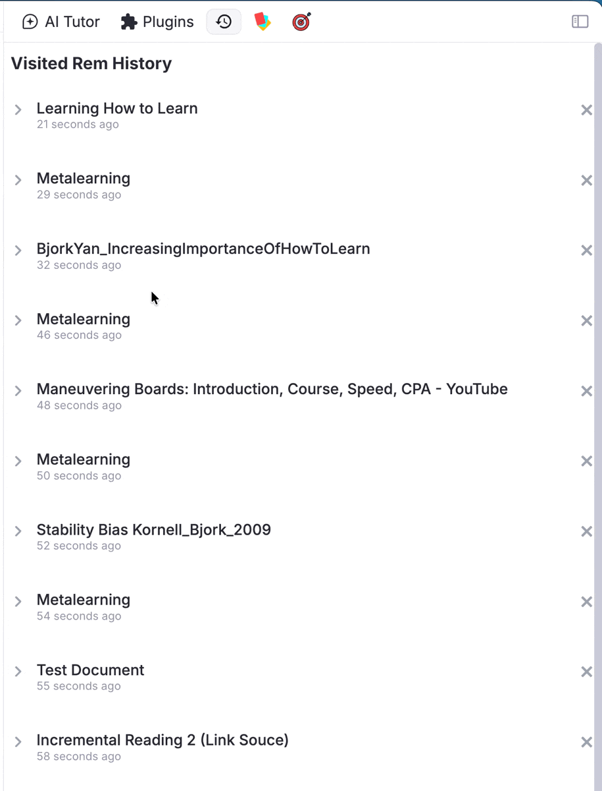
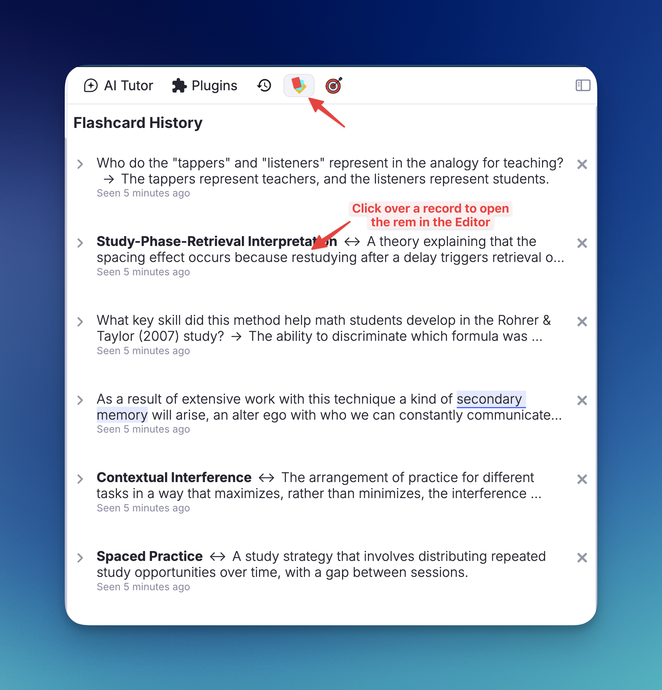
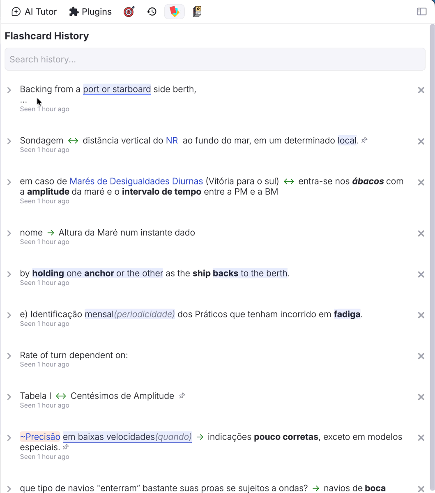
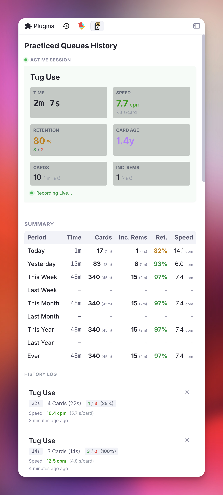
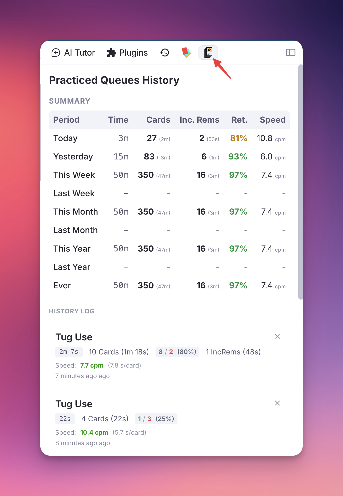
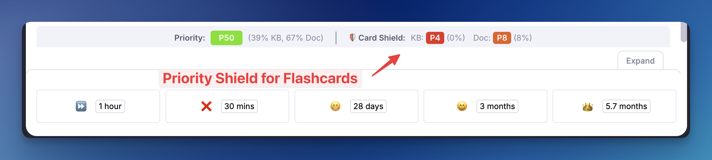
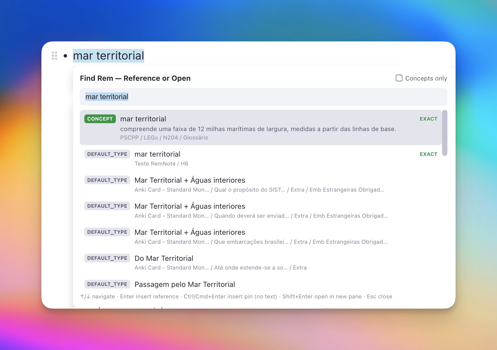
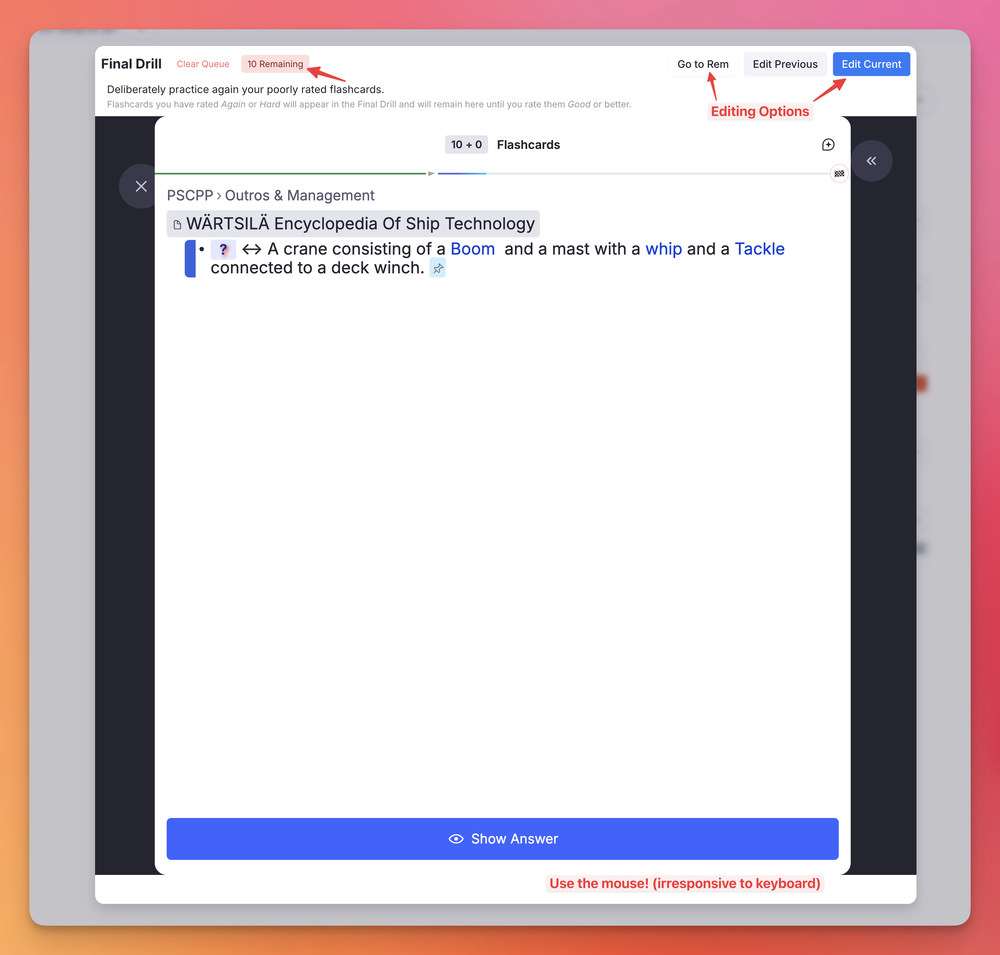
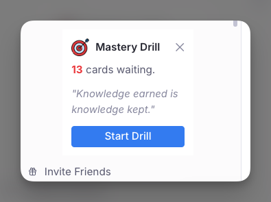

# Plugin Widgets Reference
This page serves as a comprehensive visual and functional guide to every widget in the **Incremental Everything (Plus)** plugin.

---

## 1. In-Queue Widgets

### 1.1. Card Info Bar
*(Flashcards only)*

*(Formerly **Card Priority Display** — renamed as its scope grew beyond priority to full review, memory, and scheduling stats. Older Changelog entries refer to it by the old name.)*

Displayed immediately below flashcards in the queue, this widget shows the card's priority, review statistics, and FSRS memory state.

{ width="900" }

**Features:**
- **(1) Priority Indicator**: Shows the card's priority value (explicit, inherited, or default) with a color-coded badge.
- **(2) Card Priority Shield**: A real-time counter showing how many of your highest-priority cards are still due. See [Priority Shield](Prioritization-&-Sorting.md#priority-shield) for details.
- **(3) Weighted Shield**: An exponential priority-weighted metric (if enabled in settings) showing the fraction of your total learning workload that has been processed. Clicking it opens a detailed percentile bucket breakdown. See [Weighted Shield](Prioritization-&-Sorting.md#weighted-shield) for details.
- **(4) Reps & Time**: Total number of reviews (with **lapses** in red parentheses), cumulative time spent on this card, the **card age** (time since first review), and the **cost** (time spent per year of age or coverage). Hover over it for an explanatory tooltip.
- **(5) FSRS DSR Analytics**: Difficulty (D), Stability (S), and Retrievability (R) computed by the plugin's embedded FSRS v6 engine. The exact time passed since the last review is shown next to Stability. Hovering over this section reveals the projected **Next Difficulty** for all four grading options (Again, Hard, Good, Easy).
- **(6) SInc (Stability Increase)**: The multiplier showing how much stability will grow after a successful review. Hover to see projections for Hard / Good / Easy.
- **(7) U-Factor (Used-Interval Increase)**: The multiplier showing how much bigger your **next** interval would be than the interval you *actually just used* — the real time elapsed since your last review — if you press **Good**. Where **SInc** compares the new stability to the *current* stability (`S_new / S_old`), the **U-Factor** compares the newly-scheduled interval to the gap you just cleared (`new interval / used interval`), answering the more grounded question *"how much longer can I wait now than I waited this time?"* This mirrors the **U-Factor** metric from the companion [Flashcard Repetition History](https://github.com/hugomarins/flashcard-repetition-history) plugin. A **high U-Factor** (e.g. 3×+) means recall went well and the algorithm is comfortable pushing the next review much further out; a **low U-Factor** (e.g. 1.2×) means the interval is barely growing. Hover to see the U-Factor for Hard / Good / Easy alongside the interval each would schedule. Hidden when there's no usable elapsed interval (e.g. a card reviewed moments ago). *(Because FSRS defines stability as the interval at 90% retention, the resulting interval shown in this tooltip matches the SInc tooltip — only the baseline of the ratio differs.)*
- **(8) 🔬**: Opens the Flashcard Repetition History popup
- **(9) Incremental Rem Status Indicator**: An icon displayed on the right border whenever the current card is also an Incremental Rem, providing instant visual feedback of its dual-status.

{ width="900" }

{ width="900" }

### 1.2. Queue Toolbar Priority
Installed directly into the native RemNote Queue Toolbar, this widget guarantees that the **absolute priority** of the current item (both Flashcards and Incremental Rems) is persistently visible during review.

Unlike the *Card Info Bar*, which lives at the bottom of flashcards and can be easily scrolled out of view on long documents, the Queue Toolbar Priority widget is anchored to the top toolbar, making it accessible instantly. 

- **Supports both types**: Shows absolute priorities for both Incremental Rems (e.g. `P10`) and Flashcards (percentile rank - relative priority - is shown on hover and also indicated by the badge color).
- **Opt-in setting**: Controlled via the `Display Queue Toolbar Priority` plugin setting (enabled by default).

{ width="600" }

### 1.3. Answer Buttons Info Bar
*(Incremental Rems only)*
An info bar shown below the answer buttons when reviewing an Incremental Rem in the queue. It displays review stats, the [Priority Shield](Prioritization-&-Sorting.md#priority-shield) counter, and a **📊** button to open the [IncRem Repetition History](Getting-Started.md#repetition-history-statistics).

{ width="600" }

### 1.4. Document Notes Sidebar
*(PDF and HTML Incremental Rems, including PDF/HTML Highlights)*

When reviewing a PDF or HTML Incremental Rem, you can click the **📝 Document Notes** icon in the document's top bar (next to the breadcrumbs) to open the current document's Rem in the Right Sidebar. 

This dedicated widget allows you to seamlessly view and edit the document's notes, add child rems, and organize your thoughts side-by-side with the reading material without losing your place in the queue. It intelligently synchronizes with your queue state, showing the document notes only when an applicable IncRem is being reviewed, and gracefully displaying an empty state during flashcard turns.

**Highlight Support:** When reviewing a **PDF Highlight** or **HTML Highlight** Incremental Rem in the queue, the sidebar automatically discovers all Incremental Rems associated with the same source document (using the same discovery mechanism as the Bookmark Popup). If only one IncRem is found, its notes are shown directly. If multiple IncRems share the same source PDF/HTML, a **selector** is presented so you can pick which IncRem's notes to view. A "← Switch" button lets you return to the selector at any time.

{ width="800" }

### 1.5. PDF Switcher
*(Reader top bar — only when the Inc Rem has 2+ PDF sources)*

A compact PDF dropdown that appears in the Reader's top bar, just to the right of the **📝 Document Notes** icon. It lists every PDF source attached to the current Inc Rem, with `★` marking any source tagged `#preferthispdf`.

**Behaviour:** selecting a different PDF **pins it as the active PDF** for this Inc Rem (synced storage under `active_pdf_for_<remId>`) and re-renders the Reader against the new PDF immediately — the queue card stays put, only the PDF view swaps. Bookmark auto-scroll, page controls, and any subsequent reading-time records all follow the new pin. The pin is persistent across sessions and is honoured by the queue, the Editor Review Timer, the PDF Control Panel, and the Priority Editor.

**When hidden:** for single-PDF Inc Rems (selector is unnecessary), and for `pdf-highlight` / `html-highlight` action types (the highlight is tied to a specific PDF; switching would orphan the queue card).

📖 **Full documentation:** [Multiple PDF Sources](PDF-Incremental-Reading-Workflow.md#multiple-pdf-sources-active-pdf-switcher-and-preferthispdf) — covers the full resolution chain (pin → `#preferthispdf` → first PDF) and every surface that exposes the switcher (queue Reader, Editor Review Timer, Execute Repetition popup, PDF Control Panel, Priority Editor).

---

## 2. History & Progress Tracking

### 2.1. Review History popups (for individual items/branches)

#### 2.1.1. Flashcard Repetition History
*(Flashcards only)*

A detailed popup for regular flashcards, enriched with FSRS analytics. Open it via the 🔬 button on the [Card Info Bar](#11-card-info-bar), or press `Ctrl+Shift+H` while a flashcard is showing. Press `Esc` to close.

{ width="900" }

**Features:**
- **Rem Name Header**: Identifies the parent Rem holding the flashcard, plus Card ID and Rem ID.
- **Total Reviews & Time**: Aggregate review count, cumulative time spent, **card age**, **coverage** (time from first to next scheduled review), and **cost** (ignoring any reviews that occurred before a manual Date Reset).
- **Date Summaries**: Next repetition scheduled, optimum next repetition (Last practice + Stability), date the card becomes stale (Last practice + 2× Interval), and current interval with stability ratio.
- **Retrievability Gradient**: R is displayed with a dynamic color gradient — red (≤ 70%) through green (100%).
- **SInc per grade**: Color-coded Stability Increase projections for 🟠 Hard / 🟢 Good / 🔵 Easy with hover tooltips showing projected stability.
- **History Table**: Every review with rating (color-coded), response time, target vs. practice date, delay, next interval, per-step D & S (in friendly units), SInc ratio, and pluginData.
- **Color-Coded Markers**: Visual markers distinguish standard reviews, queue reschedules (📅), editor command reviews (⌨️), and manual date resets.

📖 **Full documentation:** [Card Stats & FSRS Integration](Reviewing-Items-in-the-Queue.md#card-stats-fsrs-integration)

#### 2.1.2. IncRem Repetition History & Aggregated View
*(Incremental Rems only)*

Two interconnected popups for Incremental Rems, both accessed via `Ctrl+Shift+H`:

- **Single History** — triggered on an individual IncRem (in the queue via the 📊 button, or in the editor via `Ctrl+Shift+H`). Shows the Rem's full repetition log: date, time spent, scheduled interval, priority at the time of review, and event type markers (📅 reschedule, ⌨️ editor review, etc.).
  - **📝 Notes & context sub-lines** — entries carrying a [review note](Reviewing-Items-in-the-Queue.md#the-answer-buttons) show it under the row (📝, full text); entries with an automatic **reading-context snapshot** show a compact line like `p.57 of 40–80 · Book.pdf · 🔖 "bookmark…"` — the page you were on **at that rep**, so your reading trajectory across sessions is visible. Event banners (Dismissed, Rescheduled in Editor, …) show their note the same way — a dismissal reason lives right on the dismissal marker.
  - **PDF reading-progress footer** — when the Rem (active *or* dismissed) reads from a PDF with a **page range** set, a footer shows the PDF name, the page range, your current page, the **degree of processing** (`% read`, with a progress bar), and an **estimated remaining time** (extrapolated from the total time spent and the degree of processing reached). The percentage and estimate are omitted for open-ended ranges (`start–∞`), where there's no finite end to measure against.
  - **➕ Session — recording study done outside RemNote** — see [Recording and correcting records](#recording-and-correcting-records) below.
  - **✏️ / 🗑 per record** — hover any row to edit or delete it; see the same section.

{ width="400" }

{ width="400" }

- **Aggregated History** — triggered on a Document or Folder that contains incremental descendants. Displays a hierarchical tree of all child IncRems with aggregated metrics (total reps, total time, item count) for each node and its subtree. Nodes whose history carries review notes show a **📝 indicator** (with a count when more than one) — hover to read them, dated, newest first. A toggle button in the header lets you switch between Single and Aggregated views.

{ width="600" }

The `Ctrl+Shift+H` command **intelligently routes** to the right view: Single for individual items, Aggregated for folders. If triggered on a flashcard, it opens the [Flashcard Repetition History](Reviewing-Items-in-the-Queue.md#flashcard-repetition-history) instead.

##### Recording and correcting records

The Single History view is not read-only: a repetition log is only as useful as it is complete, and a good deal of studying happens away from RemNote — a paper read on a train, a chapter in the physical book, a lecture watched elsewhere. Both actions below work on active Incremental Rems *and* on dismissed Rems (where the history lives on the Dismissed powerup).

**➕ Session** *(header button)* — records a study session after the fact. You give it a **date**, the **end time** of the session and the **total time** spent (hours + minutes), plus an optional note. The entry appears in the log with a **📖** indicator as an *external session*, and counts towards the Rem's **reps**, its **total time**, the [Study Dashboard](Study-Dashboard.md) and the scheduler's repetition count — exactly as an in-app editor review (⌨️) does.

{ width="400" }

Whether the schedule moves depends on where the session lands in the log:

- **The session is the newest record** (or the Rem has no records yet) — the dialog offers **Reschedule next repetition**, prefilled with the interval the scheduler would give this Rem right now, counted from the session's date. This mirrors [Review in Editor](Reviewing-Items-in-the-Editor.md) (`Ctrl+Shift+J`): you studied it, so it gets scheduled forward. Untick the box to record the time without moving the date.
- **The session predates the newest record** — the schedule is left untouched and the dialog says so. A backdated entry is bookkeeping; it must not overwrite a due date that later reviews have already set.

{ width="400" }

The session's end time cannot be in the future. Its **early/late status** is computed against what was actually due at that moment — taken from the next-repetition date stamped by the last record preceding it — so a backdated entry reads correctly rather than being measured against today's due date.

**✏️ Edit / 🗑 Delete** *(hover any record)* — the two buttons appear at the right edge of a row when you hover it, and work on event banners (Made Incremental, Dismissed, …) as well as review rows.

{ width="400" }

**Edit** changes the **date**, **end time**, **total time** and note of an existing record; early/late status is recomputed, and the log is kept in chronological order. Editing never changes the schedule. **Delete** asks for confirmation first, reporting the study time that will disappear from the Rem's totals, and warns when the record is a lifecycle marker — removing a *Made Incremental* or *Dismissed* marker changes how the scheduler counts repetitions for that Rem. Deletion cannot be undone.

{ width="400" }

---

### 2.2. Last seen items history in Right-Sidebar

#### 2.2.1. Incremental Rem History
*(Right Sidebar)*

A distinct widget that serves as a **chronological log** of all your Incremental activity — unlike the popups above which show *per-item review details*, this widget tracks *what you saw and when*, now including creation and dismissal events.
- Tracks up to 200 items, filtered by the current Knowledge Base.
- Shows a unified timeline of **review sessions**, **creation events**, and **dismissals** sorted chronologically (most recent first).
- Each entry shows a color-coded pill badge: 🟢 **Created** (the Rem was first made Incremental), 🟣 **Reviewed** (a review session), or 🔴 **Dismissed** (the Rem was dismissed).
- When a Rem is dismissed *during* a review (queue / editor timer **Dismiss** button, or `Ctrl+D` in the queue), the entry shows **both** the 🟣 **Reviewed** and 🔴 **Dismissed** badges side by side. A standalone dismissal (e.g. `Ctrl+D` in the editor with no review) shows only the 🔴 **Dismissed** badge.
- Each entry also shows a **priority badge** (colored by KB-wide percentile) — click it to edit the IncRem's priority with an inline slider, without leaving the sidebar.
- Searchable by text content; shows "seen X ago" (reviews), "created X ago" (creation events), or "dismissed X ago" (standalone dismissals).
- Useful companion to the [History and Final Drill](https://www.remnote.com/plugins/final_drill_and_history) plugin.

{ width="400" }

---

#### 2.2.2. Visited Rem History
*(Right Sidebar)*

A chronological log of the Rems you have navigated to in the Editor. Helps you quickly jump back to documents you were just working on.

- Tracks up to 200 items, filtered by the current Knowledge Base.
- Searchable by text content with multi-word query support.
- Each entry can be expanded and edited inline in the sidebar.

📖 **Full documentation:** [Visited Rem History](History-Queue-Dashboard-and-Mastery-Drill.md#visited-rem-history)

{ width="500" }

---

#### 2.2.3. Flashcard History Sidebar
*(Right Sidebar)*

Records the chronological history of every flashcard reviewed in the queue (cluster-aware: each sibling in a card cluster is logged individually as it becomes visible).

- Searchable by both front and back text of cards.
- Click any entry to open the Rem in the Editor.
- Holds up to 999 entries, filtered by current Knowledge Base.
- Each entry shows a **priority badge** next to the rating badge — click it to edit the card's priority with an inline slider, without leaving the sidebar.

📖 **Full documentation:** [Flashcard History](History-Queue-Dashboard-and-Mastery-Drill.md#flashcard-history)

{ width="600" }

{ width="500" }

---

## 3. Prioritization & Sorting Widgets

### 3.1. Full Priority Widget
**Shortcut:** `Opt+P` (or `/Prioritize`, or the Change Priority button in the queue)

The comprehensive priority interface. Context-aware: the sections it displays adapt to what the focused Rem is.

**Sections (shown based on Rem type):**

| Section | When shown | What it controls |
|---|---|---|
| 📖 **Incremental Rem** | Rem has the `incremental` powerup | The IncRem's reading queue priority (0–100) |
| 🎴 **Flashcard Priority** | Rem has its own flashcards | The `cardPriority` powerup value for those cards |
| 🌿 **Inheritance Priority** | Rem has neither (or IncRem + no cards) | A `cardPriority` anchor for descendant flashcards to inherit |

Each section includes an absolute slider (0–100), a color-coded relative percentile rank within the current scope (KB-wide or document), and an ancestor context chip showing the nearest ancestor with a priority.

**Conflict handling:** When a Rem is both an IncRem and has flashcards with different priorities, the widget warns you and offers one-click sync options ("Use IncRem priority for both", "Use Card priority for both", or "Save both as-is").

**Clear Card Priority button:** When only the **Inheritance Priority** section is shown and the Rem has **no flashcards of its own**, a **Clear Card Priority** button appears. This removes the `cardPriority` inheritance anchor from the Rem in a single click — the only in-widget path to do so without manually deleting the tag in the editor. The popup closes instantly (fire-and-forget); the actual powerup removal runs in the background tracker.

{ width="500" }

### 3.2. Light Priority Widget
**Shortcut:** `Ctrl+Opt+P`

A zero-lag alternative that opens instantly by skipping expensive KB-wide calculations. Provides absolute-priority sliders for both Incremental Rem and Flashcard priorities, with keyboard arrows and acceleration for rapid adjustment. Ideal for routine adjustments on mobile, web, or during fast review sessions.

{ width="400" }

### 3.3. Priority & Interval Popup
**Triggered by:** Extract with Priority (`Opt+Shift+X`), Create Incremental Rem (PDF/web highlight menu), Toggle Incremental Rem (document menu)

A combined popup that appears automatically when a new Incremental Rem is created, letting you set both its **priority** and its **first review interval** in a single step.

**Features:**
- **Rem Name Header**: Confirms which rem you just created (truncated, with full tooltip on hover).
- **Priority Slider** (auto-focused): Same color-coded gradient slider as the Light Priority Widget; supports ↑/↓ arrow acceleration.
- **Interval Input**: Orange number field (same style as the Reschedule widget) specifying how many days until the first queue appearance. Defaults to your configured **Initial Interval** setting and shows a live "Next review: [date]" preview.
- **Tab Cycling**: Tab moves focus through all interactive elements — priority → interval → **Save** → **Next 7 Days** → **Next 30 Days** → priority (wraps). Shift+Tab reverses the direction.
- **Preset Buttons**:
  - **Next 7 Days** — saves priority and schedules in 7 days.
  - **Next 30 Days** — saves priority and schedules in 30 days.
- **Batch Mode**: When triggered via `Alt+Shift+X` with multiple Rems selected, the popup shows a blue "📋 N rems selected" banner instead of a single Rem name. On save, the chosen priority and interval are applied to all selected Rems at once.
- **Enter** saves; **Esc** cancels without saving.

{ width="400" }

{ width="800" }

### 3.4. Sorting Criteria Menu

**Access:** Three-dot menu in the top-right corner of the queue (or using the `Sorting Criteria` command)

Controls three aspects of your queue algorithm: **IncRem Randomness** (how strictly the queue follows priority order), **Flashcard Randomness** (used for [Priority Review Documents](Priority-Review-Document.md)), and **Flashcard Ratio** (the balance between flashcards and IncRems per session).

{ width="350" }

📖 **Full documentation:** [Prioritization & Sorting](Prioritization-&-Sorting.md) — covers the priority system, inheritance, all priority tools, sorting criteria, and the Priority Shield.

---

## 4. Analysis & Visualization

### 4.1. Practiced Queues History & Live Dashboard
*(Right Sidebar)*

Tracks every practice session with a real-time live view and a full history table.

**Live Dashboard** (active during a queue session):
- Current speed (CPM and s/card), retention rate, card age, cost, and interval for the card on screen.
- Separate breakdowns for Flashcards and Incremental Rems.

**History Table** (completed sessions):
- Aggregated stats for Today, Yesterday, This Week, Last Week, and custom ranges.
- Per-session detail: total time, card count, flashcard/IncRem split, speed, retention.
- Click a session to open its source document in the Editor.
- Export/Import session history to a local JSON file for backup.

📖 **Full documentation:** [Practiced Queues History & Live Dashboard](History-Queue-Dashboard-and-Mastery-Drill.md#practiced-queues-history-live-dashboard)

{ width="500" }

{ width="700" }

---

### 4.2. Study Dashboard
*(Popup — Command Palette: `Open Study Dashboard`, quick code `sdb`)*

A filterable popup that summarizes your **Incremental, Dismissed, and Flashcard activity** across the whole knowledge base or scoped to a single document, with an expandable hierarchy view showing time, reps, retention, and speed at every level of the rem tree.

**Filters:**
- **Context:** *Global* (whole KB) or *Document* (rem-rooted).
- **Scope** (Document only): *Descendants Only* or *Comprehensive* (matches the plugin's standard comprehensive scope — descendants, portals, folder queue, sources recursively, referencing rems, PDF extracts).
- **Period:** Today / Yesterday / Week / This Week / Last Week / Month / This Month / Last Month / Year / This Year / Last Year / All, plus explicit Start/End date inputs for custom ranges.

**Summary:** Three rows (Incremental / Dismissed / Flashcards) plus a bold Total row, with columns for Items, Items with reps in the period, Reps, Time, and (for Flashcards) average Retention and Speed in cpm.

**Hierarchy:** Lists every top-level rem with activity in the period, sorted by total time descending. Expandable into the full ancestor tree, with structural-only ancestor nodes (italic, no own data) keeping the tree connected when the *Comprehensive* scope pulls rems from outside the document. Each row shows Total Time, Cards (reps + time), Inc. Rems (reps + time, summing Incremental and Dismissed histories), Retention %, and Speed.

**Performance:** Bulk-fetches *Incremental*, *Dismissed*, and *cardPriority* `taggedRem()` sets plus a single `card.getAll()`. Because `cardPriority` typically covers every card-bearing rem, ancestor chain walks need almost no per-rem `findOne` calls. Loaded data is cached per session, so changing the **period** re-aggregates in memory only (instant) — only changing the **context** or **scope** triggers a reload. Global mode pre-builds every top-level rem's subtree at load time, so expanding any top-level row is also instant.

📖 **Full documentation:** [Study Dashboard](Study-Dashboard.md)

{ width="900" }

---

### 4.3. Priority Distribution Graphs
**Access:** 📊 button on the [IncRem Counter widget](#) (document-level) or the [All Inc Rems main view](IncRem-List-and-Main-View.md) (KB-wide)

Visualize how your items are distributed across the priority scale. Two views are available:

- **Absolute Priority View**: Shows item counts per priority bucket (0–100).
- **KB Percentile View**: Shows how items in the current scope rank relative to the entire Knowledge Base.

**Document Level:**

{ width="800" }

**Knowledge Base Wide:**

{ width="800" }

These graphs are also embedded at the top of generated [Priority Review Documents](Priority-Review-Document.md), so you can verify the effect of your randomness settings.

{ width="800" }

📖 **Full documentation:** [IncRem List & Main View — Priority Distribution Graphs](IncRem-List-and-Main-View.md#priority-distribution-graphs)

### 4.4. Priority Shield Graph
**Access:** Three-dot menu in the queue → "Priority Shield History", or the `Open Priority Shield Graph` command

Plots your daily [Priority Shield](Prioritization-&-Sorting.md#priority-shield) values over time, helping you identify trends in your capacity to process high-priority material.

**Features:**
- **Logical Organization**: Graphs are grouped into **Document-level** (IncRem & Card) and **Knowledge Base-wide** scopes.
- **Visual Separator**: A horizontal divider clearly distinguishes between Document and KB-wide data for better scanability.
- **Interactive Drag-to-Zoom**: Click and drag horizontally on any graph to zoom into a specific date range. A **Reset Data Range** button appears in the top-right corner to return to the full view.
- **Optimize Priorities Zoom**: A dedicated button automatically scales the absolute and relative priority Y-Axes to perfectly frame the visible data in your current zoom window. Highly beneficial for viewing subtle metric changes over time!
- **Scoped Scaling**: The Y-axis (Universe Size) for each chart automatically scales based on the visible data range, ensuring a clear view of your progress even in the Knowledge Base charts.
- **Dismissed Rems Tracking (IncRem Graphs):** The IncRem shield graphs track your process progression with a stacked area chart:
    - **Green Line**: Your active Incremental Rems universe.
    - **Black Dashed Line**: Your *Total Universe* (IncRems + items marked with the `dismissed` powerup).
    - **Yellow Area**: The visual volume of your dismissed material.
- **Detailed Tooltips**: Hover over any IncRem graph to see a breakdown of your Incremental Rems, Dismissed Rems, Total Universe, and an calculated **Processing Percentage** metric showing exactly how much of your total universe has been successfully dismissed.

{ width="1000" }

{ width="800" }

📖 **Full documentation:** [Priority Shield History](Prioritization-&-Sorting.md#priority-shield-history)

---

## 5. List & Overview Views

### 5.1. IncRem List & Main View
**Access:** IncRem Counter widget → list icon (document-scoped) or `View All` button (KB-wide)

A feature-rich table of all your Incremental Rems with two entry points:

- **IncRem List** — scoped to the current document and its descendants.
- **All Inc Rems (Main View)** — shows every IncRem across your entire Knowledge Base.

**Features:**
- Filter by Rem type (PDF, PDF Highlight, HTML, YouTube, Video, Rem), status (All / Due / Scheduled), priority range, and text search.
- **Date filter bar**: Three independent date fields (Due, Last Review, Created) each with six comparison operators (*is*, *is before*, *is after*, *is on/before*, *is on/after*, *is between*). Inputs accept `MM/DD/YYYY`, `MM/DD` (current year), or `N` (days ago). A calendar button (📅) opens the native date picker. Invalid values show a red border.
- Sort by **Priority**, **Next Rep Date**, **Last Review Date**, **Created At**, **Total Time**, or **Review Count**.
- **Inline priority editing**: Click any priority badge to adjust it with ↑/↓ arrow key acceleration.
- **Created At** is shown on each row below the last-reviewed date.
- **Review in Editor** (🔗): Launch a timed review session directly from a row — the list reopens with your exact filter/sort state after you finish.

{ width="800" }

{ width="800" }

📖 **Full documentation:** [IncRem List & Main View](IncRem-List-and-Main-View.md)

---

## 6. Utility Popups

### 6.0. IE Settings
**Command:** `Incremental Everything: Settings` (quick code `ies`)

The plugin's own settings window: every setting it owns, grouped by area rather than listed flat, with a search box, a *Reset* on anything changed from its default, and a **?** beside entries that opens the section of this manual explaining them. Settings whose parent switch is off are hidden — the Beta Scheduler's parameters, the Mastery Drill's — and the switch that governs them says so. The five settings that stay in RemNote's own panel are shown here read-only, with a pointer to where they are changed.

{ width="900" }

📖 **Full documentation:** [Plugin Settings Reference](Plugin-Settings-Reference.md#where-the-settings-are)

### 6.1. Reschedule Widget
**Shortcut:** `Ctrl+J` (works in both queue and editor)

Lets you manually override the next review date and adjust priority in one popup. Use `↑`/`↓` arrows with acceleration to adjust days and priority, `Tab` to cycle between fields, and `Esc` to cancel.

{ width="400" }

📖 **Full documentation:** [Reschedule](Reviewing-Items-in-the-Queue.md#reschedule)

### 6.2. Parent Selector
**Access:** Highlight text in a PDF or web page → click the puzzle piece icon → "Create Incremental Rem"

A hierarchical tree selector that lets you choose where to place a new extract. Supports keyboard navigation (arrow keys, Enter to select), inline child creation via the `+` button, and automatic priority inheritance from the chosen parent. Expanded branches show **H1–H6 badges** and can list headings first or filter down to headings only; `L` reselects the last/suggested destination.

📖 **Full documentation:** [Create Incremental Rem from PDF Highlights](Create-Incremental-Rem-from-PDF-Highlights.md)

### 6.3. Execute Repetition Popup
**Shortcut:** `Ctrl+Shift+J` (or slash command `Execute Incremental Rem Repetition`, quick code `er`)

Allows you to register a review of an Incremental Rem directly from the editor, featuring manual time tracking or timer mode, integrated PDF page controls, priority sliders, and safety warning overlays.

{ width="500" }

**Features:**
- **Modernized Interface**: Features a clean card-based layout with a header bar showing the document name and a footer bar displaying keyboard shortcut tips. It integrates the shared priority slider and ancestor badges.
- **Ahead-of-Schedule Info Banner**: Displays an amber warning banner if you review an item before its due date.
- **Scheduling Conflict Warning**: Shows a dialog if confirming would schedule a date earlier than currently planned, with options to Keep Current Date, Use New Date, or Custom Interval.
- **Timer Integration**: Start the timer directly from the popup. The conflict resolution selected is preserved for the timer session.

📖 **Full documentation:** [Reviewing Items in the Editor](Reviewing-Items-in-the-Editor.md#1-execute-repetition-command)

### 6.4. Find Rem (Reference or Open)
**Shortcut:** `Opt+Shift+F` / `Alt+Shift+F` (command: `Find Rem (insert reference / open in pane)`, quick code `fir`)

A **floating** picker (it doesn't cover the editor like a popup) that finds Rems by name **even when RemNote's `[[` reference search can't surface them** — the case where every word in a Rem's name is high-frequency, so the exact-name Concept gets out-ranked off the candidate list. It opens at your cursor and searches each word separately, then floats exact-name matches to the top.

**Features:**
- **Insert a reference** (Enter / click) at the cursor, **insert it as a pin** — link chip without text — (Ctrl/Cmd+Enter or Ctrl/Cmd+click), or **open the Rem in a new pane** (Shift+Enter / Shift+click) to reach Rems the normal search buries.
- **Alias-aware:** matches a Rem by its **aliases** too (shown with an `ALIAS` badge); picking one inserts a reference to the owning Rem that renders the alias text — like native `[[`.
- **Cloze-aware insertion:** a reference inserted while the cursor/selection is inside a cloze stays *inside* the cloze instead of breaking it.
- **Accent-insensitive** (`navegacao interior` → `Navegação Interior`) and **selection-aware** (selected text seeds the box and is replaced by the reference on insert, like native `[[`).
- Each result row shows a **type badge**, the Rem's **back text**, and a short **`root / … / parent` breadcrumb**; a **Concepts only** toggle narrows the list.

📖 **Full documentation:** [Find Rem — Reference or Open](Utilities.md#find-rem-reference-or-open) · root-cause explainer: [Search / Linkage Diagnostics](Troubleshooting.md#search-linkage-diagnostics-debug-widget)

### 6.5. Source Popup (modal, queue-safe PDF/HTML viewer)
**Trigger:** **Hover** a reference pin → press `Opt+O` / `Alt+O` (command: `Open Hovered Source in Popup`)

A centered **modal** popup that renders the **PDF or web article behind a hovered reference pin** inside RemNote's own reader — *without navigating away*. It's built for review: clicking a pin directly opens the source in the editor and **kills the queue** (losing your position and rating ability), whereas this popup floats the source on top of the live queue. Close it (`✕` / Esc / click outside) to return exactly where you were.

**Features:**
- **Source-aware:** only opens for **PDF/HTML highlights**, **PDF source documents**, and **HTML article sources**. Hovering a plain Rem and pressing the key does nothing (just a toast), so it's always safe to trigger.
- **Auto-scroll to highlight:** for highlights, the embedded reader scrolls to the highlighted passage once it mounts (retried a few times while the PDF engine initializes).
- **🔖 Scroll to Highlight button** in the header re-centers on the highlight after you've scrolled around the document.
- **Queue-safe:** uses a modal overlay (not a pane), so the queue, your position, and the rating buttons stay intact underneath.

📖 **Full documentation:** [Open Source in Popup](Utilities.md#open-source-in-popup)

### 6.6. Source Popup (floating, non-blocking)
**Trigger:** **Hover** a reference pin → press `Opt+Shift+O` / `Alt+Shift+O` (command: `Open Hovered Source in Floating Window`)

The **non-blocking** sibling of 6.5: the *same* reader, but opened as a **floating window on the right portion of the screen (≈48% width)** instead of a centered modal. Because it has no backdrop, the **card/editor stays visible beside it** — built for the case where you want to glance back and forth between the source and the card without the close/reopen churn a modal forces.

**Differences from the modal (6.5):**
- **Stays open while you use the PDF:** clicking into the reader to **highlight, select text, or click existing highlights** does **not** dismiss it (the click-outside-to-close behavior is disabled — clicks land in the reader's iframe).
- **Auto-closes on card advance:** when the queue loads the next card, the floating window closes itself so a previous source never lingers.
- **Esc closes it without closing the queue:** the plugin "steals" the Esc key while the float is open, so RemNote's queue doesn't act on it. (When focus is inside the PDF iframe, the reader handles Esc itself; use `✕` there.)
- **Fixed size:** RemNote floating widgets aren't user-resizable; the window opens at ≈48% viewport width, anchored top-right.

Shares the source-detection and 🔖 Scroll to Highlight behaviors with 6.5.

📖 **Full documentation:** [Open Source in Popup → Floating window](Utilities.md#floating-window-interaction-closing)

### 6.7. Restructure Outline Preview Popup
**Command:** `Restructure Outline by Headings` (quick code `roh`)

A side-by-side popup that opens before any restructure change is applied. It re-nests a flat or mis-pasted document so that paragraphs and lower-level headings sit under their preceding higher-level heading.

**Features:**
- **Left panel (Before):** the current state of the selected subtree.
- **Right panel (After):** the proposed restructured tree. Rows that would move are highlighted.
- **⏷ Preserve / ⏵ Flatten toggle:** opt in/out of pulling each non-heading subtree into the candidate flow.

📖 **Full documentation:** [Restructure Outline by Headings](Utilities.md#restructure-outline-by-headings)

### 6.8. Read Points Popup
**Trigger:** `View Read Points (History)` command (`Ctrl+Shift+F7`, quick code `vrp`)

The Rem-type analogue of the PDF/HTML Bookmark popup. It lists the **read-point history** of a Rem-type Incremental Rem — each saved reading position (a descendant rem of the outline), most recent first. The owning IncRem's name is shown under the title (resolved with the pin-aware breadcrumb resolver, so a reference *pin* collapses to 📌 instead of expanding to the full referenced text).

- Click any entry to **navigate to that descendant** rem.
- The top entry is the **current reading position** — also reachable via the **🔖 Go to Read Point** button on the [Editor Review Timer](Reviewing-Items-in-the-Editor.md#jumping-to-the-read-point) and emphasized (blue box + auto-scroll) in the [in-queue read-only card](Reviewing-Items-in-the-Queue.md#read-point-and-status-emphasis-in-rem-type-cards).
- Read points are created with the **Set Read Point (Bookmark)** command (`Ctrl+F7`, `srp`).

> The same underlying popup, opened on a PDF/HTML highlight, is the **Bookmark popup**; it now also shows the owning Incremental Rem's name under its title.

📖 **Full documentation:** [Read Points for Rem-type Incremental Rems](Reviewing-Items-in-the-Editor.md#read-points-for-rem-type-incremental-rems)

## 7. Mastery Drill

### 7.1. Mastery Drill Popup
*(Popup)*

A focused sub-queue of flashcards rated *Forgot* or *Hard*, designed for deliberate re-practice until cards are mastered. Inspired by SuperMemo's Final Drill.

- Cards enter the drill automatically when rated **Again** or **Hard**; leave when rated **Good** or **Easy**.
- Reviews are recorded in your repetition history just like regular reviews.
- Includes a built-in editor UI: **Edit Later** (defers editing via the Edit Later powerup), **Go to Rem**, and **Edit Previous** buttons.
- **Old Items Warning**: cards lingering past the configured threshold (default 7 days) are flagged; clear them with a single click.
- **Clear Queue**: empty the entire drill at any time.

📖 **Full documentation:** [Mastery Drill](History-Queue-Dashboard-and-Mastery-Drill.md#mastery-drill)

{ width="900" }

---

### 7.2. Mastery Drill Notification
*(Left Sidebar)*

A periodic notification widget that appears in the Left Sidebar End when ≥ 10 cards are pending in the Mastery Drill queue.

- Shows the count of pending cards with a rotating motivational phrase.
- **Start Drill** button opens the Mastery Drill popup directly.
- Dismiss button hides the notification; it reappears automatically every 2 hours.
- Can be disabled entirely via the `Disable Mastery Drill Notification` setting.

📖 **Full documentation:** [Mastery Drill](History-Queue-Dashboard-and-Mastery-Drill.md#mastery-drill)

{ width="350" }

