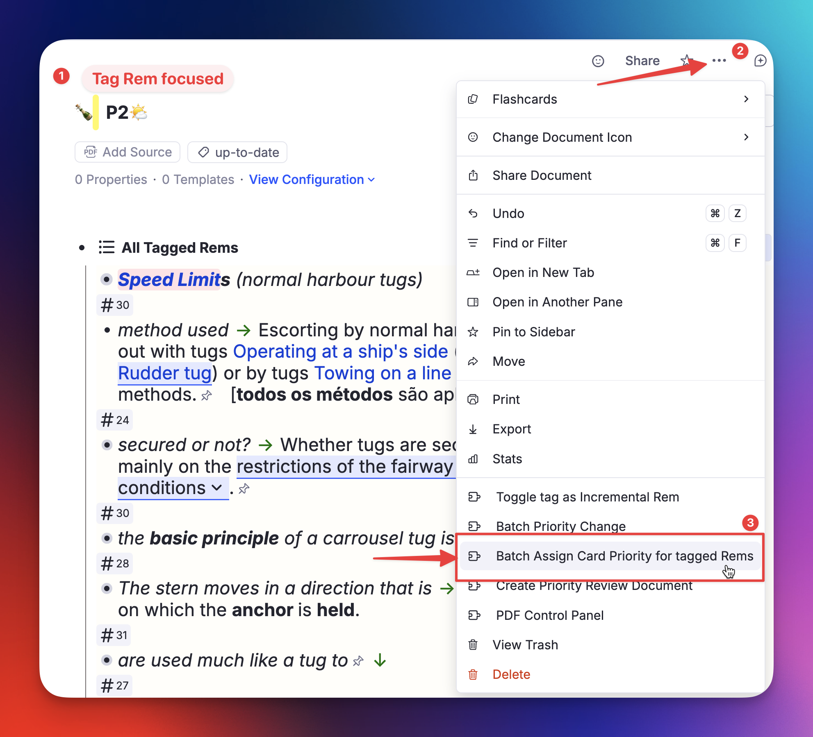
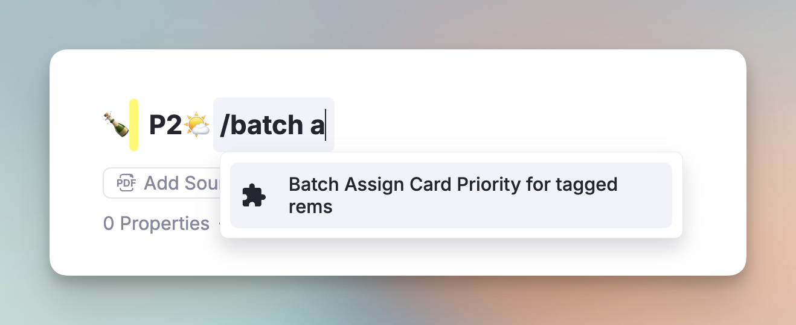
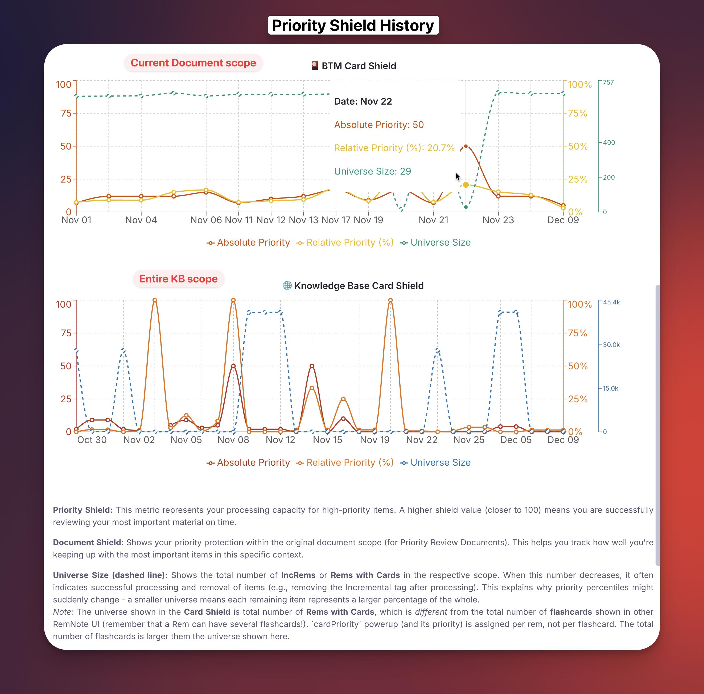

While **Incremental Rem Prioritization** helps you manage the intake of *new* information (articles, PDFs, videos), **Flashcard Prioritization** helps you manage the retention of what you've already learned.

Standard Spaced Repetition Systems (SRS) treat every due card as equally urgent. If you have 500 due cards, "Card #1" is mathematically just as important as "Card #500". In reality, remembering a core concept for your exam is far more critical than remembering a piece of trivia you added months ago.

This page explains how the plugin allows you to layer a priority system on top of RemNote's standard flashcards.

## Table of Contents
- [How It Works](#how-it-works)
  - [Priority Sources](#priority-sources)
  - [The Inheritance Logic](#the-inheritance-logic)
- [Setting & Managing Priorities](#setting--managing-priorities)
  - [1. The Unified Priority Widget](#1-the-unified-priority-widget-altp)
  - [2. Batch Assignment](#2-batch-assignment-for-tag-or-reference-migration)
- [The "Queue Problem" & The Solution](#the-queue-problem--the-solution)
- [Monitoring Your Load: Card Shield](#monitoring-your-load-card-shield)
- [Maintenance: Keeping Inherited Priorities in Sync](#maintenance-keeping-inherited-priorities-in-sync)
  - [Automatic Propagation (Full Mode)](#automatic-propagation-full-mode)
  - [Manual Full-KB Sweep](#manual-full-kb-sweep-update-all-inherited-card-priorities)
- [See Also](#see-also)

---

## How It Works


Unlike Incremental Rems, where the plugin completely controls the scheduler, Flashcards live inside RemNote's native database. To manage them, the plugin adds a special powerup (`cardPriority`) to your Rems.

### Priority Sources

Every flashcard in your knowledge base is assigned a priority from **0-100** (Lower = Higher Priority) based on one of four sources:

1.  **Manual (Highest Strength):** You explicitly set a priority for this specific Rem. This overrides everything else.
2.  **Incremental (Highest Strength):** When you finish reviewing an Incremental Rem (e.g. by clicking "Dismiss"), its priority is automatically synced to its flashcards with this source type. Like a "manual" priority, it is "sticky" and won't be overwritten by inherited or default values, ensuring your specific prioritization from your reading workflow is preserved.
    * *Visual Cue:* In the Priority widgets, both `manual` and `incremental` priorities appear in **bold** (e.g., **P10**), making it clear they are explicitly assigned values. Inherited and default priorities appear in normal weight.
3.  **Inherited (Medium Strength):** If a Rem has no manual or incremental priority, it looks up its ancestry tree. It inherits the priority of the nearest ancestor that has:
    * A Manual or Incremental Flashcard Priority set.
    * **OR** An Incremental Rem Priority set (this creates a seamless bridge between your reading list and your flashcards).
4.  **Default (Lowest Strength):** If no ancestor has a priority, the card defaults to **50** (or whatever value you set in Settings).

### The Inheritance Logic

This is the "magic" that makes the system manageable. You don't need to prioritize every single card.

* **Scenario:** You are reading a high-priority book (Priority: 10).
* **Action:** You highlight a sentence and create a flashcard from it.
* **Result:** That new flashcard automatically inherits Priority **10**.
* **Benefit:** If you decide the whole book is less important later and change the book's priority to 80, **all** flashcards generated from it update to 80 instantly (unless you manually overrode specific ones or specific branches / chapters / sections).

## Setting & Managing Priorities

### 1. The Unified Priority Widget ([`Alt+P`](Keyboard-Shortcuts.md#priority-commands))

Press [`Alt+P`](Keyboard-Shortcuts.md#priority-commands) (or `Opt+P`) on any Rem to open the Priority Widget. This widget is context-aware and changes based on what you are selecting:

* **Inc Rem Section:** Appears if the item is an Incremental Rem.
* **Flashcard Section:** Appears if the item has flashcards.
* **Inheritance Section:** Appears if the item has the `cardPriority` powerup but no flashcards of its own — meaning the powerup exists purely as an **inheritance anchor** for descendant cards. This is also shown for IncRems that have no cards but where you want to set a card-priority anchor for their descendants.
  * **Clear Card Priority button:** When this section is the only one visible and the Rem has **no flashcards of its own**, a **Clear Card Priority** button appears at the bottom of the section. This removes the inheritance anchor in a single click — previously the only way was to manually find and delete the `cardPriority` tag on the Rem in the editor. The button is intentionally absent from any Rem that has its own flashcards, since those must always retain a card priority.

**Handling Conflicts:**
If a Rem is both an Incremental Rem (reading material) AND has Flashcards, you might want different priorities for each. The widget allows this, but warns you if they diverge, offering buttons to sync them with a single click.

### 2. Batch Assignment (For Tag or Reference Migration)

If you previously used tags like `#HighPriority` or `#P1` to organise your cards, or if you want to bulk-assign priorities to all rems that reference a given rem, you can do so in bulk:

1. Focus on the **anchor rem** (e.g., `#Important`, or any rem that other rems reference or are tagged with).
2. Open the **Document Menu** (⋯) and click **"Batch Assign Card Priority for tagged/referencing Rems"** — or run the command **"Batch Assign Card Priority for tagged/referencing rems"** (`Opt+Shift+C`) from the Command Palette.






3.  Set a priority range (e.g., 3-12).
4.  The plugin will apply this `Manual` priority to every Rem tagged with `#Important` (or that references the Rem).


### 3. Unified Batch Priority Change

While the tool above is specialized for migrations, the **[Prioritization-&-Sorting#batch-priority-change-increms--flashcards](Batch-Priority-Change.md)** widget provides a unified interface for managing existing priorities across an entire document tree.

- **Unified Interface:** Shows both Incremental Rems and Flashcard priorities in a single table.
- **Bulk Adjustment:** Increase or decrease all selected card priorities by a specific amount or percentage.
- **Range Spreading:** Evenly distribute priorities across a range (e.g., set top cards from 0 to 10).
- **Filtering:** Use the "Has Cards" filter to focus exclusively on flashcard management.

**Access:** Search for "Batch Priority Change" in the Command Palette, or use the **Document Menu** (⋯) on any Rem.

**Widget features:**

*   **Scope selector** — choose which rems to load:
    *   **Tagged Rems** — rems tagged with the anchor rem (classic use-case)
    *   **Rem References** — rems that contain an `[anchor](anchor.md)` inline reference
    *   **Both** — union of the above, deduplicated

    | Option | Behaviour |
    |--------|-----------|
    | **Tagged Rems** | Rems tagged with the anchor rem (original behaviour) |
    | **Rem References** | Rems that contain an `[anchor](anchor.md)` reference (`remsReferencingThis`) |
    | **Both** | Union of the above, deduplicated |

*   **Breadcrumb tree** — each rem row shows its KB ancestry path (e.g. `PSCPP › SH › A – Definições`) so you can immediately tell where it lives, without a full tree traversal. Rows are sorted by breadcrumb, so rems from the same location cluster together.
*   **Priority & Source columns** — see each rem's current card priority at a glance, colour-coded by source (yellow = manual, green = incremental, grey = inherited, blue = IncRem-only).
    * The **Priority** column shows the current card priority with colour-coded badges:
        - 🟡 **Yellow** = manually set
        - 🟢 **Green** = synced from an Incremental Rem
        - ⬜ **Grey/outlined** = inherited (shown but visually subdued)
        - 🔵 **Blue** = IncRem priority only (no card priority yet)

*   **Front → Back names** — rems with back text are shown as `Front → Back`, making flashcard-style rems immediately recognisable.
*   **Filters:**

    | Filter | Description |
    |--------|-------------|
    | **Only rems with cards** | Checked by default — excludes rems whose entire subtree has zero flashcards, since assigning a card priority to them would be pointless |
    | **Priority range** | Filter by existing priority value (0–100); rems with no priority are always shown |

*   **Assignment Range** — assign random priorities within a Min–Max range to all selected rems.
*   **IncRem preference** — optionally use a rem's existing IncRem priority as its card priority instead of a random value.
*   **Overwrite guard** — rems with existing manual/incremental priorities require an explicit "Overwrite" checkbox before they can be updated.

**Sample Use Cases:**

* Migrating from a previous tag prioritization system (e.g. p1, p2, p3 tags) (see image above)

* Decreasing the priority using an Universal Descriptor considered of lower importance (e.g. `~Translation`)


## The "Queue Problem" & The Solution

This is the most critical concept to understand:

> **⚠️ RemNote's native flashcard queue DOES NOT respect these priorities.**

If you just click "Flashcards" in the sidebar, RemNote will show you cards in its standard SRS order. It does not know about the `cardPriority` powerup.

### The Solution: Priority Review Documents

To review your flashcards in priority order, you **must** use the **[Priority Review Document](Priority-Review-Document.md)** feature.

1.  This feature scans your database for due cards.
2.  It looks at the priorities you've set (Manual/Inherited).
3.  It generates a temporary document containing portals to your **Highest Priority Due Cards**.
4.  You review that temporary document.

This effectively bypasses the native scheduler's "all cards are equal" logic and forces a "best cards first" workflow.

## Monitoring Your Load: Card Shield

Just like for reading material, the queue displays a **[Priority Shield](Prioritization-&-Sorting.md#priority-shield)** for flashcards (toggleable in settings).


* **What it shows:** The priority of the most important due card you *haven't* reviewed yet.
* **Interpretation:**
    * Shield = **P10**: You are safe. You've reviewed everything more important than P10.
    * Shield = **P1**: **Danger.** You have extremely critical cards pending review. Stop reading new things and clear your cards!

### "Start of Today" Boundary

The Card Shield uses a **start-of-today** threshold to decide which cards count as "due". Only cards with a `nextRepetitionTime` on or before **midnight** of the current day (in your local timezone) are included.

This means cards that became due *during* the current session — for example, a card you rated *Again* a few minutes ago, which gets a very short new interval — do **not** immediately affect the shield. This design choice is deliberate:

* **Stability:** In SuperMemo's model, the "Outstanding Queue" is formed once at the start of a study day and does not change throughout the day. The shield should reflect *pre-existing* overdue priority pressure, not intraday scheduling noise.
* **Honest measurement:** A card you just rated *Again* is not something you "missed" — it is part of the current session's work. Including it would cause the shield to artificially drop during normal review.

> [!NOTE]
> This boundary applies to **both** the live shield shown during the queue and the QueueExit value written to the history graph.

### QueueExit Live Verification

When the session ends, before writing the shield value to the history graph, the plugin performs a **live `rem.getCards()` check** on the highest-priority candidate from the cache. If the cache entry turns out to be stale (e.g., the card was reviewed or rescheduled since the cache was last built), the plugin escalates to the next priority tier and retries — up to **20 API calls total**, grouped by priority level. This prevents phantom low-shield readings in the history caused by stale cache data.

You can view the history of your Card Shield in the "[Prioritization-&-Sorting#priority-shield-history](Priority-Shield-History.md)" graph to track your retention discipline over time.




## Maintenance: Keeping Inherited Priorities in Sync

Because priorities rely heavily on inheritance, changes to a parent (e.g., changing a Folder's priority) need to propagate to potentially many children.

### Automatic Propagation (Full Mode)

In **Full Mode**, the plugin **automatically cascades inheritance** whenever you change a priority through any of these entry points:

| Entry point | Triggers cascade? |
|---|---|
| **Priority widget** (`Alt+P`) — IncRem or Card save | ✅ Yes |
| **Light Priority widget** (`Ctrl+Alt+P`) — IncRem or Card save | ✅ Yes |
| **Quick Increase/Decrease Priority** (`Ctrl+Shift+Up/Down`) | ✅ Yes |
| **Reschedule widget** | ✅ Yes |
| **Priority & Interval popup** (new IncRem creation) | ✅ Yes |
| **Batch Card Priority** / **Batch Priority Change** (bulk over a tag or selection) | ✅ Yes |

*   The cascade runs silently in the background — the popup closes immediately with no delay.
*   Descendants with `inherited` card priority (that haven't been manually overridden) update automatically.
*   The cascade only touches descendants that **actually own flashcards** (and existing inheritance anchors). Non-flashcard nodes — tag slots, property values, list items — are never tagged; they still inherit the priority dynamically without a physical `cardPriority` tag. (Earlier versions tagged the whole subtree indiscriminately, which produced [rogue CardPriority tags](Troubleshooting.md#-rogue-cardpriority-tags-sanitization); fixed in v0.2.272.)
*   This covers both **Flashcard priority** saves and **Incremental Rem priority** saves (for descendants whose inherited card priority traces back to that IncRem).
*   **Requests are consolidated, not queued one-by-one.** Rapid consecutive saves and bulk operations accumulate into a single cascade pass: duplicate Rems are dropped, and where several changed Rems share a subtree that subtree is walked once rather than once per Rem. A cascade already in flight absorbs anything requested while it runs and sweeps it up at the end, still in one pass.

> [!NOTE]
> The auto-cascade only fires in **Full Mode**. If you use Light Mode, inheritance updates are not cascaded automatically.

<a id="bulk-cascade-performance"></a>
#### Bulk operations and cascade cost

A bulk priority change asks for a cascade rooted at **every Rem it modified** — not at the tag or folder you ran it from. This is deliberate: Rems carrying a tag are scattered all over the knowledge base and are *not* descendants of the tag, so a cascade rooted at the tag would never reach the subtrees whose inherited priorities just went stale.

Each cascade pass needs an index of which Rems actually own flashcards, and building that index reads the whole card database — the single most expensive step in the operation. Because all requested roots are now handled in **one pass**, that index is built **once per bulk operation** instead of once per Rem. On a 600-Rem batch this is the difference between a cascade finishing in about as long as a single Rem's would take, and grinding through several hundred full-database reads while the console fills with `Background inheritance cascade started` lines.

Progress is reported in the console. Long runs log a `Cascade progress: n/total descendants` line, and the closing line reports how many roots were covered and how many Rems were actually updated:

```
[Tracker] Cascade triggered for 625 remId(s)
[Tracker] Background inheritance cascade started for 625 root(s)
[Tracker] Background inheritance cascade complete in 4180ms (625 root(s), 1174 rem(s) updated)
```

Seeing a *long stream* of one-root-at-a-time cascade lines after a bulk change means you are on a version before v1.0.27.

### Manual Full-KB Sweep: "Update all inherited Card Priorities"

For large-scale reorganizations or after running bulk operations (Batch Priority Change, hierarchy restructuring), run the command **"Update all inherited Card Priorities"** to ensure 100% KB-wide consistency.

* **What it does:** It traverses your entire database, recalculates inheritance for every card, and ensures the cache is accurate.
* **Why run it:** To ensure the few priorities you have manually set will be inherited by all existing flashcards, not just newly created ones. E.g.:
  * You identify that a chapter of a book / document is very important, and assign to it a priority of 5.
  * This chapter already has many flashcards created, let's say, 80.
  * After this, all NEW cards you create inside that document (as descendants) will have this high priority.
  * But what about the flashcards that you already have? When you run this command, not only the new cards you create will have the high priority of its ancestor, but all cards that were there beforehand (and to which you never manually assigned a priority).
  * Now, when you create a [Priority Review Document](Priority-Review-Document.md) of this book (or whatever scope that includes this book), the plugin will make sure you review the rems of this valuable chapter first!


## See also

* [Priority Review Document](Priority-Review-Document.md)
* [Prioritization-&-Sorting](Prioritization-&-Sorting.md)