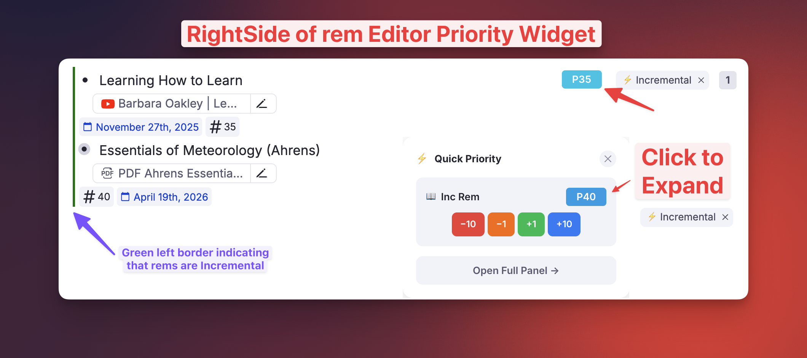
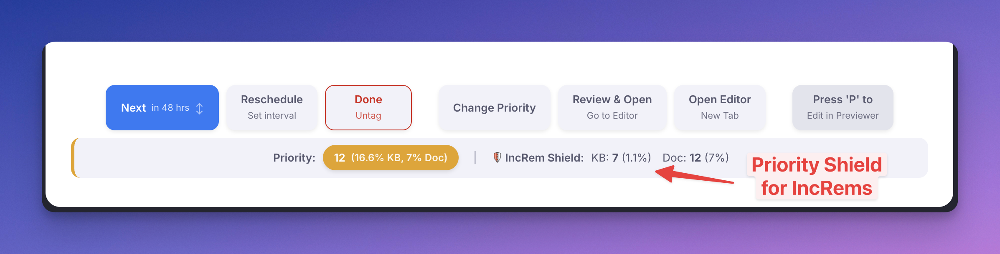
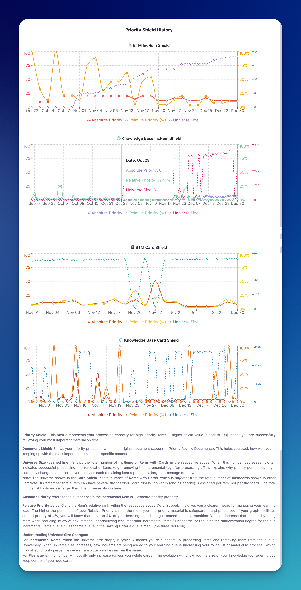

**Mastering the Queue: Prioritization & Sorting**


To get the most out of Incremental Everything, it's essential to understand how to manage your review queue effectively. This guide breaks down the advanced prioritization and sorting tools at your disposal, allowing you to tailor your learning sessions to your exact needs.

---
## The Priority System Explained

With incremental reading, you can quickly accumulate thousands of articles, notes, and videos. Without a system to manage this volume, the learning process can become chaotic. This is where the priority system comes in.

By assigning a priority to each item, you tell the plugin what is most important to you. The plugin then uses this information to intelligently sort your queue, ensuring that you review the most critical material first. So, **priorities are there to manage information overflow**. This concept is central to methodologies like the one used in SuperMemo. For a deeper dive into the theory, see SuperMemo's article on the [Priority queue](https://help.supermemo.org/wiki/Priority_queue).


Setting priorities helps you manage the balance of [Volume vs. retention](https://help.supermemo.org/wiki/Priority_queue#Volume_vs._retention_battle_in_learning) in learning effectively. It prevents your queue from being overloaded with low-value items, which could prevent you from reviewing your high-value investments.

> If you want to ensure that you keep a high retention of previously added material, you cannot overload the learning process with new material (new topics[= passive reading Incremental Rem]) because you will not have enough time left to do your daily item review.

###  Priority Value (Absolute Priority)

  * A numerical value from 0 to 100.
  * This is the number that is stored in the "Priority" property of the Incremental Rem or Card Rem.
  * **Lower numbers mean higher priority.** `0` is for your most critical material, while `100` is for the least important.


**💡 Pro-Tip for an Efficient Workflow:**

For faster and more effective prioritization, we recommend using a smaller range of values, such as **1-10**.

  * **Why?** It helps reduce decision fatigue. Spending mental energy deciding if an item is a 53 or a 58 has a negligible practical effect on your queue.
  * **Benefits:** Sticking to a smaller scale makes prioritizing quicker and more intuitive. You still get the full benefit of the **Relative Priority** percentile, which automatically ranks the item against everything else.

The full 0-100 range is included for maximum flexibility and to align with the well stablished standard of SuperMemo, but a simpler scale is often more powerful in practice.


###  Relative Priority

  * A percentile rank from 0% to 100%.
  * Positions the current Rem relative to all other incremental items OR Card Rems in your entire knowledge base. Setting it to 10% means this item is more important than 90% of your other items.

---

## Priority Inheritance System

To streamline workflow and make priority management more intuitive, new items automatically inherit their priority from their closest parent or ancestor that is also prioritized.

  * **How it works (True Priorities):** When you tag a new Rem as `Incremental` (or generate flashcards), the plugin searches up through the Rem's parents looking for a "true" origin priority to inherit. A priority is considered "true" if it's an Incremental Rem priority, or a Flashcard priority whose source is "manual" or "incremental" (that is, one originated from a processed Incremental Rem when "Dismiss" was pressed). Purely inherited Flashcard priorities are skipped, acting as transparent pass-throughs so the plugin can find the real source higher up the tree.
  * **Smart Category Matching:** Proximity is the strongest factor. If the direct parent has a true priority (even of a different type), the new child inherits it immediately. However, if the closest true ancestor possesses *both* an Incremental Rem priority and a Flashcard priority, the child will smartly inherit the priority from the matching category space (e.g., a new Incremental Rem will inherit the ancestor's Incremental Rem priority, while a new flashcard will inherit the ancestor's Flashcard priority).
  * **Fallback:** If no true prioritized ancestor is found, the new item will receive the default priority value you have set in the plugin settings.

This system is particularly useful for hierarchically organized notes. For example, if you have an important book summary with a high priority (e.g., 5), any new extracts or notes you create within that summary will automatically inherit the same priority, saving you from setting it manually each time.

The "[Set Priority](#main-priority-popup)" and "Reschedule" popups also display the ancestor's priority, giving you immediate context when you decide to manually override the inherited value.

### Use Cases

-  **Use Case 1: Deconstructing a High-Priority Document**

Imagine you have a PDF of a crucial research paper with a priority of 10. As you read and create highlights (extracts) from it, each new highlight will automatically be assigned a priority of 10. This ensures that all the core concepts from that paper are reviewed together and with the urgency they deserve, without any manual adjustments.

-  **Use Case 2: Hierarchical Note-Taking**

If you have a parent rem for a broad topic like "Quantum Mechanics" with a set priority, any new child rems you create under it (e.g., "Wave-Particle Duality," "Superposition") will inherit that priority. This keeps your knowledge hierarchy organized and ensures that foundational topics and their sub-topics are treated with the same level of importance in your reviews.

---
## Setting Priorities

There are several ways to set priorities in Incremental Everything, each designed for a different context.

*   **Main Priority Popup (`Opt+P`):** The comprehensive tool. Best for deep analysis, seeing relative priorities, ancestors, and using the "Shield" logic.
*   **Light Priority Popup (`Ctrl+Opt+P`):** A streamlined, instant-opening version. Best for quick, friction-free adjustments during study sessions.
*   **Quick Priority Shortcuts (`Ctrl+Shift+↑/↓`):** The fastest method. Adjusts absolute priority instantly without any UI popping up.
*   **Priority Editor Widget:** An always-on visual control in the editor or queue.
*   **Batch Tools:** Advanced tables for managing priorities en masse for documents or tags.

---

### Main Priority Popup
**Shortcut:** `Opt+P` (or `/Prioritize`)

This is the fully-featured priority interface. Access it by pressing `Opt+P` or clicking the "Change Priority" button in the queue.

It displays detailed context, including:
1.  **Absolute Priority Value:** The number (0-100) stored in the Rem.
2.  **Relative Priority:** Where this item stands compared to the rest of your knowledge base (as a percentile).
3.  **Visual Slider:** A slider for absolute value, giving you both precise control and intuitive visual ranking. The color of the slider indicates the absolute priority, while the color of the selector circle indicates the relative priority.
4.  **Ancestor Context:** Shows the priority of the closest parent prioritized Rem, helping you check inheritance.
5.  **Scope Analysis:** Lets you see how this item ranks within specific documents vs. the entire knowledge base.

**When to use:** When you need full context or want to analyze your priority distribution.

#### What the Priority dialog displays:

{ width="500" }

  - (1) [Absolute] Priority input field (selected when the dialog opens, so that you can just type the priority and press Enter to save)
  - (2) Priority Badge: the number shows the absolute priority; the **color code** provides visual indication of the **relative priority** (shown in 4)
  - (3) You can slide this button to select the priority. Pay attention that the **position on the slider** indicates **absolute priority**, but the **color** of the button indicates the **relative priority** (shown in 4)
  - (4) Relative priority of the IncRem (or flashcard), in the scope shown on 6, as well as the number of items that form this scope
  - (5) The priority of the closest ancestor, for reference. Shows the name of the closest ancestor, its relationship with the current rem (e.g. parent, grandparent), and if it is an IncRem or a flashcard.
  - (6) The **scope** to be used for the calculation of the **Relative Priority**. May be "All KB" or a Document. If you select the Document tab, it will display a document scope. You can then use the arrows to go up and down on the hierarchy, and see how the current rem is proportionally positioned in relation to each of these scopes.

---

### Light Priority Popup
**Shortcut:** `Ctrl+Opt+P`

Designed for speed. This popup opens instantly and provides just the essentials:
*   A slider for the **Incremental Rem** priority or/and
*   A slider for the **Flashcard** priority.

It works exactly like the main popup but skips the heavy calculations (like checking ancestor trees or calculating precise universe percentiles) to ensure zero lag.

***Note:** If you are on **Windows** instead of Mac, you may need to disable the default keybindings for "Add All Properties" in the settings to avoid conflicts with this plugin. Go to Settings > Keyboard Shortcuts, search for "Add All Properties" and disable it.*

**When to use:** For routine day-to-day adjustments when speed is paramount.

{ width="400" }

---

### Quick Priority Shortcuts
**Shortcuts:** 
*   `Ctrl+Opt+Up Arrow`: **Increase** priority number (make **less** important). E.g., 10 → 20.
*   `Ctrl+Opt+Down Arrow`: **Decrease** priority number (make **more** important). E.g., 20 → 10.

*Note: In this system, lower numbers mean higher importance (1 is top priority, 100 is low).*

These shortcuts allow you to adjust priorities on the fly without breaking your flow. You can use them on the current item in the queue or any focused Rem in the editor. A small toast notification will confirm the change.

The step in which priorities will increase or decrease can be configured in the settings.

**When to use:** During review sessions when you want to adjust an item's priority up or down in a predefined step without stopping.

{ width="600" }

{ width="600" }

---

### Priority Editor Widget
**Location:** Right side of the editor (when a Incremental Rem or a Card is focused) or potentially inline.

This widget provides a persistent visual indicator of the item's priority.
*   **Clicking it** opens the full priority popup.
*   **Expanding it** reveals quick `+` / `-` buttons to adjust priority by 1 or 10 points directly.

**When to use:** When editing a document and you want to manage priorities without using keyboard shortcuts.

{ width="800" }

---

### Bulk Priority for a Multi-Selection

**Shortcuts:** `Opt+P` (full popup) and `Ctrl+Opt+P` (light popup), the same keys you use on a single Rem.

Select several Rems — with the row checkboxes in a **table**, or by dragging across bullets in the editor — and either priority shortcut now opens in **batch mode**, applying your choice to every selected Rem at once. Previously these commands looked only at the *focused* Rem, and a table selection has no focused Rem, so they answered `No Rem found to set priority`.

The popup header shows the scope (`Priority Settings — 6 rems`) along with what the selection is made of, e.g. `2 IncRems, 4 with cards`.

**What gets written where.** Each Rem is routed by what it already is, mirroring the sections the single-Rem popup would have shown for it:

| Selected Rem | Receives |
|---|---|
| Has the **Incremental** powerup | The Incremental priority |
| Has flashcards or a **CardPriority** | The card priority |
| Both | Both |
| Neither | Nothing — it is skipped and counted in the header |

An IncRem with no cards is therefore never tagged `CardPriority` just because it shared a selection with flashcards. A bulk edit also never creates an **inheritance anchor** on a bare Rem — that stays a deliberate single-Rem action.

**Both sliders reflect the whole selection.** The sections shown come from every target, not from the first one: select a flashcard *first* and an IncRem second and you still get both sliders. Each one is labelled with how many Rems it will touch.

**Sliders open on the class average.** With mixed values the header also reports the spread — `IncRem mixed 27–74 (avg 50)` — so an average is never mistaken for everyone's current value.

> [!IMPORTANT]
> **Only the sliders you actually move are applied.** Nudge a slider to write it. Without this rule, opening the popup over six rows and touching only the card slider would push the first Rem's Incremental value onto every IncRem in the selection.

---

### Batch Priority Change (IncRems & Flashcards)
**Access:** Document Menu (top right 3 dots) → "Batch Priority Change"

A powerful table view for unified priority management across an entire document tree.

*   **View:** Displays a hierarchical list of all Prioritized items (both Incremental Rems and Flashcards) in the document.
*   **Bulk Operations:**
    *   **Increase/Decrease:** Adjust all selected priorities by a percentage.
    *   **Spread:** Distribute priorities evenly across a range (e.g., set selected items from 10 to 50).
    *   **Set Fixed:** Set all selected items to a specific value.
*   **Sorting/Filtering:** Sort by name, priority, next repetition date, etc. Filter by search text, type, or priority range.
*   **Multi-Select Type Filter:** Hold `Cmd/Ctrl` while clicking in the "All Types" dropdown to instantly filter by multiple categories at once (e.g. showing only "Extracts" and items that "Has Cards").
*   **Filter-Aware Bulk Actions:** When any filter is active (search, type, or priority range), bulk action buttons automatically adapt:
    *   **Check All Filtered / Uncheck All Filtered** — only toggles items matching the current filters; out-of-scope items remain unchanged.
    *   **Preview Filtered** — calculates new priorities only for the filtered subset, preserving existing calculations for items outside the filter.
    *   **Apply to Filtered** — applies changes exclusively to the filtered items.
    *   When no filters are active, buttons revert to their standard labels and affect all items as before.

{ width="900" }

---

### Batch Card Priority (Flashcards)
**Access:** Focus on a Tag Rem → Document Menu → "Batch Assign Card Priority for tagged Rems"

Designed specifically for **Flashcards**. You can now assign `CardPriority` to hundreds of rems at once, based on a tag.

**Use Cases:**
*   **Topic Prioritization:** When you have a specific topic or exam tag (e.g., `#Exam1`) and want to ensure all related flashcards are prioritized highly.
*   **System Migration:** If you used to use tags to prioritize your cards (like `#important!`, `#P1`, `#P2`), you can convert your old manual system to the new one in bulk.

**Features:**
*   **Smart Randomization:** Assigns random priorities within a specific range (e.g., 20-40). This distributes the load so important cards don't all pile up on the same day.
*   **Intelligent Handling:** Capable of checking if the item is also an Incremental Rem, allowing you to use its existing IncRem priority as the Card Priority.
*   **Safety:** Safely updates rems that already have `manual` priorities by requiring explicit "Overwrite" confirmation.

{ width="500" }

---

### Other Methods

*   **Reschedule Command (`Ctrl+J`):** The reschedule popup also includes a priority slider, allowing you to change both the due date and the priority in one go.

{ width="400" }

*   **Extract with Priority (`Opt+Shift+X`):** When focused on a Rem or having a text selection, you can immediately create an extract and open the priority popup for the new item.

---

## Priorities in Tables

Tables are the one place the **[Priority Editor Widget](#priority-editor-widget)** cannot follow you. RemNote does not render *any* plugin widget inside a table cell — the badge you see on every ordinary bullet simply has nowhere to mount there — so a table of flashcards gave you no way to see priorities at a glance.

Instead, the plugin writes each Rem's priority band into a hidden tag and draws the badge with CSS, which works even in the lightweight rendering tables use before you hover a row.

{ width="800" }

**What you see.** A small coloured pill at the **top-right of the row's first cell**, reading the band the Rem falls in — `50s` for a priority of 50–59 — and coloured on the same scale as every other priority badge in the plugin, so a more important `10s` reads warm and a less important `50s` reads green.

One badge appears per **row**, not per cell: the row's priority belongs to the Rem in the primary column, while the other columns display that Rem's slot values, which have no priority of their own. Scanning that column tells you the shape of a whole table at a glance.

**Colour follows relative priority, per population.** Like the Priority Editor, a badge is coloured by where its priority *ranks*, not by its absolute number — in a knowledge base whose priorities cluster low, `P20` can be the 9th percentile and is drawn accordingly. Incremental Rems are ranked against Incremental Rems and flashcards against flashcards, exactly as the popup does it, so a table mixing both colours each row on its own scale. The mapping is recalculated at startup and after a *Refresh*, so it is a recent snapshot rather than a live figure.

**Why bands and not the exact number.** The only channel that reaches inside a table cell is a tag, and a tag is a yes/no — it cannot carry a value. Ten band tags give you ten steps; showing `74` exactly would need a tag per possible priority.

**Which Rems get a badge.** Only Rems that could actually appear as a table row: those carrying at least one **non-powerup tag that defines slots** (the tag whose slots become the table's columns). The plugin's own powerups don't count. Without that filter, every card and extract in a large knowledge base would be tagged — tens of thousands of synced writes for Rems that will never be seen in a table.

> [!NOTE]
> A table built from a **document or portal view** rather than from a tag has no tag to key on, so its rows show no badges.

**Turning it off.** Setting: **Show Priority Badges in Table Cells** (default on). It takes effect after a reload. The band tags themselves are always hidden from the tag bar, whether or not the badges are drawn.

### Keeping the badges in sync

The band follows your priorities automatically — every priority write updates it, including inherited priorities flowing down a cascade, priorities set in bulk, and priorities changed from the IncRem List, Main View, Page Range, reschedule and editor-review widgets. Two commands exist for the rest:

- **Refresh Priority Badges (Tables)** — recomputes bands for every IncRem and every Rem with a card priority. Run it **once after enabling the feature** to fill in Rems whose priority was set before it existed, or any time you suspect drift. Progress and a completion summary are reported as toasts and in the developer console.
- **Remove All Priority Band Tags** — strips every band tag. Unlike *Remove All CardPriority Tags*, **this destroys nothing**: bands are a derived mirror of priorities that still live in the Incremental and CardPriority slots, so *Refresh* rebuilds them exactly.

> [!TIP]
> If you ran the plugin before the eligibility filter existed, run **Remove All Priority Band Tags** once and then **Refresh Priority Badges (Tables)** to shed the bands that were applied to Rems outside any table.

> [!NOTE]
> **Before v1.0.27**, only some priority writes updated the band: batch changes, the Priority & Interval batch save, reschedules, editor reviews and the list-view widgets all left the badge showing the previous value until the next *Refresh*. If you have been using tables since before that release, one run of **Refresh Priority Badges (Tables)** clears any badges left stale by it.
>
> One category is still not covered automatically: **removing** a card priority outright, via *Remove All CardPriority Tags* or the single-Rem cleanup. A Rem that is also an Incremental Rem keeps the correct badge (it falls back to the incremental priority), but a plain flashcard Rem holds its old badge until a *Refresh*.

---

## Priorities on PDF Highlights

The same band mechanism carries priorities back into your **PDF and web highlights** — the one place they were previously invisible. Until now a highlight's importance lived only on the Incremental Rem or flashcards made from it, so re-reading a source told you nothing about what you had judged important.

**Two places it shows.** A small coloured pill on the highlight in the **Highlights side panel**, and the highlight's **marker in the PDF itself** takes the band colour, so importance is legible while skimming the document.

**Colour means priority; line style means provenance.** Both markers carry the band colour, and the line distinguishes what the highlight is to you:

| Highlight | Underline | Side bar |
|---|---|---|
| **Extracted** — an Incremental Rem was made from it | dashed | **solid** |
| **Linked only** — flashcards or other prioritised Rems reference it, but nothing was extracted | dotted | **dotted** |

The marker follows the existing "peek" toggle: with PDF highlight borders switched off, no marker is drawn and only the side-panel badge remains.

### Where a highlight's priority comes from

A highlight has no priority of its own — it inherits from **every Rem that links to it**, by any route:

- an **Incremental Rem extracted** from it (the pin reference the extraction flow leaves behind);
- **flashcards or any prioritised Rem that references it**, including links you made by hand, long before this feature existed;
- a rem whose **direct child** holds the pin. This supports the concept workflow: retitle an extract with the concept it defines, break its prose into children, and the pin moves down with the prose — the priority stays on the concept and is still found.

**Several links average, plainly.** When more than one Rem links to a highlight, the badge shows the plain average of their priorities. No weighting: a highlight cited by one high-priority card and three low-priority ones lands in between, which is what "how much does this passage matter" should mean.

**Dismissed Rems count only as a fallback.** A dismissed Rem contributes its last recorded priority — dismissal means the material was *processed and its cards made*, not that it was unimportant — but only when **no live Rem** links the highlight. If anything still active points at it, that is what the badge reflects. A Rem dismissed before it was ever reviewed recorded no priority and contributes nothing.

> [!NOTE]
> Unlike table badges, highlight badges are **not** gated by the *Show Priority Badges in Table Cells* setting; that setting governs tables only.

### Keeping highlight badges in sync

Setting a priority on an extract updates its highlight **immediately**. Everything else is reconciled by **Refresh Priority Badges (Tables)**, which runs in two phases and reports each separately in the developer console:

1. **Table badges** — walks every Incremental Rem and every Rem with a card priority, updating their own badges, and harvests the links it sees along the way.
2. **Highlight badges** — takes each highlight and pulls from everything referencing it, applying the averaging and fallback rules above.

The second phase works in reverse deliberately. Pushing from each Rem outward made the result depend on processing order when several Rems shared a highlight, and it could never see links from dismissed Rems or from flashcards that were never extracted.

> [!TIP]
> Highlights linked only to hand-made flashcards are found through those links, not through any tag the plugin applies — so a PDF you annotated and built cards from years ago picks up badges on the first *Refresh*, with nothing to migrate.

---

## Sorting Criteria

Accessed via the *three-dot menu in the top-right of the queue*, the **"Sorting Criteria"** popup lets you control the mix and order of cards in your review session.

> [!NOTE]
> **Knowledge Base Scope:** Your Sorting Criteria configurations are scoped to your active Knowledge Base. If you use multiple Knowledge Bases, you can maintain completely different sorting priorities and ratios for each one without interference. The name of the currently active Knowledge Base is displayed at the top of the popup as a reminder.

{ width="350" }


### Saved Presets

At the top of the Sorting Criteria popup there is a **Presets** panel. It lets you snapshot your current configuration and restore it in one click:

- **Save:** type a name and press Enter (or click 💾 Save) — saves the three current slider values as a named preset. Saving with an existing name overwrites it.
- **Load:** select a preset from the dropdown to apply all three settings instantly.
- **Delete:** select a preset and click Delete.

Presets are scoped to the active Knowledge Base, just like the settings themselves.

---

###  1) Incremental Rem Randomness

  *  This slider adjusts how strictly the queue follows your priority settings.
  *  **`20%` (Default):** Most of the queue follows strict priority order, while a slice is randomized via the priority-weighted lottery — dedicating part of every session to surfacing lower-priority "golden nuggets" without disturbing your high-priority core.
  *  **`0%`:** The queue is sorted strictly by priority. Your highest-priority (lowest number) items will always appear first.
  *  **`100%` (Max):** Every due incremental item is eligible to be reshuffled — but **not uniformly**. Higher-priority items remain far more likely to surface first, following the [Priority-Weighted Lottery](#how-randomness-works-the-priority-weighted-lottery) described below.
  *  Increasing randomness can be useful for discovering older, lower-priority items you might otherwise not see — without letting them crowd out the items closest to your [Priority Shield](#priority-shield).

> [!NOTE]
> Randomness is no longer a blind shuffle. The portion of the queue it randomizes is filled by a **priority-weighted draw**, so the items it pulls forward are still biased toward higher priority. See [How Randomness Works: The Priority-Weighted Lottery](#how-randomness-works-the-priority-weighted-lottery). Because of this, **higher slider values are now safe** — they explore deeper into your collection while keeping the priority gradient intact.

> [!NOTE]
> **Slider feel:** the slider is intentionally non-linear (the displayed percentage is the *actual* fraction randomized). It eases in so you get fine control over small values near the left, while the middle of the slider reaches a meaningful ~25%. Drag further right for more aggressive exploration.

**💡 Pro-Tip for an Efficient Learning:**

The default is **20%** — a moderate amount of randomness now that it's priority-safe. Feel free to raise it as you get comfortable with Incremental Reading: a higher degree of randomness dedicates more of your study time to diving into material that can bring you valuable insights and "golden nuggets", and thanks to the priority-weighted lottery your high-priority items still come first.


###  2) Flashcard Randomness

- Similar purposes of the Incremental Rem Randomness, but this setting is used solely to the creation of [Priority Review Document](Priority-Review-Document.md)s. It does not affect the regular RemNote flashcard queue (it cannot be managed by a plugin). If you want review your high priority flashcards first, you MUST create a [Priority Review Document](Priority-Review-Document.md) and enter the queue in that document.
- Like the Incremental Rem slider, the randomness it adds is **priority-weighted**, not uniform — see [How Randomness Works: The Priority-Weighted Lottery](#how-randomness-works-the-priority-weighted-lottery). The new weighting takes effect on **newly generated** Priority Review Documents.


### 3) Flashcard Ratio


The core idea is to strike a balance between learning new things and retaining what you've already learned. As the SuperMemo guide states:

> Only a small proportion of time-consuming topics [= passive reading Incremental Rem] is allowed in the learning queue. This proportion is chosen to maximize the fun and efficiency of learning: sufficient inflow of new material combined with the necessary review of your previous investment.

  * This slider controls the balance between regular RemNote flashcards (= active recall) and Incremental Rems (= passive reading).
  * **Slide Left:** Decreases the number of regular flashcards shown between incremental rems. All the way to the left (`Only Incremental Rem`) will hide flashcards completely.
  * **Slide Right:** Increases the number of flashcards. All the way to the right (`Only Flashcards`) will hide Incremental Rems.
  * The default is a balanced mix, showing a set number of flashcards for every one incremental rem.

💡 **Pro-Tip: Finding Your Ideal Balance**

Use the Flashcard Ratio slider to tailor each study session to your goals.

*  **To manage a large flashcard backlog:** Set the slider to a higher ratio, like **8-10 cards** per incremental rem. This dedicates more time to your existing reviews, ensuring you don't fall behind while still introducing new material to keep sessions engaging, while at the same time avoids boredom for not seeing new material.

*  **To focus on new content:** If your flashcard queue is manageable, set the slider to a lower ratio, like **4-6 cards** per incremental rem. This prioritizes your incremental reading and learning, allowing you to make faster progress through your articles, books, and videos, while ensures your review material will not be forgotten.

---

### How Randomness Works: The Priority-Weighted Lottery

Both randomness sliders above — [Incremental Rem Randomness](#1-incremental-rem-randomness) and [Flashcard Randomness](#2-flashcard-randomness) — share the same engine. Understanding it helps you reason about *what* you'll actually see when you turn randomness up.

#### The goal

Prioritization should guarantee two things at once:

1. **Higher-priority items get reviewed more.** The closer an item is to your [Priority Shield](#priority-shield), the more often it should appear.
2. **Lower-priority items still get a real chance.** Setting a flashcard to priority 80 should make it *rare* — never *invisible*. You should still stumble on the occasional "golden nugget" buried deep in your collection.

#### Why the old behavior fell short

Randomness used to be applied as **blind uniform swaps**: a number of swaps proportional to your slider value, each one exchanging two items picked *completely at random* from anywhere in the queue. The trouble is that a uniform swap has **no sense of distance**. An item one rank below your cutoff and an item in the very *last* quartile had the **exact same** chance of being pulled forward into your session.

The practical consequence: as soon as you raised randomness, the "random" part of your reviews was spread **flat** across every priority level. You'd spend about as much effort on your lowest-priority material as on the items just past your shield — which defeats the purpose of prioritizing in the first place.

#### What it does now

The slider still randomizes the **same amount** of the queue (so your saved [presets](#saved-presets) behave exactly as before, and `0%` is still strict priority order). The difference is *how* the randomized slots are filled: instead of a uniform draw, the items competing for the **earlier** positions are drawn with probability proportional to their **Weighted-Shield weight**:

```
W = e^(−2.3026 × p/100)
```

…where `p` is the item's priority percentile. This is the **same curve** used by the [Weighted Shield Breakdown](#weighted-shield), where a top-priority item (`p = 0`) weighs about **10×** a bottom-priority one (`p = 100`). The randomness is now a **lottery with weighted tickets**: high-priority items hold far more tickets, but every item holds at least one.

#### What you can expect

The flat tail becomes a **smooth, decaying gradient**. With the default settings:

| Comparison | Old (uniform) | New (weighted) |
| :--- | :---: | :---: |
| 2nd quartile vs. **last** quartile | 1× (equal) | **~3× more likely** |
| Each 10-percentile step down in priority | no change | **~1.26× less likely** |
| Top decile vs. bottom decile (per item) | 1× (equal) | **~8× more likely** |
| Chance of the lowest-priority items | same as everything else | small but **never zero** |

So a 2nd-quartile item now genuinely outdraws a 3rd-quartile item, which outdraws a 4th — exactly the decreasing-effort profile prioritization is meant to produce — while your deep, low-priority material still resurfaces now and then.

> [!NOTE]
> **Where it applies:** the live queue's Incremental Rem injection (Incremental Rem Randomness) **and** the [Priority Review Document](Priority-Review-Document.md) for both IncRems and flashcards (Flashcard Randomness). In-order review mode is left untouched, since it follows document order rather than priority. Priority Review Documents adopt the new weighting on **newly generated** documents.

> [!TIP]
> **Advanced — tuning the steepness.** The decay constant `k` (default `2.3026 = ln 10`, the 10× curve) is configurable in synced storage under `weightSelectionK`. A **larger** `k` favors high priority more aggressively (low-priority items appear more rarely); a **smaller** `k` flattens the curve toward the old uniform behavior. Most users never need to touch it — the default mirrors the Weighted Shield exactly, so the analytics and the queue tell one consistent story.

---

## Priority Shield

Inspired by advanced metrics in SuperMemo (Priority Protection), the **Priority Shield** is a real-time diagnostic tool that helps you understand and manage your learning load. It gives you a clear, numerical value for your "Priority Protection" — your capacity to process high-priority material.

You can find it displayed below the answer buttons in the queue (this can be toggled in settings) on IncRems, and above the answer buttons on Flashcards.


### What it Measures

The shield displays the priority of the **most important due Incremental Rem / Flashcard that you have not yet reviewed**. It provides separate metrics for your entire **Knowledge Base (KB)** and the current **Document** (if you are studying a specific document). 

The Shield metric for Incremental Rems is separate of that for Flashcards; each one consider exclusively its own scope (IncRems or Flashcards).

> [!NOTE]
> **Card Shield only:** The card shield uses a **"start of today"** boundary — only cards with a `nextRepetitionTime` on or before midnight of the current day (user's local timezone) are counted. Cards that become due *during* the session (e.g. from an *Again* rating) are excluded until the next day. This keeps the shield stable throughout the day and aligns with the SuperMemo principle that the Outstanding Queue is formed once per day. See [Priorities-for-Flashcards#start-of-today-boundary](Priorities-for-Flashcards.md) for full details.

{ width="1000" }

{ width="1000" }


###  How to Interpret It

* A **HIGH** shield value (e.g., Absolute: 30, Percentile: 32%) is **GOOD**. It means you have successfully reviewed all your high-priority items, and the most important one remaining is of relatively lower importance. Your critical material is "shielded" and protected.
* A **LOW** shield value (e.g., Absolute: 5, Percentile: 4%) is a **WARNING**. It indicates that you are falling behind on highly important material.
* A shield reading `100%` means you have no overdue items in that scope—the ideal state\!
* **🛡️ Active Shield Animation:** When the absolute priority of the item you are currently reviewing perfectly matches the active shield value, the "🛡️" indicator and corresponding text will subtly pulse and glow in blue. This provides rewarding visual feedback that you are directly attacking the absolute most important pending material in your queue!

The core purpose of the Priority Shield is to move beyond guessing and provide you with concrete data to build a sustainable and effective study strategy. By knowing the exact priority of the most important Incremental Rem you have yet to review, you can answer critical questions about your learning habits:

-   **Am I creating new material faster than I can review it?** If you consistently see a low Priority Shield value (e.g., your Relative Priority Shield is only protecting 4% of your top priority Incremental Rems), it's a strong indicator that the inflow of new Incremental Rems is too high, and your most important knowledge is at risk of being forgotten.
-   **Is my "[Sorting Criteria](#sorting-criteria)" [Randomness](#1-incremental-rem-randomness) setting right for me?** The Priority Shield gives you direct feedback on your randomness setting. If your shield value is too low, you might want to decrease the randomness to focus more strictly on high-priority items. Conversely, if you feel your reviews are too rigid, you can increase randomness and watch how it affects your shield value over time.
-   **Am I at risk of burnout?** The history graph allows you to see trends. If you notice your Priority Shield value steadily declining over days or weeks, it may be a sign that your workload is becoming unmanageable, allowing you to adjust your strategy *before* you feel overwhelmed.

### Weighted Shield

While the standard Priority Shield identifies the *single* most important item you’ve missed, the **Weighted Shield** (represented by the ⚖️ icon) provides a macro-level diagnostic of your entire workload. It measures the fraction of your total priority-weighted queue that has been processed. 

{ width="1000" }

**How it works:**
* Each item is weighted exponentially by its priority percentile. High-priority items carry significantly more weight than low-priority items (a top-priority item carries approximately 10× the weight of a bottom-priority item).
* As you process items, your shield percentage increases.
* Processing high-priority items gives a much larger boost to your shield than processing low-priority items.
* **100%** means everything due in your queue is successfully processed!
* **A low percentage** means a significant portion of your highly-weighted material remains unreviewed.

**Weighted Shield Breakdown Popup:**
Clicking on the Weighted Shield metric in the queue toolbar will open a detailed breakdown popup. This popup divides your knowledge base into ten percentile buckets (e.g., 0-10%, 10-20%, etc.) and shows you exactly how much of the weighted volume within each bucket is currently due versus processed. This allows you to pinpoint exactly *where* in your priority hierarchy your backlog is accumulating.

You can also open this popup directly from the command palette via **Open Weighted Shield Popup** (`quick: wsh`) — it uses the current sub-queue when invoked from the queue, and the focused rem when invoked from the editor.

{ width="600" }

The popup table contains two columns that may need explanation:

*   **Avg W (Average Weight):** The mean exponential weight of all items within that percentile bucket. Each individual item's weight is computed using the formula $W = e^{-2.3026 \cdot \dfrac{p}{100}}$, where $p$ is the item's relative priority percentile (0–100%). This means an item at the very top (p ≈ 0%) gets a weight near **1.0**, while an item at the very bottom (p = 100%) gets a weight of exactly $e^{-2.3026} \approx 0.1$ — i.e., approximately 10× less influential. The "Avg W" column shows the average of these individual weights across all items in the bucket, giving you a sense of how heavy-weighted that bucket is.

*   **W Share (Weight Share):** The percentage of the *total* priority weight that belongs to this bucket. It is calculated as:

    `W Share = (sum of weights in bucket) / (total weight across all buckets) × 100`

    This tells you what fraction of your overall weighted workload lives in each priority tier. For example, a "W Share" of 22% in the 0–10% bucket means that the top 10% of your items — even if they are few in number — collectively account for 22% of your entire priority-weighted workload. This is the core reason why processing high-priority items moves the Weighted Shield so much more than processing low-priority ones.

**Ad-hoc Subset Stats (Threshold Slider):**

Immediately below each bucket table (one for the Knowledge Base scope, one for the Document scope when applicable) there is an interactive **Absolute Priority threshold slider**. Drag it to define an ad-hoc subset composed of *every* item whose absolute priority is **less than or equal to** the chosen value (i.e. all items at least as important as that threshold), and the panel beside it instantly recomputes a row of statistics for that set:

*   **Rel %ile** — the relative percentile rank of the threshold itself (`count of items in subset / total items × 100`). In other words, what fraction of the universe is contained in the subset.
*   **Items** — total number of items in the subset.
*   **Due** — number of those items currently due (unprocessed).
*   **% Done** — degree of processing of the ad-hoc subset: `(items − due) / items × 100`.
*   **Avg W** — mean exponential weight of items in the subset (using the same $W = e^{-2.3026 \cdot p/100}$ formula as the bucket table, with $p$ being each item's relative percentile across the *full* universe).
*   **W Share** — sum of weights in the subset as a percentage of the total weight across all items.

This lets you answer questions the fixed deciles can't — e.g. *"How protected is everything I've prioritized at 25 or less (25 or more important)?"* or *"What share of my total weighted workload sits in my top-50 items?"* — without leaving the popup. The slider is fully interactive in both the Flashcard and Incremental Rem Weighted Shield popups, and works for both the KB-wide and Document-scoped sections side by side.

**Default position — the Monthly Higher Shield:**

Rather than opening at the bottom of the priority axis, the slider auto-positions to the **highest absolute-priority shield value reached in the last 30 days** for that scope (KB or Document) and item type (Flashcards or Incremental Rems) — read from the same per-day records that drive the [Priority Shield Graph](Plugin-Widgets-Reference.md#44-priority-shield-graph). A small caption directly under the slider explains the gap:

> 📈 **Monthly higher shield:** priority ≤ **N** → **X** due to catch up

When the current scope already covers everything up to that cutoff (no due items at-or-above the historical high), the caption switches to:

> ✓ **At monthly higher priority shield (≤ N)**

The catch-up count is anchored to the historical cutoff and does not change as you drag the slider — so the message keeps its meaning while you use the slider to explore other thresholds. If the lookup finds no history for the last 30 days (fresh KB, never-seen document), the slider falls back to the bottom-of-axis default and the caption is hidden. Cards and Incremental Rems are looked up independently against their respective shield-history keys, so each section shows its own historical high.

The same `priority ≤ N → X due to catch up` summary, computed live for both scopes (KB / Doc) and both item kinds (IncRem / Cards), is also surfaced in the [Practiced Queues live dashboard](History-Queue-Dashboard-and-Mastery-Drill.md#monthly-higher-shield-catch-up) in the right sidebar — so you can keep an eye on it without opening the popup.

**Why "Weight processed" differs from "Processed %":**

The popup header shows two separate figures that often diverge significantly, and understanding the difference is the key to reading this metric correctly:

> *Example: `Processed: 7,706 (22.3%)` — but `Weight processed: 36.6% of total weight`*

*   **Processed (22.3%)** is a plain item count: 22.3% of all your Rems with cards have their cards non-due. Every Rem counts equally, regardless of its priority.
*   **Weight processed (36.6%)** is the priority-weighted fraction: it sums up the exponential weights of processed items and divides by the total weight of *all* items. Because high-priority items weigh so much more, even a relatively small number of processed high-priority items can push this figure well above the raw count percentage.

In this example, the 22.3% of items you've processed happen to be disproportionately *high-priority* ones — so they contribute 36.6% of the total weight. **This gap is actually good news**: it means your study habits are prioritizing the right material. Conversely, if the weight percentage were *lower* than the raw count percentage, it would signal that you've been processing mostly low-priority items while your most valuable material sits unreviewed.

The **Weighted Shield value** (⚖️ %) shown in the shield header is precisely this "Weight processed" figure — making it a far more meaningful measure of your learning efficiency than a simple count of items reviewed.

**Card Priority × Memory Analytics Tab:**

When both Incremental Rems and Cards groups are present, the wide popup exposes a second tab — **Card Priority × Memory Analytics** — that replays FSRS over every card in your knowledge base and aggregates per priority-percentile bucket. Each bucket holds an equal number of cards (deciles by inherited Rem priority, so a Rem with multiple cards contributes one entry per card), plus a consolidated **All KB** row at the bottom for comparison.

{ width="1000" }

20 columns are organized into four groups, with hover tooltips explaining each one:

*   **Identity** — bucket label and the raw priority range it covers.
*   **Population** *(always-current — not affected by the period filter)* — `Items` (cards in the bucket), `Due` (cards with `nextRepetitionTime ≤ now`), `Done`, `%New` (cards never graded), `%Stale` (cards overdue by > 2× their last interval).
*   **Throughput** *(period-filtered)* — total / avg `Reps`, total / avg `Time`, `CPM`, `t/rep`, and per-card `Cost`. `Cost` is lifetime-coverage `totalMinutes / coverageYears` when the period is "All", and annualized `time-in-period / period-length` when the period is finite.
*   **Outcome** *(period-filtered)* — `Lapses` (per non-new card), `Retention` = `(gradeable − Again) / gradeable`, `Avg pR`, `R-dev = Retention − Avg pR` in percentage points (positive ⇒ you remember better than FSRS expected; negative ⇒ you forget more), and average `Grade` (1 = Again, 4 = Easy).
*   **FSRS today** *(always-current)* — average current FSRS Difficulty `D`, Retrievability `R` (as of today), and Stability `S` across all cards reviewed at least once.

`Avg pR` is the average FSRS-predicted retrievability at the moment of every gradeable rep in the period, except the first rep of each card / each post-RESET lifetime (the model has no prior state to predict from). For learning and relearning reps where FSRS leaves *r* undefined, the forgetting curve is computed locally from the previous gradeable rep's stability — so `Avg pR` and `Retention` share the same denominator and `R-dev` is meaningful.

To stay aligned with the [Study Dashboard](Study-Dashboard.md) and Practiced Queues conventions: each rep's `responseTime` is capped at the user's `flashcard_response_time_limit` setting (default 180s), only gradeable scores (Again / Hard / Good / Easy) are counted, and the full history is iterated unless the user opts in to the toggle described below.

**Time-period filter (default: This Year)** — a row of preset buttons (Today, Yesterday, Last 7d, This Week, Last Week, Last 30d, This Month, Last Month, Last 365d, This Year, Last Year, **All**, **Since…**, **Custom**) lives just above the table. Custom accepts flexible date input (DD/MM/YYYY, YYYY-MM-DD, DDMMYYYY, DDMMYY, plus a calendar picker). The current selection persists in device-local storage and is restored on next open. The same persistence and **Since…** preset were also added to the [Study Dashboard](Study-Dashboard.md) for parity.

**Ignore reps before last RESET toggle** — a checkbox in the status bar that, when enabled, drops every repetition up to and including the last RESET on each card. Useful after importing documents whose foreign repetition history would otherwise skew retention, time, and CPM. The same toggle was added to the [Study Dashboard](Study-Dashboard.md).

Results are session-cached so reopening the popup in the same session is instant; flipping the toggle or the period re-runs the aggregation (typically a few seconds for tens of thousands of cards) and updates the cache. A "Computed N seconds ago over X cards — Recompute" pill at the top of the tab lets you force a fresh run.

> **Note on Cards bucketing — unified per-card universe:**
> The Weighted Shield of Flashcards, the standard Priority Shield (cards), the relative percentile shown next to a card's priority, the document-scope percentile, and the percentiles attached to portals in a Priority Review Document are **all computed over the same per-card universe**. Each card is one item, inherits its owning Rem's priority, and its own `nextRepetitionTime` decides whether it counts as due. A Rem that owns 5 cards contributes 5 items at the same priority. A rem's effective percentile is the **mean rank of its cards** within the sorted card population — so the 5-card rem occupies 5 adjacent ranks and lands at the midpoint of its own cluster, while a 1-card rem at the same priority lands at a single rank within the same cluster. This means a rem with more cards weighs slightly more in the percentile ranking, but every shield, every badge and the PRD now read from a single consistent ranking. The PRD itself still produces one portal per due rem (deduplicated) — only the percentile metadata it attaches comes from this unified universe.

> [!NOTE]
> Both **Shields** can be toggled on and off the queue toolbar in the plugins [Settings](Plugin-Settings-Reference.md#queue).

###  Priority Shield History

You can track your performance over time by accessing the **"Priority Shield History"** graph from the queue menu (the three-dot icon). This graph plots your daily shield values, helping you identify trends and adjust your workload or priorities accordingly.

**Interactivity & Features:**
*   **Dismissed Rems Tracking:** The IncRem shield graph track your process progression with a stacked area chart: 
    *   The **green line** plots your active Incremental Rems universe.
    *   The **black dashed line** on top plots your *Total Universe* (IncRems + those marked with the `dismissed` powerup).
    *   The **yellow shaded area** visually represents your volume of dismissed material.
*   **Detailed Tooltips**: Hover over any IncRem graph to see a breakdown of your Incremental Rems, Dismissed Rems, Total Universe, and an calculated **Processing Percentage** metric showing exactly how much of your total universe has been successfully dismissed.
*   **Drag-to-Zoom:** Click and drag your mouse horizontally over any chart to zoom into a specific time period. This is helpful for examining detailed progress over short durations.
*   **Optimize Priorities Zoom:** A button automatically scales the absolute and relative priority Y-Axes to perfectly frame the visible data in your current zoom window. Highly beneficial for viewing subtle metric changes over time!
*   **Reset Data Range:** A button appears when zoomed in, allowing you to quickly return to the full historical view.
*   **Scope Organization:** Charts are organized into **Document-level** progress (for your current study context) and **Knowledge Base-wide** progress, separated by a visual divider.
*   **Automatic Y-Scaling:** As you zoom or pan, the Universe Size axis adapts to the peak values in your visible range, providing maximum visual resolution.

**Understanding the Metrics:**
*   **Priority Shield:** This metric represents your processing capacity for high-priority items. A higher shield value (closer to 100) means you are successfully reviewing your most important material on time.
*   **Document Shield:** Shows your priority protection within the current document/folder scope (or original scope for Priority Review Documents). This helps you track how well you're keeping up with the most important items in specific contexts.
*   **Weighted Shield (⚖️):** Plots the historical trajectory of your Weighted Shield parameter over time. A rising line indicates you are actively clearing out high-priority debt, while a dropping line means high-priority material is accumulating faster than you can review it. Toggle this line on and off using the global "Show Weighted Shield" checkbox at the top of the history widget.
*   **Universe Size:** This metric is represented differently depending on the graph type:
    *   **For Incremental Rems:** This chart tracks your *entire processing lifecycle* using three layered components:
        *   **Total Universe (Black dashed line):** Represents the absolute maximum volume of material you have interacted with in this scope (Active IncRems + Dismissed Rems). It illustrates your global learning footprint.
        *   **Active Universe (Green line):** Represents the actual volume of IncRems currently sitting in your queue to be processed. 
        *   **Dismissed Area (Yellow shading):** Represents the physical volume of material you have permanently processed and marked with the `dismissed` powerup. The wider this area gets, the more material you have successfully cleared out of your queue.
    *   **For Cards:** It simply shows the **Universe Size (Dashed line)** representing the total number of active Rems with Cards. Note that the Universe shown in the Card Shield is the number of *Rems* with Cards, which is different from the total number of *flashcards* shown in other RemNote UI (since a single Rem can generate several flashcards). The `cardPriority` powerup is assigned per rem, not per flashcard.
*   **Absolute Priority:** Refers to the hard number set in the Incremental Rem or Flashcard priority property.
*   **Relative Priority (%)** is the Rem's relative percentile rank within the scope (% of the scope or KB). This gives you a clearer metric for managing your learning load.
    *   The higher the percentile of your Relative Priority shield, the more your top priority material is safeguarded and processed.
    *   If your graph oscillates around a priority of 4%, you know that only the top 4% of your learning material is guaranteed a timely repetition.
    *   You can increase that number by doing more work, reducing the inflow of new material, deprioritizing less important items, or reducing the randomization degree in your **Sorting Criteria**.

**Understanding Universe Size Changes:**
*   For **Incremental Rems**, observing your layers change over time paints a clear picture of your workflow:
    *   If your **Active Universe (Green)** drops but your **Total Universe (Black)** remains steady and your **Dismissed Area (Yellow)** expands, you are successfully processing and dismissing items faster than you are adding them! You are burning through your backlog!
    *   If your **Active Universe (Green)** increases while the **Dismissed Area (Yellow)** stays flat, you are actively adding new IncRems to your queue without clearing out old ones. This influx expands your active workload, and will likely drop your priority percentiles because each remaining item becomes a smaller percentage of the larger expanding whole.
    *   If your **Total Universe (Black)** drops, it means you have physically deleted IncRems from your Knowledge Base entirely, or completely stripped their `Incremental` tag rather than using the `Dismissed` powerup.
*   For **Flashcards**, this number will usually only increase (unless you delete cards). The evolution will show you the total size of your knowledge base over time.

{ width="900" }

{ width="800" }


---

## How the Plugin Prioritizes Due Items

Here is a complete breakdown of how the plugin decides which incremental item to show you next. The process balances strict priority with controlled variability.

1.  **Sorts All Items by Priority First**
    The plugin begins by gathering *all* of your incremental rems—both due and not yet due—and sorts them into a master list. This initial sort is based purely on the **Priority** value you have set. Items with a lower number are considered higher priority and are moved to the front of the line. The due date is completely ignored during this step.

2.  **Filters for Due Items**
    Next, the plugin takes this priority-sorted list and filters it down, keeping only the items that are currently ready for review. It does this by checking if an item's `nextRepDate` is today or any day in the past. The result is a perfectly ordered list of all your due items, with the highest-priority ones at the top.

3.  **Applies Controlled Randomness (The "Shuffle")**
    This is where the "Sorting Randomness" setting comes into play. After creating the perfectly sorted list of due items, the plugin applies a degree of "shuffling".
    * **At 0% randomness:** No shuffling occurs. The list remains perfectly sorted by priority, and the plugin will deterministically show you the highest-priority due item. *(The default is **20%**, not 0% — see [Incremental Rem Randomness](#1-incremental-rem-randomness) above.)*
    * **At >0% randomness:** The plugin performs a series of random swaps on the items in the sorted list. A higher randomness setting results in more shuffling. This introduces a controlled chance for a lower-priority (but still due) item to appear before a higher-priority one, achieving the aim of preservation of strict priorities with a tiny bit of serendipity. *Note: The randomness slider is built on an exponential curve—reserving the first 50% of the slider dial specifically for safely fine-tuning low amounts of randomness.*

    Finally, the plugin picks the item at the very top of this final, potentially shuffled list and presents it to you in the queue.


The system is built to surface your highest-priority due material first, regardless of how long it has been overdue. The **Sorting Randomness** setting is a tool that allows you to introduce variability, preventing the queue from becoming too rigid and ensuring that even lower-priority items get a chance to surface over time.

### Prepared in advance { #prepared-in-advance }

The four steps above do not run at the moment RemNote asks for the next item. They run **while you are reading the current one**, and the result is held ready.

The reason is a hard time limit: RemNote waits about **one second** for a plugin to name the next item, and then gives up and shows a flashcard instead. On a large knowledge base the selection could exceed that — not because choosing is slow, but because every piece of information it needs has to be fetched from RemNote, and those requests queue behind whatever else is happening. The Incremental Rem you should have seen was silently replaced by a flashcard, and (before v1.0.39) counted as already reviewed, so it did not come back later in the session.

With the decision prepared ahead of time, answering takes about a millisecond and the limit is never in play, no matter how large the knowledge base or how busy the moment.

What this means in practice:

* **Your settings still apply immediately.** Priority, due dates, the randomness sliders and the [Flashcard Ratio](#3-flashcard-ratio) are re-read every time the next candidate is prepared — that is, once per item you review. A change you make mid-session takes effect from the following item.
* **Changing the queue mid-session is handled.** Switching to a different document or study mode rebuilds the selection for the new context; that single turn shows a flashcard while the rebuild happens.
* **Nothing is lost to a missed turn.** If an item is prepared but does not reach the screen, it returns to the front of the queue and is offered again on the next turn.
* **At the very start of a session**, the first opportunity may pass as a flashcard while the first selection is being prepared — particularly right after RemNote starts, when the plugin is still building its index.