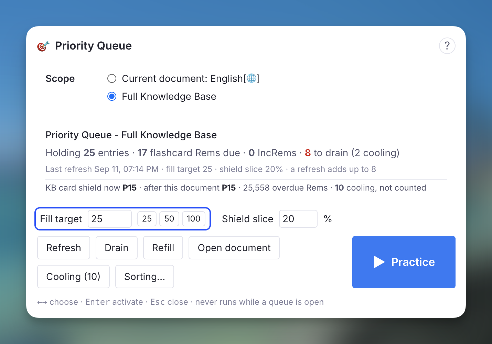
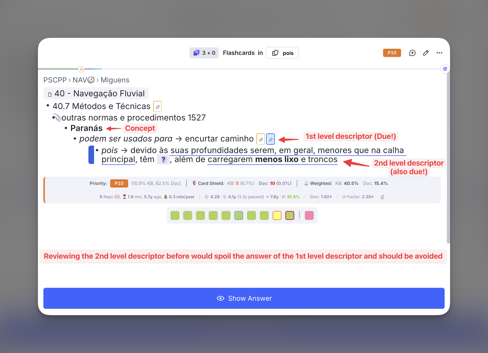
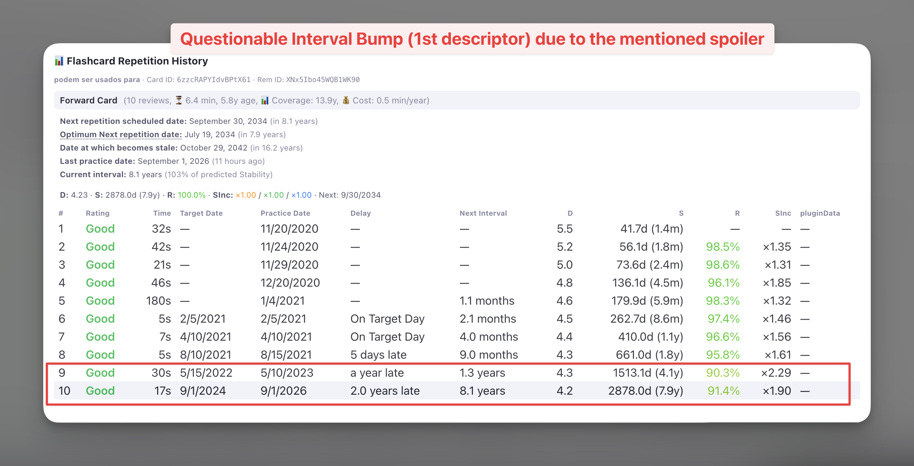
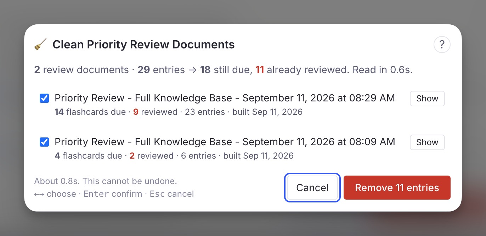

The **Priority Queue** solves the "information overflow" problem inherent to Incremental Reading. It is one persistent review document per scope, kept topped up with your highest-priority due material — both Flashcards and Incremental Rems — and drained as you review it, so each session is a short list drawn from the top of your ranking, following your Sorting Criteria.

---
## The Problem: Why do I need this?

In the standard RemNote queue, plugins like *Incremental RemNote* can control when **Incremental Rems** (articles, videos, notes) appear. However, plugins **cannot control the order of standard Flashcards**. RemNote's native scheduler decides which flashcard comes next, regardless of the priority you set in this plugin.

This creates a problem when you are overwhelmed. If you have 1000 due flashcards, but only time to review 50, you want to ensure those 50 are your *most important* ones. In the standard queue, you might spend your time reviewing low-priority trivia while critical exams or project knowledge remains unseen.

## The Solution

A document made of **Rem references** to your most important due items bypasses that limitation: practise the document and RemNote serves exactly those cards. The plugin used to build such a document as a one-off, timestamped snapshot. The Priority Queue is the same document **kept alive**:

* **One document per scope** — one for your whole knowledge base, one per document or folder you choose — instead of a new one every day.
* **Refill** tops it up to a *fill target* (25 items by default) from the current priority ranking.
* **Drain** removes the entries you have reviewed, and the ones that are [cooling](#cooling-spoiler-protection-across-sessions).
* **Refresh** is both, and runs on its own when you leave the queue.

Small fills are the point. RemNote serves a document's cards in **random order** — its queue provider for a normal document is literally named `random` — so a 100-item document can show its most important card last. The only control a plugin has over what comes *first* is how few items the document holds. Twenty-five items, most of them the top of your ranking (following your Sorting Criteria), is a session you can finish, and the next refresh prepares the next twenty-five.

## The Priority Queue popup

Everything happens from one popup: **Priority Queue** in the Command Palette (quick code `prq`, shortcut `Alt+Shift+R`), the **Priority Queue** entry in any document's ⋯ menu and in the queue's ⋮ menu, or the **Priority Queue** button of the [Incremental RemNote panel](Getting-Started.md#the-incremental-plugin-panel).

{ width="640" }

* **Scope** — the document you came from, or the whole knowledge base. A review document is never offered as a scope: a queue built from a queue would only re-select what it already holds.
* **Status** — what the document holds, how many flashcard Rems and IncRems are still due, how many entries a refresh would drain and how many of those are cooling, the last refresh, and the current settings. Below it, the **card shield now** and **after this document** — the priority the shield would reach once every entry is reviewed — for the KB or for the document scope, with cooling Rems already excluded.
* **Fill target** — how many items the document is topped up to. `25`, `50` and `100` are one click; any number from 5 to 200 works. This is the size of one *burst*: one session works through one fill, and the refresh at the end prepares the next.
* **Shield slice** — the share of each fill taken strictly by priority before your randomness applies. See [why it exists](#the-shield-slice). `0%` follows your [Sorting Criteria](Prioritization-&-Sorting.md#sorting-criteria) exactly.
* **Build / Refresh**, **Drain**, **Refill**, **▶ Practice**, **Open document**, **Cooling**, **Sorting…**.

None of the actions runs while a queue is open — RemNote gathers a document's cards when you press Practice, so editing the document between sessions is safe and editing it during one is not. The popup says so and waits.

The popup is keyboard-driven: `←` `→` move the selection ring across the controls, `Enter` activates, `Esc` closes. Fill target and shield slice are plain number fields; `Enter` or `Esc` inside one hands the keys back.

### Practise it

**▶ Practice** opens the queue on the document — the same thing as its own Practice button. With no document yet, it builds one first. The **▶** button of the [Incremental RemNote panel](Getting-Started.md#the-incremental-plugin-panel) and the command **Practice Priority Queue (Full Knowledge Base)** (quick code `prqgo`) do the same for the whole knowledge base from anywhere.

While you practise, the plugin knows where the items came from: the [Priority Shield](Prioritization-&-Sorting.md#priority-shield) and its history are computed against the **original scope** (the document you chose, or the whole knowledge base), not against the review document itself. See [Smart Scope](#smart-scope--priority-shield-integration).

### Refresh after every session

When you leave the queue after practising a Priority Queue document, the plugin refreshes it a couple of seconds later: what you reviewed is drained, what is now cooling is drained, and the document is topped back up. A toast reports the result. This is the **Refresh the Priority Queue after each session** setting, on by default.

## How Items Are Selected

Every refill runs the same selection:

1.  **Filtering:** every Flashcard Rem and Incremental Rem in scope that is **due** (scheduled for today or earlier).
2.  **Ranking:** by **priority** (0 is highest, 100 is lowest), with your [randomness](Prioritization-&-Sorting.md#sorting-criteria) applied through the priority-weighted lottery — after the [shield slice](#the-shield-slice) has been carved off.
3.  **Mixing:** the two lists are interleaved at your **Flashcard Ratio** — with "10 cards per rem", roughly ten flashcard entries follow each incremental entry.
4.  **Gates**, applied to each flashcard Rem as it is drawn, so their cost is bounded by the fill target rather than by the size of your knowledge base: already in the document, [paused](#paused-document-filtering), [due ancestor](#ancestor-spoiler-protection), [cooling](#cooling-spoiler-protection-across-sessions), and [Card Cluster](#card-cluster-support) expansion.

The status block at the top of the document records what each refresh did, and the popup shows the Rems each gate held back, by name, after every action.

### The shield slice

Your randomness setting marks a share of *positions* across the **whole** ranked due list, uniformly, and refills each marked position from a priority-weighted draw. It does not carve off the bottom of the list. So the first position is marked exactly as often as the ten-thousandth, and when it is, the most important due Rem is thrown into a pool of thousands and lands far down the list. At 40% randomness that happens to each of your top items four times in ten — see [what randomness does not guarantee](Prioritization-&-Sorting.md#what-it-does-not-guarantee).

In a 100-item snapshot a displaced top item usually still landed inside the document, just later. In a 25-item fill there is no "later": the item is simply absent until the next refresh, and the Priority Shield stays where it was however hard you work. The shield slice says the lottery may not touch the first positions. With the default `20%`, the first 5 of a 25-item fill are the 5 most important due items, and your randomness runs over the other 20. Set it to `0%` to follow the Sorting Criteria exactly, or higher to protect more of the head.

The status block and the popup report how many of the added items came from the slice.

### The status block and the graph

The document's first child is a code block that the refresh rewrites each time: scope, fill target and shield slice, what it holds, what the last refresh drained and added, how many Rems are cooling, how many were held back by a due ancestor or skipped as paused, and what is due in scope. Its second child is the **Priority Distribution Graph**, regenerated on every refresh over the document's current entries — absolute priorities and relative percentiles, IncRems and flashcard Rems — so you can see at a glance how concentrated at the top a fill is, and what your randomness setting does to it.

Entries are always appended **below** these two, so the graph stays where it is.

{ width="800" }

## Cooling: spoiler protection across sessions

RemNote's own bury rule keeps a card out of the queue while *another card of the same Rem* was seen in the last **hour**. Anki buries siblings until the next day. Neither is enough for a mature card: a descriptor whose answer was read as context yesterday, or an `Alt+Z` cloze whose sibling cloze was graded three days ago, is still a free recall — and FSRS rewards a free recall with years of unearned stability, as the [ancestor case below](#ancestor-spoiler-protection) shows.

A Rem is **cooling** when it still owes the queue a card, and a card that gives that answer away was graded recently and has since moved on. While cooling, it is left out of the Priority Queue and it is **ineligible to set the Priority Shield** — a Rem whose sibling you just reviewed cannot pin the shield at its priority however much else you clear.

### What counts as a spoiler

Four relations, each a distinct way one review puts another card's answer on screen:

* **Another card of the same Rem** — the other direction, or another cloze in the same text. RemNote's hour-long bury, extended.
* **A sibling `Alt+Z` cloze under the same parent extract**, or the **parent extract itself** read as an Incremental Rem. Each cloze quotes the whole sentence with one span blanked, so any one of them shows the others' answers.
* **One of the Rem's own `Alt+Z` clozes**, when the Rem carries a card of its own as well.
* **A child or grandchild card**, whose context line displayed this Rem's answer — the [ancestor gate](#ancestor-spoiler-protection) extended across time, in the direction that actually spoils.

Card Cluster siblings never cool each other: a cluster is designed to be shown together, and RemNote treats it as one unit. A sibling rated *Again* that is still due does not cool anything either — RemNote's own rule already separates that pair within the hour.

### How long

The window belongs to the cooled card and scales with its own interval, because a mature card is both more damaged by a free recall and cheaper to delay:

```
cooling days = clamp( ceil( interval × 5% ), 1, 15 )
```

| Card interval | Cooling |
|---|---|
| a new card | 1 day |
| 10 days | 1 day |
| 60 days | 3 days |
| 200 days | 10 days |
| a year or more | 15 days |

Counted from the moment the spoiling card was seen, not from when the plugin noticed. The three parameters — the share of the interval, the minimum and the maximum — are in the [settings](Plugin-Settings-Reference.md#queue).

### Nothing is stored

The cooling set is **recomputed from your card data** on every refresh and at every queue exit — it is a function of what is scheduled and when each card was last shown. That is what makes it correct on every device the moment your cards sync, impossible to disagree with reality, and immune to a wipe of the plugin's synced storage. The only thing persisted is what *you* decide about specific Rems (below), one small record per knowledge base.

### The Cooling list

**Cooling** in the popup lists every Rem currently cooling, highest priority first: the reason and when it happened, the day it comes back, and the length of its window. Three actions per Rem:

* **Release** — stop cooling now. A sibling reviewed *later* cools it again.
* **+7d** — keep it cooling a week longer.
* **Never** — exempt this Rem from cooling for good.

`↑` `↓` choose a row, `R`, `E`, `N` act on it, `Enter` opens the Rem, `Esc` goes back. **Rescan** re-judges the 200 highest-priority Rems with due cards on the spot.

## The Priority Review Queue in your sidebar

Every Priority Queue document is tagged `#Priority Review Queue`, and that tag Rem lists all of them: open it and the **All Tagged Bullets** table shows every one, on desktop and on your phone alike. The **👁** button of the panel opens it.

The first time the plugin builds a review document, it **pins that tag Rem to your left sidebar**. This happens once per knowledge base, ever. If you unpin it, it stays unpinned — the plugin will not put it back. The reason is mobile: the plugin panel is not rendered on a phone, the sidebar is, and a pinned Priority Review Queue is one tap away from a document you refreshed at your desk.

The documents themselves live as children of the tag Rem, so they stay together, and practising the tag Rem still gathers every one of them with its descendants.

## Paused Document Filtering

RemNote's **Deck Status** system lets you mark a document (deck) as **Paused**, which signals that you are temporarily not reviewing material from that source. Without any filtering, due flashcards inside paused documents would still be selected — consuming slots that belong to your active material.

### How It Works

As each candidate flashcard Rem is pulled into the mixing loop:

1. The plugin walks the Rem's ancestor chain looking for a Rem that carries the `Deck` powerup.
2. If it finds one, it reads the `Status` slot.
3. If the status is `"Paused"`, the Rem is skipped and reported — **unless** its absolute priority is 20 or lower, in which case it is always included.

This check is **lazy**: it runs for each card as it is drawn, so the number of ancestor walks is bounded by the fill target, not by the number of due cards in your knowledge base.

### What You See

The popup lists the skipped Rems with their priority after the action, and the status block counts them.

---

## Ancestor Spoiler Protection

A descriptor with flashcards can sit above another descriptor with flashcards. When you practise the **child**, RemNote shows the parent above the question as context — **answer included**. If the parent's own card was due too and simply happened to come up later in the session, you have already read its answer: it gets graded as a successful recall it never had to make, and a card with years of accumulated stability walks away with years more.

{ width="800" }

Above, the card being asked is the **second-level** descriptor — the stats bar belongs to *it*, not to the card it is about to give away. The **first-level** descriptor sits right on top of it with its answer, *encurtar caminho*, in plain sight, and it was due in the same session. When it came up a few minutes later it was graded **Good** (*Recalled With Effort*) in **17 seconds**, and its interval went from **1.3 years to 8.1 years** — next practice in 2034 — on the strength of a line that had already been read.

{ width="800" }

The [Flashcard Repetition History](Reviewing-Items-in-the-Queue.md#flashcard-repetition-history) of that first-level card records the damage. Repetition 10 answered a card a little before (3.3 years since last repetition) the optimum time suggested by its calculated previous 4.1 years stability (Retrievability being estimated at 91.4%), and FSRS read that as a card far stronger than it was: stability **4.1 → 7.9 years**, a ×1.90 bump, and a decade of scheduling bought with no retrieval at all. Nothing in the history marks it as unearned — from here on, it is simply what the card knows about itself.

RemNote does not prevent this natively, so the Priority Queue does.

### How It Works

As each candidate flashcard Rem is drawn, the plugin looks at its **parent and grandparent** — two levels, the range where the context line still carries an answer rather than a section or document title:

1. If neither ancestor has a due card, the Rem is included as normal.
2. If one does, the Rem is **held back**, and the blocking ancestor **takes its place in the document**.
3. When *both* ancestors are due, the **grandparent** is the one swapped in — the highest blocker, not the nearest — so releasing it frees the parent for the next refresh, which in turn frees the original card. The tree drains top-down, one level per review.
4. If the blocking ancestor is itself [cooling](#cooling-spoiler-protection-across-sessions), nothing is swapped in: both wait, and the popup says so.

The swap is the point. Dropping the child on its own would leave the block standing: the parent might not be drawn this time, and the same pair would collide again at the next refresh. Practising the ancestor **now** is what makes the descendant free next time. The ancestor swapped in may be **lower priority** than the card it displaced — its priority is beside the point; it is in the way.

Due-ness is read from the ancestor's **actual cards**, not from the plugin's priority cache, so a flashcard you created minutes ago still protects its descendants. A never-practised card counts as due — the case that matters most, since nothing has been recalled for the descendant to give away.

Once the ancestor *has* been reviewed, its descendant returns at a later refresh — and that is exactly when the reverse relation takes over: a descendant reviewed recently cools its ancestor, since the descendant's context line showed the ancestor's answer. The two rules are the same rule in the two directions of time.

### What You See

After an action, a **purple 🎭 panel** in the popup lists each held-back Rem with its priority, the blocking parent or grandparent, and what happened to that ancestor: swapped in, already in the document, cooling, or unavailable. The status block counts them.

> [!NOTE]
> This check is always on and has no threshold — unlike the paused filter, there is no priority high enough to make reading an answer before recalling it a good trade.

---

## Card Cluster Support

RemNote's **[Card Cluster](https://help.remnote.com/en/articles/10104223-card-clusters)** powerup (activated via `/cluster`) lets you group closely related flashcards under a shared parent so they are always reviewed together in the queue. When you practice a cluster, RemNote shows the sibling cards in order — the ones before the active card in grey for context, and the remaining ones as empty boxes.

### The Problem

Without special handling, the selection would pick individual flashcard Rems on priority alone. If a clustered parent had three children — all due — but only one ranked among the top by priority, the other two siblings would be absent from the document. When RemNote encountered that isolated Rem in the queue, it would have no cluster siblings to display, silently breaking the cluster experience.

### How the Plugin Handles It

Every time a flashcard Rem is selected, the plugin:

1. Looks up the Rem's **direct parent**.
2. Checks whether the parent carries the Card Cluster powerup (using multiple code variants and a tag-name fallback, since RemNote does not expose the cluster powerup code in its public Plugin SDK).
3. If a cluster is detected, **all sibling Rems** (other direct children of that parent) that currently have **due cards** are added alongside the triggering Rem — cooling or not, since cluster members are meant to be seen together.

| Scenario | Behaviour |
|---|---|
| Only one cluster member meets the priority threshold | All due siblings are pulled in automatically |
| Multiple cluster members independently meet the threshold | Each one triggers the cluster check; the deduplication set ensures no Rem is added twice |
| No cluster members are due | Nothing extra is added |
| Cluster siblings push the total above the fill target | Siblings are still included — a partial cluster would break the queue experience |

> [!NOTE]
> The count in the status block reflects the **actual** number of entries, which may exceed the fill target when cluster siblings are added. This is intentional.

---

## Smart Scope & Priority Shield Integration

Even though you are reviewing a generated list, the plugin knows where the items came from.

* **Original Scope Awareness:** While reviewing a Priority Queue document, the plugin "pretends" you are reviewing the original source.
* **[Priority Shield](Prioritization-&-Sorting.md#priority-shield):** The Priority Shield (the stats below the answer buttons) calculates your protection against the **original scope** — the document you chose, or the whole knowledge base — never against the review document itself. *Example:* a Priority Queue scoped to "Biology 101" shows how well you are protecting priorities within "Biology 101".
* **Cooling Rems are not counted.** A Rem whose spoiler sibling you reviewed recently cannot set the shield, live or in the history graph — the set is recomputed at every queue exit, so the siblings you just reviewed are already accounted for.
* **Stats Tracking:** The history graph records your progress against the original document or the whole knowledge base, keeping your long-term stats accurate.

## Cleaning up leftovers

The **Clean Priority Review Documents** command (quick code `clean`) is the manual counterpart of Drain, across every document tagged `#Priority Review Queue` at once: it works out which entries still have something due and removes the rest after you confirm, per document. It also handles any timestamped snapshot documents built by earlier versions of the plugin, and offers to delete those once no flashcard in them is due.

A Priority Queue document is never deleted by it — it is emptied and refilled, not thrown away — and the same rules protect your own writing everywhere: an entry with notes written under it, an entry you typed next to, or a bullet of your own in the document is never touched, and a document holding any of these is never deleted.

"Due" here means **due at any point up to the end of today**, not due at this exact second. A card you answered *Forgot* an hour ago is sitting in a learning step ten minutes out: it is not due right now, but it is coming back in this very session, and deleting its entry would take it out of the document that is meant to bring it back.

{ width="650" }

!!! note "Incremental Rems need the queue to have been opened once"
    `INC` entries are judged against the plugin's Incremental Rem cache. If that cache has not been built yet in this session, an unbuilt cache is indistinguishable from *every incremental Rem has been reviewed* — so the command says so and leaves all `INC` entries alone. Open the queue once and run it again.

---

## Best Practices

* **The daily loop:** open the popup, press **Refresh** (or trust the automatic one from your last session), press **Practice**, finish the fill. Leave the queue; the document is ready again before you are. Repeat as long as you have energy — each fill is the current top of your ranking, and each one raises your [Priority Shield](Prioritization-&-Sorting.md#priority-shield).
* **The "Overwhelmed" workflow:** 1000+ due cards is not a problem the queue can solve by itself. A fill target of 25 or 50 on the full knowledge base is a session you can finish, and finishing it is what moves the shield.
* **The "Deep Dive" workflow:** to focus on one project, open that document, pick it as the scope, and work through its Priority Queue until the document-scoped shield reads clear.
* **Watch the Cooling list.** It is the list of Rems the plugin is deliberately not asking you about. If a Rem there surprises you, **Release** it.
* **Maintain Priority Hygiene:** to make sure the Priority Queue catches your most critical content, set priorities on your key documents and flashcards, and run "**[Update all inherited Card Priorities](Priorities-for-Flashcards.md#manual-full-kb-sweep-update-all-inherited-card-priorities)**" periodically (e.g., weekly), so every flashcard — even those you haven't manually touched — inherits the correct priority from its parent document.

---

## Technical: Card State Detection

This section documents how the plugin distinguishes between **active**, **paused**, and **disabled** flashcard rems, which RemNote SDK call to use for each, and exactly where the plugin applies (or omits) the resulting filters.

### Card States in RemNote

| State | Description | How to detect |
|---|---|---|
| **Active** | Card is in the normal review cycle. `nextRepetitionTime` is a future timestamp. | `card.nextRepetitionTime > Date.now()` |
| **Due** | Card is overdue or due today. `nextRepetitionTime` is a past timestamp. | `(card.nextRepetitionTime ?? Infinity) <= Date.now()` |
| **Disabled** | Card has been explicitly disabled by the user (toggle off). `nextRepetitionTime` is `null`. | `card.nextRepetitionTime === null` |
| **Paused (deck)** | The card's source document has been paused via the Deck Status system. The card itself still has a valid (often past-due) `nextRepetitionTime`. | Walk ancestor chain: find the rem with `hasPowerup(BuiltInPowerupCodes.Deck)`, read `getPowerupProperty(BuiltInPowerupCodes.Deck, 'Status')` → `"Paused"` |

### Key API Behaviour

**`plugin.card.getAll()`** returns *all* cards in the knowledge base, regardless of state — active, due, disabled, and paused-deck cards alike. This is the call used when building the priority cache at startup, and the one read the cooling scan pays once per refresh.

**`rem.getCards()`** returns the cards for a specific rem but behaves differently depending on rem state:

- For a **normal rem**: returns the rem's cards as expected.
- For a rem inside a **paused document**: returns `[]` — the SDK silently suppresses the cards. This makes `rem.getCards()` an *unreliable* source for building the full card universe; use `plugin.card.getAll()` instead.
- For a rem with **disabled cards**: also returns `[]`.

### How the Plugin Handles Each State

#### Disabled cards (`nextRepetitionTime === null`)

Disabled cards are implicitly excluded everywhere the plugin evaluates "due cards". The pattern:

```ts
(card.nextRepetitionTime ?? Infinity) <= now
```

maps `null` to `Infinity`, so a disabled card never satisfies the `<= now` condition. This is an **implicit** exclusion — there is no explicit disabled-card filter — but it produces the correct result in every context where the plugin counts or selects due cards.

| Where | Effect on disabled cards |
|---|---|
| **Due-card priority cache** (`card_priority/index.ts`) | Excluded — `?? Infinity` never satisfies `<= now`. Not counted in `dueCards` or `dueCardsOverdue`. |
| **`getDueCardsWithPriorities`** | Excluded — uses the same `?? Infinity` filter to build the `remDueCardCount` map. |
| **Priority Queue selection** | Excluded — flows through `getDueCardsWithPriorities`, so they never reach the mixing loop. |
| **Cooling** | A disabled card cannot be spoiled (never due) and, having no viewing after it was disabled, does not spoil. |
| **Priority Shield (widget)** | Excluded from due count; cached `dueCards` field is always 0 for disabled cards. |

#### Paused-deck cards (`nextRepetitionTime` is a valid past timestamp)

Paused cards *do* have a valid `nextRepetitionTime` in the past, so they pass the `<= now` filter and are treated as due unless explicitly checked. The plugin uses the **ancestor-chain walk** described above (`isInPausedDocument`) to detect them.

| Where | Effect on paused-deck cards |
|---|---|
| **Due-card priority cache** | **Included** — `nextRepetitionTime` is valid, so the `?? Infinity` filter does not exclude them. Their `CardPriorityInfo` entry enters the cache, stamped `paused` by the paused-deck scan. |
| **Priority Shield (widget)** | Suppressed through the `paused` stamp. |
| **Priority Queue selection** | **Filtered out** via the lazy `isInPausedDocument` ancestor walk. High-priority items (priority ≤ 20) bypass the filter and are always included. |

### Why `rem.getCards()` Is Not Used for Paused Detection

A paused rem returns `[]` from `rem.getCards()`, which looks identical to a disabled rem or simply a rem with no cards. There is no way to distinguish between these three cases from the return value alone. The Deck powerup `Status` slot is the authoritative signal for pause state, and the ancestor walk is the only reliable way to retrieve it.

### Source References

| File | Topic |
|---|---|
| `src/lib/priority_review_document/select.ts` | The selection: ranking, shield slice, mixing, and the four gates |
| `src/lib/priority_review_document/queue_doc.ts` | The persistent document: find-or-create, refresh / drain / refill, status block, Practice route |
| `src/lib/priority_review_document/cooling.ts` | The cooling rule, pure and fixture-tested (`npm test`) |
| `src/lib/priority_review_document/cooling_gather.ts` | Turning cards and the tree into the facts the rule judges |
| `src/lib/priority_review_document/clean.ts` | Drain, and the Clean command |
