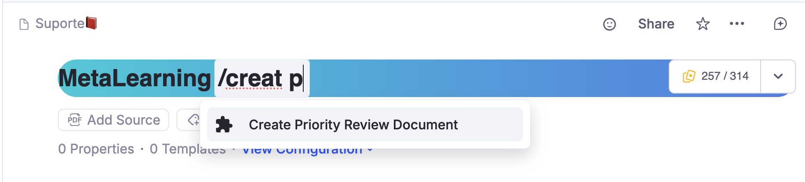
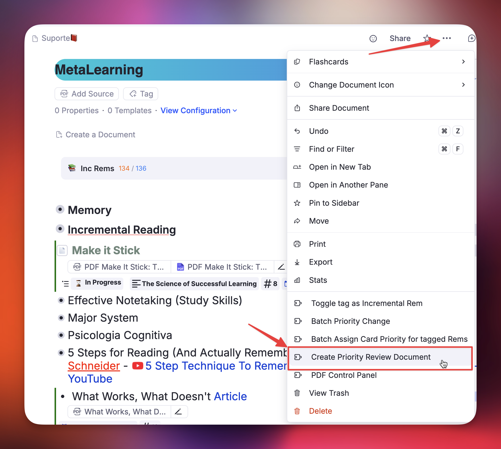
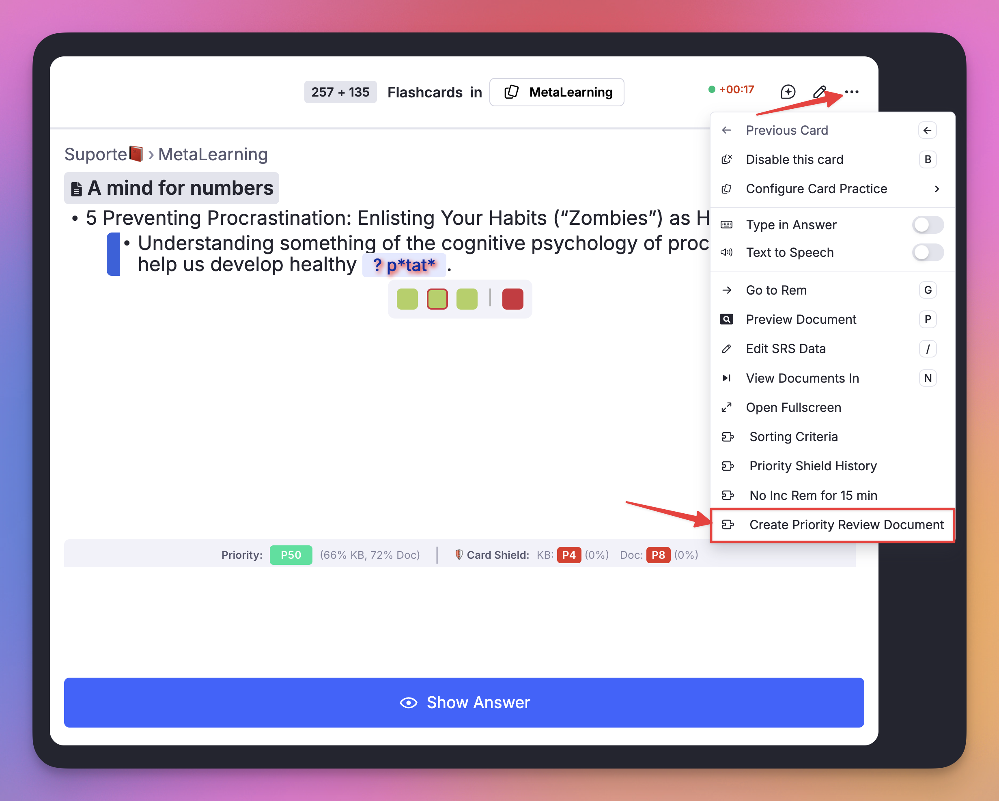
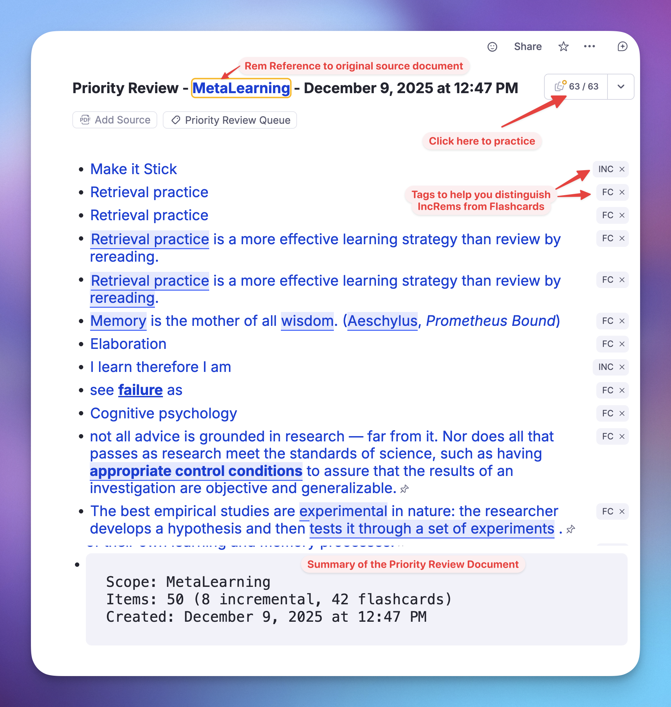
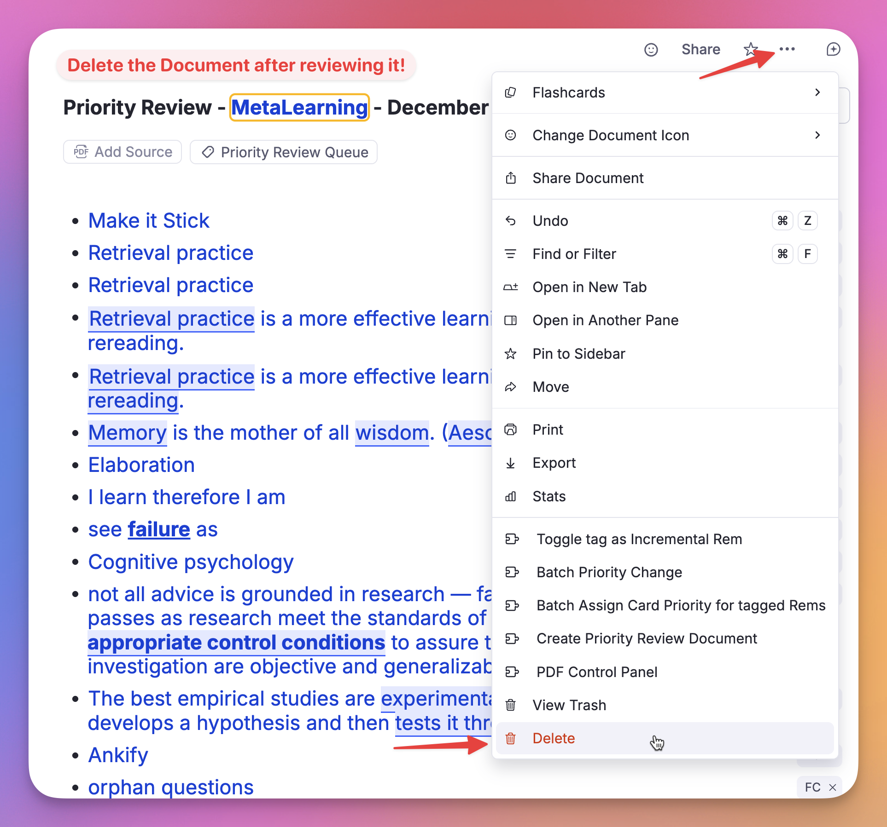

The **Priority Review Document** is a powerful feature designed to solve the "information overflow" problem inherent to Incremental Reading. It allows you to generate a custom, disposable review queue containing your highest-priority material — both Flashcards and Incremental Rems — sorted exactly how you want them.

---
## The Problem: Why do I need this?

In the standard RemNote queue, plugins like *Incremental Everything* can control when **Incremental Rems** (articles, videos, notes) appear. However, plugins **cannot control the order of standard Flashcards**. RemNote's native scheduler decides which flashcard comes next, regardless of the priority you set in this plugin.

This creates a problem when you are overwhelmed. If you have 1000 due flashcards, but only time to review 50, you want to ensure those 50 are your *most important* ones. In the standard queue, you might spend your time reviewing low-priority trivia while critical exams or project knowledge remains unseen.

## The Solution

The **Priority Review Document** bypasses this limitation by creating a temporary document filled with **Rem References (Portals)** to your most important due items.

When you practice this specific document, you are guaranteed to see:
1.  **High-Priority Flashcards** first.
2.  **High-Priority Incremental Rems** interleaved according to your ratio settings.
3.  A manageable workload (e.g., exactly 50 items) instead of an endless queue.

## How to Create a Priority Review Document

You can create a review document from anywhere in RemNote:

### 1. Access the Creator
* **Command Palette:** Type `/Create Priority Review Document` and press Enter.
{ width="700" }


* **Document Menu:** Click the 3-dots menu (`...`) at the top right of any document → "Create Priority Review Document".
{ width="700" }


* **Queue Menu:** Inside the queue, click the plugin menu icon (puzzle piece or 3-dots) → "Create Priority Review Document".
{ width="700" }


* **Keyboard Shortcut:** Press [`Opt+Shift+R`](Keyboard-Shortcuts.md#batch-operations) (Mac) or [`Alt+Shift+R`](Keyboard-Shortcuts.md#batch-operations) (Windows).

### 2. Configure Your Session
A popup will appear allowing you to tailor the session:

* **(1) Scope:**
    * **Current Document:** Selects high-priority items only from the document you were just viewing (and its descendants/references).
    * **Full Knowledge Base:** Scans your entire database to find the absolute highest priority items due today.
* **(2) Number of Items:** Set a hard limit (e.g., 50, 100, or 200). This helps prevent burnout by giving you a finish line.
  * Note: Due to RemNote queue [gathering rules](https://help.remnote.com/en/articles/8892109-how-does-remnote-decide-what-flashcards-are-part-of-a-document) and its _recursive_ nature, the size of the queue when you click "Practice" and enter the queue will probably be larger, as RemNote will gather e.g. rems that are referenced within the selected items.
* **(3) Content Mix:** Displays the current ratio of Flashcards to Incremental Rems (e.g., "6 flashcards for every incremental rem"). 
  * Note: This ratio is pulled from your "[Prioritization-&-Sorting#sorting-criteria](Prioritization-&-Sorting.md#sorting-criteria)" settings. _If the ratio is not the desired or if you can check the randomness, press the button (4) **Change Sorting Criteria Settings**_.
* **(4) Skip paused documents** *(default: on)*: When enabled, flashcard rems that live inside a document whose **Deck Status** is **"Paused"** are excluded from the review session. This prevents a paused deck from silently filling slots that should go to your active, high-priority material.
  * **Priority override threshold:** A number input (default **20**) lets you keep items with a priority of that value or less — even if they sit inside a paused document. This ensures genuinely critical items are never silently dropped.
  * If any items are skipped, a **warning panel** appears after creation listing each skipped rem (name and absolute priority), sorted from highest to lowest priority. Items with priority < 20 are highlighted in red as potential high-priority oversights. The same list is printed to the browser console with rem IDs for easy lookup.

> **Keyboard tip :keyboard: :** 
> The popup is fully keyboard-navigable:
> * **Initial focus** lands on the **Scope** radio buttons when the popup opens — no mouse click needed to start.
> * **↑ / ↓ arrow keys** switch between "Current Document" (↑) and "Full Knowledge Base" (↓) (when "Scope" selection section is focused), and increment/decrement the "Number of Items" (if focused) by 10.
> * **Tab / Shift+Tab** cycles between the Scope selection and the Number of Items field.
> * **Enter** at any point — regardless of which element has focus — triggers "Create Review Document" immediately, while **Esc** cancels the operation and closes the widget.

{ width="600" }


### 3. Review
Click (5) **"Create Review Document"**.
The plugin will generate a new document tagged `#Priority Review Queue` and automatically open it.
1.  Click the **Practice** button (Flashcards) on this new document.
2.  Review your items as normal.
3.  When finished, you can safely **delete** the Priority Review Document. The actual items (your cards and notes) are just references; deleting the review document **does not** delete your actual data.

{ width="800" }

{ width="800" }

---

## How Items Are Selected

The plugin uses a sophisticated selection process to ensure you see the right material:

1.  **Filtering:** It gathers all items (Flashcards and Incremental Rems) that are **Due** (scheduled for today or in the past).
2.  **Scoping:** It filters these items based on your selected scope (Specific Document or Full KB).
3.  **Sorting:** It ranks them by **Priority** (0 is highest, 100 is lowest).
4.  **Randomness:** It applies your **[Prioritization-&-Sorting#sorting-criteria](Prioritization-&-Sorting.md#sorting-criteria)** randomness settings.
    * *Low randomness* = Strict adherence to priority (0, 1, 2...).
    * *High randomness* = Introduces serendipity, allowing lower priority items to surface occasionally.
5.  **Mixing:** It interleaves the lists based on your **Flashcard Ratio**.
    * *Example:* If your ratio is "6 cards per rem", the document will contain roughly 6 flashcard references followed by 1 incremental rem reference, repeating until the item limit is reached.

### Priority Review Document Graph View

To help users visualize how the items are selected, a **Priority Distribution Graph** is automatically generated at the **top** of the Priority Review Document (in a rem with the **Priority Review Graph** _powerup_).

{ width="800" }

This visualization helps you verify:
*   **The effect of Randomness:** See how "shuffled" your review session is compared to a strict priority order.
*   **[Priority Shield](Prioritization-&-Sorting.md#priority-shield) Logic:** Confirm that the system is correctly prioritizing your high-value items as expected.
*   **Scope Distribution:** Visualize the balance of absolute priorities and relative percentiles within your included Incremental Rems and Flashcards.

{ width="400" }

{ width="500" }

## Paused Document Filtering

RemNote's **Deck Status** system lets you mark a document (deck) as **Paused**, which signals that you are temporarily not reviewing material from that source. Without any filtering, due flashcards inside paused documents would still be selected by the Priority Review Document generator — consuming slots that belong to your active material.

### How It Works

When **Skip paused documents** is enabled (default), the plugin checks each candidate flashcard rem as it is pulled into the mixing loop:

1. It walks the rem's ancestor chain looking for a rem that carries the `Deck` powerup.
2. If it finds one, it reads the `Status` slot.
3. If the status is `"Paused"`, the rem is skipped and added to a warning list instead of the document — **unless** its absolute priority is ≤ the configured threshold (default: 20), in which case it is always included.

This check is **lazy**: the ancestor walk runs for each card as it is pulled into the mixing loop, rather than pre-walking every due card in the knowledge base upfront. If you request 50 items, at most ~50 ancestor walks happen — not one per due card in your entire KB (which could be thousands). The total ancestor-walk cost is bounded by the number of items requested, not by the size of your knowledge base.

### What You See

After creation, if any items were skipped:
- A **warning panel** replaces the "How it works" info box, showing the count and a scrollable list of skipped rems (name + priority score).
- Items with priority < 20 are highlighted in **red** to flag potential high-priority oversight.
- The document's **metadata code block** includes a `Skipped (paused docs): N flashcard rems` line.
- The full list with rem IDs is printed to the **browser console** for investigation.

The document auto-closes only when there are no skipped items; otherwise the warning panel stays open until you explicitly click **Close**.

---

## Card Cluster Support

RemNote's **[Card Cluster](https://help.remnote.com/en/articles/10104223-card-clusters)** powerup (activated via `/cluster`) lets you group closely related flashcards under a shared parent so they are always reviewed together in the queue. When you practice a cluster, RemNote shows the sibling cards in order — the ones before the active card in grey for context, and the remaining ones as empty boxes.

### The Problem

Without any special handling, the Priority Review Document generator would select individual flashcard rems based solely on priority. If a clustered parent had three children — all with due cards — but only one ranked among the top-N by priority, the other two siblings would be absent from the document. When RemNote encountered that isolated rem during the review queue, it would have no cluster siblings to display, silently breaking the cluster experience.

### How the Plugin Handles It

Starting from **v0.2.178**, every time a flashcard rem is selected for inclusion in the document, the plugin:

1. Looks up the rem's **direct parent**.
2. Checks whether the parent carries the Card Cluster powerup (using multiple code variants and a tag-name fallback, since RemNote does not yet expose the cluster powerup code in its public Plugin SDK).
3. If a cluster is detected, **all sibling rems** (other direct children of that parent) that currently have **due cards** are automatically added to the document alongside the triggering rem.

### What This Means in Practice

| Scenario | Behaviour |
|---|---|
| Only one cluster member meets the priority threshold | All due siblings are pulled in automatically |
| Multiple cluster members independently meet the threshold | Each one triggers the cluster check; the deduplication set ensures no rem is added twice |
| No cluster members are due | Nothing extra is added (the normal selection path applies) |
| Cluster siblings push the total above the configured item limit | Siblings are still included — a partial cluster would break the queue experience |

> [!NOTE]
> The item count shown in the document metadata reflects the **actual** number of portals created, which may exceed your requested limit when cluster siblings are added. This is intentional and expected.

### Why You Don't Need to Do Anything

The cluster expansion is **fully automatic**. As long as your flashcard rems have been grouped under a parent tagged with `/cluster`, the plugin detects and respects the cluster. No extra configuration is required.

---

## Smart Scope & Priority Shield Integration

Even though you are reviewing a generated list, the plugin is smart enough to know where the items came from.

* **Original Scope Awareness:** While reviewing a Priority Review Document, the plugin "pretends" you are reviewing the original source.
* **[Priority Shield](Prioritization-&-Sorting.md#priority-shield):** The Priority Shield (the stats below the answer buttons) will calculate your protection based on the **Original Scope**.
    * *Example:* If you generate a review doc for "Biology 101", the shield will show you how well you are protecting priorities within the "Biology 101" folder, not just the temporary review document.
* **Stats Tracking:** The history graph will record your progress against the original document or Full KB, keeping your long-term stats accurate.

## Best Practices

* **The "Overwhelmed" Workflow:** If you wake up to 1000+ due cards, don't panic. Create a Priority Review Document for 100 items (Full KB). Review them. If you have energy left, create another. If not, you can stop knowing you tackled the most important 100 items.
* **The "Deep Dive" Workflow:** If you want to focus specifically on one project, navigate to that folder, create a Priority Review Document (Current Document scope), and finish that queue completely before moving on.
* **Maintain Priority Hygiene:** To ensure your Priority Review Documents accurately catch your most critical content, regularly set priorities on your key documents and flashcards. Crucially, run the "**[Priorities-for-Flashcards#maintenance-the-update-all-inherited-card-priorities-command](Priorities-for-Flashcards.md#manual-full-kb-sweep-update-all-inherited-card-priorities)**" command periodically (e.g., weekly). This updates the priority inheritance across your entire knowledge base, ensuring that every single flashcard — even those you haven't manually touched — inherits the correct priority from its parent document.
* **Cleanup:** Get in the habit of deleting these documents after you finish the queue. They are meant to be temporary snapshots of your priorities at that specific moment. Leaving them in your collection will create unnecessary rem references to your items, cluttering the UI and making your KB heavier and slower.

---

## Technical: Card State Detection

This section documents how the plugin distinguishes between **active**, **paused**, and **disabled** flashcard rems, which RemNote SDK call to use for each, and exactly where the plugin applies (or omits) the resulting filters.

### Card States in RemNote

| State | Description | How to detect |
|---|---|---|
| **Active** | Card is in the normal review cycle. `nextRepetitionTime` is a future timestamp. | `card.nextRepetitionTime > Date.now()` |
| **Due** | Card is overdue or due today. `nextRepetitionTime` is a past timestamp. | `(card.nextRepetitionTime ?? Infinity) <= Date.now()` |
| **Disabled** | Card has been explicitly disabled by the user (toggle off). `nextRepetitionTime` is `null`. | `card.nextRepetitionTime === null` |
| **Paused (deck)** | The card's source document has been paused via the Deck Status system. The card itself still has a valid (often past-due) `nextRepetitionTime`. | Walk ancestor chain: find the rem with `hasPowerup(BuiltInPowerupCodes.Deck)`, read `getPowerupProperty(BuiltInPowerupCodes.Deck, 'Status')` → `"Paused"` |

### Key API Behaviour

**`plugin.card.getAll()`** returns *all* cards in the knowledge base, regardless of state — active, due, disabled, and paused-deck cards alike. This is the call used when building the priority cache at startup.

**`rem.getCards()`** returns the cards for a specific rem but behaves differently depending on rem state:
- For a **normal rem**: returns the rem's cards as expected.
- For a rem inside a **paused document**: returns `[]` — the SDK silently suppresses the cards. This makes `rem.getCards()` an *unreliable* source for building the full card universe; use `plugin.card.getAll()` instead.
- For a rem with **disabled cards**: also returns `[]`.

### How the Plugin Handles Each State

#### Disabled cards (`nextRepetitionTime === null`)

Disabled cards are implicitly excluded everywhere the plugin evaluates "due cards". The pattern:

```ts
(card.nextRepetitionTime ?? Infinity) <= now
```

maps `null` to `Infinity`, so a disabled card never satisfies the `<= now` condition. This is an **implicit** exclusion — there is no explicit disabled-card filter — but it produces the correct result in every context where the plugin counts or selects due cards.

| Where | Effect on disabled cards |
|---|---|
| **Due-card priority cache** (`card_priority/index.ts`) | Excluded — `?? Infinity` never satisfies `<= now`. Not counted in `dueCards` or `dueCardsOverdue`. |
| **`getDueCardsWithPriorities`** | Excluded — uses the same `?? Infinity` filter to build the `remDueCardCount` map. |
| **Priority Review Document** | Excluded — flows through `getDueCardsWithPriorities`, so they never reach the mixing loop. |
| **Priority Shield (widget)** | Excluded from due count; cached `dueCards` field is always 0 for disabled cards. |

#### Paused-deck cards (`nextRepetitionTime` is a valid past timestamp)

Paused cards *do* have a valid `nextRepetitionTime` in the past, so they pass the `<= now` filter and are treated as due unless explicitly checked. The plugin uses the **ancestor-chain walk** described above (`isInPausedDocument`) to detect them.

| Where | Effect on paused-deck cards |
|---|---|
| **Due-card priority cache** | **Included** — `nextRepetitionTime` is valid, so the `?? Infinity` filter does not exclude them. Their `CardPriorityInfo` entry enters the cache. |
| **Priority Shield (widget)** | **Slightly inflated** — paused cards are counted in the shield's due total. The absolute-priority score (top candidate) is safe because it uses `rem.getCards()` against the shield's top-priority rem, and that rem is typically not paused. The percentile/count view may be marginally overstated. This is an accepted minor inaccuracy. |
| **Priority Review Document** | **Filtered out** (when "Skip paused documents" is on) via the lazy `isInPausedDocument` ancestor walk inside `addCard`. High-priority items (priority ≤ threshold) bypass the filter and are always included. |

### Why `rem.getCards()` Is Not Used for Paused Detection

A paused rem returns `[]` from `rem.getCards()`, which looks identical to a disabled rem or simply a rem with no cards. There is no way to distinguish between these three cases from the return value alone. The Deck powerup `Status` slot is the authoritative signal for pause state, and the ancestor walk is the only reliable way to retrieve it.

### Source References

| File | Lines | Topic |
|---|---|---|
| `src/lib/card_priority/index.ts` | `~70–71` | `?? Infinity` due filter with disabled-card comment |
| `src/lib/card_priority/index.ts` | `~427` | Same filter in `getDueCardsWithPrioritiesSlow` |
| `src/lib/priority_review_document/index.ts` | `isInPausedDocument` helper | Ancestor-chain paused detection |
| `src/lib/priority_review_document/index.ts` | `addCard` inner function | Lazy per-card paused check with threshold bypass |