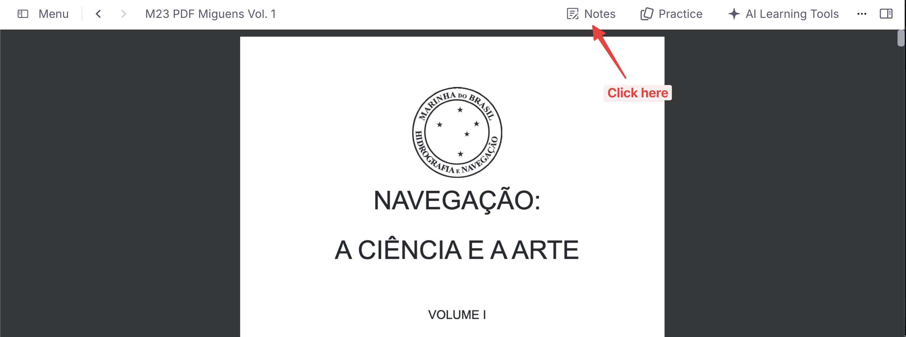
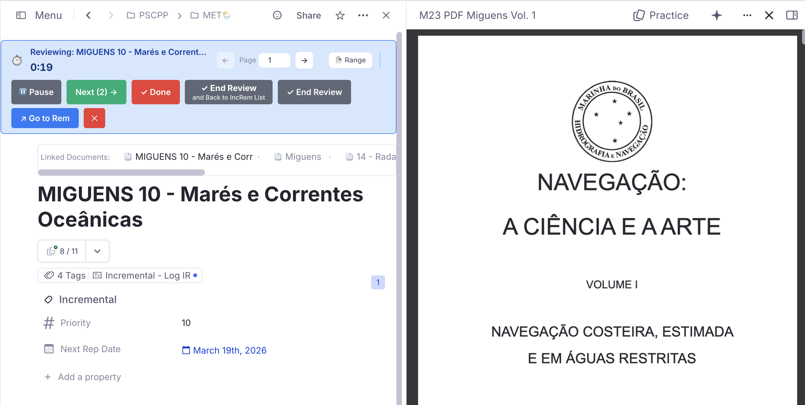

# Reviewing Items in the Editor

While the Queue (Flashcard) interface is the primary way to review Incremental Rems, there are times when you need the full power of the RemNote editor to process complex information. 

This page covers the two main alternative workflows for reviewing items outside of the queue: the **Execute Repetition** command (for single items) and **Sequential Review** via the IncRem lists (for batch processing).

---

## Table of Contents

- [1. Execute Repetition Command](#1-execute-repetition-command)
  - [When to Use It](#when-to-use-it)
  - [How It Works](#how-it-works)
  - [Key Behavior](#key-behavior)
  - [Execute Repetition vs. Reschedule in Editor](#execute-repetition-vs-reschedule-in-editor)
- [2. Sequential Review via IncRem Lists](#2-sequential-review-via-increm-lists)
  - [The Problem This Solves](#the-problem-this-solves)
  - [How to Start a Sequential Review](#how-to-start-a-sequential-review)
  - [The Workflow](#the-workflow)
  - [Layout & Responsiveness](#layout--responsiveness)
  - [Reviewing PDF Items](#reviewing-pdf-items)
  - [Jumping Back to Your Last Bookmark](#jumping-back-to-your-last-bookmark)
- [Read Points for Rem-type Incremental Rems](#read-points-for-rem-type-incremental-rems)
  - [Setting a Read Point](#setting-a-read-point)
  - [Jumping to the Read Point](#jumping-to-the-read-point)
- [3. Incremental Reading: Extracts & Clozes](#3-incremental-reading-extracts--clozes)
  - [Extracting Text](#extracting-text)
  - [Creating Clozes](#creating-clozes)
  - [Built-in Remove From Queue Support](#built-in-remove-from-queue-support)

---

## 1. Execute Repetition Command

The **Execute Repetition** command (`Ctrl+Shift+J`) lets you register a review of an Incremental Rem directly from the editor, without entering the queue.

### When to Use It

- **Reading in the editor**: You opened an Incremental Rem in the editor (via "-> Go to Rem" or navigation) and finished reviewing it there.
- **Extended work sessions**: You spent significant time on an item and want to log both the review and the time spent.
- **Avoiding queue context switches**: You want to continue working in the editor without returning to the queue.

### How It Works

1. Focus on an Incremental Rem in the editor.
2. Press `Ctrl+Shift+J` (or use the slash command "Execute Incremental Rem Repetition").
3. A modernized popup appears (matching the design language of the priority and page-range widgets, with card sections, custom styling, and a keyboard shortcut hint bar):

   { width="500" }

4. Choose from the available options:
   - **Manual time entry**: Enter the time you spent (in seconds) and click Submit.
   - **Timer mode**: Start a timer, review the content, then stop and submit.
   - **📝 Note** (optional): an observation stored on this repetition's history entry — shown later in the [Repetition History popup](Plugin-Widgets-Reference.md#212-increm-repetition-history--aggregated-view). If you choose **Start Timer**, the note is handed to the timer and saved when the session ends (you can still extend it there).

### Key Behavior

- **Counts for interval calculation**: Unlike editor reschedules (`Ctrl+J` in editor), the Execute Repetition command **does count** as a real review because you're confirming that you engaged with the content.
- **PDF Reading History Sync**: If the Incremental Rem is a PDF or has a PDF source, the modal will automatically render the tracking **PDF Page Controls**. You can manipulate your current reading page directly from the popup and any time tracked by the Timer mode will perfectly log into your PDF Reading Analytics!
- **Multi-PDF support**: If the Inc Rem has **more than one PDF source**, a PDF dropdown appears just above the Page Controls. Selecting a different PDF pins it as active for this Inc Rem (★ marks the `#preferthispdf` one) — Start Timer will then open and scroll to that PDF, and any subsequent reading-time writes target it. See the [PDF-Incremental-Reading-Workflow#multiple-pdf-sources--active-pdf-switcher-and-preferthispdf](PDF-Workflow-→-Multiple-PDF-Sources.md) section for the resolution chain.
- **Records review time**: The time you enter is saved in the repetition history.
- **Schedules next review**: Uses the same exponential algorithm as the queue's "Next" button.
- **Indicator in history**: Shows with a ⌨️ indicator in the Repetition History widget.
- **Ahead-of-Schedule Warning Banner**: If you review an Incremental Rem before its scheduled due date, an amber warning banner will appear at the top of the popup informing you how many days early you are:

  { width="500" }

- **Scheduling Conflict (Next-Rep-Date Regression)**: When confirming a review (via Confirm Review or Start Timer) would calculate a new due date earlier than the currently scheduled one (e.g. if you previously rescheduled it far in the future), a Scheduling Conflict dialog is shown before proceeding:

  { width="500" }

  You can resolve the conflict using the following options (which also support keyboard shortcuts):
  - **Keep Current Date** (`Enter` or `1`): Log the review and time in history but preserve the existing future due date. (Note: once you start typing a custom interval, `Enter` confirms the typed interval instead).
  - **Use New Date** (`2`): Proceed with the calculated shorter interval.
  - **Custom Interval** (`3`): Reveals an inline input to set a custom review interval in days.
  - **Go Back** (`←` or `Esc`): Return to the main popup.

### Execute Repetition vs. Reschedule in Editor

| Action | Shortcut | Counts for Interval? | Purpose |
|--------|----------|---------------------|---------|
| Execute Repetition | `Ctrl+Shift+J` | ✅ Yes | Register a completed review with time tracking |
| Reschedule in Editor | `Ctrl+J` | ❌ No | Administratively adjust schedule without reviewing |

Use **Execute Repetition** when you've actually reviewed the content. Use **Reschedule** when you just want to move the due date without counting it as a review.

---

## 2. Sequential Review via IncRem Lists

If you have a backlog of Incremental Rems and want to process them systematically in the editor instead of the queue, you can use the **Sequential Review** flow. This flow bridges the powerful filtering of the [IncRem-List-and-Main-View](IncRem-List-and-Main-View.md) with the time-tracking of the Editor Review Timer.

### The Problem This Solves

The standard queue interface is optimized for rapid flashcard review, but Incremental Rems often require heavy reading, complex restructuring, extracting quotes, and AI assistance. The native "Go to Rem" workflow breaks you out of the queue, but fails to track your review time or automatically queue up the next item.

Sequential Review solves this by creating a dedicated, queue-like experience that lives entirely inside the full RemNote editor. 

### How to Start a Sequential Review

1. Open the [IncRem-List-and-Main-View](All-Inc-Rems-view.md) (or an IncRem List in a document).
2. Click the `Sort` button and select **Sort for Review (Queue Order)**.
   * *Note: This locks your filters to "Due" and "Ascending". It authentically recreates the exact sorting mix you would experience in the standard queue: due Incremental Rems will be sorted by priority, incorporating the degree of randomness you have configured in your [Prioritization-&-Sorting#Sorting-Criteria](Sorting-Criteria.md). If you want a completely random order, you can achieve this by setting the Incremental Rem randomness in the Sorting Criteria to 100% (full).*
3. Click the blue **"Review in Editor"** button at the top of the table.

### The Workflow

Once you click the button, you are transported to the editor for the first item in the list, and the **Editor Review Timer** widget appears at the bottom of your screen. 

The timer provides a range of powerful controls to manage your session without the risk of overlapping text in smaller windows.

1.  **Review your material**: Read, edit, extract highlights, or create flashcards using the full power of the editor.
2.  **Pause if needed**: If you need to step away mid-review, click the **⏸ Pause** button to freeze the timer. Click **▶ Resume** to continue. Only active (non-paused) time is recorded when the repetition is saved.
    * **📝 Review note**: the button next to Pause toggles an inline note field — an observation saved onto this repetition's history entry when you hit **Next / End Review / Dismiss** (on Dismiss it becomes the *dismissal reason*). It prefills with any note typed earlier for this rem (in the queue's 📝 field or the `Ctrl+Shift+J` popup), so you can extend rather than retype.
3.  **✓ Dismiss Button**: If you've completely finished with an item (e.g. you've finished reading the full chapter and extracted all your flashcards), click the **✓ Dismiss** button (red, placed just before the cancel ✕). It is available in **every** flow that starts the timer — Sequential Review *and* `Ctrl+Shift+J` (Review in Editor) + **Start Timer**.
    * *What happens under the hood*: Just like the "Dismiss" button in the queue, this records your final review time, transfers your history to the **Dismissed** powerup, and **removes the Incremental status** from the Rem, effectively clearing it from your active learning universe. The dismissal also appears in the [Incremental Rem History](Plugin-Widgets-Reference.md#221-incremental-rem-history) sidebar with a 🔴 **Dismissed** badge.
    * *When there are no further items queued* (e.g. single-item flows via `Ctrl+Shift+J`), Dismiss finalizes the item and ends the timer in place. When a queueList is present (Sequential Review), it dismisses the current item and advances to the next one.
4.  **Move to the next item**: When you are finished with the current review but want the item to remain incremental for future sessions, click the **Next (N) →** button on the timer widget.
    * *What happens under the hood*: The plugin instantly records your repetition (logging the time spent and pushing the Next Rep Date forward), saves this reading history to the Incremental Tracker, and instantly teleports you to the editor of the *next* item in your sorted list.
5.  **Finish the session**: If you want to stop reviewing before the list is empty, simply click **"End Review"** on the green primary button. The destination sub-label ("and Back to IncRem List") confirms where you will land.
6.  **Cancel Timer**: Discard the current item's timer and stay in the editor.

### Multi-PDF Support in the Timer

When the Inc Rem being reviewed has **more than one PDF source**, a small PDF dropdown appears in the timer's host section, next to the page controls. Switching:

- **Pins the chosen PDF** as the active one for this Inc Rem (★ marks the `#preferthispdf` source),
- **Re-targets the page controls and the 🔖 Scroll button** to the new PDF immediately,
- **Re-routes reading-time records** (saved when you click Next / End Review / Dismiss) to the new `(IncRem, PDF)` pair.

The switcher is hidden when the Inc Rem has zero or one PDF sources. See [PDF-Incremental-Reading-Workflow#multiple-pdf-sources--active-pdf-switcher-and-preferthispdf](PDF-Workflow-→-Multiple-PDF-Sources.md) for the full resolution chain across surfaces.

### Layout & Responsiveness

The timer widget is designed to be fully responsive. If used in a narrow sidebar or a collapsed window, the buttons and controls will automatically wrap into multiple lines to prevent overlap and ensure the timer remains legible.

{ width="800" }

This flow provides the best of both worlds: the queue sorting, combined with the unrestricted creative workspace of the full editor!

{ width="800" }

### Reviewing PDF Items

When reviewing PDF items in the editor, the **Review in Editor Timer** (a widget registered in the **DocumentAboveToolbar** location) does not appear directly inside the PDF viewer interface. 

To access the timer and review controls, you must click the **"Notes"** button within the PDF viewer to open the associated document. The timer will then be visible at the top of the notes pane, above the document title.

{ width="800" }

{ width="900" }

#### Tracking Progress in the Editor

When you are reading a PDF in the editor (instead of the queue), your reading position is not tracked automatically unless you use the extract/toggle widgets. To manually save an exact point as your current reading position:

1. Create a highlight and click the **Bookmark (🔖)** widget in the PDF Highlight Toolbar.
2. The popup will ask you to select which Incremental Rem you want to save the bookmark to (since a single PDF might be linked to multiple sibling chapters, and the plugin needs to know which one you are currently reviewing).
3. **Smart Suggestions**: If you previously assigned page ranges to your chapters (via the [PDF-Incremental-Reading-Workflow#3-pdf-control-panel](PDF-Control-Panel.md) or inline widget), the Bookmarks popup will automatically suggest the correct Incremental Rem (marked with a ★) based on the page you are currently on.
4. **Timer-aware**: If you are currently using the **Editor Review Timer** (e.g. you clicked "Start Timer" from the Execute Repetition popup), the Bookmark popup will automatically detect the active IncRem — the same fast-path that works in the queue — and show an **"Update Current Editor Review Reading"** button at the top, letting you save the bookmark in one click.

#### Jumping Back to Your Last Bookmark

Once you have a saved bookmark, the plugin gives you three ways to open the PDF and jump straight to it — all without closing your current document:

| Where | What to do | Result |
|---|---|---|
| **Editor Toolbar** (right of IncRem) | Click **🔖 Scroll to Position** | PDF opens in a new pane to the right; reader scrolls to the bookmark |
| **Execute Repetition popup** | Click **⏱️ Start Timer** | Same split-pane open + scroll, then timer begins |
| **Editor Review Timer bar** | Click **🔖 Scroll** (appears next to page controls) | Same split-pane open + scroll |

In all three cases the PDF mounts **to the right of your current layout** — the Incremental Rem you were reading stays visible on the left. If the PDF is already open in another pane, the plugin focuses that pane instead of creating a duplicate split.

> **Note:** The **🔖 Scroll** button on the timer bar and the **🔖 Scroll to Position** button in the Priority Editor only appear when the last entry in your reading history carries a saved highlight bookmark (i.e. you previously clicked the 🔖 toolbar button on a highlight). A manually recorded page position (set via the Position button in the Priority Editor) does not show the scroll button, since there is no specific highlight to jump to.

---

## Read Points for Rem-type Incremental Rems

PDF and HTML Incremental Rems track your reading position with highlight **bookmarks** (see [Jumping Back to Your Last Bookmark](#jumping-back-to-your-last-bookmark) above). **Rem-type** Incremental Rems — outline *headers* whose reading content lives in their **descendants** (e.g. a chapter title holding paragraphs and sub-items beneath it) — get the equivalent feature: a **read point**.

A read point associates one **descendant rem** of the IncRem's outline as its current **reading position**, so when you return to a long note/outline you can jump straight to where you stopped instead of re-scanning from the top. Read points reuse the same reading-history infrastructure as PDF/HTML bookmarks, so every save is also kept in a read-point **history** (most recent = current position).

### Setting a Read Point

1. While reviewing (or simply editing) the outline, **place your cursor in the descendant rem** where you stopped reading.
2. Run **Set Read Point (Bookmark)** (`Ctrl+F7`, quick code `srp`).
3. The plugin resolves which Incremental Rem the read point belongs to:
   - the **active review session** (Editor Review Timer or queue) when its outline contains the focused rem; otherwise
   - the **nearest ancestor** tagged Incremental.

   A toast confirms the saved position (e.g. `🔖 Read point set: "…"`). The focused rem must be a *descendant* of an Incremental outline — you can't bookmark the outline header against itself.

### Jumping to the Read Point

- **Editor Review Timer — 🔖 Go to Read Point.** When you review a Rem-type IncRem that has a read point set, a **🔖 Go to Read Point** button appears in the [Editor Review Timer](#2-sequential-review-via-increm-lists) bar (it parallels the PDF/HTML **🔖 Scroll** button). Clicking it navigates the current pane to the bookmarked descendant.
- **View Read Points (History)** (`Ctrl+Shift+F7`, quick code `vrp`) opens the **[Read Points popup](Plugin-Widgets-Reference.md#68-read-points-popup)** — the read-point history for the current IncRem (resolved from the focused rem or the active session). Each entry shows the descendant's text and date; click one to jump there, and the IncRem's name is shown under the title.

#### Hybrid IncRems (a PDF/HTML source *and* their own descendant content)

An IncRem can be **both** a reading source (PDF/HTML) **and** an outline with its own descendants. Read points and the document's highlight bookmark are stored independently, so such an IncRem can carry both — they point at genuinely different places (a node in the outline vs. a spot in the document) and jump differently. When both exist, the Editor Review Timer shows **both buttons** — **🔖 Scroll** (to the PDF/HTML highlight) and **🔖 Go to Read Point** (to the descendant) — and tags whichever was saved most recently with a small green **`latest`** badge so you know which reflects your last reading action.

> Read points are also surfaced **in the queue**: see [Read-point and status emphasis in Rem-type cards](Reviewing-Items-in-the-Queue.md#read-point-and-status-emphasis-in-rem-type-cards).

---

## 3. Incremental Reading: Extracts & Clozes

For users coming from **SuperMemo**, the plugin supports a native "Incremental Reading" workflow within the RemNote editor. This allows you to break down large documents into smaller pieces (Extracts) and create flashcards (Clozes) without interrupting your reading flow.

### Extracting Text

When reading a long Incremental Rem (like a chapter or an article) in the editor, you can create a "sub-extract" from any portion of text:

1.  **Select the text** you want to extract.
2.  Press **`Alt+X`** (standard) or **`Alt+Shift+X`** (to set a specific priority for the new piece).
3.  **What happens**:
    *   The selected text in the original Rem is highlighted in **blue**.
    *   A **reference pin** (↗) is inserted immediately after the highlight. Clicking this pin takes you to the new child Rem.
    *   A new child Rem is created containing the selected text.
    *   The **parent Rem** is automatically tagged with `#remove-from-queue` to prevent redundant queuing.
    *   The new Rem is initialized as an **Incremental Rem**.
    *   The new Rem includes a **back-reference pin** at the end, pointing back to the source document.

This allows you to "shred" a document into its most important parts while maintaining perfect traceability.

### Creating Clozes

To create flashcards during the reading process:

1.  **Select the keyword** or phrase.
2.  Press **`Alt+Z`**.
3.  **What happens**: A **standalone child Rem** is created containing the parent's full text, with the selected word marked as a cloze deletion. The parent is tagged with `#remove-from-queue` and the selected text is highlighted in yellow/red to signal it has been extracted. A violet **↑** badge appears on the card in the queue.

For a full explanation of what this command does, how it differs from native RemNote clozes, and when to use each approach, see **[IR-Flow--Reading-Extracting-and-Clozing#create-cloze-altz](IR-Flow:-Reading,-Extracting-&-Clozing.md)**.

### Built-in Remove From Queue Support

The plugin natively handles the styling for the `#remove-from-queue` tag used by extracts.
- When an extract is created, the parent/context Rem is tagged with `#remove-from-queue` so that its queue item acts seamlessly.
- This ensures that you only see the specific snippet you extracted or interact with it properly, focusing your review on the most atomic piece of information.
