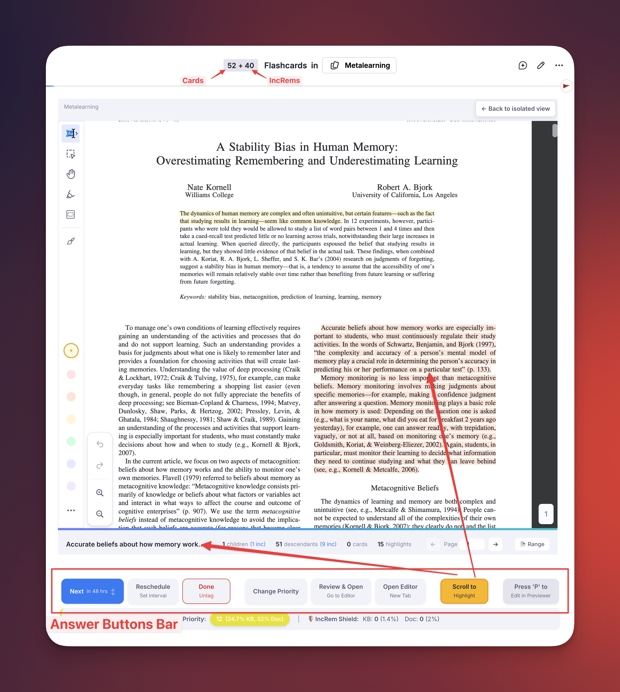
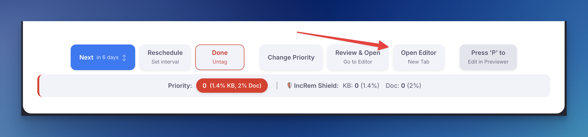
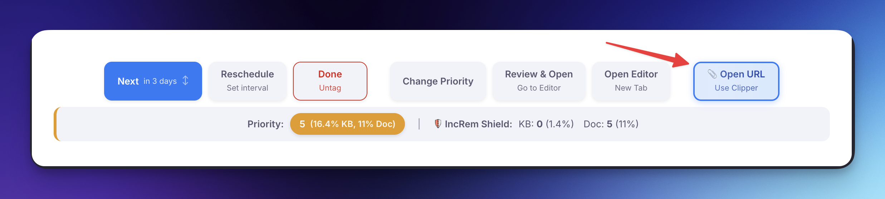
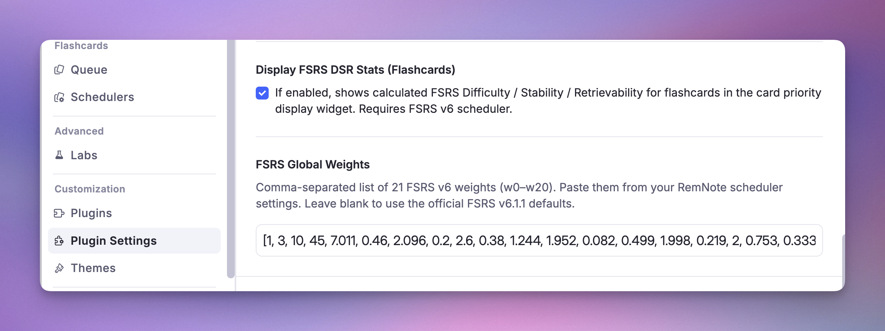

# The Core Loop: Reviewing Items in the Queue

This is where you'll spend most of your time with the plugin. 

The first important consideration the user has to have is that, from now on, his queue will have a dual nature, intermingling elements with different characters and purposes:

Rem Type | Primary Purpose | Typical Form | Repetition Behavior | Role in the Ecosystem
-- | -- | -- | -- | --
Incremental Rem | Introduce new information for passive review and processing. | Full articles, book chapters, paragraphs, web pages, notes, images, videos. | Presented in increasing intervals for further reading; tag deleted once fully processed (Dismissed). User-controlled schedule. | **Ingestion/Food:** Raw material imported into the knowledge base to be broken down and learned.
Flashcard Rem | Test and strengthen memory of atomic knowledge through active recall. | Question-Answer pairs, cloze deletions, multi-line sets/lists, multiple-choice tests. | Presented in algorithmically determined intervals to ensure near-perfect long-term retention. | **Functional Tissue:** The durable, assimilated knowledge that constitutes the organism's long-term memory.

(Table adapted from the [Pleasurable Learning channel](https://www.youtube.com/watch?v=W9gZZ_UOJhg))

During a study session, Incremental Everything presents your Incremental Rems one by one (intermingled with your flashcards). To interact with them, you'll use the Answer Buttons bar at the bottom of the screen.

Each button is designed for a specific action to manage your learning flow efficiently.

## Table of Contents

- [The Answer Buttons](#the-answer-buttons)
- [Editing a Rem-type Incremental Rem](#editing-a-rem-type-incremental-rem)
  - [Read-point and status emphasis in Rem-type cards](#read-point-and-status-emphasis-in-rem-type-cards)
- [A Strategic Guide to the Answer Buttons](#a-strategic-guide-to-the-answer-buttons)
  - [Next](#next)
    - [The Scheduling Algorithm](#the-scheduling-algorithm)
    - [The "One Memory, One Action" Principle](#the-one-memory-one-action-principle)
  - [Reschedule](#reschedule)
    - [Technical Note: Reschedule Event Types](#technical-note-reschedule-event-types)
  - [Dismiss](#dismiss)
  - [Change Priority](#change-priority)
  - [Review in Editor](#review-in-editor)
    - [The Workflow Loop](#the-workflow-loop)
    - [When to use it](#when-to-use-it)
    - [Why use this instead of the native "Go to Rem" (Shortcut: G)?](#why-use-this-instead-of-the-native-go-to-rem-shortcut-g)
  - [Open Editor in New Tab](#open-editor-in-new-tab)
    - [The Problem It Solves](#the-problem-it-solves)
    - [How It Works & When to Use It](#how-it-works--when-to-use-it)
    - [⚙️ Related Setting: Preferred RemNote Environment](#️-related-setting-preferred-remnote-environment)
  - [Open URL to use Web Clipper 📎](#open-url-to-use-web-clipper-)
- [Card Stats & FSRS Integration](#card-stats--fsrs-integration)
  - [What's Displayed](#whats-displayed)
  - [Flashcard Repetition History](#flashcard-repetition-history)
  - [FSRS Configuration](#fsrs-configuration)
    - [Required Setup: FSRS Weights](#required-setup-fsrs-weights)
    - [Limitation: Global Weights Only](#limitation-global-weights-only)
    - [Plugin Settings Reference](#plugin-settings-reference)
- [Incremental Rem History](#incremental-rem-history)

---

## The Answer Buttons

Here is a breakdown of each button and its function, from left to right.

* **[Next](#Next):** (Shortcut: `Cmd+Right` on Mac, `Ctrl+Right` on Windows/Linux)
This is your primary action. Clicking "Next" marks the item as reviewed, calculates the next time you should see it based on the scheduling algorithm, and advances to the next item in your queue. The subtitle (e.g., "in 3 days") shows you the new interval that was just calculated.

  * **Swipe-to-Reschedule:** (New!) A new gesture for faster scheduling when reviewing Incremental Rems:
      * **Click and slide UP:** Automatically schedules for **tomorrow**.
      * **Click and slide DOWN:** Schedules for **today** (later in the same day).

  * **Pro-Tip:** This is particularly useful for content you're actively working through (like a book chapter). It keeps your momentum without opening the full Reschedule popup.

* **[Reschedule](#Reschedule):** (Shortcut: `Ctrl+J`)
This button opens a popup that gives you manual control over the item's schedule and priority. You can set a custom interval in days and adjust the priority value at the same time.

* **[Dismiss](#Dismiss):** (Shortcut: `Ctrl+D`)
When you have finished processing an item and no longer wish to see it in your queue, click "Dismiss" (or press `Ctrl+D`). This permanently finishes the item by removing its `Incremental` power-up. This shortcut also works in the Editor to dismiss the focused Incremental Rem.

* **[Change Priority](#Change-Priority):** (Shortcut: `Ctrl+P` for full widget and `Ctrl+Alt+P` for light widget)
This opens the advanced priority popup. The label on the button itself provides rich, at-a-glance information:
  * **The Number:** The Rem's absolute priority value (0-100, lower is more important).
  * **The Percentiles:** The Rem's rank within your entire Knowledge Base (`% of KB`) and within the current document (`% of Doc`).
  * **The Color:** The background color shifts from red (high priority) to blue (low priority) for an instant visual cue of its importance.

* **[Review in Editor](#Review-in-Editor):** (Shortcut: `Ctrl+Shift+J`) *(Previously called "Review & Open")*
This is a powerful workflow tool. It performs a sequence of actions:
  1. It first **reviews** the item (rescheduling it) and **opens** the Rem in the editor, exiting the queue.
  2. It immediately starts an **Editor Review Timer**. When finished, clicking **"End Review"** stops the timer and routes you back to your queue document.
This is perfect to avoid friction with the queue interface, and when an item inspires you to do more detailed work, like extensive note-taking or using other features like the AI assistant.

* **Scroll to Highlight / Scroll to Bookmark:**
This button appears for **PDF highlights, HTML highlights, and Incremental Rems with PDF sources**. 
  * If you are reviewing a highlight, clicking this instantly snaps your view back to the highlight's position in the document.
  * If you are reviewing a full PDF chapter (an Incremental Rem with a PDF source), this button acts as a **Scroll to Bookmark**. It jumps directly to your last recorded reading position within that chapter/PDF/IncRem.
  * *See the [PDF-Incremental-Reading-Workflow#4-pdf-highlight-toolbar-utilities](PDF-Incremental-Reading-Workflow.md) guide to learn how bookmark positions are automatically tracked when extracting highlights.*
  * *See also: **[Create-Incremental-Rem-from-PDF-Highlights](Create-Incremental-Rem-from-PDF-Highlights.md)** for how to turn highlights into active learning material.*

* **🔖 Read point (hybrid PDF/HTML IncRems):**
This button appears when a **PDF/HTML IncRem also has a [read point](Reviewing-Items-in-the-Editor.md#read-points-for-rem-type-incremental-rems)** set on one of its own descendant rems (a "hybrid" — a reading source *and* its own outline content). Because the in-queue reader can't jump into the outline without leaving the queue, clicking it shows a **confirmation dialog** with the read point's rem name; on confirm it behaves like **[Review in Editor](#review-in-editor)** — it records a review for the current IncRem and starts its timer — but opens the **read-point descendant** in the editor so you can resume reading there. A small **`• latest`** marker appears on whichever of *Scroll to Bookmark* / *Read point* was saved most recently. (Pure Rem-type cards don't need this button — their read point is shown directly in the [read-only card](#read-point-and-status-emphasis-in-rem-type-cards).)

* **📑 View outline / 📄 Read document (hybrid toggle):**
For the same hybrid IncRems (a **PDF/HTML reading source that also has a read point** on a descendant), a toggle appears in the **top-right corner** of the queue card. **📑 View outline** flips the card from the PDF/HTML reader to a **read-only outline view** of the IncRem — the same [ExtractViewer](#read-point-and-status-emphasis-in-rem-type-cards) used for Rem-type cards, where the read point is **emphasized and auto-scrolled into view** — *without leaving the queue*. **📄 Read document** flips back to the reader. This lets you read the document and consult your outline/notes in the same session. *(To instead make a chapter **always** open as an outline in the queue, add the **`#extractviewer`** tag — see [PDF-Incremental-Reading-Workflow#extractviewer-mode](PDF-Workflow-→-ExtractViewer-Mode.md).)*

* **[Open Editor in New Tab](#Open-Editor-in-New-Tab)**:
Clicking this button instantly opens the full source document in a new browser tab, right at the location of your highlight/PDF document/Rem. Use it to take notes of what you are reading in a PDF section, to paste highlighted extracts right there (tagging it "incremental" in the editor note rather than in the PDF highlight itself, for easier manipulation and future flashcard creation), to have access to all of RemNote's formatting tools, and to link to other ideas.

* **📝 Review Note** (compact icon, next to *Open Editor*):
Toggles an inline text field to attach a short **observation to this repetition's history entry** — *"stopped mid-proof"*, *"re-read section 3 first"*, *"dismissing: superseded by newer source"*. The note is parked as you type and saved with whichever action ends the review: **Next**, **Reschedule** (`Ctrl+J`), or **Dismiss** (where it becomes the *dismissal reason*). The icon stays highlighted while a note is pending. Notes appear later in the [Repetition History popup](Plugin-Widgets-Reference.md#212-increm-repetition-history--aggregated-view), the Aggregated view, and the [Study Dashboard](Study-Dashboard.md#hierarchy-section). Each entry also gets an **automatic reading-context snapshot** (current page, page range, PDF name, last bookmark) — no typing needed for that part.

* **Open URL for Web Clipper 📎** (for HTML-type Incremental Rems): When reviewing IncRems with web pages sources, this button opens the original URL in a new browser tab, allowing you to use the Clipper's side panel for additional notes and extracts, improving the experience of Incremental Reading web pages. The button features an animated design to highlight when you're reviewing web content.

* **Document Notes (Sidebar):**
When reviewing PDF or HTML Incremental Rems (including **PDF Highlights** and **HTML Highlights**), a **📝 Document Notes** icon appears in the top bar. Clicking this opens the current document in a right-sidebar widget, allowing you to view and make notes and capture thoughts side-by-side with your reading material without leaving the queue. The sidebar syncs with the active queue item automatically. For highlight IncRems, the sidebar discovers all Incremental Rems sharing the same source document and lets you pick which one's notes to view (auto-selects if there is only one).

  The same sidebar is also the **editing surface for plain Rem-type Incremental Rems** (text/note extracts). For these, the in-queue card is a **read-only preview** (see *Editing a Rem-type IncRem* below) and the Document Notes sidebar **opens automatically** when the item loads, so you can edit it there immediately — selecting text, formatting, and typing all behave normally in the sidebar pane.

* **Editing a Rem-type IncRem (read-only card + "✎ Edit in sidebar"):**
When the current Incremental Rem is a plain **Rem** (a text/note extract, not a PDF/HTML/video source), the queue card is a **read-only preview** of the Rem and its descendants, with an **"✎ Edit in sidebar →"** button; editing is done in the auto-opened **Document Notes sidebar**. See **[Editing a Rem-type Incremental Rem](#editing-a-rem-type-incremental-rem)** below for why the card is read-only and how the editing flow works.

* **PDF Switcher (multi-PDF Inc Rems):**
When the current Inc Rem has **more than one PDF source**, a small PDF dropdown appears in the top bar next to the 📝 Document Notes icon. Selecting a different PDF:
  - **Pins it as active** for this Inc Rem (stored in synced storage as the new default for future queue opens, the Editor Review Timer, the PDF Control Panel, etc.),
  - **Re-renders the Reader on the new PDF** immediately — the queue card stays the same, just the PDF view swaps. The new PDF's bookmark auto-scroll, page controls, and reading-time writes all follow.
  - The switcher is hidden for **PDF highlights and HTML hosts** (highlights are tied to a specific PDF; switching would orphan the queue card).

  *See the [PDF-Incremental-Reading-Workflow#multiple-pdf-sources--active-pdf-switcher-and-preferthispdf](PDF-Workflow-→-Multiple-PDF-Sources.md) section for the full resolution chain (pin → `#preferthispdf` → first PDF) and how it applies across every surface.*

* **Press 'P' to Edit:**
This is a non-clickable hint that appears **only for certain card types** (like regular Rem or PDFs). It reminds you that you can press the "P" key to open the Rem in the pop-up "previewer" for quick edits — a fast alternative when you don't want to use the sidebar. (For Rem-type IncRems the primary editing path is the auto-opened **Document Notes sidebar**, since typing directly in the queue card is unreliable — which is exactly why that card is read-only; see [Editing a Rem-type Incremental Rem](#editing-a-rem-type-incremental-rem) below.)

___

## Editing a Rem-type Incremental Rem

When the current Incremental Rem is a plain **Rem** (a text/note extract, not a PDF, HTML, or video source), the queue card shows a **read-only preview** of the Rem and its descendant subtree, with an **"✎ Edit in sidebar →"** button. All actual editing is done in the **Document Notes sidebar**, which opens automatically when the item loads.

### Why the card is read-only (the keyboard-conflict problem)

Earlier versions embedded RemNote's **editable** editor for the Rem directly in the queue card. That turned out to be unreliable: the plugin runs in a sandboxed frame while the editor is a "fake embed" rendered in RemNote's *main* window, and the queue (Flashcard) pane keeps reclaiming the keyboard. In practice this meant:

- the **text-selection toolbar flickered shut** as soon as you selected text;
- **typed characters were dropped** (the editor couldn't hold focus); and
- **stray keys** (arrows, space, digits) fell through to the queue and could **rate or advance the card by accident**.

A plugin cannot fully capture keyboard input inside the queue pane, so this could not be fixed there. The solution is to keep the in-queue card **read-only** (it never captures the keyboard — no collapsed selections, no accidental ratings) and route editing to a **separate pane** that holds focus correctly.

### The editing flow

- **Read-only preview.** The card renders the Rem and its descendants (reactively — it updates live as you edit them elsewhere). Descendants are shown indented under a guide line, separated from the Rem by a horizontal divider.
- **Edit in the sidebar.** The **Document Notes sidebar** auto-opens on the Rem when the item loads (or click **"✎ Edit in sidebar →"**). It is a normal editor pane — selecting text, formatting, typing, and editing children/descendants all work as usual, and the changes flow back into the read-only preview.
- **Back to the dashboard on Next/Dismiss.** When you press **Next** or **Dismiss** (leaving the rem), the [History-Queue-Dashboard-and-Mastery-Drill#practiced-queues-history--live-dashboard](Practiced-Queues-dashboard.md) is restored in the Right Sidebar (if the **Auto focus Queue Dashboard** setting is on), so you return to your live session metrics for the next item.
- **Heavier-duty alternatives.** For more space or a full editor you can also use **[Review in Editor](#review-in-editor)** or **[Open Editor in New Tab](#open-editor-in-new-tab)**, or press **`P`** for the pop-up previewer.

### Read-point and status emphasis in Rem-type cards

The read-only preview highlights important nodes with colored **emphasis boxes** (a left border + background tint — the same visual language as the editor's incremental/dismissed left borders), so you can orient yourself at a glance:

- **🎯 Target Incremental Rem** — the **root** rem being reviewed gets the strongest box (thick green border) plus a badge, making it unmistakable which rem is the actual queue item.
- **🔖 Read point** — if a [read point](Reviewing-Items-in-the-Editor.md#read-points-for-rem-type-incremental-rems) is set, the bookmarked descendant gets a **blue box + "🔖 Read point" badge**, and the card **auto-scrolls to center it** when the item loads. A blue banner at the top of the card — **🔖 Read point: "…"** with a **Scroll to it** button — lets you re-center on demand (and is the fallback indicator when the read point sits deeper than the preview renders).
- **Incremental descendants** — green box (mirrors the editor's incremental left border).
- **Dismissed descendants** — amber box (mirrors the editor's dismissed indicator).
- **⬆️ Cloze extract** — descendants tagged `#cloze-extract` (children created via [Create Cloze Deletion](Plugin-Commands-Reference.md#core-incremental-commands)) get a **violet "⬆️ Cloze extract" badge**, mirroring the queue's cloze identifier.
- **🚫 Ignored** — descendants tagged `#ignore` get a deliberately understated treatment (a thin *dashed* grey rule + faint tint and an italic "🚫 Ignored" label), so they read as muted/archived without competing with the emphasis boxes above.

> These last two are badged **here** because the embedded `RemViewer` renders outside this preview's stylesheet, so a child's normal cloze/ignore styling wouldn't otherwise show through.

Read points are **set** with the **Set Read Point (Bookmark)** command (`Ctrl+F7`, `srp`) — place your cursor in the descendant and run it — and managed from the **[Read Points popup](Plugin-Widgets-Reference.md#68-read-points-popup)** (`Ctrl+Shift+F7`, `vrp`). See **[Read Points for Rem-type Incremental Rems](Reviewing-Items-in-the-Editor.md#read-points-for-rem-type-incremental-rems)** for the full workflow.

> **Tip:** the in-queue preview can only emphasize/scroll to a read point that is actually rendered. If a descendant displays *flat* (un-nested) in the read-only card, check that the document's **"Hide Bullets"** option is **off** — with Hide Bullets on, RemNote renders the embed without its nested structure.

___

## A Strategic Guide to the Answer Buttons

Understanding the specific function of each button is key to a fluid and efficient incremental learning workflow. This guide covers the primary use cases for each option on the answer bar.

### Next

This is your most-used button (shortcut: `Cmd+Right` on Mac, `Ctrl+Right` on Windows/Linux). You click it after you have engaged with an item and are ready to schedule its next review.

#### The Scheduling Algorithm

The "Next" button uses a simple but effective exponential scheduling algorithm. The interval for the next repetition is calculated with the formula:
`newInterval = multiplier ** numberOfReviews`

In simple terms: each time you review an item, the plugin looks at how many times you've seen it before and raises a **multiplier** (a value you can set in the plugin settings, defaulting to 1.5) to that power. This causes the review intervals to grow exponentially (e.g., 2 days, 3 days, 5 days, 7 days, 11 days, and so on), ensuring you see familiar material less frequently over time.

#### The "One Memory, One Action" Principle

The single most important rule in incremental learning is to **always take meaningful action** on an item before clicking "Next". Simply viewing an item and immediately dismissing it is a "futile review" that wastes time.

The "[One memory, one action](https://help.supermemo.org/wiki/Incremental_learning#One_memory,_one_action)" principle, first enunciated by Piotr Wozniak, author of SuperMemo, demands that **every review should leave a trace in your memory**. Before clicking "Next," you should **always perform at least one small, productive step**, such as:

* **Rephrasing** a difficult sentence to make it clearer.
* **Creating** a highlight on a key passage.
* **[Reviewing-Items-in-the-Editor#extracting-text](Extracting.md)** a "golden nugget" of information into its own Rem by selecting text and pressing **`Alt+X`** (this creates a linked child extract).
* **Importing** to your knowledge base an article or page that will bring foundational knowledge that you will need to fully grasp the current incremental rem (and tagging this new article "Incremental", using `Alt+X` or `Alt+Shift+X`, to bring it into your learning flow).
* **[Reviewing-Items-in-the-Editor#creating-clozes](Creating-a-cloze-deletion.md)** or standard flashcard from a sentence using **`Alt+Z`**.

Conversely, **avoid "item perfectionism"**—doing too much work on a single item in one session. It is highly inefficient to spend a long time formatting, adding images, and perfecting a single piece of information. Spread these actions over time. The goal is one meaningful interaction per review.

### Reschedule

This button (shortcut `Ctrl+J`) is your tool for strategic postponement.

**When to use it:**
Use "Reschedule" when you encounter a complex topic that you're not mentally prepared for yet. For example, you might be reviewing an advanced physics paper but realize you need to brush up on a foundational concept first.

Instead of struggling or just clicking "Next" (a futile review), you can use "Reschedule" to punt the advanced topic a month into the future. This gives you time to encounter and process first the more basic foundational material you have already imported to your knowledge base, so you'll be ready when the complex topic reappears.

**A caveat:**
Using "Reschedule" is a **one-time override**. The custom interval you set applies only to the next review. After that, the "Next" button will resume its normal scheduling based on your total number of reviews, not the custom interval you previously set. If an interval feels off again in the future, simply use "Reschedule" again.

**📝 Note field:**
The popup includes an optional **Note** input — record *why* you postponed ("waiting for prerequisite chapter", "revisit after exam"). The note is stored on this reschedule's history entry and shown later in the [Repetition History popup](Plugin-Widgets-Reference.md#212-increm-repetition-history--aggregated-view), so future-you knows what past-you was thinking.

#### Technical Note: Reschedule Event Types

The plugin differentiates how repetition/reschedule events are tracked based on their source, with different interval calculation behavior:

| Event Type | Source | Counts for Interval? | UI Display |
|------------|--------|---------------------|------------|
| `rep` (default) | [Next](#Next) button in queue | ✅ Yes | Normal row |
| `rescheduledInQueue` | Ctrl+J / Reschedule button in queue | ✅ Yes | Row with "📅" indicator |
| `rescheduledInEditor` | Ctrl+J in editor | ❌ No | Event marker (purple) |
| `manualDateReset` | User manually edits Next Rep Date slot | ❌ No | Event marker (gray) |
| `executeRepetition` | [Execute Repetition command](Reviewing-Items-in-the-Editor.md#1-execute-repetition-command) | ✅ Yes | Row with "⌨️" indicator |
| `madeIncremental` | Making rem incremental | ❌ No (boundary only) | Event marker (green) |
| `dismissed` | [Dismiss](#Dismiss) button / tag removal | ❌ No | Event marker (orange) |

**Key distinction:**
- **Review actions** (`rep`, `rescheduledInQueue`, `executeRepetition`) count for interval calculation because you engaged with and reviewed the content before scheduling the next review
- **Administrative adjustments** (`rescheduledInEditor`, `manualDateReset`) only change the schedule without confirming a review—useful for planning but don't advance the SRS algorithm

### Dismiss

This button (shortcut: `Ctrl+D`) signifies the end of a passive item's life cycle in your incremental reading queue. The `Ctrl+D` shortcut also works in the Editor context — when focused on an Incremental Rem, it will dismiss it directly (transferring its history to the Dismissed powerup and removing the Incremental tag).

**When to use it:**
The primary goal of incremental reading is to process source materials (like articles, book chapters or paragraphs) and extract the most valuable, "golden nugget" pieces of information. You do this by turning them into active recall prompts (flashcards and clozes).

Once you have reviewed the entire source and are confident you've extracted all the key knowledge into flashcards, the original passive material has served its purpose. Click "Dismiss" to remove the source text from your queue, leaving only the efficient, active-recall cards you created from it.

### Change Priority

Prioritization is essential for managing a large volume of learning material.

**When to use it:**
As your collection grows, you'll naturally have items of varying importance. Use the "Change Priority" button to open the priority popup and adjust an item's importance on the fly, directly from the queue. This ensures you see your most critical material more often than less important topics.

For a deep dive into how the priority system works, please see the [Prioritization & Sorting](Prioritization-&-Sorting.md) page.

### Review in Editor

> *Previously called "Review & Open".*

This button (shortcut `Ctrl+Shift+J`) provides a seamless bridge between the focused queue environment and the full-power RemNote editor.

It performs a powerful sequence of actions:
1. It registers the item as conceptually "reviewed" (rescheduling it for the future, just like the "Next" button).
2. It instantly **navigates you to the editor** for that Rem, exiting the queue.
3. It **automatically starts the Editor Review Timer** for that session.
  * *Note for PDF Notes*: If the item is a `pdf-note`, this button carefully opens the Rem as a full page in the editor rather than triggering the PDF viewer, maintaining your note-taking context.

#### The Workflow Loop
Once you are in the editor with the timer running, you can perform heavy editing, restructuring, or use AI tools. 
When you are completely finished processing the item:
1. Click **"End Review"** on the Timer Widget. 
2. The timer will conclude, record your repetition (along with the time spent), and **navigate you back to the original queue document**.
3. You must then press `Cmd+Shift+P` (or your Practice shortcut / the Practice button) to instantly dive back into the queue and continue.

####  When to use it

Use "Review in Editor" whenever the queue interface feels too limited for the task at hand. This workflow is ideal for situations where you need to:
* See the broader **context** of a Rem within your outliner.
* Perform **heavy editing** or restructuring.
* Use other features not fully available in the queue, like **"Ask AI"** or AI **Create Flashcards**.

#### Why use this instead of the native "Go to Rem" (Shortcut: G)?

If you use RemNote's native "Go to Rem" command while in the queue, you will be taken to the editor, but your review of the card will **not be logged**, and the time-tracking timer will **not start**. This means the same card will likely reappear later in your session, which is inefficient.

The **"Review in Editor"** button solves this problem by cleanly coupling the review, the navigation, and the time-tracking timer into one seamless action.

### Open Editor in New Tab

This button is a direct response to a recent RemNote UI change and serves as an essential workaround to restore a seamless PDF review workflow.

####  The Problem It Solves

RemNote recently removed the ability to open an editor pane on the left side of the screen when reviewing a PDF highlight in the queue (PDFWebViewer). This made it impossible to take notes and paste extracts without exiting the queue entirely, breaking the review flow (not always the *Previewer* - pressing "P" - is sufficient to this flow, nor does it allow having the PDF and editor side by side).

> ℹ️ This is the same family of limitation that makes the in-queue card for Rem-type Incremental Rems **read-only** — a plugin can't reliably hold the keyboard inside the queue pane. For plain Rems the editing surface is the Document Notes sidebar; see [Editing a Rem-type Incremental Rem](#editing-a-rem-type-incremental-rem).

####  How It Works & When to Use It

This new button instantly opens the full source document in a new browser tab, right at the location of your highlight/PDF document/Rem.

-  **Use Case: In-Depth Note-Taking During Review**
A highlight sparks a complex new idea that requires more space than a simple comment. Or you want to take notes of what you are reading in a PDF section, and paste highlighted extracts right there (tagging it "incremental" in the editor note rather than in the PDF highlight itself, for easier manipulation and future flashcard creation). Use the button to open the full editor, where you have access to all of RemNote's formatting tools, can link to other ideas, and can write extensive notes alongside the original PDF. This allows you to capture detailed thoughts without being constrained by the queue's limited interface.

####  ⚙️  Related Setting: Preferred RemNote Environment

For users who primarily work on the beta version of RemNote, a new "Preferred RemNote Environment" setting has been added. This dropdown menu in the plugin settings allows you to choose whether the "Open Editor in New Tab" button directs you to the stable (`www.remnote.com`) or beta (`beta.remnote.com`) environment. This ensures a seamless workflow by keeping you in your preferred version of RemNote.

### Open URL to use Web Clipper 📎

This button only appears for HTML-type Incremental Rems. When reviewing IncRems with web pages sources, this button opens the original URL in a new browser tab, allowing you to use the Clipper's side panel for additional notes and extracts, improving the experience of Incremental Reading web pages. The button features an animated design to highlight when you're reviewing web content.

See also: [Using the RemNote Clipper](https://help.remnote.com/en/articles/6030855-using-the-remnote-clipper).

---

## Card Stats & FSRS Integration

When reviewing flashcards in the queue, the **Card Info Bar** widget (formerly *Card Priority Display*) shows additional card statistics and FSRS memory state information alongside the priority and shield data.

### What's Displayed

The info bar includes (from left to right):

| Section | Description |
|---------|-------------|
|(1) **Priority** | Absolute priority value with KB and Document percentiles |
|(2) **Card Shield** | Shield status (if enabled) |
|(3) **Weighted Shield** | Exponential priority-weighted workload percentage (if enabled) |
|(4) **Reps & Time** | Total number of reviews (with **lapses** in red parentheses), cumulative review time, **card age**, and **cost** (per year of age/coverage) for this card. Hover over it for an explanatory tooltip. |
|(5)(6) **D · S · R · SInc** | FSRS Difficulty, Stability (and time passed since last review), Retrievability, and Stability Increase (if enabled) |
|(7) **🔬** | Opens the Flashcard Repetition History popup |
|(8) **Incremental Rem Status Indicator** | An icon displayed on the right border whenever the current card is also an Incremental Rem |

**Understanding D, S, and R:**

*   **Difficulty (D):** How hard it is to maintain a memory of something. The higher the difficulty, the harder it is to increase its Stability and maintain it in the long term. The larger the number, the greater the difficulty. Its value ranges from 1 (easiest) to 10 (hardest). Difficulty increases when you forget (rate "Again") and decreases when you recall easily. Hover over the DSR stats to see the projected **Next Difficulty** for each of the four grading options (Again, Hard, Good, Easy).
*   **Stability (S):** The expected interval (in days) at which your recall probability equals 90%. It is the **storage strength** of memory. A stability of 30d means you'd need to review the card in approximately 30 days to have a 90% chance of recalling it. The exact time passed since your last review of this card is shown in parentheses next to it (e.g., `(6.2 m passed)`).
*   **Retrievability (R):** Your estimated probability of recalling this card *right now* (memory's **retrieval strength**).The lower it is, the higher the probability that the memory will be forgotten. Shown as a percentage with color coding: 🟢 green (≥90%), 🟡 yellow (≥70%), 🔴 red (<70%).
*   **Stability Increase (SInc):** How much your memory stability will grow after answering. Shown as a multiplier (e.g., `1.42×`) for the **Good** grade. Hover over it to see the SInc for all three recall grades (Hard / Good / Easy) along with the projected new stability after each. A value of `1.0×` means no growth; higher values mean faster learning. SInc is influenced by the card's current Difficulty, Stability, and Retrievability — reviewing at lower retrievability (closer to forgetting) produces a larger stability increase, reflecting the [desirable difficulty](https://en.wikipedia.org/wiki/Desirable_difficulty) principle.

### Flashcard Repetition History

Clicking the 🔬 button (or pressing `Ctrl+Shift+H`) opens a detailed popup showing the card's full review history — similar to RemNote's built-in Practice History. You can close this popup anytime by pressing `Esc`.

**Header & Summary Information:**
*   **Rem Name:** The document's parent name is displayed bolded at the very top.
*   **Total Reviews & Time:** An aggregate sum of your historical effort, the **card age**, the **coverage** (time until next scheduled review), and the **cost** (ignoring any reviews that occurred before a manual Date Reset).
*   **Optimum Next Repetition Date:** Calculates the optimal review date you *should* practice based directly on FSRS stability formulas (`Last practice date + Stability`). Hover for a tooltip explaining discrepancies with the scheduled date.
*   **Date Stale:** When the card becomes overdue (Last practice + 2x Interval).
*   **Current Interval Ratio:** Shows what percentage of the predicted Stability the current interval occupies.
*   **Retrievability Gradient:** The *R* metric is color-coded using a dynamic gradient transitioning from pure red (≤ 70%) to green (100%).

**Each row contains:**
*   **Rating:** The score given (Again, Hard, Good, Easy), color-coded.
*   **Response Time:** How long you spent answering.
*   **Target Date:** When the review was originally scheduled.
*   **Practice Date:** When you actually reviewed it.
*   **Delay:** How early or late you reviewed relative to the target ("On Target Day", "2 days late", "3 months late", etc.).
*   **Next Interval:** The interval that was assigned after this review ("9 hours", "6 days", "1.3 months", etc.).
*   **D & S:** The FSRS Difficulty and Stability values *after* each review step, showing how memory state evolved over time. (Note: `RESET` events restart the learning state from scratch).
*   **SInc:** The actual Stability Increase ratio applied at that step (`×1.35` = stability grew by 35%). Null (`—`) for the first review since there's no previous stability to compare against.
*   **pluginData:** Any data recorded by plugins during that review (historical; only present for reviews performed via the plugin's custom scheduler).

The heading summary also shows the current **SInc** for all three recall grades, color-coded: 🟠 Hard / 🟢 Good / 🔵 Easy. Hover for a tooltip with projected stability values.

### FSRS Configuration

The plugin includes a built-in implementation of the [FSRS v6.1.1 algorithm](https://github.com/open-spaced-repetition/fsrs4anki/wiki/The-Algorithm) that replays each card's repetition history to compute D, S, and R. This is necessary because RemNote does not expose FSRS state through its plugin SDK.

#### Required Setup: FSRS Weights

To get accurate D/S/R values that match RemNote's internal calculations, you need to provide your FSRS weights in the plugin settings:

1.  Go to **RemNote Settings → Schedulers → Global Default Scheduler**.
2.  Copy the weights array (19 or 21 comma-separated numbers).
3.  Go to **Plugin Settings → Incremental Everything → FSRS Global Weights**.
4.  Paste the weights string (e.g., `[1, 3, 10, 45, 7.011, 0.46, ...]`).

If left empty, the official FSRS v6.1.1 default weights are used, which will produce approximate but likely inaccurate values for your specific study patterns.

#### Limitation: Global Weights Only

> ⚠️ **Important:** RemNote allows assigning different custom schedulers (with different FSRS weights) to different documents or folders. However, the plugin SDK does not expose which scheduler is assigned to a specific card. As a result, the plugin can only use a single set of **global weights** for all cards.

If you use multiple custom schedulers with different weights (or with Anki_SM2 scheduler), the computed D/S/R values will only be accurate for cards using the scheduler whose weights you configured. Cards assigned to other schedulers may show slightly different values than what RemNote computes internally.

For most users who use a single global scheduler, this is not an issue — just paste your global scheduler's weights and the values will match.

#### Plugin Settings Reference

| Setting | Type | Description |
|---------|------|-------------|
| **Display FSRS DSR Stats** | Boolean | Toggle D/S/R display on or off (default: on) |
| **FSRS Global Weights** | String | Your FSRS weights, comma-separated (accepts 19 or 21 values, with or without brackets) |

---

## Incremental Rem History

The **Incremental Rem History** widget automatically records and displays the Incremental Rems you have viewed in your queue.

**Key Features:**
*   **Searchable History:** Easily find previously viewed items using the search bar.
*   **Context Aware:** Shows history specific to the current Knowledge Base.
*   **Recency Tracking:** Displays how long ago you viewed each item.
*   **Quick Navigation:** Click any item to jump back to it.

This widget helps you keep track of your reading session and backtrack if needed, complementing the queue's linear flow. It's also a good companion to the **[History and Final Drill](https://www.remnote.com/plugins/final_drill_and_history)** plugin.

