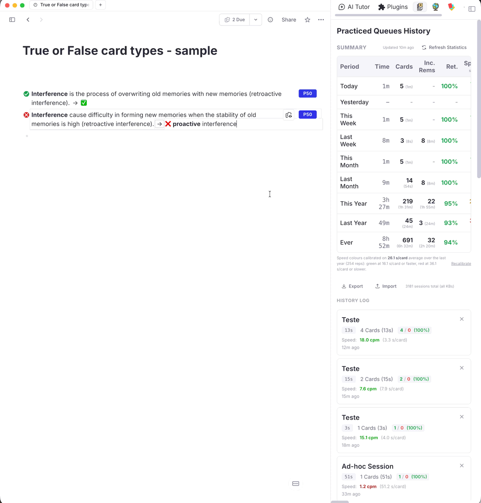
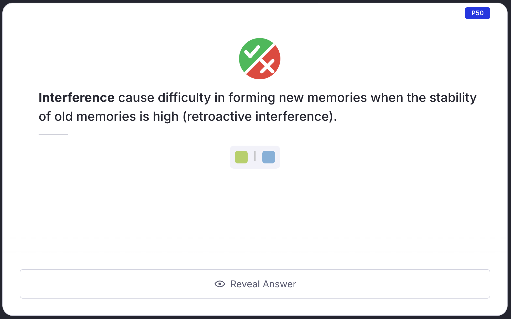
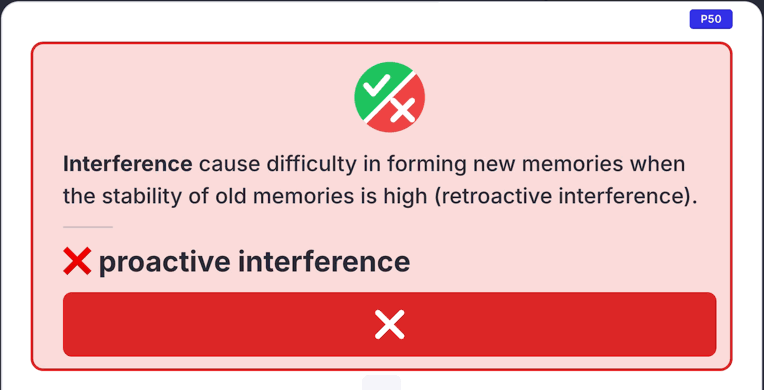
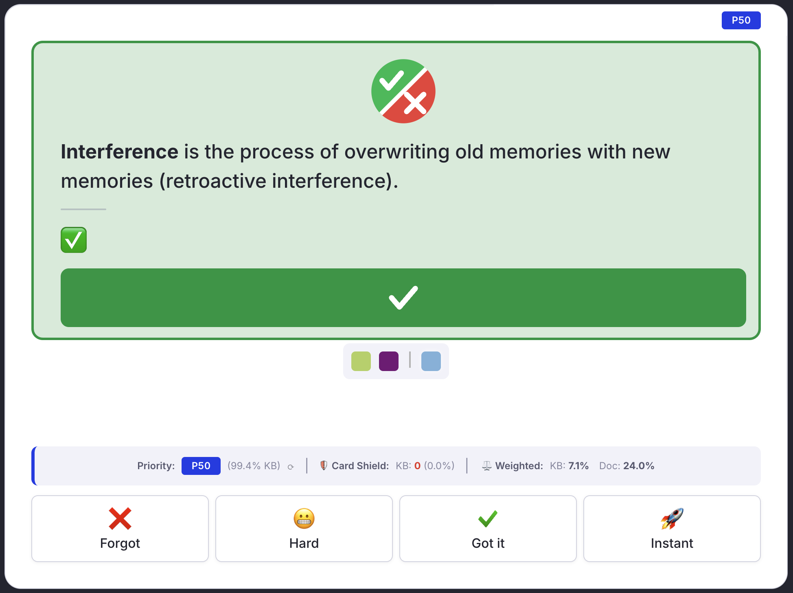
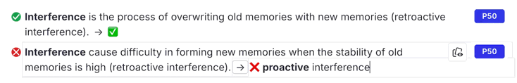

# True or False Cards

Statement cards whose answer is "true" or "false", marked with one command and made unmistakable in the queue. RemNote has no card type for them: you write the statement, type a ✅ or ❌ on the back, and hope to notice in the queue that a verdict is what is being asked.

{ width="900" }

---

## What a True/False card looks like { #what-it-looks-like }

**Front of the card**: a large ✔ / ✘ badge sits above the statement, so the kind of question is obvious before you read it. The badge is the same for true and false statements.

{ width="700" }

**Back of the card**: the statement and its answer sit in a green (true) or red (false) block closed by a full-width ✔ or ✘ bar, and the answer is set on its own line in large bold type. The colour stays inside that block; the rest of the card is untouched.

{ width="700" }

{ width="700" }

**Editor**: the bullet of the Rem becomes a small green ✔ or red ✘.

{ width="700" }

It works in both the Compact and the Beautiful queue, in light and dark mode.

---

## Mark as True (`tft`) / Mark as False (`tff`) { #mark-as-true-or-false }

Run **True/False: Mark as True** or **True/False: Mark as False** from the Omnibar or the `/` menu. They act on the focused Rem, on every Rem of a multi-Rem selection, or on the current card while you practise.

Each command does two things:

1. **Tags the Rem** with the `TFT` (true) or `TFF` (false) powerup, which is what the styling above is keyed on.
2. **Makes the back say ✅ or ❌**, keeping whatever the back already holds:
    - the right mark is already there, typed or as a reference to a Rem named ✅ / ❌: nothing is written;
    - the opposite mark is there: only that mark is swapped;
    - no mark: one is put in front of the existing back text, so explanations, references, links and pins stay as they are;
    - the Rem has no back: it becomes a forward-only card whose back is the mark.

Run the other command on a card to flip its verdict.

---

## Remove Marking (`tfx`) { #remove-marking }

**True/False: Remove Marking** takes the tag off the selected Rems. The card and its back text are left as they are; only the styling goes.

---

## Importing True/False cards from text (`tfc`) { #importing-from-text }

RemNote's [text import](https://help.remnote.com/en/articles/9252072-how-to-import-flashcards-from-text) cannot name a powerup: `#[[TFT]]` creates an ordinary tag Rem called *TFT* instead. Write the cards with that tag anyway, then convert them:

```
- The master may relieve one of the pilots >> ✅ #[[TFT]]
- No other route may be displayed >> ❌ only the selected one is highlighted #[[TFF]]
```

1. Paste the text into RemNote.
2. Put the cursor on the parent of the pasted cards, or select them.
3. Run **True/False: Convert Pasted Tags** (`tfc`).

The command swaps each plain `TFT` / `TFF` tag for the powerup, writes the ✅ / ❌ mark where the back lacks it, and deletes the plain tag Rem once nothing else uses it. It covers the selected Rems, or the focused Rem and everything under it.

---

## In a Card Cluster { #card-clusters }

A common layout is one question Rem ("mark each item true or false") with the statements as its children, the parent being a **Card Cluster**. Mark each statement with `tft` / `tff` as usual.

In the queue, the statement being tested gets the badge and, once revealed, the green or red block with the large answer and the verdict bar. The other statements of the cluster stay as RemNote draws them, and the styling moves along as you go from one statement to the next.

- The styling appears a moment after each statement loads, not with it.
- In the Compact queue the tested statement loses its bullet; the frame marks it instead.
- A statement with no [card priority](Priorities-for-Flashcards.md) is only styled when it is the first one shown from its cluster.

---

## Notes { #notes }

- The whole back is enlarged, not only the mark, so keep long explanations in a child Rem (for example an Extra Card Detail) rather than on the back itself.
- The `TFT` / `TFF` pill is hidden in the editor while it is the Rem's only tag; with several tags RemNote shows its own "2 tags" chip.
- From the queue, the styling of a card you have just marked appears the next time the card is shown.
