# Utilities

Commands and powerups that support the incremental workflow without being part of the queue itself — reshaping text and outlines, finding Rems and sources, controlling what the queue displays, and clearing out Rems an import left behind.

---

## Text & Lists

Commands that reshape the text *inside* a Rem — most useful right after a PDF highlight lands in your notes as one flattened block.

### Text Case Converter

This incorportated utility cycles selected text through three case styles with a single shortcut — just like **Shift+F3** in Microsoft Word.


---

#### How it works

Press **Shift+F3** with text selected to cycle through:

| Step | Style | Example |
|------|-------|---------|
| 1st press | **Title Case** | *Cyclone in Tropical Latitudes* |
| 2nd press | **UPPERCASE** | *CYCLONE IN TROPICAL LATITUDES* |
| 3rd press | **lowercase** | *cyclone in tropical latitudes* |

The plugin **auto-detects** the current case of the selection and always advances to the next stage, so you never have to think about where you are in the cycle.

---

#### English Title Case rules

Title Case follows **Chicago/APA style**:

- **Always capitalised / Sempre maiúsculas:**
  - The first and last word of the selection.
  - All nouns, verbs, adjectives and adverbs.

- **Kept lowercase / Mantidas em minúsculas** (unless first or last word):
  - **Articles / Artigos:** *a, an, the* · *o, a, os, as, um, uma…*
  - **Prepositions / Preposições:** *at, by, in, of, on, to, up, as, via* · *de, em, por, para, com, sem, sob, sobre…*
  - **Conjunctions / Conjunções:** *and, or, nor, but, for, yet, so* · *e, ou, mas, nem, que, se, como, pois, logo…*
  - **Portuguese contractions / Contrações portuguesas:** *do, da, dos, das, no, na, nos, nas, ao, aos, pelo, pela, pelos, pelas…*

##### Examples

> `cyclone in tropical or subtropical latitudes`
> → **Cyclone in Tropical or Subtropical Latitudes**

> `princípios das radiocomunicações marítimas`
> → **Princípios das Radiocomunicações Marítimas**

---

#### Acronyms and initialisms

Words that are uppercase by nature stay that way through Title Case — `arqueação bruta (ab)` becomes **Arqueação Bruta (AB)**, never *(Ab)*. Four signals are used, in this order:

1. **The acronym list.** Common maritime (*GT, NT, AB, TPB, DWT, LOA, IMO, MMSI, SOLAS, MARPOL, STCW, ECDIS, GMDSS…*), institutional (*ONU, UN, ISO, CNPJ, IBGE…*) and technical (*PDF, URL, HTML, API, CSV…*) acronyms are built in. Add your own under **IE Settings → Other → [Title Case Acronyms](Plugin-Settings-Reference.md#other)**, separated by commas or spaces.
2. **Initialisms and initials.** `u.s.a.` → **U.S.A.**, and a lone initial keeps its capital: `o autor a. silva` → **O Autor A. Silva**. The dotted abbreviations that are conventionally lowercase — *e.g., i.e., cf., a.m., p.m.* — are exempt and behave like the minor words above.
3. **Roman numerals used as numbers.** `seção ii` → **Seção II**, `capítulo iv` → **Capítulo IV**, `chapter xl` → **Chapter XL**. See [when a numeral counts as a numeral](#when-a-roman-numeral-counts-as-a-numeral) below.
4. **Capitals already in the text.** A word you wrote with two or more capitals is preserved as typed: `RO-RO`, `P&I`, `COVID-19`, `A/S`. This signal is switched off when the *whole* selection is uppercase, where existing capitals say nothing about which words are acronyms — there, signal 1 does the work, so `ARQUEAÇÃO BRUTA (AB)` still title-cases to **Arqueação Bruta (AB)**.

A trailing plural `s` stays lowercase: **GTs**, not *GTS*.

> **Why the list matters even though capitals are preserved.** Signal 4 reads what is on screen, so it cannot survive the lowercase step of the cycle — once `GT` has become `gt`, only the list knows to bring it back. Domain terms you cycle through all three stages belong in the setting.

##### Examples

> `o navio de 500 gt e a convenção solas`
> → **O Navio de 500 GT e a Convenção SOLAS**

> `tonelagem de porte bruto (tpb) em nm` *(with `TPB, NM` in the setting)*
> → **Tonelagem de Porte Bruto (TPB) em NM**

> `SEÇÃO II - DIÁRIO DE NAVEGAÇÃO`
> → **Seção II - Diário de Navegação**

Acronyms are forced uppercase in the **Title Case** step only. The **UPPERCASE** and **lowercase** steps stay literal, so `Shift+F3` can always take you to a fully lowercase selection.

##### When a Roman numeral counts as a numeral

`VI`, `LI` and `MI` are Portuguese words, `CM`, `ML` and `CC` are units, and every one of them is also a valid Roman numeral — so the numeral has to be recognisable as a number before it is capitalised. Two things make it so:

- **The word before it names a numbered thing** — *seção, capítulo, parte, volume, tomo, livro, título, anexo, artigo, regra, item, fase, classe, figura, tabela, século, guerra, papa, rei*, and their English counterparts (*section, chapter, part, book, annex, article, rule, figure, table, century, war, king, pope…*). This is the only route for a **single letter**, since nothing else distinguishes `Capítulo V` from an ordinary *v*: `anexo vi da marpol` → **Anexo VI da MARPOL**.
- **The numeral is two letters or longer and is not an ambiguous one** — `II`, `III`, `IV`, `XL`, `XVIII` are taken as numerals anywhere in the text, even as the first word: `ii - diário de navegação` → **II - Diário de Navegação**.

Everything else is left alone, so `eu vi o navio` stays **Eu Vi o Navio** and `o volume em cm e ml` stays **O Volume em Cm e Ml**. If you want one of the ambiguous forms capitalised regardless of context, add it to the **Title Case Acronyms** setting.

> **A word on two-letter entries.** For the same reason, `EU`, `MOB` and `RAM` are deliberately *not* in the built-in list — they would capitalise every Portuguese *eu* and every English *mob* and *ram*. Add them yourself if your notes never use those words.

---

#### Other features

- **Formatting preserved / Formatação preservada:** bold, italic, highlight and all other rich-text styles are kept intact through every transformation.
- **Cross-element word boundaries / Palavras com formatação mista:** words split across formatting runs (e.g. a bold first letter) are handled correctly — only the true first letter of each word is capitalised.
- **Multi-rem selections / Seleção de múltiplos rems:** select one or more whole rems in the outline (instead of a text range) and `Shift+F3` will cycle the case of each rem's text — and the **back text** of concept/descriptor rems — in a single shot. The current cycle stage is detected from the combined text of the batch so all rems advance together (Title → UPPER → lower), while Title Case is still computed per rem so each one's first/last-word rule is respected.

---

### Bulletize Inline Selected Text

Toggles a `• ` (bullet glyph + space) prefix at the start of each line **within a single rem**, across a multi-line selection. Built for the common case where a **PDF highlight flattens a real bullet list into soft-wrapped text** — RemNote keeps the visual lines inside one rem (joined by `Shift+Enter` soft line breaks) but drops the original bullet markers. Re-adding `• ` by hand at every line start is tedious, especially when you're prepping a highlight to become an [Incremental Rem](Create-Incremental-Rem-from-PDF-Highlights.md).


#### How to invoke

Run **`Bulletize Inline Selected Text`** (quick code `bul`) or press **`Shift+F8`**.

> The default binding is `Shift+F8` because the plainer combos are all taken: on macOS `Opt+8` types the `•` glyph itself and `Opt+Shift+8` types the degree symbol (`°`), and `Ctrl+Opt+Shift+8` (the previous default) is used by RemNote to apply the **blue highlight** to inline text. `Shift+F8` avoids all of these and is identical across macOS/Windows/Linux. You can rebind it in RemNote's keyboard-shortcut settings.

#### What it does

It is a **toggle**, evaluated over the lines your selection touches:

- If **every non-empty selected line already starts with `• `**, the prefix is **stripped** from all of them.
- Otherwise, `• ` is **added** to the selected lines that don't already have it (lines already bulleted are left as-is, so you never get a double bullet).

Empty lines (e.g. the blank line a `\n\n` produces between a heading and its list) are skipped.

##### Selection modes

- **Multi-line text selection** → operates on every line the selection intersects. A partial selection still bulletizes whole lines: the start is expanded back to the beginning of its line, so you don't have to select from the exact line start.
- **Collapsed cursor (no selection) or a whole-rem selection** → bulletizes the rem's **entire front text** in one shot. Handy for "bulletize this whole rem" — click into it and hit the shortcut.

##### Example

Before (one rem, soft line breaks; the first four lines were bulleted manually, the rest weren't):

```
a. Engine characteristics

• Type of engine and its BHP.
• Type of propeller – RH, LH or CPP.
• Critical RPM,
• Minimum number of consecutive start,
Astern power is %age of ahead power
Emergency full ahead to full astern time
...
RPM indicators in the bridge and outside bridge.
```

Select the list and press `Shift+F8` → the un-bulleted lines gain `• `, so the whole list is uniform. Press it again on the same selection → all bullets are stripped.

#### Notes

- **Formatting preserved.** The toggle rebuilds the rem's rich text by character offset, so highlights, colors, bold/italic, references and other inline nodes are left intact. The bullet itself is inserted as a **plain** node, so on a PDF-highlight rem (where the line text is highlighted yellow) the `•` glyph is *not* highlighted. If you'd prefer the bullet to match the line's highlight/color, that's a small change — open an issue.
- **Front text only for the whole-rem gesture.** A multi-line selection works in either the front or the back text (the plugin detects which contains the selection), but the collapsed-cursor "bulletize the whole rem" path acts on the front text.
- **Why `• ` and not a native bullet:** native RemNote bullets require *separate rems*. Inside a single rem (which is what a PDF highlight produces), the only way to simulate a list is the literal `• ` prefix on each soft-wrapped line — which is exactly what this command automates.

---

### Inlinize & Break Lists (from PDF Highlights)

Where [Bulletize Inline Selected Text](#bulletize-inline-selected-text) re-bullets lines that **already exist**, these commands handle the harder case: a PDF highlight that captured a whole enumerated list as **one rem, flattened onto a single line** with the numbers left inline and every line break dropped:

```
As seguintes medidas podem contribuir para evitá-las: 1 Aumentar, em certas
circunstâncias, o número de pessoal qualificado… 2 Deixar claro em que situações
"chamar o Comandante ao passadiço". 3 O Oficial de quarto… 11 Garantir que…
```

There are no line breaks to bulletize — the only structure is in the **markers**: **enumerators** (`1`, `2`, `3`… / `a)` `b)` / `i.` `ii.`), **depth/compound numbers** (`1.1`, `1.2`… or mixed `1.a`, `1.b`…), or **inline bullet/dash glyphs** (`•`, `-`, `*`) that a highlight ran together onto one line. These commands detect that structure and rebuild the list, first inline (for review) and then as proper child rems, with a full undo.

Unlike Bulletize, all three act on the **focused rem** — just click into the rem, no text selection required.

#### The workflow

1. Highlight the list in the PDF and **Create IncRem** from it (one rem, flattened).
2. Run **`Inlinize Detected List`** — the numbers become soft-wrapped `• ` lines in the same rem. **Review the split**; if it's wrong, `Ctrl+Z` and you're back to the original.
3. Run **`Break Inline List Into Children`** — the caput/title stays on the parent, each item becomes a child rem.
4. If the break went wrong, run **`Restore List Rem`** to undo it exactly.

#### Inlinize Detected List (`inl`)

Detects the list and inserts a line break + `• ` before each item, so the flattened text becomes soft-wrapped bulleted lines:

```
As seguintes medidas podem contribuir para evitá-las:
• 1 Aumentar, em certas circunstâncias, o número de pessoal qualificado…
• 2 Deixar claro em que situações "chamar o Comandante ao passadiço".
• 3 O Oficial de quarto…
• 11 Garantir que…
```

- **Enumerated lists keep their number:** `1 Aumentar` → `• 1 Aumentar`.
- **Bullet/dash lists have their marker normalized:** an existing `•`, `-` or `*` is **replaced** by a single `• ` (so `- calado` and `* item` both become `• …`) — no duplicate bullet is added.

The text before the first marker becomes the **caput** (title line); the whitespace before each marker is collapsed into the `• ` prefix. This stays a **single rem** and is fully `Ctrl+Z`-able — it's the review checkpoint before the destructive step. If no list is detected, a toast says so and nothing changes.

#### Break Inline List Into Children (`brl`)

Splits the inline-bulletized rem on its `\n` lines: the **first line (caput) stays on the parent**, and each `• ` line becomes a **child rem** (order preserved). The `• ` prefix is stripped from each child.

- **Keeps the PDF-highlight pin on the caput.** A list rem made from a PDF highlight carries a **pin** back to that highlight — which sits at the end of the text and would otherwise ride along with the *last* item. The break detects that pin (any reference whose target rem is a **PDF Highlight** — the `#pdfextract` tag is also accepted but **not** required) and **moves it to the end of the caput/parent**, so every child stays clean and the source link stays on the title. This covers both the **Create IncRem** highlight-toolbar flow *and* directly pasting a highlight into your notes (text + pin), where no `#pdfextract` tag is present.
- **Images and other pins survive too.** A highlight that ends with a **figure** (soft line break + image) gets that image split into its own **child rem, appended as the last item**; any other **trailing references** (e.g. a pin to a regular rem) join the caput alongside the highlight pin. Mid-text images stay attached to the line/item they end, and an image sitting alone on its own line becomes its own item rather than being dropped.
- **Snapshot first.** Before mutating, it saves the original front text **and the IDs of the children it creates** to synced storage, keyed by the rem — so [Restore List Rem](#restore-list-rem-rlr) can reverse it exactly.
- **Won't touch flashcards.** If the rem has **back text** (i.e. it's a flashcard), the command refuses with a toast rather than risk scrambling the card.
- **Prerequisite.** Run [Inlinize Detected List](#inlinize-detected-list-inl) first — if there are no `• ` item lines, a toast tells you.

#### Restore List Rem (`rlr`)

Reads the snapshot saved by the break, **deletes exactly the children it created** (skipping any you've since re-parented away), rewrites the original front text, and clears the snapshot. Use it whenever a break didn't split the way you wanted.

#### How detection works

Detection runs two paths and takes whichever finds the longer list (enumerated wins ties).

**Enumerated lists — an ascending chain.** The core problem is disambiguation: a lone `2` in prose (*"reduzir para 2 nós"*) is **not** a marker, but `1 … 2 … 3` in order almost certainly is. So it doesn't split on every number:

- It finds a start marker (`1` / `a` / `i`), then searches forward for the **next expected value** (`prev + 1`) at a word boundary, allowing arbitrary text (which may itself contain other numbers) in between.
- When the expected value appears more than once, it **prefers the occurrence that sits after sentence punctuation** (`.`, `;`, `:`, `)`, `"`). This is what stops *"reduzir de 3 para **2** nós"* inside item 1 from being mistaken for marker `2` — the real `. 2 Manter…` wins.
- Plain prose with scattered numbers forms no chain, so nothing is detected.

Supported enumerator styles: **decimal** (`1`, `1.`, `1-`, `1)`), **lettered** (`a)`, `b.`) and **roman** (`i.`, `ii.`). Bare decimals like `1 Aumentar` work with no delimiter; **letters and roman numerals require a delimiter** (`.`, `)`, `-`) because bare `a`/`i`/`o`/`v` collide with common words.

**Depth / compound markers — a fixed prefix with an ascending tail.** Dotted markers where a constant prefix identifies the group and the **last component ascends** are detected too: `1.1`, `1.2`, `1.3…` (numeric tail) and mixed `1.a`, `1.b`, `1.c…` (letter tail), as well as sub-lists under any prefix (`3.1`, `3.2…`). The full label is kept (`1.1 Falha…` → `• 1.1 Falha…`). Because bare `1.1`/`5.2` also read as version numbers or ratios in prose, a compound list is only recognized when the **first item opens after a clause boundary** (`:`, `;`, `.`, or the start) — so *"atualize para 2.1 e depois 2.2"* is left alone. Items become **flat siblings** (see limitations); the compound path does not (yet) build a nested outline from `1`, `1.1`, `1.2`, `2`, `2.1…`.

**Bullet/dash lists — a consistent standalone marker.** When there's no enumeration, it looks for one repeated marker glyph (`•`, `▪`, `◦`, `*`, `-`, `–`, `—`) that stands alone — preceded by a separator and followed by a space + a letter (so `bem-vindo`, `10-20` and `*bold*` are rejected). At least two such markers are needed.

- **Glyph bullets** (`•`, `*`, …) are safe and used as-is.
- **Dashes** also appear in prose (parenthetical *"o navio – já antigo – foi rebocado"*), so a dash list is only recognized when the **first item opens after a clause boundary** (`:`, `;`, `.`, or the start of the text) — as in *"Requisitos: - calado…; - reboque…"*. Later items may be dash-separated freely. A dash used mid-sentence with no such boundary is left alone.

**Formatting is preserved** throughout — the rewrite operates by character offset, and the `• ` bullet is inserted as a plain node (same approach as Bulletize).

#### Known limitations

- **Chains must start at `1` / `a` / `i`** (and, for compound markers, the ascending tail must start at `.1` / `.a`). A highlight that begins *mid-list* isn't detected (much riskier to guess).
- **A gap stops the chain.** If the PDF extraction dropped an item (e.g. the `7` is missing), detection stops at `6`. This is deliberate — safe over clever.
- **Compound markers produce flat siblings, not a nested outline.** `1.1`, `1.2`, `1.3` all become siblings under the caput; a full multi-level hierarchy (`1` → `1.1`/`1.2` → `2` → `2.1`…) isn't nested, and only one prefix group is captured per run.
- **Dash lists need a clause boundary before the first item** (`:`, `;`, `.`, or start). A dash list buried mid-sentence with no such cue is skipped, to avoid mistaking parenthetical dashes for a list. Glyph bullets (`•`, `*`) have no such restriction.
- **The last item runs to the end of the text.** If prose follows the final list item in the same highlight, it stays attached to that item — there's no reliable signal for where the list ends.
- **No default keyboard shortcut** is bound (quick codes `inl` / `brl` / `rlr` only), to avoid clashing with existing bindings. You can add your own in RemNote's settings.

---

## Outline & Headings

Commands that restructure or re-level a subtree. All three share the same H1–H6 heading detection.

### Restructure Outline by Headings

Re-nests a flat or mis-pasted document so that paragraphs and lower-level headings sit under their preceding higher-level heading. Built for the common case of pasting structured web content (with H1/H2/H3 headers) into RemNote, which often arrives either as a flat list of siblings or with mis-indented nesting (e.g. an H2 ending up under a paragraph instead of under its H1).


#### How to invoke

Run **`Restructure Outline by Headings`** (quick code `roh`) with one of the following selections:

- **Single rem selected** → operates on **all descendants** of that rem. The selected rem stays in place as the container root.
- **Multiple rems selected** (Shift+click in the outline) → operates on the selected rems **plus all their descendants**. The restructured subtree slots back into the selection's original position, preserving unselected sibling rems above and below it.
- **No selection / cursor inside a rem** → falls back to the focused rem and operates on its descendants (same as single-rem case).

The command is also fully Omnibar-friendly: press `Cmd+/` → search `roh` → Enter, and the selection you had before opening the palette is preserved (see [Omnibar Selection Recovery](#omnibar-selection-recovery) below).

#### Preview popup

A side-by-side popup opens before any change is applied:

- **Left panel (Before):** the current state of the selected subtree, exactly as it appears in RemNote.
- **Right panel (After):** the proposed restructured tree. Each row that would move is marked with an amber left-border and tinted background so you can scan at a glance what's changing.

Each rem row is labelled with a colored heading badge (`H1` through `H6`) or a `¶` paragraph marker. The status bar at the top reports counts: *"N headings · M paragraphs · K would move"*.

##### Per-rem Preserve / Flatten toggle

Non-heading rems that already have children (lists, sub-paragraphs, etc.) get an inline button in the **After** panel:

- **⏷ Preserve** *(default)* — the rem keeps its existing children as an opaque subtree; they move with it when re-nested under a heading. Use this for legitimate nested content (e.g. bullet-list items that belong together).
- **⏵ Flatten** — the rem's children are pulled into the candidate flow as independent items and get re-organized by the heading rules along with everything else. Use this for mis-pasted nesting where children ended up under a non-heading rem by accident.

Toggling this button re-runs the algorithm and re-renders the After tree in place, so you can experiment before committing.

##### Apply / Cancel

- **Apply** (bottom-right): runs the reparenting and captures an undo snapshot.
- **Cancel** (or close the popup): no changes are made.

#### Algorithm

The restructure walks the candidate list in document order and tracks a heading stack:

1. The smallest heading level present (e.g. `H2` if there is no `H1`) becomes the implicit "top" — selections that don't start at `H1` are not broken.
2. Each heading `Hn` pops the stack until the top has a strictly lower level, then becomes a child of that heading (or the container root if the stack is empty), and is pushed onto the stack.
3. Each paragraph attaches to whatever heading is currently on top of the stack (or the container root if no heading has been seen yet — "orphan paragraphs" before the first heading remain at the top level).
4. **Heading level skips are handled:** an `H1 → H3` jump (no `H2` between) nests the `H3` directly under the `H1`.

#### Heading levels supported

All six RemNote heading levels are recognized: **H1, H2, H3, H4, H5, H6**.

#### Undo

After applying, an **Outline Restructured** notification appears in the **sidebar** (left side, in the SidebarEnd region) with the affected scope name, the count of moved rems, and a red **Undo Restructure** button.

- The Undo button restores every moved rem to its exact prior parent and position.
- The notification stays visible until you click Undo or dismiss it with `✕`.
- A second invocation is available as a command: **`Revert Last Outline Restructure`** (quick code `rolr`) — identical effect, same single snapshot slot.

The snapshot is session-scoped and **single-slot**: starting a new restructure overwrites the previous undo. (Multi-step undo isn't supported; for that, rely on RemNote's native history.)

#### Edge cases

- **No headings in the scope** → the command shows the popup with an explanatory message ("no changes — no headings to anchor on") and disables the Apply button.
- **Powerup property rems** (e.g. the auto-created `Size` rem RemNote attaches to every heading) are filtered out from both the walk and the preview, so they don't clutter the tree and aren't accidentally moved.
- **Portals, references, queries** are treated as opaque paragraph candidates: they never get restructured internally and never get flattened.

---

### Set Next Heading Level

Styles the selected rem(s) as **one heading level deeper than their parent** — a quick way to keep an outline's heading hierarchy consistent as you add content under an existing heading, without manually picking H1…H6 each time. If the parent is an `H3`, the selected rem becomes an `H4`; under an `H4` it becomes `H5`, and so on, clamped at the deepest level RemNote supports.

It reuses the same heading detection and application logic as [Restructure Outline by Headings](#restructure-outline-by-headings), so it understands the **full H1–H6 range** — including H4/H5/H6, which RemNote stores in the Header powerup's `Size` slot rather than the H1–H3 font-size API.

#### Invocation

Run **`Set Next Heading Level`** (quick code `hn`) with one of the following:

- **One or more whole rems selected** in the outline (Shift+click) → each selected rem is styled relative to **its own** parent.
- **Cursor inside a rem** (text selection or collapsed caret) → operates on that rem.
- **No selection** → falls back to the focused rem.

Like the other outline commands, it's Omnibar-friendly: `Cmd+/` → search `hn` → Enter preserves the multi-rem selection you had before opening the palette (see [Omnibar Selection Recovery](#omnibar-selection-recovery)).

#### Behavior

For each target rem, the command looks at its **parent's** heading level:

- **Parent is a heading `Hn`** → the rem is set to `H(n+1)`. (An `H6` parent keeps the child at `H6` — there's no `H7`.)
- **Parent is *not* a heading** → see [Grandparent fallback](#grandparent-fallback) below.
- **Neither parent nor grandparent is a heading** (or the rem is top-level with no parent) → the rem is skipped, and a toast reports how many were skipped for lack of an ancestor heading.

#### Grandparent fallback

If the immediate parent isn't a heading but the **grandparent is**, the command can't simply nest one level under a non-heading. Instead it offers to fix both levels at once via a **confirmation dialog**:

- **Cancel** → nothing changes.
- **OK** → the **parent** is promoted to `H(n+1)` and the **selected rem** to `H(n+2)`, where `Hn` is the grandparent's level.

> **Example.** Grandparent is `H2`, parent is plain text, selected rem is plain text → on confirm, the parent becomes `H3` and the selected rem becomes `H4`.

#### Multi-rem selections

When several rems are selected at once:

- Each rem with a heading parent is styled immediately (direct case).
- All grandparent-fallback cases are gathered and covered by a **single** confirmation dialog (not one prompt per rem). On confirm, every affected rem and its parent is styled; a parent shared by several selected siblings is promoted **only once**.

#### Notes & edge cases

- **H4–H6 are fully supported** on both detection and application — the command writes the deeper levels through the Header powerup's `Size` slot, exactly as RemNote does internally.
- **Heading styling never aborts on a single failure:** if applying a level throws, the command logs a warning and continues with the rest of the batch.
- A toast summarizes the result, e.g. *"Set heading on 3 rem(s). 1 skipped (no ancestor heading)."*

---

### Apply Heading Levels by Hierarchy (Table of Contents)

Turns a ready-made outline into a properly-leveled **table of contents in one shot**: select the rems and the command assigns heading levels (H1–H6) according to each rem's **depth in the hierarchy**, to a level range you choose (e.g. H1–H3, or H2–H4). Built for the moment when you've drafted the structure of a document as plain bullets and want it to *look* like a structured document without setting every heading by hand.

It shares its heading detection/application (and so the **full H1–H6 range**, including the H4/H5/H6 levels RemNote keeps in the Header powerup's `Size` slot) with [Restructure Outline by Headings](#restructure-outline-by-headings) and [Set Next Heading Level](#set-next-heading-level). Unlike *Restructure*, it **never moves rems** — it only changes their heading level.

#### Invoking the ToC command

Run **`Apply Heading Levels by Hierarchy (Table of Contents)`** (quick code `htoc`) with the outline rems selected:

- **Select the outline's rems** (Shift+click) — typically the whole subtree you want leveled. The selection is reduced to its **forest roots** (the topmost selected rems), which become the top level; everything beneath them is leveled by depth. Selecting a parent *and* its descendants is fine — the descendants aren't double-counted.
- **Single rem / cursor inside a rem** — that rem becomes the top level and its descendants are leveled beneath it.
- Omnibar-friendly (`Cmd+/` → `htoc`), preserving the multi-rem selection (see [Omnibar Selection Recovery](#omnibar-selection-recovery)).

#### Depth → level mapping

You pick two bounds in the preview: a **Top level** and a **Deepest level**.

- The topmost selected rems get the **Top level** (e.g. `H1`).
- Each level deeper adds one (`H2`, `H3`, …), up to the **Deepest level**.
- Rems nested **deeper than the range keep their current level** — they're left untouched, not forced into a heading or stripped.

> **Example (Top = H1, Deepest = H3).** `CAPÍTULO 1` → `H1`, its `1.1` child → `H2`, the `1.1.1` grandchild → `H3`. Anything below that depth is left as-is.

#### Promote / Demote (shift one level)

Two companion commands shift the heading level of the **selected subtree** by one step. Because RemNote's outline selection reports only the top-level rems of a subtree, these (like the ToC command) walk the **whole selected subtree** and shift every heading within it; non-heading rems inside the subtree are left untouched (there's nothing to shift):

- **`Demote Heading Level (one level deeper)`** (quick `hdmt`) — `H2 → H3` (bigger H number, visually smaller).
- **`Promote Heading Level (one level shallower)`** (quick `hpmt`) — `H2 → H1`.

Levels are clamped to H1–H6. These open the **same preview** as the ToC command.

#### Preview & apply

Both flows open a side-by-side **Before | After** popup before anything changes:

- **Before** shows each rem with its current level badge (`H1`–`H6`, or `¶` for a paragraph).
- **After** shows the proposed result; rows whose level changes are marked with an amber border and an `old → new` badge transition.
- The ToC variant adds **Top level** / **Deepest level** dropdowns that re-derive the preview live. The status bar reports *"N of M rems would change"*.
- **Apply** commits the level changes; **Cancel** (or closing the popup) makes none. Apply is disabled when nothing would change.

#### Undo (heading levels)

After applying, a **Heading Levels Applied** banner appears in the **sidebar** (SidebarEnd) with the count of changed rems and a red **Undo Heading Changes** button that restores every rem's prior level (including reverting rems back to plain paragraphs). It uses its **own** snapshot slot, separate from the [Restructure undo](#undo), so the two banners never clobber each other. The same revert is available as the **`Revert Last Heading Level Change`** command (quick code `rlh`). Single-slot and session-scoped: a new apply overwrites the previous undo.

#### Notes (heading levels)

- **Full H1–H6**, on both detection and application — deeper levels are written through the Header powerup's `Size` slot, exactly as RemNote does internally.
- **Never reparents.** Only the heading level changes; the outline's structure (parents, positions) is untouched.
- The quick code is `htoc` (not `toc`, which is RemNote's built-in *Table of Contents* reference).

---

## Finding & Navigating

Reaching a Rem, a source, or a figure that RemNote's own search will not surface.

### Find Rem — Reference or Open

A floating picker that finds a Rem **by name even when RemNote's own reference search can't**, then either inserts a reference to it at your cursor or opens it in a new pane. Built for the frustrating case where a perfectly normal Rem — even a Concept referenced dozens of times — simply never appears when you type its name in the `[[` reference search.


#### How to invoke

Run **`Find Rem (insert reference / open in pane)`** (quick code `fir`) or press **`Opt+Shift+F` / `Alt+Shift+F`**. A compact box opens **at your cursor**.

- **Type a name** → results appear as you type, with the best matches floated to the top (an `EXACT` badge marks an exact-name match; an `ALIAS` badge marks a match found through one of the Rem's [aliases](#find-by-alias)). Each row shows the Rem's **type badge**, its **back text** (the definition side of a Concept↔definition card), and a short **breadcrumb** (`root / … / parent`) so you can tell which document it lives in when names collide.
- **Enter** or **click** → inserts a reference to the selected Rem at your cursor.
- **Ctrl+Enter / Cmd+Enter** or **Ctrl/Cmd+click** → inserts the reference as a **pin** (the link chip *without* the referenced text). See [Insert as a pin](#insert-as-a-pin) below.
- **Opt+Enter / Alt+Enter** or **Opt/Alt+click** → inserts the Rem's **text followed by a pin** — the readable text plus a link chip (RemNote's paste "Text with Pin"). See [Insert text with a pin](#insert-text-with-a-pin) below.
- **Shift+Enter** or **Shift+click** → opens the selected Rem in a **new pane** beside your current one (without inserting anything).
- **↑/↓** navigate · **Esc** closes.
- **Concepts only** checkbox narrows results to Concept-type Rems.

The Rem you triggered the picker from is **excluded from results** — a Rem can't reference itself.

#### Why it finds Rems the normal search can't

RemNote's reference search builds its candidate list **per token, with a cap**. When *every* word in a Rem's name is high-frequency in your knowledge base (e.g. `Navegação Interior`, `mar territorial` — where both `navegação`/`interior` and `mar`/`territorial` appear in hundreds of Rems), the exact-name Concept never makes any token's candidate cut, so typing its full name returns a flood of partial matches but **not the Rem itself**. This is a property of the search ranking — not a corruption of the Rem — so "Reload Search Cache", retyping the name, or changing its type do **not** fix it. (You can confirm all of this on a specific Rem with the **[Search / Linkage Diagnostics](Troubleshooting.md#search-linkage-diagnostics-debug-widget)** tool in the Debug Widget.)

This picker sidesteps the limitation: it searches **each word of your query separately**, unions the results, keeps only the Rems whose name contains **all** your words, and floats exact-name matches to the top. Because a distinctive word (e.g. `interior`) *does* return the Rem, it reliably surfaces — then ranking puts the exact match first.


#### Find by alias

Like RemNote's native `[[` search, this picker also matches a Rem by its **aliases** (the built-in **Aliases** powerup — the alternate names you add via *Edit or Add Alias*). Earlier versions only matched the Rem's *primary* name, so a Rem named **Via navegável** with an alias **vias navegáveis** would not appear when you typed the alias.

When a result's primary name doesn't contain every word you typed, the picker consults that Rem's aliases and matches against them too. An alias match is shown with the **alias text** as the row's title, an **`ALIAS`** badge, and the Rem's real name underneath (`↳ Via navegável`) so you know which Concept it links to.

Picking an alias match inserts a reference to the **owning Rem** that **renders the alias text** — exactly the shape RemNote uses for its own alias references (the reference's `aliasId` points at the matched alias). So inserting the **vias navegáveis** result links to the **Via navegável** Concept while displaying "vias navegáveis". Alias matches work with every insertion mode — normal reference, [pin](#insert-as-a-pin), and [cloze-aware](#cloze-aware-insertion) insertion.


#### Recommended use cases

- **When RemNote's `[[` search won't find a Rem** you know exists (common-word names, heavily-referenced Concepts). Use `Opt+Shift+F` instead of `[[` to insert the reference.
- **To open an "invisible" Rem.** Shift+Enter / Shift+click jumps to the Rem in a new pane — the practical way to reach Rems the normal search buries.
- **To reference a Rem inside a cloze deletion** (see below).

#### Insert as a pin

A **pin** is a Rem reference that renders as just the link chip **without** the referenced Rem's text. In native RemNote, creating one is fiddly: you insert the reference with `[[`, then right-click it → **Edit or Add Alias**, clear the text, and press Enter. This picker does it in **one keystroke** — press **Ctrl+Enter / Cmd+Enter** (or **Ctrl/Cmd+click** a result) instead of plain Enter, and the reference is inserted with `pin: true`.

Pins are cloze-aware and selection-aware just like normal references: inside a cloze the pin stays inside the cloze, and a pin can replace selected text.

#### Insert text with a pin

Press **Opt+Enter / Alt+Enter** (or **Opt/Alt+click** a result) to insert the Rem's **text spelled out, followed by a pin** — the same result as RemNote's paste dialog option **"Text with Pin"**, but in one keystroke and without copying first. Use it when you want the reference to read as normal prose *and* carry a link back to the source — a flow that's handy when you're weaving a referenced Rem into a sentence.

It brings across the source's **full rich text**, not just a plain label:

- **Formatting and images are preserved** — bold, italic, inline colours, LaTeX, embedded images, and so on come along exactly as they appear in the source Rem.
- **Front/back cards bring the back too.** If the source is a Concept↔definition (or any front/back) card, the back text is included after the front, joined by a **practice-direction arrow** (`⇒`, `⇐`, or `⇔`) instead of RemNote's card delimiter.
- **The source's clozes are marked, not re-clozed.** Any cloze deletions in the source are inserted as **highlighted text (yellow background + reference-coloured font)** — the same visual mark the plugin's cloze command (`Opt+Z`) leaves behind — so they still *read* as clozes without becoming functional clozes in your target (no "clozes out of clozes").

Alias matches use the alias Rem's text; the trailing pin still links to the owning Rem.

#### Cloze-aware insertion

Both RemNote's native `[[` and this picker would normally **break a cloze deletion** if you inserted a reference inside it — the new reference would land *outside* the cloze. This picker is **cloze-aware**: when your cursor (or selected text) sits inside a cloze, the inserted reference is stamped with that cloze's id, so it stays **inside** the cloze instead of splitting it.


#### Accent-insensitive & selection-aware

- **Accent/diacritic-insensitive:** typing `navegacao interior` matches `Navegação Interior`.
- **`Figure` = `Fig` = `Fig.`:** figure abbreviations are treated interchangeably, so typing `fig 4.3` lists a Rem named `Figure 4.3`, and typing `figure 4.3` finds one named `Fig. 4.3` or `Fig 4.3`. Any capitalisation works and the trailing dot is optional. It's folded the same way accents are — the standalone word `fig`/`fig.` is canonicalised to `figure` in both your query and each Rem's name (and alias) before matching, so an exact match still ranks first with its `EXACT` badge. Only the whole word is affected: `figs`, `configure`, etc. are left alone.
- **Selected text seeds the search:** if you select text before invoking, the box opens pre-filled with it (and selected, so you can refine or overwrite). On insert, the selected text is **replaced** by the reference — exactly like RemNote's `[[` behaviour where selected text becomes the link.

> The reference is inserted into the editor that was focused when you opened the picker. In the rare case RemNote has no active editor caret at insertion time, the picker copies the reference to your clipboard instead and tells you to paste it.

#### Stays on-screen near the edges

The picker opens **at your cursor**, but it now keeps itself fully visible instead of being clipped by the window edge:

- **Near the right edge** it flips to open to the **left** of the cursor.
- **Past the vertical midpoint** it flips to open **above** the cursor (like RemNote's own selection search), and the results list is capped to the space available on whichever side it opens, so a long list **scrolls** rather than running off-screen.

This all happens before the box appears, so you never see it jump.

---

### Open Source in Popup

Opens the **PDF or web article behind a reference pin** *without leaving the queue*. Built for the moment in review when a flashcard (or any Rem) carries a pin to a PDF highlight and you want to glance at the surrounding source — clicking the pin directly **navigates away and tears down the queue** (you lose your position and the ability to rate the card). This shows the source on top of (or beside) the queue instead, so you read it and dismiss it without interrupting the session.

It comes in **two variants** — a centered **modal popup** and a non-blocking **floating window** — that share the same reader; pick whichever fits the moment.

#### Two ways to open it

Both are triggered the same way — **hover** the reference pin, then press a shortcut — and both only act on genuine **Reader sources** (see [What it opens](#what-it-opens)).

| | **Modal popup** | **Floating window** |
| --- | --- | --- |
| Command | `Open Hovered Source in Popup` | `Open Hovered Source in Floating Window` |
| Shortcut | **`Opt+O` / `Alt+O`** | **`Opt+Shift+O` / `Alt+Shift+O`** |
| Placement | Centered, large | Right portion of the screen (≈48% width) |
| Blocks the UI behind it | **Yes** — a backdrop covers/dims the card | **No** — the card/editor stays visible beside it |
| Best for | "Open → read → close → rate" in one focused glance | **Peeking back and forth** between source and card without close/reopen |
| Closes on | `✕`, Esc, or clicking outside | `✕`, Esc, or advancing to the next card (does **not** close on outside click, so you can highlight/select in the PDF) |

**Why hover + a shortcut, instead of right-click?** RemNote exposes a *hover* event for references to plugins but **no right-click/context-menu event**, and the plain left-click navigation can't be intercepted. So the queue-safe path is: hover to identify the reference, then a shortcut you own to open it. The plugin tracks only the last-hovered reference and resolves it when you press the key.

#### How to invoke

1. **Hover** the reference pin (the link chip) you want to open. *Hovering* is the signal the plugin listens to — no click needed.
2. With the pin still hovered, press **`Opt+O`** for the modal popup, or **`Opt+Shift+O`** for the floating window.
3. The source renders inside RemNote's own PDF/web reader. The queue stays live; close it to return exactly where you were.

#### What it opens

The command inspects the hovered reference's target and only acts on **Reader sources** (identical for both variants):

| Hovered reference points to… | Behavior |
| --- | --- |
| **PDF highlight** | Opens the host PDF and auto-scrolls to the highlight |
| **HTML / web-article highlight** | Opens the article (Reader Mode) at the highlight |
| **PDF source document** (the uploaded file Rem) | Opens the PDF at the top |
| **HTML source** (a non-YouTube Link Rem) | Opens the article |
| **A plain Rem** (no PDF/HTML source) | **Nothing happens** — you get a toast and default behavior is left untouched |

So you can hover *any* pin and press the shortcut safely; only genuine sources open a viewer.

#### Scroll to Highlight

For PDF/HTML **highlights**, the viewer auto-scrolls to the highlighted passage once the reader finishes mounting (the embedded PDF engine takes a few seconds to initialize, so the scroll is retried a few times). If you then scroll around the document and want to jump back, click the **🔖 Scroll to Highlight** button in the header to re-center on the highlight at any time.

#### Floating window — interaction & closing

The floating variant is designed so the source sits **beside** your card while you study, which is why it behaves a little differently from the modal:

- **Stays open while you use the PDF.** Unlike a modal, clicking into the reader to highlight, select text, or click existing highlights will **not** dismiss it.
- **Closes itself when you advance the card,** so a previous card's source never lingers over the next one.
- **Esc closes it** — without closing the queue. The plugin "steals" the Esc key while the float is open, so RemNote's queue doesn't act on it; Esc closes the float instead. (When focus is inside the PDF itself, the browser handles Esc within the reader; use the `✕` button there.)
- **Not user-resizable.** RemNote floating widgets have a fixed registered size; the window opens at ≈48% of the screen width on the right.

#### Recommended use cases

- **Mid-review context check.** While rating a flashcard that references a PDF highlight, open the source to re-read the paragraph it came from — then close and rate, without losing your queue position. *(Modal is ideal for a quick look; floating if you need to glance repeatedly.)*
- **"What was I trying to recall?"** Keep the **floating** window open beside the card so you can look from the source back to the card and forth, without the close/reopen churn a modal forces.
- **Reviewing extracts and clozes** that carry a [bridging pin back to the original PDF source](Create-Incremental-Rem-from-PDF-Highlights.md) — see the figure or surrounding text without navigating into the document.
- **Any pin to a long source** where the inline hover-preview is too small but opening the full document in a pane is too disruptive.

> Implemented as the Source Popup widgets — [modal](Plugin-Widgets-Reference.md#65-source-popup-modal-queue-safe-pdfhtml-viewer) and [floating](Plugin-Widgets-Reference.md#66-source-popup-floating-non-blocking) — triggered by the **Open Hovered Source in Popup / Floating Window** commands. The default shortcuts `Opt+O` and `Opt+Shift+O` can be rebound in RemNote's keyboard settings.

---

### Filter a Document by Images

RemNote's search indexes **text**. An image carries no searchable token, so neither `Ctrl+F`, nor the query language, nor a Search Portal can answer *"show me the figures in this chapter"* — the **Filters** section of RemNote's document search only lists **tags**, and an image is not one.

**Tag Rems With Images** (`quick: img`) closes that gap. It scans a scope for images and marks every Rem holding one with the **`HasImage`** tag — which the native document filter *can* isolate.


#### How to use it

1. Put your cursor in the Rem you want to scan — or simply open the document — and run **Tag Rems With Images** from the Omnibar (`Cmd+/`).
2. The **Image Scan popup** opens with two scopes to choose from:
    - **Scan this Rem and its descendants** — the button **names the exact Rem**, so you can be sure of the target before anything is written. The scope is the **focused Rem** when your cursor is in one, and the **open document** otherwise. (With neither, this button is disabled.)
    - **Scan the whole knowledge base** — every Rem, every document. The **first** such run is slow in proportion to how many images it finds ([how long it takes](#how-long-it-takes-the-first-whole-kb-run-is-slow)), so reach for it when you want the tag applied everywhere once, and use the scoped run for day-to-day work.

    The popup is **fully keyboard-driven**: `↑`/`↓` move between the two scopes, `Enter` runs the selected one, `Esc` cancels. (`Esc` is ignored *while a scan is running*, so a reflex press can't abort a long run.)

    { width="700" }

3. Progress is reported live while it runs. **Keep the popup open until it finishes** — the scan runs inside it, so closing it stops the walk. Nothing is corrupted if you do: whatever was already tagged stays correct, and running the command again picks the work up.
4. When it finishes, the **same popup reports the work done** — Rems scanned, how many hold an image, how many were newly tagged, how many had the tag cleared — and repeats the two ways to use it. **Scan again** goes back to the scope choice; **?** in the header opens this page.

#### Seeing the result

**Filter one document.** Open it, press **`Cmd/Ctrl+Shift+F`** (or `Cmd/Ctrl+F` and switch the search mode to **Filter**), then pick **HasImage**. The document collapses to just the Rems that carry an image. The count next to each filter tells you how many Rems it would leave — `3 · ⚡ HasImage` below.

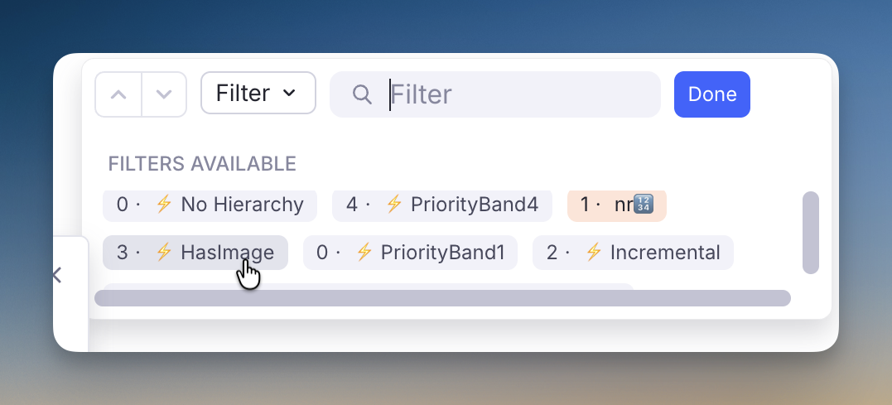{ width="700" }

**Collect them anywhere.** A **Search Portal** on the `HasImage` tag gathers every tagged Rem into one place — useful for building a figure index across documents, and combinable with another tag or a document in the query to narrow it down. This is the whole-KB scan's payoff: with the tag applied everywhere, one portal is a live index of every image in the knowledge base.

#### What counts as an image

Any image element in a Rem's **front text or back text** — pasted, dragged, added with `/image`, or extracted from a PDF. Image-occlusion Rems count too, since the occlusion is drawn on an ordinary image element. An image sitting only on the **back of a flashcard** is found, which a purely visual scan of the outline would miss.

#### Re-running it

The command is **idempotent and self-correcting**. On every run it also *removes* the tag from Rems inside the scope that carry it but no longer hold an image — so deleting a figure and re-running leaves no stale mark behind. Rems **outside** the scanned scope are never touched, so a scoped run cannot disturb tags applied in other documents (only a whole-KB run reaches them).

Only Rems whose state actually changes are written to, which is what makes a re-scan of a large document cheap.

#### How long it takes — the first whole-KB run is slow

**Finding the images is fast. Applying the tags is not.** Reading every Rem in a large knowledge base takes seconds; writing a tag costs a round trip to RemNote, and those happen one at a time. So the cost of a run is set almost entirely by **how many tags it has to write**, not by how many Rems it looks at.

Measured on a knowledge base of **413,000 Rems** holding **23,000 images**:

| Run | Writes | Time |
| --- | --- | --- |
| Reading every Rem, before any tagging | — | **~10 seconds** |
| First whole-KB run, tagging everything it finds | 23,000 | **~30 minutes** |
| Every whole-KB run after that | ~0 | **~10 seconds** |
| One document (12,000 Rems, 1,200 images) | 1,200 | **~90 seconds** |

So the whole-KB scan is a **one-time cost**, and only on a knowledge base of that size — the write cost per tag also grows with the knowledge base, so a smaller one is disproportionately quicker. After the first pass there is nothing left to write, and a re-scan only has to write the handful of Rems whose images changed since. Day-to-day, run it on a document and it finishes while you watch.

If you would rather not sit through the first pass, run it **per document as you go**; the tag accumulates, and a whole-KB run afterwards finds most of the work already done.

!!! tip "Leave it running"
    The scan lives inside the popup, so keep it open. If you do close it, nothing breaks — the tags already written stay correct, and running the command again picks up where it left off.

#### Clearing the tag

**Remove `HasImage` Tags** (`quick: rmimg`) takes the tag **off** every Rem that carries it, in the focused Rem's subtree or across the whole knowledge base. It exists because a whole-KB scan can mark tens of thousands of Rems and RemNote offers no way to take a tag off in bulk.

**Nothing is lost.** The tag is derived from the images themselves, so **Tag Rems With Images** rebuilds it exactly — the same relationship *Remove All Priority Band Tags* has to *Refresh Priority Badges*. That is why there is no undo: re-running the scan *is* the undo.

The scopes and keys match the scan's, and it costs the same per tag — clearing 23,000 tags takes about as long as applying them, so prefer the document scope unless you really do want the tag gone everywhere.

#### The tag is invisible in the outline

`HasImage` is bookkeeping for the filter, not something to read. Its chip is hidden from the editor tag bar — precisely, by targeting that pill alone, so **your own tags on the same Rem stay visible**. You will still see `HasImage` where it matters: in the document's Filter list.

#### Pins that lead to an image are ringed

A **pin** is drawn with a hairline ring saying where it leads, so you can pick the right one without following any of them — useful in an extract, where the plugin leaves both a reference to the parent it came from *and* a pin to the PDF highlight:

| Ring | The pin leads to |
|------|------------------|
| **Blue** | a Rem holding an **image** — a figure in your own notes |
| **Yellow** | a **text highlight** in a PDF or web article — the source passage |
| **Yellow + blue** | a **PDF area highlight** — a clipped figure from the source |
| none | an ordinary Rem |

Yellow means *"this leads into a source document"* and blue means *"you will land on an image"*, so an area highlight — which is both — carries both colours, one per edge. The rings brighten when you hover one or edit the Rem.

{ width="900" }

> **Off by default.** Turn on **Enable Pin Reference Colour Rings** (Plugin Settings → *Editor Indicators*) to get them. Two of the three states depend on tags this scan writes, so the feature is opt-in rather than something a knowledge base wakes up wearing. With the setting off, pins are left completely unmarked — including the priority-band border the highlight styling would otherwise draw on them. Every colour the plugin uses is catalogued in the [Colour Coding Reference](Colour-Coding-Reference.md).

This is the second thing the [image scan](#filter-a-document-by-images) buys you, and it needs the scan to have run: the ring keys on the tag, so it appears on a pin only once its target has been tagged, and disappears when a re-scan clears the tag from a Rem whose image is gone.

{ width="800" }

The pin next to it in that screenshot shows the two markers are independent: the **orange dotted box** is the [priority band](Prioritization-&-Sorting.md) of the linked highlight, the **blue ring** is "leads to an image". A pin can carry both.

**The ring shares its box with the priority band.** Pins to highlights also carry the [priority band](Prioritization-&-Sorting.md) marker of the linked highlight, which sets the **bottom and right** edges. Rather than avoid that, the ring takes the **top and left** — so an extracted highlight's pin shows one box, half band colour and half ring colour, instead of two nested ones. On an area highlight the top edge is yellow and the left is blue for exactly this reason: those are the two edges that survive when a band is present. All three rings are **solid**, keeping them clear of the band marker's dotted and dashed vocabulary.

The blue ring is drawn in RemNote's **accent** colour — the same one the app uses for links and selection, which reads correctly on something that *is* a navigation target. It was neutral grey at first, on the theory that hue is already spoken for in this plugin ([priority bands](Prioritization-&-Sorting.md) own the red→green ramp, `#pdfextract` is blue, `#incremental` green); in practice a grey hairline around an 18px icon in running text was invisible until hovered, which is no marker at all. The accent can't be confused with any of those, because this ring is an **outline on an icon** — never a background fill, never a left border — and it appears on nothing but pins. There is no fill either, so a pin sitting inside a highlighted extract never paints over the highlight's own colour, and both colours come from RemNote's own border tokens, so the ring follows light and dark mode.

**Why an area highlight is worth its own state.** When you clip a *region* of a PDF instead of selecting its text, RemNote stores the **image** on the highlight Rem in place of the text — an **area highlight**. It is a highlight *and* an image, which is why it wears both colours rather than a third one of its own.

What identifies one is that the Rem holds an image **and nothing else** — no caption, no prose. That matters, because *adding* a figure to an ordinary text highlight is common, and such a Rem holds an image and is a highlight, yet is not an area highlight; it keeps the blue ring. The scan decides this and records it as **`PdfAreaHighlight`**, since "image and nothing else" is a property of the Rem's text that no filter or stylesheet can inspect on its own.

{ width="800" }

**The two tags are mutually exclusive.** An area highlight carries `PdfAreaHighlight` and *not* `HasImage`; every other Rem holding an image carries `HasImage`. Tagging area highlights with both would make `HasImage` a complete list of every figure, which is tidier to filter — but RemNote collapses two or more tags into a **"N tags" chip** that no rule can hide without also hiding your own tags, and that clutter is not worth a filter you would rarely run on a highlights document. So: filter `HasImage` for figures in your notes, `PdfAreaHighlight` for clippings from a source. `PdfAreaHighlight`'s chip is hidden from the tag bar exactly like `HasImage`'s.

Two consequences worth knowing: caption an area highlight and the next scan swaps its tags — `PdfAreaHighlight` off, `HasImage` on — and the ring turns blue; and a Rem holding only an image that did **not** come from a PDF, a figure pasted into your own notes, gets `HasImage` and stays blue, since the yellow means "this leads into the source document".

> **Only image pins.** Pins to ordinary Rems are left alone. Ringing *every* pin was tried and says nothing — a marker that appears on all of them carries no information.

---

## Queue Display Utilities

A collection of powerups and commands incorporated into Incremental RemNote (originally from the standalone **Hide in Queue** plugin), plus three new powerups — **Remove Parent**, **Remove Grandparent** and **Hide Front Extras** — that improve how parent/ancestor Rems and card details are rendered during queue review.

---

### Activation

The 5 powerups originally from the Hide in Queue plugin (Hide in Queue, Remove from Queue, No Hierarchy, Hide Parent, Hide Grandparent) are gated by the **Enable Hide-in-Queue powerups and commands** setting in Plugin Settings.

> ⚠️ **Important.** Only enable this setting if you do **NOT** have the standalone Hide in Queue plugin installed. The powerup codes are identical, and RemNote throws a fatal `Duplicated powerup` error if both plugins try to register the same code — Incremental RemNote will fail to load. If you currently use the standalone plugin, uninstall it first, then enable the setting and reload RemNote.

The three new powerups — **Remove Parent**, **Remove Grandparent** and **Hide Front Extras** — are always registered regardless of the setting. They have no equivalent in the standalone plugin, so they cannot collide with it; and the [Cloze](IR-Flow--Reading-Extracting-and-Clozing.md) and [Extract](IR-Flow--Reading-Extracting-and-Clozing.md) creators apply Remove Parent automatically to newly-created Rems.

---

### Hide in Queue (`hiq`) { #hide-in-queue }

Tag any Rem with **Hide in Queue** (using the command). Its content will be replaced on the front of descendant flashcards with "Hidden in queue":

* The content of the tagged Rem is hidden, but *the bullet point itself remains visible*.
* Instead of the text, a ghosted/faded label saying **"Hidden in queue"** appears next to the bullet.
* **Visual result:** The user still sees the structural indentation and knows that something is there, but the actual information is obscured during the question phase. Good for hiding hints, spoilers, or context that would make retrieving the answer trivial.

**Editor:**


**Queue:**


#### Create Extract — Source Rem Hiding Behavior

When you create an Extract (`Alt+Shift+X`), the source Rem is automatically tagged so it doesn't show up redundantly during review of the extract. The plugin picks one of two strategies depending on what's available:

- **Preferred path — Remove from Queue on the source.** If the Remove from Queue powerup is registered (either via the **Enable Hide-in-Queue powerups and commands** setting above or via the standalone Hide in Queue plugin), it's applied directly to the source Rem. This survives extract relocation cleanly: if you later delete the source and let extracts stand on their own, the powerup goes with the source.
- **Fallback path — Remove Parent on the extract.** If Remove from Queue isn't registered (neither integration enabled nor standalone plugin installed), Remove Parent is applied to the *extract* instead. This works for normal review, but has a caveat: if you later move the extract under a different parent, that new parent will also be hidden. To recover, remove the powerup manually from the extract — or enable the Hide-in-Queue integration so future extracts land in the preferred path.

The cloze creator (`Alt+Z`) does **not** branch like this — it always applies Remove Parent to the newly-created cloze Rem, because clozes are tightly bound to their source via the pinned reference and aren't typically relocated independently.

---

### Remove from Queue (`rfq`)

Tag any Rem with **Remove from Queue** (using the command). Its content will be completely removed from the flashcard's visual hierarchy of its descendants.

* Not only is the text gone, but any child Rems underneath it are pulled to the left, essentially collapsing the space.
* **Visual result:** It looks exactly as if that intermediate Rem never existed in your document hierarchy at all.

**Editor:**

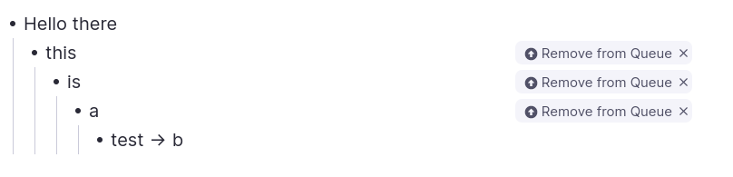

**Queue:**

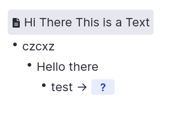

#### Hide in Queue vs. Remove from Queue

- **Hide in Queue (`hiq`):** content is hidden, but the bullet point structure remains visible with a "Hidden in queue" ghosted label. Use when you want to acknowledge the structural presence of a parent but obscure its text.
- **Remove from Queue (`rfq`):** the Rem is completely removed from the visual hierarchy (`display: none`), and any children are shifted left to fill its space. Use to erase an intermediate parent level entirely as if it never existed.

---

### No Hierarchy (`nh`)

Tag any Rem with **No Hierarchy** (using the command). Any ancestors will be hidden on the front and back of the flashcard.

**Editor:**

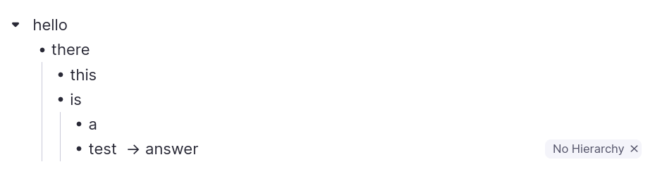

**Queue:**

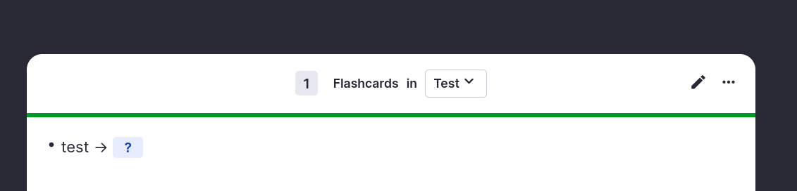

---

### Hide Parent (`hp`)

Tag any Rem with **Hide Parent** (using the command `Hide Parent` or `/hp`). Its immediate parent will be hidden on the front of the flashcard, but revealed on the back.

Similar to **Hide in Queue**, but instead of tagging the parent Rem, the user tags the specific flashcard Rem — so other flashcard descendants of the same parent Rem are *not* affected.

**Editor:**

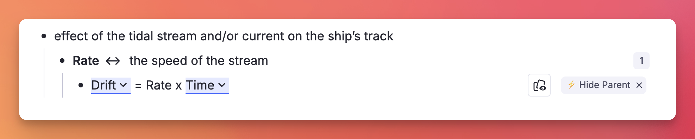

**Queue:**

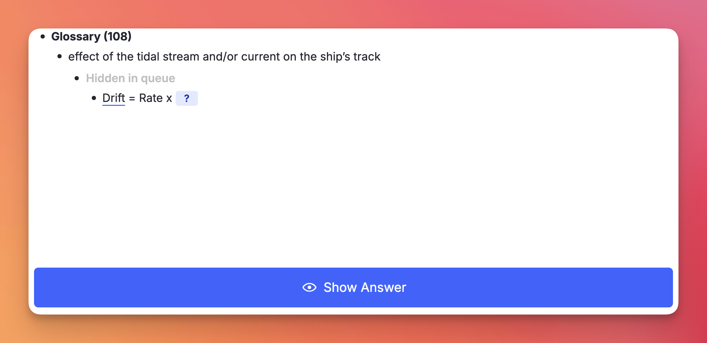

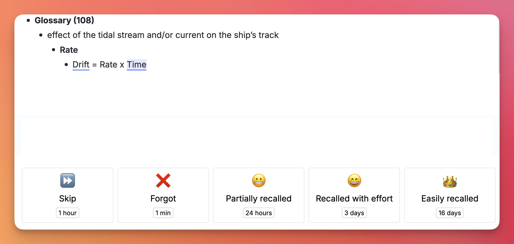

---

### Hide Grandparent (`hgp`)

Tag any Rem with **Hide Grandparent** (using the command `Hide Grandparent` or `/hgp`). Its grandparent will be hidden on the front of the flashcard, but revealed on the back.

**Editor:**

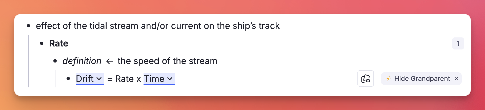

**Queue:**

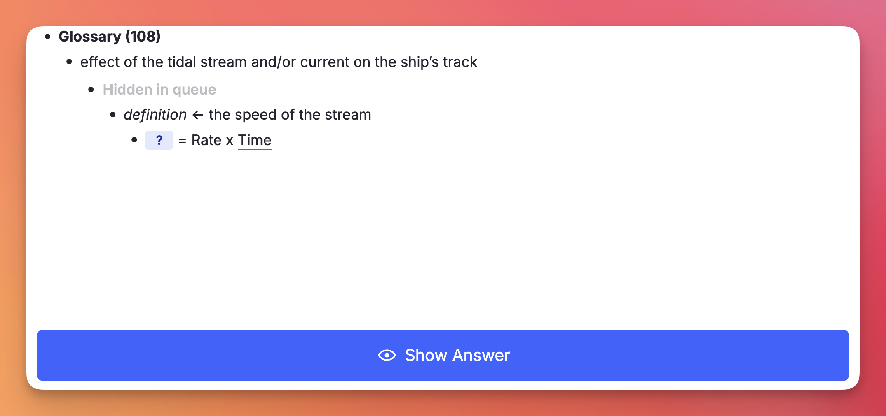

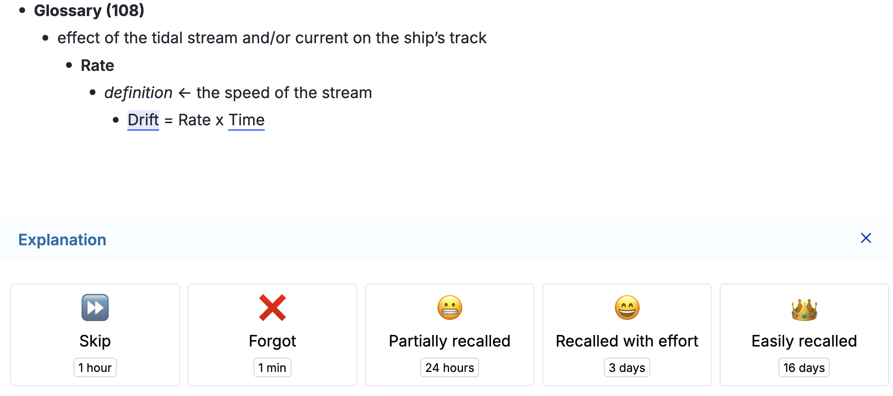

---

### Remove Parent (`rp`) — New

Like **Hide Parent**, but more aggressive: the immediate parent is **completely removed** from the queue display on **both the front and back** of the card — no "Hidden in queue" placeholder, no indented blank space.

The cloze creator (`Alt+Z`) applies this powerup automatically to the newly-created cloze Rem, so the source Rem isn't shown redundantly during review **without** also affecting other descendant flashcards (e.g. Descriptor children) that need the parent visible for context.

The extract creator (`Alt+Shift+X`) uses Remove Parent only as a **fallback**, when the **Remove from Queue** powerup isn't available. See [Create Extract behavior](#create-extract-source-rem-hiding-behavior) for the full rule.

You can also apply Remove Parent manually to any flashcard via the **Remove Parent** command or `/rp`.

---

### Remove Grandparent (`rgp`) — New

Same as Remove Parent, but one level higher: the grandparent is fully removed from the queue display on both front and back of the card.

Apply via the **Remove Grandparent** command or `/rgp`.

---

### Hide Front Extras (`hfe`) — New { #hide-front-extras }

Hides the **table properties displayed on the front** of the tagged flashcard. They still appear on the back.

#### Where "front extras" come from

There is only one way a RemNote card ends up with extra content on its question side: a **table** whose column has **flashcard generation enabled**, configured with **Extra Properties to Show on Front of Card**. Those properties are then printed above the question of *every* card that column generates — one row's worth per card.


The setting lives in the column's ⋮ menu → **Flashcard Configuration → Configure Cards**. In the screenshot, the *Definition* column (how RemNote shows the backside of the rem in tables) generates the cards, and **Book**, **Context** and **Hint** were chosen to show on the front (with *Extra*, *Mnemonic recall*, *Page* and *Chapter* on the back).

By far the most common way to end up with such a table is the **Anki importer** with **"Import notes with multiple fields into a table"** enabled: each Anki field becomes a column, and the context fields (Book, Source, Chapter, Hint…) are naturally mapped to the front of the card.


#### The problem it solves

The front-extras setting is made **per column**, so it applies to every row alike. That is usually what you want — until one row's property happens to *be* the answer:


Here the *Book* property, shown for context, prints `MSC.192(79), 2004` right above a question asking **which** IMO resolution that is. Turning the setting off on the column would strip the useful context from all the other rows.

#### Applying it

Tag the **flashcard Rem itself** (the table row) — from the queue or the editor, via the **Hide Front Extras (Table Properties)** command, `/hfe`, or the tag menu:


Only that card is affected. Every other card from the same table keeps showing its front properties.

#### Result

The properties are gone from the question stage…


…and come back when you press **Show Answer**, so you keep the context while grading:


> **Why No Hierarchy doesn't do this.** Front extras are not ancestors. They render as their own block beside the question, so [No Hierarchy](#no-hierarchy-nh) — which hides the content of the ancestor Rems — leaves them fully visible. The two powerups are complementary and can be applied to the same card.

---

### Queue Support

All commands above can be triggered directly while reviewing a flashcard in the Queue, without needing to switch to the editor:

- **No Hierarchy, Hide Parent, Hide Grandparent, Remove Parent, Remove Grandparent, Hide Front Extras:** automatically apply the powerup directly to the current card.
- **Hide in Queue and Remove from Queue:** since these are designed to be applied to *parent/ancestor* Rems rather than the flashcard itself (applying them to the current card would make the card vanish), triggering them in the queue opens a confirmation prompt offering to apply the powerup to the card's parent instead.

---

## Cleaning Up

---

### Delete Empty Extra Card Detail Rems

**`Delete Empty Extra Card Detail Rems`** (`quick: decd`) finds Rems tagged **Extra Card Detail** that hold *nothing at all*, and deletes them once you have confirmed the count.

#### Why they exist

They come from **Anki imports**. Anki's *Extra* / *Back Extra* field is HTML, where a paragraph break is a structural element rather than a character. An importer that maps that field onto RemNote's **Extra Card Detail** powerup therefore creates a child Rem for every `<br>` and `</p>` — and the ones carrying no text arrive as Rems holding literally nothing.

In the outline they are easy to miss — a pair of blank bullets among the green ECD ones, betrayed only by the `✎ ✕` controls sitting on otherwise empty rows:

{ width="800" }

In the **queue** they are not missable, because every item shown has to be named and these have no name — so each one surfaces as **Unnamed** while you review.

#### Why the normal search cannot find them

RemNote's search indexes **text**, and these Rems have none. Neither `Ctrl+F` nor a query can isolate a Rem by its emptiness.

Asking the **Extra Card Detail** powerup for its members does not work either — RemNote does not expose membership for its *built-in* powerups, so that list comes back nearly empty on a knowledge base full of them. (The same limitation shows up elsewhere in this plugin, with PDF Highlights and uploaded files.)

So the command works by **walking the scope and asking each Rem directly** whether it carries the powerup. That sounds expensive and is not, because of the order it works in: whether a Rem is blank is readable without asking RemNote anything, so the blank test runs first and reduces a whole knowledge base to the few Rems worth a question.

#### How to use it

Run it from the omnibar. Two scopes, as with the image scan:

* **This Rem and its descendants** — the focused Rem, or the open document when the cursor is not in a Rem.
* **The whole knowledge base** — every Extra Card Detail Rem there is.

**The scan writes nothing.** It reports what it found and waits; nothing is deleted until you press the red button.

#### What counts as empty

The bar is set high on purpose, because this command *deletes*.

!!! warning "Blank text is not the same as empty"
    Some Rems hold **no text at all and are still doing something** — a **portal** is the clearest case: it has no text of its own because it is a window onto other Rems, and its contents are not its children either, so neither a text test nor a child test notices it. The signal is the Rem's *type*, which is why the checks below start there. This was found the hard way, by a scan that offered a portal as "safe to delete".

A Rem is only a candidate when **every one** of these holds:

* **It is a plain Rem.** Not a **portal**, not a **table** (nor a row or cell of one), and not a **Concept**, **Descriptor**, slot, powerup property or document. A typed Rem with no text is someone's unfinished structure, not import debris.
* **It carries no other RemNote powerup.** Every built-in powerup is asked about individually, because several of them — **divider**, **embedded website**, **search portal**, **code block**, **uploaded file**, **table of contents** — render real content while holding no text at all, and RemNote does not list built-in powerups among a Rem's tags.
* **No text and no back text.** Blank means blank after whitespace, `&nbsp;` and zero-width characters are discounted — but an image, a Rem reference, LaTeX, audio, a drawing or an annotation counts as content even with no letters around it. Purely cosmetic formatting (bold, italic, highlight, colour) on nothing is still nothing; a **cloze**, a **link** or a **comment** is not, even when it renders as empty.
* **No children.** Deleting a Rem takes its descendants with it, so a blank Rem with anything underneath it is never touched.
* **It displays nothing.** Asked directly whether it includes any Rem the way a portal does — a second guard behind the type check, since this is the mistake with the worst consequences.
* **No tag or powerup other than Extra Card Detail.** Anything else is a mark somebody put there deliberately.
* **Nothing references it**, it has **no flashcards of its own**, **no source**, and **no alias**.

Anything that fails a check is **kept and counted**, with the reason shown — so a run that deletes fewer Rems than you expected explains itself rather than leaving you guessing.

#### Confirming before the delete

The review screen gives you the numbers first:

* the **funnel** — how many Rems were walked, how many hold nothing, and how many of *those* carry Extra Card Detail — so a surprising result shows you which stage it narrowed at,
* how many are completely empty and safe to delete,
* how many were kept, broken down by reason,
* a **sample of what will go**, listed by the Rem each blank sits under — so you can recognise the documents involved before agreeing,
* a rough estimate of how long deleting will take.

`Enter` deliberately does **not** trigger the delete. It ran the scan on the previous screen, and carrying that reflex into an irreversible action is the mistake the two-stage flow exists to prevent — the red button has to be clicked.

#### If you need something back

**A manifest is written before anything is deleted.** Every candidate's id, and the id and text of the Rem it sits under, are saved to this device *and* offered as a **JSON file download**. If neither can be written, the run stops and deletes nothing — the same rule the [card-priority migration](Changelog.md) follows.

That manifest is the recovery path worth relying on. The Rems themselves hold nothing, so what you would ever need back is the knowledge that one existed and *where* — which is exactly what it records. Every id is also written to the developer console before removal.

Whether RemNote's own trash retains plugin-deleted Rems is not something this page will promise; treat the manifest as the backup and, for a large run, take a knowledge-base export first.

#### How long it takes

The **scan is quick**, even across a whole knowledge base: reading every Rem takes seconds, the blank test costs nothing on top of that, and only the blank Rems pay for a question to RemNote. **Deleting is the slow part**, at roughly a tenth of a second per Rem, because RemNote applies deletions one at a time. The review screen estimates it before you commit; a few hundred Rems is under a minute, and several thousand is worth starting when you can leave the popup open.

!!! tip "Leave it running"
    The work lives inside the popup. Closing it mid-delete stops the run — Rems already deleted stay deleted, and running the command again clears the rest.

---

### Card Enablement Audit { #card-enablement-audit }

**`Audit Card Enablement (tagged / referencing / descendants)`** takes one anchor Rem, asks every Rem in its orbit whether it actually produces flashcards, and lets you switch the broken ones back on in bulk.

#### The problem it solves

A Rem can look exactly like a flashcard — a front, a back, a cloze — and generate **nothing**. There are several ways that happens, and RemNote shows none of them in the outline:

* the **flashcard direction** is set to `none`, so neither the forward nor the backward card exists;
* **Enable Cards** is off on the Rem itself;
* an ancestor carries **Disable Descendant Cards**;
* the Rem is a **table** or sits inside one — RemNote ships table rows with cards off;
* the cards were switched off **one at a time** in the queue.

The one that arrives in bulk is the first. An **Anki import** can land hundreds of Rems at `enablePractice=true, practiceDirection=none` — they read as perfectly ordinary flashcards and are simply never scheduled.

!!! warning "These Rems are invisible to every other tool"
    A Rem whose direction was set to `none` before any card was made owns **no card records at all**. It therefore produces no rows in the card table, which is what the [Suppressed Cards](Prioritization-&-Sorting.md#suppressed-cards) breakdown is built from — so no amount of filtering there will ever show it. RemNote's own search cannot express the question either, because there is no text to match on.

    This audit works the other way round: it starts from a **set of Rems** and asks each one what it generates. A Rem with no cards at all is a result, not an absence.

#### Choosing what to audit

The anchor is the focused Rem (or the document you ran the command from). Four checkboxes decide the population, and they combine freely:

* **Tagged with it** — every instance of the anchor used as a tag.
* **Referencing it** — every Rem whose text links to the anchor.
* **Its descendants** — the anchor itself and everything underneath it.
* **Expand each match** — add every match's own subtree.

That last one is usually what reaches an imported deck: the tag or the reference sits on the container, while the Rems that own the cards are its children.

#### Reading the results

Each Rem gets one **verdict**, shown as a coloured chip you can click to filter the list. The panel opens showing the two that are worth hunting.

| Verdict | Meaning | Fixable here |
| --- | --- | --- |
| `dir=none` | Has card material, practice is on, no direction enabled | ✅ |
| `practice off` | **Enable Cards** is off on the Rem | ✅ |
| `table` | The Rem is a table or sits in one | ✅ |
| `ancestor off` | An ancestor carries **Disable Descendant Cards** | ❌ — untag the ancestor |
| `paused deck` | Inside a paused deck | ❌ — unpause the deck |
| `not surfaced` | Nothing surfaces and no Rem-level flag explains it | ❌ — a per-card switch, or the markup is gone |
| `no material` | No back side, no clozes, no card records | ❌ — not a flashcard |
| `OK` | Producing cards | — |

Every row shows both the cards currently **surfaced** and the card **records** that exist, as `surfaced/records`. Those two numbers are what separate a Rem whose cards were switched off from one that never had any — `rem.getCards()` alone cannot tell them apart.

The verdicts are ordered by what a fix would actually accomplish, so a Rem under a disabling ancestor is reported as `ancestor off` rather than `dir=none`: setting a direction there writes the flag and still produces nothing.

#### Fixing them

Tick the rows you want — the panel pre-selects exactly the fixable ones in the default filter — pick an action, and apply.

* **Set flashcard direction** → `forward` (the default), `both`, `backward` or `none`.
* **Switch cards ON** / **Switch cards OFF**.

`↑`/`↓` move, `Space` selects, `A` selects everything shown, `Enter` applies, `Esc` closes.

!!! danger "Enabling cards creates cards"
    A Rem at `direction=none` that never had a card gets a **brand-new one**, with no repetition history and a due date of *now*. Fixing three hundred imported rows drops three hundred new cards straight into your queue.

    The **card priority** field beside the action exists for this: tick it and every Rem the run enables also gets that priority, so the new cards enter the queue where you chose instead of wherever they would have inherited from. See [Priorities for Flashcards](Priorities-for-Flashcards.md).

After the run the panel reports how many cards **actually appeared** — read back from the Rems, not predicted, since whether a direction change revives an old card record or mints a new one is RemNote's decision.

#### Undoing

The current state of every Rem — its **Enable Cards** flag and its **direction** — is captured *before* the first write, offered as a JSON download, and restorable with **Undo last apply** in the panel.

!!! tip "Try a handful first"
    Select five rows and apply. The report tells you exactly how many cards that produced, which is the honest way to find out what a run over the whole deck will do to your queue before you commit to it.

---

## Under the Hood

Not a utility — infrastructure that several of the commands above depend on.

### Omnibar Selection Recovery

Internally, the plugin runs a small editor-selection cache so that commands invoked via the `Cmd+/` Omnibar can still access the multi-rem selection you had before opening the palette. (Without this, RemNote blurs the editor when the Omnibar opens, and a plugin command's `getSelection()` call comes back empty — `Add Tag`-style internal commands sidestep this by capturing the selection synchronously when the palette opens, but plugins have no equivalent hook.)

Commands that benefit from this recovery:

- **Make Incremental (Extract)** / **Extract with Priority** — multi-rem `Make Incremental` works from `Cmd+/`.
- **Dismiss Incremental Rem** — multi-rem dismissal works from `Cmd+/`.
- **Paste Rem Sources** — pasting onto multiple target rems works from `Cmd+/`.
- **Text Case Converter** — multi-rem case cycling works from `Cmd+/`.
- **Restructure Outline by Headings** — multi-rem restructure works from `Cmd+/`.

The cache has a 30-second TTL and is only written on positive selection events, so opening the Omnibar (which fires a clear-selection event) doesn't wipe what you just selected.
